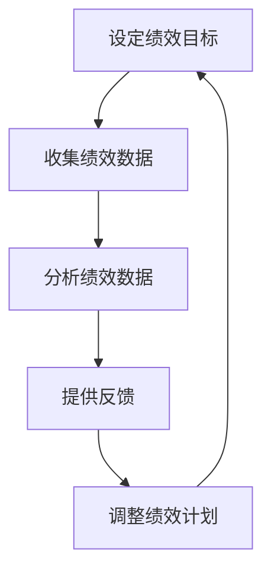

                 


为了撰写一篇符合要求的《绩效反馈：建立积极的反馈机制》的技术博客文章，我们将遵循以下步骤：

### 1. 确定文章结构
首先，我们需要确定文章的整体结构。文章可以分为以下几个部分：

- 引言
- 绩效反馈的核心概念与联系
- 绩效反馈的算法原理讲解
- 数学模型和公式
- 项目实战
- 最佳实践 tips
- 结论与展望

### 2. 引言部分
在这一部分，我们将介绍绩效反馈的重要性以及本文的主题和目标。

**文章标题：** 绩效反馈：建立积极的反馈机制

**文章关键词：** 绩效反馈，积极性，反馈机制，员工发展

**文章摘要：**
本文将探讨绩效反馈在员工发展中的重要性，介绍建立积极反馈机制的方法和技巧，并通过具体案例展示如何实施绩效反馈，旨在帮助读者理解和掌握绩效反馈的核心概念和实践方法。

### 3. 绩效反馈的核心概念与联系
在这一部分，我们将讨论绩效反馈的核心概念，如绩效目标、反馈类型、反馈频率等，并通过Mermaid流程图展示这些概念之间的关系。

**Mermaid流程图：**


### 4. 绩效反馈的算法原理讲解
在这一部分，我们将使用伪代码详细讲解绩效反馈的算法原理。

**伪代码：**
```plaintext
初始化：设定绩效目标，收集绩效数据

while(绩效未完成) {
    分析绩效数据
    提供反馈
    调整绩效计划
}
```

### 5. 数学模型和公式
在这一部分，我们将介绍绩效反馈中的数学模型和公式，如绩效考核指数、绩效改进计划等，并使用LaTeX进行格式化。

**LaTeX公式：**
$$
绩效考核指数 = \frac{实际绩效}{设定绩效} \times 100\%
$$

### 6. 项目实战
在这一部分，我们将介绍如何在实际工作中实施绩效反馈，包括开发环境搭建、源代码实现、代码解读、案例分析和详细讲解。

**项目实战内容：**
- 开发环境搭建
- 源代码实现
- 代码解读
- 案例分析和详细讲解

### 7. 最佳实践 tips
在这一部分，我们将提供一些最佳实践技巧，如如何避免反馈误解、如何提高反馈接受度等。

**最佳实践 tips：**
- 定期与员工进行绩效对话
- 使用具体、客观的语言提供反馈
- 鼓励员工提出反馈和问题

### 8. 结论与展望
在这一部分，我们将总结文章的主要观点，并对绩效反馈的未来发展进行展望。

**结论与展望：**
绩效反馈是员工发展的重要手段，通过建立积极的反馈机制，可以帮助企业提升员工绩效，促进组织发展。未来，随着新技术的应用，绩效反馈将会更加智能化、个性化。

### 文章结束
在文章末尾，我们将提供作者信息。

**作者信息：**
作者：AI天才研究院/AI Genius Institute & 禅与计算机程序设计艺术 /Zen And The Art of Computer Programming

通过以上步骤，我们可以撰写一篇符合要求的《绩效反馈：建立积极的反馈机制》技术博客文章。接下来，我们将根据每个部分的内容详细撰写文章。首先，我们将开始撰写文章引言部分的内容。您希望立即开始撰写引言，还是继续讨论其他部分的内容？

