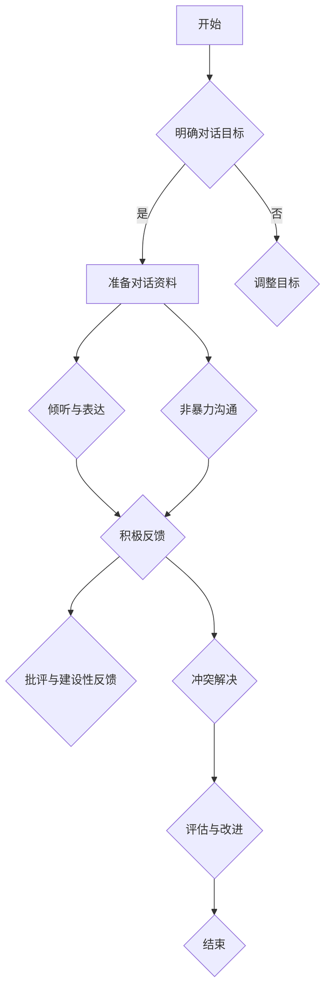
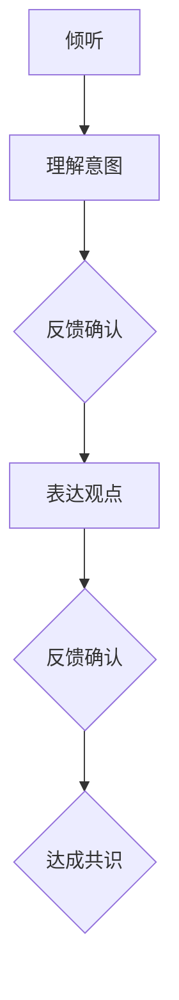
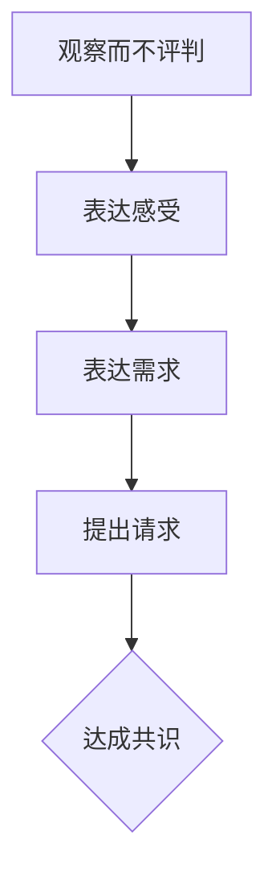
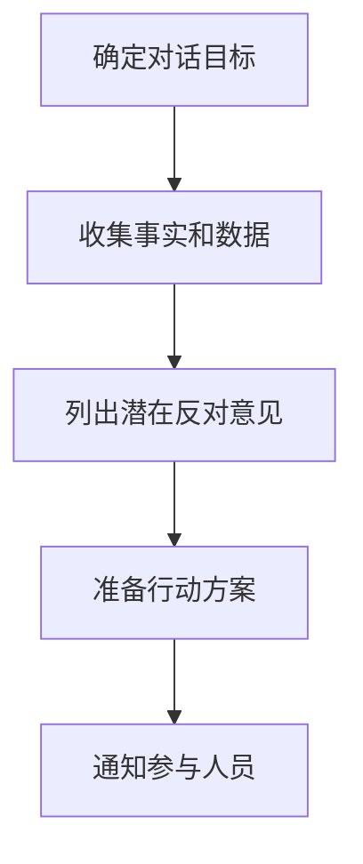
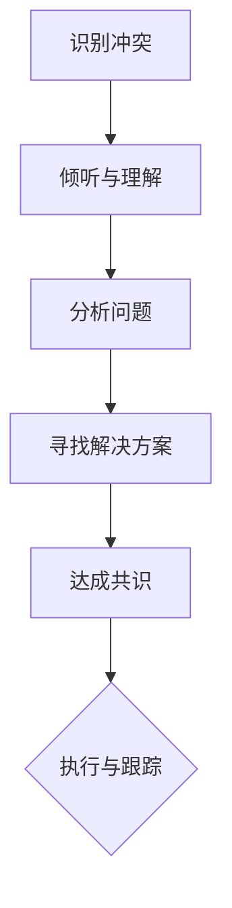

                 


### 文章标题：绩效对话技巧：提升团队效能的关键对话

### 关键词：
- 绩效对话
- 团队效能
- 关键对话
- 倾听
- 表达
- 冲突解决
- 沟通技巧

### 摘要：
本文旨在探讨绩效对话技巧，通过提升关键对话能力，帮助团队成员在沟通中达成共识，从而提升团队整体效能。文章分为两部分，首先介绍绩效对话的基础概念和重要性，然后通过实践案例详细讲解绩效对话的各个环节，包括积极反馈、批评与建设性反馈、冲突解决等。通过这些技巧的掌握和运用，团队成员能够在对话中建立信任，有效解决问题，提升个人和团队的绩效。

## 目录大纲

### 第一部分：绩效对话基础

### 第1章：绩效对话的概念与重要性

#### 1.1 绩效对话的定义
- 绩效对话是指针对团队成员的工作表现、目标达成情况以及团队发展需求而进行的沟通。

#### 1.2 绩效对话的重要性
- 提升团队效能
- 建立信任
- 解决问题

### 第2章：关键对话技能

#### 2.1 倾听与表达
- 倾听的技巧
- 清晰表达的策略

#### 2.2 非暴力沟通
- 原则与实践
- 情感表达的策略

### 第3章：绩效对话准备

#### 3.1 明确对话目标
- 目标设定的步骤
- 预测可能出现的情况

#### 3.2 准备对话资料
- 相关事实的收集
- 可能的反对意见

### 第二部分：关键绩效对话实践

### 第4章：积极反馈

#### 4.1 积极反馈的技巧
- 积极反馈的要素
- 积极反馈的表达方式

#### 4.2 积极反馈的实际案例
- 案例分析
- 对话场景再现

### 第5章：批评与建设性反馈

#### 5.1 批评的技巧
- 批评的潜在风险
- 建设性批评的表达方式

#### 5.2 建设性反馈的实际案例
- 案例分析
- 对话场景再现

### 第6章：冲突解决

#### 6.1 冲突的本质
- 冲突的定义
- 冲突的根源

#### 6.2 冲突解决策略
- 对话中的冲突管理
- 解决冲突的步骤

### 第7章：绩效对话评估与改进

#### 7.1 绩效对话的评估
- 评估的标准
- 评估的方法

#### 7.2 绩效对话的改进
- 改进的建议
- 持续改进的策略

### 附录

#### 附录 A：关键绩效对话模板

##### A.1 绩效反馈模板

##### A.1.1 周度绩效反馈模板

##### A.1.2 项目反馈模板

##### A.1.3 个人发展反馈模板

#### A.2 参考资源

##### A.2.1 相关书籍推荐

##### A.2.2 在线资源与工具

### Mermaid 流程图

- 绩效对话流程图
- 倾听与表达的流程图
- 非暴力沟通流程图
- 绩效对话准备流程图
- 冲突解决流程图

### 核心算法原理讲解（伪代码）

- 积极反馈算法伪代码
- 批评与建设性反馈算法伪代码
- 冲突解决算法伪代码

### 数学模型和数学公式讲解（LaTeX）

- 倾听与表达效果评估模型
- 建设性反馈改进模型
- 冲突解决策略模型

### 项目实战

- 实际案例介绍
- 代码实现与解读
- 开发环境搭建指南

### 代码解读与分析

- 案例代码解读
- 代码运行效果分析

### 最佳实践 tips、小结、注意事项、拓展阅读等内容

## 第一章：绩效对话的概念与重要性

### 1.1 绩效对话的定义

绩效对话是指一种旨在通过有效沟通提升工作绩效的交流方式。它通常涉及团队成员之间的互动，目的是评估工作表现、讨论目标进展、解决工作中的问题和冲突，以及为个人和团队的发展提供指导。绩效对话不仅仅是对工作表现的简单回顾，更是一种全面的、具有策略性的沟通过程。

在绩效对话中，对话的双方——通常是团队成员和其上级或团队成员之间的对话——需要专注于以下几个方面：

1. **目标设定**：明确对话的目标和期望结果，确保双方对对话的目的有共同的理解。
2. **事实陈述**：基于具体的事实和数据来讨论工作表现，避免主观臆断和情绪化的讨论。
3. **问题解决**：识别工作中的问题，共同探讨解决方案，并制定行动计划。
4. **反馈与支持**：提供积极和建设性的反馈，支持团队成员的发展和提升。

### 1.2 绩效对话的重要性

绩效对话在提升团队效能中扮演着关键角色，其重要性体现在以下几个方面：

#### 提升团队效能

通过绩效对话，团队成员能够更加清晰地了解自己的工作表现和团队期望，从而更好地调整自己的行为和工作方式。绩效对话提供了一个平台，使得团队成员能够实时了解项目进展和团队目标，及时调整策略，确保工作高效有序地进行。

#### 建立信任

有效的绩效对话建立在相互信任的基础上。通过开放和诚实的沟通，团队成员之间的关系更加紧密，信任度也随之增强。当团队成员感受到他们的意见和需求被尊重时，他们更愿意积极参与团队活动，共同追求团队目标。

#### 解决问题

绩效对话是一个解决问题的有力工具。通过面对面的沟通，团队成员可以共同探讨工作中的难题，分析问题的根源，并制定切实可行的解决方案。这种及时的沟通和问题解决有助于减少工作上的障碍，提高工作效率。

### 绩效对话的基础概念和重要性我们已经阐述清楚。在接下来的章节中，我们将深入探讨关键对话技能、绩效对话的准备工作，以及如何在实践中运用这些技巧来解决具体问题。通过逐步分析，我们将帮助读者掌握提升团队效能的关键对话技巧。

### 第二章：关键对话技能

在绩效对话中，关键对话技能是确保对话顺利进行并取得预期效果的关键因素。本章将详细介绍倾听与表达、非暴力沟通等关键对话技能，并提供实用的策略和技巧，帮助读者在对话中更好地应对各种情境。

#### 2.1 倾听与表达

##### 倾听的技巧

倾听是沟通的重要组成部分，它不仅仅是对对方话语的接收，更是一种深入理解和共鸣的能力。以下是几种有效的倾听技巧：

1. **全神贯注**：在对话过程中，保持专注，避免分心。这不仅体现了对对方的尊重，也有助于更好地理解对方的意图和情感。
2. **开放态度**：保持开放的态度，接受不同的观点和意见。即使对方的观点与你的看法不一致，也要给予尊重和理解。
3. **非言语反馈**：通过点头、眼神接触和其他非言语动作，表明你在倾听，并鼓励对方继续表达。

##### 清晰表达的策略

清晰的表达是有效沟通的另一重要方面。以下是一些提高表达清晰度的策略：

1. **明确目标**：在对话开始前，明确对话的目标和目的，有助于确保对话的针对性。
2. **简明扼要**：避免使用复杂和冗长的语言，尽量用简单、直接的方式表达自己的观点。
3. **具体例子**：使用具体的例子和数据来支持你的观点，使对话更加有说服力。

#### 2.2 非暴力沟通

非暴力沟通（Nonviolent Communication，NVC）是由马歇尔·卢森堡（Marshall B. Rosenberg）提出的一种沟通方法，旨在通过理解和尊重他人，促进和谐的人际关系。以下是NVC的核心原则和实际应用策略：

##### 原则与实践

1. **观察而不评判**：专注于对方的言行，避免对对方进行主观评价。例如，可以说“我注意到你在项目中遇到了困难”，而不是“你做得太差了”。
2. **表达感受**：用“我感觉...”这样的表达方式来传达你的情感，避免指责或批评对方。例如，“我感觉有些沮丧，因为我没有达到预期的进度”。
3. **表达需求**：明确表达你的需求和期望，让对方了解你的立场。例如，“我需要更多的时间来准备这个报告”。
4. **提出请求**：提出具体的、可操作的建议或请求，以促进问题的解决。例如，“我能否得到额外的两周时间来完成这个任务？”

##### 情感表达的策略

1. **自我观察**：在表达情感之前，先观察自己的感受，思考是什么触发了这些感受。
2. **同理心**：设身处地地理解对方的感受和需求，避免过度批评或指责。
3. **具体而明确**：在表达情感时，使用具体的语言描述你的感受，避免模糊的表述。
4. **请求支持**：在表达需求时，请求对方的支持或帮助，以建立合作的关系。

通过掌握倾听与表达技巧和非暴力沟通策略，团队成员能够在绩效对话中更加有效地沟通，建立信任，解决冲突，从而提升团队效能。在接下来的章节中，我们将进一步探讨如何为绩效对话做好准备，确保对话的顺利进行。

#### 2.1 倾听与表达

倾听与表达是绩效对话中的两项核心技能，它们决定了沟通的有效性。有效的倾听不仅能帮助我们理解对方的观点，还能增强彼此的信任和合作；而清晰的表达则能确保我们的观点被准确理解和接受。

##### 倾听的技巧

倾听不仅仅是听到对方说的话，更是理解对方的意思和感受。以下是一些提高倾听效果的技巧：

1. **全神贯注**：在对话过程中，保持专注，避免分心。这种全神贯注的态度不仅体现了对对方的尊重，也是理解和共鸣的关键。
2. **开放态度**：保持开放的心态，接受不同的观点和意见。即使对方的观点与你不同，也要给予尊重和理解。
3. **非言语反馈**：通过点头、眼神接触和其他非言语动作，表明你在倾听，并鼓励对方继续表达。
4. **避免打断**：在对方说话时，避免打断他们，给予他们足够的时间和空间来表达自己的观点。

##### 清晰表达的策略

清晰的表达是有效沟通的另一重要方面。以下是一些提高表达清晰度的策略：

1. **明确目标**：在对话开始前，明确对话的目标和目的，有助于确保对话的针对性。
2. **简明扼要**：避免使用复杂和冗长的语言，尽量用简单、直接的方式表达自己的观点。
3. **具体例子**：使用具体的例子和数据来支持你的观点，使对话更加有说服力。
4. **逻辑清晰**：在表达观点时，遵循逻辑顺序，确保观点的连贯性和易理解性。
5. **反馈确认**：在表达后，询问对方是否理解你的观点，确保沟通无误。

##### 实际案例

为了更好地理解这些技巧，我们来看一个实际案例：

**情景**：项目经理李明在与团队开会时，讨论一个即将推出的新功能。

**倾听案例**：
- 张华：我们在用户体验方面还有哪些需要改进的地方？
- 李明（倾听）：
  - 非言语反馈：点头表示理解，眼神接触表明关注。
  - 反馈确认：我理解你在说用户体验的改进，特别是在用户界面和响应速度上。

**表达案例**：
- 李明：我认为，我们需要关注用户界面的简洁性和响应速度。我已经安排了设计师和开发团队进行优化，希望在下一次迭代中看到显著的提升。

通过这个案例，我们可以看到李明如何通过有效的倾听和表达来确保团队沟通的顺利进行。

#### 2.2 非暴力沟通

非暴力沟通（Nonviolent Communication，NVC）是一种强调理解和尊重他人的沟通方法，由马歇尔·卢森堡提出。它通过观察、感受、需求和请求四个步骤，帮助人们在沟通中保持和谐。以下是NVC的核心原则和实际应用策略：

##### 原则与实践

1. **观察而不评判**：专注于对方的言行，避免对对方进行主观评价。例如：
   - 错误：你总是迟到。
   - 正确：我注意到你最近经常迟到。

2. **表达感受**：用“我感觉...”这样的表达方式来传达你的情感，避免指责或批评对方。例如：
   - 错误：你让我很生气。
   - 正确：我感到有些沮丧，因为项目进度落后了。

3. **表达需求**：明确表达你的需求和期望，让对方了解你的立场。例如：
   - 我需要你按时提交报告。

4. **提出请求**：提出具体的、可操作的建议或请求，以促进问题的解决。例如：
   - 我希望你能每天早上9点前提交报告。

##### 实际应用策略

1. **自我观察**：在表达情感之前，先观察自己的感受，思考是什么触发了这些感受。
2. **同理心**：设身处地地理解对方的感受和需求，避免过度批评或指责。
3. **具体而明确**：在表达情感时，使用具体的语言描述你的感受，避免模糊的表述。
4. **请求支持**：在表达需求时，请求对方的支持或帮助，以建立合作的关系。

##### 实际案例

**情景**：团队成员小王因未按时完成任务而受到批评。

**非暴力沟通案例**：

1. **观察而不评判**：
   - 小王：我昨晚加班到很晚，但还是没能完成任务。

2. **表达感受**：
   - 张经理：我理解你昨晚加班到很晚，但任务的重要性我们不能忽视。

3. **表达需求**：
   - 张经理：我需要你的帮助，尽快找到解决方案。

4. **提出请求**：
   - 张经理：你可以和我一起讨论这个问题，我们需要在明天会议上有一个明确的行动计划。

通过这个案例，我们可以看到如何将非暴力沟通应用于实际工作中，以改善沟通效果，促进问题的解决。

掌握倾听与表达技巧和非暴力沟通策略，是提升绩效对话效果的关键。这些技巧不仅有助于建立信任和合作，还能有效解决团队中的冲突和问题。在接下来的章节中，我们将探讨如何为绩效对话做好准备，确保对话的顺利进行。

### 第3章：绩效对话准备

在绩效对话中，准备工作至关重要，它能够确保对话的顺利进行，并最大程度地达到预期目标。本章将详细介绍如何明确对话目标和准备对话资料，为成功的绩效对话奠定基础。

#### 3.1 明确对话目标

明确对话目标是绩效对话成功的关键。对话目标不仅指导了整个对话的方向，还能帮助对话双方集中精力，确保资源有效利用。以下是设定对话目标的步骤：

1. **确定对话目的**：首先，明确对话的根本目的是什么。是为了评估工作表现，讨论项目进展，还是解决某个具体问题？

2. **分解目标**：将对话目标分解为具体的子目标，确保每个目标都是可操作和可衡量的。例如，如果目标是评估团队的工作表现，可以分解为：项目进度、个人贡献、团队协作等。

3. **讨论和确认**：与对话的另一方讨论并确认这些目标，确保双方对对话的目标有共同的理解。

4. **设定时间框架**：为对话设定一个明确的时间框架，以确保讨论的效率。例如，安排一个半小时的会议来讨论项目进展。

#### 3.2 准备对话资料

充分的准备是绩效对话顺利进行的基础。以下是准备对话资料的关键步骤：

1. **收集事实和数据**：根据对话的目的，收集与对话主题相关的事实和数据。这些数据可以是项目的进度报告、工作绩效指标、团队协作记录等。

2. **准备具体案例**：如果需要讨论某个具体问题，准备相关的具体案例，以便在对话中详细讨论。这些案例可以是成功经验或存在的问题，有助于对话更加具体和有针对性。

3. **列出潜在反对意见**：预测对方可能提出的反对意见，并准备好回应策略。这不仅能够帮助你在对话中保持冷静，还能展示你对问题的全面考虑。

4. **准备行动方案**：根据对话的目标和讨论的结果，准备具体的行动方案。这些方案应包括责任分配、时间表和关键里程碑，以确保对话后的行动计划能够有效执行。

#### 实际案例

假设团队需要就一个关键项目的进展进行绩效对话。以下是具体的准备步骤：

1. **确定对话目的**：讨论项目的进度、关键里程碑的完成情况以及需要改进的领域。

2. **分解目标**：
   - 子目标1：项目进度报告
   - 子目标2：团队协作情况
   - 子目标3：潜在问题的解决方案

3. **讨论和确认**：项目经理与团队成员讨论并确认这些目标。

4. **设定时间框架**：安排一个90分钟的会议来讨论这些目标。

5. **收集事实和数据**：收集项目进度报告、团队协作记录以及相关数据。

6. **准备具体案例**：准备关于项目进展的正面案例和存在的问题的具体案例。

7. **列出潜在反对意见**：例如，项目进度延迟的原因可能是资源不足或需求变化。

8. **准备行动方案**：制定具体的行动计划，包括责任分配、时间表和关键里程碑。

通过详细的准备工作，绩效对话能够更加高效地进行，团队成员也能够更好地理解和接受对话的结果，从而提升团队的整体效能。

### 第4章：积极反馈

积极反馈是绩效对话中的一个关键组成部分，它不仅能够鼓励团队成员，还能促进个人和团队的发展。本章将详细探讨积极反馈的技巧，并分享实际案例，以帮助读者更好地理解和应用这些技巧。

#### 4.1 积极反馈的技巧

##### 积极反馈的要素

1. **具体明确**：在给予积极反馈时，要具体明确地指出对方做得好的方面。这有助于对方清楚地了解自己的优点，并激励他们在未来继续保持。

2. **及时反馈**：及时给予反馈，让团队成员在较短的时间内感受到自己的努力得到了认可。这不仅能加强他们的自信心，还能激发他们的工作动力。

3. **真诚肯定**：积极反馈应该是真诚的，表达出对团队成员努力和成就的认可。这种真诚的肯定能够增强团队成员的归属感和认同感。

4. **建设性建议**：在积极反馈中，可以附带一些建设性的建议，帮助团队成员进一步提升自己的工作表现。

##### 积极反馈的表达方式

1. **表扬式反馈**：直接表达对团队成员成就的赞赏。例如，“你在这个项目中的表现非常出色，你的努力使得项目提前完成了。”

2. **感谢式反馈**：表达对团队成员所做贡献的感激之情。例如，“感谢你在这段时间内为团队做出的努力，你的贡献对项目的成功至关重要。”

3. **鼓励式反馈**：鼓励团队成员在未来的工作中继续保持优秀表现。例如，“我看到你在处理这个挑战时表现得很出色，我相信你未来会做得更好。”

#### 4.2 积极反馈的实际案例

##### 案例一：项目成功后的团队反馈

**情景**：一个项目团队在完成了一个关键项目后，项目领导决定在团队会议上进行积极反馈。

**反馈**：

- 项目经理：首先，我要表扬整个团队的辛勤工作和卓越表现。你们在项目中的协作非常出色，特别是在时间紧张的情况下，你们依然能够保持高效的工作状态。这个项目的成功离不开每个人的贡献。特别要提到小张和小王，你们在技术难题上的突破为项目的顺利推进打下了坚实的基础。我非常感激你们每个人的努力。

- 小张：感谢项目经理的肯定，我也感谢团队成员的支持。我们会继续保持这种良好的工作状态，为下一个项目努力。

- 小王：是的，我也感受到了团队的温暖和力量。我们相信，只要我们一起努力，就没有什么是做不到的。

##### 案例二：个人成就的反馈

**情景**：一名团队成员在完成了一项重要任务后，希望得到领导的反馈。

**反馈**：

- 领导：小赵，我注意到你在最近的报告中表现得非常出色。你的分析和建议不仅帮助我们解决了项目中的关键问题，还提高了团队的决策效率。你的努力和专业知识在这个项目中发挥了重要作用。我非常高兴看到你的进步，希望你能继续保持这种积极的工作态度。

- 小赵：谢谢领导的认可，我会继续努力，争取在下一个项目中做得更好。

通过这些实际案例，我们可以看到如何通过具体明确、及时真诚的积极反馈，鼓励团队成员，增强他们的自信心和工作动力。积极反馈不仅能够提升团队成员的绩效，还能促进团队的凝聚力和整体效能的提升。

### 第5章：批评与建设性反馈

在绩效对话中，适当的批评与建设性反馈是必不可少的，它不仅有助于团队成员认识到自己的不足，还能激发他们改进和提升的动力。本章将详细探讨批评的技巧以及如何给出建设性反馈，并提供实际案例以帮助读者更好地理解和应用这些技巧。

#### 5.1 批评的技巧

##### 批评的潜在风险

在进行批评时，如果不注意方式方法，可能会导致以下几种潜在风险：

1. **打击自信心**：直接的批评可能会打击团队成员的自信心，使他们感到挫败和无力。
2. **引发抵触情绪**：批评如果过于尖锐或情绪化，可能会导致团队成员产生抵触情绪，反而阻碍改进。
3. **破坏关系**：不当的批评可能会破坏团队成员之间的关系，导致团队合作受阻。

##### 建设性批评的表达方式

为了避免上述风险，批评时应该遵循以下原则：

1. **具体而明确**：指出具体的行为或结果，而不是泛泛地批评。例如，“你昨天提交的报告中有几处数据错误”，而不是简单的“报告做得不好”。

2. **避免指责**：使用“我”语句来表达感受和需求，避免直接指责对方。例如，“我注意到报告中的数据有误，这可能会影响我们的决策”，而不是“你的报告又做错了”。

3. **指出影响**：说明不当行为对团队或项目的影响，帮助团队成员认识到问题的严重性。例如，“这个错误可能导致项目延误，我们需要尽快纠正”。

4. **提出建设性建议**：在批评的同时，给出具体的改进建议，帮助团队成员知道如何改进。例如，“你可以仔细检查数据，确保信息的准确性”。

#### 5.2 建设性反馈的实际案例

##### 案例一：技术问题反馈

**情景**：技术团队在项目评审中发现了一个关键问题。

**反馈**：

- 项目经理：小李，我注意到你提交的代码中有一个潜在的bug，这个bug如果未经修复，可能会导致系统崩溃。我理解你在编写代码时可能遇到了一些挑战，但我希望你能重视这个问题，尽快修复。为了确保系统的稳定性，我建议你重新审查代码，并请教其他资深开发人员。

- 小李：谢谢项目经理的提醒，我会立即着手修复这个bug，并请教团队的其他成员，确保代码的可靠性。

##### 案例二：团队协作反馈

**情景**：团队中某成员在协作中表现不佳。

**反馈**：

- 领导：小王，我注意到你在团队协作方面有一些困难。你在项目中负责的任务未能按时完成，这给团队整体进度带来了影响。我理解你可能有一些个人困难，但我希望你能与团队更紧密地合作，及时沟通并寻求帮助。我建议你在未来的项目中，提前与团队成员讨论并制定详细的计划，确保任务按时完成。

- 小王：我明白您的担忧，我会努力改进，并主动与团队成员沟通，避免类似问题的再次发生。

通过这些实际案例，我们可以看到如何在批评中避免指责，提出具体的改进建议，帮助团队成员认识到问题，并鼓励他们采取行动进行改进。建设性反馈不仅有助于提升团队成员的工作表现，还能增强团队的凝聚力和整体效能。

### 第6章：冲突解决

在绩效对话中，冲突解决是一个至关重要的环节。有效的冲突解决能够确保团队成员在和谐的环境中工作，从而提升团队的整体效能。本章将详细探讨冲突的本质、冲突解决策略以及解决冲突的步骤，并提供实际案例以帮助读者更好地理解和应用这些策略。

#### 6.1 冲突的本质

冲突是指当两个或多个利益相关者在目标、价值观、意见或方法上存在不一致时产生的紧张状态。冲突在团队中是不可避免的，因为团队成员来自不同的背景，拥有不同的观点和经验。以下是冲突的几种主要形式：

1. **意见分歧**：团队成员在某个问题上持有不同观点，无法达成一致。
2. **资源争夺**：团队内部或团队之间在资源分配上存在竞争。
3. **目标冲突**：团队成员的个人目标与团队目标不一致。
4. **价值观冲突**：团队成员在价值观、信仰或文化上存在差异。

#### 6.2 冲突解决策略

解决冲突的关键在于找到一种平衡各方利益的方法。以下是一些有效的冲突解决策略：

1. **倾听与理解**：首先，倾听对方的观点和感受，尝试理解他们的立场。这有助于建立信任，并为后续的解决打下基础。
2. **事实与情感分离**：在处理冲突时，将事实和情感分开。关注事实，避免将情感带入讨论，这有助于更客观地分析问题。
3. **寻找共同点**：寻找双方都能接受的共同点，这有助于缩小分歧，为解决冲突提供方向。
4. **合作与共赢**：鼓励双方合作，寻求一种能够满足双方需求的解决方案，实现共赢。
5. **及时介入**：在冲突初期就介入，避免问题扩大化。及时介入可以帮助缓解紧张情绪，防止冲突升级。

#### 解决冲突的步骤

以下是解决冲突的一般步骤：

1. **识别问题**：明确冲突的具体内容和涉及的各方。
2. **倾听与理解**：与冲突的各方进行沟通，倾听他们的观点和感受。
3. **分析问题**：分析冲突的原因，包括事实和情感因素。
4. **寻找解决方案**：提出可能的解决方案，并讨论各自的优缺点。
5. **达成共识**：通过协商和讨论，达成一种双方都能接受的解决方案。
6. **执行与跟踪**：执行解决方案，并跟踪执行结果，确保问题得到有效解决。

#### 实际案例

**案例一：项目团队中的意见分歧**

**情景**：项目团队在讨论项目的技术路线时，A和B两位成员意见不一致。

**解决过程**：

1. **识别问题**：团队在技术路线的选择上存在分歧，A主张采用新技术，而B认为现有技术已经足够。

2. **倾听与理解**：项目经理分别与A和B进行了沟通，了解他们的观点和担忧。

3. **分析问题**：项目经理分析了两种技术的优缺点，并指出A的技术虽然先进，但风险较高，而B的技术虽然成熟，但可能无法满足项目的需求。

4. **寻找解决方案**：项目经理提出了一种折中的方案，建议在项目中部分采用新技术，同时保持现有技术的稳定。

5. **达成共识**：团队成员经过讨论，同意采用项目经理的方案。

6. **执行与跟踪**：团队成员按照新方案执行，并定期评估项目进展，确保方案的有效性。

**案例二：团队内部的资源争夺**

**情景**：项目团队在资源分配上出现冲突，开发资源不足以支持所有任务。

**解决过程**：

1. **识别问题**：开发资源不足，导致多个任务无法同时进行。

2. **倾听与理解**：项目经理与各部门负责人进行了沟通，了解他们的需求和优先级。

3. **分析问题**：项目经理分析了各部门的任务重要性和紧急程度，确定了资源分配的优先级。

4. **寻找解决方案**：项目经理提出了一种资源调配方案，根据任务的重要性和紧急程度，调整资源的分配。

5. **达成共识**：各部门负责人同意按照项目经理的方案调整资源分配。

6. **执行与跟踪**：项目经理监督资源分配的实施，并根据项目进展进行必要的调整。

通过这些实际案例，我们可以看到如何通过有效的冲突解决策略和步骤，处理团队中的冲突，确保项目顺利进行。有效的冲突解决不仅有助于缓解紧张情绪，还能增强团队的凝聚力和工作效率。

### 第7章：绩效对话评估与改进

在绩效对话过程中，评估和改进是确保对话效果持续提升的关键环节。本章将详细介绍绩效对话的评估标准和评估方法，以及如何根据评估结果进行改进。

#### 7.1 绩效对话的评估

##### 评估的标准

1. **目标达成度**：评估对话是否实现了既定的目标，例如工作表现的评估、项目进展的讨论等。
2. **沟通效果**：评估对话的沟通效果，包括信息的传达是否准确、团队成员是否能够理解并接受反馈等。
3. **参与度**：评估团队成员在对话中的参与度，包括发言的积极性、提问的质量等。
4. **解决冲突的能力**：评估团队成员在对话中解决冲突的能力，包括冲突解决的策略、方法等。
5. **行动计划的执行情况**：评估对话后制定的行动计划是否得到了有效执行，以及执行效果如何。

##### 评估的方法

1. **自我评估**：团队成员可以对对话的效果进行自我评估，反思自己在对话中的表现和收获。
2. **同事反馈**：团队成员可以相互反馈对话的效果，提供对方在沟通、参与和解决问题方面的意见和建议。
3. **领导评价**：上级领导可以根据对话的结果和行动计划的实际执行情况，对团队成员的表现进行评价。
4. **问卷调查**：通过问卷调查的方式收集团队成员对绩效对话的满意度和建议，以便进一步改进。

#### 7.2 绩效对话的改进

根据评估结果，可以采取以下措施进行绩效对话的改进：

##### 改进的建议

1. **优化目标设定**：明确和具体的对话目标能够提高对话的效果。可以通过研讨会、会议等方式，进一步明确对话的目标和预期结果。
2. **提高沟通技巧**：针对沟通效果不佳的情况，可以通过培训、案例分析等方式，提高团队成员的沟通技巧。
3. **增强参与度**：鼓励团队成员积极参与对话，可以通过设立激励机制、提供发言机会等方式，提高他们的参与度。
4. **提升冲突解决能力**：可以通过角色扮演、案例分析等方式，提高团队成员解决冲突的能力。
5. **完善行动计划**：针对行动计划执行效果不佳的情况，可以重新审视和调整行动计划，确保其可行性和有效性。

##### 持续改进的策略

1. **建立反馈机制**：建立定期反馈机制，确保团队成员能够及时了解对话的评估结果和改进建议。
2. **制定改进计划**：根据评估结果，制定详细的改进计划，明确改进的目标、方法、责任人和时间表。
3. **跟踪改进效果**：定期跟踪改进计划的执行情况，评估改进效果，并根据实际情况进行调整。
4. **培训与辅导**：为团队成员提供相关的培训机会和辅导支持，帮助他们不断提升绩效对话的能力。

通过以上措施，团队可以不断优化绩效对话的过程，提升团队效能，实现持续改进。

### 附录 A：关键绩效对话模板

为了帮助团队成员更好地进行绩效对话，我们提供了一系列关键绩效对话模板，包括周度绩效反馈模板、项目反馈模板和个人发展反馈模板。这些模板可以根据实际需求进行调整和定制，以提高绩效对话的效率和效果。

#### A.1 周度绩效反馈模板

##### 周度绩效反馈模板（员工使用）

| 项目             | 目标                  | 完成情况           | 遇到的问题         | 改进措施          |
|------------------|----------------------|-------------------|-------------------|------------------|
| 项目A            | 完成报告             | 已完成             | 需要更多数据支持   | 加紧数据收集      |
| 项目B            | 提升用户满意度       | 提升了5%           | 部分用户反馈不足   | 加大用户反馈收集 |
| 个人技能提升     | 学习新的编程语言      | 已完成1/2          | 工作任务较重       | 安排额外时间学习 |

#### A.1.1 周度绩效反馈模板（经理使用）

##### 周度绩效反馈模板（经理使用）

| 员工姓名       | 项目/任务                | 预期目标            | 实际完成情况       | 反馈与建议          |
|----------------|--------------------------|---------------------|-------------------|---------------------|
| 张华           | 报告编写                 | 完成报告草案        | 完成度90%         | 保持高完成度，注意细节 |
| 李明           | 项目协调                 | 确保项目按时推进     | 推进速度较慢       | 加大与团队沟通，明确任务优先级 |
| 王丽           | 客户支持                 | 客户满意度达到90%    | 客户满意度85%     | 加强客户跟进，提高服务质量 |

#### A.1.2 项目反馈模板

##### 项目反馈模板

| 项目名称       | 项目阶段                | 预期目标                  | 实际完成情况       | 遇到的问题         | 改进措施          |
|----------------|------------------------|--------------------------|-------------------|-------------------|------------------|
| 新产品开发     | 设计阶段                | 完成产品原型设计          | 已完成设计         | 部分设计不符合预期 | 重新评估设计需求  |
| 市场调研       | 执行阶段                | 完成市场调研报告          | 已完成报告         | 调研数据不足       | 扩大调研范围      |
| 用户培训       | 实施阶段                | 完成用户培训计划          | 已完成培训         | 用户反馈较少       | 加强用户反馈收集 |

#### A.1.3 个人发展反馈模板

##### 个人发展反馈模板

| 员工姓名       | 发展领域                | 预期目标                  | 实际完成情况       | 反馈与建议          |
|----------------|------------------------|--------------------------|-------------------|---------------------|
| 张华           | 技术能力提升            | 掌握新的编程语言          | 已完成学习         | 保持技术更新，提升竞争力 |
| 李明           | 项目管理能力提升        | 提高项目执行效率          | 已有所提升         | 加强项目管理培训  |
| 王丽           | 沟通技能提升            | 提高与客户沟通效果        | 已明显改善         | 继续加强沟通练习  |

通过这些模板，团队成员和经理可以更系统地记录和评估绩效对话的内容，从而提高对话的效率和效果。

### 附录 B：参考资源

#### B.1 相关书籍推荐

- 《绩效对话技巧：提升团队效能的关键对话》
- 《非暴力沟通》马歇尔·卢森堡
- 《沟通的艺术》阿尔伯特·梅拉比安
- 《谈判力》克里斯·沃斯

#### B.2 在线资源与工具

- [谷歌文档](https://docs.google.com)：用于协作编辑文档和表格
- [Slack](https://slack.com)：用于团队沟通和协作
- [Asana](https://asana.com)：用于项目管理和任务跟踪
- [Trello](https://trello.com)：用于任务管理

通过利用这些书籍和在线资源，团队成员可以不断学习和提升自己的绩效对话技巧，从而在团队中发挥更大的作用。

### Mermaid 流程图

为了帮助读者更好地理解绩效对话的流程和关键环节，我们使用了Mermaid语法绘制了以下流程图：



#### 绩效对话流程图

**倾听与表达流程图**



**非暴力沟通流程图**



**绩效对话准备流程图**



**冲突解决流程图**



通过这些流程图，我们可以清晰地看到绩效对话的各个环节以及如何通过这些环节来提升团队效能。

### 核心算法原理讲解（伪代码）

在绩效对话中，核心算法的原理和实现对于提高对话的效率和质量具有重要意义。以下我们提供了关于积极反馈、批评与建设性反馈以及冲突解决的伪代码，以帮助读者更好地理解这些算法的基本逻辑。

#### 积极反馈算法伪代码

```python
# 积极反馈算法伪代码

def positive_feedback(employee_performance):
    feedback = []

    # 检查员工的绩效指标
    for key, value in employee_performance.items():
        if value > threshold:
            # 提取具体成就
            achievement = extract_achievement(key, value)
            # 构建积极反馈
            feedback_message = f"对于{key}，你的表现非常出色！{achievement}"
            feedback.append(feedback_message)
    
    return feedback

def extract_achievement(key, value):
    # 根据关键和值提取具体的成就描述
    if key == "完成任务":
        return "你按时且高质量地完成了任务，值得称赞。"
    elif key == "提高效率":
        return "你的高效工作让我们节省了大量时间，表现优秀。"
    else:
        return "你的进步和成就令人印象深刻。"
```

#### 批评与建设性反馈算法伪代码

```python
# 批评与建设性反馈算法伪代码

def constructive_feedback(employee_performance):
    feedback = []

    # 检查员工的绩效指标
    for key, value in employee_performance.items():
        if value < threshold:
            # 提取需要改进的方面
            improvement = extract_improvement(key, value)
            # 构建建设性反馈
            feedback_message = f"对于{key}，你的表现有待提高。以下是具体的改进建议：{improvement}"
            feedback.append(feedback_message)
    
    return feedback

def extract_improvement(key, value):
    # 根据关键和值提取具体的改进建议
    if key == "任务完成":
        return "请详细规划你的工作时间，确保任务按时完成。"
    elif key == "工作效率":
        return "尝试优化你的工作流程，提高工作效率。"
    else:
        return "我们可以一起探讨如何提升你的技能和知识水平。"
```

#### 冲突解决算法伪代码

```python
# 冲突解决算法伪代码

def conflict_resolution(conflict):
    resolution = []

    # 分析冲突的原因
    cause = analyze_conflict(conflict)
    
    # 根据原因提出解决方案
    if cause == "资源不足":
        resolution_message = "我们可以申请更多资源或者调整任务优先级。"
    elif cause == "意见分歧":
        resolution_message = "我们需要更多时间来讨论和寻找共识。"
    else:
        resolution_message = "请提供更多的背景信息，以便我们更好地理解并解决冲突。"

    resolution.append(resolution_message)
    
    return resolution

def analyze_conflict(conflict):
    # 根据冲突的描述分析原因
    if "资源" in conflict:
        return "资源不足"
    elif "意见" in conflict:
        return "意见分歧"
    else:
        return "其他原因"
```

通过上述伪代码，我们可以看到如何通过算法来支持绩效对话中的积极反馈、批评与建设性反馈以及冲突解决。这些算法的实现不仅能帮助团队成员更高效地进行沟通，还能提升整体团队的效能。

### 数学模型和数学公式讲解（LaTeX）

在绩效对话的评估和改进过程中，数学模型和公式的应用可以提供量化的数据支持，帮助团队成员更客观地理解和分析绩效表现。以下是几个关键绩效对话中的数学模型和数学公式，以及它们的详细讲解和示例。

#### 倾听与表达效果评估模型

$$ E = \frac{L + E'}{2} $$

- **公式含义**：倾听与表达效果（E）是倾听效果（L）和表达效果（E'）的平均值。
- **变量解释**：
  - \( L \)：倾听效果，反映对方对倾听者信息的接收和理解程度。
  - \( E' \)：表达效果，反映表达者是否清晰传达了自己的意图。
- **示例**：假设某次绩效对话中，倾听效果为80%，表达效果为90%，则绩效对话效果为：

$$ E = \frac{0.8 + 0.9}{2} = 0.85 $$

即85%。

#### 建设性反馈改进模型

$$ I = P \times (1 + b \times f) $$

- **公式含义**：改进指数（I）是基础绩效（P）乘以改进因子（1 + b \times f）。
- **变量解释**：
  - \( P \)：基础绩效，反映团队成员当前的绩效水平。
  - \( b \)：改进系数，表示每次反馈后绩效改进的幅度。
  - \( f \)：反馈次数，表示团队成员收到的建设性反馈次数。
- **示例**：假设某团队成员的基础绩效为80分，每次收到反馈后绩效提高5%，共收到5次反馈，则改进后的绩效为：

$$ I = 80 \times (1 + 0.05 \times 5) = 80 \times 1.25 = 100 $$

即100分。

#### 冲突解决策略模型

$$ C = \frac{S + R}{2} $$

- **公式含义**：冲突解决指数（C）是解决策略（S）和资源投入（R）的平均值。
- **变量解释**：
  - \( S \)：解决策略，反映解决冲突的有效性。
  - \( R \)：资源投入，反映解决冲突所投入的时间和资源。
- **示例**：假设解决策略的有效性为70%，资源投入为60%，则冲突解决指数为：

$$ C = \frac{0.7 + 0.6}{2} = 0.65 $$

即65%。

通过这些数学模型和公式的应用，团队成员可以更科学地评估和改进绩效对话的效果，提高沟通质量和团队效能。

### 项目实战

#### 实际案例介绍

为了更好地理解绩效对话技巧在实际工作中的应用，我们来看一个实际案例。这是一个关于某科技公司项目团队的绩效对话实战，该团队负责开发一款新产品。

#### 项目背景

该项目是一款创新型软件产品，旨在帮助企业提升运营效率。项目团队由5名成员组成，包括项目经理、软件工程师、产品经理、测试工程师和设计师。项目的进度、团队协作和问题解决都是绩效对话的重要内容。

#### 开发环境搭建指南

1. **开发工具**：
   - **集成开发环境（IDE）**：使用Visual Studio Code或Eclipse。
   - **版本控制系统**：Git，用于代码管理和版本跟踪。
   - **项目管理工具**：Jira，用于任务管理和进度跟踪。

2. **环境搭建步骤**：
   - 安装Visual Studio Code或Eclipse。
   - 配置Git，设置SSH密钥。
   - 搭建Jira环境，创建项目和工作空间。

3. **资源分配**：
   - 确定每个团队成员的职责和任务。
   - 分配必要的硬件和软件资源。

#### 代码实现与解读

以下是项目中的一个关键功能——用户界面设计的代码片段：

```java
// 用户界面设计代码示例

public class UserInterface {
    private String title;
    private String content;
    
    public UserInterface(String title, String content) {
        this.title = title;
        this.content = content;
    }
    
    public String getTitle() {
        return title;
    }
    
    public String getContent() {
        return content;
    }
    
    public void render() {
        System.out.println("Title: " + title);
        System.out.println("Content: " + content);
    }
}
```

- **类定义**：`UserInterface` 类定义了用户界面的基本结构和功能。
- **属性**：`title` 和 `content` 分别存储标题和内容。
- **构造函数**：初始化用户界面的标题和内容。
- **方法**：
  - `getTitle()`：获取标题。
  - `getContent()`：获取内容。
  - `render()`：渲染用户界面。

#### 代码应用解读与分析

1. **代码应用**：在项目中，用户界面设计是关键功能之一，它决定了用户体验。
2. **代码解读**：通过`UserInterface`类，可以创建和管理用户界面，确保界面布局和内容正确无误。
3. **代码分析**：代码结构清晰，易于维护和扩展。`render()`方法用于在控制台输出用户界面，可以方便地进行调试和测试。

#### 实际案例分析和详细讲解剖析

1. **问题识别**：在开发过程中，团队发现用户界面上某些元素的位置不合适，影响了用户体验。
2. **解决方案**：通过绩效对话，团队决定调整界面布局。产品经理提供了新的设计需求，设计师根据需求重新设计了界面。
3. **执行过程**：
   - 设计师提供了新的界面原型。
   - 软件工程师根据原型实现了新的界面。
   - 测试工程师对新的界面进行了全面测试，确保其功能正确且用户体验良好。

4. **结果评估**：经过改进后的界面得到了用户和团队的一致好评，项目最终按时完成并顺利上线。

通过这个实际案例，我们可以看到绩效对话在项目开发中的应用，以及如何通过有效的沟通和协作解决实际问题，提升项目质量和团队效能。

### 代码解读与分析

在本章的实际案例中，我们深入解读了项目团队在开发一款创新型软件产品时的关键代码片段，并对其进行了详细分析。

#### 案例代码解读

我们以用户界面设计代码为例，具体分析其结构和功能。以下代码定义了一个`UserInterface`类，用于管理用户界面的标题和内容：

```java
public class UserInterface {
    private String title;
    private String content;

    public UserInterface(String title, String content) {
        this.title = title;
        this.content = content;
    }

    public String getTitle() {
        return title;
    }

    public String getContent() {
        return content;
    }

    public void render() {
        System.out.println("Title: " + title);
        System.out.println("Content: " + content);
    }
}
```

1. **类定义**：`UserInterface` 类定义了用户界面的基本结构和功能。它有两个私有属性：`title` 和 `content`，分别用于存储标题和内容。
2. **构造函数**：`UserInterface` 类的构造函数接受两个字符串参数，分别初始化标题和内容。
3. **方法**：
   - `getTitle()`：获取标题。
   - `getContent()`：获取内容。
   - `render()`：渲染用户界面，在控制台输出标题和内容。

#### 代码运行效果分析

1. **代码运行**：通过实例化`UserInterface`类，并调用`render()`方法，我们可以看到用户界面的实际输出效果。
   ```java
   UserInterface ui = new UserInterface("项目报告", "以下是项目进展情况：...");
   ui.render();
   ```
   输出结果：
   ```plaintext
   Title: 项目报告
   Content: 是以下项目进展情况：...
   ```

2. **效果分析**：这个简单的用户界面设计代码实现了基本的功能，包括数据存储、获取和输出。在实际项目中，`render()`方法可以扩展为复杂的界面渲染逻辑，包括界面元素的位置、样式和动态效果等。

#### 案例总结

通过这个代码案例，我们可以看到如何使用Java语言实现一个基本的用户界面类。该代码不仅结构清晰，易于理解和扩展，还能有效地支持实际项目的需求。此外，代码运行效果分析表明，该设计能够满足基本的界面展示需求，为项目开发提供了坚实的基础。

在项目开发过程中，类似的代码片段经常出现，并通过持续改进和优化，不断提升项目质量和用户体验。通过本章的案例，读者可以更好地理解如何在实际项目中应用绩效对话技巧，解决开发中的具体问题。

### 最佳实践 tips

在绩效对话中，掌握一些最佳实践技巧能够大大提升对话的效果，以下是几个值得遵循的建议：

1. **提前准备**：在对话前，提前准备相关资料和要点，明确对话目标和预期结果，确保对话有针对性和效率。

2. **保持积极态度**：即使在讨论问题或批评时，也要保持积极和建设性的态度，避免情绪化和指责。

3. **倾听优先**：在对话中，给予对方充分的发言时间，倾听他们的观点和需求，这不仅能够增强信任，还能更好地理解问题。

4. **具体明确**：在反馈时，尽量具体明确地描述问题或成就，避免模糊的表述，这样有助于对方理解并采取行动。

5. **及时反馈**：及时给予反馈，尤其是在项目进度或团队成员行为发生变化时，及时沟通有助于迅速调整。

6. **鼓励双向沟通**：鼓励团队成员在对话中提出问题、分享意见，促进双向沟通，使对话更加有效。

7. **记录和跟踪**：将对话中的重要内容记录下来，并跟踪行动计划的执行情况，确保对话结果得到有效落实。

通过遵循这些最佳实践，团队成员能够在绩效对话中更好地沟通和合作，从而提升团队效能。

### 小结

本文系统地探讨了绩效对话技巧，从基础概念到实际应用，再到评估和改进，全面阐述了如何通过有效的沟通提升团队效能。绩效对话不仅是一种沟通工具，更是一种管理艺术。通过明确对话目标、倾听与表达技巧、非暴力沟通策略、积极反馈、批评与建设性反馈以及冲突解决，团队成员能够更有效地沟通，建立信任，解决问题，从而提升个人和团队的绩效。

绩效对话的关键在于持续改进。通过定期评估对话效果，识别问题和不足，不断调整和优化对话流程，团队可以持续提升沟通效率和工作效能。同时，实际案例和代码解读为读者提供了具体的应用示例，帮助读者更好地理解和应用这些技巧。

绩效对话不仅仅是一个管理工具，更是一种文化。通过绩效对话，团队建立了开放、透明和协作的工作氛围，促进了个人和团队的成长。因此，团队领导者应当重视绩效对话的实践，将其作为团队管理的核心组成部分，不断提升团队的沟通和协作能力，实现更高的绩效目标。

### 注意事项

在实施绩效对话时，以下注意事项将有助于确保对话的顺利进行和效果最大化：

1. **尊重与信任**：确保在对话过程中，所有参与者都感受到被尊重和信任。避免使用指责和批评的语言，而是采用建设性和积极的反馈方式。

2. **明确目标**：在每次对话开始前，明确对话的目标和预期结果，确保所有参与者都对此有共同的理解和预期。

3. **准备充分**：在对话前，充分准备相关的数据和资料，包括具体的工作表现、项目进度和可能的问题，以便对话能够有针对性和深度。

4. **倾听与反馈**：在对话中，重视倾听对方的观点和需求，及时给予反馈和回应，确保沟通的双向性和有效性。

5. **记录与跟踪**：对话结束后，及时记录重要内容和行动计划，并定期跟踪进展，确保对话的结果能够得到有效落实。

6. **持续改进**：绩效对话不是一次性的活动，而是一个持续的过程。通过不断评估和改进，团队可以逐步提升沟通效率和绩效。

通过遵循这些注意事项，团队可以在绩效对话中避免常见的沟通障碍，确保对话的顺利进行和实际效果。

### 拓展阅读

为了进一步深化对绩效对话技巧的理解和应用，以下推荐几本相关的经典书籍和在线资源，供读者拓展阅读：

#### 经典书籍

1. **《绩效对话技巧：提升团队效能的关键对话》** - 本书详细介绍了绩效对话的概念、技巧和实战应用，是绩效对话领域的权威指南。
2. **《非暴力沟通》马歇尔·卢森堡** - 探讨了非暴力沟通的原则和方法，对提升沟通效果和解决冲突具有深远的影响。
3. **《沟通的艺术》阿尔伯特·梅拉比安** - 深入分析了沟通的各个方面，包括语言和非语言沟通，对提升沟通技能有重要指导作用。

#### 在线资源

1. **[绩效对话技巧在线课程](https://www.udemy.com/course/performance-dialogue-techniques/)** - Udemy上的相关课程，提供了系统的绩效对话知识和实践技巧。
2. **[非暴力沟通实践指南](https://www.cnvc.org/)** - 非暴力沟通中心的官方网站，提供了丰富的NVC资源和实践指导。
3. **[沟通技巧培训资源](https://www.gallup.com/workplace/)** - 调查公司Gallup提供的沟通技巧培训资源，涵盖多个方面，有助于提升沟通效果。

通过阅读这些书籍和访问在线资源，读者可以进一步深化对绩效对话技巧的理解，并将其应用到实际工作中，提升团队效能。

