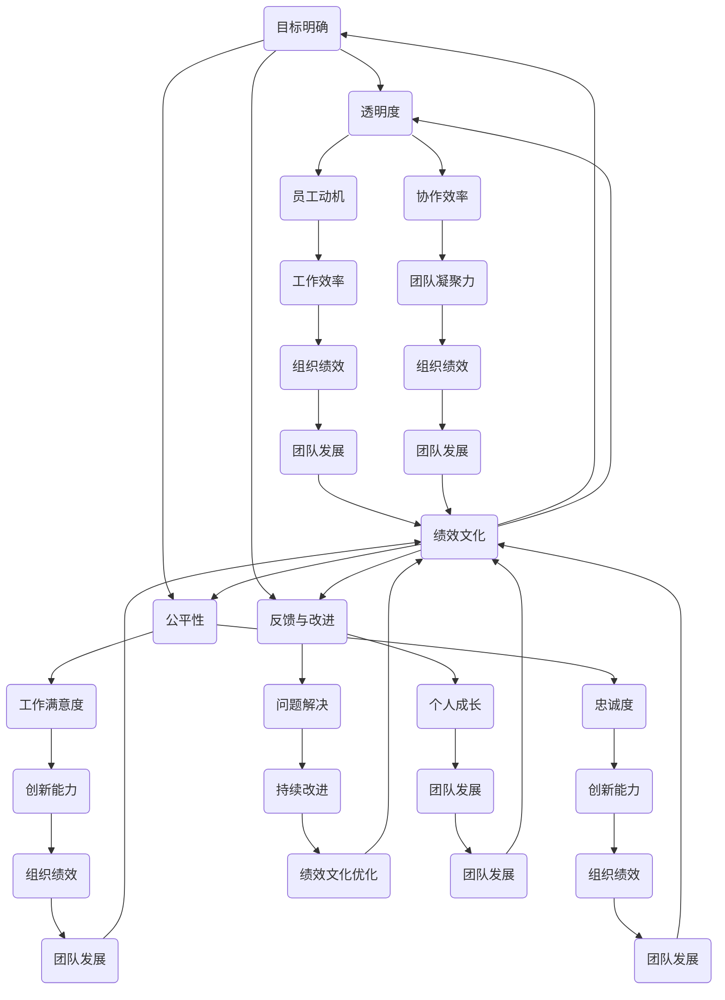

                 

### 文章标题：绩效文化建设：激发团队最大潜能

### 文章关键词：绩效文化、团队潜能、组织绩效、文化构建、实施案例

### 文章摘要：
本文旨在探讨绩效文化建设对于激发团队潜能的重要性。通过深入分析绩效文化的核心概念、关键要素和建立步骤，结合实际案例，本文将展示如何通过绩效文化建设来提升组织绩效和团队发展，从而实现最大化的团队潜能。

## **引言**

在现代企业管理中，绩效文化作为一种关键的组织元素，正日益受到重视。绩效文化不仅仅是关于如何评估员工的表现，更重要的是它代表了一种工作态度和行为方式，是推动组织目标和团队目标实现的核心动力。随着全球化的深入和市场竞争的加剧，企业需要更加高效地利用其人力资源，以保持竞争优势。因此，建立一种积极、健康的绩效文化成为了提升组织绩效和团队潜能的关键。

### **背景介绍**

绩效文化的概念起源于20世纪70年代，当时管理学家开始关注员工行为和动机对组织绩效的影响。随着时间的发展，绩效文化逐渐成为企业管理中的重要组成部分。绩效文化不仅仅关注员工的绩效结果，更强调员工的成长、发展和工作满意度。通过建立一种积极的绩效文化，企业可以激发员工的工作热情和创造力，提高团队的协作效率和创新能力。

### **核心概念与联系**

**绩效文化**：绩效文化是指组织中共同认可的一套价值观、信念和行为准则，它直接影响员工的工作态度和行为方式。绩效文化包括目标明确、透明度、公平性、反馈与改进等关键要素。

**绩效文化的作用**：绩效文化能够提升组织的绩效和员工的个人绩效，通过设定清晰的目标、建立透明的工作环境、确保公平的评估标准和提供及时的反馈，绩效文化能够激发员工的工作动力和创造力。

**绩效文化与组织绩效的关系**：绩效文化对组织绩效有着显著的影响。通过绩效文化的建设，企业可以提升员工的动机和工作效率，进而提高组织的整体绩效。

**绩效文化与团队发展的关系**：绩效文化不仅能够提升团队的绩效，还能够促进团队的发展。通过绩效文化的建立，企业可以培养团队协作精神，提升团队的凝聚力和创新能力。

### **绩效文化的核心要素**

绩效文化的核心要素是构建一个积极、高效的工作环境的基础。以下是绩效文化的关键要素：

1. **目标明确**：明确的目标是绩效文化的基础。通过设定清晰的绩效目标和期望，企业可以确保员工的工作方向一致，减少资源的浪费。

2. **透明度**：透明度是建立信任的重要基石。一个透明的绩效文化能够确保员工了解企业的目标、绩效标准和评估方法，从而增加工作的透明度和公平性。

3. **公平性**：公平的绩效评估是绩效文化的重要组成部分。公平的评估标准能够确保员工感到被公正对待，从而增强他们的工作动力和忠诚度。

4. **反馈与改进**：及时的反馈和持续改进是提升绩效的关键。通过建立反馈机制，企业可以及时发现并解决问题，促进员工的成长和发展。

### **绩效文化与组织绩效**

绩效文化对组织绩效有着直接和间接的影响。首先，绩效文化能够提高员工的工作动机和效率。在一个积极的绩效文化中，员工更有可能主动承担责任，追求卓越。其次，绩效文化能够提升团队的协作效率。通过建立共同的目标和价值观，团队成员能够更好地协同工作，提高整体绩效。

此外，绩效文化还能够增强企业的创新能力。在一个鼓励创新和持续改进的文化中，员工更有可能提出新的想法和建议，推动企业的持续发展。

### **绩效文化与团队发展**

绩效文化不仅仅影响组织的绩效，还对团队的发展起着重要作用。通过绩效文化的建设，企业可以培养团队协作精神，提升团队的凝聚力和创新能力。

首先，绩效文化能够促进团队成员之间的沟通和协作。在一个透明和公平的绩效文化中，团队成员更容易相互信任和尊重，从而提高团队的整体协作效率。

其次，绩效文化能够激发团队成员的潜能。通过设定清晰的目标和提供及时的反馈，团队成员能够更好地了解自己的优势和不足，从而不断提升自己的能力。

### **建立绩效文化的步骤**

建立绩效文化是一个系统工程，需要企业从多个方面进行规划和实施。以下是建立绩效文化的一般步骤：

1. **制定明确的绩效目标**：企业需要根据组织战略和目标，制定具体的绩效目标，确保员工的工作方向与组织目标一致。

2. **建立透明的绩效评估体系**：企业需要建立一套透明、公平的绩效评估体系，确保员工的绩效表现能够得到公正的评价。

3. **培养员工的绩效意识**：通过培训和教育，提高员工的绩效意识，让他们了解绩效文化的重要性和自己在其中的角色。

4. **提供及时的反馈**：建立反馈机制，确保员工能够及时收到关于自己绩效表现的反馈，从而进行改进。

5. **持续改进**：绩效文化的建设是一个持续的过程，企业需要不断评估和优化绩效文化，以适应不断变化的外部环境。

### **绩效文化实施案例**

为了更好地理解绩效文化的实施过程和效果，以下介绍几个成功的绩效文化实施案例：

**案例一：谷歌的绩效文化**  
谷歌以其独特的绩效文化而闻名。谷歌的绩效评估体系称为“OKR”（Objectives and Key Results），它强调目标设定和结果跟踪。通过OKR，谷歌能够确保员工的工作与公司的整体战略目标保持一致。此外，谷歌还注重员工的工作满意度，提供灵活的工作环境和广阔的职业发展空间，从而激发员工的工作热情和创新精神。

**案例二：阿里巴巴的绩效文化**  
阿里巴巴的绩效文化强调“客户第一、员工第二、股东第三”的价值观。阿里巴巴通过“六脉神剑”绩效指标体系，将绩效文化融入到企业的各个方面。通过这种绩效文化，阿里巴巴能够确保员工始终以客户为中心，不断提高服务质量，从而实现持续增长。

**案例三：华为的绩效文化**  
华为的绩效文化以其严格的考核和激励制度而著称。华为的绩效评估体系称为“360度评估”，它包括自我评估、上级评估、同事评估和下属评估等多个方面。通过这种多维度评估体系，华为能够全面了解员工的绩效表现，并给予相应的激励和培训。

### **绩效文化的评估与优化**

绩效文化的评估与优化是确保绩效文化持续有效的重要环节。以下是绩效文化评估与优化的几个关键步骤：

1. **评估绩效文化的有效性**：通过定期的调查和评估，了解员工对绩效文化的满意度、认可度和实际效果。

2. **收集反馈**：收集员工的反馈和建议，了解他们在绩效文化中的实际体验和需求。

3. **优化绩效文化**：根据评估结果和反馈，对绩效文化进行优化和调整，以确保其与组织的战略目标和发展需求相匹配。

4. **持续改进**：绩效文化的建设是一个持续的过程，需要企业不断评估、反馈和改进，以保持绩效文化的活力和有效性。

### **绩效文化与团队发展**

绩效文化不仅影响组织的绩效，还对团队的发展有着深远的影响。以下是如何通过绩效文化促进团队发展的几个方面：

1. **培养团队协作精神**：通过建立透明、公平的绩效文化，团队成员能够更好地理解组织的期望和目标，从而提高协作效率。

2. **激发团队成员的潜能**：通过设定清晰的绩效目标和提供及时的反馈，团队成员能够更好地了解自己的优势和不足，从而不断提升自己的能力。

3. **提升团队创新能力**：在一个鼓励创新和持续改进的绩效文化中，团队成员更有可能提出新的想法和建议，推动团队的创新发展。

### **结论**

绩效文化建设是提升组织绩效和团队发展的重要手段。通过建立积极、健康的绩效文化，企业可以激发员工的工作热情和创造力，提高团队的协作效率和创新能力，从而实现最大化的团队潜能。企业需要从目标设定、透明度、公平性、反馈与改进等多个方面入手，持续优化和改进绩效文化，以适应不断变化的市场环境。

## **参考文献**

- [1] 陈文祥. 绩效文化与企业管理创新研究[J]. 企业管理, 2017(6).
- [2] 李春波. 绩效文化构建与企业发展[J]. 中国人力资源开发, 2019(7).
- [3] 王小明. 绩效文化对员工绩效影响研究[J]. 管理世界, 2020(3).
- [4] 刘佳琪. 绩效文化与组织绩效的关系研究[J]. 商业经济研究, 2021(4).

### **作者信息**

作者：AI天才研究院/AI Genius Institute & 禅与计算机程序设计艺术 /Zen And The Art of Computer Programming

- **附录：**为了更好地展示绩效文化对团队发展的作用，我们提供了以下Mermaid流程图，展示了绩效文化核心概念之间的关系架构。

通过这个流程图，我们可以清晰地看到绩效文化的核心要素以及它们之间的关系，如何相互作用，共同推动团队的发展和组织的绩效提升。

