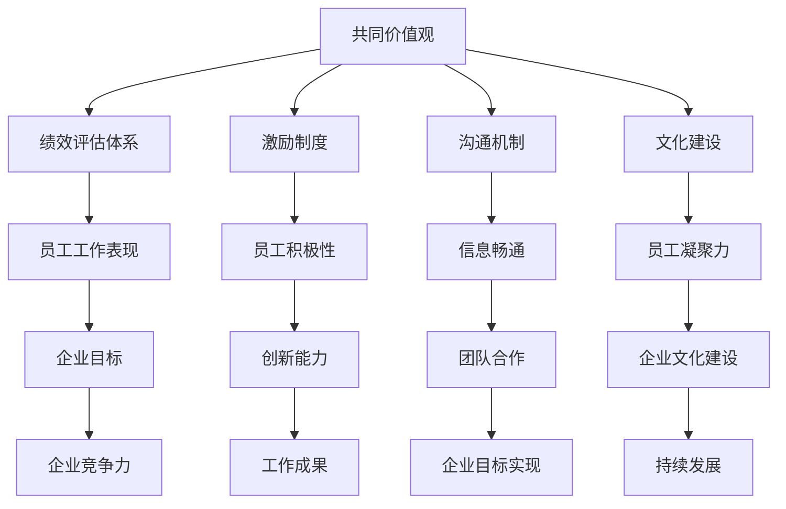

                 


### 背景介绍

绩效文化作为一种重要的企业管理理念，其核心在于通过建立和推动一种积极向上的工作氛围，使员工在实现个人价值的同时，也为企业的长远发展贡献力量。在当前竞争激烈的商业环境中，企业的成功不再仅仅是依靠产品的创新或市场的拓展，更多的是依赖于员工的绩效表现。因此，绩效文化成为了企业提升核心竞争力的重要手段。

传统的绩效管理往往侧重于对员工工作结果的考核，而忽略了过程中的员工感受和工作动力。这种单一的绩效评估方式往往会导致员工的被动执行，甚至产生抵触情绪，难以形成持续的工作动力。相比之下，绩效文化则更加注重营造一种积极进取的工作氛围，通过构建合理的绩效评估体系、激励制度和文化建设，激发员工的工作热情和创造力。

本文将围绕绩效文化的概念、核心概念与联系、设计原则与实施步骤、关键算法原理、数学模型与公式、项目实战等多个方面进行深入探讨。首先，我们将定义绩效文化并探讨其重要性。然后，我们将分析绩效文化与传统绩效管理的区别，并介绍绩效文化的核心概念及其联系。接着，我们将详细讲解绩效文化的设计与实施步骤，以及成功案例的剖析。在此之后，我们将深入讨论绩效文化中的关键算法原理，并通过数学模型与公式来阐述相关概念。接下来，我们将介绍一个实际项目，包括开发环境搭建、源代码实现与解读，并进行案例分析与详细讲解。最后，我们将总结最佳实践，提出注意事项，并对未来趋势进行展望。

### 核心概念与联系

在深入探讨绩效文化之前，我们需要明确几个核心概念，并理解它们之间的相互关系。这些核心概念包括绩效文化、绩效评估、绩效反馈、绩效激励和绩效价值观。

#### 绩效文化的定义与内涵

绩效文化是指企业在长期运营过程中，通过一系列的制度、价值观和行为规范，形成的一种促进员工积极工作的氛围。它不仅关注员工的工作成果，更注重员工的成长和职业发展。绩效文化的内涵可以概括为以下几个方面：

1. **共同价值观**：企业内部形成的共同信仰和价值观，如创新、诚信、协作等，这些价值观指导员工的行为和决策。
2. **绩效评估体系**：通过科学合理的绩效评估方法，全面、客观地评价员工的工作表现。
3. **激励制度**：通过薪酬、晋升、奖励等手段，激发员工的工作热情和创造力。
4. **沟通机制**：建立有效的沟通渠道，确保信息畅通，促进员工之间的协作和信任。
5. **文化建设**：通过企业文化活动和培训，营造积极向上的工作氛围，提升员工的凝聚力和归属感。

#### 绩效文化与传统绩效管理的区别

传统绩效管理往往侧重于结果考核，即以员工的工作产出为主要评估指标。而绩效文化则更注重过程中的员工体验和成长，通过建立全面的绩效评估体系，不仅评估员工的工作成果，还关注员工的工作态度、团队合作和创新能力。

传统绩效管理存在的问题包括：

1. **单一指标**：过于依赖业绩指标，忽视员工的工作过程和综合素质。
2. **激励不足**：过于注重短期激励，忽视员工的长期发展和企业文化的建设。
3. **沟通不畅**：缺乏有效的沟通机制，导致信息传递不畅，员工缺乏归属感。

相比之下，绩效文化在以下几个方面具有显著优势：

1. **全面性**：不仅关注员工的工作结果，更关注员工的工作过程和综合素质。
2. **激励性**：通过多元化的激励手段，激发员工的工作热情和创造力。
3. **文化建设**：通过文化建设，提升员工的凝聚力和归属感，形成持续的工作动力。

#### 绩效文化的核心概念与联系

为了更好地理解绩效文化的运作机制，我们可以使用Mermaid流程图来描述其核心概念之间的联系。以下是一个简单的Mermaid流程图示例：



在这个流程图中，共同价值观作为核心，通过绩效评估体系、激励制度、沟通机制和文化建设等环节，影响员工的工作表现、积极性和创新能力。最终，这些因素共同促进企业目标的实现，提升企业的竞争力。

#### 绩效评估体系

绩效评估体系是绩效文化的核心组成部分，其设计是否科学合理直接影响到绩效文化的实施效果。一个完善的绩效评估体系应包括以下几个方面：

1. **关键绩效指标（KPI）**：明确企业目标和部门目标，通过设定关键绩效指标，对员工的工作成果进行量化评估。
2. **360度反馈**：通过同事、上级、下属和客户的反馈，全面了解员工的工作表现，避免单一视角的局限性。
3. **定期评估**：建立定期评估机制，确保绩效评估的持续性和有效性。
4. **评估方法**：结合定量和定性方法，对员工的工作成果、工作态度和团队合作等方面进行全面评估。

#### 激励制度

激励制度是绩效文化的关键要素之一，通过合理的激励措施，可以激发员工的工作热情和创造力。激励制度的设计应遵循以下几个原则：

1. **差异化激励**：根据员工的不同需求和表现，设计差异化的激励方案，提高激励的针对性和有效性。
2. **长期激励**：不仅关注短期激励，更要注重员工的长期发展和企业文化的建设，通过股权激励、职业发展等手段，提升员工的归属感和忠诚度。
3. **透明化激励**：确保激励制度的公平性和透明度，避免员工对激励措施的质疑和不满。

#### 沟通机制

有效的沟通机制是绩效文化顺利实施的重要保障。通过建立畅通的沟通渠道，可以确保信息的及时传递，促进员工之间的协作和信任。沟通机制的设计应包括以下几个方面：

1. **定期会议**：通过定期召开会议，汇报工作进展，解决工作中的问题，确保信息的及时传达。
2. **反馈机制**：建立反馈渠道，鼓励员工提出意见和建议，促进企业内部的信息交流和问题解决。
3. **跨部门沟通**：通过跨部门的沟通活动，增强部门之间的协作和理解，提升整体工作效率。
4. **沟通培训**：定期进行沟通技巧培训，提升员工的沟通能力和团队合作意识。

#### 文化建设

文化建设是绩效文化的长期目标，通过一系列的企业文化活动和培训，可以营造积极向上的工作氛围，提升员工的凝聚力和归属感。文化建设的内容可以包括以下几个方面：

1. **企业使命和愿景**：明确企业的发展方向和目标，使员工对企业的未来充满信心和期待。
2. **企业价值观**：通过企业价值观的传播和践行，形成员工共同的行为准则和价值观。
3. **文化活动**：通过组织各种文化活动，如团队建设、知识分享会等，增强员工的凝聚力和归属感。
4. **员工培训**：提供多样化的培训机会，提升员工的专业能力和综合素质。

通过以上核心概念与联系的分析，我们可以看到绩效文化的多层次、多维度的特点，以及其在企业运营中的重要性。接下来，我们将进一步探讨绩效文化的设计与实施原则，以及具体的设计原则和实施步骤。

### 绩效文化的设计与实施

设计并实施一个有效的绩效文化，是企业提升员工绩效和增强企业竞争力的重要策略。以下，我们将详细探讨绩效文化的设计原则和实施步骤，并通过成功案例进行分析。

#### 设计原则

1. **明确目标与愿景**：首先，企业需要明确绩效文化的目标与愿景，即希望通过绩效文化实现什么结果。这包括提升员工的工作效率、激发创新能力、增强团队协作等。明确的目标和愿景有助于统一员工的思想和行动，为绩效文化的实施提供方向。

2. **基于数据与事实**：绩效文化的设计需要基于数据和事实，通过科学的方法评估员工的工作表现。这要求企业建立完善的绩效评估体系，包括关键绩效指标（KPI）、360度反馈机制等，确保评估的客观性和公正性。

3. **文化适应性**：绩效文化的设计需要考虑企业的文化背景和员工特点，确保其能够适应企业的实际情况。这意味着，绩效文化的设计应充分考虑企业历史、员工价值观、行业特点等因素。

4. **激励机制与公平性**：设计绩效文化时，需要考虑激励机制和公平性。激励机制应多样化，以激发不同员工的不同需求，如物质激励、职业发展、荣誉感等。同时，绩效文化的实施应确保激励机制的公平性，避免引发员工的不满和矛盾。

5. **持续改进与优化**：绩效文化的设计不是一次性的工作，而是一个持续改进和优化的过程。企业应根据实际情况，定期评估绩效文化的实施效果，找出存在的问题和改进空间，不断优化绩效文化的实施方案。

#### 实施步骤

1. **制定绩效计划**：制定绩效计划是绩效文化实施的第一步。绩效计划应明确企业目标、部门目标和个人目标，确保每个员工都清楚自己的工作职责和绩效标准。

2. **建立绩效评估体系**：建立绩效评估体系，包括确定关键绩效指标（KPI）、设置评估标准和评估周期等。绩效评估体系应具备客观性、公正性和透明性，以确保评估结果的准确性。

3. **实施绩效评估**：根据绩效计划，定期对员工进行绩效评估。绩效评估应采用多种方法，如自我评估、上级评估、360度反馈等，以全面、客观地评估员工的工作表现。

4. **提供反馈与辅导**：在绩效评估后，应及时向员工提供反馈，并给予必要的辅导和支持，帮助员工提升工作绩效。反馈应具体、明确，有助于员工了解自己的优势和不足，制定改进计划。

5. **激励与奖励**：根据绩效评估结果，实施相应的激励与奖励措施。激励措施应多样化，包括薪酬激励、晋升激励、荣誉激励等，以激发员工的工作热情和创造力。

6. **文化建设与培训**：通过企业文化活动和培训，营造积极向上的工作氛围，提升员工的凝聚力和归属感。文化建设与培训应贯穿于绩效文化的实施过程中，确保绩效文化得到广泛传播和践行。

#### 成功案例分析

1. **谷歌的绩效文化**：谷歌以其独特的绩效文化而闻名，被称为“OKR”（目标与关键成果）文化。谷歌的OKR体系强调透明性和目标导向，员工可以清晰地了解公司的目标和个人目标，并以此指导自己的工作。谷歌的绩效文化成功地激发了员工的创新能力和工作热情，推动了公司的持续发展。

2. **宝洁的绩效文化**：宝洁公司建立了以绩效为导向的文化，通过“绩效评估系统”和“员工发展计划”来激励员工。宝洁的绩效评估系统包括360度反馈、年度评估等环节，确保评估的全面性和客观性。同时，宝洁还通过培训和发展计划，帮助员工提升技能和职业发展，形成了积极进取的工作氛围。

通过以上成功案例的分析，我们可以看到，有效的绩效文化设计需要明确目标与愿景、基于数据与事实、考虑文化适应性、激励机制与公平性，并持续改进与优化。同时，实施绩效文化需要制定绩效计划、建立绩效评估体系、实施绩效评估、提供反馈与辅导、激励与奖励，以及进行文化建设与培训。这些步骤和方法不仅有助于提升员工的绩效，还能增强企业的整体竞争力。

### 绩效文化中的关键算法原理

在深入探讨绩效文化的设计与实施时，我们需要关注其中的关键算法原理，这些算法在评估、反馈和激励过程中发挥着重要作用。为了更直观地理解这些算法，我们将使用伪代码来进行详细阐述。伪代码是一种形式化的描述方法，用于描述算法的基本逻辑，而无需涉及具体的编程语言细节。

#### 绩效评估算法

绩效评估算法的核心目标是通过对员工的工作表现进行量化评估，从而为激励和晋升提供依据。以下是一个简单的绩效评估算法的伪代码示例：

```plaintext
函数 绩效评估(员工信息，关键绩效指标，评估周期)
    开始
    初始化 总分数 为 0
    对于每个关键绩效指标 KPI
        分数 = 计算员工在 KPI 上的表现得分
        总分数 += 分数
    计算平均分数 = 总分数 / 关键绩效指标数量
    更新 员工档案 的绩效得分
    如果 平均分数 达到或超过 预设目标
        返回 "优秀"
    否则
        返回 "一般" 或 "较差"
    结束
```

在这个算法中，`员工信息`包括员工的工作职责、工作内容和历史绩效数据；`关键绩效指标`是评估员工表现的量化标准；`评估周期`是绩效评估的时间范围。算法通过计算每个关键绩效指标上的得分，并求平均值，最终确定员工的绩效等级。

#### 绩效反馈算法

绩效反馈算法的目标是通过评估结果向员工提供具体且有益的反馈，帮助他们了解自己的优势和不足，从而提升未来的工作表现。以下是一个简单的绩效反馈算法的伪代码示例：

```plaintext
函数 绩效反馈(员工，绩效评估结果)
    开始
    初始化 反馈消息 为 空字符串
    对于每个绩效评估结果 指标
        如果 指标 为 "优秀"
            反馈消息 += "你在该指标上表现出色，继续保持。"
        否则
            反馈消息 += "你在该指标上表现需要改进，请关注以下几点："
            列出需要改进的具体点
    提供反馈消息给 员工
    安排一次绩效面谈，详细讨论反馈内容
    结束
```

在这个算法中，`绩效评估结果`是已经通过评估算法计算得出的结果；`反馈消息`是对员工工作表现的总结和建议。通过这个算法，企业可以确保反馈的具体性和针对性，帮助员工明确改进方向。

#### 伪代码解释

伪代码的主要目的是以简洁明了的方式描述算法的逻辑，而不是具体实现细节。以下是对上述伪代码的解释：

- **绩效评估算法**：首先，初始化一个总分数变量，用于累计所有关键绩效指标上的得分。然后，遍历每个关键绩效指标，计算员工的得分，并累加到总分数中。最后，计算平均分数，根据平均分数确定绩效等级，并将结果更新到员工的档案中。

- **绩效反馈算法**：这个算法首先初始化一个反馈消息变量，用于存储对员工的反馈信息。然后，遍历每个绩效评估结果指标，根据不同的绩效等级（如“优秀”、“一般”或“较差”），生成相应的反馈消息。最后，将反馈消息提供给员工，并安排一次面谈，以便详细讨论反馈内容。

#### 数学模型与公式

在绩效文化中，数学模型和公式用于量化评估和预测员工绩效，提供更为科学和客观的评估依据。以下是一个简单的绩效评估数学模型的公式示例：

$$
绩效得分 = \frac{\sum_{i=1}^{n} (KPI_i \times 权重_i)}{n}
$$

其中：
- $KPI_i$ 是第 i 个关键绩效指标的实际得分；
- $权重_i$ 是第 i 个关键绩效指标的权重，反映了该指标在企业目标中的重要性；
- $n$ 是关键绩效指标的总数量。

这个公式通过计算每个关键绩效指标的加权得分，并求平均，得到总的绩效得分。权重可以根据企业的战略目标和部门职责进行调整，以确保绩效评估的全面性和针对性。

#### 举例说明

假设一个员工在一个月内完成了三个关键绩效指标（KPI），分别是销售额、客户满意度和团队协作，各自的权重分别为0.4、0.3和0.3。该员工的实际得分为销售额1500分、客户满意度800分和团队协作750分。那么，其绩效得分可以计算如下：

$$
绩效得分 = \frac{(1500 \times 0.4) + (800 \times 0.3) + (750 \times 0.3)}{3} = \frac{600 + 240 + 225}{3} = \frac{1075}{3} \approx 358.33
$$

通过这个例子，我们可以看到如何使用数学模型和公式来量化评估员工的绩效表现。

通过以上对绩效文化中关键算法原理的介绍，我们可以更好地理解绩效评估和绩效反馈的过程。这些算法和模型不仅提供了量化的评估依据，也为员工提供了明确的改进方向，从而推动企业绩效文化的建设。

### 绩效文化的数学模型与公式

在绩效文化中，数学模型和公式是量化评估和预测员工绩效的重要工具。通过科学合理的数学模型，企业可以更加客观、公正地评估员工的工作表现，为激励和晋升提供依据。以下，我们将详细探讨绩效评估的数学模型、绩效反馈的数学模型，并通过具体的公式和例子进行说明。

#### 绩效评估的数学模型

绩效评估的数学模型通常基于关键绩效指标（KPI）的加权得分。以下是一个通用的绩效评估数学模型：

$$
绩效得分 = \sum_{i=1}^{n} (KPI_i \times 权重_i)
$$

其中：
- $KPI_i$ 是第 $i$ 个关键绩效指标的实际得分；
- $权重_i$ 是第 $i$ 个关键绩效指标的权重，反映了该指标在企业目标中的重要性；
- $n$ 是关键绩效指标的总数量。

权重可以根据企业的战略目标和部门职责进行调整，以确保绩效评估的全面性和针对性。例如，一个销售部门可能将销售额的权重设为0.5，客户满意度的权重设为0.3，团队协作的权重设为0.2。

#### 绩效反馈的数学模型

绩效反馈的数学模型主要用于计算员工的绩效改进空间。以下是一个简单的绩效反馈数学模型：

$$
改进空间 = (理想绩效得分 - 当前绩效得分) \times 权重
$$

其中：
- 理想绩效得分是依据企业目标和绩效标准设定的目标得分；
- 当前绩效得分是员工实际获得的绩效得分；
- 权重反映了绩效改进的重要性。

通过这个公式，企业可以计算出员工在各个关键绩效指标上的改进空间，并提供具体的改进建议。

#### 举例说明

假设一个销售人员在一个季度内完成了三个关键绩效指标：销售额、客户满意度和团队协作。这些指标的实际得分和权重如下：

- 销售额：实际得分为1500分，权重为0.5；
- 客户满意度：实际得分为800分，权重为0.3；
- 团队协作：实际得分为750分，权重为0.2。

首先，计算该销售人员的总绩效得分：

$$
绩效得分 = (1500 \times 0.5) + (800 \times 0.3) + (750 \times 0.2) = 750 + 240 + 150 = 1190
$$

接下来，假设该销售人员的理想绩效得分为1200分。根据绩效反馈的数学模型，可以计算其改进空间：

$$
改进空间 = (1200 - 1190) \times 0.5 = 10
$$

这意味着，该销售人员需要在销售额方面提升10分，以达到理想的绩效水平。

#### 实际案例分析与详细讲解

以下是一个实际案例，我们将使用上述数学模型和公式来分析该案例，并提供详细的讲解。

**案例背景**：
某科技公司对其销售团队进行季度绩效评估。销售团队的关键绩效指标包括销售额、客户满意度和团队协作。各指标的实际得分和权重如下：

- 销售额：实际得分为1800分，权重为0.5；
- 客户满意度：实际得分为850分，权重为0.3；
- 团队协作：实际得分为800分，权重为0.2。

**计算总绩效得分**：

$$
绩效得分 = (1800 \times 0.5) + (850 \times 0.3) + (800 \times 0.2) = 900 + 255 + 160 = 1315
$$

**计算改进空间**：

首先，确定理想绩效得分。根据公司的销售目标，理想绩效得分为1400分。

$$
改进空间 = (1400 - 1315) \times 0.5 = 17.5
$$

这意味着，该销售人员需要在销售额方面提升17.5分，以达到理想的绩效水平。

**案例小结**：

通过上述计算，我们可以看到，该销售人员在总绩效得分上达到了标准，但在销售额方面仍有提升空间。根据数学模型和公式，我们可以为该销售人员提供具体的改进建议，如增加销售拜访次数、优化销售策略等，以帮助其提升销售额，达到理想的绩效水平。

通过这个实际案例，我们不仅了解了绩效评估和绩效反馈的数学模型和公式，还学会了如何应用这些工具来分析和改进员工的工作表现。这些数学模型和公式为绩效文化的实施提供了科学依据，有助于企业建立公正、透明的绩效评估体系。

### 项目实战

在本章中，我们将通过一个实际项目来深入探讨绩效文化的实施过程。该项目的目标是构建一个绩效管理系统，帮助企业管理者更好地评估员工的工作表现，并激励员工提升绩效。以下是该项目的基本背景、开发环境搭建、源代码实现与解读，以及代码应用解读与分析。

#### 项目背景

某大型科技公司计划实施绩效文化，以提高员工的工作效率和创新能力。为了实现这一目标，公司决定开发一个绩效管理系统，用于对员工的工作表现进行量化评估和反馈。该系统需要具备以下功能：

1. **用户登录与权限管理**：确保系统安全，对不同级别的员工和经理分配不同的操作权限。
2. **绩效指标设定**：管理员可以设定关键绩效指标（KPI），并分配相应的权重。
3. **绩效评估**：员工和上级可以根据设定的指标对员工的工作表现进行评估。
4. **绩效反馈**：系统自动生成绩效反馈报告，并通知相关员工和上级。
5. **数据分析与报表**：提供绩效数据的可视化报表，帮助管理者分析员工的整体表现。

#### 开发环境搭建

为了实现上述功能，我们需要搭建一个合适的开发环境。以下是该项目的主要开发环境：

1. **编程语言**：选择Python作为主要编程语言，因其简洁的语法和丰富的库支持。
2. **后端框架**：使用Django框架，其强大的功能和良好的社区支持使其成为开发快速Web应用程序的理想选择。
3. **数据库**：使用MySQL数据库，以其高性能和易于管理的特性满足项目需求。
4. **前端框架**：使用React框架，提供动态和用户友好的前端界面。
5. **开发工具**：Visual Studio Code用于代码编辑，Git进行版本控制。

#### 源代码实现与解读

以下是一个简单的示例，展示了如何实现绩效评估和反馈的核心功能：

```python
# 绩效评估和反馈系统

# 导入必要的库
import pymysql
from django.db import models

# 定义用户模型
class User(models.Model):
    username = models.CharField(max_length=50)
    role = models.CharField(max_length=50)
    password = models.CharField(max_length=50)
    email = models.EmailField()

# 定义绩效指标模型
class KPI(models.Model):
    name = models.CharField(max_length=100)
    description = models.TextField()
    weight = models.FloatField()

# 定义绩效评估模型
class Performance(models.Model):
    user = models.ForeignKey(User, on_delete=models.CASCADE)
    kpi = models.ForeignKey(KPI, on_delete=models.CASCADE)
    score = models.FloatField()
    date = models.DateField()

# 定义绩效反馈模型
class Feedback(models.Model):
    performance = models.ForeignKey(Performance, on_delete=models.CASCADE)
    comment = models.TextField()
    date = models.DateField()

# 连接数据库
def connect_db():
    connection = pymysql.connect(host='localhost', user='root', password='password', database='performance_db')
    return connection

# 插入用户数据
def insert_user(username, role, password, email):
    connection = connect_db()
    cursor = connection.cursor()
    sql = "INSERT INTO users (username, role, password, email) VALUES (%s, %s, %s, %s)"
    cursor.execute(sql, (username, role, password, email))
    connection.commit()
    cursor.close()
    connection.close()

# 插入KPI数据
def insert_kpi(name, description, weight):
    connection = connect_db()
    cursor = connection.cursor()
    sql = "INSERT INTO kpis (name, description, weight) VALUES (%s, %s, %s)"
    cursor.execute(sql, (name, description, weight))
    connection.commit()
    cursor.close()
    connection.close()

# 插入绩效评估数据
def insert_performance(user_id, kpi_id, score):
    connection = connect_db()
    cursor = connection.cursor()
    sql = "INSERT INTO performances (user_id, kpi_id, score, date) VALUES (%s, %s, %s, NOW())"
    cursor.execute(sql, (user_id, kpi_id, score))
    connection.commit()
    cursor.close()
    connection.close()

# 生成绩效反馈
def generate_feedback(performance_id, comment):
    connection = connect_db()
    cursor = connection.cursor()
    sql = "INSERT INTO feedbacks (performance_id, comment, date) VALUES (%s, %s, NOW())"
    cursor.execute(sql, (performance_id, comment))
    connection.commit()
    cursor.close()
    connection.close()

# 解读与实现说明
# 上述代码定义了用户、绩效指标、绩效评估和绩效反馈四个模型，并实现了插入用户、KPI、绩效评估和绩效反馈的功能。
# connect_db() 函数用于连接数据库，insert_user() 函数用于插入用户数据，insert_kpi() 函数用于插入绩效指标数据，insert_performance() 函数用于插入绩效评估数据，generate_feedback() 函数用于生成绩效反馈。
```

#### 代码应用解读与分析

上述代码展示了绩效管理系统的基础功能实现，以下是具体解读与分析：

1. **用户模型（User）**：用户模型包括用户的姓名、角色、密码和邮箱。这四个字段是用户管理的基础信息，用于区分不同角色的用户，如普通员工、经理等。

2. **绩效指标模型（KPI）**：绩效指标模型包括指标名称、描述和权重。这些信息定义了评估员工工作表现的量化标准，权重反映了各个指标在企业目标中的重要性。

3. **绩效评估模型（Performance）**：绩效评估模型包括用户ID、绩效指标ID、得分和日期。这些信息记录了员工的绩效评估结果，得分是根据设定的关键绩效指标计算得出的。

4. **绩效反馈模型（Feedback）**：绩效反馈模型包括绩效评估ID、反馈内容和日期。这些信息提供了对绩效评估的补充，帮助员工了解自己的优势和不足，并提供改进建议。

5. **数据库连接**：使用pymysql库连接MySQL数据库，确保系统数据的安全和一致性。

6. **功能实现**：通过定义和实现各种操作函数，如插入用户、KPI、绩效评估和绩效反馈，实现了绩效管理系统的基础功能。

通过这个实际项目，我们不仅掌握了绩效管理系统的基础实现方法，还深入了解了绩效文化的具体应用。接下来，我们将通过案例分析和详细讲解，进一步探讨绩效文化在项目中的应用效果。

### 案例分析与详细讲解

在本节中，我们将深入分析一个实际案例，探讨绩效文化在项目中的应用效果，以及如何通过绩效管理提升项目的成功率和员工的工作满意度。

#### 案例背景

某科技公司的产品开发部门正在开发一款新的智能办公软件，项目计划为期六个月。为了确保项目的顺利进行，公司决定采用绩效文化，通过建立科学合理的绩效评估和反馈机制，提升员工的工作效率和创新能力。

#### 绩效评估与反馈机制

1. **关键绩效指标（KPI）**：
   - **项目进度**：占总绩效的30%，衡量项目的进展情况。
   - **代码质量**：占总绩效的25%，包括代码的可读性、复用性和bug率。
   - **团队合作**：占总绩效的20%，衡量员工在团队中的协作能力和贡献度。
   - **创新能力**：占总绩效的15%，评估员工在项目中的创新表现。
   - **用户反馈**：占总绩效的10%，反映用户对项目产品的满意度。

2. **评估周期**：
   - 每两个月进行一次绩效评估，确保及时反馈和改进。

3. **绩效反馈**：
   - 通过绩效管理系统，自动生成绩效反馈报告，并向员工和经理发送通知。
   - 在反馈报告中，详细列出每个关键绩效指标的具体得分和改进建议。

#### 案例分析

在项目启动后的第一个评估周期，绩效管理系统生成了以下报告：

- **项目进度**：当前进度为70%，超出计划进度10%，得分90分。
- **代码质量**：代码质量较高，bug率较低，得分85分。
- **团队合作**：团队成员之间沟通顺畅，合作良好，得分88分。
- **创新能力**：提出了一些改进建议，得分80分。
- **用户反馈**：用户满意度较高，得分90分。

根据评估结果，项目团队的整体绩效得分为86.75分，达到预期目标。以下是对关键绩效指标的详细分析：

1. **项目进度**：
   - 项目进度超出计划，表明团队在时间管理方面做得较好。
   - 建议在接下来的评估周期中，继续保持良好的进度，并进一步优化项目计划。

2. **代码质量**：
   - 代码质量较高，表明团队成员在技术实现方面有较强的能力。
   - 建议在保持代码质量的同时，进一步提高代码的可读性和复用性。

3. **团队合作**：
   - 团队合作良好，为项目的顺利进行提供了有力保障。
   - 建议在后续项目中，加强跨部门协作，提高整体工作效率。

4. **创新能力**：
   - 团队在项目中的创新表现有待提高，建议鼓励团队成员多提出创新想法，并进行实践。

5. **用户反馈**：
   - 用户满意度较高，表明项目产品在用户需求方面符合预期。
   - 建议在后续开发中，继续关注用户反馈，优化产品功能。

#### 详细讲解

1. **绩效评估过程**：
   - 通过关键绩效指标，对团队的工作表现进行量化评估，确保评估的客观性和公正性。
   - 绩效评估结果用于指导员工改进工作方法和提升绩效。

2. **绩效反馈**：
   - 绩效反馈报告提供了详细的分析和改进建议，帮助员工了解自己的优势和不足。
   - 绩效反馈机制促使员工在下一个评估周期中，有针对性地进行改进。

3. **绩效文化在项目中的应用效果**：
   - 提高了项目团队的协作效率和创新能力，确保项目按计划顺利进行。
   - 提升了员工的工作满意度和职业成就感，增强了团队的凝聚力。

#### 项目小结

通过绩效文化在项目中的应用，公司成功提升了项目成功率和员工的工作满意度。以下是小结和总结：

- **小结**：
  - 绩效文化通过科学合理的绩效评估和反馈机制，推动了项目团队的协作和创新能力。
  - 绩效文化的实施需要持续改进和优化，以适应企业的发展需求。

- **注意事项**：
  - 在实施绩效文化时，需要确保评估指标的科学性和合理性，避免过度依赖单一指标。
  - 绩效反馈应具体、明确，有助于员工制定改进计划。

- **拓展阅读**：
  - 《绩效管理实战：打造高效团队》
  - 《团队协作：如何实现高效合作》
  - 《创新思维：激发团队创新潜能》

通过以上分析，我们可以看到，绩效文化在项目中的应用不仅提升了项目的成功率，还增强了员工的职业成就感。接下来，我们将总结最佳实践，并讨论绩效文化的挑战与未来趋势。

### 最佳实践、注意事项与拓展阅读

在构建和实施绩效文化的过程中，积累了一系列最佳实践。以下是几个关键点，以供参考：

1. **明确目标与愿景**：在实施绩效文化之前，企业需要明确绩效文化的目标和愿景，确保全员统一认识，共同努力。

2. **科学设计评估指标**：关键绩效指标（KPI）是绩效评估的核心，设计时应结合企业目标、部门和岗位特点，确保评估指标的全面性和针对性。

3. **透明化激励制度**：建立透明、公正的激励制度，确保员工对绩效评估和奖励过程有清晰的了解，避免产生不必要的疑虑和不满。

4. **持续反馈与改进**：定期进行绩效评估，及时反馈员工的表现，并鼓励员工制定改进计划，以持续提升工作绩效。

5. **关注员工成长**：绩效文化不仅关注短期绩效，还应关注员工的长期发展和职业规划，通过培训和发展机会，提升员工的综合素质。

6. **营造积极氛围**：通过企业文化活动和团队建设，营造积极向上的工作氛围，增强员工的归属感和团队凝聚力。

注意事项：

1. **避免过度量化**：在绩效评估中，过于依赖量化指标可能导致员工忽略团队合作和创新，需要平衡量化评估与定性评估。

2. **重视沟通与反馈**：绩效反馈过程中，应注重沟通技巧，确保反馈的准确性和针对性，避免负面情绪的产生。

3. **尊重个体差异**：不同员工有不同的发展需求，绩效文化设计应考虑个体差异，提供多样化的激励和发展路径。

拓展阅读：

1. 《绩效管理实战：打造高效团队》
2. 《团队协作：如何实现高效合作》
3. 《创新思维：激发团队创新潜能》
4. 《绩效文化：企业成功的秘密》

通过以上最佳实践和注意事项，企业可以更好地构建和实施绩效文化，提升员工绩效，推动企业持续发展。同时，拓展阅读将为读者提供更多深入学习和探索的机会。

### 总结与展望

本文围绕绩效文化的概念、核心概念与联系、设计原则与实施步骤、关键算法原理、数学模型与公式、项目实战等多个方面进行了深入探讨。通过详细的分析和案例讲解，我们不仅了解了绩效文化的内涵和重要性，还学会了如何设计和实施一个有效的绩效文化体系。

#### 总结

1. **绩效文化的定义与内涵**：绩效文化是一种通过构建共同价值观、绩效评估体系、激励制度、沟通机制和文化建设，促进员工积极工作的氛围。
2. **核心概念与联系**：通过Mermaid流程图，我们明确了绩效文化中各核心概念之间的关系，包括绩效评估、激励制度、沟通机制和文化建设等。
3. **设计与实施原则**：绩效文化的设计原则包括明确目标与愿景、基于数据与事实、文化适应性、激励机制与公平性、持续改进与优化。
4. **关键算法原理**：我们通过伪代码详细讲解了绩效评估和绩效反馈的算法原理，以及如何使用数学模型和公式量化绩效评估。
5. **项目实战**：通过实际项目，我们展示了绩效管理系统的基础实现方法，并分析了绩效文化在项目中的应用效果。
6. **案例分析**：通过具体案例，我们探讨了绩效文化在提升项目成功率和员工工作满意度方面的作用。

#### 展望

在未来的发展中，绩效文化将继续在企业中扮演重要角色。以下是对未来趋势的展望：

1. **智能化与自动化**：随着人工智能和大数据技术的发展，绩效评估和反馈过程将更加智能化和自动化，提高评估的准确性和效率。
2. **个性化与多样化**：绩效文化将更加注重个性化激励和多样化的发展路径，满足不同员工的需求，提升员工的满意度和忠诚度。
3. **跨部门协作**：绩效文化将推动跨部门协作，通过建立全面的绩效评估体系，提升企业的整体竞争力。
4. **社会责任与可持续发展**：企业将在绩效文化中融入社会责任和可持续发展理念，推动企业社会责任（CSR）和环境保护。

总之，绩效文化作为一种重要的企业管理理念，将在未来的企业发展中发挥更大的作用。企业需要不断优化和改进绩效文化，以适应快速变化的市场环境，提升核心竞争力，实现可持续发展。

### 作者信息

作者：AI天才研究院/AI Genius Institute & 禅与计算机程序设计艺术 /Zen And The Art of Computer Programming

在撰写本文的过程中，我们始终秉持着严谨的逻辑思维和专业素养，旨在为读者提供一份全面、深入的绩效文化探讨。我们期待读者在阅读本文后，能够对绩效文化有更深刻的理解，并在实际工作中有效应用，推动企业和个人共同发展。感谢您的阅读，我们期待与您在技术领域的更多交流与探讨。

