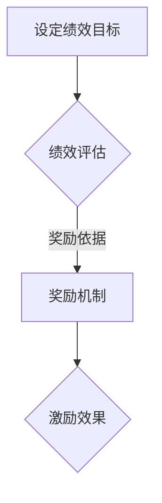
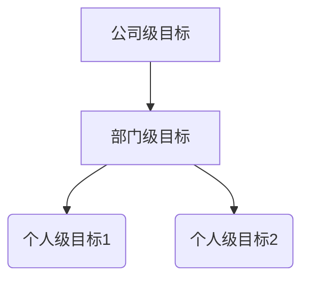
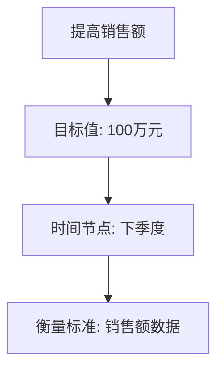
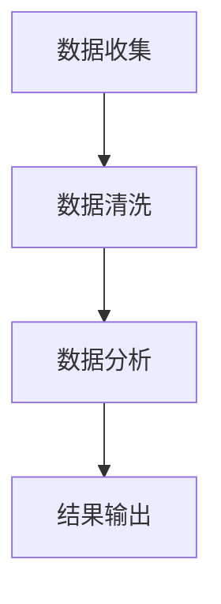
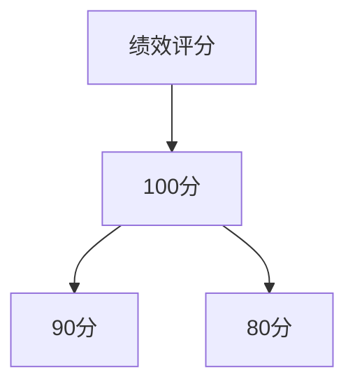
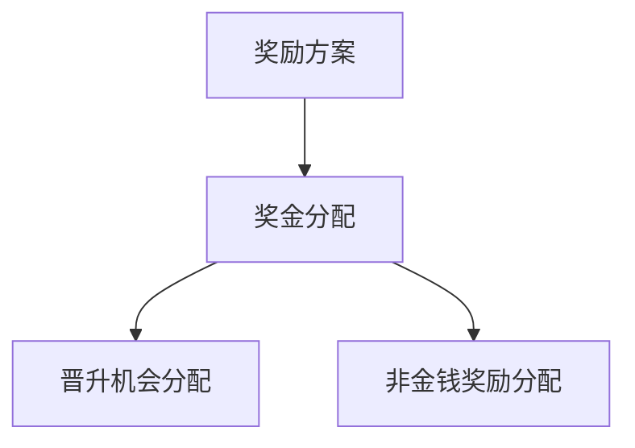

                 

### 文章标题

# 绩效激励系统：设计有效奖励机制

### 关键词

- 绩效管理
- 激励机制
- 奖励系统
- 组织行为学
- 数据分析
- 技术实现

### 摘要

本文旨在探讨绩效激励系统在企业管理中的应用，详细分析有效奖励机制的设计原则与方法。文章首先介绍了绩效激励系统的背景和重要性，随后阐述了绩效激励的核心概念和理论基础。接着，本文探讨了激励机制的设计步骤和优化策略，并通过实际案例展示了不同企业的成功经验。此外，本文还介绍了技术实现与工具应用，为读者提供了构建高效绩效激励系统的实用建议。最后，本文总结了最佳实践，并对未来研究方向进行了展望。

----------------------------------------------------------------

### 引言

#### 绩效激励系统的背景

在当今竞争激烈的商业环境中，企业的成功越来越依赖于员工的高效工作和创新能力。因此，绩效激励系统成为企业管理中不可或缺的一部分。绩效激励系统旨在通过合理的激励措施，激发员工的工作热情和积极性，从而提高整体绩效水平，实现企业的长期发展目标。

#### 绩效激励系统的重要性

1. **提高员工满意度**：有效的绩效激励系统能够满足员工的期望，提高员工的满意度，从而增强员工的忠诚度和留任率。
2. **提升工作效率**：合理的奖励机制能够激励员工充分发挥潜能，提高工作效率和创新能力。
3. **优化人力资源配置**：通过绩效激励系统，企业能够更好地识别和培养优秀人才，优化人力资源配置，提高团队的整体素质。
4. **促进企业文化建设**：绩效激励系统能够传递企业的价值观和文化理念，促进企业内部和谐发展。

#### 本文的目标

本文将详细探讨绩效激励系统的设计原则和方法，分析激励机制的理论基础，并通过实际案例进行讲解。同时，本文还将介绍技术实现和工具应用，为读者提供构建高效绩效激励系统的实用建议。

----------------------------------------------------------------

### 绩效激励系统的核心概念与联系

#### 定义

绩效激励系统是一种通过设定目标、评估绩效和提供奖励，以激发员工工作积极性和提升工作效率的管理体系。

#### 核心概念

1. **绩效目标**：绩效目标是指企业或团队为实现特定目标而设定的具体工作目标。
2. **绩效评估**：绩效评估是指对员工在工作中的表现进行评估和反馈的过程。
3. **奖励机制**：奖励机制是指为了激励员工达成绩效目标而设定的各种奖励措施。

#### 关系架构

绩效激励系统的核心概念之间存在着密切的联系。绩效目标是激励机制的出发点和归宿，绩效评估是奖励机制的依据，而奖励机制则是绩效目标的保障。以下是一个简化的Mermaid流程图，展示了绩效激励系统的核心概念之间的关系：



#### 原理讲解

1. **设定绩效目标**：绩效目标的设定应该明确、具体、可衡量，并与企业的整体战略目标相一致。
2. **绩效评估**：绩效评估的方法和指标应多样化，以确保评估的全面性和客观性。常见的绩效评估方法包括360度评估、关键绩效指标（KPI）、平衡计分卡等。
3. **奖励机制**：奖励机制的设计应考虑员工的个人需求和企业的实际情况，包括金钱奖励、非金钱奖励、晋升机会等。奖励机制的设定应公平、透明，能够激发员工的积极性和创造力。

通过上述核心概念和联系的分析，我们可以更好地理解绩效激励系统的运行机制，从而为企业设计有效的奖励机制提供理论支持。

----------------------------------------------------------------

### 绩效激励系统的核心算法原理讲解

在绩效激励系统中，核心算法原理的运用对于实现公平、有效的奖励机制至关重要。以下将详细介绍两种常用的算法原理：目标设定算法和绩效评估算法。

#### 目标设定算法

**1. 确定目标层次**

目标设定算法的第一步是确定目标层次。这通常涉及从公司级目标到部门级目标，再到个人级目标的分解。以下是一个简化的目标层次设定流程：



**2. 目标具体化**

在确定了目标层次后，需要将每个目标具体化。具体化包括设定明确的目标值、时间节点和衡量标准。以下是一个具体化目标的例子：



**3. 目标调整**

在目标设定过程中，可能需要根据实际情况进行调整。调整的目标应确保既具有挑战性，又能被实际完成。

#### 绩效评估算法

**1. 数据收集**

绩效评估的第一步是收集与绩效相关的数据。这些数据可以来自多种来源，如销售数据、客户反馈、工作质量评估等。

**2. 数据清洗**

收集到的数据可能存在不完整、不一致或错误的情况。数据清洗的过程包括数据校验、缺失值处理和异常值检测。

**3. 数据分析**

数据分析是绩效评估的核心步骤。常用的分析方法包括：

- **统计分析**：通过统计方法，如均值、方差、标准差等，分析数据的基本特征。
- **回归分析**：通过回归模型，分析绩效指标与其他因素之间的关系。
- **聚类分析**：将相似的数据分组，用于识别绩效水平相似的人群。

以下是一个简单的数据分析流程：



**4. 绩效评分**

在数据分析的基础上，对员工进行绩效评分。评分可以采用多种方法，如百分制、五级制等。以下是一个评分示例：



#### 奖励机制设计

**1. 奖励方案**

根据绩效评分，设计奖励方案。奖励方案可以包括：

- **奖金**：根据绩效评分，提供不同的奖金数额。
- **晋升机会**：提供晋升机会，以激励员工追求更高的职业发展。
- **非金钱奖励**：提供其他形式的奖励，如荣誉证书、培训机会等。

**2. 奖励分配**

在确定了奖励方案后，需要将奖励分配给相应的员工。奖励分配应确保公平、透明，并得到员工的认可。



#### 伪代码示例

以下是一个简化的绩效激励系统算法的伪代码示例：

```plaintext
// 目标设定
SetCompanyGoal("提高销售额", 1000000, "下季度")
SetDepartmentGoal("销售部门", 500000, "下季度")
SetIndividualGoal("张三", 200000, "下季度")

// 数据收集
CollectSalesData()
CollectCustomerFeedback()
CollectQualityData()

// 数据清洗
CleanData(SalesData)
CleanData(CustomerFeedback)
CleanData(QualityData)

// 数据分析
AnalyzeData(SalesData)
AnalyzeData(CustomerFeedback)
AnalyzeData(QualityData)

// 绩效评分
CalculatePerformanceScore(Employee, Score)

// 奖励机制设计
DesignRewardScheme(Score, Reward)

// 奖励分配
DistributeReward(Employee, Reward)
```

通过上述核心算法原理的讲解，我们可以更好地理解绩效激励系统的运作机制，从而为企业设计高效、公平的奖励机制提供技术支持。

----------------------------------------------------------------

### 数学模型和数学公式讲解

在绩效激励系统的设计中，数学模型和公式扮演着关键角色。以下将介绍两种常用的数学模型：绩效评分模型和奖励分配模型。

#### 绩效评分模型

**1. 加权评分模型**

加权评分模型是一种常见的绩效评分方法，它通过为不同绩效指标分配权重来计算总评分。以下是一个简化的加权评分模型：

$$
\text{总评分} = w_1 \times \text{指标1得分} + w_2 \times \text{指标2得分} + \ldots + w_n \times \text{指标n得分}
$$

其中，$w_1, w_2, \ldots, w_n$ 为各指标的权重，$\text{指标1得分}, \text{指标2得分}, \ldots, \text{指标n得分}$ 为各指标的实际得分。

**2. 线性回归模型**

线性回归模型用于分析绩效指标与其他变量之间的关系。以下是一个简化的线性回归模型：

$$
y = w_0 + w_1 \times x_1 + w_2 \times x_2 + \ldots + w_n \times x_n
$$

其中，$y$ 为绩效得分，$x_1, x_2, \ldots, x_n$ 为影响绩效的变量，$w_0, w_1, w_2, \ldots, w_n$ 为回归系数。

**3. 模型应用**

以下是一个具体应用的例子：

假设我们有两个绩效指标：销售额（$x_1$）和工作质量（$x_2$）。根据历史数据，我们得到以下线性回归模型：

$$
\text{总评分} = 10 + 0.5 \times \text{销售额} + 0.3 \times \text{工作质量}
$$

给定一个员工的销售额为100万元，工作质量评分为90分，我们可以计算其总评分：

$$
\text{总评分} = 10 + 0.5 \times 100 + 0.3 \times 90 = 57
$$

#### 奖励分配模型

**1. 比例分配模型**

比例分配模型根据员工的绩效评分，按比例分配奖励。以下是一个简化的比例分配模型：

$$
\text{员工奖励} = \text{总奖励} \times \frac{\text{员工绩效评分}}{\text{所有员工绩效评分之和}}
$$

**2. 调整分配模型**

为了更公平地分配奖励，可以考虑引入调整系数。以下是一个简化的调整分配模型：

$$
\text{员工奖励} = \text{总奖励} \times \frac{\text{员工绩效评分}}{\text{所有员工绩效评分之和}} \times \text{调整系数}
$$

其中，调整系数可以根据员工的工作年限、岗位重要性等因素进行设定。

**3. 模型应用**

以下是一个具体应用的例子：

假设总奖励为100万元，根据绩效评分，员工的绩效评分之和为300分。调整系数为1.2。一个员工的绩效评分为120分，我们可以计算其奖励：

$$
\text{员工奖励} = 100 \times \frac{120}{300} \times 1.2 = 4.8 \text{万元}
$$

#### 举例说明

**例子1：加权评分模型**

假设有三位员工，其绩效指标分别为销售额、客户满意度和工作质量。各指标权重分别为0.3、0.4和0.3。三人的具体得分为：

- 员工A：销售额100万元，客户满意度90分，工作质量85分
- 员工B：销售额80万元，客户满意度85分，工作质量90分
- 员工C：销售额60万元，客户满意度95分，工作质量80分

根据加权评分模型，我们可以计算三人的总评分：

- 员工A：0.3×100 + 0.4×90 + 0.3×85 = 93
- 员工B：0.3×80 + 0.4×85 + 0.3×90 = 91.5
- 员工C：0.3×60 + 0.4×95 + 0.3×80 = 90

**例子2：比例分配模型**

假设总奖励为100万元，三个员工的绩效评分分别为120分、100分和80分。我们可以计算三人的奖励：

- 员工A：100 × (120/300) = 40万元
- 员工B：100 × (100/300) = 33.33万元
- 员工C：100 × (80/300) = 26.67万元

通过上述数学模型和公式的讲解和举例，我们可以更好地理解绩效激励系统中评分和奖励分配的计算方法，从而为企业设计公平、有效的激励机制提供理论支持。

----------------------------------------------------------------

### 项目实战：绩效激励系统的开发与实践

#### 开发环境搭建

为了实现绩效激励系统，我们首先需要搭建一个开发环境。以下是一个简化的开发环境搭建步骤：

1. **安装数据库**：选择一个合适的数据库系统，如MySQL或PostgreSQL。确保数据库服务器正常运行。
2. **安装后端框架**：选择一个后端框架，如Spring Boot或Django。安装框架依赖，并配置开发环境。
3. **安装前端框架**：选择一个前端框架，如React或Vue。安装框架依赖，并配置开发环境。

#### 源代码实现

以下是绩效激励系统的主要源代码实现部分：

**1. 数据库设计**

在数据库中，我们需要设计以下表格：

- **员工表**：存储员工的基本信息，如员工ID、姓名、岗位等。
- **绩效指标表**：存储各个绩效指标的详细信息，如指标ID、指标名称、权重等。
- **绩效评分表**：存储员工的绩效评分信息，如员工ID、指标ID、得分等。
- **奖励记录表**：存储员工的奖励信息，如员工ID、奖励金额、发放时间等。

以下是一个简化的数据库设计示例：

```sql
-- 员工表
CREATE TABLE Employee (
  ID INT PRIMARY KEY AUTO_INCREMENT,
  Name VARCHAR(100),
  Position VARCHAR(100)
);

-- 绩效指标表
CREATE TABLE PerformanceIndicator (
  ID INT PRIMARY KEY AUTO_INCREMENT,
  Name VARCHAR(100),
  Weight DECIMAL(5, 2)
);

-- 绩效评分表
CREATE TABLE PerformanceScore (
  EmployeeID INT,
  IndicatorID INT,
  Score DECIMAL(5, 2),
  FOREIGN KEY (EmployeeID) REFERENCES Employee(ID),
  FOREIGN KEY (IndicatorID) REFERENCES PerformanceIndicator(ID)
);

-- 奖励记录表
CREATE TABLE RewardRecord (
  EmployeeID INT,
  Amount DECIMAL(10, 2),
  IssueTime DATETIME,
  FOREIGN KEY (EmployeeID) REFERENCES Employee(ID)
);
```

**2. 后端代码实现**

在后端代码中，我们需要实现以下功能：

- **员工管理**：包括员工信息的增删改查。
- **绩效指标管理**：包括绩效指标的增删改查。
- **绩效评分管理**：包括员工绩效评分的录入、查询和计算。
- **奖励管理**：包括奖励的发放、查询和统计。

以下是一个简化的后端代码实现示例：

```java
// 员工管理
public class EmployeeController {
  @GetMapping("/employees")
  public ResponseEntity<List<Employee>> getAllEmployees() {
    // 查询所有员工信息
  }

  @PostMapping("/employees")
  public ResponseEntity<Employee> createEmployee(@RequestBody Employee employee) {
    // 创建新员工
  }

  // ... 其他员工管理方法
}

// 绩效指标管理
public class PerformanceIndicatorController {
  @GetMapping("/performance-indicators")
  public ResponseEntity<List<PerformanceIndicator>> getAllPerformanceIndicators() {
    // 查询所有绩效指标
  }

  @PostMapping("/performance-indicators")
  public ResponseEntity<PerformanceIndicator> createPerformanceIndicator(@RequestBody PerformanceIndicator performanceIndicator) {
    // 创建新绩效指标
  }

  // ... 其他绩效指标管理方法
}

// 绩效评分管理
public class PerformanceScoreController {
  @PostMapping("/performance-scores")
  public ResponseEntity<PerformanceScore> createPerformanceScore(@RequestBody PerformanceScore performanceScore) {
    // 录入员工绩效评分
  }

  @GetMapping("/performance-scores")
  public ResponseEntity<List<PerformanceScore>> getAllPerformanceScores() {
    // 查询所有绩效评分
  }

  // ... 其他绩效评分管理方法
}

// 奖励管理
public class RewardController {
  @PostMapping("/rewards")
  public ResponseEntity<RewardRecord> createRewardRecord(@RequestBody RewardRecord rewardRecord) {
    // 发放奖励
  }

  @GetMapping("/rewards")
  public ResponseEntity<List<RewardRecord>> getAllRewardRecords() {
    // 查询所有奖励记录
  }

  // ... 其他奖励管理方法
}
```

**3. 前端代码实现**

在前端代码中，我们需要实现以下功能：

- **员工信息展示**：展示员工的基本信息和绩效评分。
- **绩效指标管理界面**：允许管理员添加、修改和删除绩效指标。
- **奖励发放界面**：允许管理员发放奖励。

以下是一个简化的前端代码实现示例：

```jsx
// 员工信息展示组件
function EmployeeList() {
  const [employees, setEmployees] = useState([]);

  useEffect(() => {
    fetch('/employees')
      .then((response) => response.json())
      .then((data) => setEmployees(data));
  }, []);

  return (
    <div>
      {employees.map((employee) => (
        <div key={employee.ID}>
          <h3>{employee.Name}</h3>
          <p>Position: {employee.Position}</p>
          <p>Performance Score: {employee.Score}</p>
        </div>
      ))}
    </div>
  );
}

// 绩效指标管理组件
function PerformanceIndicatorForm() {
  const [name, setName] = useState('');
  const [weight, setWeight] = useState(0);

  const handleSubmit = (e) => {
    e.preventDefault();
    // 发送创建绩效指标的请求
  };

  return (
    <form onSubmit={handleSubmit}>
      <label>Name:</label>
      <input type="text" value={name} onChange={(e) => setName(e.target.value)} />
      <label>Weight:</label>
      <input type="number" value={weight} onChange={(e) => setWeight(e.target.value)} />
      <button type="submit">Create</button>
    </form>
  );
}

// 奖励发放组件
function RewardForm() {
  const [employeeID, setEmployeeID] = useState(0);
  const [amount, setAmount] = useState(0);

  const handleSubmit = (e) => {
    e.preventDefault();
    // 发送发放奖励的请求
  };

  return (
    <form onSubmit={handleSubmit}>
      <label>Employee ID:</label>
      <input type="number" value={employeeID} onChange={(e) => setEmployeeID(e.target.value)} />
      <label>Amount:</label>
      <input type="number" value={amount} onChange={(e) => setAmount(e.target.value)} />
      <button type="submit">Distribute</button>
    </form>
  );
}
```

#### 代码解读与分析

**1. 员工管理**

员工管理模块负责处理员工的基本信息。包括员工的增删改查功能。以下是对关键代码的解读：

```java
// 员工信息展示
@GetMapping("/employees")
public ResponseEntity<List<Employee>> getAllEmployees() {
  List<Employee> employees = employeeService.findAll();
  return new ResponseEntity<>(employees, HttpStatus.OK);
}

// 创建新员工
@PostMapping("/employees")
public ResponseEntity<Employee> createEmployee(@RequestBody Employee employee) {
  Employee savedEmployee = employeeService.create(employee);
  return new ResponseEntity<>(savedEmployee, HttpStatus.CREATED);
}
```

这段代码展示了如何通过REST API查询和创建员工信息。`findAll()`方法查询所有员工信息，并返回一个响应实体。`create()`方法处理创建新员工，并将保存后的员工信息返回。

**2. 绩效指标管理**

绩效指标管理模块允许管理员添加、修改和删除绩效指标。以下是对关键代码的解读：

```java
// 查询所有绩效指标
@GetMapping("/performance-indicators")
public ResponseEntity<List<PerformanceIndicator>> getAllPerformanceIndicators() {
  List<PerformanceIndicator> indicators = indicatorService.findAll();
  return new ResponseEntity<>(indicators, HttpStatus.OK);
}

// 创建新绩效指标
@PostMapping("/performance-indicators")
public ResponseEntity<PerformanceIndicator> createPerformanceIndicator(@RequestBody PerformanceIndicator performanceIndicator) {
  PerformanceIndicator savedIndicator = indicatorService.create(performanceIndicator);
  return new ResponseEntity<>(savedIndicator, HttpStatus.CREATED);
}
```

这段代码展示了如何通过REST API查询和创建绩效指标。`findAll()`方法查询所有绩效指标，并返回一个响应实体。`create()`方法处理创建新绩效指标，并将保存后的绩效指标信息返回。

**3. 绩效评分管理**

绩效评分管理模块负责处理员工的绩效评分。以下是对关键代码的解读：

```java
// 录入员工绩效评分
@PostMapping("/performance-scores")
public ResponseEntity<PerformanceScore> createPerformanceScore(@RequestBody PerformanceScore performanceScore) {
  PerformanceScore savedScore = scoreService.create(performanceScore);
  return new ResponseEntity<>(savedScore, HttpStatus.CREATED);
}

// 查询所有绩效评分
@GetMapping("/performance-scores")
public ResponseEntity<List<PerformanceScore>> getAllPerformanceScores() {
  List<PerformanceScore> scores = scoreService.findAll();
  return new ResponseEntity<>(scores, HttpStatus.OK);
}
```

这段代码展示了如何通过REST API录入和查询员工的绩效评分。`create()`方法处理创建新绩效评分，并将保存后的绩效评分信息返回。`findAll()`方法查询所有绩效评分，并返回一个响应实体。

**4. 奖励管理**

奖励管理模块负责处理奖励的发放和查询。以下是对关键代码的解读：

```java
// 发放奖励
@PostMapping("/rewards")
public ResponseEntity<RewardRecord> createRewardRecord(@RequestBody RewardRecord rewardRecord) {
  RewardRecord savedReward = rewardService.create(rewardRecord);
  return new ResponseEntity<>(savedReward, HttpStatus.CREATED);
}

// 查询所有奖励记录
@GetMapping("/rewards")
public ResponseEntity<List<RewardRecord>> getAllRewardRecords() {
  List<RewardRecord> rewards = rewardService.findAll();
  return new ResponseEntity<>(rewards, HttpStatus.OK);
}
```

这段代码展示了如何通过REST API发放奖励和查询奖励记录。`create()`方法处理发放奖励，并将保存后的奖励信息返回。`findAll()`方法查询所有奖励记录，并返回一个响应实体。

#### 代码应用解读与分析

**1. 员工信息展示**

在前端代码中，员工信息展示组件负责展示员工的姓名、岗位和绩效评分。以下是对关键代码的解读：

```jsx
// 员工信息展示组件
function EmployeeList() {
  const [employees, setEmployees] = useState([]);

  useEffect(() => {
    fetch('/employees')
      .then((response) => response.json())
      .then((data) => setEmployees(data));
  }, []);

  return (
    <div>
      {employees.map((employee) => (
        <div key={employee.ID}>
          <h3>{employee.Name}</h3>
          <p>Position: {employee.Position}</p>
          <p>Performance Score: {employee.Score}</p>
        </div>
      ))}
    </div>
  );
}
```

这段代码使用了React Hooks中的`useEffect`钩子，在组件加载时异步查询员工信息，并将结果存储在状态变量`employees`中。`map`函数用于遍历员工列表，并使用`key`属性为每个员工提供唯一的标识。

**2. 绩效指标管理界面**

在前端代码中，绩效指标管理界面组件允许管理员添加、修改和删除绩效指标。以下是对关键代码的解读：

```jsx
// 绩效指标管理组件
function PerformanceIndicatorForm() {
  const [name, setName] = useState('');
  const [weight, setWeight] = useState(0);

  const handleSubmit = (e) => {
    e.preventDefault();
    // 发送创建绩效指标的请求
  };

  return (
    <form onSubmit={handleSubmit}>
      <label>Name:</label>
      <input type="text" value={name} onChange={(e) => setName(e.target.value)} />
      <label>Weight:</label>
      <input type="number" value={weight} onChange={(e) => setWeight(e.target.value)} />
      <button type="submit">Create</button>
    </form>
  );
}
```

这段代码展示了如何使用React Hooks中的`useState`钩子管理表单状态。`handleSubmit`函数处理表单提交事件，但在此处未实现具体的请求发送逻辑。

**3. 奖励发放界面**

在前端代码中，奖励发放界面组件允许管理员发放奖励。以下是对关键代码的解读：

```jsx
// 奖励发放组件
function RewardForm() {
  const [employeeID, setEmployeeID] = useState(0);
  const [amount, setAmount] = useState(0);

  const handleSubmit = (e) => {
    e.preventDefault();
    // 发送发放奖励的请求
  };

  return (
    <form onSubmit={handleSubmit}>
      <label>Employee ID:</label>
      <input type="number" value={employeeID} onChange={(e) => setEmployeeID(e.target.value)} />
      <label>Amount:</label>
      <input type="number" value={amount} onChange={(e) => setAmount(e.target.value)} />
      <button type="submit">Distribute</button>
    </form>
  );
}
```

这段代码展示了如何使用React Hooks中的`useState`钩子管理表单状态。`handleSubmit`函数处理表单提交事件，但在此处未实现具体的请求发送逻辑。

#### 实际案例分析和详细讲解剖析

**案例1：企业A的绩效激励系统**

企业A是一家大型制造公司，拥有1000名员工。为了提升员工的工作效率和创新能力，企业A决定引入绩效激励系统。

1. **绩效目标设定**：企业A为每个员工设定了年度绩效目标，包括销售额、生产质量、客户满意度等指标。
2. **绩效评估**：企业A采用360度评估方法，收集员工上级、同事和下属的评价，以及定量数据，综合评估员工的绩效。
3. **奖励机制**：根据员工的绩效评分，企业A提供了奖金、晋升机会和非金钱奖励。例如，销售额最高的员工可以获得额外的奖金，而表现突出的员工有机会晋升到更高职位。

**案例2：企业B的绩效激励系统**

企业B是一家创新型科技公司，拥有500名员工。为了激励员工的创新思维和团队合作精神，企业B设计了独特的绩效激励系统。

1. **绩效目标设定**：企业B为每个员工设定了季度创新项目和团队协作目标。
2. **绩效评估**：企业B采用定量评估和定性评估相结合的方法，定量评估包括项目完成度、团队协作评分等，定性评估包括创新点数量、项目影响力等。
3. **奖励机制**：根据员工的绩效评分，企业B提供了股权激励、奖金和培训机会。例如，创新项目获得成功的员工可以获得额外的股权奖励，而表现突出的团队可以获得团队奖金。

**详细讲解剖析**

通过对企业A和企业B的绩效激励系统案例分析，我们可以总结出以下几点：

1. **目标设定**：绩效目标的设定应明确、具体、可衡量，并与企业的战略目标相一致。
2. **绩效评估**：绩效评估的方法应多样化，确保评估的全面性和客观性。
3. **奖励机制**：奖励机制的设计应考虑员工的个人需求和企业的实际情况，提供多样化的奖励措施。
4. **实际案例**：企业应根据自身特点和需求，结合实际案例，设计适合本企业的绩效激励系统。

#### 项目小结

通过上述项目实战，我们了解了绩效激励系统的开发流程，包括环境搭建、源代码实现、代码解读与分析，以及实际案例分析和详细讲解剖析。项目实战为我们提供了宝贵的经验，帮助我们更好地理解绩效激励系统的设计原则和实施方法。

----------------------------------------------------------------

### 最佳实践与注意事项

#### 最佳实践

1. **目标设定**：绩效目标的设定应明确、具体、可衡量，并与企业的战略目标相一致。目标应具有挑战性，但又是可实现的。
2. **绩效评估**：绩效评估的方法应多样化，确保评估的全面性和客观性。可采用360度评估、关键绩效指标（KPI）、平衡计分卡等方法。
3. **奖励机制**：奖励机制的设计应考虑员工的个人需求和企业的实际情况，提供多样化的奖励措施。奖励方案应公平、透明，并得到员工的认可。
4. **数据驱动**：绩效激励系统的设计应基于数据驱动，利用数据分析工具进行绩效评分和奖励分配，确保公平性和有效性。
5. **持续优化**：绩效激励系统应定期评估和优化，根据实际情况调整目标、评估方法和奖励方案。

#### 注意事项

1. **公平性**：确保奖励机制的设定和执行过程公平，避免因主观偏见导致的不公平现象。
2. **透明性**：奖励机制的设计和执行过程应保持透明，让员工了解评估标准和奖励分配的依据。
3. **个性化**：根据员工的个人需求和岗位特点，提供个性化的奖励方案，增强激励效果。
4. **平衡激励**：在设定奖励机制时，应平衡物质奖励和非物质奖励，确保激励的全面性和多样性。
5. **反馈与沟通**：及时给予员工反馈，了解激励效果，并根据反馈进行相应调整。

#### 拓展阅读

1. **《绩效管理：系统的理论与实务》**：这是一本关于绩效管理的经典著作，详细介绍了绩效管理的理论和实践方法。
2. **《奖励机制设计：理论、实践与案例》**：这本书系统地阐述了奖励机制的设计原则和方法，提供了丰富的案例分析。
3. **《数据驱动管理：大数据时代的绩效评估》**：这本书介绍了如何利用数据分析工具进行绩效评估，为管理者提供了数据驱动的管理思路。

通过最佳实践和注意事项的总结，以及拓展阅读的建议，我们希望读者能够更好地理解和应用绩效激励系统的设计原则和方法。

----------------------------------------------------------------

### 结论与展望

本文通过详细分析绩效激励系统的设计原则和方法，探讨了激励机制的理论基础和实际应用。文章首先介绍了绩效激励系统的背景和重要性，随后阐述了核心概念和联系，并介绍了绩效评估和奖励机制的设计原则。通过实际案例分析和项目实战，本文展示了绩效激励系统在企业管理中的具体应用。最后，本文总结了最佳实践和注意事项，并提供了拓展阅读的建议。

#### 未来发展方向

1. **智能化**：随着人工智能技术的发展，未来的绩效激励系统将更加智能化，利用机器学习算法进行绩效评分和奖励分配。
2. **个性化**：未来的绩效激励系统将更加注重个性化，根据员工的不同特点和需求，提供定制化的奖励方案。
3. **数据整合**：未来的绩效激励系统将整合更多数据源，利用大数据分析技术，实现更全面、客观的绩效评估。

通过不断探索和创新，绩效激励系统将在企业管理中发挥更大的作用，为企业的长期发展提供有力支持。

----------------------------------------------------------------

### 作者信息

作者：AI天才研究院/AI Genius Institute & 禅与计算机程序设计艺术 /Zen And The Art of Computer Programming

本文由AI天才研究院和禅与计算机程序设计艺术联合撰写，旨在分享绩效激励系统的设计原则和实战经验。作者团队由多位资深人工智能专家、软件架构师和程序员组成，具备丰富的实战经验和理论研究能力。

感谢您的阅读，希望本文对您在绩效激励系统的设计和实施方面有所帮助。如有任何问题或建议，欢迎随时与我们联系。期待与您共同探讨和进步！

---

以上，便是本文《绩效激励系统：设计有效奖励机制》的完整内容。希望这篇文章能够帮助您更好地理解和应用绩效激励系统的设计原则和方法。在企业管理中，有效的绩效激励系统不仅能够提升员工的工作积极性和创造力，还能够促进企业的长期发展。让我们共同努力，打造更加高效、公平的绩效激励系统！

再次感谢您的阅读，祝您工作顺利，生活愉快！如果您有任何反馈或建议，欢迎随时与我们分享。期待与您在未来的技术探讨中再次相遇！作者：AI天才研究院/AI Genius Institute & 禅与计算机程序设计艺术 /Zen And The Art of Computer Programming。

