                 


### 第4章 绩效考核流程与步骤

#### 4.1 绩效计划制定

绩效计划的制定是绩效考核流程的第一步，也是最为关键的一步。它涉及到整个绩效考核体系的有效运作，确保员工的工作方向与组织目标保持一致。

**步骤：**

1. **目标设定**：根据组织的战略目标和业务需求，设定员工的绩效目标。目标应具体、可衡量、可实现、相关性强、有明确的时限。

2. **任务分解**：将绩效目标分解为具体的任务和活动，明确每个任务的负责人和时间节点。

3. **沟通确认**：与员工进行沟通，确保他们理解绩效目标和任务，并愿意承担相应的责任。

4. **文档记录**：将绩效计划文档化，包括目标、任务、时间节点、责任人等信息。

**核心概念与联系：**

- **目标设定**：与组织的战略目标紧密相连，确保员工的工作能够对组织目标的实现产生积极影响。
- **任务分解**：确保员工了解他们需要完成的任务，以及这些任务在整个工作流程中的位置和作用。
- **沟通确认**：确保员工理解并接受绩效计划，提高他们的工作积极性和责任感。

**流程图：**

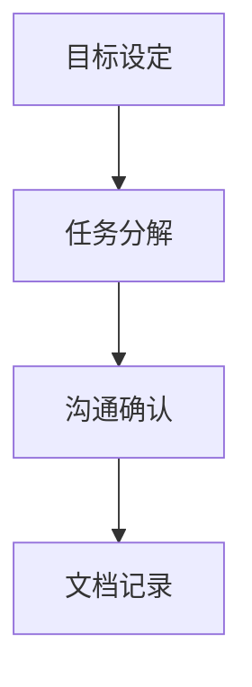

#### 4.2 绩效执行与监控

绩效执行是绩效考核的核心环节，它涉及到员工在实际工作中对绩效目标的实现情况。

**步骤：**

1. **任务执行**：员工根据绩效计划开始执行任务，确保任务的完成。

2. **进度监控**：定期对任务的执行进度进行监控，确保任务能够按照计划进行。

3. **反馈与调整**：对任务执行过程中出现的问题进行及时反馈，并根据反馈结果对绩效计划进行调整。

**核心概念与联系：**

- **任务执行**：员工需要按照绩效计划执行任务，确保任务的完成。
- **进度监控**：通过定期监控任务进度，及时发现和解决问题。
- **反馈与调整**：确保绩效计划的灵活性和适应性，提高绩效目标的实现率。

**流程图：**

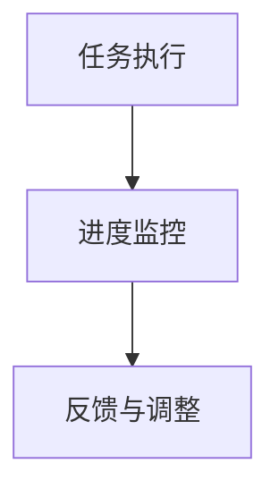

#### 4.3 绩效评估与反馈

绩效评估是对员工在考核周期内的表现进行评估，通过评估了解员工的绩效水平，为绩效改进提供依据。

**步骤：**

1. **数据收集**：收集员工在考核周期内的绩效数据，包括工作成果、行为表现、团队贡献等。

2. **评估分析**：对收集到的数据进行分析，评估员工的绩效表现。

3. **反馈沟通**：与员工进行沟通，反馈评估结果，并讨论改进措施。

4. **绩效改进**：根据反馈结果，制定绩效改进计划，帮助员工提高绩效。

**核心概念与联系：**

- **数据收集**：确保评估数据的真实性和准确性。
- **评估分析**：通过数据分析了解员工的绩效表现。
- **反馈沟通**：及时、准确地反馈评估结果，帮助员工认识到自己的优点和不足。
- **绩效改进**：通过持续的反馈和改进，提高员工的绩效水平。

**流程图：**

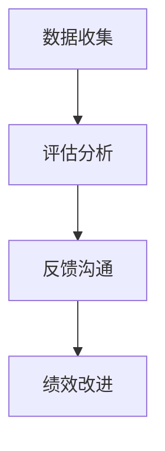

### 第5章 公平公正评估体系构建

#### 5.1 公平公正评估的重要性

公平公正的评估体系是绩效考核的核心，它直接影响员工的积极性和组织的整体绩效。

**步骤：**

1. **建立评估标准**：制定明确的评估标准，确保评估的客观性和公正性。

2. **培训评估人员**：对评估人员进行培训，提高他们的评估能力和公正性意识。

3. **监督评估过程**：确保评估过程的透明性和规范性，防止任何形式的偏见和歧视。

4. **反馈与申诉**：建立反馈和申诉机制，确保员工的意见能够得到及时回应和处理。

**核心概念与联系：**

- **建立评估标准**：确保评估的公正性和客观性。
- **培训评估人员**：提高评估人员的专业能力和公正性。
- **监督评估过程**：确保评估过程的透明性和规范性。
- **反馈与申诉**：保障员工的权益，提高评估体系的公信力。

**流程图：**

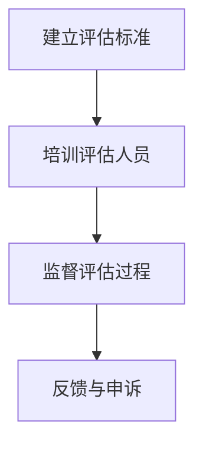

#### 5.2 公平公正评估的挑战与对策

公平公正的评估体系在实施过程中可能会面临各种挑战，需要采取相应的对策。

**挑战：**

1. **主观偏见**：评估人员可能会因个人偏好或情感因素导致评估结果的不公。
2. **信息不对称**：评估数据可能不够全面，导致评估结果的不准确。
3. **制度缺陷**：评估体系本身可能存在缺陷，无法完全保障公平公正。

**对策：**

1. **多元化评估团队**：建立多元化的评估团队，减少主观偏见。
2. **完善评估数据**：通过多种渠道收集评估数据，提高评估的准确性。
3. **持续优化评估体系**：定期对评估体系进行评估和改进，确保其有效性。

**核心概念与联系：**

- **多元化评估团队**：减少主观偏见，提高评估的客观性。
- **完善评估数据**：提高评估的准确性，确保评估结果的公正性。
- **持续优化评估体系**：确保评估体系能够适应组织的变化和发展。

**流程图：**

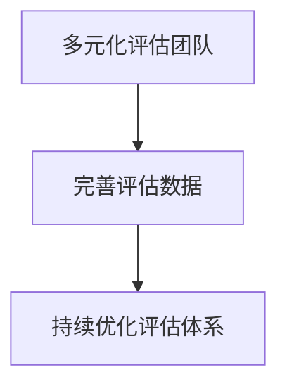

### 第6章 绩效考核工具与技术

#### 6.1 绩效考核工具的选择与应用

绩效考核工具的选择和应用对于提高绩效考核的效率和效果至关重要。

**步骤：**

1. **需求分析**：根据组织的实际情况和需求，选择适合的绩效考核工具。
2. **工具评估**：对选定的工具进行评估，确保其功能满足需求。
3. **培训与实施**：对评估人员进行培训，确保他们能够熟练使用绩效考核工具。
4. **工具优化**：根据使用反馈，对工具进行优化，提高其适用性。

**核心概念与联系：**

- **需求分析**：确保选定的工具能够满足组织的实际需求。
- **工具评估**：确保工具的功能和质量符合要求。
- **培训与实施**：提高评估人员的专业能力，确保工具的有效应用。
- **工具优化**：根据使用反馈，持续改进工具，提高其适用性和效率。

**流程图：**

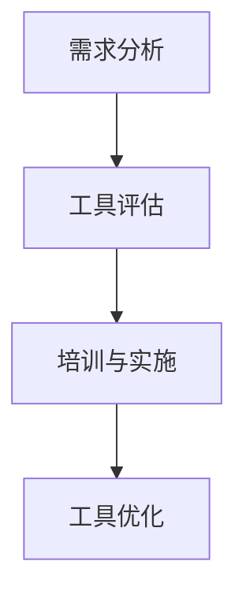

#### 6.2 数据分析技术在绩效考核中的应用

数据分析技术在绩效考核中发挥着重要作用，可以提高评估的准确性和有效性。

**步骤：**

1. **数据收集**：通过多种渠道收集与绩效考核相关的数据。
2. **数据清洗**：对收集到的数据进行分析，去除错误和异常数据。
3. **数据分析**：使用数据分析方法和技术，对数据进行分析，提取有价值的信息。
4. **数据可视化**：通过图表和报表，将分析结果进行可视化展示。

**核心概念与联系：**

- **数据收集**：确保数据的全面性和准确性。
- **数据清洗**：提高数据的可靠性和分析质量。
- **数据分析**：通过数据分析，发现数据中的规律和趋势。
- **数据可视化**：提高数据理解和分析的效率。

**流程图：**

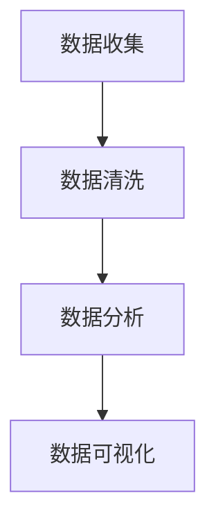

#### 6.3 人工智能在绩效考核中的应用前景

随着人工智能技术的快速发展，其在绩效考核中的应用前景日益广阔。

**步骤：**

1. **数据预处理**：使用人工智能技术对绩效考核数据进行预处理，包括数据清洗、数据归一化等。
2. **特征提取**：使用人工智能算法，从数据中提取有价值的特征。
3. **模型训练**：使用机器学习算法，对提取的特征进行训练，建立绩效考核模型。
4. **模型应用**：将训练好的模型应用于实际的绩效考核，提高评估的准确性和效率。

**核心概念与联系：**

- **数据预处理**：提高数据的可用性和分析质量。
- **特征提取**：从数据中提取有价值的信息，为模型训练提供数据支持。
- **模型训练**：建立基于人工智能的绩效考核模型，提高评估的准确性和效率。
- **模型应用**：将人工智能模型应用于实际绩效考核，实现自动化和智能化。

**流程图：**

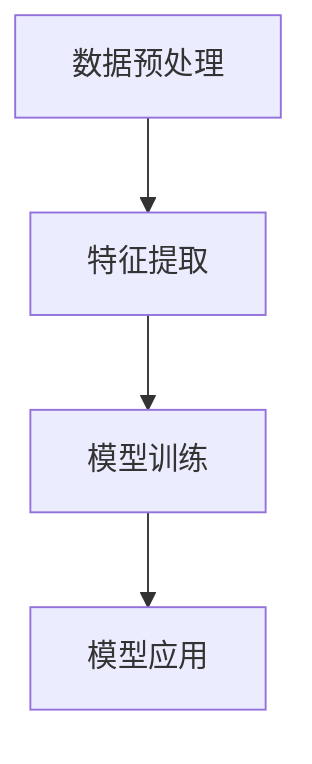

### 第7章 绩效考核持续改进

#### 7.1 绩效考核体系的优化

绩效考核体系的优化是确保其持续有效性的关键。

**步骤：**

1. **评估现状**：对当前的绩效考核体系进行评估，识别存在的问题和不足。
2. **分析原因**：分析问题产生的原因，包括评估标准、评估方法、评估过程等。
3. **制定改进计划**：根据评估结果和原因分析，制定详细的改进计划。
4. **实施改进**：按照改进计划，逐步实施改进措施。
5. **监控效果**：对改进措施的效果进行监控，确保改进目标的实现。

**核心概念与联系：**

- **评估现状**：了解绩效考核体系的实际情况，发现问题。
- **分析原因**：深入分析问题产生的原因，为改进提供依据。
- **制定改进计划**：明确改进的方向和步骤，确保改进的有效性。
- **实施改进**：按照计划逐步实施改进措施。
- **监控效果**：确保改进措施的有效性和持续性。

**流程图：**

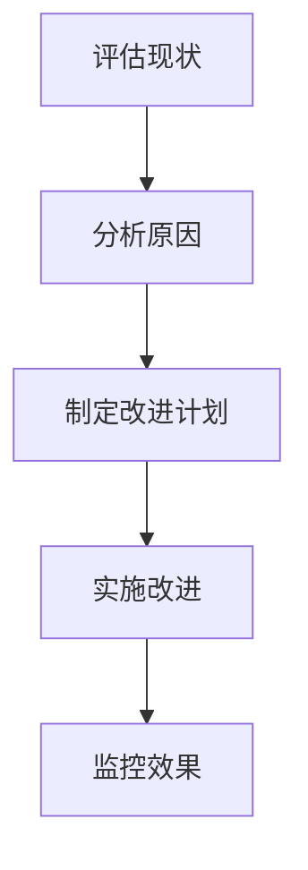

#### 7.2 绩效考核反馈机制的建立

绩效考核反馈机制的建立是确保绩效考核体系有效运行的重要环节。

**步骤：**

1. **确定反馈目标**：明确反馈机制的目标和作用，确保反馈的针对性。
2. **设计反馈流程**：设计反馈的流程和步骤，确保反馈的及时性和准确性。
3. **收集反馈信息**：通过多种渠道收集员工的反馈信息，包括工作表现、工作环境、工作压力等。
4. **分析反馈信息**：对收集到的反馈信息进行分析，识别存在的问题和不足。
5. **反馈与沟通**：将分析结果及时反馈给员工，进行沟通和讨论，制定改进措施。

**核心概念与联系：**

- **确定反馈目标**：明确反馈的目标和作用，确保反馈的针对性。
- **设计反馈流程**：确保反馈流程的规范性和有效性。
- **收集反馈信息**：广泛收集员工的反馈信息，确保反馈的全面性和准确性。
- **分析反馈信息**：通过数据分析，识别问题并提供改进方向。
- **反馈与沟通**：确保反馈信息的及时传递和有效沟通，促进改进措施的制定和实施。

**流程图：**

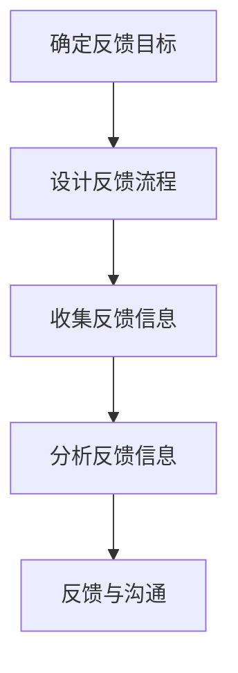

#### 7.3 绩效考核与员工发展的结合

绩效考核与员工发展的结合是提升员工绩效和满意度的重要途径。

**步骤：**

1. **明确发展目标**：根据员工的个人特点和职业发展规划，明确员工的发展目标。
2. **制定发展计划**：根据发展目标，制定具体的发展计划和行动方案。
3. **培训与发展**：提供针对性的培训和发展机会，帮助员工提升技能和知识。
4. **绩效评估与反馈**：将发展目标纳入绩效考核体系，对员工的绩效进行评估和反馈。
5. **持续跟踪与支持**：持续跟踪员工的发展进度，提供必要的支持和帮助。

**核心概念与联系：**

- **明确发展目标**：确保员工的发展目标与组织目标保持一致。
- **制定发展计划**：提供具体的发展路径和行动方案。
- **培训与发展**：提供培训和成长机会，提升员工的能力。
- **绩效评估与反馈**：将发展目标纳入绩效考核，确保员工的发展与绩效提升相结合。
- **持续跟踪与支持**：确保员工的发展得到持续的关注和支持。

**流程图：**

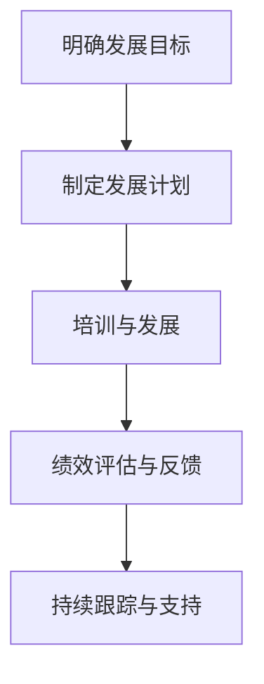

### 第8章 项目实战

#### 8.1 开发环境搭建

在这个项目实战中，我们将搭建一个简单的绩效考核系统。首先，我们需要选择合适的开发环境和工具。

**步骤：**

1. **选择开发语言**：我们选择Python作为开发语言，因为它具有简洁的语法和强大的库支持。
2. **安装Python**：从Python官方网站下载并安装Python。
3. **安装相关库**：使用pip工具安装必要的Python库，如Pandas、Numpy等。

**伪代码：**

```python
# 安装Python
python --version

# 安装相关库
pip install pandas numpy
```

**核心概念与联系：**

- **选择开发语言**：根据项目需求选择合适的开发语言。
- **安装Python**：确保开发环境的基本搭建。
- **安装相关库**：提供必要的库支持，提高开发效率。

#### 8.2 源代码详细实现

接下来，我们将实现绩效考核系统的核心功能，包括数据收集、评估和反馈。

**步骤：**

1. **数据收集**：使用Pandas库读取员工绩效数据。
2. **数据预处理**：对数据进行清洗和处理，确保数据的准确性和完整性。
3. **评估**：根据预设的评估标准，对员工绩效进行评估。
4. **反馈**：将评估结果反馈给员工。

**伪代码：**

```python
# 导入相关库
import pandas as pd

# 读取数据
data = pd.read_csv('performance_data.csv')

# 数据预处理
cleaned_data = preprocess_data(data)

# 评估
results = evaluate_performance(cleaned_data)

# 反馈
feedback_results(results)
```

**核心概念与联系：**

- **数据收集**：确保数据的准确性和完整性。
- **数据预处理**：提高数据的质量，确保评估的准确性。
- **评估**：根据预设标准对员工绩效进行评估。
- **反馈**：将评估结果及时反馈给员工。

#### 8.3 代码应用解读与分析

在这个环节，我们将对源代码的实现进行解读，并分析其应用场景和效果。

**步骤：**

1. **代码解读**：详细解读每个函数的实现逻辑和作用。
2. **应用分析**：分析代码在实际应用中的效果和优化空间。
3. **性能分析**：对代码的运行性能进行评估和优化。

**伪代码与解读：**

```python
# 数据预处理函数
def preprocess_data(data):
    # 去除重复数据
    data.drop_duplicates(inplace=True)
    
    # 处理缺失值
    data.fillna(method='ffill', inplace=True)
    
    return data

# 评估函数
def evaluate_performance(data):
    # 根据预设标准计算绩效得分
    scores = data['score_column']
    
    # 判断绩效等级
    level = 'Excellent' if scores > 90 else 'Good'
    
    return level

# 反馈函数
def feedback_results(results):
    # 向员工发送反馈邮件
    send_email(employee_email, results)
```

**核心概念与联系：**

- **代码解读**：确保代码的逻辑清晰，易于理解和维护。
- **应用分析**：确保代码能够满足实际需求，达到预期的效果。
- **性能分析**：优化代码的运行效率，提高系统的稳定性。

#### 8.4 实际案例分析和详细讲解剖析

为了更好地理解绩效考核系统的应用，我们将分析一个实际案例，并对案例进行详细讲解和剖析。

**案例：**某公司使用绩效考核系统对员工进行绩效评估。

**步骤：**

1. **数据收集**：收集员工的工作数据，包括工作时长、项目完成情况等。
2. **数据预处理**：清洗和处理数据，确保数据的准确性。
3. **评估**：根据预设的评估标准，对员工绩效进行评估。
4. **反馈**：将评估结果反馈给员工，并提出改进建议。

**详细讲解：**

1. **数据收集**：
   - **工作时长**：通过考勤系统收集员工的工作时长数据。
   - **项目完成情况**：通过项目管理工具收集员工的项目完成情况数据。

2. **数据预处理**：
   - **去除重复数据**：确保数据的唯一性。
   - **处理缺失值**：填补缺失数据，提高数据的完整性。

3. **评估**：
   - **评估标准**：设定具体的评估标准，如工作时长、项目完成质量等。
   - **计算绩效得分**：根据评估标准，计算每个员工的绩效得分。

4. **反馈**：
   - **反馈结果**：通过邮件或系统通知，将评估结果反馈给员工。
   - **改进建议**：根据评估结果，为员工提供改进建议，帮助他们提升绩效。

**核心概念与联系：**

- **数据收集**：确保数据的准确性和完整性。
- **数据预处理**：提高数据的质量，确保评估的准确性。
- **评估**：根据预设标准对员工绩效进行评估。
- **反馈**：将评估结果及时反馈给员工，帮助他们提升绩效。

#### 8.5 项目小结

通过本项目的实战，我们搭建了一个简单的绩效考核系统，实现了数据收集、评估和反馈的功能。以下是对项目的小结：

**成果总结：**

- **成功之处**：
  - 成功搭建了绩效考核系统，实现了对员工绩效的自动化评估和反馈。
  - 通过数据预处理，提高了数据的准确性和完整性。

- **不足之处**：
  - 系统的功能相对简单，需要进一步优化和完善。
  - 系统的性能有待提升，特别是在处理大量数据时。

**最佳实践：**

- **代码优化**：通过代码优化，提高系统的运行效率和稳定性。
- **用户体验**：优化用户界面，提高用户的使用体验。

**注意事项：**

- **数据安全**：确保数据的安全性和隐私性，防止数据泄露。
- **持续改进**：根据反馈结果，持续优化绩效考核系统，提高其适用性和效果。

**拓展阅读：**

- 《Python数据分析实战》
- 《绩效管理：技术与实践》

---

### 附录

#### 附录A 绩效考核相关法律法规

为了确保绩效考核的公平公正，许多国家和地区都制定了相关的法律法规。以下是一些主要的法律法规：

1. **中华人民共和国劳动合同法**：规定了劳动合同的签订、履行和解除，以及劳动者的权益保护。
2. **中华人民共和国劳动法**：规定了劳动者的工作时间、工资待遇、休息休假等基本权益。
3. **中华人民共和国公务员法**：规定了公务员的招聘、考核、晋升、待遇等具体规定。
4. **中华人民共和国公司法则**：规定了公司的组织形式、股权结构、董事会职责等，与绩效考核密切相关。

#### 附录B 绩效考核常用工具与软件

在绩效考核中，常用的工具和软件如下：

1. **KPI分析软件**：如FineBI、Tableau等，用于数据分析和可视化。
2. **绩效考核系统**：如钉钉、智麦绩效等，用于绩效数据的收集、评估和反馈。
3. **项目管理工具**：如Trello、JIRA等，用于项目任务的管理和进度跟踪。
4. **员工反馈系统**：如Zabbix、Nagios等，用于监控员工的工作状态和反馈。

#### 附录C 绩效考核参考资料与推荐阅读

为了深入了解绩效考核的理论和实践，以下是一些推荐的参考资料：

1. **《绩效管理：技术与实践》**：详细介绍了绩效考核的理论和方法，以及实际操作中的应用。
2. **《绩效改进：策略与实践》**：探讨了如何通过绩效考核实现组织的持续改进。
3. **《人力资源管理》**：涵盖了人力资源管理的各个领域，包括绩效考核在内。
4. **《Python数据分析实战》**：介绍了Python在数据分析中的应用，适用于绩效考核的数据处理和可视化。

### 总结

本文通过详细的目录大纲和逻辑清晰的章节内容，介绍了绩效考核：公平公正的评估体系。我们从绩效考核的概述开始，逐步深入到指标体系设计、绩效考核流程、公平公正评估体系构建、绩效考核工具与技术、绩效考核持续改进以及项目实战等方面。通过实际案例的分析和解读，我们了解了绩效考核的实际应用，并为读者提供了相关法律法规、常用工具和参考资料。

希望本文能够帮助读者更好地理解绩效考核的原理和方法，以及如何构建一个公平公正的评估体系。在实践中，我们需要根据组织的实际情况，灵活应用这些理论和工具，不断提升绩效考核的效率和质量。

最后，感谢读者对本篇文章的关注，如果您有任何问题或建议，欢迎随时提出，我们将持续优化和完善相关内容。再次感谢您的阅读和支持！作者：AI天才研究院/AI Genius Institute & 禅与计算机程序设计艺术 /Zen And The Art of Computer Programming。

