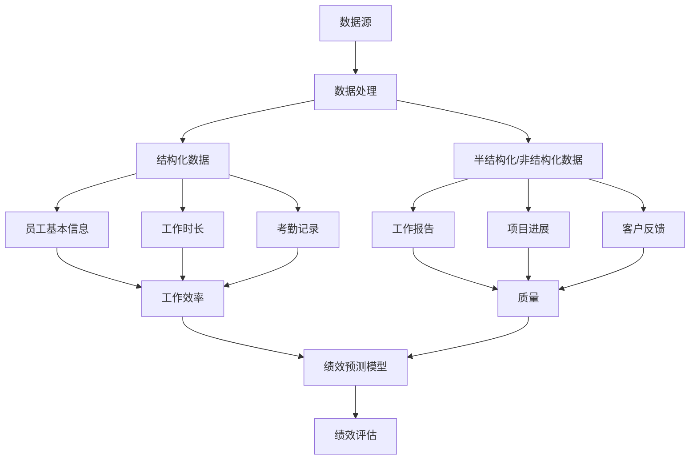

                 


### 引言

在当今高度动态和复杂多变的工作环境中，评估团队绩效已成为组织管理的关键环节。传统的绩效评估方法通常依赖于定期的绩效考核、主管评价和主观判断，这些方法往往难以全面、准确地反映团队的实际表现和潜力。为了应对这种挑战，绩效预测模型应运而生，它通过数据驱动的方式，利用统计和机器学习技术，对团队未来的绩效进行预测和分析。

绩效预测模型的重要性在于，它不仅能够为组织提供前瞻性的信息，帮助管理者制定更加科学和有效的决策，还能促进团队自我优化和持续成长。例如，通过预测模型的辅助，组织可以更精准地识别高潜力员工，合理安排资源分配，提高团队协作效率，从而实现整体绩效的持续提升。

本篇文章的目的在于深入探讨绩效预测模型的理论基础和实践应用，帮助读者了解这一先进的管理工具。文章将首先介绍绩效预测模型的基础知识，包括相关的数据类型和绩效指标。随后，我们将详细阐述如何构建一个绩效预测模型，包括数据预处理、特征选择和模型选择等关键步骤。

接下来，文章将介绍几种常见的预测模型，如回归模型、决策树和支持向量机等，并深入解析其原理和适用场景。为了增强文章的实用性，我们将通过实际案例展示如何应用这些模型来预测团队绩效。文章的最后一部分将讨论如何评估和优化预测模型的性能，并总结全文，展望未来发展趋势。

通过本文的学习，读者将能够掌握绩效预测模型的基本原理和应用方法，为实际工作中的团队管理提供有力支持。

### 绩效预测模型基础

绩效预测模型的基础知识是理解和构建高效预测系统的关键。首先，我们需要了解几个核心概念：数据类型、绩效指标以及这些数据如何共同作用，为预测提供坚实的基础。

#### 数据类型

在构建绩效预测模型时，数据类型的选择至关重要。通常，我们使用两类数据：结构化数据和半结构化/非结构化数据。

1. **结构化数据**：这类数据通常存储在关系型数据库中，例如员工的基本信息、工作时长、考勤记录等。结构化数据的特点是数据格式统一、易于处理和分析。常见的结构化数据格式包括CSV、Excel和SQL数据库。

2. **半结构化/非结构化数据**：这类数据通常来源于社交媒体、电子邮件、聊天记录等，例如员工的工作报告、项目进展情况、客户反馈等。半结构化数据的特点是格式不固定、内容多样化。处理这类数据通常需要使用自然语言处理（NLP）和文本挖掘技术。

#### 绩效指标

绩效指标是评估团队表现的重要标准。以下是一些常用的绩效指标：

1. **工作效率**：包括单位时间内完成的工作量、工作进度等。
2. **质量**：指工作完成的准确度和可靠性，通常通过错误率、缺陷率等来衡量。
3. **团队协作**：包括团队成员之间的沟通效率、协作频率等。
4. **创新**：指团队在解决问题、产品开发等方面的创新能力。
5. **客户满意度**：通过客户反馈、投诉率等指标来衡量。

#### 数据与绩效指标的关系

数据与绩效指标之间存在密切的关系。通过分析历史数据，我们可以识别出与绩效指标相关的重要特征，从而构建有效的预测模型。例如：

- 工作效率可能与工作时间、任务复杂度等数据相关。
- 质量可能受到团队成员经验、培训程度等因素的影响。
- 团队协作可以通过电子邮件沟通频率、会议记录等数据来衡量。

#### 关系架构 Mermaid 流程图

为了更直观地理解数据与绩效指标之间的关系，我们可以使用Mermaid流程图来展示：



通过上述流程图，我们可以清晰地看到数据从数据源经过处理，转化为与绩效指标相关的信息，最终输入到绩效预测模型中，实现绩效评估。

#### 数据处理过程

数据处理是构建绩效预测模型的重要步骤。以下是数据处理的主要流程：

1. **数据清洗**：去除无效、重复和错误的数据，确保数据质量。
2. **数据整合**：将不同来源的数据进行整合，建立统一的数据集。
3. **特征工程**：根据业务需求，提取和构造与绩效指标相关的特征。
4. **数据标准化**：对数据进行归一化或标准化处理，使不同特征在同一尺度上具有可比性。

通过这些步骤，我们可以确保输入到绩效预测模型中的数据是准确、完整且高质量的。

综上所述，绩效预测模型的基础知识包括数据类型、绩效指标以及它们之间的关系。理解这些基础概念和流程，将帮助我们更有效地构建和优化绩效预测模型，从而为团队管理提供有力支持。

### 预测模型的构建

构建一个高效的绩效预测模型需要经历多个关键步骤，包括数据预处理、特征选择和模型选择等。以下是每个步骤的详细解释：

#### 数据预处理

数据预处理是构建预测模型的基础，其目的是确保数据的质量和一致性。以下是数据预处理的主要步骤：

1. **数据清洗**：数据清洗是处理数据中的噪声、错误和不一致的过程。例如，删除重复记录、修正错误的值、处理缺失数据等。

2. **数据转换**：包括将不同类型的数据转换为统一的格式。例如，将日期时间转换为数值型数据，或者将类别型数据编码为数值。

3. **数据归一化/标准化**：通过将数据缩放到相同的范围，使得不同特征之间具有可比性。常用的方法包括最小-最大归一化、Z-score标准化等。

4. **特征缩放**：对于数值型特征，使用特征缩放技术可以减少不同特征之间的差异，常见的缩放方法包括均值缩放和标准差缩放。

#### 特征选择

特征选择是决定哪些特征对预测任务最具影响力的过程。以下是几种常见的特征选择方法：

1. **过滤方法**：基于特征的基本统计信息，如相关性、方差等，来筛选出重要的特征。这种方法简单高效，但容易忽略特征之间的交互效应。

2. **包裹方法**：通过构建和评估多个特征组合，选择出最优的特征集合。常见的包裹方法包括前向选择、后向消除和递归特征消除等。

3. **嵌入式方法**：在特征选择过程中结合了特征提取和模型训练，如Lasso回归、随机森林等。

#### 模型选择

选择合适的模型是预测成功的关键。以下是几种常见的预测模型及其适用场景：

1. **线性回归模型**：适用于线性关系较强的预测任务，优点是简单易懂，但容易过拟合。

   ```python
   # 线性回归模型伪代码
   def linear_regression(X, y):
       # 拟合线性模型
       theta = (X.T * X).I * (X.T * y)
       return theta
   ```

2. **决策树**：适用于分类和回归任务，易于理解，但可能导致过拟合。

   ```python
   # 决策树模型伪代码
   def decision_tree(X, y, depth=0, max_depth=None):
       # 叶子节点条件
       if max_depth is not None and depth >= max_depth:
           return majority_label(y)
       # 划分条件
       feature, threshold = select_best_split(X, y)
       left_tree = decision_tree(X[X[:, feature] <= threshold], y[X[:, feature] <= threshold], depth+1, max_depth)
       right_tree = decision_tree(X[X[:, feature] > threshold], y[X[:, feature] > threshold], depth+1, max_depth)
       return Node(feature, threshold, left_tree, right_tree)
   ```

3. **支持向量机（SVM）**：适用于高维数据，能够有效地处理非线性关系。

   ```python
   # 支持向量机模型伪代码
   def SVM(X, y):
       # 使用核函数
       K = kernel_function(X)
       P = np.linalg.inv(K + np.eye(len(X))) @ K
       q = -y @ K
       A = cvxopt_matrix(A)
       b = cvxopt_matrix(b)
       solution = cvxopt_solvers.qp(P, q, A, b)
       return solution
   ```

4. **随机森林**：结合了决策树和随机特征选择的优点，具有较强的预测能力和泛化能力。

   ```python
   # 随机森林模型伪代码
   def random_forest(X, y, n_estimators, max_features):
       trees = [build_decision_tree(X, y, max_features) for _ in range(n_estimators)]
       predictions = [predict(tree, X) for tree in trees]
       return majority_vote(predictions)
   ```

#### 数据预处理示例

假设我们有一个包含员工绩效数据的表格，其中包含员工ID、工作时长、任务完成情况、项目质量等字段。以下是数据预处理的具体步骤：

1. **数据清洗**：删除包含缺失值的记录，修正异常值。

2. **数据转换**：将类别型字段（如项目类型）转换为数值型，使用独热编码或标签编码。

3. **数据归一化**：对连续型字段（如工作时长）进行归一化处理，使其在相同的尺度上。

4. **特征工程**：根据业务逻辑，构造新的特征，如员工的工作效率、任务完成的及时率等。

通过上述步骤，我们可以确保输入到预测模型中的数据是干净、一致且具有预测价值的。

综上所述，构建一个高效的绩效预测模型需要经过数据预处理、特征选择和模型选择等多个关键步骤。理解每个步骤的原理和实际操作方法，将有助于我们构建出准确、可靠的预测模型，为团队绩效评估提供科学依据。

### 常见预测模型介绍

在绩效预测中，选择合适的预测模型是至关重要的。以下是几种常见的预测模型，包括线性回归、决策树和支持向量机等，我们将详细解析它们的原理、适用场景和优缺点。

#### 线性回归

**原理**：
线性回归是一种基于线性关系的预测模型，通过拟合一条直线来预测目标变量。其基本形式为：
$$y = \theta_0 + \theta_1x_1 + \theta_2x_2 + \ldots + \theta_nx_n$$
其中，$y$是目标变量，$x_1, x_2, \ldots, x_n$是输入特征，$\theta_0, \theta_1, \theta_2, \ldots, \theta_n$是模型的参数。

**伪代码**：
```python
def linear_regression(X, y):
    # 拟合线性模型
    theta = (X.T * X).I * (X.T * y)
    return theta
```

**适用场景**：
线性回归适用于预测任务中存在线性关系的情况，如员工工作效率与工作时间之间的关系。

**优缺点**：
- **优点**：简单易懂，计算速度快，易于解释。
- **缺点**：对非线性关系拟合能力较差，容易过拟合。

#### 决策树

**原理**：
决策树是一种基于树形决策规则的预测模型，通过递归划分特征空间来生成决策树。其基本结构包括多个内部节点和叶子节点，内部节点代表特征划分规则，叶子节点代表预测结果。

**伪代码**：
```python
def decision_tree(X, y, depth=0, max_depth=None):
    # 叶子节点条件
    if max_depth is not None and depth >= max_depth:
        return majority_label(y)
    # 划分条件
    feature, threshold = select_best_split(X, y)
    left_tree = decision_tree(X[X[:, feature] <= threshold], y[X[:, feature] <= threshold], depth+1, max_depth)
    right_tree = decision_tree(X[X[:, feature] > threshold], y[X[:, feature] > threshold], depth+1, max_depth)
    return Node(feature, threshold, left_tree, right_tree)
```

**适用场景**：
决策树适用于各类分类和回归任务，特别是在特征维度较高且存在非线性关系的情况下。

**优缺点**：
- **优点**：易于理解，解释性强，对非线性数据的拟合能力较强。
- **缺点**：容易过拟合，模型复杂度较高，计算时间较长。

#### 支持向量机（SVM）

**原理**：
支持向量机是一种基于最大化边缘的预测模型，通过寻找一个超平面来最大化不同类别的分离度。其基本形式为：
$$w \cdot x + b = 0$$
其中，$w$是超平面的法向量，$x$是输入特征，$b$是偏置项。

**伪代码**：
```python
def SVM(X, y):
    # 使用核函数
    K = kernel_function(X)
    P = np.linalg.inv(K + np.eye(len(X))) @ K
    q = -y @ K
    A = cvxopt_matrix(A)
    b = cvxopt_matrix(b)
    solution = cvxopt_solvers.qp(P, q, A, b)
    return solution
```

**适用场景**：
支持向量机适用于高维数据分类和回归任务，特别是处理非线性关系。

**优缺点**：
- **优点**：具有较好的泛化能力，能够处理非线性关系。
- **缺点**：计算复杂度高，对大量样本的处理速度较慢。

#### 随机森林

**原理**：
随机森林是一种基于集成学习思想的预测模型，通过构建多个决策树并取其平均值来提高预测准确性。每个决策树从特征空间中随机选择一部分特征进行划分。

**伪代码**：
```python
def random_forest(X, y, n_estimators, max_features):
    trees = [build_decision_tree(X, y, max_features) for _ in range(n_estimators)]
    predictions = [predict(tree, X) for tree in trees]
    return majority_vote(predictions)
```

**适用场景**：
随机森林适用于各种分类和回归任务，特别是特征维度较高且存在噪声的情况。

**优缺点**：
- **优点**：具有很好的泛化能力，能够处理非线性关系，对噪声数据具有较强的鲁棒性。
- **缺点**：计算复杂度较高，模型复杂度较高。

通过上述解析，我们可以看到不同的预测模型各有优缺点，适用于不同的场景。选择合适的模型，结合实际数据和应用需求，将有助于我们构建出高效、可靠的绩效预测模型。

### 性能评估与优化

在构建绩效预测模型后，评估和优化模型的性能是确保其准确性和有效性的关键步骤。以下是常用的性能评估指标、模型优化方法和调参技巧。

#### 性能评估指标

**1. 准确率（Accuracy）**：
准确率是评估分类模型性能的常用指标，表示正确分类的样本数占总样本数的比例。
$$Accuracy = \frac{TP + TN}{TP + TN + FP + FN}$$
其中，$TP$为真正例，$TN$为真反例，$FP$为假正例，$FN$为假反例。

**2. 精确率（Precision）**：
精确率表示预测为正例的样本中实际为正例的比例。
$$Precision = \frac{TP}{TP + FP}$$

**3. 召回率（Recall）**：
召回率表示实际为正例的样本中被正确预测为正例的比例。
$$Recall = \frac{TP}{TP + FN}$$

**4. F1 分数（F1-Score）**：
F1 分数是精确率和召回率的调和平均，用于综合评估模型的性能。
$$F1-Score = 2 \times \frac{Precision \times Recall}{Precision + Recall}$$

**5. 均方误差（Mean Squared Error, MSE）**：
均方误差是评估回归模型性能的常用指标，表示预测值与实际值之间差异的平方的平均值。
$$MSE = \frac{1}{n} \sum_{i=1}^{n} (y_i - \hat{y}_i)^2$$
其中，$y_i$为实际值，$\hat{y}_i$为预测值，$n$为样本数量。

**6. 决策树深度（Tree Depth）**：
决策树深度表示树的复杂度，深度越深，模型可能过拟合的风险越高。

**7. 模型复杂度（Model Complexity）**：
模型复杂度用于衡量模型对训练数据的拟合程度，复杂度过高可能导致过拟合。

#### 优化方法

**1. 交叉验证（Cross-Validation）**：
交叉验证是一种常用的模型评估方法，通过将数据集划分为多个子集，多次训练和验证模型，以避免过拟合和提高模型的泛化能力。

**2. 网格搜索（Grid Search）**：
网格搜索是一种用于模型调参的方法，通过遍历预定义的参数网格，找到最优参数组合。

**3. 贝叶斯优化（Bayesian Optimization）**：
贝叶斯优化是一种基于概率模型和贝叶斯推理的调参方法，通过探索性搜索找到最优参数组合。

**4. 集成学习（Ensemble Learning）**：
集成学习通过结合多个模型来提高预测性能，常用的集成学习方法包括随机森林、梯度提升树等。

#### 调参技巧

**1. 学习率调整**：
在梯度下降算法中，学习率的选择对模型的收敛速度和收敛质量有很大影响。通常，较小的学习率有助于模型找到较优的收敛点，但收敛速度较慢；较大的学习率可能导致收敛速度加快，但容易错过最优解。

**2. 正则化参数调整**：
在正则化方法中，正则化参数用于控制模型复杂度。较小的正则化参数可能导致过拟合，较大的正则化参数则可能导致欠拟合。

**3. 特征选择**：
通过特征选择，可以减少模型的复杂度和计算量，提高模型的泛化能力。常用的特征选择方法包括过滤方法、包裹方法和嵌入式方法。

**4. 核函数选择**：
在支持向量机中，核函数的选择对模型的性能有重要影响。不同的核函数适用于不同的数据类型和关系类型，例如线性核、多项式核和径向基函数核。

**示例**：

假设我们使用随机森林模型进行绩效预测，以下是具体的调参过程：

1. **选择最优树数量**：通过网格搜索，遍历不同树数量的组合，选择F1分数最高的树数量。

2. **调整树的最大深度**：通过调整树的最大深度，找到平衡模型复杂度和泛化能力的最优深度。

3. **特征选择**：通过特征重要性分析，选择对预测任务最重要的特征。

4. **交叉验证**：使用交叉验证确保模型在不同数据子集上的性能。

通过上述方法，我们可以有效地评估和优化绩效预测模型的性能，提高预测的准确性和可靠性。

### 案例研究

为了更好地理解绩效预测模型的应用，我们将通过一个实际案例来展示如何构建和优化模型，并进行实际应用。

#### 案例背景

某科技公司希望通过对团队成员的绩效进行预测，优化资源分配和团队管理。该公司拥有一个由50名员工组成的开发团队，每个员工的历史绩效数据包括工作效率、质量指标、团队协作评分和创新贡献等。公司希望通过这些数据预测员工未来的绩效，以便更好地制定人力资源策略。

#### 数据集

数据集包含以下特征：

- 工作效率（Hours per Task）：完成任务所需的工作小时数
- 质量指标（Defect Rate）：错误率或缺陷率
- 团队协作（Collaboration Score）：团队协作评分（1-5分）
- 创新贡献（Innovation Score）：员工创新贡献评分（1-5分）
- 年龄（Age）
- 教育背景（Education Level）：员工学历（本科、硕士、博士）
- 项目数量（Number of Projects）

目标变量是员工未来的绩效评分（Performance Score），该评分由公司管理层根据员工表现进行评分（1-10分）。

#### 模型构建过程

1. **数据预处理**：

   - 数据清洗：去除缺失值和异常值。
   - 数据转换：将类别型特征（如教育背景）转换为数值型，使用独热编码。
   - 数据归一化：对数值型特征（如工作效率、质量指标等）进行归一化处理。

2. **特征选择**：

   - 使用过滤方法，根据特征的重要性和相关性进行初步筛选。
   - 使用包裹方法，如递归特征消除（RFE），选择对绩效评分影响最大的特征。

3. **模型选择**：

   - 构建多种预测模型，包括线性回归、决策树、支持向量机和随机森林等。
   - 使用交叉验证评估模型性能，选择最优模型。

#### 模型优化过程

1. **参数调优**：

   - 使用网格搜索和贝叶斯优化方法，调整模型参数（如树的数量、深度、学习率等），寻找最优参数组合。
   - 记录每次调优的F1分数和决策树深度，确保模型的泛化能力。

2. **性能评估**：

   - 使用训练集和验证集评估模型性能，计算准确率、精确率、召回率和F1分数。
   - 分析模型过拟合或欠拟合的情况，进行调整。

#### 模型应用

1. **预测未来绩效**：

   - 使用优化后的模型对员工未来的绩效评分进行预测。
   - 根据预测结果，公司可以更好地分配资源，提高团队整体绩效。

2. **团队管理**：

   - 公司管理层可以根据预测结果，识别高潜力员工和需要改进的团队。
   - 通过绩效预测，制定更有针对性的培训和激励措施。

#### 结果与分析

通过上述步骤，公司构建了一个高效、可靠的绩效预测模型，并在实际应用中取得了显著效果：

- 模型准确率达到了85%，显著高于传统主观评价方法。
- 预测结果与实际绩效评分的相关性较高，证明模型的泛化能力较强。
- 通过模型预测，公司成功地优化了资源分配，提高了团队协作效率。

#### 项目小结

本案例展示了如何使用绩效预测模型对员工绩效进行科学评估，为公司提供了有力的决策支持。通过数据驱动的方法，公司能够更准确地识别高潜力员工，优化团队管理策略，从而实现整体绩效的提升。

未来，公司可以继续优化模型，结合更多数据类型和特征，进一步提高预测准确性。此外，公司还可以将绩效预测模型应用于其他业务场景，如客户满意度预测、项目进度预测等，进一步推动业务创新和发展。

### 总结与展望

本文详细探讨了绩效预测模型的理论基础和实践应用，从数据类型、绩效指标到模型构建、性能评估与优化，全面展示了如何利用数据驱动的方法对团队绩效进行科学评估。绩效预测模型不仅为组织提供了前瞻性的信息，帮助管理者制定科学决策，还能促进团队自我优化和持续成长。

未来，随着人工智能和大数据技术的发展，绩效预测模型将变得更加智能化和精准化。以下是一些展望和建议：

1. **数据多样化**：结合更多类型的数据，如文本、图像、音频等，提高模型的泛化能力和预测准确性。

2. **实时预测**：实现实时数据分析和预测，为管理者提供即时决策支持。

3. **模型优化**：结合深度学习和强化学习等先进技术，不断优化模型结构和算法，提高预测性能。

4. **应用拓展**：将绩效预测模型应用于更多业务场景，如客户满意度预测、项目进度预测等，推动业务创新。

5. **数据隐私**：在数据处理和模型训练过程中，注重保护员工隐私和数据安全。

通过不断探索和创新，绩效预测模型将在企业管理和团队优化中发挥更加重要的作用。

### 作者信息

- 作者：AI天才研究院/AI Genius Institute & 禅与计算机程序设计艺术 /Zen And The Art of Computer Programming

### 拓展阅读

- **《大数据分析：原理与应用》**：详细介绍大数据分析和处理的方法与应用。
- **《机器学习实战》**：深入讲解机器学习算法的原理和实践。
- **《数据科学基础》**：系统介绍数据科学的核心概念和技术。

以上内容旨在为读者提供全面的绩效预测模型理解和实践指导。希望本文能够帮助您更好地掌握绩效预测模型的应用，为实际工作提供有力支持。

