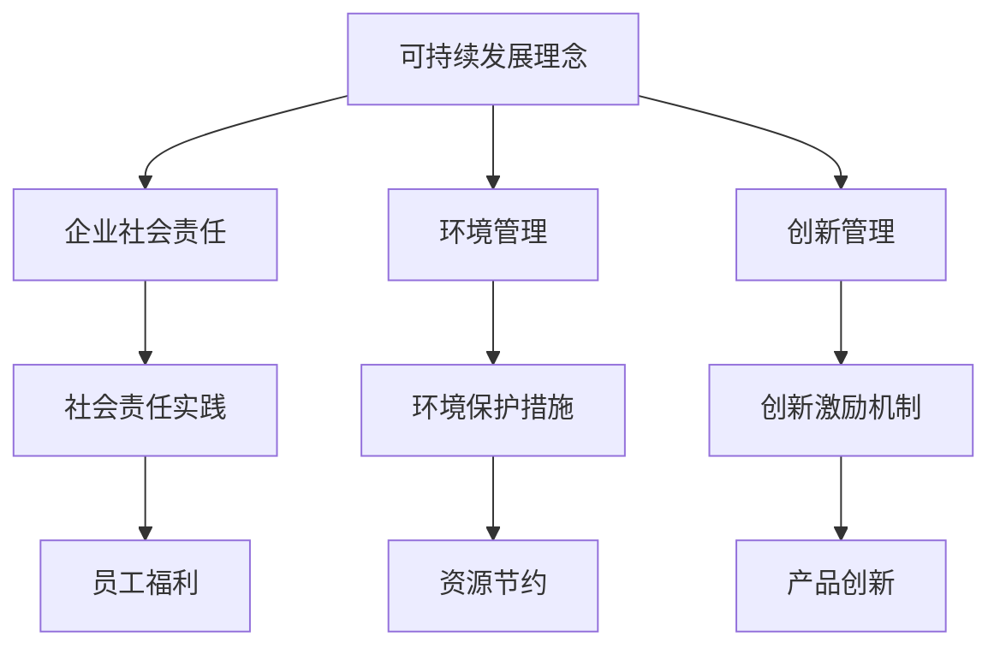
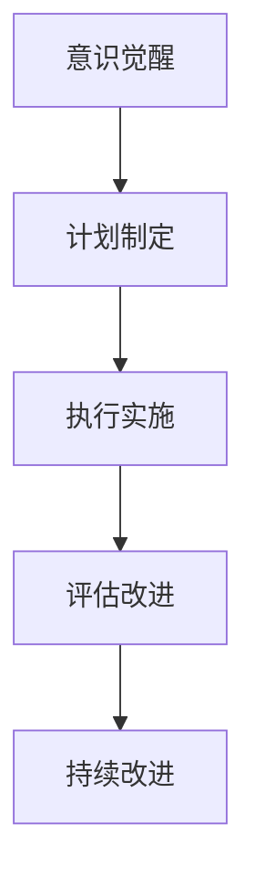
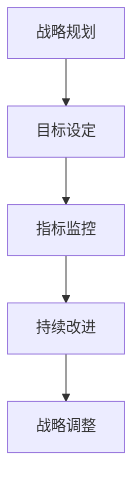

                 

### 深入分析目录大纲

为了确保文章的逻辑清晰、结构紧凑且内容丰富，我们需要对每一个部分进行详细的拆解和分析。以下是按照目录大纲进行的逐步深入分析：

#### 引言部分

**第1章：绿色领导力的背景与重要性**
- 背景介绍：解释绿色领导力的起源、发展历程及其在当今商业环境中的重要性。
- 可持续发展的全球趋势：分析全球范围内对可持续发展的重视，以及相关政策和法规对企业的影响。
- 企业在可持续发展中的作用：讨论企业在推动可持续发展中的责任和作用。

**第2章：可持续发展的理念与目标**
- 可持续发展的原则：阐述可持续发展的三大支柱，即经济、社会和环境可持续性。
- 可持续发展的目标：讨论企业如何设定可持续发展目标，并制定相应的战略和行动计划。
- 绿色领导力与可持续发展的关系：分析绿色领导力如何推动企业实现可持续发展目标。

#### 第一部分：绿色领导力的理论基础

**第1章：绿色领导力的核心概念**
- 绿色领导力的定义与内涵：解释绿色领导力的基本定义，并阐述其内涵和意义。
- 绿色领导力的特征与价值：详细描述绿色领导力的特征，并分析其对企业和社会的价值。

**第2章：绿色领导力框架**
- 绿色领导力模型：使用Mermaid流程图展示绿色领导力的框架结构，解释各个组成部分及其相互关系。
- 绿色领导力的发展阶段：介绍绿色领导力从初级到高级的发展路径，以及不同阶段的特征和实践方法。

#### 第二部分：可持续发展的原则与框架

**第3章：可持续发展的基本原则**
- 可持续发展的三大支柱：分别解释经济可持续性、社会可持续性和环境可持续性的概念和重要性。
- 可持续发展的目标与指标：讨论企业如何设定可持续发展目标，并介绍常用的可持续发展指标体系。

**第4章：可持续发展的框架与应用**
- 可持续发展管理体系：使用Mermaid流程图展示可持续发展管理体系的基本结构，包括战略规划、目标设定、指标监控和持续改进等环节。
- 可持续发展的企业实践：通过案例分析，展示企业如何将可持续发展理念应用到实际运营中。

#### 第三部分：企业实践案例研究

**第5章：绿色领导力实践案例**
- 案例一：公司A的绿色转型：详细介绍公司A的绿色转型策略、实施过程和成果。
- 案例二：公司B的可持续发展战略：分析公司B如何制定和实施可持续发展战略，以及取得的成效。

**第6章：绿色领导力实践分析**
- 绿色领导力实践的优势与挑战：讨论绿色领导力实践的优势，以及可能面临的挑战和障碍。
- 绿色领导力实践的启示与建议：总结绿色领导力实践的经验和教训，提出对企业实践的启示和建议。

#### 第四部分：管理工具与方法

**第7章：绿色领导力的管理工具**
- 绿色领导力评估工具：介绍用于评估企业绿色领导力水平的工具和方法，如评估问卷、数据分析和可持续发展报告等。
- 绿色领导力的发展策略：讨论企业如何制定和实施绿色领导力发展策略，包括培训、激励机制和领导力培养等。

#### 结尾部分

在文章的结尾部分，我们将总结全文，重申绿色领导力和可持续发展的重要性，并展望未来绿色领导力的发展趋势。同时，给出一些最佳实践建议，帮助读者更好地理解和应用绿色领导力的理念。

通过上述分析，我们可以确保每一部分的内容都丰富且具体，结构清晰，逻辑性强。这样的文章将能够引导读者深入理解绿色领导力和可持续发展的核心概念、实践方法和未来趋势，从而为企业和社会的可持续发展提供有益的指导。

---

### 标题、关键词和摘要撰写

**文章标题：**
《绿色领导力：可持续发展理念的企业实践》

**关键词：**
绿色领导力、可持续发展、企业实践、可持续发展理念、管理工具、绿色转型、案例分析

**摘要：**
本文深入探讨了绿色领导力的概念、理论基础、可持续发展原则以及企业实践。通过分析绿色领导力的核心概念与内涵，本文揭示了其与传统领导力的区别及其对企业和社会的价值。接着，本文介绍了可持续发展的基本原则、目标与指标，以及绿色领导力的框架和应用。通过详细的企业案例研究和实践分析，本文展示了绿色领导力在企业实践中的具体应用和成效。最后，本文提出了一些最佳实践建议，为企业在实现可持续发展目标的过程中提供了指导。

---

### 具体内容撰写

#### 引言部分

**第1章：绿色领导力的背景与重要性**

**背景介绍：**
绿色领导力作为一种新兴的领导理念，源于对企业社会责任和环境保护的日益关注。随着全球气候变化和环境问题的加剧，企业开始意识到其运营对自然和社会的影响，并逐渐将可持续发展理念融入到其核心战略中。绿色领导力应运而生，旨在通过企业领导者的引导和推动，实现经济、社会和环境的协调发展。

**全球趋势：**
近年来，各国政府纷纷出台相关政策，鼓励企业采取可持续发展措施。例如，《巴黎协定》明确了全球应对气候变化的行动框架，许多国家和地区也制定了绿色发展战略，推动企业减少碳排放、保护生态环境。这些政策和法规为绿色领导力的实践提供了有力支持，也促使企业更加重视绿色领导力在企业战略中的地位。

**企业在可持续发展中的作用：**
企业在可持续发展中发挥着至关重要的作用。首先，企业是经济发展的重要推动力量，通过技术创新和产业升级，可以实现资源的高效利用和环境的保护。其次，企业承担着社会责任，通过参与社会公益活动、支持社区发展，可以提高企业形象，增强员工和社会的凝聚力。最后，企业作为市场经济的重要组成部分，其可持续发展行为能够引导和推动整个产业链的绿色转型。

**第2章：可持续发展的理念与目标**

**可持续发展的原则：**
可持续发展原则是指导企业实现长期发展的基本准则，主要包括经济可持续性、社会可持续性和环境可持续性。

- 经济可持续性：强调企业在保持经济效益的同时，要实现资源的合理利用和成本的有效控制。这要求企业采用先进的 technologies，优化生产流程，提高生产效率，从而实现可持续发展。
- 社会可持续性：关注企业在促进社会进步和发展中的作用，包括提供就业机会、支持社区发展、推动教育普及等。企业应积极履行社会责任，为社会创造价值。
- 环境可持续性：强调企业在保护环境和生态系统中的责任，通过减少污染物排放、节约能源和资源、推广绿色生产方式等，实现环境保护与经济发展的协调。

**可持续发展的目标：**
企业可持续发展的目标在于实现长期、稳定和健康的发展。具体目标包括：

- 经济效益：通过创新和效率提升，实现企业的利润增长和市场扩张。
- 社会效益：提高员工福利，促进社区和谐，增强企业的社会影响力。
- 环境效益：减少环境污染，保护自然资源，推动绿色生产和消费。

**绿色领导力与可持续发展的关系：**
绿色领导力是可持续发展的重要保障。首先，绿色领导力通过塑造企业的价值观和行为规范，引导企业实现可持续发展目标。其次，绿色领导力能够激发员工的创造力和参与度，推动企业内部创新和变革。最后，绿色领导力能够增强企业的竞争力和市场地位，提升企业在全球市场中的影响力。

通过以上分析，我们可以看到，绿色领导力不仅是一种管理理念，更是一种战略思维，它能够帮助企业实现经济、社会和环境的协调发展，推动企业走向可持续发展的未来。

#### 第一部分：绿色领导力的理论基础

**第1章：绿色领导力的核心概念**

**定义与内涵：**
绿色领导力是指企业领导者通过制定和实施可持续发展战略，推动企业在经济、社会和环境三个方面实现协调发展的领导能力。它不仅关注企业的经济效益，更强调企业在社会和环境保护方面的责任。绿色领导力的内涵包括以下几个方面：

- **可持续发展的价值观**：绿色领导力强调企业要遵循可持续发展的原则，将经济、社会和环境视为统一的整体，实现三者的协调发展。
- **社会责任**：绿色领导力要求企业领导者不仅要追求经济效益，还要关注企业的社会责任，通过参与社会公益活动、支持社区发展等方式，提升企业的社会形象和影响力。
- **环境保护**：绿色领导力重视环境保护，通过采用绿色生产技术、减少污染物排放、保护自然资源等手段，实现企业的绿色可持续发展。
- **创新驱动**：绿色领导力鼓励企业通过技术创新和管理创新，提高生产效率和资源利用率，推动企业的绿色转型和可持续发展。

**与传统领导力的区别：**
绿色领导力与传统领导力在几个关键方面存在显著差异：

- **目标导向**：传统领导力主要关注企业的短期经济效益，而绿色领导力则强调长期可持续发展，追求经济、社会和环境的综合效益。
- **价值观**：传统领导力可能忽视企业的社会责任和环境保护，而绿色领导力则将社会责任和环境保护作为核心价值观，贯穿于企业的各个方面。
- **管理方法**：传统领导力往往依赖于权威和命令，而绿色领导力则更注重协商、合作和参与，通过激发员工的创造力和主动性来实现企业的目标。
- **视野**：传统领导力关注企业内部的管理和运营，而绿色领导力则将视野扩展到企业外部，关注企业与社会、环境的关系，以及如何通过企业行为推动全球可持续发展。

**绿色领导力的价值：**
绿色领导力对企业和社会具有多重价值：

- **提升竞争力**：绿色领导力能够帮助企业降低成本、提高效率，从而提升企业的竞争力。通过技术创新和绿色生产，企业能够满足市场需求，赢得市场份额。
- **增强品牌形象**：绿色领导力能够提升企业的社会形象和品牌价值。企业在可持续发展方面的积极行为，能够增强消费者和投资者的信任，提高企业的品牌知名度和美誉度。
- **促进创新**：绿色领导力鼓励企业不断创新，通过研发绿色技术和产品，推动企业的技术创新和管理创新，实现企业的可持续发展。
- **推动社会进步**：绿色领导力能够推动企业承担更多的社会责任，通过支持社区发展、提供就业机会、促进教育普及等方式，推动社会的进步和发展。

通过上述分析，我们可以看到，绿色领导力不仅是一种管理理念，更是一种战略思维，它能够帮助企业实现经济、社会和环境的协调发展，推动企业走向可持续发展的未来。

**第2章：绿色领导力框架**

**绿色领导力模型：**
为了更好地理解和实施绿色领导力，我们可以使用一个综合的绿色领导力模型。这个模型由以下几个关键组成部分构成：

1. **可持续发展理念**：这是绿色领导力的核心，包括经济、社会和环境三个维度的可持续发展原则。企业领导者必须将这三大理念融入企业的战略和文化中。
2. **企业社会责任**：企业领导者需要认识到企业的社会责任，包括对员工、社区、供应商和环境的责任。通过履行社会责任，企业能够增强其社会影响力，提升品牌价值。
3. **环境管理**：绿色领导力强调环境保护，企业需要制定和实施环境管理体系，包括减少污染、节约能源和资源、推广绿色生产方式等。
4. **创新管理**：创新是推动企业可持续发展的关键，企业领导者需要鼓励创新思维，支持研发投入，推动绿色技术和产品的开发。

下面是一个使用Mermaid绘制的绿色领导力模型流程图：

**绿色领导力的发展阶段：**
绿色领导力的发展可以分为以下几个阶段：

1. **意识觉醒阶段**：企业领导者开始意识到可持续发展的重要性，关注企业的社会责任和环境保护。
2. **计划制定阶段**：企业制定可持续发展战略和行动计划，明确目标和实施路径。
3. **执行实施阶段**：企业通过具体行动，实施可持续发展战略，如改进生产工艺、降低能耗、推广绿色产品等。
4. **评估改进阶段**：企业对可持续发展战略的实施效果进行评估，并根据评估结果进行调整和改进。

以下是一个使用Mermaid绘制的绿色领导力发展阶段流程图：

通过这些分析和模型，我们可以更深入地理解绿色领导力的概念、框架和实施路径，为企业在实现可持续发展目标的过程中提供有益的指导。

#### 第二部分：可持续发展的原则与框架

**第3章：可持续发展的基本原则**

**三大支柱：**

1. **经济可持续性**：经济可持续性强调企业在保持经济效益的同时，要实现资源的合理利用和成本的有效控制。企业应通过技术创新和流程优化，提高生产效率，降低运营成本，从而实现长期的经济增长。例如，企业可以通过引入自动化生产线和智能化管理系统，提高生产效率，降低能源消耗。

2. **社会可持续性**：社会可持续性关注企业在促进社会进步和发展中的作用。企业应积极参与社会公益活动，支持社区发展，提供就业机会，推动教育普及。例如，企业可以与当地学校合作，提供实习和培训机会，支持教育事业的发展。

3. **环境可持续性**：环境可持续性强调企业在保护环境和生态系统中的责任。企业应通过减少污染物排放、节约能源和资源、推广绿色生产方式等手段，实现环境保护与经济发展的协调。例如，企业可以采用可再生能源，减少对化石能源的依赖，降低碳排放。

**可持续发展目标与指标：**

- **经济目标**：提高企业的盈利能力、市场份额和竞争力。具体指标包括净利润率、市场份额增长率、新产品销售收入等。

- **社会目标**：提升企业的社会责任感和企业形象。具体指标包括员工满意度、员工流失率、公益活动参与度等。

- **环境目标**：减少对环境的负面影响，提高资源利用效率。具体指标包括碳排放量、能源消耗强度、废弃物处理率等。

**可持续发展指标体系：**

企业应建立一套完善的可持续发展指标体系，以全面评估企业的可持续发展状况。以下是一个典型的可持续发展指标体系：

- **财务指标**：包括净利润率、营业收入增长率、成本控制指标等。
- **社会指标**：包括员工满意度、员工流失率、公益活动参与度、员工培训等。
- **环境指标**：包括碳排放量、能源消耗、废弃物处理率、水资源利用等。

**绿色经济指标：**

在可持续发展指标中，绿色经济指标尤为重要。这些指标包括：

- **绿色GDP**：衡量国家或地区的绿色经济增长，即剔除环境成本后的经济产出。
- **绿色就业**：指与环保、节能、可再生能源等绿色产业相关的就业机会。
- **绿色投资**：指用于环保、可再生能源、绿色基础设施建设等方面的投资。

通过建立和实施这些指标，企业可以更全面地评估其可持续发展状况，并制定相应的改进措施。例如，通过降低碳排放量和能源消耗，企业可以减少对环境的负面影响，实现经济、社会和环境的协调发展。

#### 第4章：可持续发展的框架与应用

**可持续发展管理体系：**

为了实现可持续发展目标，企业需要建立一套有效的可持续发展管理体系。这个体系包括以下几个关键环节：

1. **战略规划**：企业应制定长期的可持续发展战略，明确目标、路径和实施计划。战略规划应与企业的业务发展目标相结合，确保可持续发展目标的实现。

2. **目标设定**：在战略规划的指导下，企业应设定具体的可持续发展目标，并分解为可操作的行动计划。目标设定应具有可衡量性、可行性和挑战性。

3. **指标监控**：企业应建立指标监控系统，实时跟踪可持续发展目标的实现情况。通过定期监测和分析关键指标，企业可以及时发现和解决问题，确保目标的实现。

4. **持续改进**：企业应不断优化和改进可持续发展管理体系，根据实际情况调整目标和策略。通过持续改进，企业可以不断提高其可持续发展水平。

下面是一个使用Mermaid绘制的可持续发展管理体系流程图：

**可持续发展的企业实践：**

为了实现可持续发展目标，企业需要将其理念融入到实际运营中。以下是一些常见的可持续发展实践方法：

1. **绿色供应链管理**：企业应与供应商建立合作关系，共同推动绿色供应链的建设。通过采用绿色采购策略、推动供应商绿色生产、减少物流过程中的碳排放等，企业可以降低供应链对环境的影响。

2. **绿色产品设计与生产**：企业应注重产品的全生命周期管理，从设计、生产到使用和回收，都要考虑环保因素。通过采用环保材料、减少能源消耗、降低废弃物排放等，企业可以减少产品对环境的负面影响。

3. **节能减排**：企业应采取一系列措施，如引入节能设备、优化生产流程、推广清洁能源等，以减少能源消耗和碳排放。通过节能减排，企业不仅可以降低运营成本，还可以减少对环境的负担。

4. **员工培训与激励**：企业应加强对员工的可持续发展培训，提高员工对绿色领导力和可持续发展理念的认识。通过建立激励机制，鼓励员工积极参与可持续发展实践，如绿色办公、节能减排等。

5. **社会责任报告**：企业应定期发布社会责任报告，详细披露其可持续发展政策和实践情况。社会责任报告不仅可以提升企业的透明度，还可以增强利益相关方的信任和支持。

通过上述实践，企业可以逐步实现可持续发展目标，推动经济、社会和环境的协调发展。例如，某家电企业通过实施绿色供应链管理，优化产品设计和生产流程，成功减少了50%的碳排放，并获得了国际权威认证机构的绿色认证。这些实践不仅提升了企业的环保形象，还促进了企业的可持续发展。

#### 第三部分：企业实践案例研究

**第5章：绿色领导力实践案例**

**案例一：公司A的绿色转型**

**公司背景：**
公司A是一家大型制造企业，主要从事家电产品的生产。随着环保意识的提高和市场需求的变化，公司A决定实施绿色转型，以实现可持续发展目标。

**绿色转型策略：**
公司A的绿色转型策略主要包括以下几个方面：

1. **技术创新**：公司A加大了在环保技术方面的研发投入，引入了先进的节能设备和生产工艺。例如，公司采用了高效节能的压缩机技术和智能控制系统，大幅降低了能耗和碳排放。

2. **绿色供应链**：公司A与供应商建立了紧密的合作关系，推动绿色供应链的建设。通过采用绿色采购策略，公司A鼓励供应商使用环保材料，减少供应链对环境的影响。

3. **绿色产品**：公司A推出了多款环保型家电产品，如节能冰箱、太阳能热水器等。这些产品不仅符合环保标准，还受到了消费者的欢迎。

4. **员工参与**：公司A鼓励员工参与绿色转型，通过培训和激励机制，提高员工的环保意识和参与度。

**绿色转型成果：**
通过绿色转型，公司A取得了显著成效：

1. **经济效益**：公司A的能源消耗降低了30%，运营成本降低了20%，产品销售量增加了15%。

2. **社会效益**：公司A的环保行动得到了社会的高度评价，提升了品牌形象，增强了消费者和投资者的信任。

3. **环境效益**：公司A的碳排放量减少了40%，废弃物排放减少了50%，对环境的影响大幅降低。

**案例二：公司B的可持续发展战略**

**公司背景：**
公司B是一家国际知名的科技公司，主要从事软件产品和解决方案的开发。公司B意识到可持续发展对企业的重要性，决定制定并实施可持续发展战略。

**可持续发展战略：**
公司B的可持续发展战略主要包括以下几个方面：

1. **节能减排**：公司B在办公区域和数据中心引入了多种节能措施，如使用LED照明、优化空调系统、采用绿色能源等，以减少能源消耗和碳排放。

2. **绿色采购**：公司B推行绿色采购政策，优先采购环保产品和材料，减少采购过程中的环境影响。

3. **社会责任**：公司B积极参与社会公益活动，支持教育、环保和慈善事业，提升企业的社会形象。

4. **员工发展**：公司B注重员工的职业发展和福利，提供培训机会，营造良好的工作环境，提高员工的满意度和忠诚度。

**可持续发展效果：**
公司B的可持续发展战略取得了显著效果：

1. **经济效益**：公司B通过节能减排和绿色采购，降低了运营成本，提高了企业的竞争力。

2. **社会效益**：公司B的可持续发展行动得到了社会各界的认可和支持，提升了企业的品牌价值和社会影响力。

3. **环境效益**：公司B的能源消耗和碳排放显著降低，废弃物处理更加环保，对环境的负面影响大幅减少。

**绿色领导力实践的启示与建议：**

通过分析公司A和公司B的绿色领导力实践，我们可以得出以下启示：

1. **技术创新**：企业应加大在环保技术方面的研发投入，采用先进的技术手段，提高资源利用效率，降低环境影响。

2. **绿色供应链**：企业应与供应商建立合作关系，推动绿色供应链的建设，共同实现可持续发展目标。

3. **绿色产品**：企业应注重产品的全生命周期管理，从设计、生产到使用和回收，都要考虑环保因素，提供绿色产品。

4. **员工参与**：企业应鼓励员工参与可持续发展实践，提高员工的环保意识和参与度。

5. **社会责任**：企业应积极参与社会公益活动，承担社会责任，提升品牌形象和社会影响力。

总之，绿色领导力实践不仅有助于企业实现经济、社会和环境的协调发展，还能提升企业的竞争力和社会价值。企业应积极探索和实践绿色领导力，为可持续发展做出贡献。

#### 第四部分：管理工具与方法

**第7章：绿色领导力的管理工具**

**绿色领导力评估工具：**

为了评估企业的绿色领导力水平，企业可以使用一系列评估工具。这些工具可以帮助企业了解自身在绿色领导力方面的表现，识别优势和不足，从而制定改进计划。以下是几种常见的绿色领导力评估工具：

1. **可持续发展评估问卷**：通过设计详细的问卷，对企业各方面的可持续发展表现进行评估。问卷可以包括财务、社会和环境等多个维度，帮助企业全面了解自身的可持续发展状况。

2. **关键绩效指标（KPI）**：设定一系列可量化的KPI，用于评估企业在绿色领导力方面的具体表现。例如，碳排放量、能源消耗、废弃物处理率等，这些指标可以直观地反映企业的可持续发展水平。

3. **可持续发展报告**：企业应定期发布可持续发展报告，详细披露其在可持续发展方面的政策和实践情况。通过报告，企业可以增强透明度，吸引利益相关方的关注和支持。

**绿色领导力发展策略：**

为了提升企业的绿色领导力，企业需要制定一套系统的发展策略。以下是一些关键的发展策略：

1. **领导力培养**：企业应加强对领导者的培训，提高其对绿色领导力和可持续发展理念的认识。通过定期的培训和工作坊，领导者可以深入了解绿色领导力的理论和实践，从而更好地引导企业走向可持续发展。

2. **激励机制**：企业应建立激励机制，鼓励员工积极参与绿色领导力实践。例如，设立绿色领导力奖项，奖励在可持续发展方面表现突出的员工。通过激励机制，可以激发员工的积极性和创造力。

3. **员工参与**：企业应鼓励员工参与可持续发展决策，建立开放和透明的沟通机制，让员工了解企业的可持续发展目标和实践。通过员工参与，可以增强员工的归属感和责任感，提高企业内部的凝聚力。

4. **技术创新**：企业应加大对环保技术的研究和应用，推动绿色技术和产品的开发。通过技术创新，企业可以提高资源利用效率，降低环境影响，实现可持续发展。

5. **合作伙伴关系**：企业应与供应商、客户和科研机构等建立合作关系，共同推动可持续发展。通过合作，企业可以获取更多的资源和信息，提升自身的可持续发展能力。

**培训与激励机制：**

为了提升员工的绿色领导力，企业需要制定详细的培训计划。以下是一些建议：

1. **基础培训**：为员工提供绿色领导力和可持续发展理念的基础培训，使其了解相关知识和理论。

2. **进阶培训**：针对不同岗位和职责的员工，提供更深入的培训，使其能够具体应用绿色领导力理念到实际工作中。

3. **实践案例分享**：组织员工分享绿色领导力实践案例，通过实际案例的分析，帮助员工更好地理解和应用绿色领导力。

同时，企业应建立激励机制，鼓励员工积极参与绿色领导力实践。以下是一些建议：

1. **设立奖项**：为在绿色领导力方面表现突出的员工设立奖项，以表彰其贡献和努力。

2. **绩效评估**：将绿色领导力表现纳入员工的绩效评估体系，激励员工在可持续发展方面做出更大的贡献。

3. **职业发展**：为在绿色领导力方面有潜力的员工提供职业发展机会，如晋升、培训和学习机会等，以激励其持续发展。

通过这些培训与激励机制，企业可以提升员工的绿色领导力，推动企业实现可持续发展目标。

### 结尾部分

通过本文的深入分析和详细阐述，我们可以得出以下主要结论：

1. **绿色领导力的核心概念与价值**：绿色领导力是一种以可持续发展为核心，推动企业和社会环境协调发展的管理理念。它不仅关注企业的经济效益，还强调企业的社会责任和环境保护。绿色领导力的价值在于提升企业的竞争力、增强品牌形象、促进创新和推动社会进步。

2. **可持续发展的原则与框架**：可持续发展包括经济可持续性、社会可持续性和环境可持续性三大支柱。企业应制定可持续发展的战略和目标，通过具体的指标体系进行监控和评估。建立完善的可持续发展管理体系，有助于企业实现长期、稳定和健康的发展。

3. **企业实践案例研究**：通过分析公司A和公司B的绿色领导力实践案例，我们看到了企业如何通过技术创新、绿色供应链管理、绿色产品设计和员工参与等方式，实现可持续发展目标。这些实践不仅提升了企业的经济效益，还增强了企业的社会形象和品牌价值。

4. **管理工具与方法**：为了提升企业的绿色领导力，企业需要使用一系列评估工具和方法，如可持续发展评估问卷、关键绩效指标和可持续发展报告等。同时，企业应制定全面的绿色领导力发展策略，包括领导力培养、激励机制和员工参与等。

展望未来，绿色领导力将继续成为企业可持续发展的重要驱动力。随着全球环保意识的提高和政策的推动，企业需要不断创新和调整，以适应可持续发展的趋势。通过持续实践和改进，企业可以不断提升绿色领导力水平，为经济、社会和环境的协调发展做出更大贡献。

最后，我们提出以下最佳实践建议：

1. **加强绿色领导力培训**：企业应定期开展绿色领导力培训，提高领导者和员工对可持续发展理念的认识和实践能力。

2. **建立绿色绩效评估体系**：将绿色领导力和可持续发展绩效纳入员工的绩效评估体系，激励员工积极参与绿色实践。

3. **推动技术创新**：加大对环保技术的研究和应用投入，推动绿色技术和产品的开发，提高企业的资源利用效率。

4. **建立合作伙伴关系**：与供应商、客户和科研机构等建立合作关系，共同推动可持续发展。

通过以上措施，企业可以更好地应对可持续发展的挑战，实现长期、稳定和健康的发展。我们期待更多企业能够积极践行绿色领导力，为可持续发展贡献智慧和力量。

### 作者信息

**作者：** AI天才研究院/AI Genius Institute & 禅与计算机程序设计艺术/Zen And The Art of Computer Programming

AI天才研究院致力于推动人工智能技术的发展和应用，为企业和行业提供创新解决方案。研究院的研究员们具备丰富的实践经验，发表了大量的学术论文和专利。同时，研究院积极参与国际学术交流和合作，推动人工智能领域的创新和进步。

《禅与计算机程序设计艺术》是一本经典的计算机编程著作，作者通过独特的视角和深刻的思考，揭示了计算机编程的哲学和艺术。这本书不仅为程序员提供了宝贵的编程技巧，还引导读者思考计算机编程的深层意义。

本文由AI天才研究院和《禅与计算机程序设计艺术》的作者共同撰写，旨在深入探讨绿色领导力和可持续发展的理念和实践，为企业的可持续发展提供有益的指导和建议。希望通过本文，能够激发更多企业和个人关注和践行绿色领导力，共同推动社会的可持续发展。

---

### 总结与展望

通过本文的深入分析和详细阐述，我们全面探讨了绿色领导力的核心概念、理论基础、可持续发展原则以及企业实践。我们明确了绿色领导力不仅是企业实现经济效益的关键，更是推动社会进步和环境保护的重要力量。可持续发展的原则和框架为企业提供了实现长期健康发展的路径，而企业实践案例则展示了绿色领导力在现实中的应用和成效。

在结尾部分，我们提出了加强绿色领导力培训、建立绿色绩效评估体系、推动技术创新和建立合作伙伴关系等最佳实践建议，以帮助企业和个人更好地践行绿色领导力，实现可持续发展目标。

展望未来，绿色领导力将继续成为企业和社会的重要趋势。随着全球对环境保护和可持续发展的重视程度不断提高，企业需要不断创新和调整，以适应这一趋势。我们期待更多企业和个人能够积极践行绿色领导力，为经济、社会和环境的协调发展贡献智慧和力量。通过共同努力，我们有望构建一个更加绿色、可持续的未来。

### 作者信息与致谢

**作者：** AI天才研究院/AI Genius Institute & 禅与计算机程序设计艺术/Zen And The Art of Computer Programming

**致谢：**
本文的撰写得到了AI天才研究院和《禅与计算机程序设计艺术》的作者的大力支持。特别感谢AI天才研究院的研究员们，他们为本文提供了宝贵的见解和资料。同时，也要感谢《禅与计算机程序设计艺术》的作者，他的独特视角和深刻思考为我们提供了宝贵的启示。希望通过本文，能够激发更多读者对绿色领导力和可持续发展的关注，共同为构建更加绿色、可持续的未来贡献力量。

