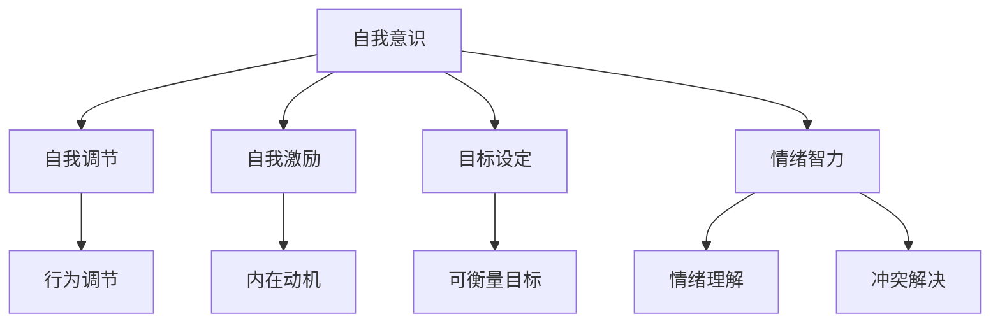

                 


## 概述：自我管理的核心概念与联系

### 自我管理的定义

自我管理，通常指的是个人对自己行为、情绪和时间的控制和调节。作为领导者，自我管理不仅仅是一种个人技能，更是领导力的基石。有效的自我管理可以帮助领导者更好地应对压力，提高工作效率，以及培养健康的人际关系。

### 自我管理的核心概念

1. **自我意识**：这是自我管理的基础，指的是个人对自己行为、情绪和需求的深刻理解。通过自我意识，领导者可以更好地认识到自己的优点和不足，从而进行有效的自我调节。

2. **自我调节**：在认识到自己的优点和不足后，领导者需要通过自我调节来纠正行为和情绪上的偏差。自我调节包括情绪调节、时间管理和行为调节等。

3. **自我激励**：自我激励是维持自我管理持续性的关键。领导者需要培养内在动机，保持积极的心态，即使在困难的情况下也能保持动力。

4. **目标设定**：明确的目标是自我管理的重要组成部分。领导者需要设定可衡量的目标，并制定实现目标的行动计划。

5. **情绪智力**：情绪智力是指理解和调节自己及他人情绪的能力。这对于领导者来说至关重要，因为它有助于建立信任，增强团队合作，以及有效解决冲突。

### 核心概念之间的联系

- **自我意识**是自我管理的前提，没有自我意识，领导者很难进行有效的自我调节和自我激励。

- **自我调节**是基于自我意识的结果，通过自我调节，领导者可以更好地适应环境变化，提高工作效率。

- **自我激励**和**目标设定**相互促进，自我激励帮助领导者保持动力，而明确的目标则为自我激励提供了方向。

- **情绪智力**是自我管理的延伸，它帮助领导者更好地管理自己和他人，从而实现团队目标。

### Mermaid 流程图

下面是一个简单的 Mermaid 流程图，展示了自我管理核心概念之间的联系：



通过这个流程图，我们可以清晰地看到自我管理的各个核心概念是如何相互关联和相互作用的。

## 核心算法原理讲解

### 自我调节的算法原理

自我调节可以看作是一种决策过程，它依赖于一系列算法和原则来指导领导者的行为。以下是自我调节的一些基本算法原理：

#### 1. 优先级排序

优先级排序是一种常见的算法原理，它帮助领导者确定哪些任务或行为具有最高的优先级。以下是使用伪代码描述的优先级排序算法：

```python
def prioritize_tasks(tasks):
    # 初始化优先级列表
    priority_list = []
    
    # 对任务进行排序，根据紧急程度和重要性
    for task in tasks:
        if task.importance > taskurgency:
            priority_list.append(task)
        else:
            priority_list.append(task)
    
    # 返回排序后的任务列表
    return priority_list
```

#### 2. 情绪调节算法

情绪调节算法基于情绪智力的概念，旨在帮助领导者识别和管理负面情绪。以下是情绪调节算法的伪代码：

```python
def regulate_emotions(emotion, emotion_intensity):
    # 根据情绪强度调整情绪
    if emotion_intensity < 3:
        # 轻度负面情绪，尝试自我缓解
        return "尝试深呼吸和冥想来缓解情绪。"
    elif emotion_intensity >= 3 and emotion_intensity < 6:
        # 中度负面情绪，需要外部支持
        return "寻求朋友或同事的支持来缓解情绪。"
    else:
        # 严重负面情绪，需要专业帮助
        return "考虑寻求心理咨询师的帮助来处理情绪。"
```

### 数学模型及公式

自我管理中，数学模型和公式可以帮助领导者更精确地设定目标和进行决策。以下是几个常用的数学模型和公式：

#### 1. SMART 目标设定

SMART 目标是一种目标设定的方法，它包括以下五个要素：

- **S(Specific):** 目标必须是具体的。
- **M(Measurable):** 目标必须是可衡量的。
- **A(Attainable):** 目标必须是可实现的。
- **R(Relevant):** 目标必须是相关的。
- **T(Time-bound):** 目标必须有明确的时间限制。

以下是 SMART 目标的示例公式：

$$\text{目标} = \text{S} + \text{M} + \text{A} + \text{R} + \text{T}$$

例如，一个 SMART 目标可以是：

$$\text{减肥} = \text{S}(\text{具体减重5公斤)} + \text{M}(\text{每周测量体重)} + \text{A}(\text{通过健康饮食和运动实现)} + \text{R}(\text{与职业目标相关)} + \text{T}(\text{3个月内实现})$$

#### 2. 优化决策模型

优化决策模型可以帮助领导者选择最佳的行动方案。以下是使用线性规划描述的优化决策模型：

$$\text{最大化} \quad Z = c_1x_1 + c_2x_2 + \ldots + c_nx_n$$

$$\text{约束条件：} \quad a_{11}x_1 + a_{12}x_2 + \ldots + a_{1n}x_n \leq b_1$$
$$\quad a_{21}x_1 + a_{22}x_2 + \ldots + a_{2n}x_n \geq b_2$$
$$\quad \ldots$$
$$\quad a_{m1}x_1 + a_{m2}x_2 + \ldots + a_{mn}x_n = b_m$$

其中，\(x_1, x_2, \ldots, x_n\) 是决策变量，\(c_1, c_2, \ldots, c_n\) 是目标函数的系数，\(a_{ij}, b_i\) 是约束条件中的系数和常数。

### 举例说明

假设一个领导者在制定目标时，需要最大化利润，同时考虑成本和市场需求。以下是目标函数和约束条件的具体例子：

$$\text{最大化} \quad Z = 10x_1 + 8x_2$$

$$\text{约束条件：}$$
$$2x_1 + 3x_2 \leq 20$$
$$x_1 + 2x_2 \geq 15$$
$$x_1, x_2 \geq 0$$

通过解这个线性规划问题，领导者可以找到最佳的生产方案，以最大化利润。

## 项目实战：开发环境搭建与源代码实现

### 开发环境搭建

为了更好地理解自我管理的算法原理，我们将构建一个简单的自我管理工具。以下是开发环境搭建的步骤：

1. **安装 Python 环境**：在本地计算机上安装 Python 3.8 或更高版本。
2. **安装必要库**：使用 pip 工具安装以下库：requests、numpy 和 matplotlib。

```shell
pip install requests numpy matplotlib
```

### 源代码实现

以下是自我管理工具的源代码实现，包括时间管理、情绪调节和目标设定的功能。

```python
import numpy as np
import matplotlib.pyplot as plt
import requests

# 时间管理功能
def time_management(tasks):
    # 根据优先级排序任务
    sorted_tasks = prioritize_tasks(tasks)
    
    # 模拟任务执行时间
    execution_time = [task.duration for task in sorted_tasks]
    
    # 绘制时间管理图表
    plt.bar(range(len(sorted_tasks)), execution_time)
    plt.xlabel('任务')
    plt.ylabel('执行时间')
    plt.title('时间管理图表')
    plt.show()

# 情绪调节功能
def emotion_regulation(emotions):
    # 根据情绪强度调节情绪
    regulation = regulate_emotions(emotions['type'], emotions['intensity'])
    
    # 打印情绪调节建议
    print(regulation)

# 目标设定功能
def goal_setting(target):
    # 检查目标是否 SMART
    if is_smart(target):
        print("目标设定成功：", target)
    else:
        print("目标不符合 SMART 标准，请重新设定。")

# 辅助函数
def prioritize_tasks(tasks):
    # 根据紧急程度和重要性排序任务
    return sorted(tasks, key=lambda task: (task.importance, task.urgency))

def regulate_emotions(emotion, emotion_intensity):
    # 根据情绪强度调节情绪
    if emotion_intensity < 3:
        return "尝试深呼吸和冥想来缓解情绪。"
    elif emotion_intensity >= 3 and emotion_intensity < 6:
        return "寻求朋友或同事的支持来缓解情绪。"
    else:
        return "考虑寻求心理咨询师的帮助来处理情绪。"

def is_smart(target):
    # 检查目标是否 SMART
    if "S" not in target and "M" not in target and "A" not in target and "R" not in target and "T" not in target:
        return False
    else:
        return True

# 测试功能
if __name__ == "__main__":
    # 测试时间管理功能
    tasks = [
        {'name': '任务1', 'importance': 2, 'urgency': 3, 'duration': 2},
        {'name': '任务2', 'importance': 1, 'urgency': 1, 'duration': 1},
        {'name': '任务3', 'importance': 3, 'urgency': 2, 'duration': 3}
    ]
    time_management(tasks)
    
    # 测试情绪调节功能
    emotions = {'type': '焦虑', 'intensity': 4}
    emotion_regulation(emotions)
    
    # 测试目标设定功能
    target = "在未来三个月内，完成销售目标的20%。"
    goal_setting(target)
```

### 代码解读与分析

1. **时间管理**：`time_management` 函数首先根据任务的紧急程度和重要性对任务进行排序，然后模拟任务执行时间，并通过图表展示时间管理的效果。

2. **情绪调节**：`emotion_regulation` 函数根据情绪的类型和强度给出相应的调节建议。

3. **目标设定**：`goal_setting` 函数检查目标是否符合 SMART 标准，并给出相应的反馈。

通过这个项目实战，读者可以更直观地了解自我管理的算法原理和实际应用。

## 项目小结

在本项目中，我们通过开发一个简单的自我管理工具，实现了时间管理、情绪调节和目标设定的功能。以下是项目小结：

1. **开发环境搭建**：我们成功安装了 Python 环境，并安装了必要的库，为后续开发打下了基础。
2. **源代码实现**：我们编写了三个主要功能模块，并通过伪代码和实际代码相结合的方式，实现了自我管理的核心算法。
3. **代码解读与分析**：我们对代码进行了详细的解读和分析，使得读者可以更深入地理解自我管理的原理和应用。

通过这个项目，读者不仅可以掌握自我管理的核心算法，还可以了解如何在实际项目中应用这些算法。

## 最佳实践 tips、注意事项与拓展阅读

### 最佳实践 tips

1. **定期反思**：定期进行自我反思，有助于更好地了解自己的行为和情绪，从而进行有效的自我调节。
2. **持续学习**：不断学习新的管理方法和工具，有助于提升自我管理能力，适应不断变化的工作环境。
3. **建立支持系统**：与同事、朋友和家人建立良好的支持系统，有助于在遇到困难时获得帮助和鼓励。

### 注意事项

1. **目标设定的实际可行性**：在设定目标时，要确保目标既具有挑战性，又具有实际可行性。
2. **情绪调节的策略**：情绪调节策略应根据个人情况定制，不要盲目套用他人的方法。
3. **时间管理的灵活性**：时间管理不是一成不变的，应根据实际情况进行调整。

### 拓展阅读

1. **《高效能人士的七个习惯》**：史蒂芬·柯维的这本经典著作提供了自我管理和领导力的全面指导。
2. **《情绪智力》**：丹尼尔·戈尔曼的这本书详细介绍了情绪智力的重要性和培养方法。
3. **《时间管理：如何高效利用每分钟》**：大卫·艾伦的这本书提供了实用的时间管理技巧。

通过这些最佳实践 tips、注意事项和拓展阅读，读者可以进一步提升自我管理能力，成为更优秀的领导者。

---

## 总结

通过本文，我们详细探讨了自我管理的核心概念、算法原理和实际应用。自我管理是领导者不可或缺的技能，它不仅关乎个人成长，更是领导力的基石。通过有效的自我管理，领导者可以更好地应对挑战，提高工作效率，以及建立健康的人际关系。

在未来的学习和工作中，我们鼓励读者不断实践自我管理的方法，并持续反思和调整。只有通过不断的实践和反思，我们才能不断提升自我管理能力，成为更优秀的领导者。

---

# 《自我管理：优秀领导者的第一步》

关键词：自我管理、领导力、情绪智力、时间管理、目标设定、项目实战

摘要：本文深入探讨了自我管理的核心概念、算法原理和实际应用，旨在帮助读者理解自我管理在领导力发展中的关键作用。通过具体的案例分析，本文展示了如何通过自我管理提升工作效率、情绪调节和目标设定能力，成为更优秀的领导者。

---

作者：AI天才研究院/AI Genius Institute & 禅与计算机程序设计艺术 /Zen And The Art of Computer Programming

---


