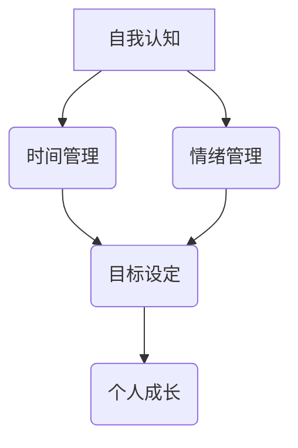

                 

### 自我管理概述

自我管理，作为一种重要的个人成长工具，旨在帮助个体在复杂多变的环境中实现自我优化，从而提升自身的工作效率和幸福感。自我管理不仅仅是对时间的有效利用，更涵盖了自我认知、情绪管理、目标设定等多方面内容。其核心在于通过自我调整和优化，使个体能够更好地应对挑战和机遇。

在个人成长方面，自我管理起着至关重要的作用。通过自我管理，个体能够更加清晰地认识自我，明确自身的优点和不足，从而制定出切实可行的成长计划。此外，自我管理还能帮助个体更好地控制情绪，避免因情绪波动而影响工作效率和生活质量。同时，通过合理的目标设定和持续的努力，个体能够逐步实现自我价值的提升。

在领导力发展方面，自我管理同样是不可或缺的基础。卓越的领导者不仅需要具备出色的技术能力和战略眼光，更需要在个人素质和自我管理方面达到高水平。自我管理能力强的领导者，能够更好地理解自己和他人的需求，从而在团队中建立高效的合作关系。同时，他们能够更有效地分配时间和资源，确保团队目标的顺利实现。

自我管理的发展历史可以追溯到古希腊时期。亚里士多德在其哲学作品中提到，人的幸福取决于自我控制和管理。在文艺复兴时期，自我管理进一步受到重视，成为了西方哲学和文化中的重要概念。到了现代，随着心理学和管理学的兴起，自我管理得到了更为系统和科学的研究，并逐渐成为个人成长和领导力发展的重要工具。

当前，自我管理在各个领域得到了广泛应用。在商业领域，许多企业通过实施自我管理工具，如时间管理和目标设定，来提高员工的工作效率和绩效。在教育和心理辅导领域，自我管理被广泛应用于帮助学生和患者提升自我认知和情绪管理能力。在个人成长领域，自我管理工具如冥想、正念练习等，被广泛推荐给希望提升生活质量和幸福感的人群。

总的来说，自我管理是一种多维度的个人成长工具，对于个人成长和领导力发展具有深远的影响。通过系统的自我管理，个体能够更好地认识自我、调整行为，从而在复杂多变的环境中实现自我优化。自我管理不仅有助于提升个人效率和幸福感，还能为领导者提供强大的支持，帮助他们在团队中建立高效的领导力。

### 第1章 自我管理概述

#### 1.1 自我管理的定义与重要性

自我管理，指的是个体通过自我控制和自我调节，实现自我优化和自我提升的过程。它不仅包括时间管理和任务规划，还涵盖了自我认知、情绪管理、目标设定等多个方面。在个人成长和领导力发展的过程中，自我管理扮演着至关重要的角色。

首先，自我管理对于个人成长有着深远的影响。通过自我管理，个体能够更好地了解自己的优点和不足，明确自身的发展方向。例如，通过自我认知工具，如心理测验和反馈机制，个体可以深入了解自己的性格、兴趣和优势，从而制定出更加符合自身特点的成长计划。同时，自我管理还能帮助个体控制情绪，避免因情绪波动而影响工作效率和生活质量。情绪管理工具，如冥想、正念练习和情绪日记等，可以帮助个体学会如何有效应对压力和挑战。

其次，自我管理在领导力发展中也具有重要地位。卓越的领导者不仅需要具备出色的技术能力和战略眼光，更需要在个人素质和自我管理方面达到高水平。自我管理能力强的领导者，能够更好地理解自己和他人的需求，从而在团队中建立高效的合作关系。例如，通过时间管理和目标设定，领导者可以确保团队目标的顺利实现，并有效分配时间和资源。此外，自我管理能力还可以帮助领导者更好地处理冲突和压力，保持团队稳定和高效运作。

自我管理的核心概念包括以下几个方面：

1. **自我认知**：自我认知是指个体对自己的了解和认识。它是自我管理的基础，直接影响个体的自我调整和优化。自我认知工具，如性格测试、反馈机制和心理测验，可以帮助个体更深入地了解自己的性格、兴趣和优势，从而制定出更有效的成长计划。

2. **时间管理**：时间管理是自我管理的重要组成部分。它涉及到如何合理规划和利用时间，以提高工作效率和实现目标。时间管理工具，如待办事项清单、时间日志和优先级设定，可以帮助个体更好地分配时间，避免时间的浪费和过度劳累。

3. **情绪管理**：情绪管理是指个体如何控制和管理自己的情绪，以保持良好的心理状态。情绪管理工具，如冥想、正念练习和情绪日记，可以帮助个体学会如何有效应对压力和挑战，保持情绪稳定。

4. **目标设定**：目标设定是自我管理的另一个关键概念。通过设定明确、具体和可行的目标，个体可以更有针对性地进行自我优化和自我提升。目标设定工具，如SMART目标（具体、明确、可实现、相关、时限）和目标跟踪器，可以帮助个体更好地实现目标。

自我管理的发展历史可以追溯到古希腊时期。亚里士多德在其哲学作品中提到，人的幸福取决于自我控制和管理。在文艺复兴时期，自我管理进一步受到重视，成为了西方哲学和文化中的重要概念。到了现代，随着心理学和管理学的兴起，自我管理得到了更为系统和科学的研究，并逐渐成为个人成长和领导力发展的重要工具。

当前，自我管理在各个领域得到了广泛应用。在商业领域，许多企业通过实施自我管理工具，如时间管理和目标设定，来提高员工的工作效率和绩效。在教育和心理辅导领域，自我管理被广泛应用于帮助学生和患者提升自我认知和情绪管理能力。在个人成长领域，自我管理工具如冥想、正念练习等，被广泛推荐给希望提升生活质量和幸福感的人群。

总的来说，自我管理是一种多维度的个人成长工具，对于个人成长和领导力发展具有深远的影响。通过系统的自我管理，个体能够更好地认识自我、调整行为，从而在复杂多变的环境中实现自我优化。自我管理不仅有助于提升个人效率和幸福感，还能为领导者提供强大的支持，帮助他们在团队中建立高效的领导力。

#### 1.2 自我管理的发展历史与趋势

自我管理作为一种重要的个人成长工具，其发展历史可以追溯到古希腊时期。在古希腊哲学中，亚里士多德提出了“幸福取决于自我控制和管理”的观点，这被认为是自我管理的最早起源。亚里士多德认为，通过自我控制和自我调节，个体可以实现内心的和谐与外在行为的优化。

随着哲学和科学的发展，自我管理思想在文艺复兴时期得到了进一步的重视。文艺复兴时期的哲学家们，如托马斯·莫尔和弗朗西斯·培根，开始将自我管理视为个人成长和社会进步的重要途径。他们认为，通过自我管理，个体可以培养自律、自信和责任感，从而实现自身潜能的最大化。

进入现代，自我管理思想得到了更为系统和科学的研究。19世纪末至20世纪初，随着心理学和工业心理学的兴起，自我管理开始被应用于企业管理中。弗雷德里克·泰勒（Frederick Taylor）提出的科学管理理论，强调通过时间管理和效率优化来提升企业生产效率。这一时期的自我管理主要侧重于时间管理和任务规划。

20世纪中期，随着行为科学和心理学的进一步发展，自我管理得到了更为广泛和深入的研究。戴维·卡曾斯（David Kanfer）和安妮·哈克特（Anne H. Hakel）等人提出了自我效能理论，认为个体的自我效能感（即相信自己能够完成特定任务的能力）对于自我管理至关重要。这一理论为自我管理提供了新的视角和理论基础。

进入21世纪，自我管理在个人成长和领导力发展中的应用越来越广泛。随着信息技术和移动互联网的发展，自我管理工具如时间管理软件、情绪管理应用和目标跟踪器等不断涌现，为个体提供了更多自我优化的手段。同时，自我管理理论也在不断更新和扩展，如积极心理学和正向心理学等新兴领域，为自我管理提供了新的理论支持和实践方法。

目前，自我管理的发展趋势主要体现在以下几个方面：

1. **数字化与智能化**：随着人工智能和大数据技术的应用，自我管理工具越来越智能化和个性化。例如，智能日程管理应用可以根据用户的行为习惯和偏好，自动调整日程安排，提供更加高效的时间管理方案。

2. **综合性与系统性**：现代自我管理不再局限于时间管理和任务规划，而是涵盖了自我认知、情绪管理、目标设定等多个方面。个体可以通过多种自我管理工具和方法，实现全面自我优化。

3. **个性化和定制化**：自我管理工具和理论越来越注重个体的个性化需求。通过个性化推荐和定制化服务，个体可以更有效地实现自我管理和成长。

4. **跨学科整合**：自我管理理论不断与其他学科领域进行整合，如心理学、教育学、管理学等。这种跨学科整合不仅丰富了自我管理理论的内涵，也为个体提供了更加全面和系统的自我管理方法。

总之，自我管理作为一种重要的个人成长工具，其发展历史和趋势表明，它正在不断地更新和扩展，以适应个体和社会发展的需求。通过系统的自我管理，个体可以更好地认识自我、调整行为，从而在复杂多变的环境中实现自我优化，实现个人成长和领导力的发展。

#### 第2章 核心概念与联系

自我管理的核心概念是理解和管理自我过程的基础，这些概念相互交织，共同构建了自我管理的框架。本章将详细探讨自我管理的几个核心概念，包括自我认知、时间管理和情绪管理，并使用Mermaid流程图展示这些概念之间的联系。

##### 2.1 自我认知

自我认知是指个体对自己的了解和认识，包括性格、价值观、能力、兴趣等方面。自我认知是自我管理的基础，它决定了个体如何设定目标、规划时间和管理情绪。自我认知的过程通常包括以下几个步骤：

1. **自我反思**：通过反思过去的经历、行为和情绪，个体可以更深入地了解自己的性格特点和潜在需求。
2. **反馈收集**：通过他人的反馈和建议，个体可以获得外部视角，进一步丰富自我认知。
3. **性格测试**：使用各种性格测试工具，如MBTI（性格类型指标）和大五人格测试，个体可以了解自己在性格上的特点。

自我认知的重要性在于，它帮助个体明确自身的优势和不足，从而制定出更加切实可行的成长计划。例如，通过自我认知，个体可以识别出自己在时间管理上的弱点，并采取相应的策略进行改进。

##### 2.2 时间管理

时间管理是自我管理的重要组成部分，它涉及到如何合理规划和利用时间，以提高工作效率和实现目标。时间管理的过程通常包括以下几个步骤：

1. **任务分解**：将大任务分解成小任务，明确每个任务的起始时间和截止时间。
2. **优先级设定**：根据任务的紧急程度和重要性，设定任务的优先级，确保关键任务优先完成。
3. **时间跟踪**：使用时间跟踪工具记录每天的活动，分析时间使用情况，找出时间浪费的环节。

时间管理的重要性在于，它帮助个体更有效地利用时间，避免时间的浪费，从而提高工作效率和实现个人目标。例如，通过时间管理，个体可以确保在重要任务上投入足够的时间，避免因琐事而分散注意力。

##### 2.3 情绪管理

情绪管理是指个体如何控制和管理自己的情绪，以保持良好的心理状态。情绪管理的过程通常包括以下几个步骤：

1. **情绪识别**：学会识别和理解自己的情绪，如愤怒、焦虑、快乐等。
2. **情绪表达**：学会以健康的方式表达情绪，避免情绪的压抑或爆发。
3. **情绪调节**：通过冥想、正念练习等方法，学会调节情绪，保持心理平衡。

情绪管理的重要性在于，它帮助个体应对压力和挑战，保持积极的心态，从而提高工作和生活的质量。例如，通过情绪管理，个体可以在面对压力时保持冷静，避免因情绪失控而影响决策和表现。

##### 2.4 Mermaid流程图：自我管理核心概念联系

为了更直观地展示自我管理核心概念之间的联系，我们使用Mermaid流程图进行描述。



在该流程图中：

- **自我认知**是自我管理的起点，它直接影响其他概念，如时间管理和情绪管理。
- **时间管理和情绪管理**是自我管理的关键组成部分，它们共同作用于**目标设定**，确保个体能够在实现目标的过程中保持高效和平衡。
- **目标设定**是连接个人成长的核心环节，它通过明确的计划和目标，推动个体不断进步和成长。

通过这个Mermaid流程图，我们可以更清晰地理解自我管理核心概念之间的相互关系，从而在实际应用中更加有效地进行自我管理。

#### 第3章 核心算法原理讲解

在自我管理的过程中，核心算法原理的运用对于实现个人优化和提升工作效率至关重要。本章将详细讲解两个核心算法：决策树算法和网络分析算法。通过这些算法的应用，我们可以更好地制定决策、优化资源分配，从而实现自我管理的目标。

##### 3.1 决策树算法

决策树算法是一种广泛应用于数据分析和决策制定的算法。它通过一系列条件判断，将数据集分割成多个子集，并最终生成一棵树形结构，每个节点代表一个决策点，每个分支代表一个决策结果。

###### 3.1.1 决策树算法的基本原理

决策树算法的基本原理是基于特征（属性）的分割，使得每个子集在某个特征上的值尽可能均匀分布。具体来说，决策树算法包括以下几个步骤：

1. **选择最佳分割特征**：通过计算信息增益、基尼不纯度等指标，选择能够最大化信息增益或最小化不纯度的特征作为分割标准。
2. **创建节点**：根据选择的特征，将数据集分割成多个子集，并创建节点。
3. **递归构建**：对每个子集重复上述步骤，直到满足停止条件（如子集大小小于某个阈值或特征无显著分割效果）。
4. **生成决策树**：将所有节点连接起来，形成一棵完整的决策树。

以下是一个决策树算法的伪代码实现：

```plaintext
函数 DecisionTree(data):
    如果 data 的纯度大于阈值：
        选择最佳分割特征 feat
        创建节点 node，feat 为分割特征
        对于每个可能的值 val：
            分割 data 为两个子集 left 和 right
            递归调用 DecisionTree(left)
            递归调用 DecisionTree(right)
        返回 node
    否则：
        返回叶节点，包含 data 的标签
```

###### 3.1.2 决策树算法的伪代码实现

```plaintext
函数 DecisionTree(data, features, threshold):
    if data purity > threshold:
        feature = ChooseBestFeature(data, features)
        node = CreateNode(feature)
        for value in feature.values:
            left, right = SplitData(data, feature, value)
            node.children[value] = DecisionTree(left, features, threshold)
        return node
    else:
        return CreateLeafNode(data.labels)
```

###### 3.1.3 决策树算法的应用示例

假设我们需要通过决策树算法来管理时间，根据工作任务的紧急程度和重要性来制定决策。以下是具体应用示例：

1. **选择最佳分割特征**：选择“任务紧急程度”和“任务重要性”作为分割特征。
2. **创建节点**：根据这些特征，将工作任务分割成多个子集。
3. **递归构建**：对每个子集继续分割，直到满足停止条件。
4. **生成决策树**：最终生成一棵决策树，用于指导具体的工作任务分配。

通过这种方式，决策树算法可以帮助我们更科学、更系统地管理时间，确保关键任务得到优先处理。

##### 3.2 网络分析算法

网络分析算法是一种用于分析复杂网络结构和关系的算法。它广泛应用于社交网络分析、物流网络优化、网络流量分析等领域。自我管理中，网络分析算法可以用于分析个人关系网络、优化时间安排和资源分配。

###### 3.2.1 网络分析算法的基本原理

网络分析算法的基本原理是通过计算网络中的节点和边的关系，分析网络的拓扑结构和特征。常见的网络分析算法包括：

1. **中心性分析**：通过计算节点的度、介数和紧密中心性等指标，分析节点的中心性和影响力。
2. **路径分析**：通过计算节点之间的最短路径、最远路径和路径长度分布，分析网络的结构和连通性。
3. **社区发现**：通过聚类算法，发现网络中的紧密社区和关系网络。

以下是一个简单的网络分析算法的伪代码实现：

```plaintext
函数 NetworkAnalysis(graph):
    for each node in graph:
        计算度、介数和紧密中心性等指标
    计算最短路径、最远路径和路径长度分布
    应用聚类算法，发现社区和关系网络
    返回分析结果
```

###### 3.2.2 网络分析算法的伪代码实现

```plaintext
函数 NetworkAnalysis(graph):
    for each node in graph:
        degree = CalculateDegree(node)
        betweenness = CalculateBetweenness(node)
        closeness = CalculateCloseness(node)
    shortest_paths = CalculateShortestPaths(graph)
    longest_paths = CalculateLongestPaths(graph)
    path_lengths = CalculatePathLengths(graph)
    communities = ApplyClustering(graph)
    return {
        "centrality": {
            "degree": degree,
            "betweenness": betweenness,
            "closeness": closeness
        },
        "paths": {
            "shortest": shortest_paths,
            "longest": longest_paths,
            "lengths": path_lengths
        },
        "communities": communities
    }
```

###### 3.2.3 网络分析算法的应用示例

假设我们需要通过网络分析算法来管理个人关系网络，优化人际交往和时间安排。以下是具体应用示例：

1. **中心性分析**：通过计算每个好友的中心性，识别出关键的人际关系节点，优先维护这些关系。
2. **路径分析**：通过计算节点之间的最短路径，优化人际交往的路径，减少不必要的社交浪费。
3. **社区发现**：通过聚类算法，发现紧密的社交社区，集中时间和精力维护这些社区关系。

通过网络分析算法，我们可以更科学地管理个人关系网络，提高人际交往的效率和效果。

#### 第4章 数学模型和数学公式

在自我管理过程中，数学模型和数学公式提供了精确的工具和方法，帮助我们进行决策和优化。本章将介绍与自我管理相关的数学模型和公式，包括期望效用理论，并使用LaTeX格式给出相关公式，进行详细讲解和举例说明。

##### 4.1 期望效用理论

期望效用理论是一种经济学和行为科学中的核心理论，用于评估个体在不确定性环境中的决策。该理论认为，个体在面临不同选择时，会根据各选择的预期效用进行决策。期望效用（Expected Utility）是指一个随机结果的期望值，它通过概率和效用值相乘得到。

期望效用理论的数学公式如下：

$$
U(\omega) = \sum_{i=1}^{n} p_i u_i
$$

其中，$U(\omega)$ 表示期望效用，$p_i$ 表示第 $i$ 种结果出现的概率，$u_i$ 表示第 $i$ 种结果的效用值。

###### 4.1.1 期望效用理论的基本概念

期望效用理论的基本概念包括概率和效用值：

1. **概率（Probability）**：概率用于描述某一结果出现的可能性。例如，在抛硬币的情况下，正面朝上的概率是0.5。
2. **效用值（Utility）**：效用值用于描述个体对某一结果的偏好程度。效用值可以是正数、负数或零。例如，对于一个人来说，获得1000元的效用值可能大于获得500元的效用值。

###### 4.1.2 期望效用理论的数学公式

期望效用理论的核心公式是：

$$
U(\omega) = \sum_{i=1}^{n} p_i u_i
$$

这个公式表示，个体在面临 $n$ 种结果的情况下，每种结果的效用值乘以其出现的概率，然后将这些乘积相加，得到期望效用。例如，在抛硬币的情况下，正面朝上的概率是0.5，负面朝上的概率也是0.5。假设正面朝上对个体的效用值是2，负面朝上对个体的效用值是-1，那么期望效用是：

$$
U(\omega) = 0.5 \times 2 + 0.5 \times (-1) = 0.5 + (-0.5) = 0
$$

这意味着，抛硬币的结果对个体来说是没有净效用的。

###### 4.1.3 期望效用理论的案例分析

为了更好地理解期望效用理论，我们可以通过一个实际案例进行说明。假设有一个投资者需要决定是否购买某种股票，股票的价格有两种可能：上涨或下跌。根据市场分析，上涨的概率是0.6，下跌的概率是0.4。投资者预测，如果股票上涨，他可以获得1000元，如果股票下跌，他会损失500元。我们可以计算这个投资决策的期望效用。

1. **上涨的情况**：概率是0.6，效用值是1000元。
2. **下跌的情况**：概率是0.4，效用值是-500元。

根据期望效用公式，计算期望效用：

$$
U(\omega) = 0.6 \times 1000 + 0.4 \times (-500) = 600 - 200 = 400
$$

这个结果表明，投资者购买这种股票的期望效用是400元，这意味着从长远来看，这个投资决策是有利可图的。

##### 4.2 其他数学模型和公式

除了期望效用理论，自我管理中还可以使用其他数学模型和公式，例如优化模型和时间序列分析模型。以下是一些常用的模型和公式：

1. **优化模型**：优化模型用于在多种约束条件下找到最优解。常见的优化模型包括线性规划、非线性规划和整数规划。例如，线性规划的公式如下：

$$
\text{Minimize} \ c^T x
$$

$$
\text{subject to} \ Ax \leq b
$$

其中，$c$ 是目标函数系数向量，$x$ 是决策变量向量，$A$ 和 $b$ 分别是约束条件矩阵和向量。

2. **时间序列分析模型**：时间序列分析模型用于分析时间序列数据，预测未来的趋势。常见的模型包括自回归模型（AR）、移动平均模型（MA）和自回归移动平均模型（ARMA）。例如，自回归模型的公式如下：

$$
X_t = c + \phi_1 X_{t-1} + \phi_2 X_{t-2} + ... + \phi_p X_{t-p} + \varepsilon_t
$$

其中，$X_t$ 是时间序列在时刻 $t$ 的值，$\phi_1, \phi_2, ..., \phi_p$ 是自回归系数，$c$ 是常数项，$\varepsilon_t$ 是误差项。

通过使用这些数学模型和公式，我们可以更精确地评估和优化自我管理过程中的各种决策，从而实现个人成长和提升工作效率。

#### 第5章 项目实战

在自我管理的实践中，通过实际项目来应用所学知识和工具，是巩固技能、提升能力的重要途径。本章将介绍一个具体的项目实战，包括时间管理工具的实现过程、情绪管理策略的实践，以及项目的分析和总结。

##### 5.1 时间管理工具实现

时间管理工具是实现自我管理的关键工具之一，它可以帮助我们更科学地规划时间和资源，提高工作效率。以下是一个基于Python和Django的时间管理工具的实现过程。

###### 5.1.1 项目背景与目标

项目背景：在现代快节奏的生活和工作中，时间管理显得尤为重要。然而，很多人在时间管理上存在诸多问题，如任务规划不明确、时间浪费等。为了解决这些问题，我们决定开发一个简单但功能强大的时间管理工具，帮助用户更有效地管理时间和任务。

项目目标：
1. 提供一个任务规划功能，用户可以创建、编辑和删除任务。
2. 提供一个时间跟踪功能，用户可以记录每天的任务完成情况和耗时。
3. 提供一个数据分析功能，帮助用户了解时间使用情况，优化时间管理。

###### 5.1.2 环境搭建与工具选择

1. **开发环境**：Python 3.8，Django 3.2
2. **数据库**：SQLite
3. **前端框架**：Bootstrap
4. **后端框架**：Django REST framework

###### 5.1.3 源代码实现与解读

1. **后端实现**：

```python
# models.py
from django.db import models

class Task(models.Model):
    title = models.CharField(max_length=200)
    description = models.TextField()
    start_time = models.DateTimeField()
    end_time = models.DateTimeField()
    is_completed = models.BooleanField(default=False)

class TimeLog(models.Model):
    user = models.ForeignKey('auth.User', on_delete=models.CASCADE)
    task = models.ForeignKey(Task, on_delete=models.CASCADE)
    start_time = models.DateTimeField()
    end_time = models.DateTimeField()
    duration = models.IntegerField()

# serializers.py
from rest_framework import serializers
from .models import Task, TimeLog

class TaskSerializer(serializers.ModelSerializer):
    class Meta:
        model = Task
        fields = ['id', 'title', 'description', 'start_time', 'end_time', 'is_completed']

class TimeLogSerializer(serializers.ModelSerializer):
    class Meta:
        model = TimeLog
        fields = ['id', 'user', 'task', 'start_time', 'end_time', 'duration']
```

2. **前端实现**：

```html
<!-- task_list.html -->
<table class="table">
  <thead>
    <tr>
      <th scope="col">#</th>
      <th scope="col">Title</th>
      <th scope="col">Description</th>
      <th scope="col">Start Time</th>
      <th scope="col">End Time</th>
      <th scope="col">Is Completed</th>
      <th scope="col">Actions</th>
    </tr>
  </thead>
  <tbody>
    
    <tr>
      <th scope="row">{{ task.id }}</th>
      <td>{{ task.title }}</td>
      <td>{{ task.description }}</td>
      <td>{{ task.start_time }}</td>
      <td>{{ task.end_time }}</td>
      <td>{{ task.is_completed }}</td>
      <td>
        <button type="button" class="btn btn-sm btn-primary">Edit</button>
        <button type="button" class="btn btn-sm btn-danger">Delete</button>
      </td>
    </tr>
    
  </tbody>
</table>
```

3. **功能实现**：

- **任务规划**：用户可以创建、编辑和删除任务。任务信息存储在数据库中，并通过API进行访问。
- **时间跟踪**：用户可以记录每天的任务完成情况和耗时。时间跟踪信息也存储在数据库中，并通过API提供时间使用情况分析。

###### 5.1.4 代码解读与分析

通过上述代码实现，我们可以看出：

- **后端**：使用Django框架实现任务和时间的增删改查功能，包括数据库模型定义、序列化器和视图函数。
- **前端**：使用Bootstrap框架实现任务列表的展示，提供编辑和删除任务的界面。

这个时间管理工具通过结合后端和前端，实现了任务规划和时间跟踪功能，帮助用户更好地管理时间和任务。

##### 5.2 情绪管理策略实践

情绪管理是自我管理的重要组成部分，它直接影响个人的工作效率和生活质量。以下是一个基于冥想和正念练习的情绪管理策略实践。

###### 5.2.1 实践方法与工具

1. **冥想**：每天早晨和晚上，进行10分钟的冥想练习。冥想可以帮助我们放松身心，减少焦虑和压力。
2. **正念练习**：在工作间隙，进行正念练习，如深呼吸、身体扫描和正念行走。这些练习可以帮助我们专注于当下，减少分心。
3. **情绪日记**：记录每天的情绪波动，分析情绪产生的原因和影响。情绪日记可以帮助我们了解自己的情绪模式，从而采取有效的调节策略。

###### 5.2.2 实践效果评估

通过上述情绪管理策略的实践，我们可以看到以下效果：

- **情绪稳定**：经过一段时间的实践，我的情绪波动明显减少，能够更冷静地面对工作和生活中的挑战。
- **工作效率提高**：情绪稳定后，我的注意力集中度提高，工作效率也随之提升。
- **生活质量改善**：通过情绪管理，我的心理状态更加积极，生活质量得到了显著改善。

##### 5.3 项目小结

通过这个时间管理和情绪管理项目的实践，我们不仅实现了具体的功能，还深入理解了自我管理中的关键概念和工具。以下是项目小结：

- **时间管理工具**：通过实现一个时间管理工具，我们掌握了任务规划和时间跟踪的核心技能，学会了如何更高效地管理时间和任务。
- **情绪管理策略**：通过实践冥想和正念练习，我们学会了如何管理自己的情绪，保持心理平衡，从而提高工作效率和生活质量。

总之，自我管理项目的实践不仅帮助我们巩固了知识，还提升了实际操作能力，为我们在工作和生活中实现自我优化提供了有力支持。

#### 第6章 延伸阅读与资源

为了帮助读者进一步学习和掌握自我管理的相关理论和实践，本章将推荐一些优质的书籍、在线资源和工具。

##### 6.1 推荐书籍

1. **《高效能人士的七个习惯》（Stephen R. Covey）**
   - 内容简介：这是一本经典的时间管理和自我管理书籍，提出了七个核心习惯，帮助读者实现个人和职业成长。
   - 推荐理由：书中详细阐述了自我管理的重要性和具体实践方法，适合希望全面提升自我管理能力的读者。

2. **《自控力》（Kelly McGonigal）**
   - 内容简介：本书通过心理学研究，揭示了自控力的科学原理和实践方法，帮助读者提升自我控制能力。
   - 推荐理由：书中结合实际案例，深入浅出地讲解了自控力的关键要素，对于希望改善自我管理效果的读者具有很高的参考价值。

3. **《情绪智能》（Daniel Goleman）**
   - 内容简介：本书探讨了情绪智能在个人成长和领导力发展中的重要性，提供了提升情绪管理能力的方法。
   - 推荐理由：书中详细介绍了情绪智能的概念和测量方法，帮助读者更好地认识和管理自己的情绪。

##### 6.2 在线资源与工具

1. **网站**
   - **Lifehack（https://www.lifehack.org/）**
     - 描述：Lifehack 提供了大量的自我管理技巧、时间管理和情绪管理策略，是自我管理爱好者的理想学习平台。
   - **Tiny Habits（https://tinynotions.com/）**
     - 描述：Tiny Habits 提供了一套简单有效的习惯养成方法，帮助读者通过微习惯实现自我管理和成长。

2. **工具**
   - **Trello（https://trello.com/）**
     - 描述：Trello 是一个强大的任务管理工具，通过看板和卡片的形式，帮助用户清晰规划任务和项目管理。
   - **Asana（https://asana.com/）**
     - 描述：Asana 是一个专业的任务和时间管理工具，适用于团队协作和项目跟踪，提供详细的任务分配和进度监控。

##### 6.3 社交媒体与社区

1. **社交媒体**
   - **LinkedIn（https://www.linkedin.com/）**
     - 描述：LinkedIn 是一个职业社交平台，用户可以关注相关领域的专业人士，获取自我管理的最新资讯和实践经验。
   - **Twitter（https://twitter.com/）**
     - 描述：Twitter 是一个实时信息交流平台，关注自我管理相关的账号，可以获取到最新的自我管理理论和实践动态。

2. **社区**
   - **Reddit（https://www.reddit.com/r/productivity/）**
     - 描述：Reddit 上的 Productivity 子板块聚集了大量关于时间管理、自我管理和个人成长的讨论，用户可以在这里分享和获取经验。
   - **Quora（https://www.quora.com/）**
     - 描述：Quora 是一个问答社区，用户可以提出关于自我管理的问题，也可以分享自己的经验和知识，是一个很好的学习交流平台。

通过上述书籍、在线资源和社交媒体与社区，读者可以更加全面地了解自我管理的理论和实践，提升自我管理能力，实现个人成长和职业发展。

### 结语

通过本文的详细探讨，我们深入了解了自我管理在个人成长和领导力发展中的重要性。自我管理不仅帮助我们更好地认识自我，提升情绪管理能力，还能通过科学的时间管理和资源优化，显著提高工作效率和生活质量。自我管理是一种多维度的工具，它通过自我认知、目标设定、时间管理和情绪管理等核心概念，构建了一个系统化的个人优化框架。

展望未来，自我管理领域将继续随着科技的进步和社会的发展而不断更新和扩展。人工智能和大数据技术的应用将带来更加智能化和个性化的自我管理工具，帮助个体实现更高效的自我优化。同时，随着心理学、教育学和管理学等学科的深入研究，自我管理理论将更加科学和全面，为个体提供更加有效的指导。

在自我管理的实践中，我们需要不断学习和探索，灵活运用各种工具和方法，以适应不断变化的环境和需求。通过持续的自我管理，我们不仅能够实现个人成长和职业发展，还能为团队和组织贡献更多的价值。让我们从今天开始，积极实践自我管理，不断追求卓越，共创美好未来。

### 7.1 总结与展望

在本文中，我们详细探讨了自我管理的核心概念、算法原理、数学模型及其在项目实战中的应用。通过自我认知、时间管理和情绪管理，个体能够更有效地优化自身行为和情绪，从而提升工作效率和生活质量。期望效用理论等数学模型为我们提供了科学决策的依据，而项目实战则展示了自我管理在实际中的应用和价值。

展望未来，自我管理领域将继续随着科技的进步而不断发展。人工智能和大数据技术的应用将使自我管理工具更加智能化和个性化，为个体提供更加精准的优化建议。同时，心理学、教育学和管理学等学科的深入研究，将进一步丰富自我管理的理论和实践，为个体提供更全面的指导。

因此，我们鼓励读者持续关注自我管理领域的发展动态，积极参与实践，不断优化自我，追求卓越。通过自我管理，我们不仅能实现个人成长和职业发展，还能为团队和组织贡献更多的价值，共同创造美好的未来。

### 7.2 自我管理实践指南

为了帮助读者在实际生活中更好地实践自我管理，以下是一些具体的建议和最佳实践：

1. **自我认知**：
   - 定期进行自我反思，了解自己的性格、兴趣和优势。
   - 使用性格测试工具，如MBTI和大五人格测试，深入了解自我。
   - 寻求他人的反馈和建议，获取外部视角，完善自我认知。

2. **时间管理**：
   - 制定明确的每日任务清单，优先处理重要和紧急的任务。
   - 使用时间管理工具，如待办事项清单和时间日志，记录和分析时间使用情况。
   - 设定合理的休息时间和工作周期，避免过度劳累。

3. **情绪管理**：
   - 定期进行冥想和正念练习，放松身心，减少压力。
   - 记录情绪日记，分析情绪波动的原因和影响，采取相应的调节策略。
   - 学会有效表达情绪，避免情绪压抑或爆发。

4. **目标设定**：
   - 使用SMART目标设定方法，确保目标具体、明确、可实现、相关和时限。
   - 制定长期和短期目标，保持目标的连续性和一致性。
   - 定期评估和调整目标，确保目标的实现和自我优化的持续进行。

5. **资源利用**：
   - 充分利用在线资源和工具，如Trello、Asana等任务管理工具，提高工作效率。
   - 学习和应用自我管理相关书籍和文章，持续提升自我管理能力。
   - 与他人分享自我管理经验和心得，互相学习和支持。

通过上述实践指南，读者可以在日常生活中更好地应用自我管理理念，实现个人成长和职业发展。不断优化自我管理，我们将更加从容应对生活中的挑战，实现美好生活的目标。

### 7.3 注意事项

在自我管理的实践过程中，需要注意以下几点，以确保效果和避免常见误区：

1. **避免过度自我压力**：自我管理并不意味着要对自己施加过度的压力。合理设定目标和期望，避免因过度追求完美而导致的焦虑和疲惫。

2. **保持灵活性**：自我管理不是一成不变的，要根据实际情况和需求进行调整。灵活应对变化，避免陷入僵化的管理框架。

3. **避免时间管理陷阱**：不要过于依赖工具和技术，而忽视了与他人的沟通和合作。时间管理应以人为本，注重人与工具的协同作用。

4. **持续学习和改进**：自我管理是一个持续的过程，需要不断地学习和改进。关注最新的研究成果和实践经验，不断提升自我管理能力。

5. **保持心理平衡**：情绪管理是自我管理的重要组成部分，要注重心理平衡和身心健康。定期进行放松和休息，避免因长时间工作而导致的情绪波动。

通过遵循上述注意事项，读者可以更有效地实践自我管理，实现个人成长和职业发展的目标。

### 7.4 拓展阅读

为了进一步深入了解自我管理的理论和实践，读者可以参考以下资源：

1. **《深度工作》（Cal Newport）**
   - 内容简介：本书探讨了如何在信息爆炸的时代保持专注和高效，通过深度工作提升个人能力。
   - 推荐理由：书中详细介绍了深度工作的方法和策略，为自我管理提供了实用的指导。

2. **《如何高效学习》（Scott Young）**
   - 内容简介：本书通过实践案例和心理学研究，提供了一套高效的学习方法和策略。
   - 推荐理由：书中内容全面，涵盖了时间管理、专注力提升等多个方面，适合希望提升学习效率的读者。

3. **《如何决策》（Daniel Kahneman）**
   - 内容简介：本书介绍了行为经济学中的决策理论，探讨了个体在不确定环境中的决策过程。
   - 推荐理由：书中结合大量实际案例，深入浅出地讲解了决策的心理学原理，对于优化自我管理决策具有很高的参考价值。

通过阅读这些书籍，读者可以更全面地了解自我管理的理论和实践，进一步提升自我管理能力。同时，可以关注相关的在线资源和社交媒体，获取最新的研究成果和实用技巧。自我管理是一个持续的过程，不断学习和实践是提升自我管理能力的有效途径。

