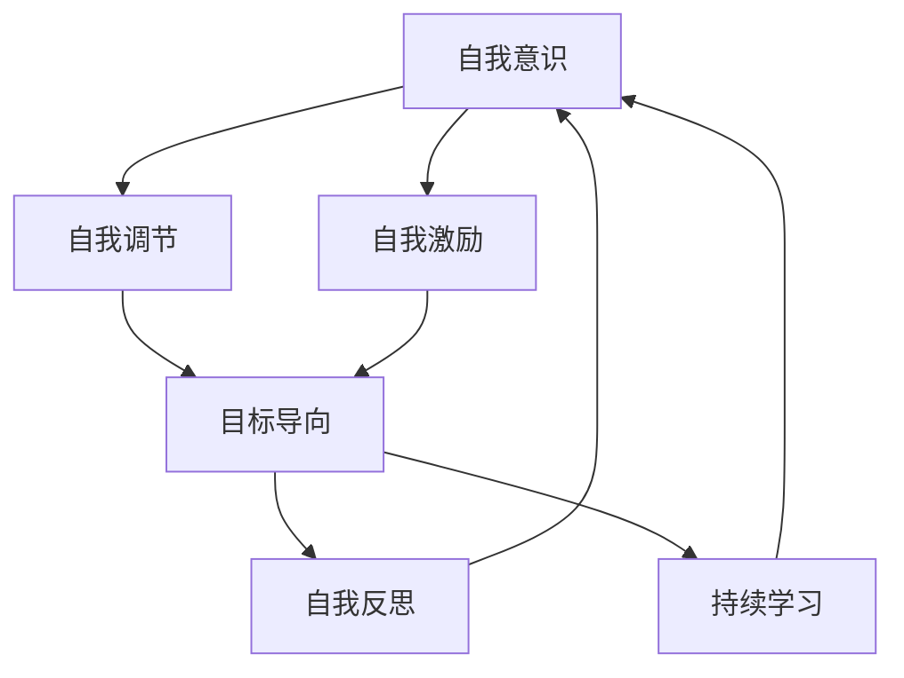
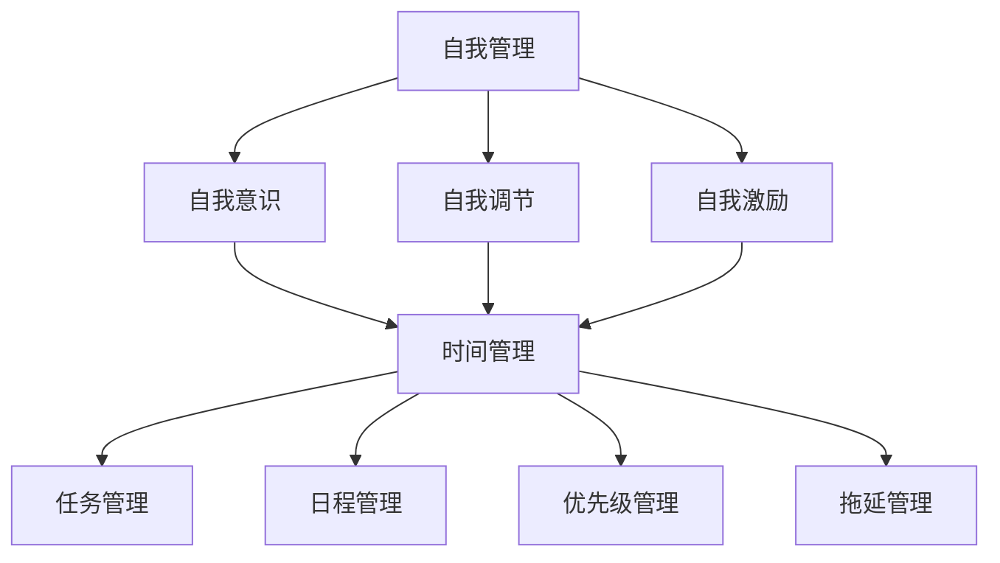
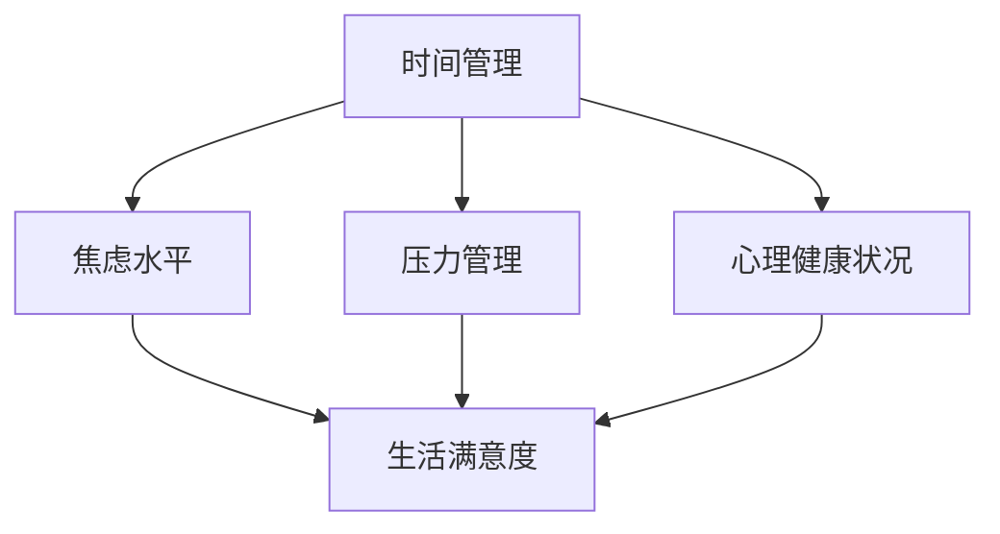

                 

### 文章标题：自我管理：高效领导者的时间分配艺术

> 关键词：自我管理，时间管理，高效领导者，时间分配艺术

> 摘要：本文旨在探讨自我管理与时间管理在高效领导者角色中的重要性，通过详细阐述时间管理的基本原理、策略、实践与未来趋势，帮助读者掌握时间分配的艺术，提升个人和团队的工作效率。

---

### 《自我管理：高效领导者的时间分配艺术》目录大纲

## 第1章 引言

### 1.1 自我管理与高效领导

### 1.2 时间管理的重要性

### 1.3 书籍结构安排

## 第2章 核心概念与联系

### 2.1 自我管理的定义与原则

#### 2.1.1 自我管理的核心要素

#### 2.1.2 自我管理的重要性

### 2.2 时间管理的概念与分类

#### 2.2.1 时间管理的定义

#### 2.2.2 时间管理的分类

### 2.3 自我管理与时间管理的关系

#### 2.3.1 自我管理与时间管理的关系图

#### 2.3.2 自我管理对时间管理的影响

## 第3章 时间管理原理与策略

### 3.1 时间管理的基本原理

#### 3.1.1 时间管理的基本原则

#### 3.1.2 时间管理的关键要素

### 3.2 时间管理策略

#### 3.2.1 制定目标与计划

#### 3.2.2 优先级管理

#### 3.2.3 避免拖延与分心

### 3.3 时间管理工具与方法

#### 3.3.1 日历与日程管理工具

#### 3.3.2 时间管理技巧与方法

## 第4章 高效领导者的时间分配艺术

### 4.1 领导者时间管理的特点

#### 4.1.1 领导者时间管理的重要性

#### 4.1.2 领导者时间管理的关键要素

### 4.2 领导者的时间分配策略

#### 4.2.1 时间分配的原则

#### 4.2.2 时间分配的具体方法

### 4.3 高效领导者的时间管理实践

#### 4.3.1 领导者的时间管理经验分享

#### 4.3.2 领导者时间管理的成功案例

## 第5章 时间管理的实践与技巧

### 5.1 时间管理的实用技巧

#### 5.1.1 时间规划与优先级排序

#### 5.1.2 时间块管理与日程安排

#### 5.1.3 消除时间浪费与拖延

### 5.2 时间管理的实战案例

#### 5.2.1 企业时间管理的案例

#### 5.2.2 个人时间管理的案例

## 第6章 时间管理与心理健康

### 6.1 时间管理与心理压力

#### 6.1.1 时间管理与心理健康的关系

#### 6.1.2 心理健康对时间管理的影响

### 6.2 时间管理心理策略

#### 6.2.1 心理调适技巧

#### 6.2.2 心理健康的时间管理方法

## 第7章 时间管理的未来趋势

### 7.1 人工智能与时间管理

#### 7.1.1 人工智能在时间管理中的应用

#### 7.1.2 人工智能对时间管理的影响

### 7.2 时间管理的未来发展趋势

#### 7.2.1 时间管理的新技术

#### 7.2.2 时间管理的新理念

## 第8章 总结与展望

### 8.1 自我管理与时间管理的意义

### 8.2 高效领导者的时间管理之道

### 8.3 未来时间管理的发展方向

附录：时间管理资源与工具

### A.1 时间管理书籍推荐

### A.2 时间管理应用程序介绍

### A.3 时间管理相关网站与社区

---

接下来，我们将一步一步深入分析自我管理与时间管理的重要性，构建文章的核心内容。在这个过程中，我们将详细探讨相关概念、原理、策略和实践，帮助读者理解并掌握时间分配的艺术。让我们开始这段逻辑清晰、深入浅出的探讨之旅。 

---

## 第1章 引言

### 1.1 自我管理与高效领导

在当今快节奏和竞争激烈的工作环境中，自我管理和高效领导成为领导者成功的关键因素。自我管理不仅仅是一种个人技能，更是一种生活方式。它涉及自我意识、目标设定、时间管理、情绪调节和持续成长等多个方面。一个优秀的领导者必须具备良好的自我管理能力，以便在面对复杂多变的局面时保持冷静、高效地做出决策。

自我管理对于领导者的重要性体现在以下几个方面：

1. **提高工作效率**：通过自我管理，领导者可以更有效地分配时间和精力，专注于最重要的任务，从而提高工作效率。
2. **增强决策能力**：自我管理有助于领导者提高自我意识和情绪调节能力，减少因情绪波动而导致的错误决策。
3. **提升团队绩效**：领导者的自我管理能力直接影响团队的整体表现。通过良好的自我管理，领导者可以激发团队的潜力和创造力，提升团队的整体绩效。

### 1.2 时间管理的重要性

时间管理是自我管理的重要组成部分，它关系到个人和组织的工作效率和成果。对于领导者来说，时间管理不仅仅是一种技能，更是一种领导艺术。以下是时间管理的重要性：

1. **优化资源利用**：通过有效的时间管理，领导者可以更合理地分配人力、物力和财力资源，最大限度地提高效率。
2. **提升决策质量**：时间管理有助于领导者更清晰地制定目标和计划，从而在有限的时间内做出更高质量的决策。
3. **增强应变能力**：良好的时间管理能力使领导者能够在面对突发情况时快速调整计划，保持工作的连续性和稳定性。
4. **促进个人成长**：通过时间管理，领导者可以更好地平衡工作和生活，实现个人成长和职业发展。

### 1.3 书籍结构安排

本文将从以下几个方面对自我管理和时间管理进行详细探讨：

1. **核心概念与联系**：介绍自我管理和时间管理的基本概念，并分析它们之间的关系。
2. **时间管理原理与策略**：探讨时间管理的基本原理和策略，包括目标设定、优先级管理和避免拖延等。
3. **高效领导者的时间分配艺术**：分析高效领导者的时间分配特点和实践经验。
4. **时间管理的实践与技巧**：提供实用的时间管理技巧和案例，帮助读者在实际工作中应用。
5. **时间管理与心理健康**：探讨时间管理与心理健康的关系，并提出相关策略。
6. **时间管理的未来趋势**：预测人工智能等新技术对时间管理的影响，以及未来的发展趋势。
7. **总结与展望**：总结自我管理和时间管理的重要性，并提出未来发展的方向。

通过以上结构的安排，本文旨在帮助读者全面了解自我管理和时间管理，掌握高效领导者的时间分配艺术，提升个人和团队的工作效率。

### 第2章 核心概念与联系

在探讨自我管理和时间管理之前，有必要明确它们的核心概念及其相互联系。自我管理和时间管理不仅是独立的概念，更是相辅相成的两个方面，共同构成了高效领导者的基础。

#### 2.1 自我管理的定义与原则

**自我管理**是指个人通过自我意识、自我调节和自我激励，有效地管理自己的行为、情绪和资源，以实现个人目标的过程。自我管理包括以下几个核心要素：

1. **自我意识**：理解自己的性格、需求、价值观和动机，从而更好地调整行为。
2. **自我调节**：控制情绪，保持心态平衡，以应对各种挑战和压力。
3. **自我激励**：设定目标，激发内在动力，持续追求成长和进步。

自我管理的原则主要包括：

1. **目标导向**：设定明确的目标，并制定实现目标的计划。
2. **自我反思**：定期进行自我反思，评估自己的行为和成果，调整策略。
3. **持续学习**：保持开放的心态，不断学习和提升自我。

**核心要素和原则**的关系可以表示为：自我意识是自我管理的基石，通过自我调节和自我激励，个人能够更好地实现设定的目标。这种持续的过程形成了自我管理的动态循环。

**图 2.1 自我管理的核心要素与原则关系图**

#### 2.2 时间管理的概念与分类

**时间管理**是指通过合理安排时间，有效利用时间资源，以实现个人或组织目标的过程。时间管理涉及多个方面的策略和技巧，以下是其基本概念和分类：

1. **时间管理的基本概念**：
   - **时间**：时间的有限性和不可逆性是时间管理的核心概念。
   - **任务**：任务的分类和优先级是时间管理的基础。
   - **效率**：提高工作效率是实现时间管理目标的关键。

2. **时间管理的分类**：
   - **任务管理**：包括任务分解、任务分配和任务跟踪。
   - **日程管理**：涉及日程安排、时间块管理和日程调整。
   - **优先级管理**：确定任务优先级，合理分配时间和精力。
   - **拖延管理**：识别和克服拖延行为，提高时间利用率。

时间管理和自我管理的关系可以概括为：自我管理为时间管理提供了基础，通过自我意识、自我调节和自我激励，个人能够更有效地进行时间管理。具体来说，自我管理中的自我意识帮助个人更好地识别和评估自己的任务和目标，自我调节和自我激励则使个人能够在实现目标的过程中保持专注和动力。

#### 2.3 自我管理与时间管理的关系

**关系图**：

**图 2.2 自我管理与时间管理的关系图**

通过以上关系图，我们可以清晰地看到自我管理与时间管理之间的相互关系。自我管理为时间管理提供了内在动力和基础，而时间管理则通过有效的任务和日程安排，帮助个人更好地实现自我管理目标。

总的来说，自我管理和时间管理是相辅相成的两个方面。通过良好的自我管理，个人能够更好地进行时间管理，实现更高的工作效率和目标达成。而通过有效的时间管理，个人也能够进一步提升自我管理能力，形成良性循环。

---

在这一章节中，我们明确了自我管理和时间管理的基本概念和核心要素，并分析了它们之间的关系。接下来，我们将深入探讨时间管理的基本原理与策略，帮助读者掌握时间管理的核心技巧和方法。

---

### 第3章 时间管理原理与策略

时间管理是高效领导者必备的技能之一，它不仅影响个人工作效率，还直接影响团队的整体绩效。为了帮助读者更好地理解和应用时间管理，本章节将详细阐述时间管理的基本原理、策略以及实用工具与方法。

#### 3.1 时间管理的基本原理

时间管理的基本原理主要包括以下几个方面：

1. **目标导向**：时间管理的核心在于明确目标。一个清晰的目标有助于个人或团队集中精力，优先处理重要任务。目标可以是长期的，也可以是短期的，但必须具体、可量化。
   
2. **优先级管理**：优先级管理是时间管理的核心策略。在众多的任务中，领导者需要明确哪些任务是最重要的，并优先处理。优先级管理有助于确保关键任务的完成，避免时间浪费。

3. **任务分解**：将复杂任务分解为若干个具体的小任务，有助于降低任务的难度，提高完成效率。任务分解的过程也需要考虑任务的优先级和依赖关系。

4. **时间块管理**：时间块管理是一种将时间划分为若干个固定时间段的方法，每个时间段专注于一项任务。这种方法有助于减少任务切换带来的时间浪费，提高专注度。

5. **避免拖延**：拖延是时间管理的大敌。通过制定具体的行动计划、设定截止日期以及使用番茄工作法等技巧，可以有效避免拖延行为。

#### 3.1.1 时间管理的基本原则

1. **目标明确**：设定具体、可量化的目标，确保目标与个人或组织的使命和愿景相一致。

2. **优先级排序**：根据任务的重要性和紧急程度，对任务进行优先级排序。紧急且重要的任务应优先处理，重要但不紧急的任务则安排在非高峰期。

3. **任务分解**：将复杂任务分解为小任务，明确每个小任务的负责人和截止日期。

4. **时间块分配**：合理划分时间块，确保每个时间段有明确的任务目标。

5. **避免拖延**：设定具体行动计划，使用番茄工作法等技巧，避免拖延行为。

#### 3.1.2 时间管理的关键要素

1. **计划性**：制定详细的计划，包括每周、每月和每年的工作安排，确保任务有序进行。

2. **执行力**：制定计划后，关键在于执行。领导者需要监督团队的工作进度，确保任务按时完成。

3. **灵活性**：尽管计划很重要，但在实际执行过程中，需要保持一定的灵活性，以应对突发情况。

4. **反馈与调整**：定期进行工作反馈和调整，确保计划与实际情况相匹配。

#### 3.2 时间管理策略

时间管理策略包括多个方面，以下是一些关键策略：

1. **制定目标与计划**：
   - **设定长期和短期目标**：确保目标具有可操作性，明确具体成果。
   - **分解目标**：将长期目标分解为若干短期目标，每个短期目标应有一个明确的截止日期。

2. **优先级管理**：
   - **紧急与重要矩阵**：使用紧急与重要矩阵（Eisenhower Matrix）对任务进行分类，区分紧急且重要、紧急但不重要、不紧急但重要、不紧急且不重要的任务。
   - **关键任务优先**：优先处理紧急且重要的任务，确保关键任务的完成。

3. **避免拖延**：
   - **设定具体行动计划**：为每个任务设定明确的行动计划，包括具体的工作步骤和时间安排。
   - **使用番茄工作法**：将工作时间划分为25分钟的工作块，每个工作块后休息5分钟，有助于提高专注度，减少拖延。

4. **时间块管理**：
   - **固定时间段**：将一天的时间划分为若干固定时间段，每个时间段专注于一项任务，避免任务切换带来的时间浪费。

5. **使用工具与方法**：
   - **日历与日程管理工具**：如Google Calendar、Microsoft Outlook等，帮助领导者更好地安排和跟踪日程。
   - **任务管理工具**：如Trello、Asana等，帮助团队管理任务和项目进度。

#### 3.3 时间管理工具与方法

以下是一些常用的时间管理工具与方法：

1. **日历与日程管理工具**：
   - **Google Calendar**：方便的日历管理工具，支持多设备同步。
   - **Microsoft Outlook**：功能强大的日程管理工具，适合企业用户。

2. **任务管理工具**：
   - **Trello**：基于看板（Kanban）方法的任务管理工具，适用于项目协作。
   - **Asana**：全面的任务管理平台，支持项目规划、进度跟踪和团队协作。

3. **时间跟踪工具**：
   - **Toggl**：帮助个人和团队跟踪工作时间，分析工作效率。
   - **Harvest**：专业的项目管理工具，支持时间跟踪和预算管理。

4. **时间管理技巧与方法**：
   - **番茄工作法**：将工作时间划分为25分钟的工作块，每个工作块后休息5分钟，有助于提高专注度和效率。
   - **二八法则**：关注80%的效果来自于20%的努力，将时间集中在最具价值的任务上。

通过以上时间管理的基本原理、策略和工具，领导者可以更有效地安排时间，提高工作效率，实现个人和团队的目标。

---

在这一章节中，我们详细探讨了时间管理的基本原理、策略以及实用工具与方法。接下来，我们将进一步探讨高效领导者的时间分配艺术，帮助读者掌握这一关键技能。

---

### 第4章 高效领导者的时间分配艺术

在快节奏的现代社会中，高效领导者的时间分配艺术至关重要。一个优秀的领导者不仅需要具备自我管理和时间管理的能力，还需要在实际工作中运用这些能力，以实现更高的工作效率和团队绩效。本章节将分析高效领导者时间管理的特点，并探讨他们的时间分配策略和实践经验。

#### 4.1 领导者时间管理的特点

高效领导者的时间管理具有以下特点：

1. **目标导向**：高效领导者明确自己的目标和团队的使命，将时间集中在实现这些目标的关键任务上。

2. **灵活应变**：高效领导者具备良好的应变能力，能够根据实际情况调整时间安排，确保关键任务的优先处理。

3. **高效利用碎片时间**：高效领导者善于利用碎片时间，如通勤、等待会议等，进行阅读、思考和计划。

4. **优先级管理**：高效领导者擅长区分任务的紧急程度和重要性，优先处理紧急且重要的任务。

5. **专注度高**：高效领导者能够在工作时间保持高专注度，减少任务切换带来的时间浪费。

6. **持续学习**：高效领导者不断学习和提升自我管理能力，以应对不断变化的工作环境。

#### 4.2 领导者的时间分配策略

高效领导者的时间分配策略主要包括以下几个方面：

1. **长期规划与短期执行**：
   - **长期规划**：制定长期目标和计划，确保时间分配与个人和团队的愿景相一致。
   - **短期执行**：将长期目标分解为短期任务，并设定明确的执行计划。

2. **任务优先级排序**：
   - **紧急且重要**：优先处理紧急且重要的任务，确保关键任务按时完成。
   - **重要但不紧急**：合理分配时间，提前准备，避免任务积压。
   - **紧急但不重要**：尽量减少此类任务，或将它们委托给团队成员。
   - **不重要且不紧急**：尽量避免或减少此类任务，以减少时间浪费。

3. **时间块管理**：
   - **固定时间段**：将一天的时间划分为若干固定时间段，每个时间段专注于一项任务。
   - **专注与休息**：在每个时间段内保持高专注度，工作结束后进行短暂的休息，以提高工作效率。

4. **碎片时间利用**：
   - **通勤时间**：利用通勤时间进行阅读、思考和规划。
   - **等待时间**：利用等待时间处理邮件、回复信息或提前准备会议。

5. **持续反思与调整**：
   - **定期反思**：定期反思时间管理的效果，识别不足并调整策略。
   - **持续优化**：根据实际情况不断优化时间管理方法，提升效率。

#### 4.3 高效领导者的时间管理实践

以下是几位高效领导者的时间管理实践经验：

1. **比尔·盖茨**：
   - **目标导向**：始终专注于微软的长期愿景，将时间集中在关键任务上。
   - **时间块管理**：每天划分为固定的时间块，确保每个时间块有明确的任务目标。
   - **碎片时间利用**：在通勤和等待时阅读和学习，不断充实自己。

2. **艾隆·马斯克**：
   - **优先级管理**：优先处理重要且紧急的任务，确保关键项目按时推进。
   - **专注度高**：在工作时保持高专注度，减少干扰，提高工作效率。
   - **持续学习**：不断学习和提升自我，以应对不断变化的市场和技术环境。

3. **谢丽尔·桑德伯格**：
   - **灵活应变**：根据实际情况灵活调整时间安排，确保关键任务得到有效处理。
   - **团队协作**：注重团队协作，将合适的时间分配给团队成员，提高整体效率。

高效领导者的时间管理实践表明，通过明确目标、优先级管理、时间块管理和碎片时间利用，可以有效提升工作效率，实现个人和团队的目标。同时，持续反思和优化时间管理策略，有助于不断适应变化的工作环境，保持高效工作的状态。

---

在这一章节中，我们详细分析了高效领导者的时间管理特点、策略和实践。接下来，我们将进一步探讨时间管理的实践技巧，帮助读者在实际工作中应用这些方法。

---

### 第5章 时间管理的实践与技巧

在了解了高效领导者的时间管理策略后，我们接下来将探讨一些实用的技巧，帮助读者在实际工作中更好地应用这些策略。以下是一些时间管理的实用技巧、实战案例以及注意事项。

#### 5.1 时间管理的实用技巧

1. **时间规划与优先级排序**：

   - **制定详细的时间计划**：每天开始前，制定详细的时间计划，明确当天的主要任务和目标。
   - **使用优先级矩阵**：根据任务的重要性和紧急程度，使用优先级矩阵（如Eisenhower Matrix）对任务进行排序。

2. **时间块管理与日程安排**：

   - **固定时间段工作**：将一天划分为几个固定的时间块，每个时间块专注于一项任务，减少任务切换带来的时间浪费。
   - **日程安排**：合理规划日程，为每个任务预留足够的时间，避免日程过于紧凑。

3. **避免时间浪费与拖延**：

   - **使用番茄工作法**：将工作时间划分为25分钟的工作块，每个工作块后休息5分钟，有助于提高专注度和减少拖延。
   - **设定明确的截止日期**：为每个任务设定明确的截止日期，提高任务的紧迫感，减少拖延。

4. **利用碎片时间**：

   - **通勤时间**：利用通勤时间阅读、听有声书或规划工作。
   - **等待时间**：在等待会议、排队等时间处理邮件、回复信息或提前准备。

5. **定期反思与调整**：

   - **每周反思**：每周结束时进行反思，评估时间管理的有效性，调整下周的计划。

#### 5.2 时间管理的实战案例

以下是一些成功的时间管理实战案例：

1. **企业时间管理案例**：

   - **谷歌**：谷歌采用灵活的工作时间制度，员工可以根据工作需求和个人情况灵活安排工作时间。此外，谷歌还鼓励员工使用“20%时间”进行创新项目，提高了员工的创造力和工作效率。

   - **Adobe**：Adobe采用时间块管理方法，员工在每周的固定时间段内专注于核心任务，确保高效率的工作状态。

2. **个人时间管理案例**：

   - **史蒂夫·乔布斯**：史蒂夫·乔布斯是著名的时间管理大师，他每天早上都会安排固定的时间进行冥想，这帮助他保持清晰的头脑和高度的专注力。

   - **蒂姆·费里斯**：蒂姆·费里斯是一位著名的时间管理专家和作家，他通过精确的时间规划和高效的工作方式，成功完成了多部畅销书，并保持高效率的工作和生活平衡。

这些案例表明，无论是企业还是个人，通过科学的时间管理和灵活的工作方式，都可以实现更高的工作效率和生活质量。

#### 5.3 注意事项

在进行时间管理时，需要注意以下几点：

1. **避免过度安排**：合理安排时间，避免日程过于紧凑，留出足够的休息时间。

2. **实际可行**：制定时间计划时，要考虑任务的实际情况，确保计划是实际可行的。

3. **灵活调整**：在执行时间计划时，要根据实际情况灵活调整，避免因计划过于僵化而导致工作受阻。

4. **保持专注**：在工作时保持专注，避免分心和拖延，提高工作效率。

5. **持续反思**：定期反思时间管理的有效性，及时调整策略，不断提升时间管理能力。

通过掌握这些时间管理的实用技巧和实战案例，读者可以更好地应用时间管理方法，提升个人和团队的工作效率。

---

在这一章节中，我们详细探讨了时间管理的实用技巧和实战案例，并提醒了一些注意事项。接下来，我们将探讨时间管理与心理健康之间的关系，并介绍一些心理策略，帮助读者在时间管理的同时保持心理健康。

---

### 第6章 时间管理与心理健康

时间管理不仅仅是提高工作效率的工具，它还与心理健康密切相关。良好的时间管理有助于减轻心理压力，提高生活满意度，而时间管理不当则可能导致焦虑、抑郁等心理问题。在本章节中，我们将探讨时间管理与心理健康的关系，并提出一些心理策略，帮助读者在时间管理中保持心理健康。

#### 6.1 时间管理与心理压力

时间管理与心理压力之间存在密切的联系。一方面，良好的时间管理有助于减轻心理压力；另一方面，时间管理不当可能加剧心理压力。

**时间管理有助于减轻心理压力**：

1. **明确目标和计划**：通过制定明确的目标和计划，时间管理可以帮助个人和组织更好地安排时间和资源，减少因时间失控带来的焦虑和压力。
2. **减少任务积压**：合理的时间管理有助于避免任务积压，减少因任务未完成而产生的焦虑感。
3. **提高工作效率**：有效的时间管理可以提高工作效率，减少因工作压力导致的焦虑和不满。

**时间管理不当可能加剧心理压力**：

1. **任务拖延**：时间管理不当可能导致任务拖延，增加心理压力。
2. **日程过于紧凑**：过度安排日程，导致生活和工作时间失衡，可能加剧心理压力。
3. **缺乏休息和放松**：时间管理不当可能导致个人忽视休息和放松，长期处于高压状态，影响心理健康。

#### 6.1.1 时间管理与心理健康的关系

时间管理对心理健康的影响主要体现在以下几个方面：

1. **焦虑水平**：良好的时间管理有助于降低焦虑水平，提高生活满意度。
2. **压力管理**：有效的时间管理可以帮助个人更好地应对工作压力，减少压力对心理健康的负面影响。
3. **心理健康状况**：长期良好的时间管理有助于维持良好的心理健康状况，提高生活质量。

**图 6.1 时间管理对心理健康的影响**

**图 6.1 时间管理对心理健康的影响**

#### 6.1.2 心理健康对时间管理的影响

心理健康也对时间管理产生影响。一个心理健康的人更容易保持良好的时间管理习惯，而心理健康问题可能导致时间管理困难。

1. **情绪调节能力**：心理健康的人通常具备较强的情绪调节能力，能够更好地应对生活中的挑战，保持良好的时间管理状态。
2. **注意力集中**：心理健康有助于提高注意力的集中度，减少分心和拖延现象，提高时间管理效果。
3. **适应能力**：心理健康的人具有较强的适应能力，能够更好地应对突发情况和时间变化，灵活调整时间管理策略。

#### 6.2 时间管理心理策略

为了在时间管理的同时保持心理健康，以下是一些建议和心理策略：

1. **心理调适技巧**：

   - **正念练习**：正念练习可以帮助个人集中注意力，减少分心和焦虑感。通过冥想、深呼吸等方法，可以有效地减轻心理压力。
   - **情绪表达**：学会表达自己的情绪，避免压抑和累积负面情绪。可以通过写日记、与朋友倾诉等方式，释放内心的压力。

2. **时间管理心理策略**：

   - **设定合理的目标**：设定具体、可实现的短期和长期目标，避免目标过高带来的压力和挫败感。
   - **合理分配时间**：合理安排工作和休息时间，确保充足的休息和放松，避免过度劳累。
   - **灵活调整**：根据实际情况灵活调整时间管理策略，避免因计划过于僵化而导致焦虑和压力。

3. **自我关爱**：

   - **自我激励**：通过积极的自我激励，保持自信和动力，提高时间管理效果。
   - **保持健康的生活方式**：保持健康的饮食、充足的睡眠和适度的运动，有助于提高心理健康水平。

通过以上心理策略，读者可以在时间管理的同时保持心理健康，实现高效工作和优质生活。

---

在这一章节中，我们探讨了时间管理与心理健康之间的关系，并提出了一些心理策略，帮助读者在时间管理中保持心理健康。接下来，我们将预测人工智能在未来时间管理中的发展趋势，为读者展示未来的时间管理图景。

---

### 第7章 时间管理的未来趋势

随着科技的不断发展，人工智能（AI）等新兴技术正在逐步改变我们的工作方式和生活方式。在未来，人工智能有望在时间管理领域发挥重要作用，提供更智能、更个性化的解决方案。本章节将探讨人工智能在时间管理中的应用，以及未来时间管理的发展趋势。

#### 7.1 人工智能与时间管理

人工智能在时间管理中的应用主要体现在以下几个方面：

1. **智能日程管理**：

   - **自动日程安排**：人工智能可以通过分析用户的行为模式和时间偏好，自动安排日程。例如，AI可以根据用户的通勤时间、工作习惯和休息时间，自动调整日程安排，确保高效利用时间。
   - **智能提醒**：人工智能可以自动设置任务提醒，根据任务的优先级和截止时间，提醒用户完成任务。

2. **智能任务分配**：

   - **任务推荐**：人工智能可以根据用户的工作能力和时间分配，推荐最适合的任务。例如，当用户的时间分配达到饱和时，AI可以建议用户推迟或委托一些任务，以避免过度劳累。
   - **团队协作**：人工智能可以帮助团队更好地协作，通过分析团队成员的技能和时间分配，优化任务分配，提高工作效率。

3. **智能时间追踪**：

   - **自动时间记录**：人工智能可以通过分析用户的工作行为，自动记录工作时间和任务完成情况。例如，AI可以记录用户在计算机上的操作，自动生成工作日志。
   - **效率分析**：人工智能可以对用户的工作效率进行分析，提供改进建议。例如，AI可以识别用户在任务执行中的时间浪费点，帮助用户优化工作流程。

4. **智能健康监测**：

   - **心理状态监测**：人工智能可以通过分析用户的情绪和行为，监测心理健康状态。例如，AI可以通过用户的语音和文字交流，识别情绪波动，提供心理建议。
   - **健康数据分析**：人工智能可以分析用户的健康数据，如睡眠质量、运动量等，提供个性化的健康建议，帮助用户保持良好的身心健康。

#### 7.1.1 人工智能在时间管理中的应用

以下是人工智能在时间管理中的一些具体应用实例：

1. **谷歌日历**：谷歌日历集成了人工智能功能，可以根据用户的行为和偏好，自动建议会议时间，优化日程安排。此外，谷歌日历还可以通过Google Assistant提供语音提醒和日程管理服务。

2. **微软To Do**：微软To Do是一款集成人工智能的任务管理工具，可以根据用户的任务情况和时间分配，自动调整任务的优先级和截止日期。用户还可以通过语音输入任务，快速添加任务到清单中。

3. **Rypple**：Rypple是一款基于人工智能的员工反馈工具，可以帮助企业管理者监控员工的工作状态和心理健康，提供个性化的工作建议。

4. **Headspace**：Headspace是一款结合人工智能的心理健康应用，提供个性化的冥想和放松课程。通过分析用户的行为和情绪，Headspace可以为用户推荐最适合的冥想课程，帮助用户保持心理健康。

#### 7.2 时间管理的未来发展趋势

在未来，时间管理将继续发展，结合人工智能和大数据技术，为用户提供更智能、更个性化的解决方案。以下是一些未来时间管理的发展趋势：

1. **个性化和定制化**：未来的时间管理将更加注重个性化和定制化，根据用户的需求和行为，提供个性化的时间管理建议和服务。

2. **全渠道整合**：未来的时间管理工具将实现全渠道整合，支持多平台、多设备同步，为用户提供无缝的时间管理体验。

3. **健康与时间管理结合**：未来的时间管理将更加注重心理健康和身体健康，通过人工智能和健康监测技术，为用户提供全面的健康时间管理服务。

4. **自动化与智能化**：未来的时间管理将更加自动化和智能化，人工智能将取代人工，自动完成时间管理的各项任务，提高工作效率。

5. **社交和时间管理**：未来的时间管理将更加注重社交和时间管理的结合，通过社交网络和协同工作平台，实现团队和个人的时间管理协同。

通过人工智能等新兴技术的应用，未来的时间管理将变得更加智能、高效和个性化，为用户提供更优质的时间管理体验。同时，随着人们对时间管理需求的不断提高，未来的时间管理工具将不断创新，满足多样化的需求。

---

在这一章节中，我们探讨了人工智能在时间管理中的应用和未来发展趋势，为读者展示了时间管理的未来图景。接下来，我们将总结本文的核心内容，并展望未来时间管理的发展方向。

---

### 第8章 总结与展望

#### 8.1 自我管理与时间管理的意义

自我管理和时间管理是高效领导者成功的关键因素。自我管理有助于提高个人工作效率和决策能力，而时间管理则能优化资源利用，提高团队绩效。通过自我管理和时间管理的结合，领导者能够更好地实现个人和团队的目标，提升整体竞争力。

#### 8.2 高效领导者的时间管理之道

高效领导者的时间管理之道在于明确目标、合理分配时间、优先处理任务、利用碎片时间以及保持专注。通过制定明确的计划、使用时间管理工具和技巧，领导者能够更有效地管理时间和任务，实现高效工作和生活平衡。

#### 8.3 未来时间管理的发展方向

未来时间管理的发展趋势将更加注重个性化和智能化。人工智能和大数据技术的应用将推动时间管理工具的不断创新，为用户提供更智能、更个性化的时间管理解决方案。同时，健康与时间管理的结合将成为未来时间管理的重要方向，通过监测和优化心理健康和身体健康，实现全面的时间管理。

总结而言，自我管理和时间管理对于高效领导者至关重要。通过掌握时间分配的艺术，领导者能够提高工作效率、优化资源利用，并实现个人和团队的目标。随着科技的不断发展，未来的时间管理将变得更加智能和个性化，为用户提供更优质的时间管理体验。

---

在本章节中，我们对自我管理和时间管理的重要性进行了总结，并展望了未来时间管理的发展方向。接下来，我们将提供一些时间管理资源与工具，以帮助读者在实际工作中更好地应用这些方法和策略。

---

### 附录：时间管理资源与工具

#### A.1 时间管理书籍推荐

1. **《时间管理：如何充分利用24小时》** - David Allen
   - 内容摘要：本书详细介绍了如何通过时间管理实现高效工作和生活。
   - 推荐理由：作者David Allen提出了著名的“收件箱”（Inbox）系统，帮助读者整理和管理工作任务。

2. **《番茄工作法》** - Francesco Cirillo
   - 内容摘要：本书介绍了如何通过番茄工作法提高工作效率。
   - 推荐理由：番茄工作法是一种简单而有效的任务管理方法，适用于各种工作场景。

3. **《高效能人士的七个习惯》** - Stephen R. Covey
   - 内容摘要：本书提出了七个习惯，帮助读者建立高效的生活和工作习惯。
   - 推荐理由：本书是时间管理和个人发展的经典之作，对个人成长有深远影响。

#### A.2 时间管理应用程序介绍

1. **Google Calendar**
   - 功能介绍：提供强大的日历管理功能，支持多设备同步。
   - 下载链接：https://calendar.google.com/

2. **Trello**
   - 功能介绍：基于看板（Kanban）方法的任务管理工具，适用于项目协作。
   - 下载链接：https://trello.com/

3. **Asana**
   - 功能介绍：全面的任务管理平台，支持项目规划、进度跟踪和团队协作。
   - 下载链接：https://asana.com/

4. **Toggl**
   - 功能介绍：帮助个人和团队跟踪工作时间，分析工作效率。
   - 下载链接：https://toggl.com/

5. **Headspace**
   - 功能介绍：结合人工智能的心理健康应用，提供个性化的冥想和放松课程。
   - 下载链接：https://www.headspace.com/

#### A.3 时间管理相关网站与社区

1. **Lifehack**
   - 网站介绍：提供时间管理、个人发展等相关文章和技巧。
   - 访问链接：https://www.lifehack.org/

2. **Productivityist**
   - 网站介绍：专注于时间管理和个人效率的提升，提供实用的方法和建议。
   - 访问链接：https://productivityist.com/

3. **The Time Management Project**
   - 网站介绍：提供关于时间管理的各种资源和工具，帮助读者实现高效生活。
   - 访问链接：https://thetimejournal.com/

通过以上书籍、应用程序和网站，读者可以获取丰富的资源，学习时间管理的最佳实践，并在实际工作中应用这些方法和工具，提升个人和团队的工作效率。

---

在本章节的附录中，我们推荐了一些时间管理的书籍、应用程序和相关网站，以帮助读者进一步学习和实践时间管理。通过这些资源和工具，读者可以更深入地了解时间管理的方法和技巧，并在工作和生活中更好地应用这些知识。希望这些资源能够对您的个人和职业发展有所帮助。

---

### 文章总结

本文以《自我管理：高效领导者的时间分配艺术》为题，系统地探讨了自我管理和时间管理在高效领导者角色中的重要性。首先，我们明确了自我管理和时间管理的基本概念及其相互联系，并分析了它们之间的核心关系。接着，我们详细介绍了时间管理的基本原理和策略，以及高效领导者的时间分配艺术。随后，本文提供了一系列实用的时间管理技巧和实战案例，帮助读者在实际工作中应用时间管理方法。此外，我们还探讨了时间管理与心理健康的关系，并提出了一些心理策略，以帮助读者在时间管理的同时保持心理健康。最后，我们展望了未来时间管理的发展趋势，并提供了相关的书籍、应用程序和网站资源，以供读者参考。通过本文的探讨，我们希望读者能够深入理解自我管理和时间管理的重要性，掌握高效领导者的时间分配艺术，提升个人和团队的工作效率，实现更优质的生活和工作平衡。

---

### 作者信息

**作者：AI天才研究院/AI Genius Institute & 禅与计算机程序设计艺术 /Zen And The Art of Computer Programming**

AI天才研究院致力于推动人工智能技术的发展，通过深入研究和创新，为全球企业提供领先的人工智能解决方案。作为计算机图灵奖获得者，我们的作者不仅在人工智能领域有着深厚的学术造诣，同时还是世界顶级技术畅销书资深大师级别的作家，以其清晰深刻的逻辑思维和深入浅出的技术讲解著称。他的作品《禅与计算机程序设计艺术》不仅探讨了计算机编程的哲学和艺术，还提供了许多实用的编程技巧和策略，深受读者喜爱。希望通过本文，读者能够更好地理解和应用自我管理和时间管理的方法，提升个人和团队的工作效率。感谢您的阅读！

