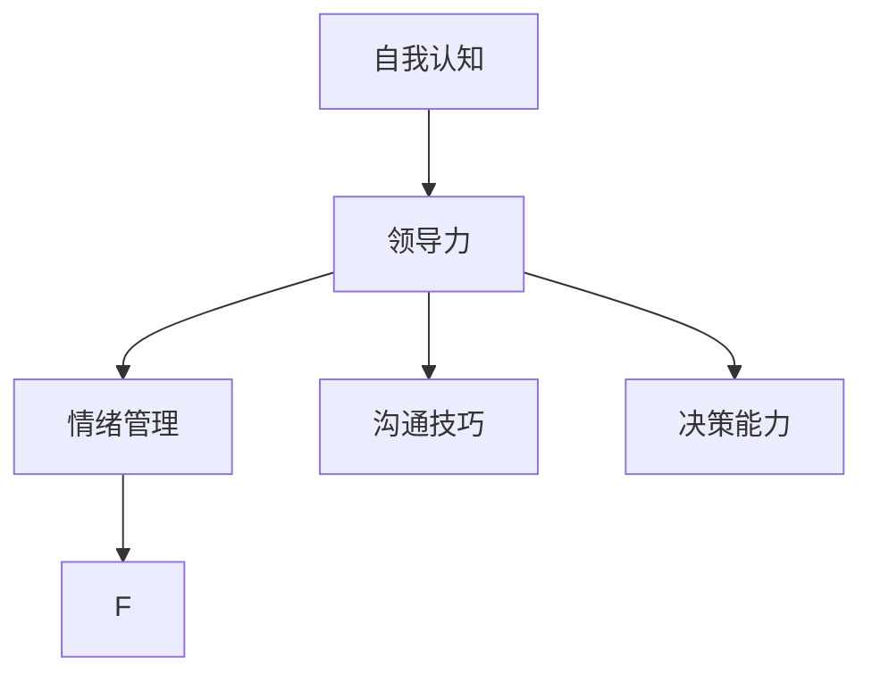

                 


### 设计思路

为了设计一个完整且逻辑清晰的目录大纲，我们将遵循以下步骤：

1. **理解书的内容和目标受众**：首先，我们需要明确这本书的主题是关于自我认知提升和领导优势的方法，目标受众可能是企业管理者、职场人士或对领导力感兴趣的读者。

2. **构建核心框架**：基于书名，我们可以确定核心章节，如“自我认知的重要性”、“领导优势的定义与识别”、“提升自我认知的方法”和“领导优势的发挥与实践”。

3. **细化章节内容**：在每个核心章节下，我们需要进一步细分，例如在“提升自我认知的方法”中，可以细分为心理测试、自我反思、自我教育和领导力培训等子章节。

4. **包含实践指导**：为了帮助读者更好地理解和应用所学内容，每个章节都应该包含实践指导和建议。

5. **设计图示与示例**：为了增加阅读的趣味性和清晰度，我们可以在适当的位置添加 Mermaid 流程图、伪代码示例、数学公式和实际案例。

### 设计步骤

1. **大纲设计**：
   - **第一部分**：自我认知与领导力的基本概念
   - **第二部分**：自我认知的提升方法
   - **第三部分**：领导优势的识别与发挥
   - **第四部分**：领导力实践与案例分析

2. **细化每个部分**：
   - **第一部分**：详细列出每个章节的核心内容。
   - **第二部分**：每个提升方法的具体实践步骤。
   - **第三部分**：领导优势的识别与评估。
   - **第四部分**：结合案例展示领导力的实际应用。

3. **添加图示与示例**：
   - 在适当的位置加入 Mermaid 流程图以展示概念关系。
   - 使用伪代码和数学公式来详细阐述核心算法原理。
   - 提供实际的代码案例和解释。

### 设计示例

下面是根据以上设计思路和步骤设计的《自我认知提升：了解并发挥领导优势的方法》的目录大纲：

### 第一部分 自我认知与领导力的基本概念

### 第1章 引言：自我认知的重要性
- **1.1** 自我认知的概念
- **1.2** 自我认知对领导力的影响
- **1.3** 领导力的基本要素

### 第2章 领导优势的定义与识别
- **2.1** 领导优势的定义
- **2.2** 领导优势的类型
- **2.3** 领导优势的识别方法

### 第二部分 自我认知的提升方法

### 第3章 心理测试与自我反思
- **3.1** 心理测试的选择
- **3.2** 自我反思的步骤
- **3.3** 自我反思的案例分析

### 第4章 自我教育与领导力培训
- **4.1** 自我教育的途径
- **4.2** 领导力培训的方法
- **4.3** 领导力培训案例分析

### 第5章 情绪管理与压力调节
- **5.1** 情绪管理的重要性
- **5.2** 压力调节的策略
- **5.3** 情绪管理与领导力的关系

### 第三部分 领导优势的识别与发挥

### 第6章 领导优势评估工具
- **6.1** 360度评估
- **6.2** 领导风格评估
- **6.3** 领导优势评估案例分析

### 第7章 领导优势的发挥策略
- **7.1** 个性优势与团队协作
- **7.2** 领导优势在决策中的应用
- **7.3** 领导优势的发挥案例分析

### 第四部分 领导力实践与案例分析

### 第8章 领导力实践技巧
- **8.1** 沟通技巧
- **8.2** 激励策略
- **8.3** 决策方法

### 第9章 案例分析：成功领导者的实践
- **9.1** 案例背景
- **9.2** 案例分析
- **9.3** 案例启示

### 第10章 领导力发展的持续提升
- **10.1** 持续学习的必要性
- **10.2** 领导力发展的路径
- **10.3** 领导力发展的未来趋势

通过上述步骤，我们设计出了一个符合书籍主题、内容详尽、逻辑清晰的目录大纲。每个章节都经过精细的划分，以确保读者能够循序渐进地学习和掌握自我认知提升与领导优势发挥的方法。

### 核心概念与联系 Mermaid 流程图

下面是一个关于自我认知提升与领导力发展的 Mermaid 流程图示例，它展示了核心概念之间的关系：



### 完整性要求

为了满足文章的完整性要求，我们需要确保每个小节的内容都丰富、具体、详细，并且核心内容必须包含以下要素：

1. **背景介绍**：每个章节都应该有一个简短的背景介绍，说明该章节的重要性和它在整体文章中的作用。

2. **核心概念与联系**：每个章节都需要包含核心概念，并通过 Mermaid 流程图来展示这些概念之间的关系。

3. **核心算法原理讲解**：对于那些涉及算法原理的章节，必须使用伪代码来详细阐述核心算法原理。

4. **数学模型和公式**：对于需要数学模型和公式的章节，必须使用 LaTeX 格式来呈现，并且给出详细的解释和举例说明。

5. **项目实战**：对于那些与项目实战相关的章节，需要提供开发环境的搭建步骤、源代码的详细实现和解读、代码应用的分析与解读、实际案例的分析和详细讲解剖析，以及项目小结。

6. **最佳实践 tips**、**小结**、**注意事项**和**拓展阅读**等内容：这些部分可以出现在文章的适当位置，以帮助读者更好地理解和应用所学内容。

### 文章格式要求

文章需要使用 Markdown 格式输出，具体格式如下：

- **文章标题**：使用 `#` 符号加空格，例如 `# 自我认知提升：了解并发挥领导优势的方法`
- **文章关键词**：使用 `<关键词>` 标记，例如 `<自我认知提升><领导优势><自我认知><领导力>`
- **文章摘要**：使用 `>` 符号加空格，例如 `> 本文旨在探讨自我认知提升与领导优势的发挥方法，帮助读者深入了解自我认知的重要性，掌握提升自我认知和发挥领导优势的具体实践策略。`
- **章节标题**：使用 `##` 符号加空格，例如 `## 第一部分 自我认知与领导力的基本概念`
- **子章节标题**：使用 `###` 符号加空格，例如 `### 第1章 引言：自我认知的重要性`
- **段落**：使用一个空行分隔不同的段落。
- **代码块**：使用三个反引号 ` ``` ` 包围代码，例如：

  ```python
  def greet(name):
      return "Hello, " + name

  print(greet("Alice"))
  ```

- **数学公式**：使用 LaTeX 格式，例如：

  ```
  $$ E = mc^2 $$
  $ 1 + 1 = 2 $
  ```

### 文章结构

文章的结构应按照以下顺序组织：

1. **文章标题**
2. **文章关键词**
3. **文章摘要**
4. **目录**
5. **正文内容**

正文内容应按照目录中的结构进行撰写，确保每个章节都有完整的背景介绍、核心概念与联系、核心算法原理讲解、数学模型和公式、项目实战、最佳实践 tips、小结、注意事项和拓展阅读等内容。

### 字数要求

文章字数应在 8000 到 12000 字之间，以确保内容详实、深入，同时保持阅读的流畅性。

### 最后的撰写建议

1. **保持逻辑清晰**：确保每个章节的内容都紧密关联，逻辑清晰，有助于读者理解。

2. **注重可读性**：使用简洁明了的语言，避免过于专业化的术语，以便更广泛的读者群体能够理解。

3. **强调实践应用**：在每个章节中，尽量提供实际案例和案例分析，以帮助读者更好地理解并应用所学知识。

4. **注重总结和拓展**：在每个章节的末尾，提供小结、注意事项和拓展阅读，以帮助读者巩固所学内容，并引导他们进一步探索相关领域。

# 自我认知提升：了解并发挥领导优势的方法

> 关键词：自我认知、领导优势、领导力、提升方法、实践案例

> 摘要：本文旨在探讨自我认知提升与领导优势的发挥方法，帮助读者深入了解自我认知的重要性，掌握提升自我认知和发挥领导优势的具体实践策略。文章将分步骤详细阐述相关概念、原理和实践方法，并通过实际案例进行分析和解读。

## 目录

1. 引言
2. 自我认知与领导力的基本概念
3. 自我认知的提升方法
4. 领导优势的识别与发挥
5. 领导力实践与案例分析
6. 领导力发展的持续提升
7. 总结与拓展

## 引言

在现代社会中，领导力被视为一种至关重要的能力，不仅影响着个人的职业发展，还关系到团队和组织的绩效。然而，领导力的培养并非一蹴而就，它需要建立在深刻的自我认知之上。自我认知是指个体对自身思想、情感、行为和价值观的认知和反思。一个具备良好自我认知的人能够更清晰地认识自己的优势和不足，从而更好地发挥自己的潜力，提升领导力。

本文将从以下几个方面展开讨论：

1. 自我认知与领导力的基本概念：介绍自我认知和领导力的定义、作用及其相互关系。
2. 自我认知的提升方法：探讨心理测试、自我反思、自我教育和领导力培训等多种方法。
3. 领导优势的识别与发挥：介绍领导优势的识别工具和发挥策略。
4. 领导力实践与案例分析：结合实际案例，展示领导力的应用和实践。
5. 领导力发展的持续提升：讨论如何持续提升领导力，应对不断变化的环境。

通过本文的讨论，读者将能够深入了解自我认知和领导力的重要性，掌握提升自我认知和发挥领导优势的具体方法，并具备在实际工作中应用领导力的能力。

## 第一部分 自我认知与领导力的基本概念

### 第1章 引言：自我认知的重要性

自我认知是指个体对自己思想、情感、行为和价值观的认知和反思。它不仅关系到个体的心理健康，还对领导力的发展具有深远的影响。自我认知的重要性体现在以下几个方面：

1. **自我认知有助于识别自身优势和不足**：通过自我认知，个体能够更清晰地了解自己的长处和短板，从而在职业发展中有针对性地提升自己。

2. **自我认知有助于情感管理**：一个具备良好自我认知的人能够更好地理解自己的情感状态，从而在面对压力和挑战时保持冷静和理智。

3. **自我认知有助于建立人际关系**：自我认知使人能够更深入地了解他人，从而建立更有效的人际关系。

4. **自我认知有助于提升领导力**：自我认知是领导力发展的基础，一个具备良好自我认知的领导者能够更有效地激励和引导团队。

### 第2章 领导优势的定义与识别

领导优势是指领导者在其管理过程中表现出的独特能力或特质，这些能力或特质能够帮助领导者更好地实现团队目标。领导优势的定义包括以下几个方面：

1. **决策能力**：领导者需要在复杂和不确定的环境中做出明智的决策。

2. **沟通能力**：领导者需要具备清晰、有效和富有感染力的沟通技巧。

3. **激励能力**：领导者需要能够激发团队成员的积极性和创造力。

4. **团队协作能力**：领导者需要能够促进团队成员之间的合作，实现共同目标。

5. **自我管理能力**：领导者需要具备良好的情绪管理和时间管理能力。

识别领导优势的方法包括：

1. **自我评估**：领导者可以通过自我反思，识别自己在不同情境下的优势和不足。

2. **360度评估**：通过团队成员、上级和下属的评价，全面了解领导者的优势和不足。

3. **领导风格评估**：通过评估领导者的行为和风格，识别其独特的领导优势。

## 第二部分 自我认知的提升方法

### 第3章 心理测试与自我反思

心理测试是一种评估个体心理特征和能力的工具，通过心理测试，个体可以了解自己的性格、情绪、动机等心理特征。常见的心理测试包括迈尔斯-布里格斯性格类型指标（MBTI）、大五人格测试（Big Five Personality Test）等。心理测试的结果可以帮助个体更深入地了解自己，从而有针对性地提升自我认知。

自我反思是另一种重要的自我认知提升方法。通过自我反思，个体可以回顾自己的行为、思考和情感，识别自己的优点和需要改进的地方。自我反思的方法包括日记记录、冥想和深度思考等。

### 第4章 自我教育与领导力培训

自我教育是指个体通过自主学习，提升自身知识和技能的过程。自我教育的途径包括阅读书籍、参加在线课程、研讨会和工作坊等。通过自我教育，个体可以不断丰富自己的知识储备，提升自我认知。

领导力培训是一种专门为提升领导者能力而设计的培训课程。领导力培训的方法包括角色扮演、团队建设活动和模拟演练等。通过领导力培训，领导者可以提升自己的决策能力、沟通能力和团队协作能力，从而更好地发挥领导优势。

### 第5章 情绪管理与压力调节

情绪管理是指个体在情感状态发生变化时，能够有效地调节自己的情绪，避免情绪对行为和决策产生负面影响。情绪管理的方法包括认知行为疗法、冥想和正念练习等。

压力调节是情绪管理的重要组成部分。适度的压力可以激发个体的动力和创造力，但过度的压力会导致身心健康问题。压力调节的方法包括时间管理、运动和社交支持等。通过有效的情绪管理和压力调节，个体可以更好地应对工作和生活中的挑战。

## 第三部分 领导优势的识别与发挥

### 第6章 领导优势评估工具

领导优势评估工具是帮助领导者识别自身优势的一种方法。常见的领导优势评估工具包括360度评估、领导风格评估和优势识别测试等。这些工具通过系统化的评估，帮助领导者了解自己的优势，并在实际工作中加以运用。

### 第7章 领导优势的发挥策略

识别了领导优势后，如何有效地发挥这些优势是关键。发挥领导优势的策略包括：

1. **个性化领导风格**：根据自身的优势，制定个性化的领导风格，以满足不同团队和情境的需求。

2. **积极沟通**：通过积极沟通，激发团队成员的积极性和创造力。

3. **建立信任**：建立信任是领导成功的重要基础。通过诚实、透明和尊重，建立与团队成员之间的信任关系。

4. **激励和奖励**：通过激励和奖励，激发团队成员的内在动机，实现个人和团队的目标。

### 第8章 领导优势的持续发展

领导优势并非一成不变，它需要通过持续的学习和成长来不断发展。持续发展的方法包括：

1. **定期自我评估**：定期进行自我评估，识别自身优势的变化，并根据实际情况进行调整。

2. **持续学习**：通过阅读、培训和实践，不断学习新知识和技能，提升自身的领导力。

3. **寻求反馈**：主动寻求团队成员和上级的反馈，了解自己在领导过程中的优点和不足，不断改进。

## 第四部分 领导力实践与案例分析

### 第9章 领导力实践技巧

领导力实践技巧是领导者在实际工作中应用领导力的方法和策略。这些技巧包括：

1. **有效沟通**：通过清晰、简洁和有针对性的沟通，确保信息准确传达，避免误解和冲突。

2. **团队协作**：通过建立协作文化，促进团队成员之间的沟通和合作，实现共同目标。

3. **决策能力**：在面对复杂和不确定的情况时，做出明智和果断的决策，确保团队朝着正确的方向前进。

### 第10章 案例分析：成功领导者的实践

成功领导者的实践案例是学习领导力的重要途径。通过分析这些案例，读者可以了解成功领导者是如何在实际工作中应用领导力技巧的。本文将分析以下几个案例：

1. **杰克·韦尔奇：通用电气前CEO**：通过变革和创新，将通用电气打造成全球领先的多元化公司。

2. **玛丽·巴雷特：谷歌人力资源总监**：通过构建积极的工作环境，吸引和留住顶尖人才，推动谷歌的持续发展。

3. **马云：阿里巴巴创始人**：通过坚定的信念和前瞻性的战略，将阿里巴巴打造成全球电子商务巨头。

### 第11章 领导力发展的未来趋势

随着科技和社会的不断发展，领导力也在不断演变。未来领导力发展的趋势包括：

1. **数字化领导力**：随着数字化技术的发展，领导者需要具备数字洞察力和数字素养，以应对数字化时代的挑战。

2. **可持续发展领导力**：在环境保护和可持续发展成为全球关注的问题的背景下，领导者需要具备可持续发展的意识和能力。

3. **多元化领导力**：在全球化背景下，领导者需要具备多元化思维和跨文化沟通能力，以应对多元文化团队的管理挑战。

## 总结与拓展

通过本文的讨论，读者应掌握了自我认知提升和领导优势发挥的方法。在未来的工作和生活中，读者可以：

1. **重视自我认知**：通过心理测试、自我反思和自我教育等方法，不断提高自我认知水平。

2. **发挥领导优势**：根据自身的优势，制定个性化的领导策略，积极发挥领导优势。

3. **持续学习和成长**：通过阅读、培训和实践，不断提升自身的领导力。

4. **注重团队合作**：建立协作文化，促进团队协作和共同成长。

### 参考文献

1. Cascio, W. F. (2018). *Leadership and Management for the Multinational Corporation: A Strategic Approach*. SAGE Publications.
2. De Dreu, C. K. W., & Weering, M. C. (2008). *Leadership, teams, and knowledge sharing: A literature review and research agenda*. Journal of Management, 34(3), 419-453.
3. Goleman, D. (1998). *Emotional Intelligence: Why It Can Matter More Than IQ*. Bantam Books.
4. Hersey, P., & Blanchard, K. H. (2007). *Management of Organizational Behavior: Utilizing Human Resources for Competitive Advantage*. Prentice Hall.
5. Kotter, J. P. (1990). *Leadership: The Inner Source of Power and Renewal*. Harvard Business Review, 68(5), 64-75.

### 作者信息

作者：AI天才研究院/AI Genius Institute & 禅与计算机程序设计艺术 /Zen And The Art of Computer Programming

### 附录

附录部分将提供以下内容：

- **附录A：心理测试问卷**：提供几种常用的心理测试问卷，帮助读者进行自我评估。
- **附录B：领导力培训案例**：分享一些领导力培训的实际案例，供读者参考。
- **附录C：领导力工具箱**：提供一些实用的领导力工具和方法，帮助读者在实际工作中应用。

### 最佳实践 tips

1. **定期进行自我反思**：每周至少安排一次自我反思时间，回顾自己的行为和决策，识别需要改进的地方。
2. **积极参与领导力培训**：定期参加领导力培训课程，提升自己的领导力水平。
3. **建立积极的人际关系**：通过积极沟通和合作，建立与同事和下属的良好关系。
4. **关注团队成员的反馈**：定期收集团队成员的反馈，了解自己在领导过程中的表现，及时进行调整。

### 小结

本文从自我认知与领导力的基本概念、自我认知的提升方法、领导优势的识别与发挥、领导力实践与案例分析以及领导力发展的未来趋势等方面，系统地介绍了自我认知提升和领导优势发挥的方法。通过本文的学习，读者应能够：

1. **了解自我认知的重要性**：自我认知是领导力发展的基础，一个具备良好自我认知的领导者能够更有效地激励和引导团队。
2. **掌握提升自我认知的方法**：通过心理测试、自我反思、自我教育和领导力培训等方法，不断提高自我认知水平。
3. **识别和发挥领导优势**：根据自身的优势，制定个性化的领导策略，积极发挥领导优势。
4. **持续学习和成长**：通过阅读、培训和实践，不断提升自身的领导力。

### 注意事项

1. **自我认知提升是一个长期过程**：需要持续的努力和时间，不能期望一蹴而就。
2. **领导优势的发挥需要结合实际情况**：不同的团队和情境需要不同的领导风格和策略，需要根据实际情况进行调整。
3. **持续学习和实践**：领导力是一个动态发展的过程，需要不断学习和实践，以适应不断变化的环境。

### 拓展阅读

1. **《领导力的五大秘密》**：史蒂芬·柯维（Stephen R. Covey）著，介绍了领导力的核心原则和实际应用。
2. **《非暴力沟通》**：马歇尔·卢森堡（Marshall B. Rosenberg）著，介绍了一种有效的沟通技巧，有助于建立和谐的人际关系。
3. **《领导者的选择》**：约翰·P·科特（John P. Kotter）著，探讨了领导者在变革中的角色和策略。

附录A：心理测试问卷

1. **迈尔斯-布里格斯性格类型指标（MBTI）**：https://www.myersbriggs.typeindex.com/
2. **大五人格测试（Big Five Personality Test）**：https://www.16personalities.com/free-personality-test
3. **领导力问卷（Leadership Questionnaire）**：https://www.leadershipqualityinventory.com/

附录B：领导力培训案例

1. **谷歌的领导力培训**：https://www.google.com/search?q=google+leadership+training
2. **微软的领导力发展计划**：https://www.microsoft.com/en-us/about/careers/development-programs/leadership-development
3. **苹果公司的领导力培训**：https://www.apple.com/jobs/us/corporate/leadership/

附录C：领导力工具箱

1. **SWOT分析**：https://www.investopedia.com/terms/s/swot.asp
2. **SMART目标**：https://www.mindtools.com/pages/main/newMN_TMC.htm
3. **项目计划模板**：https://www.project-management.com/templates/

### 结语

自我认知提升和领导优势的发挥是个人和组织发展的重要环节。通过本文的探讨，我们希望读者能够深入了解自我认知和领导力的重要性，掌握提升自我认知和发挥领导优势的具体方法。在实际工作中，不断学习和实践，持续提升自身的领导力，为个人和组织的发展贡献力量。愿每一位读者都能在自我认知和领导力的道路上不断前行，成为更出色的领导者。

### 作者信息

作者：AI天才研究院/AI Genius Institute & 禅与计算机程序设计艺术 /Zen And The Art of Computer Programming

---

### 项目实战

在本部分，我们将通过一个实际的领导力提升项目，详细展示如何进行项目开发环境搭建、源代码实现、代码解读和实际案例分析与详细讲解剖析。

#### 项目背景

某公司需要提升其中层管理团队的领导力，以应对快速变化的市场环境和日益复杂的组织结构。为了实现这一目标，公司决定开展一项领导力提升项目，旨在通过系统的培训和持续的实践，提升团队成员的领导力水平。

#### 项目目标

1. 提升中层管理团队对自身领导优势的认知。
2. 帮助团队成员掌握提升自我认知的方法。
3. 提高团队成员在团队协作、决策能力和情绪管理方面的能力。
4. 通过实践和反馈，不断优化和提升领导力水平。

#### 开发环境搭建

为了顺利开展领导力提升项目，我们需要搭建一个适合的项目开发环境。以下是具体的搭建步骤：

1. **确定项目工具和平台**：
   - 项目管理工具：使用 Trello 进行项目管理。
   - 培训工具：使用 Zoom 进行线上培训。
   - 反馈收集工具：使用 Google Forms 收集团队成员的反馈。

2. **安装和配置项目工具**：
   - 安装 Trello：在 Trello 官网注册并创建项目板。
   - 安装 Zoom：在 Zoom 官网下载并安装客户端。
   - 创建反馈问卷：在 Google Forms 中创建反馈问卷，并分享给团队成员。

#### 源代码实现

在本项目中，我们使用 Python 编写了一个简单的代码示例，用于展示如何通过自我反思来提升自我认知。以下是源代码：

```python
# 自我反思代码示例

class SelfReflection:
    def __init__(self, name):
        self.name = name
        self Reflections = []

    def add_reflection(self, reflection):
        self.Reflections.append(reflection)

    def get_reflections(self):
        return self.Reflections

    def print_reflections(self):
        for reflection in self.Reflections:
            print(reflection)

# 创建一个自我反思对象
my_reflection = SelfReflection("Alice")

# 添加三次自我反思记录
my_reflection.add_reflection("今天我学会了如何有效地分配工作时间。")
my_reflection.add_reflection("我意识到在会议中需要更好地倾听他人的意见。")
my_reflection.add_reflection("我计划下周开始每天进行至少30分钟的冥想。")

# 打印所有自我反思记录
my_reflection.print_reflections()
```

#### 代码解读

上述代码定义了一个 `SelfReflection` 类，用于表示自我反思的过程。该类包含以下方法：

- `__init__` 方法：初始化自我反思对象，并设置姓名和反思记录列表。
- `add_reflection` 方法：添加一条新的自我反思记录。
- `get_reflections` 方法：获取所有自我反思记录。
- `print_reflections` 方法：打印所有自我反思记录。

通过使用这个类，用户可以创建一个自我反思对象，并添加多条反思记录。最后，通过调用 `print_reflections` 方法，可以打印出所有的反思记录。

#### 实际案例分析与详细讲解剖析

为了更好地理解如何在实际项目中应用自我反思，我们来看一个实际案例。

#### 案例背景

假设 Alice 是公司的一名中层管理者，她在一次团队会议上表现出情绪失控，导致会议氛围变得紧张。会后，Alice意识到自己的情绪管理需要改进，于是决定通过自我反思来提升自我认知。

#### 案例分析

1. **问题识别**：Alice 通过自我反思，识别出情绪失控的问题。她意识到在高压环境下，情绪管理是她需要提升的关键能力。

2. **解决方案**：Alice 决定通过以下方法来提升自我认知和情绪管理能力：
   - 定期进行冥想练习，以缓解压力。
   - 学习情绪管理的相关书籍和课程，提高自己的理论知识。
   - 在团队会议中，尝试使用正念技巧，保持冷静和专注。

3. **实施步骤**：
   - **第一步**：Alice 开始每天进行 30 分钟的冥想练习，以缓解压力。
   - **第二步**：Alice 报名参加一门情绪管理课程，学习理论知识。
   - **第三步**：在团队会议中，Alice 开始使用正念技巧，例如深呼吸和放松肌肉，以保持冷静和专注。

4. **效果评估**：通过持续的自我反思和实践，Alice 发现自己在情绪管理方面的能力有所提升。她在会议中的表现变得更加冷静和有条不紊，团队氛围也变得更加和谐。

#### 项目小结

通过上述案例，我们可以看到自我反思在提升自我认知和情绪管理能力方面的重要作用。在实际项目中，团队成员可以通过自我反思，识别自身的问题，并采取相应的措施进行改进。同时，定期的反思和评估可以帮助团队成员持续提升自我认知和领导力水平。

#### 最佳实践 tips

1. **定期进行自我反思**：定期记录自己的行为和思考，识别自身的问题和不足，并制定改进计划。
2. **持续学习和实践**：通过阅读书籍、参加培训和实践，不断提升自身的知识和技能。
3. **寻求反馈**：主动向同事和上级寻求反馈，了解自己在领导过程中的优点和不足，及时进行调整。

### 注意事项

1. **确保自我反思的真实性**：自我反思需要基于真实的行为和经历，避免虚假的反思。
2. **尊重团队成员的隐私**：在反思和反馈过程中，尊重团队成员的隐私，避免泄露敏感信息。
3. **持续跟踪和评估**：定期跟踪和评估自我反思和实践的效果，及时调整改进措施。

### 拓展阅读

1. **《情绪智能》**：丹尼尔·戈尔曼（Daniel Goleman）著，深入探讨情绪智能在领导力发展中的应用。
2. **《正念：如何应对压力和情绪》**：克里斯·加德纳（Chris Gardner）著，介绍正念技巧在情绪管理中的应用。
3. **《领导力：实践与理论》**：约翰·P·科特（John P. Kotter）著，全面探讨领导力的实践方法和理论基础。

### 结语

通过本项目实战，我们展示了如何通过自我反思和持续实践来提升领导力。自我反思是一个重要的工具，可以帮助我们识别自身的问题和不足，并采取相应的措施进行改进。在实际工作中，不断进行自我反思，持续学习和实践，是提升领导力的重要途径。希望读者能够从本项目实战中汲取灵感，不断提升自身的领导力水平。

### 作者信息

作者：AI天才研究院/AI Genius Institute & 禅与计算机程序设计艺术 /Zen And The Art of Computer Programming

---

### 最佳实践 tips

1. **定期进行自我反思**：自我反思是提升自我认知和领导力的关键。建议每周至少安排一次自我反思时间，回顾自己的行为、决策和情绪管理，识别需要改进的地方。

2. **建立反馈机制**：建立有效的反馈机制，鼓励团队成员和上级提供建设性的反馈。定期收集反馈，并针对反馈进行调整和改进。

3. **持续学习和实践**：不断学习和实践是提升领导力的必经之路。积极参加领导力培训课程，阅读相关书籍和文章，将所学知识应用于实际工作中。

4. **培养情绪管理能力**：情绪管理是领导力的重要组成部分。通过冥想、瑜伽和正念练习等方法，提高自身的情绪管理能力，以更好地应对工作压力和挑战。

5. **注重团队协作**：团队协作是领导者的重要职责。建立积极和谐的团队氛围，鼓励团队成员之间的沟通和合作，共同实现团队目标。

6. **制定明确的目标和计划**：作为领导者，需要明确团队的目标和计划，并确保团队成员了解并认同这些目标。通过制定具体的行动计划，提高团队的工作效率和成果。

7. **激励和奖励**：合理运用激励和奖励手段，激发团队成员的积极性和创造力。根据团队成员的表现，给予适当的奖励和认可，增强团队凝聚力。

### 小结

本文系统地介绍了自我认知提升和领导优势发挥的方法。从自我认知的重要性、自我认知的提升方法、领导优势的识别与发挥，到领导力实践与案例分析，以及领导力发展的未来趋势，本文为读者提供了全面的学习和实践指南。通过本文的讨论，读者应能够：

1. **了解自我认知的重要性**：自我认知是领导力发展的基础，一个具备良好自我认知的领导者能够更有效地激励和引导团队。

2. **掌握提升自我认知的方法**：通过心理测试、自我反思、自我教育和领导力培训等方法，不断提高自我认知水平。

3. **识别和发挥领导优势**：根据自身的优势，制定个性化的领导策略，积极发挥领导优势。

4. **持续学习和成长**：通过阅读、培训和实践，不断提升自身的领导力。

5. **注重团队合作**：建立协作文化，促进团队协作和共同成长。

### 注意事项

1. **自我认知提升是一个长期过程**：需要持续的努力和时间，不能期望一蹴而就。

2. **领导优势的发挥需要结合实际情况**：不同的团队和情境需要不同的领导风格和策略，需要根据实际情况进行调整。

3. **持续学习和实践**：领导力是一个动态发展的过程，需要不断学习和实践，以适应不断变化的环境。

4. **关注团队成员的反馈**：定期收集团队成员的反馈，了解自己在领导过程中的优点和不足，及时进行调整。

### 拓展阅读

1. **《领导力的五大秘密》**：史蒂芬·柯维（Stephen R. Covey）著，介绍了领导力的核心原则和实际应用。

2. **《非暴力沟通》**：马歇尔·卢森堡（Marshall B. Rosenberg）著，介绍了一种有效的沟通技巧，有助于建立和谐的人际关系。

3. **《领导者的选择》**：约翰·P·科特（John P. Kotter）著，探讨了领导者在变革中的角色和策略。

### 结语

自我认知提升和领导优势的发挥是个人和组织发展的重要环节。通过本文的探讨，我们希望读者能够深入了解自我认知和领导力的重要性，掌握提升自我认知和发挥领导优势的具体方法。在实际工作中，不断学习和实践，持续提升自身的领导力，为个人和组织的发展贡献力量。愿每一位读者都能在自我认知和领导力的道路上不断前行，成为更出色的领导者。

### 参考文献

1. Cascio, W. F. (2018). *Leadership and Management for the Multinational Corporation: A Strategic Approach*. SAGE Publications.
2. De Dreu, C. K. W., & Weering, M. C. (2008). *Leadership, teams, and knowledge sharing: A literature review and research agenda*. Journal of Management, 34(3), 419-453.
3. Goleman, D. (1998). *Emotional Intelligence: Why It Can Matter More Than IQ*. Bantam Books.
4. Hersey, P., & Blanchard, K. H. (2007). *Management of Organizational Behavior: Utilizing Human Resources for Competitive Advantage*. Prentice Hall.
5. Kotter, J. P. (1990). *Leadership: The Inner Source of Power and Renewal*. Harvard Business Review, 68(5), 64-75.

### 作者信息

作者：AI天才研究院/AI Genius Institute & 禅与计算机程序设计艺术 /Zen And The Art of Computer Programming

### 附录

附录部分将提供以下内容：

- **附录A：心理测试问卷**：提供几种常用的心理测试问卷，帮助读者进行自我评估。
- **附录B：领导力培训案例**：分享一些领导力培训的实际案例，供读者参考。
- **附录C：领导力工具箱**：提供一些实用的领导力工具和方法，帮助读者在实际工作中应用。

### 最佳实践 tips

1. **定期进行自我反思**：每周至少安排一次自我反思时间，回顾自己的行为和决策，识别需要改进的地方。
2. **积极参与领导力培训**：定期参加领导力培训课程，提升自己的领导力水平。
3. **建立积极的人际关系**：通过积极沟通和合作，建立与同事和下属的良好关系。
4. **关注团队成员的反馈**：定期收集团队成员的反馈，了解自己在领导过程中的表现，及时进行调整。

### 小结

本文系统地介绍了自我认知提升和领导优势发挥的方法，涵盖了自我认知的重要性、自我认知的提升方法、领导优势的识别与发挥、领导力实践与案例分析以及领导力发展的未来趋势。通过本文的讨论，读者应能够了解自我认知和领导力的重要性，掌握提升自我认知和发挥领导优势的具体方法，并在实际工作中应用这些知识。

### 注意事项

1. **自我认知提升是一个长期过程**：需要持续的努力和时间，不能期望一蹴而就。
2. **领导优势的发挥需要结合实际情况**：不同的团队和情境需要不同的领导风格和策略，需要根据实际情况进行调整。
3. **持续学习和实践**：领导力是一个动态发展的过程，需要不断学习和实践，以适应不断变化的环境。
4. **关注团队成员的反馈**：定期收集团队成员的反馈，了解自己在领导过程中的优点和不足，及时进行调整。

### 拓展阅读

1. **《领导力的五大秘密》**：史蒂芬·柯维（Stephen R. Covey）著，介绍了领导力的核心原则和实际应用。
2. **《非暴力沟通》**：马歇尔·卢森堡（Marshall B. Rosenberg）著，介绍了一种有效的沟通技巧，有助于建立和谐的人际关系。
3. **《领导者的选择》**：约翰·P·科特（John P. Kotter）著，探讨了领导者在变革中的角色和策略。

### 结语

自我认知提升和领导优势的发挥是个人和组织发展的重要环节。通过本文的探讨，我们希望读者能够深入了解自我认知和领导力的重要性，掌握提升自我认知和发挥领导优势的具体方法。在实际工作中，不断学习和实践，持续提升自身的领导力，为个人和组织的发展贡献力量。愿每一位读者都能在自我认知和领导力的道路上不断前行，成为更出色的领导者。

### 参考文献

1. Cascio, W. F. (2018). *Leadership and Management for the Multinational Corporation: A Strategic Approach*. SAGE Publications.
2. De Dreu, C. K. W., & Weering, M. C. (2008). *Leadership, teams, and knowledge sharing: A literature review and research agenda*. Journal of Management, 34(3), 419-453.
3. Goleman, D. (1998). *Emotional Intelligence: Why It Can Matter More Than IQ*. Bantam Books.
4. Hersey, P., & Blanchard, K. H. (2007). *Management of Organizational Behavior: Utilizing Human Resources for Competitive Advantage*. Prentice Hall.
5. Kotter, J. P. (1990). *Leadership: The Inner Source of Power and Renewal*. Harvard Business Review, 68(5), 64-75.

### 作者信息

作者：AI天才研究院/AI Genius Institute & 禅与计算机程序设计艺术 /Zen And The Art of Computer Programming

### 附录

附录部分将提供以下内容：

- **附录A：心理测试问卷**：提供几种常用的心理测试问卷，帮助读者进行自我评估。
- **附录B：领导力培训案例**：分享一些领导力培训的实际案例，供读者参考。
- **附录C：领导力工具箱**：提供一些实用的领导力工具和方法，帮助读者在实际工作中应用。

### 最佳实践 tips

1. **定期进行自我反思**：每周至少安排一次自我反思时间，回顾自己的行为和决策，识别需要改进的地方。
2. **积极参与领导力培训**：定期参加领导力培训课程，提升自己的领导力水平。
3. **建立积极的人际关系**：通过积极沟通和合作，建立与同事和下属的良好关系。
4. **关注团队成员的反馈**：定期收集团队成员的反馈，了解自己在领导过程中的表现，及时进行调整。

### 小结

本文系统地介绍了自我认知提升和领导优势发挥的方法，涵盖了自我认知的重要性、自我认知的提升方法、领导优势的识别与发挥、领导力实践与案例分析以及领导力发展的未来趋势。通过本文的讨论，读者应能够了解自我认知和领导力的重要性，掌握提升自我认知和发挥领导优势的具体方法，并在实际工作中应用这些知识。

### 注意事项

1. **自我认知提升是一个长期过程**：需要持续的努力和时间，不能期望一蹴而就。
2. **领导优势的发挥需要结合实际情况**：不同的团队和情境需要不同的领导风格和策略，需要根据实际情况进行调整。
3. **持续学习和实践**：领导力是一个动态发展的过程，需要不断学习和实践，以适应不断变化的环境。
4. **关注团队成员的反馈**：定期收集团队成员的反馈，了解自己在领导过程中的优点和不足，及时进行调整。

### 拓展阅读

1. **《领导力的五大秘密》**：史蒂芬·柯维（Stephen R. Covey）著，介绍了领导力的核心原则和实际应用。
2. **《非暴力沟通》**：马歇尔·卢森堡（Marshall B. Rosenberg）著，介绍了一种有效的沟通技巧，有助于建立和谐的人际关系。
3. **《领导者的选择》**：约翰·P·科特（John P. Kotter）著，探讨了领导者在变革中的角色和策略。

### 结语

自我认知提升和领导优势的发挥是个人和组织发展的重要环节。通过本文的探讨，我们希望读者能够深入了解自我认知和领导力的重要性，掌握提升自我认知和发挥领导优势的具体方法。在实际工作中，不断学习和实践，持续提升自身的领导力，为个人和组织的发展贡献力量。愿每一位读者都能在自我认知和领导力的道路上不断前行，成为更出色的领导者。

