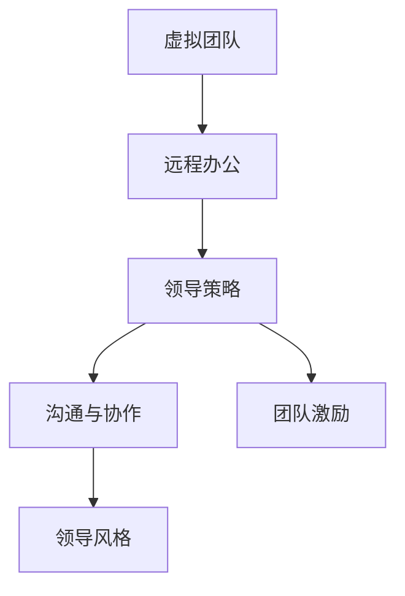

                 

### 文章标题

《虚拟团队协作：远程办公时代的领导策略》

### 文章关键词

- 虚拟团队
- 远程办公
- 领导策略
- 沟通工具
- 团队建设
- 项目管理

### 文章摘要

随着远程办公的普及，虚拟团队的协作变得愈发重要。本文将探讨虚拟团队协作的核心概念、远程办公的挑战，以及领导者在这一背景下应采取的策略。我们将详细分析领导风格、团队激励、沟通与协作工具，并提供具体的案例分析，旨在为远程办公时代下的领导者提供实用指南。

----------------------------------------------------------------

### 引言

#### 背景介绍

随着互联网技术的飞速发展，远程办公逐渐成为企业运营的一种新常态。虚拟团队，即由地理位置分散的成员组成的工作团队，应运而生。这些团队通过互联网进行沟通、协作，共同完成项目任务。远程办公的兴起不仅提高了工作效率，还为企业节省了办公空间和成本。然而，虚拟团队的协作并非一帆风顺，领导者需要面对诸多挑战，以确保团队目标的实现。

#### 虚拟团队的重要性

虚拟团队的重要性体现在以下几个方面：

1. **灵活性**：团队成员不受地理位置限制，可以根据需求灵活调整团队成员。
2. **多样性和创新**：虚拟团队可以汇集来自不同地区和背景的专业人才，促进创新思维的产生。
3. **成本效益**：远程办公减少了企业对物理办公空间的需求，降低了运营成本。
4. **提高员工满意度**：远程办公为员工提供了更加灵活的工作环境，提高了工作满意度。

#### 远程办公的挑战

尽管虚拟团队具有诸多优势，但远程办公也带来了新的挑战：

1. **沟通障碍**：由于地理位置的分散，团队成员之间的沟通变得复杂，容易产生误解。
2. **时间管理**：远程办公要求团队成员具备良好的时间管理能力，避免拖延和效率低下。
3. **激励与监督**：领导者难以直接监督团队成员的工作进度，激励团队成员保持高水平的动力。
4. **技术依赖**：虚拟团队依赖各种在线协作工具，技术故障可能导致团队协作受阻。

### 核心概念与联系

为了更好地理解虚拟团队协作，我们需要明确以下几个核心概念：

1. **虚拟团队**：由地理位置分散的成员组成的团队，通过互联网进行沟通和协作。
2. **远程办公**：一种工作模式，团队成员不在同一地点办公，主要依赖互联网进行工作。
3. **领导策略**：领导者为达成团队目标所采取的方法和措施，包括领导风格、团队激励、沟通与协作等。

下面是一个Mermaid流程图，展示了这些核心概念之间的关系：

### 虚拟团队的基础

#### 虚拟团队的定义

虚拟团队是指由不同地理位置的成员组成，通过互联网等通信技术进行协作的团队。虚拟团队通常具有以下特点：

1. **成员分散**：团队成员分布在不同的地理位置，可以是本地、国内或国际。
2. **远程沟通**：团队成员主要通过电子邮件、即时通讯、视频会议等在线工具进行沟通。
3. **任务分配**：根据团队成员的专业技能和项目需求，分配相应的任务。
4. **自主管理**：团队成员具有较高的自我管理能力，能够自主安排工作时间和进度。

#### 虚拟团队的组成

一个典型的虚拟团队通常包括以下角色：

1. **项目经理**：负责项目规划、进度控制、资源调配和团队协调。
2. **团队成员**：负责具体任务的执行，包括开发、测试、设计等。
3. **沟通协调员**：负责团队内部和外部沟通，确保信息的有效传递。
4. **技术支持人员**：负责解决技术问题和提供技术支持。

#### 虚拟团队的优势与挑战

虚拟团队的优势：

1. **灵活性**：团队成员不受地理位置限制，可以根据需求灵活调整。
2. **多样性和创新**：团队成员来自不同地区和背景，有助于激发创新思维。
3. **成本效益**：减少了企业对物理办公空间的需求，降低了运营成本。
4. **提高员工满意度**：远程办公为员工提供了更加灵活的工作环境，提高了工作满意度。

虚拟团队的挑战：

1. **沟通障碍**：由于地理位置的分散，团队成员之间的沟通变得复杂。
2. **时间管理**：远程办公要求团队成员具备良好的时间管理能力，避免拖延和效率低下。
3. **激励与监督**：领导者难以直接监督团队成员的工作进度，激励团队成员保持高水平的动力。
4. **技术依赖**：虚拟团队依赖各种在线协作工具，技术故障可能导致团队协作受阻。

### 远程办公的挑战

#### 沟通障碍

沟通障碍是远程办公面临的主要挑战之一。由于团队成员分布在不同的地理位置，沟通方式主要依赖于电子邮件、即时通讯、视频会议等在线工具。然而，这些工具在沟通效果上存在一定的局限性：

1. **信息传递延迟**：电子邮件和即时通讯可能会因为网络问题导致信息传递延迟，影响工作效率。
2. **非语言沟通的缺失**：视频会议虽然能够实现面对面沟通，但仍然无法完全替代面对面的交流，容易导致沟通误解。
3. **语言障碍**：跨文化团队中，语言差异可能导致沟通障碍，影响团队协作效果。

为了克服沟通障碍，领导者可以采取以下策略：

1. **明确沟通规范**：制定统一的沟通规范，确保团队成员了解沟通工具的使用方法和最佳实践。
2. **定期沟通会议**：定期组织团队沟通会议，确保团队成员能够及时交流进展和问题。
3. **采用多样化的沟通工具**：结合使用电子邮件、即时通讯、视频会议等多种沟通工具，提高沟通效果。

#### 时间管理

时间管理是远程办公的另一大挑战。团队成员需要在没有明确监督和约束的环境下，自我管理时间和任务。以下是一些有效的时间管理策略：

1. **制定工作计划**：在项目开始前，为每个团队成员制定详细的工作计划，明确任务目标和时间节点。
2. **使用时间管理工具**：利用时间管理工具，如番茄工作法、甘特图等，帮助团队成员合理分配时间。
3. **设立明确的截止日期**：为每个任务设定明确的截止日期，确保团队成员按时完成任务。
4. **定期回顾和调整**：定期回顾团队成员的工作进度，根据实际情况进行调整，确保项目按计划进行。

#### 激励与监督

激励与监督是远程办公中领导者面临的重要任务。由于团队成员分散，领导者难以直接监督工作进度，需要采取以下策略：

1. **设置明确的期望和目标**：为团队成员设置明确的期望和目标，确保他们了解自己的职责和任务。
2. **建立绩效评估机制**：建立定期绩效评估机制，对团队成员的工作成果进行评估，激励团队成员保持高水平的动力。
3. **提供反馈和指导**：定期提供团队成员工作反馈和指导，帮助他们改进工作方法和提高效率。
4. **利用在线协作工具**：利用在线协作工具，如任务管理软件、团队看板等，实时监控团队成员的工作进度。

### 领导策略

#### 领导风格

领导风格是领导者与团队成员互动的方式和态度。在远程办公环境中，领导者需要根据团队特点和项目需求，灵活调整领导风格。以下是一些适用于远程办公的领导风格：

1. **授权型领导**：领导者赋予团队成员更多的自主权，鼓励他们独立思考和解决问题。
2. **参与型领导**：领导者积极参与团队讨论和决策，确保团队成员的参与感和归属感。
3. **服务型领导**：领导者关注团队成员的需求，提供必要的支持和资源，帮助他们克服困难。

#### 团队激励

在远程办公环境中，领导者需要采取有效的激励措施，以保持团队成员的动力和积极性。以下是一些激励策略：

1. **认可和奖励**：定期对团队成员的工作成果进行认可和奖励，激励他们保持高水平的动力。
2. **目标设定**：与团队成员共同设定可实现的短期和长期目标，激发他们的工作热情。
3. **提供发展机会**：为团队成员提供职业发展机会，如培训、进修等，帮助他们提高自身能力。

#### 项目管理

在远程办公环境中，项目管理至关重要。领导者需要采取以下策略确保项目顺利进行：

1. **明确项目目标和范围**：在项目启动阶段，明确项目目标和范围，确保团队成员了解项目目标。
2. **制定详细的计划**：制定详细的项目计划，包括任务分配、时间节点和资源需求。
3. **监控项目进度**：利用在线协作工具，实时监控项目进度，及时发现和解决问题。
4. **沟通与协作**：确保团队成员之间的沟通畅通，及时解决项目中的问题和冲突。

### 虚拟团队的沟通与协作

#### 沟通工具与技术

有效的沟通是虚拟团队协作的基础。以下是一些常用的沟通工具和技术：

1. **电子邮件**：适用于正式沟通，可以记录和追溯信息。
2. **即时通讯**：适用于快速交流，如WhatsApp、Slack等。
3. **视频会议**：适用于面对面沟通，如Zoom、Microsoft Teams等。
4. **项目管理工具**：如Trello、Jira等，用于任务分配、进度追踪和协作。
5. **文档共享平台**：如Google Drive、OneDrive等，用于文件共享和协作。

#### 协作平台的选择

选择合适的协作平台对虚拟团队的协作至关重要。以下是一些选择协作平台的考虑因素：

1. **功能需求**：根据团队的工作需求，选择具有所需功能的协作平台。
2. **用户体验**：选择界面友好、易于使用的协作平台，提高团队成员的接受度。
3. **安全性**：确保协作平台具有足够的安全措施，保护团队成员的隐私和数据安全。
4. **集成性**：选择能够与其他工具和系统集成的协作平台，提高工作效率。

#### 跨文化沟通

在虚拟团队中，团队成员可能来自不同的国家和地区，具有不同的文化背景。跨文化沟通对团队协作至关重要。以下是一些跨文化沟通的建议：

1. **尊重差异**：尊重团队成员的文化差异，避免文化冲突。
2. **了解文化背景**：了解团队成员的文化背景，更好地理解他们的行为和沟通方式。
3. **有效沟通**：采用简洁、明确的沟通方式，减少误解和歧义。
4. **建立信任**：通过积极的沟通和合作，建立团队成员之间的信任。

### 虚拟团队的构建与维护

#### 团队构建

构建一个高效的虚拟团队需要考虑以下几个方面：

1. **人员招募**：根据项目需求和团队特点，招募具备相应技能和经验的团队成员。
2. **角色分配**：明确团队成员的角色和职责，确保每个角色都能发挥最大的价值。
3. **团队文化**：建立积极的团队文化，促进团队成员之间的合作和沟通。

#### 团队维护

团队维护是确保虚拟团队长期稳定发展的关键。以下是一些团队维护的策略：

1. **定期沟通**：定期组织团队沟通会议，确保团队成员之间的信息畅通。
2. **绩效评估**：建立定期绩效评估机制，对团队成员的工作成果进行评估，激励团队成员保持高水平的动力。
3. **团队建设活动**：组织线上或线下的团队建设活动，加强团队成员之间的联系和信任。
4. **持续改进**：根据团队的运行情况和反馈，不断改进团队管理和协作方式。

### 案例分析

#### 成功案例分析

以下是一个成功虚拟团队的案例分析：

**案例背景**：某科技公司的研发团队由来自国内外的10名成员组成，负责开发一款跨平台的应用程序。

**领导策略**：

1. **明确目标和期望**：在项目启动阶段，项目经理明确项目目标和期望，确保团队成员了解项目目标和自己的职责。
2. **灵活的领导风格**：项目经理采用参与型和服务型领导风格，鼓励团队成员积极参与项目讨论和决策，并提供必要的支持和资源。
3. **有效的沟通**：项目经理定期组织团队沟通会议，确保团队成员之间的信息畅通，并及时解决项目中的问题和冲突。

**结果**：该项目在预定时间内完成，应用程序获得了良好的市场反响。

#### 失败案例分析

以下是一个失败虚拟团队的案例分析：

**案例背景**：某互联网公司的产品团队由来自5个不同国家的成员组成，负责开发一款社交应用。

**失败原因**：

1. **沟通障碍**：由于团队成员来自不同的国家，语言和文化差异导致沟通效率低下，频繁产生误解和歧义。
2. **缺乏明确的期望和目标**：项目经理没有明确项目目标和期望，导致团队成员工作方向不明确，工作效率低下。
3. **缺乏有效的激励机制**：团队成员缺乏动力，工作积极性不高，导致项目进展缓慢。

**教训**：

1. **重视沟通**：在虚拟团队中，沟通至关重要。项目经理需要确保团队成员之间的信息畅通，并采取有效的沟通策略。
2. **明确目标和期望**：项目经理需要明确项目目标和期望，确保团队成员了解自己的职责和工作方向。
3. **建立激励机制**：为团队成员提供有效的激励机制，如奖励、晋升等，激励他们保持高水平的动力。

### 案例启示

通过以上案例分析，我们可以得出以下启示：

1. **沟通是关键**：在虚拟团队中，沟通是确保团队协作顺利进行的基石。项目经理需要采取有效的沟通策略，确保团队成员之间的信息畅通。
2. **明确目标和期望**：明确项目目标和期望，确保团队成员了解自己的职责和工作方向，有助于提高团队工作效率。
3. **建立激励机制**：为团队成员提供有效的激励机制，如奖励、晋升等，有助于提高团队的工作动力和积极性。
4. **重视团队建设**：通过团队建设活动，加强团队成员之间的联系和信任，有助于提高团队的凝聚力和协作效率。

### 结论

虚拟团队协作在远程办公时代具有重要意义。领导者需要采取有效的领导策略，确保虚拟团队的高效协作。通过分析虚拟团队的基础、远程办公的挑战、领导策略、沟通与协作工具，以及具体的案例分析，本文为远程办公时代下的领导者提供了实用的指南。未来，随着远程办公的普及，虚拟团队协作将继续发展，领导者需要不断学习和适应，以应对新的挑战。

### 进一步阅读

1. Gouma, O., Melin, L., Muhlan, F., & Chabot, H. (2017). Working together at a distance: Lessons learned from the PERICLES crisis management simulation. International Journal of Information Management, 37(5), 655-666.
2. Stedman, R., & O'Toole, M. (2016). The remote leader: Strategies for successful leadership in a dispersed environment. McGraw Hill.
3. Knott, M., & James, D. (2020). The virtual team advantage: How to master the art of leading remote talent. Business Expert Press.

### 附录

**A. 资源与工具**

1. Trello (https://trello.com/)
2. Slack (https://slack.com/)
3. Zoom (https://zoom.us/)
4. Google Drive (https://drive.google.com/)
5. Jira (https://www.atlassian.com/software/jira)

**B. 参考文献**

1. Gouma, O., Melin, L., Muhlan, F., & Chabot, H. (2017). Working together at a distance: Lessons learned from the PERICLES crisis management simulation. International Journal of Information Management, 37(5), 655-666.
2. Stedman, R., & O'Toole, M. (2016). The remote leader: Strategies for successful leadership in a dispersed environment. McGraw Hill.
3. Knott, M., & James, D. (2020). The virtual team advantage: How to master the art of leading remote talent. Business Expert Press.

