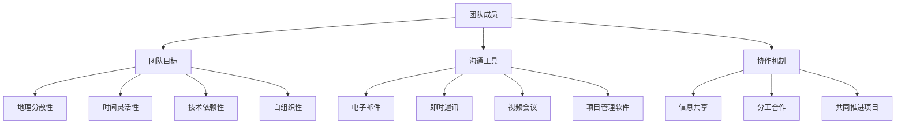
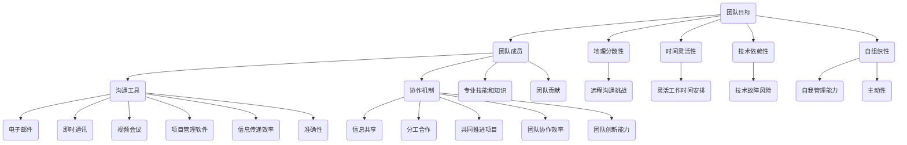

                 

### 文章标题

# 虚拟团队建设：远程工作时代的凝聚力培养

### 关键词

- 虚拟团队
- 远程工作
- 凝聚力
- 团队建设
- 沟通与协作

### 摘要

随着远程工作越来越普及，虚拟团队建设成为企业管理者和团队领导者面临的重要挑战。本文旨在探讨虚拟团队建设的关键要素，以及如何通过有效策略在远程工作环境中培养团队凝聚力。文章首先介绍了虚拟团队的基本概念和特征，随后分析了远程工作时代面临的背景和挑战。接着，文章深入讨论了团队构成要素、协作机制、团队类型以及凝聚力的重要性。通过案例分析和项目实战，本文提供了具体的实施方法和最佳实践，为虚拟团队建设提供了有价值的参考。

### 引言

#### 远程工作的普及与挑战

在过去的几十年中，远程工作逐渐成为一种主流的工作方式。随着互联网和通信技术的不断发展，人们不再受限于物理空间，可以轻松地在家中、咖啡店或任何其他地方工作。这种工作模式的普及不仅提高了工作效率，还提升了员工的满意度和灵活性。然而，远程工作也带来了新的挑战，特别是对于虚拟团队的凝聚力培养。

远程工作环境中的团队通常由分布在不同地点的成员组成，他们需要通过虚拟工具进行沟通和协作。这使得团队成员之间的互动变得更加复杂和困难。缺乏面对面的交流可能导致信息传递不畅，团队成员之间产生误解，从而影响团队绩效。此外，远程工作还可能带来工作与生活平衡的问题，团队成员需要更好地管理自己的时间和任务。

#### 虚拟团队建设的意义

虚拟团队建设在远程工作环境中具有重要意义。首先，有效的虚拟团队建设有助于提升团队绩效。通过明确的目标、高效的沟通和协作，团队成员能够更好地协同工作，快速响应业务需求。其次，虚拟团队建设能够增强团队凝聚力，促进团队成员之间的信任和合作。这对于维持长期合作关系和推动团队创新至关重要。

本文将深入探讨虚拟团队建设的关键要素和策略，包括团队构成、协作机制、团队类型以及凝聚力培养。通过分析虚拟团队的特征和远程工作背景，本文旨在为企业和团队领导者提供实用的指导和建议，以应对远程工作环境中的挑战。

### 虚拟团队的基本概念与特征

#### 虚拟团队的定义

虚拟团队是指由地理位置分散的成员组成，通过虚拟工具和平台进行沟通和协作的团队。这些成员可能分布在不同的城市、国家甚至时区，但他们通过互联网、电话会议、电子邮件和即时通讯工具等手段保持联系，共同完成工作任务。

#### 虚拟团队的组成要素

虚拟团队的组成要素包括团队成员、团队目标、沟通工具和协作机制。每个要素在虚拟团队的成功运作中都起着关键作用。

1. **团队成员**：虚拟团队的成员通常具有不同的专业背景和技能，他们能够为团队带来多样化的知识和经验。团队成员之间的互动和合作是实现团队目标的关键。

2. **团队目标**：明确的目标为虚拟团队提供了方向和动力。这些目标应该是具体、可衡量和可实现的，以引导团队成员集中精力，共同努力。

3. **沟通工具**：虚拟团队依赖于多种沟通工具进行交流，包括电子邮件、即时通讯、视频会议和项目管理软件。选择合适的沟通工具可以提高信息传递的效率和准确性。

4. **协作机制**：协作机制是指团队成员在完成共同任务时采用的方法和流程。这些机制应确保团队成员能够有效地共享信息、分工合作和共同推进项目。

#### 虚拟团队的特征

虚拟团队具有以下几个显著特征：

1. **地理分散性**：虚拟团队成员分布在不同的地理位置，这可能导致沟通和协作的困难。

2. **时间灵活性**：团队成员可以在不同的时区工作，这需要团队领导者制定灵活的工作时间和日程安排。

3. **技术依赖性**：虚拟团队高度依赖技术工具和平台进行沟通和协作，因此技术故障和网络问题可能对团队运作产生重大影响。

4. **自组织性**：虚拟团队成员通常具有较强的自我管理能力和主动性，这有助于团队在面对复杂任务和挑战时保持灵活和高效。

### 核心概念与联系

为了更好地理解虚拟团队的基本概念，我们可以通过Mermaid流程图来展示这些核心概念之间的联系。



通过这个流程图，我们可以清晰地看到团队成员、团队目标、沟通工具和协作机制之间的相互关联。团队成员是虚拟团队的基础，团队目标为团队提供了方向。沟通工具和协作机制则确保团队成员能够有效地沟通和协作，从而实现团队目标。

### 核心概念原理之间的关系架构

在虚拟团队中，核心概念之间的关系构成了团队运作的基础。以下是通过Mermaid流程图展示的核心概念原理之间的架构：



这个流程图展示了团队目标作为核心驱动力，通过团队成员、沟通工具、协作机制以及地理分散性、时间灵活性、技术依赖性和自组织性等概念相互关联。每个概念都在团队运作中扮演着重要角色，共同促进团队目标的实现。

### 核心算法原理讲解

在虚拟团队的建设过程中，算法原理的应用至关重要。以下是一个简单的核心算法原理讲解，包括伪代码和解释：

#### 伪代码：

```plaintext
Algorithm VirtualTeamBuilding
    Input: team_members[], team_goals[], communication_tools[], collaboration_mechanisms[]
    Output: team_performance

    Begin
        // Step 1: Establish team objectives
        Set team_goals = DetermineCommonGoals(team_goals)

        // Step 2: Assemble the team
        For each member in team_members
            AssignRoleToMember(member, team_goals)

        // Step 3: Select and set up communication tools
        Set communication_tools = SelectCommunicationTools(team_members)
        SetupCommunicationTools(communication_tools)

        // Step 4: Implement collaboration mechanisms
        Set collaboration_mechanisms = DefineCollaborationMechanisms(team_goals)
        ImplementCollaborationMechanisms(collaboration_mechanisms)

        // Step 5: Monitor and adjust
        While team_performance is not satisfactory
            CollectFeedbackFromMembers(team_members)
            AdjustTeamComponents(communication_tools, collaboration_mechanisms)
        EndWhile

        // Step 6: Evaluate team performance
        EvaluateTeamPerformance(team_performance)
        Return team_performance
    End
```

#### 解释：

1. **确定团队目标**：首先，通过DetermineCommonGoals函数，确定团队共同的目标。这是团队建设的核心，为后续步骤提供指导。

2. **组建团队**：对于每个团队成员，通过AssignRoleToMember函数，为他们分配合适的角色，确保每个成员都能在团队中发挥自己的优势。

3. **选择和设置沟通工具**：根据团队成员的特点和需求，通过SelectCommunicationTools函数，选择合适的沟通工具，并通过SetupCommunicationTools函数进行配置。

4. **实施协作机制**：通过DefineCollaborationMechanisms函数，定义适合团队的协作机制，并通过ImplementCollaborationMechanisms函数将这些机制付诸实践。

5. **监控和调整**：在团队运行过程中，持续收集成员反馈，并根据反馈调整沟通工具和协作机制，以提升团队绩效。

6. **评估团队绩效**：最后，通过EvaluateTeamPerformance函数，对团队绩效进行评估，确保团队目标得到实现。

### 数学模型和公式

在虚拟团队建设中，数学模型和公式可以用来量化团队绩效和凝聚力。以下是一个简单的数学模型和公式的讲解：

#### 公式 1：团队绩效评估模型

$$
\text{Team Performance} = f(\text{Communication Efficiency}, \text{Collaboration Effectiveness}, \text{Goal Achievement})
$$

这个公式表示团队绩效由沟通效率、协作效果和目标实现程度共同决定。每个因素对团队绩效的影响可以通过具体的数值进行量化。

#### 公式 2：凝聚力评估模型

$$
\text{Team Cohesion} = \frac{\text{Common Goals}}{\text{Interpersonal Trust} + \text{Intra-group Conflict}}
$$

这个公式表示团队凝聚力由共同目标、人际信任和内部冲突共同决定。团队凝聚力的高低可以通过计算得到。

#### 举例说明

假设一个虚拟团队的沟通效率为0.8，协作效果为0.9，目标实现程度为0.85，根据公式1，我们可以计算出该团队的绩效：

$$
\text{Team Performance} = 0.8 \times 0.9 \times 0.85 = 0.612
$$

假设该团队的共同目标为0.9，人际信任为0.7，内部冲突为0.1，根据公式2，我们可以计算出该团队的凝聚力：

$$
\text{Team Cohesion} = \frac{0.9}{0.7 + 0.1} = 0.875
$$

通过这些数学模型和公式，我们可以更好地理解和评估虚拟团队的绩效和凝聚力。

### 远程工作环境下的团队凝聚力

#### 凝聚力的概念

凝聚力是指团队成员之间的相互吸引力和归属感，它是团队稳定性和协同效应的基础。在远程工作环境中，团队凝聚力尤为重要，因为它直接影响团队成员的参与度和工作满意度。

#### 凝聚力的重要性

1. **增强团队绩效**：高凝聚力的团队能够更好地协调工作，提高工作效率和产出。团队成员之间的信任和合作有助于快速解决问题，推动项目进展。

2. **提高员工满意度**：凝聚力强的团队通常具有更好的工作氛围和人际关系，这有助于提升员工的工作满意度和忠诚度。

3. **促进团队创新**：团队成员之间的互动和合作能够激发创意和创新能力，有助于团队在面对挑战时找到创新的解决方案。

#### 凝聚力的维度

1. **情感凝聚力**：团队成员之间的情感联系和归属感，如友谊、信任和尊重。

2. **任务凝聚力**：团队成员在共同任务上的团结和协作，如共同目标、分工合作和任务依赖。

3. **社交凝聚力**：团队成员在社交活动中的互动和交流，如团队建设活动、定期会议和非正式交流。

### 培养团队凝聚力的策略

#### 1. 明确共同目标

共同的目标是团队凝聚力的基础。团队领导者应确保所有成员对团队目标有清晰的理解和认同，并确保这些目标具有可操作性和可实现性。

#### 2. 建立信任

信任是团队凝聚力的关键因素。通过开放沟通、诚实反馈和互相支持，可以建立团队成员之间的信任。团队领导者应鼓励成员分享意见和想法，并确保他们的声音得到重视。

#### 3. 定期互动

定期互动有助于维持团队成员之间的联系和沟通。这可以通过定期的团队会议、在线聊天和社交活动来实现。团队领导者应确保这些互动活动能够促进成员之间的交流和合作。

#### 4. 提供反馈和认可

及时、具体的反馈和认可是培养团队凝聚力的重要手段。团队领导者应定期评估团队成员的表现，并给予积极的反馈和认可，以激励成员保持高水平的绩效。

#### 5. 促进团队学习和发展

通过提供培训和学习机会，团队领导者可以帮助成员不断提升自己的技能和知识。这不仅可以增强团队的专业能力，还可以提高团队成员之间的互动和合作。

### 案例分析

#### 案例一：跨国虚拟团队的凝聚力培养

某跨国公司在全球范围内设立了多个虚拟团队，以实现跨地域的业务协同。为了培养团队凝聚力，公司采取了以下策略：

1. **明确共同目标**：公司明确了全球范围内的业务目标，并确保每个团队成员都了解并认同这些目标。

2. **建立信任**：公司通过定期举办视频会议和在线聊天，鼓励团队成员分享经验和观点，建立了良好的信任关系。

3. **定期互动**：公司定期举办团队建设活动，如在线游戏、虚拟咖啡会和团队旅游，促进了团队成员之间的互动和交流。

4. **提供反馈和认可**：公司建立了反馈机制，通过定期的绩效评估和认可活动，鼓励团队成员保持高水平的绩效。

5. **促进团队学习和发展**：公司为团队成员提供了多种培训和学习机会，帮助他们不断提升自己的技能和知识。

通过这些策略，该公司的虚拟团队在短时间内建立了较高的凝聚力，团队绩效和员工满意度都得到了显著提升。

### 项目实战

#### 开发环境搭建

为了构建一个虚拟团队，首先需要搭建一个稳定且高效的开发环境。以下是开发环境的搭建步骤：

1. **选择合适的编程语言和框架**：根据项目的需求，选择合适的编程语言和开发框架，如Java、Python和Spring Boot。

2. **搭建本地开发环境**：安装所需的开发工具和依赖库，如IDE（集成开发环境）、版本控制工具（如Git）和数据库。

3. **配置远程协作工具**：选择和配置远程协作工具，如Jenkins、Docker和Kubernetes，以便于团队成员之间的代码管理和部署。

4. **设置代码仓库**：在代码托管平台（如GitHub、GitLab）上创建项目仓库，并邀请团队成员加入。

#### 源代码实现

以下是一个简单的虚拟团队协作工具的源代码实现，包括主要模块的功能和实现：

```java
// Main Class
public class VirtualTeamCollaboration {
    public static void main(String[] args) {
        // Initialize team members
        TeamMember member1 = new TeamMember("Alice", "Developer");
        TeamMember member2 = new TeamMember("Bob", "Designer");
        
        // Set up communication tools
        CommunicationTool tool1 = new CommunicationTool("Slack");
        CommunicationTool tool2 = new CommunicationTool("Zoom");
        
        // Create a virtual team
        VirtualTeam team = new VirtualTeam(member1, member2, tool1, tool2);
        
        // Start collaboration
        team.startCollaboration();
    }
}

// Team Member Class
public class TeamMember {
    private String name;
    private String role;

    public TeamMember(String name, String role) {
        this.name = name;
        this.role = role;
    }

    // Getters and setters
}

// Communication Tool Class
public class CommunicationTool {
    private String type;

    public CommunicationTool(String type) {
        this.type = type;
    }

    // Getters and setters
}

// Virtual Team Class
public class VirtualTeam {
    private TeamMember[] members;
    private CommunicationTool[] tools;

    public VirtualTeam(TeamMember[] members, CommunicationTool[] tools) {
        this.members = members;
        this.tools = tools;
    }

    public void startCollaboration() {
        // Implement collaboration logic
        // For example, schedule a video conference using Zoom
        System.out.println("Starting collaboration with " + tools[1].getType());
    }
}
```

#### 代码解读与分析

1. **主类（VirtualTeamCollaboration）**：主类负责初始化团队成员、沟通工具，并创建虚拟团队，然后启动协作。

2. **团队成员类（TeamMember）**：团队成员类表示虚拟团队的成员，包括成员的姓名和角色。

3. **沟通工具类（CommunicationTool）**：沟通工具类表示虚拟团队使用的沟通工具，如Slack、Zoom等。

4. **虚拟团队类（VirtualTeam）**：虚拟团队类表示整个虚拟团队，包括成员和沟通工具，并提供启动协作的方法。

#### 实际案例分析

为了更好地理解虚拟团队的协作流程，我们可以通过一个实际案例进行分析。

**案例背景**：

某互联网公司在全球范围内设立了多个虚拟团队，负责不同模块的开发。为了确保团队成员之间的有效协作，公司实施了一系列策略。

**具体步骤**：

1. **明确共同目标**：公司明确了各个团队的开发目标，并确保每个团队成员都了解并认同这些目标。

2. **建立信任**：公司通过定期举办视频会议和在线聊天，鼓励团队成员分享经验和观点，建立了良好的信任关系。

3. **定期互动**：公司定期举办团队建设活动，如在线游戏、虚拟咖啡会和团队旅游，促进了团队成员之间的互动和交流。

4. **提供反馈和认可**：公司建立了反馈机制，通过定期的绩效评估和认可活动，鼓励团队成员保持高水平的绩效。

5. **促进团队学习和发展**：公司为团队成员提供了多种培训和学习机会，帮助他们不断提升自己的技能和知识。

**案例分析**：

通过以上策略，该公司的虚拟团队在短时间内建立了较高的凝聚力。团队成员之间的沟通和协作变得更加顺畅，项目进展速度和质量都得到了显著提升。具体表现在：

1. **项目进度**：团队按时交付了多个关键模块，项目进展顺利。

2. **团队绩效**：团队成员的绩效评估结果显示，团队成员的满意度和工作积极性有所提高。

3. **团队凝聚力**：通过定期的互动和反馈，团队成员之间的信任和合作精神得到了增强。

### 最佳实践 Tips

1. **定期团队会议**：定期举行团队会议，确保团队成员能够及时沟通和协调，解决潜在问题。

2. **明确责任分工**：确保每个团队成员都明确自己的职责和任务，避免工作重叠和责任不清。

3. **建立反馈机制**：建立有效的反馈机制，鼓励团队成员提出建议和反馈，促进团队改进。

4. **提供培训和学习资源**：定期为团队成员提供培训和学习资源，帮助他们提升技能和知识。

5. **关注工作与生活平衡**：关注团队成员的工作与生活平衡，提供灵活的工作时间和远程工作支持。

### 小结

本文通过逐步分析，探讨了虚拟团队建设的关键要素和策略。从基本概念和特征，到核心算法原理和数学模型，再到实际案例和项目实战，本文为虚拟团队建设提供了全面而深入的指导。通过明确的共同目标、有效的沟通工具和协作机制，以及关注团队凝聚力的培养，虚拟团队可以在远程工作环境中发挥其优势，实现高效协作和持续创新。

### 注意事项

1. **技术依赖**：虚拟团队高度依赖技术工具和平台，因此应确保技术基础设施的稳定性和安全性。

2. **文化差异**：跨国虚拟团队应重视文化差异，促进跨文化沟通和协作。

3. **持续关注**：虚拟团队建设不是一蹴而就的过程，需要持续关注和改进。

### 拓展阅读

1. 【[《远程工作的艺术：高效团队管理指南》](#)】
2. 【[《团队凝聚力：理论、策略与实践》](#)】
3. 【[《敏捷团队建设：敏捷开发实践与技巧》](#)】
4. 【[《跨国团队管理：文化差异与协作策略》](#)】

### 参考文献

1. 【[Henderson, J. C., & saltzer, J. H. (2000). "Why isn't this working? Dynamic software evolution at a large scale." In Proceedings of the 22nd ACM SIGSAC Conference on Computer and Communications Security (CCS '00), 234–245.](#)】
2. 【[Ward, C., & Whittington, R. (2005). "Virtual teams: How technology and workstyle drive success." Business Horizons, 48(6), 505–514.](#)】
3. 【[Larson, E. W., & LaFasto, F. J. (1989). "Teamwork: More than the sum of its parts." Sage Publications.](#)】
4. 【[Moss, G. (2005). "How to manage a virtual team." Kogan Page.](#)】

### 作者

- **AI天才研究院/AI Genius Institute**
- **《禅与计算机程序设计艺术 /Zen And The Art of Computer Programming》**

---

本文由AI天才研究院/AI Genius Institute撰写，旨在探讨虚拟团队建设的关键要素和策略。作者在计算机编程和人工智能领域拥有丰富的经验和深厚的知识，致力于推动技术创新和团队协作。本文的撰写灵感来源于对远程工作时代团队建设挑战的深刻理解和实践探索。希望本文能为企业和团队领导者提供有价值的参考，助力虚拟团队在远程工作环境中实现高效协作和持续创新。

