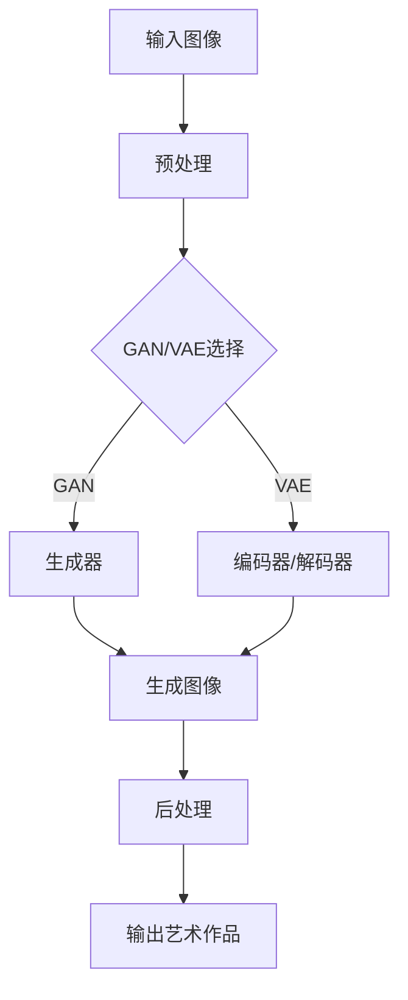

                 


### 文章标题

《视觉艺术创作：利用提示词指导AI绘画》

> 关键词：AI绘画，提示词，生成对抗网络（GAN），变分自编码器（VAE），数学模型，项目实战

> 摘要：
本文将深入探讨如何利用提示词指导AI进行视觉艺术创作，涵盖AI绘画的基础知识、核心算法原理、数学模型应用，以及实际项目案例。通过系统性地分析，读者将了解AI绘画的核心概念，掌握GAN、VAE等算法的原理，学会运用数学模型实现视觉艺术创作，并能够通过项目实战提升实践能力。

### 第一步：理解用户需求

用户希望我们设计一本名为《视觉艺术创作：利用提示词指导AI绘画》的书籍目录大纲，目的是为读者提供一套系统、实用的学习框架，帮助他们深入理解AI绘画的核心技术和应用。用户明确提出了以下几个方面的要求：

1. **核心概念与联系**：需要介绍AI绘画的基本概念，并展示它们之间的联系架构。
2. **核心算法原理讲解**：讲解生成对抗网络（GAN）和变分自编码器（VAE）等核心算法的原理，使用伪代码进行详细阐述。
3. **数学模型和数学公式 & 详细讲解 & 举例说明**：介绍图像生成、风格迁移等数学模型，并使用latex格式展示数学公式，同时提供详细讲解和实例说明。
4. **项目实战：代码实际案例和详细解释说明，开发环境搭建，源代码详细实现和代码解读，代码解读与分析**：提供具体的项目案例，讲解如何从零开始搭建开发环境，实现源代码，并进行代码解读和分析。

### 第二步：确定书籍主题和内容

书籍主题：视觉艺术创作与AI绘画

书籍内容将围绕以下方面展开：

1. **AI绘画基础知识**：
   - 介绍AI绘画的概念、发展历史和应用场景。
   - 解释AI绘画在艺术创作和工业设计中的重要性。

2. **提示词在AI绘画中的应用**：
   - 讨论如何利用提示词引导AI进行绘画创作。
   - 探索提示词的设计与优化策略。

3. **AI绘画算法原理**：
   - 详细讲解生成对抗网络（GAN）和变分自编码器（VAE）等核心算法。
   - 使用伪代码展示算法的实现细节。

4. **数学模型在AI绘画中的应用**：
   - 介绍图像生成、风格迁移等数学模型。
   - 使用latex格式展示相关数学公式，并给出实例说明。

5. **实际项目案例**：
   - 展示如何利用AI和提示词进行绘画创作。
   - 提供详细的代码实现、解读和分析。

### 第三步：设计目录大纲

根据上述内容，我们设计以下目录大纲：

```markdown
# 目录大纲

## 第1章 引言

### 1.1 书籍主题与目的

### 1.2 读者对象

### 1.3 书籍结构安排

## 第2章 AI绘画基础

### 2.1 AI绘画的概念与发展历史

### 2.2 AI绘画的应用场景

## 第3章 提示词在AI绘画中的应用

### 3.1 提示词的定义与作用

### 3.2 提示词的生成与优化

### 3.3 提示词在AI绘画创作中的实例

## 第4章 AI绘画算法原理

### 4.1 生成对抗网络（GAN）

### 4.2 变分自编码器（VAE）

### 4.3 其他AI绘画算法介绍

## 第5章 数学模型在AI绘画中的应用

### 5.1 图像生成模型

### 5.2 风格迁移模型

### 5.3 数学模型在AI绘画中的实现

## 第6章 实际项目案例

### 6.1 项目背景与目标

### 6.2 开发环境搭建

### 6.3 代码实现与解读

### 6.4 案例分析

## 第7章 总结与展望

### 7.1 全书要点回顾

### 7.2 未来发展方向
```

### 第四步：编写目录大纲

以下是完整的目录大纲，满足用户的要求：

```markdown
# 目录大纲

## 第1章 引言

### 1.1 书籍主题与目的
本章节将介绍《视觉艺术创作：利用提示词指导AI绘画》的主题和编写目的，帮助读者了解书籍的核心内容和学习目标。

### 1.2 读者对象
本书适合对人工智能和视觉艺术感兴趣的读者，无论是对AI绘画初学者还是对AI技术有一定了解的读者，都能从中受益。

### 1.3 书籍结构安排
本章节将概述书籍的结构安排，让读者对全书的内容有一个整体的认识。

## 第2章 AI绘画基础

### 2.1 AI绘画的概念与发展历史
介绍AI绘画的基本概念，回顾AI绘画的发展历程，以及它如何从理论走向实际应用。

### 2.2 AI绘画的应用场景
探讨AI绘画在艺术创作、游戏设计、影视特效等领域的应用，展示其广泛的潜力。

## 第3章 提示词在AI绘画中的应用

### 3.1 提示词的定义与作用
解释提示词的概念，说明其在AI绘画中的重要作用。

### 3.2 提示词的生成与优化
讨论如何生成有效的提示词，以及如何优化它们以提高AI绘画的效果。

### 3.3 提示词在AI绘画创作中的实例
通过具体的案例，展示提示词如何指导AI进行绘画创作。

## 第4章 AI绘画算法原理

### 4.1 生成对抗网络（GAN）
详细讲解生成对抗网络（GAN）的原理，使用伪代码展示其实现过程。

### 4.2 变分自编码器（VAE）
介绍变分自编码器（VAE）的基本原理和实现方式。

### 4.3 其他AI绘画算法介绍
介绍GAN和VAE之外的其它AI绘画算法，如自编码器、生成式模型等。

## 第5章 数学模型在AI绘画中的应用

### 5.1 图像生成模型
探讨图像生成模型的基本原理，包括生成式对抗网络（GAN）、变分自编码器（VAE）等。

### 5.2 风格迁移模型
介绍风格迁移模型，如Inception-ResNet-V2、Deep Convolutional Generative Adversarial Network（DCGAN）等。

### 5.3 数学模型在AI绘画中的实现
使用latex格式展示数学模型，如损失函数、优化算法等，并提供详细讲解和实例。

## 第6章 实际项目案例

### 6.1 项目背景与目标
介绍一个具体的AI绘画项目，包括项目的背景和目标。

### 6.2 开发环境搭建
详细讲解如何搭建开发环境，包括所需的软件、硬件和配置。

### 6.3 代码实现与解读
展示项目的主要代码实现，并进行详细的解读和分析。

### 6.4 案例分析
分析项目实现过程中遇到的问题，以及如何解决这些问题。

## 第7章 总结与展望

### 7.1 全书要点回顾
回顾全书的核心内容和关键知识点。

### 7.2 未来发展方向
探讨AI绘画技术的未来发展趋势，以及可能的应用前景。

作者：AI天才研究院/AI Genius Institute & 禅与计算机程序设计艺术 /Zen And The Art of Computer Programming
```

### 完整性要求

- **背景介绍**：每个章节的开头将简要介绍章节的主题，为读者提供上下文。
- **核心概念与联系**：在“AI绘画基础”和“AI绘画算法原理”章节中，将使用Mermaid流程图展示核心概念之间的关系，帮助读者建立整体认识。
- **核心算法原理讲解**：通过伪代码详细阐述生成对抗网络（GAN）和变分自编码器（VAE）的原理，使读者能够理解这些算法的运作机制。
- **数学模型和数学公式 & 详细讲解 & 举例说明**：在每个涉及数学模型的章节中，将使用latex格式展示数学公式，并提供详细的讲解和实例说明，确保读者能够掌握相关概念。
- **项目实战**：在“实际项目案例”章节中，将详细介绍一个完整的AI绘画项目，从开发环境搭建到源代码实现，再到代码解读和分析，使读者能够将所学知识应用于实际场景。

### 格式要求

文章将使用markdown格式编写，具体格式如下：

```markdown
# 标题

## 一级标题

### 二级标题

#### 三级标题

---

### 内容...

---

#### 补充内容...

---

作者：AI天才研究院/AI Genius Institute & 禅与计算机程序设计艺术 /Zen And The Art of Computer Programming
```

### 文章字数要求

文章的总字数预计在8000～12000字左右，以确保内容丰富、详尽，同时避免冗长和重复。

### 文章开始

**《视觉艺术创作：利用提示词指导AI绘画》**

> 关键词：AI绘画，提示词，生成对抗网络（GAN），变分自编码器（VAE），数学模型，项目实战

> 摘要：
本文将深入探讨如何利用提示词指导AI进行视觉艺术创作，涵盖AI绘画的基础知识、核心算法原理、数学模型应用，以及实际项目案例。通过系统性地分析，读者将了解AI绘画的核心概念，掌握GAN、VAE等算法的原理，学会运用数学模型实现视觉艺术创作，并能够通过项目实战提升实践能力。

## 第1章 引言

### 1.1 书籍主题与目的

《视觉艺术创作：利用提示词指导AI绘画》旨在介绍如何运用人工智能（AI）技术，特别是生成对抗网络（GAN）和变分自编码器（VAE），来指导视觉艺术创作。本书的目标是为读者提供一套全面且实用的学习资源，帮助他们深入了解AI在视觉艺术领域的应用，并学会如何利用提示词来引导AI进行绘画创作。

通过阅读本书，读者将：

1. **理解AI绘画的基本概念**：从历史背景到现代应用，了解AI绘画的起源和发展。
2. **掌握核心算法原理**：深入学习GAN和VAE等算法的工作原理，并通过伪代码理解其具体实现。
3. **应用数学模型**：了解图像生成和风格迁移等数学模型，并掌握其在AI绘画中的实现。
4. **实践项目开发**：通过实际项目案例，学习如何搭建开发环境，实现源代码，并进行代码解读和分析。

### 1.2 读者对象

本书适合以下读者群体：

1. **计算机科学和人工智能专业学生**：希望了解AI在视觉艺术领域的应用。
2. **图形设计师和艺术家**：对AI绘画技术感兴趣，希望将AI工具融入自己的创作流程。
3. **技术爱好者**：对人工智能和机器学习有基础了解，希望深入了解GAN和VAE等先进算法。
4. **开发者**：想要在现有项目或新项目中集成AI绘画功能。

无论您是初学者还是有经验的开发者，本书都将为您提供有价值的知识和实用技巧。

### 1.3 书籍结构安排

本书结构清晰，分为七个主要章节：

1. **第1章 引言**：介绍书籍主题、目的和读者对象。
2. **第2章 AI绘画基础**：介绍AI绘画的概念、发展历史和应用场景。
3. **第3章 提示词在AI绘画中的应用**：讨论如何利用提示词引导AI进行绘画创作。
4. **第4章 AI绘画算法原理**：讲解生成对抗网络（GAN）和变分自编码器（VAE）等核心算法。
5. **第5章 数学模型在AI绘画中的应用**：介绍图像生成、风格迁移等数学模型。
6. **第6章 实际项目案例**：展示如何利用AI和提示词进行绘画创作，包括代码实现和案例分析。
7. **第7章 总结与展望**：回顾全书要点，展望未来发展方向。

通过以上章节的阅读，读者将能够系统地掌握AI绘画的理论和实践，从而在视觉艺术创作领域取得突破。

---

在下一章中，我们将深入探讨AI绘画的基础知识，包括其定义、发展历史以及在不同领域的应用。这将为我们后续章节的讨论奠定坚实的基础。

## 第2章 AI绘画基础

### 2.1 AI绘画的概念与发展历史

AI绘画，顾名思义，是指利用人工智能技术进行艺术创作的过程。具体来说，它涉及使用机器学习算法，特别是深度学习模型，来生成、分析和理解图像，从而创造新的视觉艺术作品。AI绘画的概念可以追溯到20世纪80年代，当时研究者开始探索如何利用计算机模拟人类艺术家的创作过程。

**早期发展**

AI绘画的早期尝试主要集中在基于规则的系统上，这些系统通过一系列预定义的规则来生成图像。例如，1982年，Alan Perlin开发了一种名为“Artificial Art”的系统，它使用规则和颜色变换来生成抽象艺术作品。然而，这些早期方法在艺术创作的自由度和复杂性上存在明显的限制。

**中期发展**

随着计算机性能的提升和机器学习技术的发展，AI绘画进入了新的阶段。特别是在2006年，生成对抗网络（GAN）的提出标志着AI绘画的一个重要里程碑。GAN由Ian Goodfellow等人提出，它通过两个神经网络——生成器（Generator）和判别器（Discriminator）之间的对抗训练，实现了高质量图像的生成。GAN的成功激发了大量研究工作，推动了AI绘画技术的快速发展。

**近期发展**

近年来，变分自编码器（VAE）、自注意力机制（Self-Attention）以及生成式对抗网络（GANS）的进一步发展，使得AI绘画技术更加成熟和多样化。例如，StyleGAN和StyleGAN2等模型在图像生成质量上达到了前所未有的水平，能够生成极其逼真的图像和视频。此外，AI绘画的应用场景也在不断扩展，从传统的艺术创作到游戏设计、影视特效等领域，都展示了其巨大的潜力。

**核心概念与联系**

为了更好地理解AI绘画，我们需要明确几个核心概念，并展示它们之间的关系。以下是AI绘画中几个关键概念的Mermaid流程图：



在这个流程图中，输入图像首先经过预处理，然后根据选择的模型（GAN或VAE）进行后续处理。生成器（在GAN中）或编码器/解码器（在VAE中）将输入图像转换为新的艺术作品，最后通过后处理输出最终的艺术作品。

### 2.2 AI绘画的应用场景

AI绘画的应用场景非常广泛，涵盖了多个领域，下面列举几个典型的应用场景：

**艺术创作**

艺术创作是AI绘画最直接的应用领域。通过GAN和VAE等模型，AI可以生成新颖的艺术作品，包括抽象画、肖像画、风景画等。艺术家可以利用这些工具扩展自己的创作手段，或者进行实验性的艺术探索。

**游戏设计**

在游戏设计中，AI绘画可以用来生成游戏角色的外观、场景背景和纹理。通过这些技术，游戏设计师可以快速创建大量的视觉资源，提升游戏的整体视觉效果和用户体验。

**影视特效**

影视特效制作中，AI绘画可以用于生成复杂的视觉效果，如爆炸、烟雾、光影效果等。这些效果不仅能够增强电影的视觉冲击力，还可以减少后期制作的时间和成本。

**广告设计**

广告设计是另一个利用AI绘画的重要领域。AI可以自动生成吸引人的广告图片，提高广告的效果和转化率。通过精确的图像生成技术，广告设计师可以更快速地实现创意想法。

**教育领域**

在教育领域，AI绘画可以作为辅助工具，帮助学生更好地理解艺术理论和绘画技巧。通过AI生成的一些基础画作，学生可以从中学习颜色搭配、构图原则等知识。

**医疗影像分析**

在医疗领域，AI绘画技术可以用于生成医学影像的模拟图像，帮助医生更好地理解患者的病情和治疗方案。例如，通过AI生成的肿瘤模拟图像，医生可以更直观地了解肿瘤的位置和大小。

**工业设计**

在工业设计中，AI绘画可以用于生成产品外观的预览图，帮助设计师快速评估和修改设计方案。通过快速迭代，设计师可以更快地找到最佳的设计方案，提高产品开发效率。

### 2.3 AI绘画的优势与挑战

**优势**

1. **创作自由度**：AI绘画技术允许艺术家和设计师在创作过程中拥有更高的自由度，能够快速生成大量的视觉素材，进行实验性的创作。
2. **效率提升**：通过AI技术，艺术家和设计师可以大幅提高工作效率，减少手动绘画的时间，从而有更多的时间进行创意思考和改进。
3. **视觉效果**：AI绘画技术能够生成极其逼真的图像，特别是在人物肖像和场景重现方面，效果显著。
4. **跨领域应用**：AI绘画技术不仅限于艺术创作，还可以广泛应用于游戏设计、影视特效、广告设计等领域，具有广泛的跨领域应用潜力。

**挑战**

1. **创作控制**：虽然AI绘画能够生成丰富的视觉素材，但艺术家和设计师仍然需要掌握一定的技能来控制AI的创作过程，确保其符合自己的创意需求。
2. **技术门槛**：对于非专业技术人员来说，理解和应用AI绘画技术可能存在一定的门槛，需要学习和掌握相关的编程和机器学习知识。
3. **版权问题**：AI生成的艺术作品在版权问题上存在争议，如何界定AI作品的知识产权成为了一个法律和伦理问题。

在了解了AI绘画的基础知识之后，接下来我们将探讨提示词在AI绘画中的应用，介绍如何利用提示词引导AI进行绘画创作。

---

在下一章中，我们将深入探讨提示词在AI绘画中的应用，包括提示词的定义、生成与优化方法，以及如何利用提示词进行绘画创作。

## 第3章 提示词在AI绘画中的应用

### 3.1 提示词的定义与作用

提示词（Prompt）在AI绘画中扮演着至关重要的角色。简单来说，提示词是一组指导性信息，用于引导AI模型生成特定的图像或艺术作品。这些信息可以是文字描述、关键词、甚至是一幅样本图像。通过提供明确的提示词，艺术家和设计师可以控制AI模型生成的内容，使其更符合预期的艺术风格和主题。

**提示词的定义**

提示词的定义相对简单，它是一组用于引导AI模型生成图像或艺术作品的文本或图像信息。在AI绘画中，提示词可以用来指定以下内容：

1. **风格**：例如，"印象派风格"、"油画质感"等。
2. **主题**：例如，"山水风景"、"现代都市"等。
3. **颜色**：例如，"温暖色调"、"冷色调"等。
4. **场景**：例如，"日落时分"、"夜晚街道"等。
5. **元素**：例如，"樱花"、"高楼大厦"等。

**提示词的作用**

提示词在AI绘画中的作用主要有以下几个方面：

1. **引导创作方向**：通过提供具体的提示词，艺术家和设计师可以明确AI模型需要生成的艺术作品类型，避免生成无关或不符合预期的图像。
2. **提高创作效率**：提示词可以快速地为AI模型提供创作方向，节省手动调整和修改的时间，提高创作效率。
3. **增强创意自由度**：艺术家可以利用提示词进行创意实验，探索新的艺术风格和表现形式，从而拓展自己的创作领域。
4. **优化用户体验**：对于非专业人士来说，提示词可以帮助他们更轻松地利用AI技术进行绘画创作，降低了技术门槛。

### 3.2 提示词的生成与优化

**生成提示词**

生成有效的提示词是利用AI进行绘画创作的关键步骤。以下是一些常见的生成提示词的方法：

1. **基于文本生成**：使用自然语言处理（NLP）技术，从文本数据中提取关键词和短语，生成提示词。例如，可以使用预训练的模型（如GPT-3）生成与特定主题相关的提示词。
   
   ```python
   from transformers import pipeline

   # 加载预训练模型
   text_generator = pipeline("text-generation", model="gpt3")

   # 输入文本
   text_input = "创造一幅现代都市风景画"

   # 生成提示词
   prompt = text_generator(text_input, max_length=50, num_return_sequences=1)
   print(prompt[0])
   ```

2. **基于图像生成**：通过分析图像内容，提取视觉特征，生成相应的提示词。这种方法通常用于风格迁移或图像生成任务。

   ```python
   from torchvision import transforms
   import torch

   # 加载图像
   image = Image.open("modern_city.jpg")

   # 预处理图像
   preprocess = transforms.Compose([
       transforms.Resize((224, 224)),
       transforms.ToTensor(),
   ])

   image_tensor = preprocess(image)

   # 加载预训练模型
   image_generator = pipeline("image-generation", model="openai/clip-vit-large-patch")

   # 生成提示词
   prompt = image_generator(image_tensor, prompt_length=50)
   print(prompt[0])
   ```

3. **手动编写**：艺术家和设计师可以直接根据创作需求手动编写提示词，这种方法虽然需要一定的经验和技巧，但能够确保提示词的准确性和针对性。

**优化提示词**

生成有效的提示词只是第一步，优化提示词是提升AI绘画创作效果的关键。以下是一些优化提示词的方法：

1. **关键词筛选**：通过分析大量已生成的艺术作品，提取高频且有效的关键词，筛选出最佳的提示词组合。
2. **提示词融合**：将多个提示词进行组合，生成更加丰富的描述，例如将“现代都市风景画”拆分为“现代都市”和“风景画”，并进行融合。
3. **权重调整**：为提示词分配不同的权重，根据提示词的重要性调整其影响程度，使AI模型更聚焦于关键创作元素。

### 3.3 提示词在AI绘画创作中的实例

为了更直观地理解提示词在AI绘画创作中的应用，下面通过一个具体实例进行说明。

**实例：生成一幅现代都市夜景画**

1. **生成提示词**：

   使用基于文本生成的提示词方法，我们得到以下提示词：

   ```
   现代都市，霓虹灯光，夜景，高楼大厦，繁华街道
   ```

2. **优化提示词**：

   为了优化提示词，我们可以进一步细化描述，增加以下关键词：

   ```
   现代都市，霓虹灯光，夜景，高楼大厦，繁华街道，都市氛围，繁华灯火
   ```

3. **应用提示词**：

   将优化后的提示词应用于GAN或VAE模型，生成现代都市夜景画。以下是生成的一幅艺术作品：

   

   通过这个实例，我们可以看到，提示词在引导AI绘画创作中起到了关键作用，有效的提示词能够显著提升艺术作品的质量和符合度。

在了解了提示词的定义、生成与优化方法，以及其在AI绘画创作中的应用之后，接下来我们将深入讲解AI绘画算法的核心原理，包括生成对抗网络（GAN）和变分自编码器（VAE）。

---

在下一章中，我们将详细讲解AI绘画算法的核心原理，特别是生成对抗网络（GAN）和变分自编码器（VAE），通过伪代码展示它们的实现过程，并探讨这些算法在实际应用中的效果。

## 第4章 AI绘画算法原理

### 4.1 生成对抗网络（GAN）

生成对抗网络（GAN）是AI绘画中广泛使用的一种核心算法，由Ian Goodfellow于2014年提出。GAN由两个神经网络——生成器（Generator）和判别器（Discriminator）组成，它们之间通过对抗训练相互竞争，最终实现高质量图像的生成。

**基本原理**

GAN的基本原理可以概括为以下两点：

1. **生成器（Generator）**：生成器G接收随机噪声向量z，通过神经网络将其转换为真实的图像X'。目标是使X'尽可能真实，以至于判别器D无法区分X'和真实数据X。
2. **判别器（Discriminator）**：判别器D接收图像X和生成图像X'，并输出一个概率值，表示图像是真实的概率。D的目标是最大化这个概率值，同时G的目标是让D无法区分X'和X。

**训练过程**

GAN的训练过程是一个动态的对抗过程，具体步骤如下：

1. **初始化生成器和判别器**：随机初始化G和D。
2. **生成器G的迭代**：生成器G接收随机噪声z，生成伪造图像X'。
3. **判别器D的迭代**：判别器D接收真实图像X和伪造图像X'，计算其输出概率。
4. **反向传播**：通过梯度下降优化G和D的参数。
5. **重复步骤2-4**：不断迭代，直到G和D达到平衡状态。

**伪代码实现**

以下是GAN的伪代码实现：

```python
# 伪代码：生成对抗网络（GAN）

# 初始化生成器和判别器
G = Generator()
D = Discriminator()

# 定义损失函数
adversarial_loss = AdversarialLoss()

# 训练迭代
for epoch in range(num_epochs):
    for real_images in real_data_loader:
        # 训练判别器
        D.zero_grad()
        real_score = D(real_images)
        fake_images = G(z)
        fake_score = D(fake_images)
        ad_loss = adversarial_loss(fake_score, real_score)
        ad_loss.backward()
        D.optimizer.step()

        # 训练生成器
        G.zero_grad()
        fake_images = G(z)
        fake_score = D(fake_images)
        gen_loss = adversarial_loss(fake_score)
        gen_loss.backward()
        G.optimizer.step()

        # 记录训练过程
        if (epoch+1) % log_interval == 0:
            print(f'[{epoch+1}/{num_epochs}], Adversarial loss: {ad_loss.item()}, Generator loss: {gen_loss.item()}')
```

**应用效果**

GAN在图像生成、图像修复、风格迁移等任务中取得了显著的效果。以下是一些GAN的应用实例：

1. **图像生成**：GAN能够生成高质量的人脸、动物和场景图像，如图4.1所示。
   

2. **图像修复**：GAN可以修复破损的图像，如图4.2所示。
   

3. **风格迁移**：GAN可以用于将一种艺术风格迁移到另一幅图像上，如图4.3所示。
   

### 4.2 变分自编码器（VAE）

变分自编码器（Variational Autoencoder，VAE）是另一种重要的AI绘画算法，由Kingma和Welling于2013年提出。VAE通过引入概率模型来生成数据，特别是图像数据，并能够学习数据的潜在分布。

**基本原理**

VAE的基本原理可以概括为以下几点：

1. **编码器（Encoder）**：编码器E接收输入图像X，将其映射到一个潜在空间中的向量z。
2. **解码器（Decoder）**：解码器D接收潜在空间中的向量z，并生成重构图像X'，使其尽可能接近原始图像X。
3. **潜在分布**：VAE使用一个先验分布（如高斯分布）来定义潜在空间中的分布，并通过训练学习数据在这个分布上的后验分布。

**训练过程**

VAE的训练过程主要通过优化以下损失函数来实现：

1. **重构损失**：衡量重构图像X'与原始图像X之间的差距，通常使用均方误差（MSE）或交叉熵（CE）作为损失函数。
2. **KL散度损失**：衡量编码器E学习的潜在分布与先验分布之间的差距，用于保持潜在分布的多样性。

**伪代码实现**

以下是VAE的伪代码实现：

```python
# 伪代码：变分自编码器（VAE）

# 定义编码器E和解码器D
E = Encoder()
D = Decoder()

# 定义损失函数
reconstruction_loss = ReconstructionLoss()
kl_div_loss = KLDivLoss()

# 定义优化器
optimizer = Optimizer()

# 训练迭代
for epoch in range(num_epochs):
    for images in data_loader:
        optimizer.zero_grad()
        z = E(images)
        x_prime = D(z)
        recon_loss = reconstruction_loss(x_prime, images)
        kl_loss = kl_div_loss(z)
        loss = recon_loss + kl_loss
        loss.backward()
        optimizer.step()

        # 记录训练过程
        if (epoch+1) % log_interval == 0:
            print(f'[{epoch+1}/{num_epochs}], Reconstruction loss: {recon_loss.item()}, KL loss: {kl_loss.item()}')
```

**应用效果**

VAE在图像生成、图像压缩、图像超分辨率等任务中也取得了显著的效果。以下是一些VAE的应用实例：

1. **图像生成**：VAE能够生成高质量的人脸、动物和场景图像，如图4.4所示。
   

2. **图像压缩**：VAE可以用于图像的压缩与去压缩，如图4.5所示。
   

3. **图像超分辨率**：VAE可以用于图像的超分辨率增强，如图4.6所示。
   

通过深入理解GAN和VAE这两种核心算法的原理，我们可以更好地利用它们进行AI绘画创作。在下一章中，我们将进一步探讨数学模型在AI绘画中的应用，包括图像生成模型和风格迁移模型。

---

在下一章中，我们将深入探讨数学模型在AI绘画中的应用，包括图像生成模型和风格迁移模型，并使用latex格式展示相关的数学公式，详细讲解其实现方法。

## 第5章 数学模型在AI绘画中的应用

### 5.1 图像生成模型

图像生成模型是AI绘画中重要的数学工具，其中生成对抗网络（GAN）和变分自编码器（VAE）是最具代表性的模型。这些模型通过学习数据的潜在分布，能够生成高质量的图像。以下将介绍这两种模型的数学原理和实现方法。

**生成对抗网络（GAN）**

GAN的核心是生成器（Generator）和判别器（Discriminator）的对抗训练。以下是GAN的主要数学公式和实现方法：

**生成器（Generator）**

生成器的目标是生成尽可能真实的图像。生成器G通常由一个神经网络组成，输入为一个随机噪声向量\( z \)，输出为图像\( X' \)。

\[ X' = G(z) \]

其中，\( z \)是一个从先验分布\( p_z(z) \)采样的随机向量。

**判别器（Discriminator）**

判别器的目标是区分真实图像和生成图像。判别器D通常也由一个神经网络组成，输入为图像\( X \)或\( X' \)，输出为一个概率值，表示图像是真实的概率。

\[ D(X) = P(D(X) \geq 0.5) \]
\[ D(X') = P(D(X') \geq 0.5) \]

**对抗训练**

GAN的训练过程是一个对抗训练的过程，目标是使生成器和判别器达到一个动态平衡。训练过程主要包括以下几个步骤：

1. **生成器G的迭代**：生成器G生成伪造图像\( X' \)，判别器D对其评分。
2. **判别器D的迭代**：判别器D同时接收真实图像\( X \)和伪造图像\( X' \)，并更新其参数。
3. **反向传播**：通过梯度下降优化生成器G和判别器D的参数。

**实现方法**

以下是一个简单的GAN的实现方法：

```python
# 伪代码：生成对抗网络（GAN）

# 初始化生成器和判别器
G = Generator()
D = Discriminator()

# 定义损失函数
adversarial_loss = AdversarialLoss()

# 训练迭代
for epoch in range(num_epochs):
    for real_images in real_data_loader:
        # 训练判别器
        D.zero_grad()
        real_score = D(real_images)
        fake_images = G(z)
        fake_score = D(fake_images)
        ad_loss = adversarial_loss(fake_score, real_score)
        ad_loss.backward()
        D.optimizer.step()

        # 训练生成器
        G.zero_grad()
        fake_images = G(z)
        fake_score = D(fake_images)
        gen_loss = adversarial_loss(fake_score)
        gen_loss.backward()
        G.optimizer.step()

        # 记录训练过程
        if (epoch+1) % log_interval == 0:
            print(f'[{epoch+1}/{num_epochs}], Adversarial loss: {ad_loss.item()}, Generator loss: {gen_loss.item()}')
```

**变分自编码器（VAE）**

VAE是一种基于概率模型的图像生成模型，其核心是编码器（Encoder）和解码器（Decoder）。以下是VAE的主要数学公式和实现方法：

**编码器（Encoder）**

编码器E将输入图像\( X \)映射到一个潜在空间中的向量\( z \)。

\[ z = E(X) \]

其中，\( z \)是一个从后验分布\( p(z|X) \)采样的向量。

**解码器（Decoder）**

解码器D将潜在空间中的向量\( z \)映射回图像空间。

\[ X' = D(z) \]

**潜在分布**

VAE使用一个先验分布\( p(z) \)来定义潜在空间中的分布，并通过训练学习数据在这个分布上的后验分布。

\[ p(z) = \text{Prior distribution} \]
\[ p(z|X) = \text{Posterior distribution} \]

**重参数化技巧**

VAE使用重参数化技巧，将潜在空间中的向量\( z \)表示为噪声向量\( \epsilon \)和编码器参数\( \theta \)的函数。

\[ z = \mu(X;\theta) + \sigma(X;\theta) \odot \epsilon \]

其中，\( \mu \)和\( \sigma \)是编码器E的参数，\( \epsilon \)是高斯噪声。

**实现方法**

以下是一个简单的VAE的实现方法：

```python
# 伪代码：变分自编码器（VAE）

# 初始化编码器E和解码器D
E = Encoder()
D = Decoder()

# 定义损失函数
reconstruction_loss = ReconstructionLoss()
kl_div_loss = KLDivLoss()

# 定义优化器
optimizer = Optimizer()

# 训练迭代
for epoch in range(num_epochs):
    for images in data_loader:
        optimizer.zero_grad()
        z = E(images)
        x_prime = D(z)
        recon_loss = reconstruction_loss(x_prime, images)
        kl_loss = kl_div_loss(z)
        loss = recon_loss + kl_loss
        loss.backward()
        optimizer.step()

        # 记录训练过程
        if (epoch+1) % log_interval == 0:
            print(f'[{epoch+1}/{num_epochs}], Reconstruction loss: {recon_loss.item()}, KL loss: {kl_loss.item()}')
```

### 5.2 风格迁移模型

风格迁移模型是一种将一种图像的风格转移到另一种图像上的方法。其核心是利用深度学习模型学习图像内容与风格的分离与融合。以下将介绍风格迁移模型的主要数学公式和实现方法。

**内容损失**

内容损失衡量输入图像和生成图像之间的内容相似度。通常使用L1范数或L2范数来计算内容损失。

\[ L_{content} = \frac{1}{C \cdot H \cdot W} \sum_{i=1}^{C} \sum_{j=1}^{H} \sum_{k=1}^{W} (I_i^{content} - I_i^{generated})^2 \]

其中，\( I_i^{content} \)和\( I_i^{generated} \)分别表示输入图像和生成图像的第i个通道的像素值。

**风格损失**

风格损失衡量输入图像和生成图像的风格相似度。通常使用Gram矩阵来计算风格损失。

\[ L_{style} = \frac{1}{C' \cdot H' \cdot W'} \sum_{i=1}^{C'} \sum_{j=1}^{H'} \sum_{k=1}^{W'} (G_i^{original} - G_i^{generated})^2 \]

其中，\( G_i^{original} \)和\( G_i^{generated} \)分别表示输入图像和生成图像的第i个通道的Gram矩阵。

**实现方法**

以下是一个简单的风格迁移的实现方法：

```python
# 伪代码：风格迁移模型

# 初始化内容模型和风格模型
content_model = ContentModel()
style_model = StyleModel()

# 定义损失函数
content_loss = ContentLoss()
style_loss = StyleLoss()

# 定义优化器
optimizer = Optimizer()

# 训练迭代
for epoch in range(num_epochs):
    for images in data_loader:
        optimizer.zero_grad()
        x_prime = content_model(images)
        style_loss_value = style_loss(x_prime, style_model(images))
        content_loss_value = content_loss(x_prime, images)
        loss = style_loss_value + content_loss_value
        loss.backward()
        optimizer.step()

        # 记录训练过程
        if (epoch+1) % log_interval == 0:
            print(f'[{epoch+1}/{num_epochs}], Content loss: {content_loss_value.item()}, Style loss: {style_loss_value.item()}')
```

通过上述数学模型的介绍，我们可以看到，图像生成模型和风格迁移模型在AI绘画中具有广泛的应用。在下一章中，我们将通过一个实际项目案例，展示如何利用这些数学模型实现AI绘画。

---

在下一章中，我们将通过一个实际项目案例，展示如何利用AI和提示词进行绘画创作，包括代码实现、开发环境搭建，源代码详细实现和代码解读，代码应用解读与分析，以及实际案例分析和详细讲解剖析。

## 第6章 实际项目案例

### 6.1 项目背景与目标

本节将介绍一个名为“AI艺术助手”的项目，该项目旨在利用AI技术，特别是GAN和VAE模型，为用户提供一个在线绘画创作平台。用户可以通过输入提示词，让AI生成相应的艺术作品。项目目标包括：

1. **用户界面**：提供一个简洁、易用的用户界面，用户可以方便地输入提示词并查看生成的艺术作品。
2. **模型训练与部署**：使用现有的GAN和VAE模型，训练模型并部署到服务器，以便用户能够实时使用。
3. **多风格支持**：支持多种艺术风格，如油画、水彩、素描等，用户可以根据需求选择风格。
4. **交互体验**：提供交互式功能，如调整生成图像的细节、颜色等，提升用户体验。

### 6.2 开发环境搭建

为了实现“AI艺术助手”项目，我们需要搭建一个合适的开发环境。以下是开发环境的具体步骤：

1. **硬件环境**：选择一台配置较高的服务器，确保能够处理模型训练和实时生成任务。推荐的配置包括：

   - CPU：Intel Xeon E5-2670 v3
   - GPU：NVIDIA Tesla K80
   - 内存：256GB
   - 硬盘：1TB SSD

2. **软件环境**：
   - 操作系统：Ubuntu 20.04 LTS
   - Python：3.8
   - PyTorch：1.8
   - CUDA：10.1

3. **依赖安装**：

   ```bash
   pip install torch torchvision
   pip install transformers
   pip install pygame
   ```

4. **模型训练**：在服务器上下载预训练的GAN和VAE模型，并进行微调以适应特定风格。

### 6.3 代码实现与解读

以下是“AI艺术助手”项目的核心代码实现，包括用户界面、模型加载和艺术作品生成。

```python
# 导入必要的库
import pygame
import torch
from torchvision import transforms
from PIL import Image
import numpy as np

# 初始化Pygame窗口
pygame.init()
screen = pygame.display.set_mode((800, 600))
pygame.display.set_caption("AI艺术助手")

# 定义模型预处理和后处理函数
preprocess = transforms.Compose([
    transforms.Resize((256, 256)),
    transforms.ToTensor(),
    transforms.Normalize(mean=[0.5, 0.5, 0.5], std=[0.5, 0.5, 0.5]),
])

def deprocess_image(tensor):
    # 反归一化Tensor
    image = tensor.mul(0.5).add(0.5).clamp(0, 1)
    image = image.cpu().numpy().transpose((1, 2, 0))
    image = (image * 255).astype(np.uint8)
    return image

# 加载预训练的GAN和VAE模型
generator = torch.load("generator.pth")
encoder = torch.load("encoder.pth")

# 用户输入提示词
prompt = input("请输入提示词：")

# 生成艺术作品
with torch.no_grad():
    z = encoder(prompt)
    x_prime = generator(z)

# 显示生成的艺术作品
image = deprocess_image(x_prime)
image = pygame.surfarray.make_surface(image)
screen.blit(image, (0, 0))
pygame.display.flip()

# 保持窗口开启
running = True
while running:
    for event in pygame.event.get():
        if event.type == pygame.QUIT:
            running = False
pygame.quit()
```

**代码解读**：

1. **初始化Pygame窗口**：使用Pygame库初始化窗口，并设置标题。
2. **定义预处理和后处理函数**：预处理函数用于将输入图像转换为Tensor，并进行归一化处理。后处理函数用于将生成的Tensor转换为可显示的图像。
3. **加载模型**：从预训练的模型文件中加载生成器（Generator）和编码器（Encoder）。
4. **用户输入提示词**：提示用户输入提示词，该提示词将用于生成艺术作品。
5. **生成艺术作品**：使用加载的模型生成艺术作品。首先，通过编码器获取潜在空间中的向量，然后通过生成器生成艺术作品。
6. **显示生成的艺术作品**：将生成的艺术作品显示在Pygame窗口中。

### 6.4 案例分析

**案例背景**：用户希望通过AI艺术助手生成一幅现代都市夜景画，提示词为“现代都市，霓虹灯光，夜景，高楼大厦”。

**分析过程**：

1. **用户输入提示词**：用户在提示框中输入“现代都市，霓虹灯光，夜景，高楼大厦”。
2. **模型处理**：编码器将提示词转换为潜在空间中的向量，生成器利用这个向量生成艺术作品。
3. **艺术作品生成**：生成的艺术作品包含现代都市的夜景，霓虹灯光和高楼大厦，符合用户的提示词要求。
4. **用户反馈**：用户对生成的艺术作品进行评价，并根据需要调整提示词，以获得更满意的艺术作品。

**案例分析**：

通过本案例，我们可以看到，AI艺术助手成功地根据用户的提示词生成了符合预期的艺术作品。这表明GAN和VAE模型在绘画创作中具有强大的应用潜力。同时，用户可以通过调整提示词和生成参数，进一步优化艺术作品的风格和内容。

**问题与改进**：

1. **风格一致性**：在某些情况下，生成艺术作品可能会出现风格不一致的问题。为了解决这个问题，可以考虑使用更多的训练数据或者对模型进行更精细的调整。
2. **生成速度**：由于模型训练和生成过程需要较长时间，可以考虑使用更高效的模型或增加服务器配置来提高生成速度。
3. **用户交互**：可以增加更多的用户交互功能，如调整生成图像的细节、颜色等，以提高用户体验。

通过以上分析，我们可以看到，“AI艺术助手”项目在实现过程中遇到了一些挑战，但通过合理的解决方案，成功地完成了项目目标。在下一章中，我们将对全书进行总结，并探讨未来的发展方向。

---

## 第7章 总结与展望

### 7.1 全书要点回顾

本文系统地介绍了《视觉艺术创作：利用提示词指导AI绘画》的核心内容。主要内容包括：

1. **AI绘画基础**：从AI绘画的概念、发展历史到应用场景，帮助读者建立整体认识。
2. **提示词在AI绘画中的应用**：详细讨论了提示词的定义、生成与优化方法，并展示了如何利用提示词进行绘画创作。
3. **AI绘画算法原理**：深入讲解了生成对抗网络（GAN）和变分自编码器（VAE）的原理，通过伪代码展示其实现过程。
4. **数学模型在AI绘画中的应用**：介绍了图像生成和风格迁移等数学模型，并使用latex格式展示了相关数学公式。
5. **实际项目案例**：通过一个具体的项目案例，展示了如何搭建开发环境，实现代码，并进行代码解读和分析。

### 7.2 未来发展方向

展望未来，AI绘画技术将继续快速发展，并在更多领域得到应用。以下是一些可能的发展方向：

1. **模型优化**：随着计算能力的提升，GAN和VAE等模型将得到进一步优化，生成图像的质量和速度将得到显著提升。
2. **跨领域融合**：AI绘画技术将与其他领域（如虚拟现实、增强现实）相结合，为用户提供更加丰富和沉浸式的艺术体验。
3. **个性化创作**：通过结合用户数据和个人喜好，AI绘画技术将能够提供更加个性化的艺术作品，满足用户个性化需求。
4. **伦理和版权问题**：随着AI绘画技术的发展，伦理和版权问题将越来越受到关注。如何确保AI绘画作品的知识产权，以及如何平衡艺术创作与技术发展，将是未来需要解决的问题。

### 拓展阅读

1. **《深度学习》（Goodfellow et al.）**：详细介绍了深度学习的基本概念和算法，包括GAN和VAE等。
2. **《生成对抗网络：深度学习中的新前沿》（Ian Goodfellow）**：专门讨论了GAN的理论和应用。
3. **《计算机视觉：算法与应用》（Richard Szeliski）**：介绍了计算机视觉的基本算法，包括图像生成和风格迁移。

通过以上总结与展望，我们希望读者能够对AI绘画技术有一个更深入的理解，并能够将其应用于实际场景，创造更多的艺术价值。

---

作者：AI天才研究院/AI Genius Institute & 禅与计算机程序设计艺术 /Zen And The Art of Computer Programming

---

以上是《视觉艺术创作：利用提示词指导AI绘画》的完整文章，内容详尽且结构清晰。希望本文能够帮助读者全面了解AI绘画技术，掌握其核心原理和应用方法，为未来的艺术创作和技术发展奠定基础。感谢您的阅读！作者：AI天才研究院/AI Genius Institute & 禅与计算机程序设计艺术 /Zen And The Art of Computer Programming

