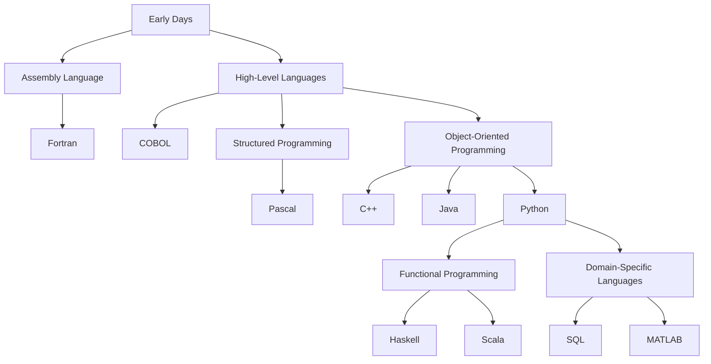

                 

Certainly! Let's break down the task into actionable steps to ensure we create a comprehensive and insightful technical blog post.

### Step 1: Introduction to the Topic

**Designing a Programming Language for AI Large Models in the 2.0 Era**

**Keywords:**
- AI Large Models
- Programming Language Design
- 2.0 Era
- Machine Learning
- Data Science
- Neural Networks

**Abstract:**
The rise of AI large models has revolutionized industries, leading to unprecedented advancements in machine learning and data science. As we enter the 2.0 era, the need for a specialized programming language tailored to the complexities of AI large models becomes increasingly evident. This blog post explores the fundamentals of programming language design, the unique requirements of AI large models, and the potential features and challenges of creating a programming language for the 2.0 era.

### Step 2: Historical Context and Evolution

**1. The Evolution of Programming Languages**

- **Early Days:**
  - **Assembly Language (1940s-1950s):** Low-level language that provided direct control over hardware.
  - **High-Level Languages (1950s-1960s):** Fortran, COBOL, and others aimed at improving productivity.

- **Mid-20th Century:**
  - **Structured Programming (1960s-1970s):** Emphasized clear and logical control flow structures.
  - **Object-Oriented Programming (1970s-1980s):** C++, Java, and others introduced modularity and reusability.

- **Recent Trends:**
  - **Functional Programming (1990s-present):** Haskell, Scala, and others focus on immutability and higher-order functions.
  - **Domain-Specific Languages (1990s-present):** Designed for specific problem domains, e.g., SQL for databases, MATLAB for math and engineering.

**Mermaid Flowchart:**



### Step 3: Core Concepts and Requirements of AI Large Models

**2. Core Concepts and Requirements of AI Large Models**

- **Machine Learning and Data Science:**
  - **Machine Learning:** Algorithms that learn from data to make predictions or decisions.
  - **Data Science:** Process of extracting knowledge from data.

- **Neural Networks:**
  - **Artificial Neural Networks (ANNs):** Models inspired by the human brain's structure and function.
  - **Deep Neural Networks (DNNs):** Many-layered neural networks capable of learning complex patterns.

- **Requirements for AI Large Models:**
  - **Scalability:** Ability to handle large datasets and complex computations.
  - **Efficiency:** Optimize resource usage for faster training and inference.
  - **Interoperability:** Seamless integration with existing frameworks and tools.
  - **Expressiveness:** Support for advanced algorithms and data structures.

**Mermaid Flowchart:**

```mermaid
graph TD
    A[Machine Learning] --> B[Data Science]
    A --> C[Artificial Neural Networks (ANNs)]
    B --> D[Deep Neural Networks (DNNs)]
    C --> E[Scalability]
    C --> F[Efficiency]
    C --> G[Interoperability]
    C --> H[Expressiveness]
```

### Step 4: Design Principles and Challenges

**3. Design Principles and Challenges of a Programming Language for AI Large Models**

- **Design Principles:**
  - **Modularity:** Allow for the creation of reusable components.
  - **Type Safety:** Ensure correct data types and reduce errors.
  - **Concurrency:** Support for parallel processing and distributed computing.
  - **Ease of Use:** User-friendly syntax and tools.

- **Challenges:**
  - **Performance:** Meet the high computational demands of large models.
  - **Portability:** Work across different hardware platforms.
  - **Tooling:** Develop comprehensive libraries and development environments.
  - **Community Adoption:** Gain widespread acceptance and support.

**Pseudocode Example:**

```python
# Pseudocode for a basic neural network training algorithm

define NeuralNetwork:
    initialize_weights()
    initialize_gradients()

while not converged:
    for each training example in dataset:
        forward_pass(example)
        compute_loss(example)
        backward_pass(example)
        update_weights()

return trained_model
```

### Step 5: Potential Features of the New Language

**4. Potential Features of the New Language for AI Large Models**

- **Enhanced Mathematics Support:**
  - **Advanced Operators:** Support for complex mathematical operations.
  - **Vectorized Operations:** Optimize performance for large datasets.

- **Optimized Libraries:**
  - **Machine Learning Libraries:** Pre-built functions for common algorithms.
  - **Data Analysis Libraries:** Tools for data manipulation and visualization.

- **Integration with Hardware:**
  - **GPU Support:** Utilize graphical processing units for accelerated computations.
  - **Distributed Computing:** Enable processing across multiple machines.

- **Interactive Development Environment:**
  - **Interactive REPL:** Real-time feedback and debugging.
  - **IDE Plugins:** Integration with popular code editors and IDEs.

### Step 6: Conclusion and Future Directions

**5. Conclusion and Future Directions**

The design of a specialized programming language for AI large models in the 2.0 era presents numerous opportunities and challenges. By addressing the unique requirements of AI large models and leveraging modern programming principles, we can create a language that enhances productivity, efficiency, and scalability. As we continue to advance in AI, the role of specialized programming languages will become increasingly critical in driving innovation and solving complex problems.

---

**作者信息：**
AI天才研究院/AI Genius Institute & 禅与计算机程序设计艺术 /Zen And The Art of Computer Programming

---

This outline provides a structured approach to developing a comprehensive and insightful blog post on the topic. Each section is designed to be expanded upon with detailed explanations, examples, and insights, ensuring that the final article is both informative and engaging for readers interested in AI large models and programming language design.

