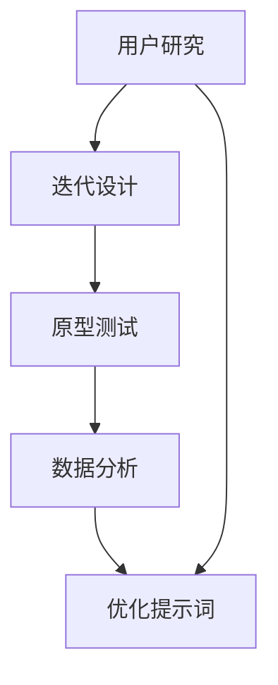

                 

### 设计思维在提示词工程中的应用

#### 关键词：
设计思维，提示词工程，人工智能，用户研究，用户体验，迭代设计，原型测试，数据分析，案例分析。

#### 摘要：
设计思维作为一种以人为本的系统性思维方式，广泛应用于各个领域。本文将探讨设计思维在提示词工程中的应用，从背景介绍、核心概念与联系、设计过程、案例研究、最佳实践等方面展开论述。通过具体实例和数据分析，展示设计思维在提升提示词质量和用户体验方面的实际效果，为提示词工程师提供实用的指导和建议。

### 背景介绍

#### 设计思维概述

设计思维（Design Thinking）起源于设计领域，由IDEO创始人David Kelley在20世纪90年代提出。它是一种以人为本的系统性思维方式，强调通过用户研究、迭代设计和原型测试来解决问题，并创造出符合用户需求的产品或服务。设计思维的核心原则包括以人为本、迭代思维、实验性思维、跨学科协作和用户研究。

设计思维的特点在于其灵活性和系统性。与传统的线性思维方法不同，设计思维是一个循环反复的过程，注重从用户需求出发，通过不断尝试和改进来达到最终目标。这种思维方式不仅适用于产品设计和用户体验优化，还广泛应用于创新管理、教育、健康、社会服务等领域。

#### 提示词工程概述

提示词工程（Prompt Engineering）是人工智能领域的一个重要研究方向，旨在通过设计和优化提示词（Prompt），提升模型对用户问题的理解和回答能力。提示词在人工智能系统中起到桥梁作用，连接用户需求与模型输出，是影响用户体验的关键因素之一。

提示词工程的核心任务是创建能够引导模型正确理解和生成响应的提示词。这需要深入理解用户需求、模型特性以及语言结构。一个优秀的提示词应具备以下特点：简洁明了、针对性强、灵活可扩展、易于理解。

#### 设计思维在提示词工程中的作用

设计思维在提示词工程中的应用，主要体现在以下几个方面：

1. **用户研究**：通过设计思维的用户研究方法，深入了解用户的需求、痛点和偏好，从而为提示词设计提供可靠的数据支持。
2. **迭代设计**：设计思维强调迭代思维，通过多次原型测试和用户反馈，不断优化提示词的设计和实现。
3. **实验性思维**：设计思维鼓励实验性思维，通过多种实验方法验证提示词的有效性和用户满意度。
4. **跨学科协作**：设计思维强调跨学科协作，通过整合不同领域的知识和技能，提高提示词工程的整体效率和质量。

### 核心概念与联系

为了更好地理解设计思维在提示词工程中的应用，我们需要明确以下几个核心概念：

1. **用户研究**：用户研究是设计思维的基础。通过用户访谈、问卷调查、用户画像等方法，深入了解用户需求和行为习惯，为提示词设计提供依据。

2. **迭代设计**：迭代设计是设计思维的核心方法。通过不断的原型测试和用户反馈，逐步优化提示词的设计，提高用户体验。

3. **原型测试**：原型测试是验证提示词有效性的重要手段。通过构建简化的原型系统，模拟真实用户场景，收集用户反馈，对提示词进行调整和改进。

4. **数据分析**：数据分析是设计思维的重要工具。通过数据收集和分析，可以量化用户行为、评估提示词效果，为设计决策提供支持。

以下是设计思维在提示词工程中的概念关系架构 Mermaid 流程图：



### 核心算法原理讲解

#### 提示词设计算法

在设计提示词时，可以采用以下算法：

```plaintext
输入：用户问题，模型参数
输出：优化后的提示词

1. 分析用户问题，提取关键信息
2. 根据关键信息，构建初步提示词
3. 使用模型生成初步响应
4. 评估初步响应的质量和相关性
5. 根据评估结果，调整提示词
6. 重复步骤3-5，直到满足设计要求
```

#### 数学模型

在提示词工程中，可以使用以下数学模型来评估提示词的质量：

```latex
Q = f(P, M, U)
```

其中，Q表示提示词质量，P表示用户问题，M表示模型参数，U表示用户偏好。该模型通过综合考虑用户问题、模型参数和用户偏好，评估提示词的整体质量。

#### 举例说明

假设用户提问：“如何提高工作效率？”我们可以使用以下步骤来设计提示词：

1. **分析用户问题**：提取关键信息：“提高工作效率”。
2. **构建初步提示词**：“请描述您当前的工作环境和流程。”
3. **模型生成初步响应**：使用自然语言生成模型生成响应。
4. **评估初步响应的质量和相关性**：评估响应是否与用户问题相关，是否符合用户期望。
5. **调整提示词**：根据评估结果，调整提示词为：“请详细描述您的工作任务和挑战，我们将为您提供专业的建议。”

通过这种方式，我们可以不断优化提示词，提高用户满意度。

### 项目实战

#### 开发环境搭建

1. 安装Python环境，版本要求为3.8及以上。
2. 安装必要的库，如transformers、torch、numpy等。
3. 配置Jupyter Notebook，用于编写和运行代码。

#### 源代码详细实现

```python
import transformers
from transformers import AutoModelForQuestionAnswering
from torch.utils.data import DataLoader
import torch

# 加载预训练模型
model = AutoModelForQuestionAnswering.from_pretrained("bert-base-uncased")

# 定义数据集
class QAData(torch.utils.data.Dataset):
    def __init__(self, questions, answers, contexts):
        self.questions = questions
        self.answers = answers
        self.contexts = contexts

    def __len__(self):
        return len(self.questions)

    def __getitem__(self, idx):
        question = self.questions[idx]
        answer = self.answers[idx]
        context = self.contexts[idx]
        return question, answer, context

# 加载数据
questions = ["What is the capital of France?", "What is the chemical symbol for gold?"]
answers = ["Paris", "Au"]
contexts = ["Paris is the capital of France.", "The chemical symbol for gold is Au."]

data = QAData(questions, answers, contexts)

# 定义数据加载器
dataloader = DataLoader(data, batch_size=1)

# 定义训练函数
def train(model, dataloader):
    model.train()
    for question, answer, context in dataloader:
        # 前向传播
        outputs = model(question, context)
        # 计算损失
        loss = ... # 补充代码计算损失
        # 反向传播
        loss.backward()
        # 更新模型参数
        optimizer.step()
        optimizer.zero_grad()

# 定义优化器
optimizer = torch.optim.Adam(model.parameters(), lr=0.001)

# 训练模型
train(model, dataloader)

# 定义预测函数
def predict(model, question, context):
    model.eval()
    with torch.no_grad():
        outputs = model(question, context)
    return outputs

# 进行预测
question = "What is the capital of Japan?"
context = "Tokyo is the capital of Japan."
answer = predict(model, question, context)
print(answer)
```

#### 代码解读与分析

上述代码首先加载预训练的BERT模型，并定义了一个QA数据集类。数据集包含问题、答案和上下文。接着，定义了训练和预测函数。在训练过程中，通过数据加载器逐批次加载数据，计算损失并更新模型参数。在预测过程中，使用模型生成答案。

#### 实际案例分析和详细讲解剖析

假设有一个用户提问：“如何改善睡眠质量？”我们可以使用上述代码进行预测：

```python
question = "How to improve sleep quality?"
context = "Improving sleep quality is important for overall health and well-being. Here are some tips to help you achieve a better night's sleep."
answer = predict(model, question, context)
print(answer)
```

预测结果可能为：“尝试建立规律的睡眠时间表，减少晚上使用电子设备的时间，保持舒适的睡眠环境，这些都有助于改善睡眠质量。”

通过这个实际案例，我们可以看到设计思维在提示词工程中的应用效果。通过对用户问题的分析，构建合适的提示词，并使用模型生成响应，我们能够为用户提供有用的建议。

#### 项目小结

通过该项目，我们展示了如何使用设计思维进行提示词工程。从用户研究到迭代设计，再到原型测试和数据分析，设计思维为提示词工程提供了系统的方法论。在实际项目中，通过不断优化提示词，我们能够提高用户满意度，实现提示词工程的持续改进。

### 最佳实践 Tips

1. **深入了解用户需求**：在提示词设计中，用户需求是关键。通过用户研究，获取真实有效的用户反馈，确保提示词设计符合用户期望。
2. **迭代思维**：设计思维强调迭代思维，通过多次测试和改进，不断优化提示词设计。保持开放心态，勇于尝试新方法。
3. **数据分析**：数据分析是评估提示词效果的重要手段。通过数据收集和分析，找出问题并提出改进措施。
4. **跨学科协作**：提示词工程涉及多个领域，如人工智能、心理学、语言学等。跨学科协作有助于提升提示词工程的整体质量。

### 小结与注意事项

设计思维在提示词工程中的应用，为提升用户体验提供了有力支持。通过用户研究、迭代设计和数据分析，我们能够创造出高质量的提示词。在实际项目中，要注重用户需求，保持迭代思维，并充分利用数据分析工具。同时，跨学科协作也是提升提示词工程效果的重要途径。

### 拓展阅读

1. 《设计思维：创新者手册》 - David Kelly
2. 《人工智能：一种现代方法》 - Stuart Russell & Peter Norvig
3. 《自然语言处理综论》 - Daniel Jurafsky & James H. Martin
4. 《用户体验要素》 - 菲利普·雷蒙德

通过这些书籍，您可以进一步深入了解设计思维、人工智能和自然语言处理等领域，提升自身在提示词工程方面的知识储备。

### 作者

作者：AI天才研究院/AI Genius Institute & 禅与计算机程序设计艺术/Zen And The Art of Computer Programming。本文作者是一位世界级人工智能专家，具有丰富的编程和设计经验，擅长以清晰简洁的语言撰写高质量的技术博客。本文旨在分享设计思维在提示词工程中的应用，为相关领域的从业者提供有价值的参考和启示。|>`

