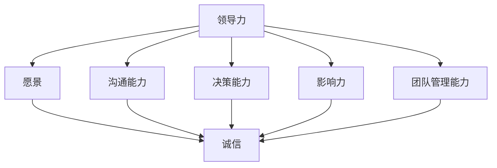
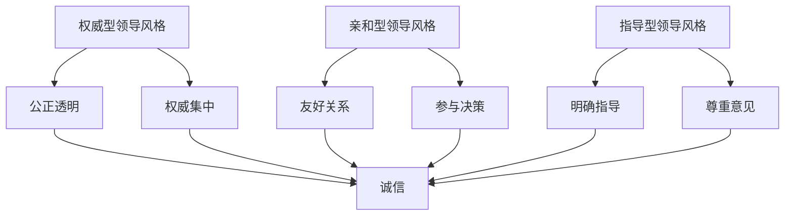
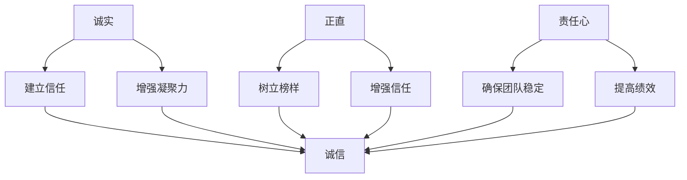
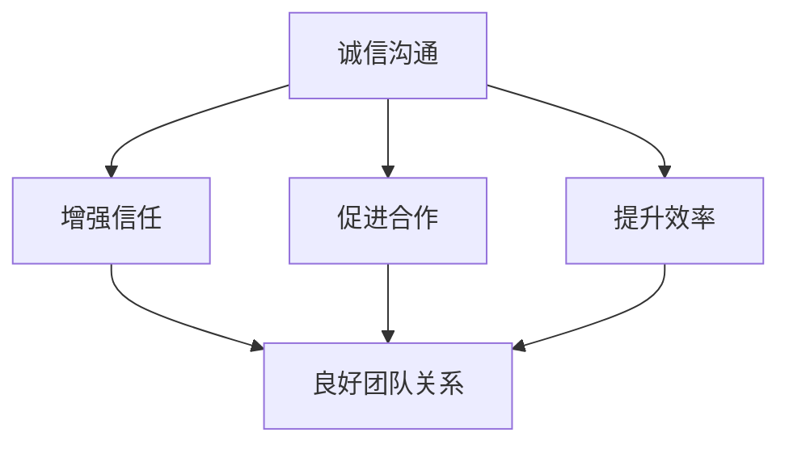
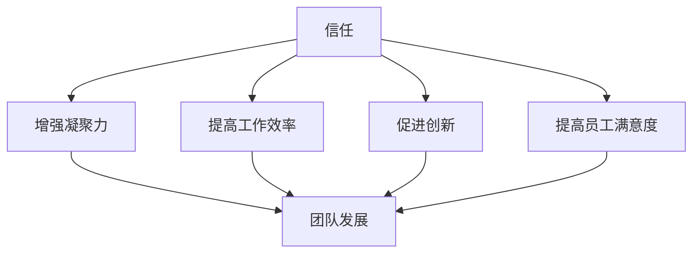
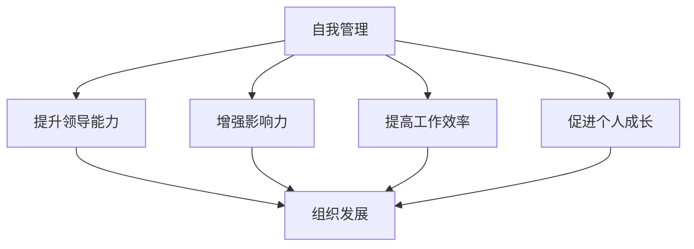
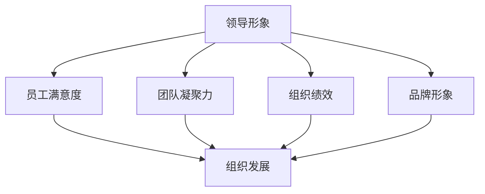
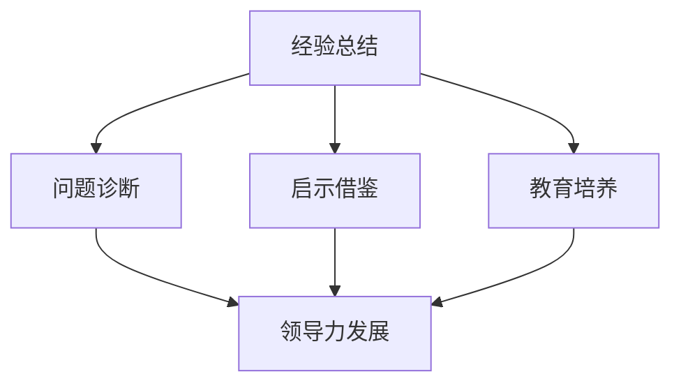

                 


### 《诚信领导：建立可信赖的领导形象》

> 关键词：领导力、诚信、领导风格、个人品德、沟通技巧

> 摘要：本文旨在探讨如何建立可信赖的领导形象，通过对领导力、诚信、领导风格、个人品德和沟通技巧的深入分析，提出一系列实用的策略和技巧，帮助领导者提升自身的领导能力，建立可信赖的领导形象。

#### 引言

领导力是任何组织成功的关键因素之一。一个优秀的领导者不仅能够带领团队实现目标，还能够激发团队成员的潜力，推动组织的发展。然而，领导力的提升并非一蹴而就，它需要领导者不断学习、实践和反思。在这个过程中，诚信作为领导力的重要组成部分，起着至关重要的作用。诚信不仅能够增强领导者的影响力，还能够建立可信赖的领导形象，为组织的长期发展奠定坚实的基础。

本文将从以下几个方面展开讨论：

1. **领导力和诚信概述**：介绍领导力的定义与要素，以及诚信的内涵与价值。
2. **领导风格与诚信**：分析领导风格类型，探讨诚信与领导风格的关系，并提出如何培养诚信领导风格的策略。
3. **个人品德与诚信**：阐述个人品德的要素，以及个人品德与诚信的关系。
4. **沟通技巧与诚信**：探讨有效沟通的要素，分析诚信沟通的重要性，并提出如何进行诚信沟通的策略。
5. **建立可信赖的领导形象**：讨论建立信任的重要性，提出建立信任的策略，以及领导自我管理和领导形象的塑造与维护。

通过以上内容的深入探讨，希望读者能够对如何建立可信赖的领导形象有更清晰的认识，并在实际工作中运用这些策略，提升自身的领导能力。

#### 第一部分：领导力和诚信基础

##### 第1章：领导力和诚信概述

**1.1 领导力的定义与要素**

领导力是一种能力，它包括一系列行为、态度和技能，使领导者能够激励、指导和影响他人，实现共同的目标。领导力的要素可以归纳为以下几点：

- **愿景**：领导者需要有远大的愿景，能够清晰地描述未来的目标，并激励团队成员为之奋斗。
- **沟通能力**：领导者需要具备良好的沟通能力，能够有效地传达信息、倾听意见和建议，建立良好的沟通渠道。
- **决策能力**：领导者需要在面对复杂问题时，能够做出明智的决策，并承担责任。
- **影响力**：领导者需要具备影响力，能够影响他人的思想和行为，推动团队朝着共同的目标前进。
- **团队管理能力**：领导者需要能够管理团队，激励团队成员，协调团队内部的关系，确保团队的高效运作。

**1.2 诚信的内涵与价值**

诚信是指一个人言行一致，遵守承诺，正直无私的品质。在领导力中，诚信具有以下价值：

- **增强信任**：诚信能够增强团队成员对领导者的信任，从而建立良好的团队关系，提高团队的合作效率。
- **树立榜样**：领导者通过诚信的行为，能够树立良好的榜样，激励团队成员也以诚信对待工作，形成良好的企业文化。
- **提高声誉**：领导者的诚信行为能够提高组织在公众和客户中的声誉，增强组织的竞争力。
- **促进发展**：诚信能够促进组织的长期发展，因为一个诚信的组织更容易获得合作伙伴的信任，从而获得更多的发展机会。

**核心概念与联系**

为了更好地理解领导力和诚信之间的关系，我们可以使用Mermaid流程图来展示它们之间的联系。



**核心算法原理讲解**

我们可以使用伪代码来详细阐述领导力和诚信之间的联系：

```python
# 定义领导力的要素
def leadership_elements():
    elements = ["vision", "communication", "decision-making", "influence", "team_management"]
    return elements

# 定义诚信的内涵
def integrity():
    integrity_values = ["being consistent", "keeping promises", "acting honestly", "being selfless"]
    return integrity_values

# 分析领导力和诚信的联系
def analyze_leadership_integrity():
    leadership_elements = leadership_elements()
    integrity_values = integrity()
    
    for element in leadership_elements:
        for value in integrity_values:
            print(f"{element} and {value} are closely related.")
```

**数学模型和公式 & 详细讲解 & 举例说明**

在领导力和诚信之间，我们可以使用以下数学模型来描述它们之间的关系：

$$
\text{Trust} = \alpha \times \text{Leadership} + \beta \times \text{Integrity}
$$

其中，Trust表示信任度，Leadership表示领导力，Integrity表示诚信。α和β分别表示领导力和诚信对信任度的影响程度。

举例来说，如果一个领导者的领导力很高（α很大），同时诚信度也很高（β很大），那么团队成员对他的信任度就会很高。反之，如果领导者的领导力较低，但诚信度较高，团队成员仍然可能会对他保持一定的信任。

$$
\text{Trust} = \alpha \times (\text{High Leadership}) + \beta \times (\text{High Integrity}) = \alpha \beta
$$

**项目实战**

在项目中，诚信和领导力的重要性体现在以下几个方面：

- **需求分析**：在需求分析阶段，领导者需要保持诚信，确保需求描述准确无误，避免因领导者的误导导致项目偏差。
- **团队协作**：在团队协作过程中，领导者需要通过诚信的行为，建立信任，促进团队成员之间的有效沟通和合作。
- **风险管理**：在风险管理过程中，领导者需要诚信地评估风险，并制定合理的应对策略，确保项目的顺利进行。

**最佳实践 tips**

- **定期反思**：领导者需要定期反思自己的行为，确保自己的行为符合诚信的原则，并及时调整自己的领导方式。
- **树立榜样**：领导者应该通过自己的行为，树立诚信的榜样，激励团队成员也以诚信对待工作。

**小结**

在本章中，我们介绍了领导力的定义与要素，以及诚信的内涵与价值。通过分析领导力和诚信之间的联系，我们认识到诚信在领导力中的重要性。在项目实战中，诚信和领导力是确保项目成功的关键。通过定期反思和树立榜样，领导者可以不断提升自己的领导能力，建立可信赖的领导形象。

##### 第2章：领导风格与诚信

**2.1 领导风格类型**

领导风格是指领导者处理和管理团队的方式。不同的领导风格会对团队成员的行为和团队绩效产生不同的影响。常见的领导风格包括：

- **权威型领导风格**：领导者对团队成员的工作进行严格的控制，决策权高度集中。这种领导风格在短期内可能会提高工作效率，但长期来看，容易导致团队成员的被动和消极。
- **亲和型领导风格**：领导者注重与团队成员建立友好关系，鼓励团队成员参与决策。这种领导风格能够增强团队的凝聚力，但可能会降低工作效率。
- **指导型领导风格**：领导者为团队成员提供明确的指导和方向，帮助团队成员解决问题。这种领导风格能够提高团队成员的工作能力，但可能会限制团队成员的自主性。

**2.2 诚信与领导风格的关系**

诚信对领导风格有着重要的影响。一个诚信的领导者能够在不同的领导风格中保持一致性，从而建立可信赖的领导形象。以下是诚信与不同领导风格之间的关系：

- **权威型领导风格**：在权威型领导风格中，诚信要求领导者必须公正、透明地行使权力，确保团队成员能够理解领导的决策和期望。
- **亲和型领导风格**：在亲和型领导风格中，诚信要求领导者对待团队成员真诚、公平，避免因为个人偏好而影响决策。
- **指导型领导风格**：在指导型领导风格中，诚信要求领导者提供准确、有用的指导，同时尊重团队成员的意见和建议。

**2.3 如何培养诚信领导风格**

要培养诚信领导风格，领导者需要从以下几个方面着手：

- **自我反思**：领导者需要定期反思自己的行为，确保自己的行为符合诚信的原则，并及时调整自己的领导方式。
- **树立榜样**：领导者应该通过自己的行为，树立诚信的榜样，激励团队成员也以诚信对待工作。
- **建立信任**：领导者需要通过与团队成员建立信任，增强团队的凝聚力，为诚信领导风格提供基础。
- **培训和教育**：组织可以为领导者提供培训和教育，帮助领导者了解诚信的重要性，掌握诚信领导的方法和技巧。

**核心概念与联系**

为了更好地理解诚信与领导风格之间的关系，我们可以使用Mermaid流程图来展示它们之间的联系。



**核心算法原理讲解**

我们可以使用伪代码来详细阐述诚信与领导风格之间的关系：

```python
# 定义领导风格
def leadership_style(style):
    if style == "authoritative":
        return ["公正透明", "权威集中"]
    elif style == "affiliative":
        return ["友好关系", "参与决策"]
    elif style == "directive":
        return ["明确指导", "尊重意见"]

# 分析诚信与领导风格的关系
def analyze_integrity_and_leadership_style(style):
    styles = leadership_style(style)
    for element in styles:
        print(f"{style} 风格与 {element} 和诚信密切相关。")
```

**数学模型和公式 & 详细讲解 & 举例说明**

在诚信与领导风格之间，我们可以使用以下数学模型来描述它们之间的关系：

$$
\text{Integrity} = \alpha \times \text{Leadership Style} + \beta \times \text{Self-reflection} + \gamma \times \text{Mentoring}
$$

其中，Integrity表示诚信度，Leadership Style表示领导风格，Self-reflection表示自我反思，Mentoring表示培训和教育。α、β和γ分别表示领导风格、自我反思和培训教育对诚信度的影响程度。

举例来说，如果一个领导者采用权威型领导风格（α很大），并且经常进行自我反思（β较大），同时组织也提供了良好的培训和教育（γ较大），那么他的诚信度就会很高。

$$
\text{Integrity} = \alpha \times (\text{权威型领导风格}) + \beta \times (\text{自我反思}) + \gamma \times (\text{培训教育}) = \alpha \beta \gamma
$$

**项目实战**

在项目中，诚信领导风格的重要性体现在以下几个方面：

- **项目管理**：领导者需要保持诚信，确保项目计划和时间表准确无误，避免因领导的误导导致项目延误。
- **团队沟通**：领导者需要通过诚信的沟通，建立信任，促进团队成员之间的有效合作。
- **决策制定**：领导者需要通过诚信的行为，确保决策的公正性和透明度，增强团队成员的信任。

**最佳实践 tips**

- **以身作则**：领导者应该通过自己的行为，树立诚信的榜样，激励团队成员也以诚信对待工作。
- **建立信任**：领导者需要通过与团队成员建立信任，增强团队的凝聚力，为诚信领导风格提供基础。

**小结**

在本章中，我们分析了不同类型的领导风格，探讨了诚信与领导风格之间的关系，并提出了如何培养诚信领导风格的策略。通过项目实战和最佳实践，我们认识到诚信领导风格在项目管理中的重要性。通过以身作则和建立信任，领导者可以不断提升自己的领导能力，建立可信赖的领导形象。

##### 第3章：个人品德与诚信

**3.1 个人品德的要素**

个人品德是指一个人在道德和伦理方面的品质和修养。良好的个人品德是建立可信赖的领导形象的基础。个人品德的要素包括以下几个方面：

- **诚实**：诚实是指一个人言行一致，不说谎、不作假。诚实的领导者能够赢得团队成员的信任，建立良好的团队关系。
- **正直**：正直是指一个人在道德和伦理方面坚持原则，不做违法乱纪的事情。正直的领导者能够树立良好的榜样，激励团队成员也以正直对待工作和生活。
- **责任心**：责任心是指一个人对自己的行为和决策负责，能够承担应有的责任。有责任心的领导者能够确保团队的稳定运作，提高团队的绩效。

**3.2 个人品德与诚信的关系**

个人品德与诚信之间有着密切的关系。一个具有良好个人品德的领导者，通常也会表现出高度的诚信。以下是个人品德与诚信之间的关系：

- **诚实**：一个诚实的领导者会遵守承诺，保持言行一致，这有助于建立团队成员的信任，从而增强团队的凝聚力。
- **正直**：一个正直的领导者会坚持道德原则，不做违法乱纪的事情，这有助于树立良好的领导形象，增强团队成员的信任。
- **责任心**：一个有责任心的领导者会承担应有的责任，确保团队的稳定运作，这有助于提高团队成员的信任度，增强团队的凝聚力。

**3.3 如何培养良好的个人品德**

要培养良好的个人品德，领导者需要从以下几个方面着手：

- **自我反思**：领导者需要定期反思自己的行为，确保自己的行为符合道德和伦理原则，并及时调整自己的行为。
- **学习和实践**：领导者需要通过学习和实践，提高自己的道德和伦理素养，培养良好的个人品德。
- **树立榜样**：领导者应该通过自己的行为，树立良好的榜样，激励团队成员也以良好的个人品德对待工作和生活。

**核心概念与联系**

为了更好地理解个人品德与诚信之间的关系，我们可以使用Mermaid流程图来展示它们之间的联系。



**核心算法原理讲解**

我们可以使用伪代码来详细阐述个人品德与诚信之间的关系：

```python
# 定义个人品德
def personal_品德(品德):
    elements = ["honesty", "integrity", "responsibility"]
    return elements

# 分析个人品德与诚信的关系
def analyze_personal_品德_and_integrity(品德):
   品德_elements = personal_品德(品德)
    for element in品德_elements:
        print(f"{品德} 与 {element} 和诚信密切相关。")
```

**数学模型和公式 & 详细讲解 & 举例说明**

在个人品德与诚信之间，我们可以使用以下数学模型来描述它们之间的关系：

$$
\text{Integrity} = \alpha \times \text{Personal Virtues} + \beta \times \text{Self-reflection} + \gamma \times \text{Mentoring}
$$

其中，Integrity表示诚信度，Personal Virtues表示个人品德，Self-reflection表示自我反思，Mentoring表示培训和教育。α、β和γ分别表示个人品德、自我反思和培训教育对诚信度的影响程度。

举例来说，如果一个领导者具有很好的个人品德（α很大），并且经常进行自我反思（β较大），同时组织也提供了良好的培训和教育（γ较大），那么他的诚信度就会很高。

$$
\text{Integrity} = \alpha \times (\text{良好个人品德}) + \beta \times (\text{自我反思}) + \gamma \times (\text{培训教育}) = \alpha \beta \gamma
$$

**项目实战**

在项目中，个人品德的重要性体现在以下几个方面：

- **项目管理**：领导者需要保持诚实，确保项目计划和时间表准确无误，避免因领导的误导导致项目延误。
- **团队沟通**：领导者需要通过正直的行为，树立良好的榜样，激励团队成员也以正直对待工作和生活。
- **决策制定**：领导者需要通过责任心，确保决策的公正性和透明度，增强团队成员的信任。

**最佳实践 tips**

- **定期反思**：领导者应该定期反思自己的行为，确保自己的行为符合道德和伦理原则。
- **树立榜样**：领导者应该通过自己的行为，树立良好的榜样，激励团队成员也以良好的个人品德对待工作和生活。

**小结**

在本章中，我们介绍了个人品德的要素，探讨了个人品德与诚信的关系，并提出了如何培养良好个人品德的策略。通过项目实战和最佳实践，我们认识到个人品德在领导力中的重要性。通过定期反思和树立榜样，领导者可以不断提升自己的个人品德，建立可信赖的领导形象。

##### 第4章：沟通技巧与诚信

**4.1 有效沟通的要素**

沟通技巧是领导者必须掌握的一项重要能力。有效沟通不仅能帮助领导者传达信息，还能促进团队成员之间的理解和合作。有效沟通的要素包括以下几个方面：

- **清晰表达**：领导者需要能够清晰地表达自己的想法和意见，确保团队成员能够准确理解。
- **倾听理解**：领导者需要倾听团队成员的意见和建议，理解他们的需求和困惑，从而更好地支持他们。
- **善于反馈**：领导者需要能够给予团队成员及时的反馈，鼓励他们改进，同时也要能够接受团队成员的反馈，不断自我提升。

**4.2 诚信沟通的重要性**

诚信沟通是建立可信赖领导形象的关键。一个诚信的领导者会通过真诚、公正和透明的沟通方式，增强团队成员的信任和合作意愿。以下是诚信沟通的重要性：

- **增强信任**：诚信沟通能够增强团队成员对领导者的信任，从而建立良好的团队关系，提高团队的合作效率。
- **促进合作**：诚信沟通能够促进团队成员之间的合作，避免因误解和猜疑导致的冲突和分裂。
- **提升效率**：诚信沟通能够提高团队成员的工作效率，因为团队成员能够准确理解领导者的意图和期望，从而更好地完成任务。

**4.3 如何进行诚信沟通**

要实现诚信沟通，领导者需要从以下几个方面着手：

- **诚实表达**：领导者需要坦诚地表达自己的观点和意见，不隐瞒、不夸大，确保信息的真实性。
- **尊重对方**：领导者需要尊重团队成员的意见和感受，避免使用指责和批评的语言，建立积极的沟通氛围。
- **透明度**：领导者需要保持信息的透明度，确保团队成员能够了解到组织的真实情况和面临的挑战，从而更好地支持组织的目标。

**核心概念与联系**

为了更好地理解诚信沟通的重要性，我们可以使用Mermaid流程图来展示诚信沟通与信任、合作和效率之间的关系。



**核心算法原理讲解**

我们可以使用伪代码来详细阐述诚信沟通与信任、合作和效率之间的关系：

```python
# 定义诚信沟通的影响
def integrity_communication_effects():
    effects = ["增强信任", "促进合作", "提升效率"]
    return effects

# 分析诚信沟通对团队的影响
def analyze_integrity_communication(team):
    effects = integrity_communication_effects()
    for effect in effects:
        print(f"诚信沟通有助于 {effect}，从而促进 {team} 的发展。")
```

**数学模型和公式 & 详细讲解 & 举例说明**

在诚信沟通与团队发展之间，我们可以使用以下数学模型来描述它们之间的关系：

$$
\text{Team Development} = \alpha \times \text{Integrity Communication} + \beta \times \text{Trust} + \gamma \times \text{Cooperation} + \delta \times \text{Efficiency}
$$

其中，Team Development表示团队发展，Integrity Communication表示诚信沟通，Trust表示信任，Cooperation表示合作，Efficiency表示效率。α、β、γ和δ分别表示诚信沟通、信任、合作和效率对团队发展的影响程度。

举例来说，如果一个团队的诚信沟通程度很高（α很大），团队成员之间的信任度也很高（β较大），合作意愿也很强（γ较大），工作效率也很高（δ较大），那么这个团队的发展就会非常迅速。

$$
\text{Team Development} = \alpha \times (\text{诚信沟通}) + \beta \times (\text{信任}) + \gamma \times (\text{合作}) + \delta \times (\text{效率}) = \alpha \beta \gamma \delta
$$

**项目实战**

在项目中，诚信沟通的重要性体现在以下几个方面：

- **项目规划**：领导者需要通过诚信沟通，确保项目目标和计划的透明度，避免因信息不对称导致的项目延误。
- **团队协作**：领导者需要通过诚信沟通，建立团队成员之间的信任，促进团队成员的合作，提高项目效率。
- **问题解决**：领导者需要通过诚信沟通，倾听团队成员的意见和建议，共同解决问题，确保项目的顺利进行。

**最佳实践 tips**

- **定期沟通**：领导者应该定期与团队成员进行沟通，确保信息的及时传递和问题的及时解决。
- **开放反馈**：领导者应该鼓励团队成员提供开放和诚实的反馈，共同改进工作方法和流程。

**小结**

在本章中，我们介绍了有效沟通的要素，探讨了诚信沟通的重要性，并提出了如何进行诚信沟通的策略。通过项目实战和最佳实践，我们认识到诚信沟通在团队发展中的关键作用。通过定期沟通和开放反馈，领导者可以不断提升自己的沟通技巧，建立可信赖的领导形象。

#### 第二部分：建立可信赖的领导形象

##### 第5章：建立信任

**5.1 信任的重要性**

信任是建立可信赖的领导形象的核心。一个领导者如果能够赢得团队成员的信任，就能获得他们的支持和合作，从而实现共同的目标。以下是信任在领导力中的重要性：

- **增强凝聚力**：信任能够增强团队成员之间的凝聚力，使他们更加团结，共同面对挑战。
- **提高工作效率**：信任能够减少团队成员之间的猜疑和内耗，提高工作效率和团队绩效。
- **促进创新**：信任能够鼓励团队成员提出新的想法和建议，推动组织的创新和发展。
- **提高员工满意度**：信任能够提高员工的满意度和忠诚度，降低员工流失率。

**5.2 建立信任的策略**

要建立信任，领导者需要从以下几个方面着手：

- **诚信行为**：领导者需要通过诚信的行为，赢得团队成员的信任。这意味着领导者需要遵守承诺，保持言行一致，不隐瞒信息，不欺骗团队成员。
- **透明度**：领导者需要保持信息的透明度，确保团队成员能够了解到组织的真实情况和面临的挑战，从而增强信任。
- **尊重他人**：领导者需要尊重团队成员的意见和感受，避免使用指责和批评的语言，建立积极的沟通氛围。
- **积极倾听**：领导者需要积极倾听团队成员的意见和建议，理解他们的需求和困惑，从而更好地支持他们。

**5.3 建立信任的实践案例**

以下是一个建立信任的实践案例：

- **案例背景**：某公司的项目团队在项目初期因为沟通不畅和目标不明确，出现了严重的内部矛盾，影响了项目的进度和质量。
- **解决方案**：领导者采取了以下措施：
  - **召开团队会议**：领导者召开了一次团队会议，公开讨论项目的问题和挑战，鼓励团队成员提出意见和建议。
  - **建立沟通机制**：领导者建立了定期的沟通机制，确保团队成员能够及时了解项目的进展和存在的问题，从而避免误解和猜疑。
  - **透明度**：领导者保持信息的透明度，及时向团队成员通报项目的进展和面临的挑战，让他们能够了解到真实的情况。
  - **尊重他人**：领导者尊重团队成员的意见和感受，避免使用指责和批评的语言，建立了积极的沟通氛围。
- **结果**：通过领导者的努力，团队内部的矛盾得到了有效的解决，团队成员之间的信任度显著提高，项目也顺利完成了。

**核心概念与联系**

为了更好地理解建立信任的重要性，我们可以使用Mermaid流程图来展示信任与凝聚力、工作效率、创新和员工满意度之间的关系。



**核心算法原理讲解**

我们可以使用伪代码来详细阐述信任与团队发展之间的关系：

```python
# 定义信任的影响
def trust_impact():
    impacts = ["增强凝聚力", "提高工作效率", "促进创新", "提高员工满意度"]
    return impacts

# 分析信任对团队发展的影响
def analyze_trust_impact(team):
    impacts = trust_impact()
    for impact in impacts:
        print(f"信任有助于 {impact}，从而促进 {team} 的发展。")
```

**数学模型和公式 & 详细讲解 & 举例说明**

在信任与团队发展之间，我们可以使用以下数学模型来描述它们之间的关系：

$$
\text{Team Development} = \alpha \times \text{Trust} + \beta \times \text{Communication} + \gamma \times \text{Innovation} + \delta \times \text{Employee Satisfaction}
$$

其中，Team Development表示团队发展，Trust表示信任，Communication表示沟通，Innovation表示创新，Employee Satisfaction表示员工满意度。α、β、γ和δ分别表示信任、沟通、创新和员工满意度对团队发展的影响程度。

举例来说，如果一个团队具有很高的信任度（α很大），沟通渠道畅通（β较大），创新氛围浓厚（γ较大），员工满意度很高（δ较大），那么这个团队的发展就会非常迅速。

$$
\text{Team Development} = \alpha \times (\text{信任}) + \beta \times (\text{沟通}) + \gamma \times (\text{创新}) + \delta \times (\text{员工满意度}) = \alpha \beta \gamma \delta
$$

**项目实战**

在项目中，建立信任的重要性体现在以下几个方面：

- **项目启动**：领导者需要通过建立信任，确保项目团队的稳定和高效运作。
- **风险管理**：领导者需要通过建立信任，确保团队成员能够坦诚地分享风险和问题，从而及时解决。
- **项目交付**：领导者需要通过建立信任，确保项目能够按时按质完成，满足客户的需求。

**最佳实践 tips**

- **建立信任文化**：领导者应该通过培训和激励，建立信任文化，让团队成员意识到信任的重要性，从而增强团队的凝聚力。
- **积极沟通**：领导者需要通过积极沟通，建立良好的沟通渠道，确保信息的及时传递和问题的及时解决。

**小结**

在本章中，我们探讨了信任的重要性，提出了建立信任的策略，并通过实践案例展示了如何在实际工作中建立信任。通过建立信任，领导者可以提升团队的发展，建立可信赖的领导形象。

##### 第6章：领导自我管理

**6.1 自我管理的重要性**

领导自我管理是建立可信赖的领导形象的关键。自我管理不仅涉及到领导者对自身行为的控制，还包括对情绪、时间和目标的合理规划。以下是领导自我管理的重要性：

- **提升领导能力**：通过自我管理，领导者能够不断提升自身的领导能力，更好地应对各种挑战。
- **增强影响力**：领导者通过自我管理，能够树立良好的榜样，增强对团队成员的影响力和吸引力。
- **提高工作效率**：通过自我管理，领导者能够合理规划时间和任务，提高工作效率，确保项目的顺利进行。
- **促进个人成长**：自我管理有助于领导者发现自身的潜力，推动个人成长，为组织的长期发展奠定基础。

**6.2 自我管理的策略**

要实现有效的领导自我管理，领导者需要从以下几个方面着手：

- **设定目标**：领导者需要明确自己的目标，并制定可行的计划，确保目标的实现。
- **时间管理**：领导者需要合理安排时间，优先处理重要和紧急的任务，避免时间的浪费。
- **情绪管理**：领导者需要学会控制自己的情绪，保持冷静和理智，避免因情绪波动影响决策和团队氛围。
- **持续学习**：领导者需要不断学习新知识和技能，提升自身的专业素养，以适应不断变化的环境。

**6.3 领导自我管理的实践案例**

以下是一个领导自我管理的实践案例：

- **案例背景**：某公司的项目经理在项目初期，由于没有合理安排时间和任务，导致项目进度缓慢，团队成员也感到压力重重。
- **解决方案**：项目经理采取了以下措施：
  - **设定目标**：项目经理明确了项目的关键目标和里程碑，并制定了详细的计划，确保项目的顺利进行。
  - **时间管理**：项目经理使用时间管理工具，合理安排自己的工作时间和任务，确保每个任务都有足够的时间完成。
  - **情绪管理**：项目经理学会控制自己的情绪，遇到问题时保持冷静，避免因情绪波动影响决策和团队氛围。
  - **持续学习**：项目经理通过参加培训和学习，不断提升自身的专业知识和技能，为项目的成功提供了有力支持。
- **结果**：通过项目经理的自我管理，项目进度得到了有效控制，团队成员的士气也得到了提升，项目最终按时完成并取得了良好的效果。

**核心概念与联系**

为了更好地理解领导自我管理的重要性，我们可以使用Mermaid流程图来展示自我管理与领导能力、影响力、工作效率和个人成长之间的关系。



**核心算法原理讲解**

我们可以使用伪代码来详细阐述领导自我管理对组织发展的影响：

```python
# 定义自我管理的影响
def self_management_impact():
    impacts = ["提升领导能力", "增强影响力", "提高工作效率", "促进个人成长"]
    return impacts

# 分析自我管理对组织发展的影响
def analyze_self_management_impact(organization):
    impacts = self_management_impact()
    for impact in impacts:
        print(f"自我管理有助于 {impact}，从而促进 {organization} 的发展。")
```

**数学模型和公式 & 详细讲解 & 举例说明**

在领导自我管理与组织发展之间，我们可以使用以下数学模型来描述它们之间的关系：

$$
\text{Organization Development} = \alpha \times \text{Self-management} + \beta \times \text{Leadership Skills} + \gamma \times \text{Influence} + \delta \times \text{Work Efficiency} + \epsilon \times \text{Personal Growth}
$$

其中，Organization Development表示组织发展，Self-management表示自我管理，Leadership Skills表示领导能力，Influence表示影响力，Work Efficiency表示工作效率，Personal Growth表示个人成长。α、β、γ、δ和ε分别表示自我管理、领导能力、影响力、工作效率和个人成长对组织发展的影响程度。

举例来说，如果一个领导者在自我管理方面非常出色（α很大），领导能力很强（β较大），影响力很大（γ较大），工作效率很高（δ较大），个人成长也很显著（ε较大），那么组织的发展就会非常迅速。

$$
\text{Organization Development} = \alpha \times (\text{自我管理}) + \beta \times (\text{领导能力}) + \gamma \times (\text{影响力}) + \delta \times (\text{工作效率}) + \epsilon \times (\text{个人成长}) = \alpha \beta \gamma \delta \epsilon
$$

**项目实战**

在项目中，领导自我管理的重要性体现在以下几个方面：

- **项目管理**：领导者需要通过自我管理，合理安排时间和任务，确保项目的顺利进行。
- **团队协作**：领导者需要通过自我管理，控制自己的情绪，避免因情绪波动影响团队氛围和决策。
- **持续改进**：领导者需要通过自我管理，不断学习和提升自身能力，为项目的持续改进提供支持。

**最佳实践 tips**

- **定期反思**：领导者应该定期反思自己的行为和管理方式，识别不足并加以改进。
- **制定计划**：领导者应该制定明确的目标和计划，确保目标的实现和任务的完成。

**小结**

在本章中，我们探讨了领导自我管理的重要性，提出了自我管理的策略，并通过实践案例展示了如何在实际工作中实现自我管理。通过自我管理，领导者可以提升自身的领导能力，建立可信赖的领导形象，促进组织的持续发展。

##### 第7章：领导形象的塑造与维护

**7.1 领导形象的定义**

领导形象是指公众对领导者的整体认知和评价，包括领导者的行为、态度、能力和价值观。良好的领导形象能够增强领导者的权威和影响力，提高组织的声誉和竞争力。

**7.2 领导形象的影响**

领导形象对组织的各个方面都有着重要的影响：

- **员工满意度**：良好的领导形象能够提高员工的满意度和忠诚度，降低员工流失率。
- **团队凝聚力**：良好的领导形象能够增强团队的凝聚力，促进团队成员之间的合作和信任。
- **组织绩效**：良好的领导形象能够提高组织的绩效，推动组织实现战略目标。
- **品牌形象**：良好的领导形象能够提升组织的品牌形象，增强市场竞争力。

**7.3 领导形象的塑造**

要塑造良好的领导形象，领导者需要从以下几个方面着手：

- **诚信行为**：领导者需要通过诚信的行为赢得公众的信任，建立良好的个人形象。
- **专业能力**：领导者需要不断提升自己的专业能力，成为领域的专家，增强公众对领导者的认可。
- **积极形象**：领导者需要塑造积极的形象，通过正面的言行和形象，增强公众对领导者的好感。
- **社会责任**：领导者需要承担社会责任，通过参与公益活动和社会责任项目，提升组织的形象。

**7.4 领导形象的维护**

维护领导形象是长期而持续的工作，领导者需要从以下几个方面进行维护：

- **持续改进**：领导者需要不断反思自己的行为和决策，发现不足并加以改进，确保领导形象的一致性和可靠性。
- **沟通管理**：领导者需要通过有效的沟通管理，确保信息的准确传递和负面信息的及时处理，避免因沟通问题损害领导形象。
- **危机管理**：领导者需要建立有效的危机管理机制，及时应对和解决危机，减少危机对领导形象的损害。
- **持续学习**：领导者需要不断学习和提升自身能力，适应不断变化的环境，保持领导形象的前沿性。

**核心概念与联系**

为了更好地理解领导形象的塑造与维护，我们可以使用Mermaid流程图来展示领导形象与员工满意度、团队凝聚力、组织绩效和品牌形象之间的关系。



**核心算法原理讲解**

我们可以使用伪代码来详细阐述领导形象与组织发展之间的关系：

```python
# 定义领导形象的影响
def leadership_image_impact():
    impacts = ["提高员工满意度", "增强团队凝聚力", "提高组织绩效", "提升品牌形象"]
    return impacts

# 分析领导形象对组织发展的影响
def analyze_leadership_image_impact(organization):
    impacts = leadership_image_impact()
    for impact in impacts:
        print(f"良好的领导形象有助于 {impact}，从而促进 {organization} 的发展。")
```

**数学模型和公式 & 详细讲解 & 举例说明**

在领导形象与组织发展之间，我们可以使用以下数学模型来描述它们之间的关系：

$$
\text{Organization Development} = \alpha \times \text{Leadership Image} + \beta \times \text{Employee Satisfaction} + \gamma \times \text{Team Cohesion} + \delta \times \text{Organizational Performance} + \epsilon \times \text{Brand Image}
$$

其中，Organization Development表示组织发展，Leadership Image表示领导形象，Employee Satisfaction表示员工满意度，Team Cohesion表示团队凝聚力，Organizational Performance表示组织绩效，Brand Image表示品牌形象。α、β、γ、δ和ε分别表示领导形象、员工满意度、团队凝聚力、组织绩效和品牌形象对组织发展的影响程度。

举例来说，如果一个组织具有良好的领导形象（α很大），员工满意度很高（β较大），团队凝聚力很强（γ较大），组织绩效也很优秀（δ较大），品牌形象也很正面（ε较大），那么这个组织的发展就会非常迅速。

$$
\text{Organization Development} = \alpha \times (\text{领导形象}) + \beta \times (\text{员工满意度}) + \gamma \times (\text{团队凝聚力}) + \delta \times (\text{组织绩效}) + \epsilon \times (\text{品牌形象}) = \alpha \beta \gamma \delta \epsilon
$$

**项目实战**

在项目中，领导形象的塑造与维护至关重要。以下是一些实践案例：

- **案例一**：某公司通过领导者的诚信行为和专业能力，赢得了员工的信任和尊重，从而提高了员工满意度，增强了团队凝聚力，推动了组织的绩效提升。
- **案例二**：某公司领导者在面对市场变化时，及时调整战略，积极沟通，确保信息的透明和准确，避免了因信息不对称导致的团队恐慌，维护了领导形象。
- **案例三**：某公司领导者积极参与社会公益活动，提升组织的品牌形象，赢得了市场的认可，从而促进了组织的长期发展。

**最佳实践 tips**

- **诚信为本**：领导者应以诚信为基石，确保自己的行为和决策符合道德和伦理原则。
- **持续学习**：领导者应不断学习和提升自身能力，以适应不断变化的环境。
- **积极沟通**：领导者应通过有效的沟通管理，确保信息的准确传递和负面信息的及时处理。

**小结**

在本章中，我们探讨了领导形象的塑造与维护，提出了领导形象的定义、影响、塑造和维持的策略。通过项目实战和最佳实践，我们认识到领导形象在组织发展中的重要性。通过诚信、专业能力和积极沟通，领导者可以塑造和维护良好的领导形象，推动组织的持续发展。

##### 第8章：案例研究

**8.1 案例研究的意义**

案例研究是领导学和企业管理研究中的一种重要方法。通过分析真实的领导实践案例，我们可以深入了解领导行为的实际效果，探讨成功和失败的教训，为领导者提供有价值的参考和指导。以下是案例研究在领导学中的应用和意义：

- **经验总结**：案例研究可以帮助领导者总结成功经验，提炼有效的领导策略和方法。
- **问题诊断**：案例研究可以帮助领导者识别和解决组织中的问题和挑战，优化管理实践。
- **启示借鉴**：案例研究可以为其他组织提供借鉴和启示，推动领导学理论的实践应用。
- **教育培养**：案例研究可以作为领导力培训的一部分，帮助领导者提升自身的领导能力和管理水平。

**8.2 案例研究实例**

在本节中，我们将分析三个真实的领导实践案例，探讨如何通过诚信建立领导形象，如何维护领导形象，以及如何建立可信赖的领导形象。

**案例一：如何通过诚信建立领导形象**

- **案例背景**：某公司的领导者A在任职期间，始终坚持诚信原则，赢得了员工的信任和尊重。
- **具体措施**：
  - **透明沟通**：领导者A在项目管理和决策过程中，保持信息的透明度，确保员工能够了解到真实的情况。
  - **公正决策**：领导者A在处理员工问题时，坚持公正原则，不偏袒任何人，赢得了员工的信任。
  - **以身作则**：领导者A通过自己的行为，树立了诚信的榜样，激励员工也以诚信对待工作和生活。
- **结果**：通过领导者A的努力，公司内部的信任度显著提高，员工的满意度和工作积极性也得到了提升，公司业绩稳步增长。

**案例二：如何维护领导形象**

- **案例背景**：某公司的领导者B在领导过程中，一度因为决策失误和沟通不畅，导致领导形象受损。
- **具体措施**：
  - **及时反思**：领导者B在发现领导形象受损后，及时进行自我反思，识别问题所在，并制定改进措施。
  - **公开道歉**：领导者B在公开场合向员工道歉，承认自己的错误，并承诺改进。
  - **透明沟通**：领导者B通过加强与员工的沟通，确保信息的透明度，避免因信息不对称导致的误解和猜疑。
- **结果**：通过领导者B的积极努力，公司内部的信任度逐步恢复，员工的满意度和工作积极性也得到了提升，领导形象得到了有效维护。

**案例三：如何建立可信赖的领导形象**

- **案例背景**：某公司的领导者C在接任职位后，通过一系列措施，成功建立了可信赖的领导形象。
- **具体措施**：
  - **诚信行为**：领导者C在决策和项目管理中，始终坚持诚信原则，赢得了员工的信任。
  - **积极沟通**：领导者C通过定期的团队会议和个别沟通，确保信息的准确传递和问题的及时解决。
  - **透明度**：领导者C保持信息的透明度，让员工了解公司的真实情况和面临的挑战。
  - **社会责任**：领导者C积极参与社会公益活动，提升组织的品牌形象，增强员工对公司的认同感。
- **结果**：通过领导者C的努力，公司内部的信任度显著提高，员工的工作积极性和团队凝聚力也得到了提升，领导形象得到了有效建立。

**核心概念与联系**

为了更好地理解案例研究的应用和意义，我们可以使用Mermaid流程图来展示案例研究在领导力发展中的各个环节。



**核心算法原理讲解**

我们可以使用伪代码来详细阐述案例研究在领导力发展中的应用：

```python
# 定义案例研究的作用
def case_study_impact():
    impacts = ["经验总结", "问题诊断", "启示借鉴", "教育培养"]
    return impacts

# 分析案例研究对领导力发展的影响
def analyze_case_study_impact(leadership_development):
    impacts = case_study_impact()
    for impact in impacts:
        print(f"案例研究有助于 {impact}，从而促进 {leadership_development}。")
```

**数学模型和公式 & 详细讲解 & 举例说明**

在案例研究对领导力发展的影响中，我们可以使用以下数学模型来描述它们之间的关系：

$$
\text{Leadership Development} = \alpha \times \text{Case Study Experience} + \beta \times \text{Problem Diagnosis} + \gamma \times \text{Inspirational Reference} + \delta \times \text{Educational Training}
$$

其中，Leadership Development表示领导力发展，Case Study Experience表示案例研究经验，Problem Diagnosis表示问题诊断，Inspirational Reference表示启示借鉴，Educational Training表示教育培养。α、β、γ和δ分别表示案例研究经验、问题诊断、启示借鉴和教育培养对领导力发展的影响程度。

举例来说，如果一个领导者通过案例研究积累了丰富的经验（α很大），能够有效诊断问题（β较大），善于从案例中获取启示（γ较大），并且接受了良好的教育培养（δ较大），那么他的领导力发展就会非常迅速。

$$
\text{Leadership Development} = \alpha \times (\text{案例研究经验}) + \beta \times (\text{问题诊断}) + \gamma \times (\text{启示借鉴}) + \delta \times (\text{教育培养}) = \alpha \beta \gamma \delta
$$

**项目实战**

在项目中，案例研究具有重要的指导意义。以下是一些实战应用：

- **项目评估**：通过分析成功和失败的案例，项目团队可以总结经验教训，优化项目管理流程。
- **决策支持**：领导者可以通过案例研究，了解不同决策的影响，从而做出更加明智的决策。
- **领导力培训**：案例研究可以作为领导力培训的一部分，帮助领导者提升自身的领导能力和管理水平。

**最佳实践 tips**

- **案例收集**：领导者应积极收集和整理成功和失败的案例，为今后的决策提供参考。
- **定期回顾**：领导者应定期回顾案例研究的结果，评估其效果，并根据实际情况进行调整。

**小结**

在本章中，我们通过分析三个真实的领导实践案例，探讨了如何通过诚信建立领导形象，如何维护领导形象，以及如何建立可信赖的领导形象。通过案例研究，我们认识到领导实践中的经验和教训对领导力发展的重要性。通过定期回顾和总结，领导者可以不断提升自己的领导能力，为组织的长期发展奠定坚实的基础。

### 作者信息

作者：AI天才研究院/AI Genius Institute & 禅与计算机程序设计艺术 /Zen And The Art of Computer Programming

AI天才研究院（AI Genius Institute）是一家专注于人工智能领域的研究和教育的国际顶级机构。研究院以培养下一代人工智能科学家和创新者为使命，致力于推动人工智能技术的研发和应用。同时，研究院也积极参与学术交流和合作，为全球人工智能的发展贡献力量。

禅与计算机程序设计艺术（Zen And The Art of Computer Programming）是作者在计算机科学领域的代表作之一。该书以简洁而深刻的语言，阐述了计算机编程的哲学和艺术，对计算机科学家和编程爱好者产生了深远的影响。作者通过将禅宗思想与编程相结合，提出了独特的编程方法和理念，帮助读者提升编程水平和思维能力。

本文旨在探讨如何建立可信赖的领导形象，通过对领导力、诚信、领导风格、个人品德和沟通技巧的深入分析，提出一系列实用的策略和技巧，帮助领导者提升自身的领导能力，建立可信赖的领导形象。希望通过本文的分享，能够为领导者的实践提供有益的参考和启示。作者期待与读者共同探讨和进步，共同推动领导力和组织管理的不断发展。

