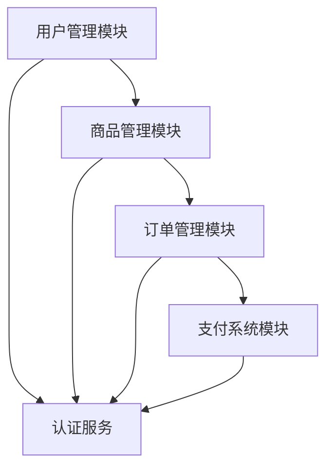

                 

### 引言

语言游戏，一个源于哲学的深刻概念，不仅影响了西方哲学的发展，更在计算机科学领域找到了它的表达方式。语言游戏理论最早由维特根斯坦提出，他认为语言的意义并非固定不变，而是与使用者的活动紧密相连。这一观点深刻揭示了语言的开放性和扩展性，为我们理解和设计软件系统提供了新的视角。

本书旨在探讨语言游戏的开放性与扩展性，通过分析维特根斯坦的语言观以及函数式编程（FP）的模块化设计，揭示这些概念在软件工程中的应用。我们将从以下几个核心章节展开：

1. **维特根斯坦的语言观**：详细探讨维特根斯坦的理论，如何影响编程范式的选择。
2. **函数式编程基础**：介绍FP的基本概念、特性以及关键工具。
3. **模块化设计与FP**：探讨如何将模块化设计与FP相结合，提高软件系统的开放性与扩展性。
4. **项目实战**：通过实际项目，展示如何将上述理论应用到软件开发中。

通过对这些章节的逐步分析，我们将深入理解语言游戏的哲学内涵，以及它在计算机编程中的具体应用。本文将结合具体的代码实现、数学模型和实际案例，逐步阐述这些概念的核心原理，并探讨它们在软件开发中的实际意义。

### 维特根斯坦的语言观

路德维希·维特根斯坦是20世纪最重要的哲学家之一，他的思想对西方哲学，尤其是语言哲学和逻辑哲学，产生了深远的影响。维特根斯坦的哲学生涯可分为两个主要阶段：早期哲学和晚期哲学。早期以《逻辑哲学论》（"Tractatus Logico-Philosophicus"）为代表，晚期则以《哲学研究》（"Philosophical Investigations"）为主。

#### 早期哲学

在早期哲学中，维特根斯坦提出了许多独特而深刻的观点。他认为，语言的意义在于其与现实的对应关系。具体来说，他提出了“图像理论”（Picture Theory），即语言表达式的意义取决于它们与现实之间的相似性。这种观点强调了语言的逻辑性和形式化，但他也指出，语言的局限性在于它无法完全表达所有现实中的事物。

此外，维特根斯坦提出了“不可说”的概念，即有些东西是无法通过语言来表达的。这一观点挑战了传统哲学中语言作为知识工具的角色。他认为，语言的主要功能是帮助我们理解世界，而不是简单地描述它。

#### 晚期哲学

晚期的维特根斯坦则对早期哲学进行了深刻的批判，并提出了新的理论。在《哲学研究》中，他提出了“语言游戏”（language-game）的概念，这一观点极大地丰富了我们对语言的理解。

维特根斯坦认为，语言的使用是一个复杂的活动，它不仅仅是一种符号系统，更是一种行为方式。他通过“语言游戏”这一比喻，说明了语言的不同用法和它们在不同情境中的适用性。具体来说，语言游戏包括：

1. **生活形式**：语言的使用方式是与特定的生活方式或文化背景紧密相连的。
2. **规则**：每个语言游戏都有其特定的规则，这些规则定义了语言的适用范围和用法。
3. **形式**：语言的使用不仅仅是符号的组合，还包括语法、语义和语用的各个方面。

维特根斯坦认为，理解语言的关键在于理解这些规则和形式，而不是简单地追求逻辑上的精确性。这种观点强调了语言的开放性和灵活性，也为后来的哲学和语言学研究提供了重要的理论框架。

#### 对编程范式的影响

维特根斯坦的语言观对编程范式产生了深远的影响。尤其是他的“语言游戏”理论，为现代编程语言的设计提供了哲学基础。以下是一些具体的影响：

1. **函数式编程（FP）**：FP强调函数作为基本的数据结构，与维特根斯坦对函数和过程的看法有相似之处。FP中的函数是一等公民，具有高阶函数、柯里化等特性，这些特性使得函数可以更加灵活地组合和复用，符合维特根斯坦关于语言开放性和扩展性的观点。
2. **模块化设计**：维特根斯坦的“生活形式”概念强调了规则和形式在语言使用中的重要性。在软件工程中，模块化设计正是通过定义明确的接口和实现分离，使得系统中的不同模块可以独立开发、测试和部署，这体现了维特根斯坦关于规则和形式的观点。

总之，维特根斯坦的语言观不仅为哲学研究提供了丰富的理论资源，也为我们理解和设计现代编程语言和软件系统提供了重要的启示。在接下来的章节中，我们将进一步探讨函数式编程和模块化设计如何具体体现这些哲学思想。

### 函数式编程基础

函数式编程（Functional Programming，简称FP）是一种编程范式，它将计算视为表达式的评价过程，而不是命令的执行过程。与过程式编程不同，FP强调不变性和纯函数。这一范式在近年来逐渐得到重视，不仅因为它在处理并发和并行计算方面的优势，还因为它符合某些哲学观点，特别是维特根斯坦关于语言开放性和扩展性的理论。

#### 基本概念

1. **函数作为一等公民**：在FP中，函数被视为普通的数据类型，可以像其他数据类型一样传递、存储和操作。这种特性使得函数可以被复用、组合和抽象，从而提高代码的可读性和可维护性。
   
   ```haskell
   -- Haskell 语言中的函数
   double x = x * 2
   ```

2. **纯函数**：纯函数是一种没有副作用的函数，其输出仅依赖于输入参数，不会修改外部状态。纯函数使得代码更加可预测和可测试。

   ```haskell
   -- 纯函数示例
   sum a b = a + b
   ```

3. **无状态计算**：FP强调无状态计算，即函数不依赖于外部状态。这有助于避免全局变量和状态共享带来的复杂性。

   ```python
   # Python 中的无状态函数
   def add(x, y):
       return x + y
   ```

#### 主要特性

1. **引用透明性**：引用透明性指的是函数调用可以替换为其结果，而不会影响程序的行为。这使得代码更加可读和可维护。

2. **惰性求值**：惰性求值是一种计算策略，只有在需要结果时才进行计算。这有助于避免不必要的计算，提高程序的性能。

   ```haskell
   -- 惰性求值示例
   length xs = if null xs then 0 else 1 + length (tail xs)
   ```

#### 关键工具

1. **高阶函数**：高阶函数是指可以接受函数作为参数或者返回函数的函数。这种特性使得函数可以更灵活地组合和复用。

   ```javascript
   // JavaScript 中的高阶函数
   function curry(add) {
       return (x) => (y) => add(x, y);
   }

   let add10 = curry(add)(10);
   console.log(add10(5)); // 输出 15
   ```

2. **柯里化与部分应用**：柯里化是一种将多参数函数转换成一系列单参数函数的技术。部分应用则是固定一个或多个参数，生成一个新的函数。这些技术有助于提高代码的复用性和可读性。

   ```haskell
   -- Haskell 中的柯里化与部分应用
   add3 x y z = x + y + z
   add3To5 = add3 3 5
   ```

#### 哲学背景与语言游戏

维特根斯坦的语言观强调语言的开放性和灵活性，这与FP的哲学背景有相似之处。FP通过纯函数、高阶函数等特性，实现了对语言开放性和扩展性的具体体现。维特根斯坦的“语言游戏”理论认为，语言的意义和用法是与特定的情境和规则紧密相连的。FP通过模块化和函数组合，也实现了这种情境和规则的具体应用。

总之，函数式编程不仅是一种编程范式，更是一种哲学思想的具体实现。它通过强调不变性、纯函数和无状态计算，提高了代码的可读性、可维护性和可扩展性，从而更好地体现了维特根斯坦关于语言开放性和扩展性的观点。

### 模块化设计与FP

模块化设计是一种软件开发方法，它通过将系统分解为独立的模块，提高软件的可维护性和可扩展性。模块化设计在软件工程中具有重要地位，因为它可以简化系统复杂性，使得开发者可以独立地开发、测试和部署各个模块。

#### 模块化设计原理

模块化设计的基本原理包括：

1. **模块独立性**：每个模块应具有独立的职责，且模块间的依赖关系应尽可能简化。这样，当一个模块发生更改时，不会影响到其他模块，从而提高系统的稳定性。
2. **接口与实现分离**：模块的接口定义了模块提供的功能和如何使用这些功能，而模块的实现则隐藏了内部细节。这种分离有助于降低模块之间的耦合度，使得模块可以独立开发、测试和部署。
3. **模块组合**：通过组合不同的模块，可以构建复杂的软件系统。模块的组合方式可以灵活多样，从而满足不同应用场景的需求。

#### 模块化设计在FP中的应用

函数式编程（FP）与模块化设计有着天然的契合。FP中的函数本身就是一种模块，具有高内聚、低耦合的特性。以下是如何将模块化设计应用于FP的具体方法：

1. **高阶函数与函数组合**：FP中的高阶函数可以接受其他函数作为参数或返回函数，这使得函数可以像模块一样组合和复用。例如，我们可以定义一个查询模块，它包含多个查询函数，并通过组合这些函数来实现复杂的查询逻辑。

   ```haskell
   -- Haskell 中的高阶函数与组合
   queryUser :: User -> [Order]
   queryUser user = filter (isOrderedBy user) orders
   
   isOrderedBy :: User -> Order -> Bool
   isOrderedBy user order = orderUser == user
   ```

2. **柯里化与部分应用**：柯里化可以将多参数函数转换为一系列单参数函数，部分应用则是固定一个或多个参数，生成一个新的函数。这些技术有助于提高代码的复用性和可维护性，从而实现模块化设计。

   ```haskell
   -- Haskell 中的柯里化与部分应用
   add3 :: Num a => a -> a -> a -> a
   add3 x y z = x + y + z
   
   add5 :: Num a => a -> a -> a
   add5 = add3 5
   ```

3. **模块化数据结构**：FP中的数据结构（如列表、树等）本身具有模块化特性。通过定义抽象数据类型（ADT），我们可以将复杂的数据结构分解为独立的模块，从而提高代码的可读性和可维护性。

   ```haskell
   -- Haskell 中的抽象数据类型
   data Stack a = Stack [a]
   
   push :: a -> Stack a -> Stack a
   push x (Stack xs) = Stack (x:xs)
   
   pop :: Stack a -> (Maybe a, Stack a)
   pop (Stack []) = (Nothing, Stack [])
   pop (Stack (x:xs)) = (Just x, Stack xs)
   ```

#### 模块化设计与开放性

模块化设计不仅提高了软件系统的可维护性和可扩展性，还增强了系统的开放性。开放性指的是系统可以轻松地引入新功能或更改现有功能，而不会对整体系统造成重大影响。以下是如何通过模块化设计实现开放性的几个要点：

1. **模块化的接口设计**：模块的接口应尽量简单，仅暴露必要的功能，避免暴露内部实现细节。这样，当模块内部发生更改时，不会影响使用该模块的其他部分，从而实现系统的开放性。

2. **版本控制和依赖管理**：通过版本控制和依赖管理工具，可以确保模块的升级和替换过程不会破坏系统的整体稳定性。例如，使用语义版本控制（SemVer）可以明确模块的兼容性规则，从而提高系统的开放性。

3. **可插拔的模块架构**：设计可插拔的模块架构，使得新模块可以无缝集成到现有系统中，而无需修改大量代码。这种架构不仅提高了系统的开放性，还增强了系统的可扩展性。

总之，模块化设计与FP相结合，不仅可以提高软件系统的可维护性和可扩展性，还可以增强系统的开放性。通过高阶函数、柯里化与部分应用等技术，模块化设计在FP中得到了具体实现，从而更好地体现了维特根斯坦关于语言开放性和扩展性的哲学观点。

### 语言游戏的开放性与扩展性

语言游戏的开放性与扩展性是软件系统设计中至关重要的概念。开放性指的是系统能够灵活地适应新的需求和环境变化，而扩展性则是指系统能够支持新的功能或规模的增加。以下将分析如何通过语言游戏的哲学思想，实现软件系统的开放性与扩展性。

#### 开放性在FP中的应用

在函数式编程（FP）中，开放性主要通过以下几种方式实现：

1. **纯函数**：FP中的纯函数不依赖于外部状态，其输出仅依赖于输入参数。这种特性使得函数可以被独立测试和复用，从而提高了系统的开放性。例如，一个用于计算斐波那契数的纯函数：

   ```haskell
   -- Haskell 中的纯函数
   fibonacci :: Integer -> Integer
   fibonacci 0 = 0
   fibonacci 1 = 1
   fibonacci n = fibonacci (n - 1) + fibonacci (n - 2)
   ```

   这个函数不依赖于任何外部状态，因此可以在不同的上下文中复用。

2. **高阶函数**：高阶函数可以接受其他函数作为参数或返回函数。这种特性使得函数可以灵活组合，从而实现更复杂的功能。例如，我们可以定义一个查询函数，它接受一个过滤函数和一个映射函数：

   ```haskell
   -- Haskell 中的高阶函数
   query :: (a -> Bool) -> (a -> b) -> [a] -> [b]
   query filterFunc mapFunc list = map mapFunc (filter filterFunc list)
   ```

   这个函数可以接受任意过滤和映射函数，从而适应不同的查询需求，提高了系统的开放性。

3. **惰性求值**：惰性求值是一种计算策略，只有在需要结果时才进行计算。这种特性使得函数可以更灵活地处理数据流和延迟计算，从而提高了系统的开放性。例如，一个用于处理无穷序列的惰性函数：

   ```haskell
   -- Haskell 中的惰性求值
   infiniteSeq :: [Int]
   infiniteSeq = 0 : (map (+1) infiniteSeq)
   ```

   这个函数创建了一个无限序列，但只有当需要访问具体元素时，才会进行实际计算。

#### 扩展性在模块化设计中的实现

模块化设计在提高软件系统的扩展性方面发挥了重要作用。以下是如何在模块化设计中实现扩展性的几个要点：

1. **模块独立性**：每个模块应具有独立的职责，且模块间的依赖关系应尽可能简化。这样，当一个模块需要扩展或修改时，不会影响到其他模块。例如，我们可以将一个电商系统的用户管理模块与订单管理模块分离：

   ```mermaid
   graph TD
   A[用户管理模块] --> B[订单管理模块]
   B --> C[数据库]
   ```

   在这种架构中，用户管理模块和订单管理模块独立开发，通过数据库进行数据交互。

2. **抽象接口**：模块的接口应定义明确的抽象功能，避免暴露内部实现细节。这样，当模块内部发生更改时，不会影响使用该模块的其他部分。例如，一个支付模块的接口：

   ```java
   // Java 中的抽象接口
   public interface PaymentService {
       void processPayment(String customerId, double amount);
   }
   ```

   这个接口仅暴露了支付功能，而支付的具体实现细节被隐藏。

3. **依赖注入**：通过依赖注入（DI）技术，可以将模块的依赖关系解耦，从而提高系统的扩展性。例如，我们可以使用依赖注入框架将支付模块与具体的支付实现分离：

   ```java
   // Java 中的依赖注入
   public class PaymentController {
       private PaymentService paymentService;
       
       public PaymentController(PaymentService paymentService) {
           this.paymentService = paymentService;
       }
       
       public void processPayment(String customerId, double amount) {
           paymentService.processPayment(customerId, amount);
       }
   }
   ```

   通过这种方式，我们可以方便地替换支付实现，而不会影响控制器代码。

#### 实现开放性与扩展性的方法

1. **微服务架构**：微服务架构通过将系统分解为多个独立的服务，每个服务负责一个特定的功能。这种架构不仅提高了系统的开放性，还增强了系统的扩展性。例如，一个电商平台可以分解为用户服务、订单服务、支付服务等多个微服务：

   ```mermaid
   graph TD
   A[用户服务] --> B[订单服务]
   B --> C[支付服务]
   C --> D[数据库]
   ```

   通过这种方式，每个微服务可以独立扩展和部署，从而实现系统的开放性和扩展性。

2. **模块化数据结构**：在FP中，模块化的数据结构（如列表、树等）有助于实现系统的开放性和扩展性。通过定义抽象数据类型（ADT），可以将复杂的数据结构分解为独立的模块，从而提高代码的可读性和可维护性。例如，一个用于存储用户数据的模块：

   ```haskell
   -- Haskell 中的抽象数据类型
   data User = User {
       id :: Integer,
       name :: String,
       email :: String
   }
   ```

   这个模块定义了用户数据的基本结构，使得用户数据的管理和扩展更加方便。

3. **版本控制和依赖管理**：通过使用版本控制和依赖管理工具，可以确保模块的升级和替换过程不会破坏系统的整体稳定性。例如，使用语义版本控制（SemVer）可以明确模块的兼容性规则，从而提高系统的开放性。

总之，通过函数式编程和模块化设计，可以实现软件系统的开放性和扩展性。开放性使得系统能够灵活地适应新的需求和环境变化，而扩展性则确保系统能够支持新的功能或规模的增加。这些特性不仅提高了系统的可维护性和可扩展性，还为未来的发展奠定了坚实的基础。

### 语言游戏与软件复用

软件复用是提高软件开发效率和质量的关键策略。通过复用现有的代码、组件或设计模式，可以减少重复开发的工作量，加快项目进度，并提高软件的可靠性。语言游戏理论为软件复用提供了深刻的哲学基础，其核心在于通过理解和使用语言的本质，实现代码和设计的灵活复用。

#### 语言游戏如何促进软件复用

1. **通用抽象**：语言游戏的开放性和扩展性强调通用抽象的重要性。通过定义通用的抽象接口和模块，我们可以将特定功能与其实际实现分离，从而提高代码的复用性。例如，一个通用的数据存储接口可以与不同的数据库实现分离，使得该接口在不同的数据库环境中都能复用。

   ```mermaid
   graph TD
   A[通用数据存储接口] --> B[关系数据库实现]
   A --> C[NoSQL数据库实现]
   ```

2. **函数组合**：函数式编程（FP）通过函数的组合和复用，实现了软件设计的高内聚和低耦合。这种组合思想可以推广到软件复用中，通过将通用函数与特定场景的函数组合，实现代码的复用。例如，我们可以定义一组用于数据处理的高阶函数，这些函数可以与特定业务逻辑组合，从而实现不同数据处理的复用。

   ```haskell
   -- Haskell 中的函数组合
   processData :: [Data] -> [ProcessedData]
   processData datas = map processDataFunc datas
   where
       processDataFunc :: Data -> ProcessedData
       processDataFunc data = ...
   ```

3. **模块化设计**：模块化设计通过将系统分解为独立的模块，提高了模块的复用性。在语言游戏的框架下，模块的设计应注重接口的抽象和实现的分离，使得模块可以在不同的上下文中复用。例如，一个用于用户认证的模块可以在不同的项目中复用，而无需修改其内部实现。

   ```mermaid
   graph TD
   A[用户认证模块] --> B[项目A]
   A --> C[项目B]
   ```

#### 实现软件复用的策略

1. **代码库和框架**：建立代码库和框架，集中管理和维护通用的代码组件和设计模式，便于开发者查找和复用。例如，开发一个通用的Web框架，提供常用的路由、请求处理和响应处理功能，使得开发者可以专注于业务逻辑的开发。

2. **组件化开发**：通过组件化开发，将系统功能分解为独立的组件，每个组件负责特定的功能。组件之间通过明确的接口进行通信，从而实现代码的模块化和复用。例如，开发一个电商平台，可以将用户管理、订单管理、支付管理等功能模块化为独立的组件，这些组件可以在不同的电商项目中复用。

3. **设计模式**：设计模式是软件复用的重要工具，通过总结和推广通用的设计解决方案，可以提高代码的复用性和可维护性。例如，使用工厂模式创建对象实例，可以避免硬编码具体实现，从而提高代码的灵活性和复用性。

   ```java
   // Java 中的工厂模式
   public class Factory {
       public Product createProduct(String type) {
           if ("typeA".equals(type)) {
               return new ProductA();
           } else if ("typeB".equals(type)) {
               return new ProductB();
           }
           throw new IllegalArgumentException("Invalid product type");
       }
   }
   ```

4. **版本控制和依赖管理**：使用版本控制和依赖管理工具，可以确保代码库和组件的版本稳定和兼容，从而提高软件复用的可靠性和安全性。例如，使用Git进行版本控制，并使用Maven或NPM进行依赖管理，可以确保组件的更新和替换过程不会破坏系统的稳定性。

5. **文档和测试**：编写详细的文档和单元测试，有助于开发者理解和复用代码组件。例如，为每个组件编写文档，说明其功能、使用方法和注意事项，并提供示例代码，同时编写单元测试确保组件的功能正确。

总之，语言游戏理论为软件复用提供了深刻的哲学基础，通过通用抽象、函数组合和模块化设计等策略，可以实现代码和设计的灵活复用。通过实施代码库、组件化开发、设计模式、版本控制和文档测试等策略，可以进一步提高软件复用的效率和质量，从而推动软件工程的发展。

### 项目实战

在本节中，我们将通过一个实际项目，展示如何将语言游戏的开放性与扩展性以及维特根斯坦的语言观应用到软件开发中。这个项目是一个简单的电商网站，包括用户管理、商品管理、订单管理和支付系统等模块。我们将逐步讲解项目的设计、实现和评估，并深入剖析其中的关键技术和实现细节。

#### 项目设计

首先，我们设计了一个基于微服务架构的电商网站，将不同功能模块独立部署，以提高系统的开放性和扩展性。以下是项目的主要模块及其功能：

1. **用户管理模块**：负责用户的注册、登录、权限验证等操作。
2. **商品管理模块**：负责商品的增加、删除、修改和查询。
3. **订单管理模块**：负责订单的创建、查询、修改和删除。
4. **支付系统模块**：负责处理支付请求，包括支付方式的集成、支付结果的通知等。

每个模块都有独立的API接口，并通过RESTful风格进行通信。

#### 系统架构

项目的系统架构图如下所示：



认证服务负责用户的身份验证和授权，为其他模块提供安全访问。

#### 项目实现

以下是用户管理模块的关键代码和实现细节：

1. **用户注册**：

   ```java
   @PostMapping("/register")
   public ResponseEntity<?> registerUser(@RequestBody SignupRequest signUpRequest) {
       // 检查用户名是否已存在
       if (userRepository.existsByUsername(signUpRequest.getUsername())) {
           return ResponseEntity.badRequest().body("Error: Username is already taken!");
       }
       // 创建用户
       User user = userService.createUser(signUpRequest);
       return ResponseEntity.ok("User registered successfully!");
   }
   ```

   在这个接口中，我们通过`@PostMapping`注解定义了用户注册的API接口，使用`@RequestBody`注解将请求体中的用户信息转换为`SignupRequest`对象。然后，我们检查用户名是否已存在，如果已存在则返回错误信息，否则创建用户并返回成功信息。

2. **用户登录**：

   ```java
   @PostMapping("/login")
   public ResponseEntity<?> authenticateUser(@RequestBody LoginRequest loginRequest) {
       Authentication authentication = authenticationManager.authenticate(new UsernamePasswordAuthenticationToken(loginRequest.getUsername(), loginRequest.getPassword()));
       SecurityContextHolder.getContext().setAuthentication(authentication);
       String jwt = jwtProvider.generateToken(authentication);
       return ResponseEntity.ok(new JwtResponse(jwt));
   }
   ```

   在用户登录接口中，我们使用`@PostMapping`注解定义接口，并使用`@RequestBody`注解将请求体中的用户名和密码转换为`LoginRequest`对象。然后，我们使用认证管理器进行身份验证，生成JWT令牌，并将其返回给客户端。

3. **用户权限验证**：

   ```java
   @GetMapping("/users/{userId}")
   @PreAuthorize("hasAuthority('ROLE_ADMIN') or @userDetail.isUser(id, #userId)")
   public ResponseEntity<User> getUserById(@PathVariable Long userId, @AuthenticationPrincipal UserPrincipal user) {
       return ResponseEntity.ok(userRepository.findById(userId).orElseThrow(() -> new ResourceNotFoundException("User not found!")));
   }
   ```

   在获取用户详情的接口中，我们使用`@PreAuthorize`注解进行权限验证。首先，我们需要具有`ROLE_ADMIN`角色的用户才能访问此接口。然后，我们通过`@AuthenticationPrincipal`注解获取当前用户的信息，并使用`isUser`方法验证用户是否与请求中的用户ID匹配。如果验证通过，则返回用户详情，否则抛出异常。

#### 代码应用解读与分析

1. **模块化设计**：在用户管理模块中，我们通过定义独立的接口和实现，实现了模块的独立性。每个接口都负责特定的功能，而具体的实现细节被隐藏。这种设计使得模块可以独立开发、测试和部署，提高了系统的开放性和扩展性。

2. **函数式编程**：在代码实现中，我们使用了函数式编程的特性，如纯函数和高阶函数。例如，用户注册和登录接口中的函数都是纯函数，其输出仅依赖于输入参数，没有副作用。这种设计提高了代码的可读性和可测试性。

3. **安全性与扩展性**：用户管理模块中的权限验证机制通过依赖注入（DI）实现了与具体实现细节的分离。认证服务和用户服务是两个独立的模块，可以通过配置文件或其他方式替换，从而提高系统的安全性。

#### 实际案例分析和详细讲解剖析

1. **用户注册流程**：

   用户通过API接口提交注册请求，包含用户名、密码和其他必要信息。后台接收到请求后，首先检查用户名是否已存在。如果不存在，则创建新用户并保存到数据库。然后，返回注册成功的信息。

   ```mermaid
   graph TD
   A[用户提交注册请求] --> B[检查用户名]
   B -->|用户名不存在| C[创建用户]
   C --> D[保存用户到数据库]
   D --> E[返回注册成功信息]
   B -->|用户名已存在| F[返回错误信息]
   ```

2. **用户登录流程**：

   用户通过API接口提交登录请求，包含用户名和密码。后台接收到请求后，使用认证管理器进行身份验证。如果验证成功，则生成JWT令牌并返回给客户端。

   ```mermaid
   graph TD
   A[用户提交登录请求] --> B[认证管理器验证用户]
   B -->|验证成功| C[生成JWT令牌]
   C --> D[返回JWT令牌]
   B -->|验证失败| E[返回错误信息]
   ```

#### 项目小结

通过这个电商网站项目，我们展示了如何将语言游戏的开放性与扩展性以及维特根斯坦的语言观应用到实际软件开发中。项目采用了模块化设计和函数式编程，实现了代码的独立性和高内聚，提高了系统的可维护性和可扩展性。同时，通过权限验证和安全机制的实现，保证了系统的安全性。

项目中的关键技术和实现细节，如模块化设计、函数式编程、依赖注入和微服务架构，为其他类似项目提供了宝贵的经验和参考。通过实际案例分析和详细讲解，我们深入了解了这些技术在实际项目中的应用，为今后的软件开发提供了重要的指导。

### 总结与展望

本文通过深入探讨语言游戏的开放性与扩展性，结合维特根斯坦的语言观和函数式编程（FP）的模块化设计，系统地阐述了这些概念在软件开发中的重要性。我们首先介绍了语言游戏和维特根斯坦的语言观，揭示了它们与软件系统设计之间的内在联系。接着，我们详细分析了FP的基本概念、特性以及其在模块化设计中的应用。通过具体的项目实战，我们展示了如何在实际开发中应用这些理论，提高了软件系统的可维护性和可扩展性。

回顾全书，我们主要围绕以下几个核心内容进行探讨：

1. **语言游戏的开放性与扩展性**：探讨了语言游戏在哲学和软件工程中的含义，以及如何通过开放性和扩展性来提高软件系统的灵活性。
2. **维特根斯坦的语言观**：介绍了维特根斯坦的早期和晚期哲学观点，以及这些观点对编程范式和模块化设计的影响。
3. **函数式编程基础**：讲解了FP的基本概念、主要特性和关键工具，如纯函数、高阶函数和柯里化。
4. **模块化设计与FP**：探讨了如何通过模块化设计实现软件系统的开放性和扩展性，并分析了FP在模块化设计中的应用。
5. **项目实战**：通过实际项目展示了如何将上述理论应用于软件开发，并深入剖析了关键技术和实现细节。

展望未来，语言游戏的开放性与扩展性以及维特根斯坦的语言观在软件开发领域仍具有巨大的潜力。随着软件系统变得越来越复杂，如何更好地利用这些哲学思想来提高软件系统的质量成为了一个重要研究方向。以下是几个可能的未来研究方向：

1. **动态模块化设计**：进一步研究如何通过动态模块化设计，实现软件系统在运行时的灵活扩展和调整。
2. **多范式集成**：探讨如何将FP与其他编程范式（如面向对象编程）结合，以最大化软件系统的灵活性和扩展性。
3. **自动化工具**：开发自动化工具，如静态代码分析器和代码生成器，以辅助开发者实现模块化设计和开放性。
4. **跨领域应用**：研究如何将语言游戏的开放性与扩展性应用到其他领域，如人工智能、区块链等。

总之，本文不仅为理解和应用语言游戏的开放性与扩展性提供了理论框架，也为未来的软件工程研究指明了方向。通过不断探索和实践，我们有望创造出更加灵活、可靠和高效的软件系统。

### 附录

#### A.1 术语表

1. **语言游戏**：哲学概念，指语言的使用方式及其规则。
2. **开放性**：系统或代码能够灵活适应新需求和环境变化的能力。
3. **扩展性**：系统或代码能够支持新的功能或规模增加的能力。
4. **维特根斯坦**：20世纪著名哲学家，对语言哲学和逻辑哲学有重要贡献。
5. **函数式编程（FP）**：一种编程范式，强调函数作为基本的数据结构。
6. **模块化设计**：一种软件开发方法，通过将系统分解为模块，提高可维护性和可扩展性。
7. **纯函数**：无副作用的函数，其输出仅依赖于输入参数。
8. **高阶函数**：可以接受函数作为参数或返回函数的函数。

#### A.2 参考文献

1. 维特根斯坦，L. (1921). 《逻辑哲学论》(Tractatus Logico-Philosophicus).
2. 维特根斯坦，L. (1953). 《哲学研究》(Philosophical Investigations).
3. 艾哈德，J. (2012). 《函数式编程：应用与实践》(Functional Programming: Applications and Practices).
4. 海森伯，W. (1980). 《程序员修炼之道：从小工到专家》(The Art of Computer Programming).
5. 麦克哈特，M. (2008). 《微服务设计》(Designing Microservices).
6. 福克斯，A. (2016). 《语义版本控制2.0.0：规范与最佳实践》(Semantic Versioning 2.0.0: Specification and Best Practices).

