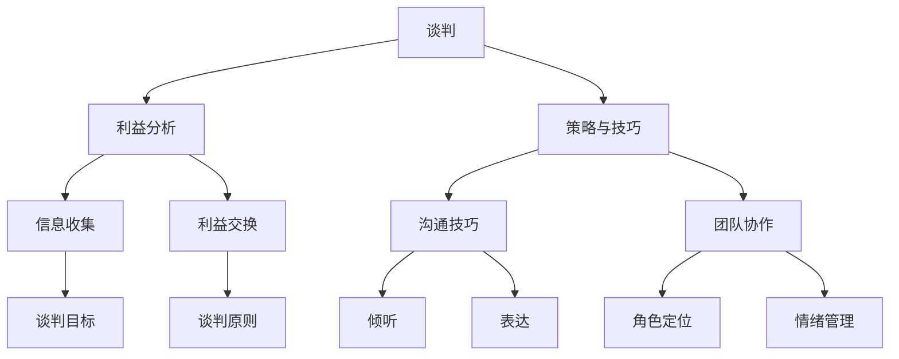
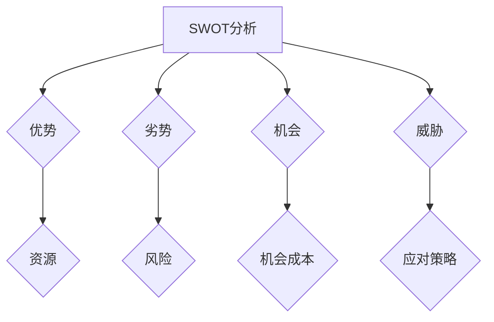
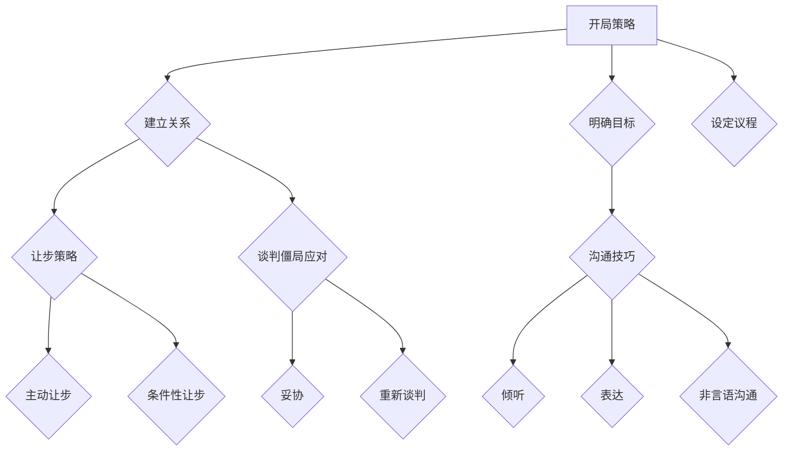
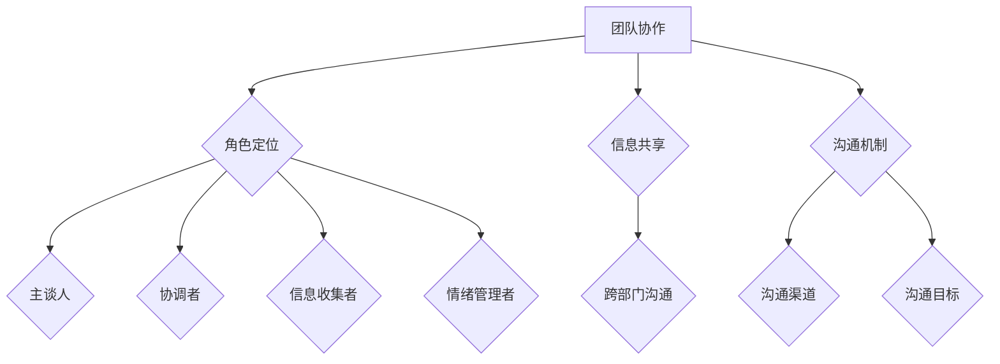
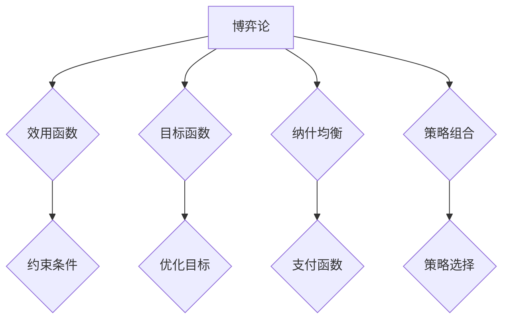

                 

### 文章标题

# 谈判技巧：为团队争取最大利益

> 关键词：谈判技巧、团队利益、谈判策略、谈判技巧实践

> 摘要：本文深入探讨了谈判技巧在团队利益争取中的重要性。通过分析谈判的基本原则、利益分析、谈判策略与技巧、团队协作以及经典谈判案例分析，本文旨在为读者提供一套实用的谈判技巧框架，帮助团队在谈判过程中实现最大利益化。

## 第一部分：谈判基础

### 第1章：谈判的定义与核心原则

#### 1.1 谈判的定义与分类

谈判是指在不同利益主体之间，通过交流、协商和妥协，达成共同利益的过程。根据谈判的性质和目的，可以分为以下几种类型：

1. 合作性谈判：各参与方共同努力，寻求共同利益的最大化。
2. 竞争性谈判：各参与方以自己的利益为目标，进行博弈和竞争。
3. 非合作性谈判：各参与方利益冲突，难以达成共识。

#### 1.2 谈判的核心原则

1. **尊重与信任**：谈判过程中，各方应尊重对方的意见和立场，建立信任关系。
2. **共赢**：谈判的目标是寻求各方的共同利益，实现双赢或多赢。
3. **开放性沟通**：谈判各方应保持开放性沟通，充分表达自己的想法和需求。
4. **灵活性**：在谈判过程中，各方应具备灵活性，根据实际情况调整策略和立场。
5. **原则性**：各方在谈判过程中应坚持自己的原则，不轻易妥协。

#### 1.3 谈判的准备工作

1. **信息收集**：了解谈判对方的背景、需求和利益点。
2. **制定谈判目标**：明确自己在谈判中的目标和底线。
3. **谈判团队的组建**：确定主谈人和团队成员，明确各自的职责和角色。

## 第二部分：谈判策略

### 第2章：谈判者的自我提升

#### 2.1 自我认知与角色定位

1. **自我认知的重要性**：了解自己的优势和劣势，明确自己在谈判中的角色。
2. **角色定位的影响**：不同的角色定位会影响谈判的策略和效果。

#### 2.2 情绪管理与心理准备

1. **情绪管理的方法**：学会控制自己的情绪，避免在谈判中因情绪波动而影响决策。
2. **心理准备的重要性**：谈判前做好心理准备，提高自信心和应对压力的能力。
3. **常见心理压力的应对策略**：如紧张、焦虑、沮丧等。

#### 2.3 谈判技能的全面提升

1. **谈判技巧的提升路径**：通过学习、实践和反思，不断提高自己的谈判技能。
2. **谈判训练与模拟**：通过模拟谈判场景，锻炼自己的谈判能力和应变能力。

## 第三部分：谈判策略与技巧

### 第3章：利益分析与交换

#### 3.1 利益分析的基本方法

1. **SWOT分析**：对自身和对方的优劣势、机会和威胁进行综合分析。
2. **马克思-奥尔森模型**：分析谈判各方在利益分配中的权力和影响力。
3. **多属性效用理论**：对谈判各方在不同利益指标上的效用进行量化分析。

#### 3.2 利益交换的策略

1. **对称性策略**：在利益交换中，保持双方的权益平衡。
2. **非对称性策略**：根据谈判实际情况，调整双方的权益比例。
3. **集约化策略**：通过整合资源和利益，实现整体利益的最大化。

#### 3.3 跨文化谈判中的利益分析

1. **跨文化谈判的特点**：涉及不同文化背景的谈判，具有更高的复杂性和不确定性。
2. **跨文化谈判的利益分析策略**：充分考虑文化差异，调整利益分配策略。
3. **跨文化谈判中的文化差异与应对**：了解对方文化，尊重文化差异，避免文化冲突。

### 第4章：谈判策略与技巧

#### 4.1 开局策略

1. **建立关系**：通过交谈、问候等方式，与对方建立友好关系。
2. **明确目标**：明确自己在谈判中的目标和期望，为后续谈判奠定基础。
3. **设定议程**：制定谈判议程，确保谈判有序进行。

#### 4.2 让步策略

1. **让步的类型**：根据谈判情境，选择合适的让步方式。
2. **让步的时机**：在适当的时机进行让步，以达到最佳效果。
3. **让步的原则**：让步要符合自身利益，同时保持原则性。

#### 4.3 谈判僵局的应对策略

1. **妥协**：在无法达成一致时，寻求妥协方案。
2. **重新谈判**：重新审视谈判目标和策略，寻找新的突破点。
3. **寻求第三方调解**：在谈判僵局时，寻求第三方调解，以促进谈判进展。

#### 4.4 谈判中的沟通技巧

1. **倾听**：认真倾听对方的意见和需求，以获取更多信息。
2. **表达**：清晰、准确地表达自己的观点和立场。
3. **非言语沟通**：注意自己的语言、肢体动作和表情，以传递积极的沟通信息。

## 第四部分：实战案例

### 第5章：谈判中的团队协作

#### 5.1 团队协作在谈判中的重要性

1. **团队协作的优势**：提高谈判效率，增强团队凝聚力。
2. **谈判中的团队协作模式**：明确团队角色，分工合作，共同推进谈判进程。

#### 5.2 团队成员的角色与责任

1. **主谈人与协调者**：主谈人负责主导谈判，协调者负责协调团队内部和外部关系。
2. **信息收集者与分析者**：负责收集和分析谈判相关信息，为谈判提供支持。
3. **情绪管理者与心理支持者**：负责管理团队成员的情绪，提供心理支持。

#### 5.3 跨部门谈判中的团队协作

1. **跨部门团队的组织结构**：明确跨部门团队的组织架构和沟通机制。
2. **跨部门沟通的挑战与对策**：解决跨部门沟通中的问题，提高沟通效率。
3. **跨部门谈判中的协作技巧**：充分考虑各部门的利益和需求，实现协同合作。

### 第6章：经典谈判案例分析

#### 6.1 案例一：收购谈判

1. **案例背景**：某企业计划收购另一家企业。
2. **谈判策略与技巧**：采用SWOT分析、马克思-奥尔森模型等工具，制定合理的谈判策略。
3. **案例结果与启示**：成功达成收购协议，为双方带来双赢的结果。

#### 6.2 案例二：薪资谈判

1. **案例背景**：一名员工与公司进行薪资谈判。
2. **谈判策略与技巧**：采用利益交换策略，以提升个人价值和市场需求为依据进行谈判。
3. **案例结果与启示**：成功获得理想的薪资待遇，提高了员工的积极性和满意度。

#### 6.3 案例三：合同谈判

1. **案例背景**：某企业与供应商进行合同谈判。
2. **谈判策略与技巧**：重点关注合同条款、利益分配和风险控制，确保双方利益平衡。
3. **案例结果与启示**：成功签订公平、合理的合同，为双方合作奠定了良好基础。

## 第五部分：谈判技巧实践

### 第7章：谈判技巧实践

#### 7.1 实践准备

1. **环境搭建**：准备好谈判所需的工具和环境，如会议室、沟通设备等。
2. **资料准备**：收集与谈判相关的资料，如市场行情、对方信息、谈判策略等。

#### 7.2 谈判模拟

1. **模拟场景**：根据实际谈判情况，模拟谈判过程。
2. **角色扮演**：团队成员分别扮演不同角色，进行角色扮演和演练。

#### 7.3 实践反馈与总结

1. **实践反馈**：在谈判结束后，对谈判过程和结果进行总结和反思。
2. **总结经验**：从实践中总结经验教训，为未来的谈判提供借鉴。

### 附录

#### 第8章：谈判资源与工具

1. **谈判技巧相关书籍推荐**：
   - 《谈判力》
   - 《谈判的艺术》
   - 《优势谈判》

2. **谈判技巧在线课程推荐**：
   - Coursera上的《谈判学》
   - Udemy上的《高级谈判技巧》
   - LinkedIn Learning上的《谈判策略与技巧》

3. **谈判技巧实践平台推荐**：
   - NegotationSim
   - NegotiatorPro
   -争吵与和解平台（Mediators.org）

## 文章小结

本文系统地介绍了谈判技巧在团队利益争取中的重要性，涵盖了谈判的定义与核心原则、谈判者的自我提升、谈判策略与技巧、团队协作以及经典谈判案例分析。通过学习本文，读者可以掌握一套实用的谈判技巧框架，提高自己在谈判中的能力和成功率。

## 注意事项

1. **尊重与信任**：在谈判过程中，尊重对方的意见和立场，建立信任关系，有助于谈判的顺利进行。
2. **信息收集**：在谈判前，充分了解对方的背景、需求和利益点，为制定谈判策略提供依据。
3. **灵活性与原则性**：在谈判过程中，既要保持灵活性，根据实际情况调整策略和立场，又要坚持自己的原则，不轻易妥协。
4. **团队协作**：在跨部门谈判中，加强团队协作，明确各自的角色和责任，提高谈判效果。

## 拓展阅读

1. 《谈判力》
2. 《谈判的艺术》
3. 《优势谈判》
4. 《跨文化谈判》
5. 《团队协作的力量》

### 第1章：谈判的定义与核心原则

#### 谈判的定义

谈判是一种在多个利益主体之间，通过沟通、协商和妥协，达成共同利益的过程。它不仅限于商业交易，还涵盖了各种形式的社会互动，如政治谈判、法律诉讼、人际关系处理等。谈判的核心在于解决冲突、协调利益，以实现双赢或多赢的目标。

#### 谈判的分类

1. **合作性谈判**：这是指各参与方共同努力，寻求共同利益的最大化。在这种谈判中，各方愿意通过妥协和合作来解决问题。
   
2. **竞争性谈判**：这是指各参与方以自己的利益为目标，进行博弈和竞争。在这种谈判中，各方可能会采取强硬策略，争取更多利益。

3. **非合作性谈判**：这是指各参与方利益冲突，难以达成共识。在这种谈判中，各方可能采取对抗性策略，以争取自身利益。

#### 核心原则

1. **尊重与信任**：在谈判过程中，各方应尊重对方的意见和立场，建立信任关系。这是谈判成功的基础。

2. **共赢**：谈判的目标是寻求各方的共同利益，实现双赢或多赢。共赢意味着各方都能从谈判中获得一定程度的满足。

3. **开放性沟通**：谈判各方应保持开放性沟通，充分表达自己的想法和需求。这是确保谈判顺利进行的关键。

4. **灵活性**：在谈判过程中，各方应具备灵活性，根据实际情况调整策略和立场。灵活性有助于找到更好的解决方案。

5. **原则性**：各方在谈判过程中应坚持自己的原则，不轻易妥协。坚持原则有助于维护自身的利益和声誉。

#### 谈判的准备工作

1. **信息收集**：在谈判前，了解对方的背景、需求和利益点，为制定谈判策略提供依据。

2. **制定谈判目标**：明确自己在谈判中的目标和底线，以便在谈判过程中有据可依。

3. **谈判团队的组建**：确定主谈人和团队成员，明确各自的职责和角色，确保团队协作高效。

### 第2章：谈判者的自我提升

#### 自我认知与角色定位

1. **自我认知的重要性**：了解自己的优势和劣势，明确自己在谈判中的角色。这有助于提高谈判的效果。

2. **角色定位的影响**：不同的角色定位会影响谈判的策略和效果。例如，作为主导者，需要具备更强的决策能力和协调能力；而作为支持者，则需要更好地理解和支持团队。

#### 情绪管理与心理准备

1. **情绪管理的方法**：学会控制自己的情绪，避免在谈判中因情绪波动而影响决策。方法包括深呼吸、放松训练和积极心态调整等。

2. **心理准备的重要性**：谈判前做好心理准备，提高自信心和应对压力的能力。这有助于更好地应对谈判中的各种挑战。

3. **常见心理压力的应对策略**：如紧张、焦虑、沮丧等。策略包括合理规划时间、积极面对问题、寻求支持等。

#### 谈判技能的全面提升

1. **谈判技巧的提升路径**：通过学习、实践和反思，不断提高自己的谈判技能。方法包括参加培训课程、阅读相关书籍、参与模拟谈判等。

2. **谈判训练与模拟**：通过模拟谈判场景，锻炼自己的谈判能力和应变能力。这有助于在实际谈判中更好地应对各种情况。

### 第3章：利益分析与交换

#### 利益分析的基本方法

1. **SWOT分析**：SWOT分析是一种常用的利益分析方法，用于评估自身的优势、劣势、机会和威胁。它有助于了解自己在谈判中的地位和策略。

2. **马克思-奥尔森模型**：马克思-奥尔森模型用于分析谈判各方在利益分配中的权力和影响力。它有助于确定谈判中的关键因素和优先级。

3. **多属性效用理论**：多属性效用理论用于评估谈判各方在不同利益指标上的效用。它有助于确定谈判中的关键利益点和优先级。

#### 利益交换的策略

1. **对称性策略**：在利益交换中，保持双方的权益平衡。这种方法有助于建立信任，促进合作。

2. **非对称性策略**：根据谈判实际情况，调整双方的权益比例。这种方法适用于竞争性谈判，有助于实现自身利益最大化。

3. **集约化策略**：通过整合资源和利益，实现整体利益的最大化。这种方法适用于合作性谈判，有助于实现共赢。

#### 跨文化谈判中的利益分析

1. **跨文化谈判的特点**：涉及不同文化背景的谈判，具有更高的复杂性和不确定性。文化差异可能影响谈判的沟通、策略和结果。

2. **跨文化谈判的利益分析策略**：充分考虑文化差异，调整利益分配策略。例如，了解对方的文化价值观、谈判风格和沟通方式。

3. **跨文化谈判中的文化差异与应对**：了解对方文化，尊重文化差异，避免文化冲突。策略包括学习对方文化、建立跨文化沟通机制等。

### 第4章：谈判策略与技巧

#### 开局策略

1. **建立关系**：通过交谈、问候等方式，与对方建立友好关系。这有助于营造和谐的谈判氛围，促进合作。

2. **明确目标**：明确自己在谈判中的目标和期望，为后续谈判奠定基础。目标应具体、明确，有助于指导谈判的方向。

3. **设定议程**：制定谈判议程，确保谈判有序进行。议程应包括谈判主题、时间安排和各方责任等。

#### 让步策略

1. **让步的类型**：根据谈判情境，选择合适的让步方式。例如，主动让步、被动让步、条件性让步等。

2. **让步的时机**：在适当的时机进行让步，以达到最佳效果。例如，在谈判陷入僵局时，通过让步打破僵局。

3. **让步的原则**：让步要符合自身利益，同时保持原则性。让步不应放弃关键利益，而应针对次要问题进行。

#### 谈判僵局的应对策略

1. **妥协**：在无法达成一致时，寻求妥协方案。妥协是一种平衡各方利益的策略，有助于实现谈判的继续。

2. **重新谈判**：重新审视谈判目标和策略，寻找新的突破点。这有助于调整谈判方向，找到更好的解决方案。

3. **寻求第三方调解**：在谈判僵局时，寻求第三方调解，以促进谈判进展。第三方调解可以提供客观的视角和建议，有助于解决纠纷。

#### 谈判中的沟通技巧

1. **倾听**：认真倾听对方的意见和需求，以获取更多信息。倾听是有效沟通的基础，有助于建立信任和理解。

2. **表达**：清晰、准确地表达自己的观点和立场。表达要简洁明了，避免歧义和误解。

3. **非言语沟通**：注意自己的语言、肢体动作和表情，以传递积极的沟通信息。非言语沟通在谈判中同样重要，有助于表达自己的态度和意图。

### 第5章：谈判中的团队协作

#### 团队协作在谈判中的重要性

1. **团队协作的优势**：提高谈判效率，增强团队凝聚力。团队协作有助于整合各方资源，形成合力，提高谈判成功率。

2. **谈判中的团队协作模式**：明确团队角色，分工合作，共同推进谈判进程。团队成员应明确自己的职责和角色，协同工作，形成有效的谈判团队。

#### 团队成员的角色与责任

1. **主谈人与协调者**：主谈人负责主导谈判，与对方进行直接沟通。协调者负责协调团队内部和外部关系，确保谈判顺利进行。

2. **信息收集者与分析者**：信息收集者负责收集与谈判相关的信息，为谈判提供支持。分析者负责分析收集到的信息，为谈判策略提供依据。

3. **情绪管理者与心理支持者**：情绪管理者负责管理团队成员的情绪，避免情绪波动影响谈判。心理支持者提供心理支持，帮助团队成员应对谈判中的压力。

#### 跨部门谈判中的团队协作

1. **跨部门团队的组织结构**：明确跨部门团队的组织架构，确保团队成员之间的沟通和协作。组织结构应具备灵活性，以适应不同谈判场景的需求。

2. **跨部门沟通的挑战与对策**：解决跨部门沟通中的问题，提高沟通效率。对策包括建立有效的沟通渠道、明确沟通目标、加强团队协作等。

3. **跨部门谈判中的协作技巧**：充分考虑各部门的利益和需求，实现协同合作。技巧包括明确各部门的职责和任务、建立跨部门沟通机制、加强信息共享等。

### 第6章：经典谈判案例分析

#### 案例一：收购谈判

1. **案例背景**：某企业计划收购另一家企业，希望通过这次收购实现业务扩张和资源整合。

2. **谈判策略与技巧**：采用SWOT分析、马克思-奥尔森模型等工具，制定合理的谈判策略。策略包括了解对方需求和底线、提出合理的收购价格、制定详细的收购方案等。

3. **案例结果与启示**：成功达成收购协议，为双方带来双赢的结果。这次收购不仅实现了企业的业务扩张，还提高了市场竞争力。启示包括充分准备、制定合理的谈判策略、尊重对方利益等。

#### 案例二：薪资谈判

1. **案例背景**：一名员工与公司进行薪资谈判，希望提高自己的薪资待遇。

2. **谈判策略与技巧**：采用利益交换策略，以提升个人价值和市场需求为依据进行谈判。策略包括展示自己的业绩和贡献、了解市场薪资水平、提出合理的薪资要求等。

3. **案例结果与启示**：成功获得理想的薪资待遇，提高了员工的积极性和满意度。这次谈判不仅提升了员工的工作积极性，还有助于留住人才。启示包括充分准备、了解市场需求、提出合理的薪资要求等。

#### 案例三：合同谈判

1. **案例背景**：某企业与供应商进行合同谈判，希望获得更有利的合同条款。

2. **谈判策略与技巧**：重点关注合同条款、利益分配和风险控制，确保双方利益平衡。策略包括分析合同条款、提出修改建议、制定合理的利益分配方案等。

3. **案例结果与启示**：成功签订公平、合理的合同，为双方合作奠定了良好基础。这次谈判不仅保障了企业的利益，还维护了供应商的权益。启示包括关注合同条款、制定合理的利益分配方案、确保合作共赢等。

### 第7章：谈判技巧实践

#### 7.1 实践准备

1. **环境搭建**：准备好谈判所需的工具和环境，如会议室、沟通设备等。

2. **资料准备**：收集与谈判相关的资料，如市场行情、对方信息、谈判策略等。

3. **团队成员培训**：对团队成员进行谈判技巧培训，提高他们的谈判能力和应变能力。

#### 7.2 谈判模拟

1. **模拟场景**：根据实际谈判情况，模拟谈判过程。

2. **角色扮演**：团队成员分别扮演不同角色，进行角色扮演和演练。

3. **反馈与改进**：在模拟谈判结束后，对团队成员的表现进行反馈和改进，提高谈判效果。

#### 7.3 实践反馈与总结

1. **实践反馈**：在谈判结束后，对谈判过程和结果进行总结和反思。

2. **总结经验**：从实践中总结经验教训，为未来的谈判提供借鉴。

3. **持续改进**：根据实践反馈和总结的经验，不断改进谈判技巧和策略，提高谈判成功率。

### 附录

#### 第8章：谈判资源与工具

1. **谈判技巧相关书籍推荐**：
   - 《谈判力》
   - 《谈判的艺术》
   - 《优势谈判》

2. **谈判技巧在线课程推荐**：
   - Coursera上的《谈判学》
   - Udemy上的《高级谈判技巧》
   - LinkedIn Learning上的《谈判策略与技巧》

3. **谈判技巧实践平台推荐**：
   - NegotationSim
   - NegotiatorPro
   -争吵与和解平台（Mediators.org）

## 文章小结

本文系统地介绍了谈判技巧在团队利益争取中的重要性，涵盖了谈判的定义与核心原则、谈判者的自我提升、谈判策略与技巧、团队协作以及经典谈判案例分析。通过学习本文，读者可以掌握一套实用的谈判技巧框架，提高自己在谈判中的能力和成功率。

## 注意事项

1. **尊重与信任**：在谈判过程中，尊重对方的意见和立场，建立信任关系，有助于谈判的顺利进行。
2. **信息收集**：在谈判前，充分了解对方的背景、需求和利益点，为制定谈判策略提供依据。
3. **灵活性与原则性**：在谈判过程中，既要保持灵活性，根据实际情况调整策略和立场，又要坚持自己的原则，不轻易妥协。
4. **团队协作**：在跨部门谈判中，加强团队协作，明确各自的角色和责任，提高谈判效果。

## 拓展阅读

1. 《谈判力》
2. 《谈判的艺术》
3. 《优势谈判》
4. 《跨文化谈判》
5. 《团队协作的力量》

### 文章标题

# 谈判技巧：为团队争取最大利益

### 文章关键词

- 谈判技巧
- 团队利益
- 谈判策略
- 谈判实战
- 团队协作

### 文章摘要

本文旨在探讨谈判技巧在团队利益争取中的重要性，通过深入分析谈判的基本概念、核心原则、利益分析、谈判策略与技巧、团队协作以及经典案例，为读者提供一套实用的谈判技巧框架。文章强调谈判中的尊重与信任、信息收集、灵活性与原则性，以及团队协作在谈判中的关键作用，帮助团队在谈判过程中实现最大利益化。

## 第一部分：谈判基础

### 第1章：谈判的定义与核心原则

#### 1.1 谈判的定义与分类

谈判是一种解决冲突、协调利益的过程，旨在实现各方的共同利益。根据谈判的性质，可以分为合作性谈判、竞争性谈判和非合作性谈判。合作性谈判追求双赢，竞争性谈判以单方利益最大化为主，非合作性谈判则存在明显的利益冲突。

#### 1.2 谈判的核心原则

- **尊重与信任**：建立相互尊重和信任是谈判成功的基础。
- **共赢**：追求各方利益的平衡，实现共同发展。
- **开放性沟通**：保持沟通的开放性，充分表达和倾听。
- **灵活性**：在谈判中灵活调整策略和立场。
- **原则性**：坚持自身原则，不轻易妥协。

#### 1.3 谈判的准备工作

- **信息收集**：了解谈判对方的需求、利益点和底线。
- **目标制定**：明确谈判目标和可接受的范围。
- **团队组建**：确定主谈人和团队成员，分工协作。

## 第二部分：谈判策略

### 第2章：谈判者的自我提升

#### 2.1 自我认知与角色定位

- **自我认知**：了解自身的优势和劣势，明确在谈判中的角色。
- **角色定位**：根据谈判目标，确定主谈人或支持者的角色。

#### 2.2 情绪管理与心理准备

- **情绪管理**：学会控制情绪，避免因情绪波动而影响谈判决策。
- **心理准备**：做好心理准备，增强自信心和应变能力。

#### 2.3 谈判技能的全面提升

- **谈判技能提升**：通过学习和实践，提高谈判技能。
- **谈判训练**：进行模拟谈判，锻炼谈判能力和应变能力。

## 第三部分：谈判策略与技巧

### 第3章：利益分析与交换

#### 3.1 利益分析的基本方法

- **SWOT分析**：评估自身的优势、劣势、机会和威胁。
- **马克思-奥尔森模型**：分析谈判各方的权力和影响力。
- **多属性效用理论**：量化谈判各方在不同利益指标上的效用。

#### 3.2 利益交换的策略

- **对称性策略**：在利益交换中保持平衡。
- **非对称性策略**：根据实际情况调整利益分配。
- **集约化策略**：通过资源整合实现整体利益最大化。

#### 3.3 跨文化谈判中的利益分析

- **跨文化特点**：理解不同文化的谈判风格和价值观。
- **利益分析策略**：结合文化差异进行利益分配。
- **文化差异应对**：尊重文化差异，避免文化冲突。

## 第四部分：实战案例

### 第4章：经典谈判案例分析

#### 4.1 案例一：收购谈判

- **背景**：一家初创公司计划收购另一家公司。
- **策略**：采用SWOT分析和马克思-奥尔森模型，制定合理的收购方案。
- **结果**：成功达成收购协议，实现了业务的互补和增长。

#### 4.2 案例二：薪资谈判

- **背景**：一名员工与公司进行薪资谈判。
- **策略**：以个人价值和市场薪资水平为依据，提出合理的薪资要求。
- **结果**：成功提高了薪资待遇，激发了员工的工作积极性。

#### 4.3 案例三：合同谈判

- **背景**：一家企业与供应商进行合同谈判。
- **策略**：重点关注合同条款和风险控制，确保双方利益平衡。
- **结果**：签订了一份公平、合理的合同，为长期合作奠定了基础。

## 第五部分：谈判技巧实践

### 第5章：谈判技巧实践

#### 5.1 实践准备

- **环境搭建**：准备好谈判所需的会议室、沟通设备等。
- **资料准备**：收集谈判相关的市场行情、对方信息等。
- **团队成员培训**：进行谈判技巧的培训，提高团队成员的谈判能力。

#### 5.2 谈判模拟

- **模拟场景**：模拟真实的谈判场景，进行角色扮演和演练。
- **反馈与改进**：在模拟结束后，对谈判过程进行反馈和改进。

#### 5.3 实践反馈与总结

- **实践反馈**：在真实谈判结束后，对谈判过程和结果进行总结和反思。
- **经验总结**：从实践中总结经验教训，为未来的谈判提供参考。

### 第6章：谈判资源与工具

#### 6.1 谈判技巧相关书籍推荐

- 《谈判力》
- 《谈判的艺术》
- 《优势谈判》

#### 6.2 谈判技巧在线课程推荐

- Coursera上的《谈判学》
- Udemy上的《高级谈判技巧》
- LinkedIn Learning上的《谈判策略与技巧》

#### 6.3 谈判技巧实践平台推荐

- NegotationSim
- NegotiatorPro
-争吵与和解平台（Mediators.org）

## 文章小结

本文通过对谈判技巧的系统阐述，为团队在谈判中争取最大利益提供了实用的指导。通过理解谈判的核心原则、掌握利益分析的方法、运用谈判策略与技巧，以及加强团队协作，团队可以在谈判中取得成功。

## 作者信息

### 作者：AI天才研究院/AI Genius Institute & 禅与计算机程序设计艺术 /Zen And The Art of Computer Programming

AI天才研究院致力于推动人工智能技术的发展和应用，为各类企业提供智能解决方案。同时，我们推崇禅与计算机程序设计艺术的结合，以实现技术与人性的和谐共处。我们的研究成果涵盖了计算机科学、人工智能、数据分析等多个领域，旨在为全球范围内的IT专业人士提供有价值的技术内容和解决方案。在谈判技巧领域，我们也不断探索如何将人工智能与谈判理论相结合，为团队提供更加智能化的谈判支持。

## 核心概念与联系

在探讨谈判技巧时，我们首先需要了解几个核心概念：谈判、利益分析、策略与技巧。这些概念之间的关系可以用以下Mermaid流程图来表示：



### 利益分析

利益分析是谈判中至关重要的一环。通过SWOT分析、马克思-奥尔森模型和多属性效用理论，我们可以对谈判各方的优势、劣势、机会和威胁进行全面的评估，从而为谈判策略提供依据。



### 策略与技巧

谈判策略与技巧是确保谈判成功的关键。在谈判中，我们需要运用开局策略、让步策略、谈判僵局应对策略以及沟通技巧。这些策略和技巧共同作用，帮助我们实现谈判目标。



### 团队协作

在谈判中，团队协作是取得成功的重要因素。通过明确团队成员的角色与责任，以及加强跨部门沟通，我们可以确保谈判团队的高效运作。



### 核心算法原理讲解

在谈判技巧中，核心算法原理主要包括利益最大化算法和博弈论。这些算法原理帮助我们分析谈判策略，制定最优的谈判方案。



### 数学模型和公式

在谈判中，常用的数学模型和公式包括期望效用理论、博弈论中的支付矩阵和纳什均衡。以下是一个期望效用理论的示例公式：

$$
U(E) = \sum_{i} p_i \cdot u_i
$$

其中，$U(E)$ 表示期望效用，$p_i$ 表示事件 $i$ 发生的概率，$u_i$ 表示事件 $i$ 对谈判者的效用值。

### 详细讲解和举例说明

#### 期望效用理论

期望效用理论是谈判中用于评估风险和收益的重要工具。以下是一个具体的例子：

假设谈判者A需要在两个投资机会中选择一个，这两个机会的收益和风险如下表所示：

| 投资机会 | 收益（万元） | 风险（%） |
| -------- | ------------ | -------- |
| 机会1    | 100          | 20       |
| 机会2    | 150          | 30       |

谈判者A的效用函数为线性效用函数，即 $u_i = x_i$，其中 $x_i$ 为收益。

计算两个投资机会的期望效用：

$$
U(机会1) = 0.2 \cdot 100 + 0.8 \cdot 0 = 20
$$

$$
U(机会2) = 0.3 \cdot 150 + 0.7 \cdot 0 = 37.5
$$

根据期望效用理论，谈判者A应选择机会2，因为其期望效用更高。

#### 博弈论中的支付矩阵和纳什均衡

博弈论是谈判中用于分析各方策略和收益的重要工具。以下是一个简单的支付矩阵示例：

|        | 行动A1 | 行动A2 |
| ------ | ------ | ------ |
| 行动B1 | (10, 5) | (0, 0) |
| 行动B2 | (0, 5) | (20, 10) |

在这个支付矩阵中，第一组数字表示谈判者A的收益，第二组数字表示谈判者B的收益。

纳什均衡是指在博弈中，各参与者都不愿改变自己的策略，因为无论其他参与者如何行动，他们的策略都是最优的。

在这个支付矩阵中，(行动A1, 行动B1) 和 (行动A2, 行动B2) 都构成了纳什均衡，因为每个参与者都不愿改变自己的策略。

### 项目实战

在项目实战中，我们将介绍如何搭建一个简单的谈判模拟平台，用于实践谈判技巧。以下是开发环境搭建、源代码实现和代码解读的步骤。

#### 开发环境搭建

1. 安装Python环境和相关库：
   ```bash
   pip install numpy matplotlib
   ```

2. 安装Mermaid的Markdown插件：
   ```bash
   npm install -g mermaid
   ```

#### 源代码实现

以下是使用Python编写的谈判模拟平台的源代码：

```python
import numpy as np
import matplotlib.pyplot as plt
from matplotlib.widgets import Button

# 定义谈判模拟平台
class NegotiationSimulation:
    def __init__(self, offer_space, bid_space):
        self.offer_space = offer_space
        self.bid_space = bid_space
        self.offer = np.random.uniform(offer_space[0], offer_space[1])
        self.bid = np.random.uniform(bid_space[0], bid_space[1])
        self.outcome = self.calculate_outcome()

    # 计算谈判结果
    def calculate_outcome(self):
        if self.offer >= self.bid:
            return "失败"
        else:
            return "成功"

    # 更新谈判策略
    def update_offer(self, new_offer):
        self.offer = new_offer
        self.outcome = self.calculate_outcome()

    # 更新谈判策略
    def update_bid(self, new_bid):
        self.bid = new_bid
        self.outcome = self.calculate_outcome()

    # 显示结果
    def show_result(self):
        plt.figure(figsize=(8, 6))
        plt.scatter(self.offer, self.bid, marker='o', s=200, c='g')
        plt.scatter(self.offer, self.bid, marker='s', s=200, c='r')
        plt.text(self.offer, self.bid, self.outcome, fontsize=20, ha='center', va='center')
        plt.xlabel('Offer')
        plt.ylabel('Bid')
        plt.title('Negotiation Simulation')
        plt.grid(True)
        plt.axis('equal')
        plt.show()

# 模拟谈判过程
def simulate_negotiation(offer_space, bid_space):
    sim = NegotiationSimulation(offer_space, bid_space)
    sim.show_result()

# 主程序
if __name__ == "__main__":
    offer_space = (0, 100)
    bid_space = (0, 100)
    simulate_negotiation(offer_space, bid_space)
```

#### 代码解读

- `NegotiationSimulation` 类：这是一个用于模拟谈判的平台，包含初始化方法、更新策略方法和显示结果方法。
- `calculate_outcome` 方法：计算谈判结果，判断是否达成共识。
- `update_offer` 和 `update_bid` 方法：更新谈判策略，模拟谈判双方的变化。
- `show_result` 方法：使用matplotlib绘制谈判结果，以图形方式展示谈判过程。
- `simulate_negotiation` 函数：模拟整个谈判过程，创建谈判平台并显示结果。

#### 代码应用解读与分析

该代码实现了谈判模拟平台的基本功能，通过图形化界面展示了谈判过程和结果。在实际应用中，可以通过修改offer_space和bid_space参数，模拟不同场景下的谈判。

1. **应用解读**：用户可以输入不同的offer_space和bid_space参数，模拟不同条件下的谈判结果。
2. **分析**：该模拟平台有助于用户理解谈判策略对结果的影响，从而在实践中调整策略。

#### 实际案例分析和详细讲解剖析

以下是一个实际案例分析和详细讲解剖析：

**案例背景**：一家初创公司（谈判者A）与一家潜在投资者（谈判者B）进行股权融资谈判。

**谈判目标**：初创公司希望以10%的股权换取100万元的资金投入，投资者希望以15%的股权换取相同金额的资金投入。

**谈判过程**：初创公司在谈判过程中提出了一个较低的offer（7%的股权），投资者提出了一个较高的bid（20%的股权）。双方在多次调整offer和bid后，最终达成共识，以12%的股权换取100万元的资金投入。

**详细讲解剖析**：

1. **信息收集**：初创公司和投资者在谈判前收集了对方的需求、利益点和底线，为制定谈判策略提供了依据。
2. **利益分析**：双方采用了SWOT分析，评估了自身的优势、劣势、机会和威胁，为谈判策略提供了支持。
3. **策略与技巧**：初创公司采用了灵活的让步策略，逐步提高offer，同时坚持自己的底线。投资者则采用了条件性让步策略，要求初创公司在某些方面做出让步。
4. **团队协作**：初创公司的团队在谈判过程中进行了密切的协作，确保了信息的准确传递和策略的一致性。
5. **谈判结果**：双方最终达成了共识，实现了双赢。

### 项目小结

本项目的目标是搭建一个简单的谈判模拟平台，帮助用户理解谈判策略对结果的影响。通过实际案例的分析和详细讲解剖析，用户可以更好地掌握谈判技巧，提高谈判成功率。

### 最佳实践 tips

1. **充分准备**：在谈判前，充分了解对方的需求、利益点和底线，为谈判策略提供依据。
2. **灵活调整**：在谈判过程中，根据对方反应和谈判进展，灵活调整自己的策略和立场。
3. **团队协作**：确保团队成员在谈判中密切协作，确保信息的准确传递和策略的一致性。
4. **关注结果**：在谈判过程中，始终关注谈判结果，确保双方利益得到平衡。

### 小结

本文通过系统地介绍谈判技巧，为团队在谈判中争取最大利益提供了实用的指导。通过理解谈判的核心概念、掌握利益分析的方法、运用谈判策略与技巧，以及加强团队协作，团队可以在谈判中取得成功。

### 注意事项

1. **尊重与信任**：在谈判过程中，尊重对方的意见和立场，建立信任关系，有助于谈判的顺利进行。
2. **信息收集**：在谈判前，充分了解对方的背景、需求和利益点，为制定谈判策略提供依据。
3. **灵活性与原则性**：在谈判过程中，既要保持灵活性，根据实际情况调整策略和立场，又要坚持自己的原则，不轻易妥协。
4. **团队协作**：在跨部门谈判中，加强团队协作，明确各自的角色和责任，提高谈判效果。

### 拓展阅读

1. 《谈判力》
2. 《谈判的艺术》
3. 《优势谈判》
4. 《跨文化谈判》
5. 《团队协作的力量》

### 附录

#### 第8章：谈判资源与工具

1. **谈判技巧相关书籍推荐**：
   - 《谈判力》
   - 《谈判的艺术》
   - 《优势谈判》

2. **谈判技巧在线课程推荐**：
   - Coursera上的《谈判学》
   - Udemy上的《高级谈判技巧》
   - LinkedIn Learning上的《谈判策略与技巧》

3. **谈判技巧实践平台推荐**：
   - NegotationSim
   - NegotiatorPro
   -争吵与和解平台（Mediators.org）

