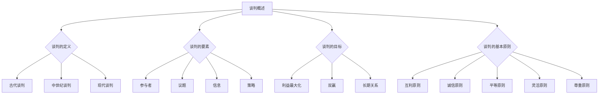

                 

### 用户输入：
**文章标题：** 谈判高手：为团队争取最大利益的技巧

**关键词：** 谈判技巧、团队利益、博弈论、心理战术、沟通策略

**摘要：** 本文将深入探讨谈判中的关键要素和策略，通过结合博弈论和心理战术，以及有效的沟通技巧，帮助读者成为谈判高手，为团队争取最大利益。

---

### 目录

#### 引言

#### 第一部分：谈判基础

##### 1.1 谈判概述

###### 1.1.1 谈判的定义与历史发展

###### 1.1.2 谈判的要素与目标

###### 1.1.3 谈判的基本原则

##### 1.2 谈判中的博弈论

###### 1.2.1 博弈论基础

###### 1.2.2 谈判力的构成与运用

###### 1.2.3 谈判策略分析

##### 1.3 谈判技巧

###### 1.3.1 心理战术与技巧

###### 1.3.2 谈判中的沟通技巧

###### 1.3.3 谈判中的应变策略

#### 第二部分：谈判实战

##### 2.1 谈判案例分析

###### 2.1.1 典型谈判案例分析

###### 2.1.2 谈判中的利益冲突与解决

###### 2.1.3 谈判中的双赢策略

##### 2.2 跨文化谈判技巧

###### 2.2.1 跨文化谈判的特点与挑战

###### 2.2.2 跨文化谈判中的文化差异与适应

###### 2.2.3 跨文化谈判的策略与技巧

##### 2.3 团队谈判实战演练

###### 2.3.1 团队谈判的优势与劣势

###### 2.3.2 团队谈判的协作与沟通

###### 2.3.3 团队谈判的实战演练

#### 第三部分：谈判技巧提升

##### 3.1 高效谈判技巧

###### 3.1.1 提高谈判效率的策略

###### 3.1.2 谈判中的关键决策点

###### 3.1.3 谈判中的人际关系处理

##### 3.2 谈判中的风险控制

###### 3.2.1 谈判风险识别与评估

###### 3.2.2 谈判风险应对策略

###### 3.2.3 谈判风险控制与案例分析

##### 3.3 谈判技巧提升方法

###### 3.3.1 谈判技巧的训练与提升

###### 3.3.2 谈判中的心态调整

###### 3.3.3 谈判技巧的实际运用与反馈

### 附录

#### 附录 A：谈判工具与资源

##### A.1 主流谈判工具介绍

##### A.2 谈判资源推荐

##### A.3 谈判模拟演练平台推荐### 用户输入：
### 引言

谈判是现代商业活动中必不可少的一部分，它不仅关乎个人利益，更涉及整个团队甚至整个企业的利益。作为团队的一员，掌握有效的谈判技巧不仅能够提升个人在团队中的价值，还能为团队争取到最大的利益。本文将深入探讨谈判中的关键要素和策略，帮助读者成为谈判高手。

谈判涉及多个方面的因素，包括博弈论、心理战术和沟通技巧等。博弈论为谈判提供了策略分析的基础，心理战术则可以帮助我们在谈判中更好地理解对方的心理，从而采取更有效的策略。沟通技巧则是谈判成功的关键，通过有效的沟通，我们能够更好地传达自己的想法，理解对方的立场，从而达成双赢的结果。

本文将从以下几个方面展开：

1. **谈判基础**：介绍谈判的定义、要素和基本原则。
2. **谈判策略与技巧**：探讨博弈论在谈判中的应用，以及心理战术和沟通技巧。
3. **谈判实战**：通过案例分析和实战演练，展示如何应用谈判技巧。
4. **团队谈判**：强调团队协作和沟通在谈判中的重要性。
5. **谈判技巧提升**：提供提升谈判技巧的方法和策略。
6. **谈判工具与资源**：推荐实用的谈判工具和资源。

通过本文的阅读，读者将能够全面了解谈判的各个方面，掌握谈判技巧，为团队争取最大利益。

### 第一部分：谈判基础

#### 1.1 谈判概述

##### 1.1.1 谈判的定义与历史发展

谈判是一种通过交流、协商和妥协来解决问题、达成共识的过程。它通常发生在两个或多个利益相关的个体或组织之间，目的是为了实现各自的利益最大化。

谈判的历史可以追溯到人类社会的早期。在古代，谈判通常用于解决土地纠纷、贸易往来等问题。随着社会的发展，谈判逐渐成为政治、商业和日常生活中的重要组成部分。在现代社会，谈判不仅涉及到商业合同、政治协议等大型事务，也渗透到我们的日常生活中，如薪资谈判、购房谈判等。

##### 1.1.2 谈判的要素与目标

谈判的要素包括：

1. **参与者**：谈判的主体，可以是个人、团队或组织。
2. **议题**：谈判的核心问题，通常涉及利益、资源或权利的分配。
3. **信息**：谈判过程中的信息交换，包括事实、观点和需求。
4. **策略**：谈判者采取的行动和决策，包括报价、让步和妥协。

谈判的目标是达成一种双方都能接受的协议。这种协议既可以是具体的结果，如签订合同，也可以是抽象的，如建立合作关系。

##### 1.1.3 谈判的基本原则

成功的谈判应遵循以下基本原则：

1. **互利原则**：谈判应追求双方的利益最大化，而非单方面的利益。
2. **诚信原则**：谈判过程中应保持诚信，避免欺骗和误导。
3. **灵活原则**：谈判者应根据实际情况灵活调整策略，以适应变化。
4. **尊重原则**：尊重对方的观点和需求，以建立良好的谈判关系。

#### 1.2 谈判中的博弈论

##### 1.2.1 博弈论基础

博弈论是研究决策和冲突的数学理论，广泛应用于谈判、博弈和竞争分析。博弈论的基本概念包括：

1. **参与者**：博弈的参与者，可以是个人、团队或组织。
2. **策略**：参与者在博弈中可以选择的行动方案。
3. **结果**：不同策略组合下的结果，通常涉及利益、资源或权利的分配。
4. **均衡**：博弈中的稳定状态，所有参与者都无法通过改变策略获得更多利益。

博弈论的基本模型包括：

1. **零和博弈**：一方的收益等于另一方的损失，总收益为零。
2. **正和博弈**：参与者的收益可以同时增加，总收益为正。
3. **负和博弈**：一方的损失大于另一方的收益，总收益为负。

##### 1.2.2 谈判力的构成与运用

谈判力是指谈判者在谈判过程中所具备的影响力，包括信息力、关系力、资源力和说服力等。

1. **信息力**：谈判者应具备充分的信息，包括事实、数据和观点，以支持自己的立场。
2. **关系力**：谈判者应与对方建立良好的关系，增加对方对自己的信任和尊重。
3. **资源力**：谈判者应具备一定的资源，如资金、人力和技术，以支持谈判目标的实现。
4. **说服力**：谈判者应具备有效的沟通和说服技巧，以影响对方的决策。

谈判力的运用包括：

1. **建立谈判框架**：明确谈判的目标、范围和规则，为谈判创造良好的环境。
2. **展示谈判力**：通过展示自己的谈判力，增加对方对自己立场的认可。
3. **灵活运用谈判力**：根据谈判的进展和对方的反应，灵活调整自己的谈判策略。

##### 1.2.3 谈判策略分析

谈判策略是指谈判者在谈判过程中采取的具体行动和决策。有效的谈判策略应考虑以下因素：

1. **谈判目标**：明确谈判的目标和优先级，以制定合适的谈判策略。
2. **谈判力**：根据自身的谈判力水平，选择合适的谈判策略。
3. **对方特性**：了解对方的立场、需求和动机，以制定针对性的谈判策略。
4. **环境因素**：考虑谈判所处的环境，如文化背景、市场状况等，以调整谈判策略。

常见的谈判策略包括：

1. **硬策略**：采取强硬立场，通过施加压力来迫使对方让步。
2. **软策略**：采取友好态度，通过合作和妥协来达成协议。
3. **折中策略**：在双方利益之间寻找平衡点，以达成双方都能接受的协议。
4. **双赢策略**：寻求创造性的解决方案，使双方都能获得利益。

#### 1.3 谈判技巧

##### 1.3.1 心理战术与技巧

心理战术是指谈判者通过影响对方的心理，以达到自己的谈判目标。以下是一些常见的心理战术：

1. **情绪控制**：保持冷静，避免情绪波动，以影响对方的判断。
2. **情感投资**：建立情感联系，增加对方的信任和依赖。
3. **心理暗示**：通过言语和行为暗示对方，使其产生预期的反应。
4. **心理防御**：识别并应对对方的心理战术，保护自己的利益。

##### 1.3.2 谈判中的沟通技巧

有效的沟通是谈判成功的关键。以下是一些关键的沟通技巧：

1. **倾听**：认真倾听对方的意见和需求，以理解对方的立场。
2. **表达**：清晰、准确地表达自己的观点和需求，以传达信息。
3. **反馈**：及时给予对方反馈，以确认对方的理解。
4. **非语言沟通**：注意身体语言和面部表情，以增强沟通效果。

##### 1.3.3 谈判中的应变策略

谈判过程中可能会出现各种突发情况，谈判者需要具备良好的应变能力。以下是一些应对策略：

1. **灵活调整策略**：根据谈判的进展和对方的反应，灵活调整自己的谈判策略。
2. **保持冷静**：遇到突发情况时，保持冷静，避免情绪化。
3. **寻求解决方案**：积极寻求解决方案，以化解冲突。
4. **寻求第三方帮助**：在必要时，寻求第三方调解，以达成协议。

### 第二部分：谈判实战

#### 2.1 谈判案例分析

##### 2.1.1 典型谈判案例分析

通过分析典型的谈判案例，我们可以更好地理解谈判策略和技巧的应用。以下是一个薪资谈判的案例：

**案例背景**：一位求职者在面试过程中表现出色，公司决定录用他，但对他提出的薪资要求低于公司的预期。

**谈判过程**：

1. **开场策略**：求职者在谈判开始时，提出了一个高于公司预期的薪资要求，以试探公司的反应。
2. **信息交换**：公司解释了薪资设定的原则和依据，求职者则分享了其市场价值和对公司的期望。
3. **心理战术**：公司使用情感投资策略，表达了对其能力和潜力的认可，并提出了一个接近求职者要求的薪资。
4. **沟通技巧**：求职者使用了有效的倾听和反馈技巧，表达了对公司理解和认可，同时也提出了自己的立场。
5. **双赢策略**：双方最终达成一个双方都能接受的薪资水平，求职者接受了略低于预期薪资的报价，而公司则获得了所需的人才。

**案例分析**：

1. **谈判策略**：求职者采用了试探性策略和双赢策略，使谈判保持在一个积极的方向上。
2. **心理战术**：公司通过情感投资策略，建立了信任和合作关系，增加了求职者的接受度。
3. **沟通技巧**：双方通过有效的沟通，理解了对方的立场和需求，达成了共识。

##### 2.1.2 谈判中的利益冲突与解决

谈判中的利益冲突是常见的问题，有效的解决方法包括：

1. **直接沟通**：双方直接沟通，表达各自的利益和需求，以找到共同点。
2. **妥协**：双方在各自的利益之间寻找平衡点，做出一定的让步。
3. **第三方调解**：在双方无法达成共识时，寻求第三方调解，以达成协议。

##### 2.1.3 谈判中的双赢策略

双赢策略是一种寻求双方都能获得利益的谈判策略。以下是一个双赢策略的案例：

**案例背景**：一家软件公司希望与一家硬件公司合作，共同开发一款新产品。

**谈判过程**：

1. **信息交换**：双方分享了各自的技术和市场优势，以及合作的目标和期望。
2. **共同目标**：双方明确了共同的目标，即通过合作，推出一款具有竞争力的产品。
3. **双赢策略**：双方同意共享收益，并根据各自的技术和市场贡献，分配利润。
4. **合作机制**：双方建立了明确的合作机制，包括责任分配、进度管理和利益分配。

**案例分析**：

1. **双赢策略**：双方通过双赢策略，实现了各自的目标，同时也为对方创造了价值。
2. **合作机制**：明确的合作机制确保了合作的顺利进行，并保护了双方的利益。

#### 2.2 跨文化谈判技巧

##### 2.2.1 跨文化谈判的特点与挑战

跨文化谈判涉及到不同文化背景下的个体或组织之间的谈判，具有以下特点：

1. **文化差异**：不同文化背景下的价值观、行为习惯和沟通方式存在差异。
2. **不确定性**：由于文化差异，谈判双方对对方的期望和行为可能存在不确定性。
3. **沟通障碍**：语言、非语言沟通和文化背景的差异可能导致沟通障碍。

##### 2.2.2 跨文化谈判中的文化差异与适应

为了在跨文化谈判中取得成功，谈判者需要了解并适应对方的文化差异。以下是一些策略：

1. **文化研究**：了解对方的文化背景，包括价值观、行为习惯和沟通方式。
2. **尊重差异**：尊重对方的文化差异，避免对对方的误解和偏见。
3. **适应性沟通**：根据对方的文化特点，调整自己的沟通方式和策略。

##### 2.2.3 跨文化谈判的策略与技巧

跨文化谈判中，以下策略和技巧有助于成功：

1. **提前准备**：在谈判前，对对方的文化进行研究，了解对方的期望和需求。
2. **建立信任**：通过建立信任和合作关系，减少文化差异带来的不确定性。
3. **有效沟通**：使用适应性沟通技巧，确保信息的准确传达和理解。

#### 2.3 团队谈判实战演练

##### 2.3.1 团队谈判的优势与劣势

团队谈判的优势包括：

1. **多样化视角**：团队成员来自不同的背景，可以提供多样化的视角和观点。
2. **协作优势**：团队成员可以共同解决问题，提高谈判的成功率。
3. **决策效率**：团队成员可以共同做出决策，提高决策的效率。

团队谈判的劣势包括：

1. **内部冲突**：团队成员之间的利益和观点可能存在冲突，影响谈判的进展。
2. **沟通障碍**：团队成员之间的沟通不畅可能导致信息传递不准确。
3. **责任不清**：团队成员之间的责任分配可能不明确，影响谈判的执行力。

##### 2.3.2 团队谈判的协作与沟通

团队谈判的关键在于协作和沟通。以下是一些策略：

1. **明确目标**：团队成员应在谈判前明确共同的目标，确保团队行动的一致性。
2. **分工明确**：团队成员应明确各自的角色和职责，确保谈判的顺利进行。
3. **有效沟通**：团队成员应保持开放的沟通渠道，确保信息的及时传达和反馈。

##### 2.3.3 团队谈判的实战演练

团队谈判的实战演练有助于提高团队成员的谈判技能和协作能力。以下是一些演练策略：

1. **模拟谈判**：通过模拟真实谈判场景，让团队成员体验谈判的过程，并从中学习。
2. **案例讨论**：分析真实的谈判案例，讨论其中的策略和技巧，以提高谈判能力。
3. **角色扮演**：通过角色扮演，让团队成员体验不同角色，了解对方的观点和需求。

### 第三部分：谈判技巧提升

#### 3.1 高效谈判技巧

##### 3.1.1 提高谈判效率的策略

为了提高谈判效率，谈判者可以采取以下策略：

1. **明确目标**：在谈判前明确谈判的目标和优先级，确保谈判的顺利进行。
2. **准备充分**：对谈判议题、对方和谈判环境进行充分准备，确保谈判有据可依。
3. **掌握信息**：收集并掌握对方的信息，包括需求、动机和利益，以制定有效的谈判策略。
4. **设定时间限制**：为谈判设定时间限制，以激励双方加快谈判进度。

##### 3.1.2 谈判中的关键决策点

谈判过程中的关键决策点包括：

1. **接受或拒绝**：决定是否接受对方的条件或提出新的条件。
2. **让步或坚持**：决定是否做出让步或坚持自己的立场。
3. **策略调整**：根据谈判的进展和对方的反应，调整自己的谈判策略。

##### 3.1.3 谈判中的人际关系处理

在谈判过程中，处理人际关系是非常重要的。以下是一些策略：

1. **建立信任**：通过建立信任和合作关系，减少谈判的阻力。
2. **尊重差异**：尊重对方的文化和观点，避免对对方的误解和偏见。
3. **有效沟通**：通过有效沟通，确保信息的准确传达和理解。

#### 3.2 谈判中的风险控制

##### 3.2.1 谈判风险识别与评估

在谈判过程中，谈判者需要识别和评估潜在的风险，包括：

1. **信息风险**：信息不准确或信息不对称可能导致谈判失败。
2. **策略风险**：谈判策略不当可能导致谈判进展不顺。
3. **决策风险**：谈判决策失误可能导致谈判失败。

##### 3.2.2 谈判风险应对策略

为了应对谈判风险，谈判者可以采取以下策略：

1. **风险管理**：制定风险管理计划，识别并评估风险，制定应对措施。
2. **备选方案**：制定备选方案，以应对谈判过程中可能出现的各种情况。
3. **沟通确认**：确保信息的准确传达和理解，减少信息风险。

##### 3.2.3 谈判风险控制与案例分析

通过以下案例，我们可以了解如何控制谈判风险：

**案例背景**：一家科技公司希望与一家硬件公司合作，共同开发一款新产品。

**谈判过程**：

1. **信息确认**：在谈判前，科技公司对硬件公司的技术实力和市场状况进行了详细的了解，以确保信息的准确性。
2. **风险识别**：科技公司识别了信息风险、策略风险和决策风险，并制定了相应的应对措施。
3. **风险控制**：科技公司通过制定详细的风险管理计划，确保谈判的顺利进行。

**案例分析**：

1. **信息确认**：科技公司的信息确认策略有效降低了信息风险。
2. **风险识别与控制**：科技公司通过识别和应对风险，确保了谈判的顺利进行。

#### 3.3 谈判技巧提升方法

##### 3.3.1 谈判技巧的训练与提升

为了提升谈判技巧，谈判者可以采取以下方法：

1. **模拟谈判**：通过模拟真实谈判场景，提高谈判技能。
2. **案例分析**：分析成功的谈判案例，学习有效的谈判策略。
3. **专业培训**：参加专业的谈判技巧培训课程，提升谈判能力。

##### 3.3.2 谈判中的心态调整

在谈判过程中，心态调整非常重要。以下是一些建议：

1. **保持冷静**：遇到困难时，保持冷静，避免情绪化。
2. **积极乐观**：保持积极乐观的心态，相信谈判会有好的结果。
3. **适应变化**：灵活调整心态，适应谈判过程中的各种变化。

##### 3.3.3 谈判技巧的实际运用与反馈

为了有效地运用谈判技巧，谈判者需要：

1. **实践**：将谈判技巧应用于实际谈判中，不断总结经验。
2. **反思**：谈判后，反思谈判过程中的得失，以改进谈判技巧。
3. **反馈**：寻求他人的反馈，了解自己的谈判表现，以提高谈判能力。

### 附录

#### 附录 A：谈判工具与资源

##### A.1 主流谈判工具介绍

1. **谈判模拟软件**：如Negotiation Simulator、Negotiation Mastery等，用于模拟真实谈判场景，提高谈判技能。
2. **谈判技巧手册**：如《谈判的艺术》（Getting to Yes）、《谈判力》（Never Split the Difference）等，提供实用的谈判技巧和策略。
3. **在线资源**：如Coursera、edX等在线课程平台，提供丰富的谈判技巧培训课程。

##### A.2 谈判资源推荐

1. **谈判专家博客**：如Harvard Negotiation Project、Karrass Negotiation Institute等，提供专业的谈判技巧和案例分析。
2. **谈判论坛**：如Reddit的r/negotiation、LinkedIn的Negotiation Skills Group等，可以与其他谈判者交流经验。
3. **书籍推荐**：如《谈判高手：实战技巧与策略》（The Art of Negotiation）、《谈判心理学》（Negotiation Psychology）等，涵盖广泛谈判技巧。

##### A.3 谈判模拟演练平台推荐

1. **Mavenlink**：提供谈判模拟演练功能，可以帮助用户模拟真实谈判场景，提高谈判技能。
2. **Wharton Negotiation Workshop**：提供在线谈判模拟课程，帮助用户掌握谈判技巧。
3. **World Negotiation Institute**：提供谈判技巧培训，包括模拟演练和案例分析。### 用户输入：
### 1.1 谈判概述

谈判是一种旨在解决冲突、达成共识和实现利益最大化的沟通活动。它通常涉及两个或多个参与方，这些参与方在相互交流、协商和让步的过程中寻求共同的利益。谈判的形式多样，包括商业谈判、政治谈判、法律谈判和个人事务谈判等。

#### 1.1.1 谈判的定义与历史发展

谈判的定义可以归结为：通过交换信息和意见，寻找双方都能接受的解决方案的过程。谈判的历史可以追溯到古代，当时的人们通过口头协议和仪式来解决问题。随着人类社会的发展，谈判逐渐成为一种重要的社会活动。

在古代，谈判主要用于解决土地纠纷、婚姻关系和贸易往来等问题。例如，古罗马的《十二铜表法》就包含了关于土地纠纷的谈判条款。在中世纪，谈判成为外交和商业活动的重要手段。到了现代社会，谈判的应用范围进一步扩大，涵盖政治、商业、法律、体育和日常生活中。

#### 1.1.2 谈判的要素与目标

谈判的要素包括参与者、议题、信息和策略。参与者是谈判的主体，可以是个人、团队或组织。议题是谈判的核心问题，通常涉及利益、资源或权利的分配。信息是谈判过程中的重要交换内容，包括事实、观点和需求。策略是谈判者在谈判过程中采取的行动和决策。

谈判的目标是达成一种双方都能接受的协议。这种协议可以是具体的，如签订合同，也可以是抽象的，如建立合作关系。有效的谈判应该追求双方的利益最大化，而非单方面的利益。以下是一些常见的谈判目标：

1. **利益最大化**：谈判者应尽力争取自己的最大利益，同时考虑对方的利益。
2. **双赢**：通过合作和妥协，实现双方都能获得利益的局面。
3. **长期关系**：建立和维护长期的合作伙伴关系，为未来的合作打下基础。

#### 1.1.3 谈判的基本原则

成功的谈判应遵循以下基本原则：

1. **互利原则**：谈判的目标是寻求双方的共同利益，而非单方面的利益。
2. **诚信原则**：谈判过程中应保持诚信，避免欺骗和误导。
3. **平等原则**：谈判双方应在平等的基础上进行谈判，尊重对方的权利和利益。
4. **灵活原则**：谈判者应根据谈判的进展和对方的反应，灵活调整自己的策略和立场。
5. **尊重原则**：谈判者应尊重对方的观点、需求和权利，以建立良好的合作关系。

### Mermaid 流程图



### 1.2 谈判中的博弈论

博弈论是一种研究决策和冲突的数学理论，它广泛应用于经济学、政治学、社会学和心理学等领域。在谈判中，博弈论提供了分析谈判策略和预测谈判结果的有力工具。

#### 1.2.1 博弈论基础

博弈论的基本概念包括参与者、策略、结果和均衡。参与者是博弈的主体，可以是个人、团队或组织。策略是参与者在博弈中可以选择的行动方案。结果是不同策略组合下的结果，通常涉及利益、资源或权利的分配。均衡是博弈中的稳定状态，所有参与者都无法通过改变策略获得更多利益。

博弈论的基本模型包括零和博弈、正和博弈和负和博弈。零和博弈是指一方的收益等于另一方的损失，总收益为零。正和博弈是指参与者的收益可以同时增加，总收益为正。负和博弈是指一方的损失大于另一方的收益，总收益为负。

#### 1.2.2 谈判力的构成与运用

谈判力是指谈判者在谈判过程中所具备的影响力，包括信息力、关系力、资源力和说服力等。

1. **信息力**：谈判者应具备充分的信息，包括事实、数据和观点，以支持自己的立场。信息力可以帮助谈判者更好地理解对方的行为和策略，从而制定更有效的谈判策略。
2. **关系力**：谈判者应与对方建立良好的关系，增加对方对自己的信任和尊重。关系力可以帮助谈判者在谈判中更好地沟通和协商，减少冲突和误解。
3. **资源力**：谈判者应具备一定的资源，如资金、人力和技术，以支持谈判目标的实现。资源力可以帮助谈判者更好地应对对方的要求和挑战，增加谈判的成功率。
4. **说服力**：谈判者应具备有效的沟通和说服技巧，以影响对方的决策。说服力可以帮助谈判者更好地传达自己的观点和需求，赢得对方的认同和支持。

#### 1.2.3 谈判策略分析

谈判策略是指谈判者在谈判过程中采取的具体行动和决策。有效的谈判策略应考虑以下因素：

1. **谈判目标**：明确谈判的目标和优先级，以制定合适的谈判策略。
2. **谈判力**：根据自身的谈判力水平，选择合适的谈判策略。
3. **对方特性**：了解对方的立场、需求和动机，以制定针对性的谈判策略。
4. **环境因素**：考虑谈判所处的环境，如文化背景、市场状况等，以调整谈判策略。

常见的谈判策略包括硬策略、软策略和折中策略。

1. **硬策略**：采取强硬立场，通过施加压力来迫使对方让步。硬策略适用于谈判者在资源、信息和关系力方面具有优势的情况。
2. **软策略**：采取友好态度，通过合作和妥协来达成协议。软策略适用于谈判者希望建立长期合作关系的情况。
3. **折中策略**：在双方利益之间寻找平衡点，以达成双方都能接受的协议。折中策略适用于谈判者希望快速达成协议的情况。

### 伪代码

```python
# 谈判策略选择函数
def choose_strategy(negotiation_goal, negotiation_power, opponent_characteristics, environment_factors):
    if negotiation_goal == 'win_win':
        strategy = 'compromise'
    elif negotiation_power > 'high' and opponent_characteristics == 'weak':
        strategy = 'hard'
    elif negotiation_power > 'high' and opponent_characteristics == 'strong':
        strategy = 'balance'
    elif negotiation_power < 'high' and opponent_characteristics == 'weak':
        strategy = 'soft'
    elif negotiation_power < 'high' and opponent_characteristics == 'strong':
        strategy = 'defensive'
    else:
        strategy = 'neutral'
    return strategy
```

### 数学模型和数学公式

谈判中的数学模型可以帮助谈判者更好地理解对方的策略和预测谈判结果。以下是一个简单的期望效用模型：

1. **期望效用模型**：期望效用模型用于评估不同策略下的效用期望。效用是指谈判者对结果的偏好程度。

$$
E(U) = \sum_{i} p_i \cdot u_i
$$

其中，$E(U)$ 是期望效用，$p_i$ 是策略 $i$ 的概率，$u_i$ 是策略 $i$ 的效用。

2. **效用函数**：效用函数用于量化谈判者对结果的偏好程度。常见的效用函数包括线性效用函数和对数效用函数。

线性效用函数：

$$
u(x) = a \cdot x + b
$$

对数效用函数：

$$
u(x) = \frac{c}{x + d}
$$

其中，$a, b, c, d$ 是常数，$x$ 是谈判结果。

### 数学公式举例

假设有两个谈判策略 A 和 B，策略 A 的概率为 0.6，效用为 0.8；策略 B 的概率为 0.4，效用为 1.2。我们可以使用期望效用模型计算这两个策略的期望效用：

$$
E(U) = 0.6 \cdot 0.8 + 0.4 \cdot 1.2 = 0.48 + 0.48 = 0.96
$$

### 1.3 谈判技巧

#### 1.3.1 心理战术与技巧

心理战术是指在谈判过程中，通过影响对方的心理状态来达到自己的目的。以下是一些常见的心理战术和技巧：

1. **情感投资**：通过建立情感联系，增加对方对自己的信任和依赖。
2. **心理暗示**：通过言语和行为暗示对方，使其产生预期的反应。
3. **情绪控制**：保持冷静，避免情绪波动，以影响对方的判断。
4. **自我披露**：适当地透露一些个人信息，增加对方的认同感。

#### 1.3.2 谈判中的沟通技巧

有效的沟通是谈判成功的关键。以下是一些关键的沟通技巧：

1. **倾听**：认真倾听对方的意见和需求，以理解对方的立场。
2. **表达**：清晰、准确地表达自己的观点和需求，以传达信息。
3. **反馈**：及时给予对方反馈，以确认对方的理解。
4. **非语言沟通**：注意身体语言和面部表情，以增强沟通效果。

#### 1.3.3 谈判中的应变策略

在谈判过程中，可能会出现各种突发情况，谈判者需要具备良好的应变能力。以下是一些应对策略：

1. **灵活调整策略**：根据谈判的进展和对方的反应，灵活调整自己的谈判策略。
2. **保持冷静**：遇到突发情况时，保持冷静，避免情绪化。
3. **寻求解决方案**：积极寻求解决方案，以化解冲突。
4. **寻求第三方帮助**：在必要时，寻求第三方调解，以达成协议。

### 1.4 谈判案例分析

#### 1.4.1 谈判案例分析：薪资谈判

**案例背景**：一位求职者（甲方）和一家公司（乙方）进行薪资谈判。

**谈判过程**：

1. **开场**：甲方提出了一个薪资要求，乙方表示需要内部讨论。
2. **信息交换**：甲方分享了其市场价值和期望薪资，乙方解释了公司薪资结构和预算限制。
3. **策略调整**：甲方根据乙方的反馈，调整了薪资要求，乙方则提出了一项额外的福利作为补偿。
4. **达成共识**：双方最终达成了一个双方都能接受的薪资和福利组合。

**案例分析**：

1. **信息交换**：双方在谈判过程中进行了充分的信息交换，确保了双方的立场和需求被充分理解。
2. **策略调整**：双方根据对方的反馈，灵活调整了谈判策略，找到了双方都能接受的平衡点。

### 1.5 跨文化谈判技巧

#### 1.5.1 跨文化谈判的特点与挑战

跨文化谈判涉及到不同文化背景下的个体或组织之间的谈判，具有以下特点：

1. **文化差异**：不同文化背景下的价值观、行为习惯和沟通方式存在差异。
2. **不确定性**：由于文化差异，谈判双方对对方的期望和行为可能存在不确定性。
3. **沟通障碍**：语言、非语言沟通和文化背景的差异可能导致沟通障碍。

#### 1.5.2 跨文化谈判中的文化差异与适应

为了在跨文化谈判中取得成功，谈判者需要了解并适应对方的文化差异。以下是一些策略：

1. **文化研究**：了解对方的文化背景，包括价值观、行为习惯和沟通方式。
2. **尊重差异**：尊重对方的文化差异，避免对对方的误解和偏见。
3. **适应性沟通**：根据对方的文化特点，调整自己的沟通方式和策略。

#### 1.5.3 跨文化谈判的策略与技巧

跨文化谈判中，以下策略和技巧有助于成功：

1. **提前准备**：在谈判前，对对方的文化进行研究，了解对方的期望和需求。
2. **建立信任**：通过建立信任和合作关系，减少文化差异带来的不确定性。
3. **有效沟通**：使用适应性沟通技巧，确保信息的准确传达和理解。

### 1.6 团队谈判实战演练

#### 2.6.1 团队谈判的优势与劣势

团队谈判的优势包括：

1. **多样化视角**：团队成员来自不同的背景，可以提供多样化的视角和观点。
2. **协作优势**：团队成员可以共同解决问题，提高谈判的成功率。
3. **决策效率**：团队成员可以共同做出决策，提高决策的效率。

团队谈判的劣势包括：

1. **内部冲突**：团队成员之间的利益和观点可能存在冲突，影响谈判的进展。
2. **沟通障碍**：团队成员之间的沟通不畅可能导致信息传递不准确。
3. **责任不清**：团队成员之间的责任分配可能不明确，影响谈判的执行力。

#### 2.6.2 团队谈判的协作与沟通

团队谈判的关键在于协作和沟通。以下是一些策略：

1. **明确目标**：团队成员应在谈判前明确共同的目标，确保团队行动的一致性。
2. **分工明确**：团队成员应明确各自的角色和职责，确保谈判的顺利进行。
3. **有效沟通**：团队成员应保持开放的沟通渠道，确保信息的及时传达和反馈。

#### 2.6.3 团队谈判的实战演练

团队谈判的实战演练有助于提高团队成员的谈判技能和协作能力。以下是一些演练策略：

1. **模拟谈判**：通过模拟真实谈判场景，让团队成员体验谈判的过程，并从中学习。
2. **案例讨论**：分析真实的谈判案例，讨论其中的策略和技巧，以提高谈判能力。
3. **角色扮演**：通过角色扮演，让团队成员体验不同角色，了解对方的观点和需求。

### 1.7 谈判技巧提升方法

#### 1.7.1 谈判技巧的训练与提升

为了提升谈判技巧，谈判者可以采取以下方法：

1. **模拟谈判**：通过模拟真实谈判场景，提高谈判技能。
2. **案例分析**：分析成功的谈判案例，学习有效的谈判策略。
3. **专业培训**：参加专业的谈判技巧培训课程，提升谈判能力。

#### 1.7.2 谈判中的心态调整

在谈判过程中，心态调整非常重要。以下是一些建议：

1. **保持冷静**：遇到困难时，保持冷静，避免情绪化。
2. **积极乐观**：保持积极乐观的心态，相信谈判会有好的结果。
3. **适应变化**：灵活调整心态，适应谈判过程中的各种变化。

#### 1.7.3 谈判技巧的实际运用与反馈

为了有效地运用谈判技巧，谈判者需要：

1. **实践**：将谈判技巧应用于实际谈判中，不断总结经验。
2. **反思**：谈判后，反思谈判过程中的得失，以改进谈判技巧。
3. **反馈**：寻求他人的反馈，了解自己的谈判表现，以提高谈判能力。

### 附录

#### 附录 A：谈判工具与资源

##### A.1 主流谈判工具介绍

1. **谈判模拟软件**：如Negotiation Simulator、Negotiation Mastery等，用于模拟真实谈判场景，提高谈判技能。
2. **谈判技巧手册**：如《谈判的艺术》（Getting to Yes）、《谈判力》（Never Split the Difference）等，提供实用的谈判技巧和策略。
3. **在线资源**：如Coursera、edX等在线课程平台，提供丰富的谈判技巧培训课程。

##### A.2 谈判资源推荐

1. **谈判专家博客**：如Harvard Negotiation Project、Karrass Negotiation Institute等，提供专业的谈判技巧和案例分析。
2. **谈判论坛**：如Reddit的r/negotiation、LinkedIn的Negotiation Skills Group等，可以与其他谈判者交流经验。
3. **书籍推荐**：如《谈判高手：实战技巧与策略》（The Art of Negotiation）、《谈判心理学》（Negotiation Psychology）等，涵盖广泛谈判技巧。

##### A.3 谈判模拟演练平台推荐

1. **Mavenlink**：提供谈判模拟演练功能，可以帮助用户模拟真实谈判场景，提高谈判技能。
2. **Wharton Negotiation Workshop**：提供在线谈判模拟课程，帮助用户掌握谈判技巧。
3. **World Negotiation Institute**：提供谈判技巧培训，包括模拟演练和案例分析。### 用户输入：
### 3.1 谈判技巧提升方法

#### 3.1.1 谈判技巧的训练与提升

提升谈判技巧的首要步骤是进行系统性的训练。以下是一些具体的训练方法：

1. **模拟谈判**：
   - **情境设定**：选择具有代表性的谈判场景进行模拟，如薪资谈判、合同谈判等。
   - **角色扮演**：团队成员分别扮演谈判双方，模拟实际谈判的过程。
   - **反馈机制**：训练后，团队成员相互提供反馈，讨论谈判策略的优缺点。

2. **案例分析**：
   - **选择案例**：挑选具有挑战性和复杂性的谈判案例进行分析。
   - **讨论策略**：团队成员共同讨论案例中的谈判策略，分析其成功或失败的原因。
   - **经验总结**：总结案例中的成功经验，提取适用于未来谈判的技巧。

3. **实战演练**：
   - **真实场景**：将谈判技巧应用于实际的工作或生活中，如在商业谈判、团队合作中实践。
   - **反思总结**：谈判结束后，回顾整个谈判过程，总结经验教训，及时调整策略。

4. **专家指导**：
   - **参加培训**：报名参加专业的谈判技巧培训课程，如商务谈判、高级谈判技巧等。
   - **寻求导师**：寻找经验丰富的谈判专家作为导师，进行一对一的辅导。

#### 3.1.2 谈判中的心态调整

心态是谈判成功的关键因素之一。以下是一些建议帮助谈判者在谈判中调整心态：

1. **保持冷静**：
   - **情绪管理**：学会控制自己的情绪，避免在谈判中表现出过度的激动或沮丧。
   - **深呼吸**：在紧张或焦虑时，通过深呼吸来放松身心，保持冷静。

2. **积极乐观**：
   - **心态建设**：保持积极乐观的心态，相信通过努力可以达成协议。
   - **目标设定**：设定具体、可实现的谈判目标，增强自信心。

3. **适应变化**：
   - **灵活应对**：谈判过程中可能会遇到各种意外情况，学会灵活应对，及时调整策略。
   - **接受失败**：将失败视为学习和成长的机会，而非终结。

#### 3.1.3 谈判技巧的实际运用与反馈

谈判技巧的提升不仅在于训练和心态调整，还需要在实际运用中不断总结和反思：

1. **实践应用**：
   - **日常应用**：将谈判技巧应用到日常工作和生活中，如与同事、客户或供应商的交流。
   - **情景模拟**：在日常工作中，模拟谈判场景，练习应用谈判技巧。

2. **反思总结**：
   - **经验记录**：每次谈判结束后，记录谈判过程中的成功和失败之处。
   - **自我评估**：定期回顾自己的谈判记录，分析自身的谈判风格和策略。

3. **反馈与改进**：
   - **同事反馈**：与同事分享谈判经验，听取他们的意见和建议。
   - **持续改进**：根据反馈和反思，不断调整和改进谈判技巧。

#### 3.1.4 谈判技巧提升的最佳实践

以下是一些谈判技巧提升的最佳实践：

1. **学习最佳案例**：
   - **经典案例**：研究历史上著名的谈判案例，如肯尼迪与克鲁格的谈判、微软与苹果的专利谈判等。
   - **分析技巧**：深入分析这些案例中的谈判策略和技巧，提炼适用于自己谈判场景的方法。

2. **参加专业活动**：
   - **研讨会**：参加商务谈判研讨会，与其他谈判者交流心得。
   - **研讨会**：参加商务谈判比赛，通过实战演练提升自己的谈判能力。

3. **阅读相关书籍**：
   - **谈判书籍**：阅读《谈判的艺术》、《谈判力》、《谈判心理学》等经典谈判书籍。
   - **案例分析**：阅读包含案例分析的书，如《谈判高手：实战技巧与策略》。

4. **持续学习**：
   - **在线课程**：参加在线谈判课程，如Coursera、edX等平台上的谈判课程。
   - **研讨会**：定期参加研讨会，保持对谈判技巧和策略的持续关注。

通过以上方法，谈判者可以逐步提升自己的谈判技巧，为团队争取最大利益。重要的是，要持续实践、反思和改进，以不断提高自己的谈判水平。### 3.2 谈判中的风险控制

谈判过程中的风险控制是确保谈判顺利进行和达成预期目标的关键。以下将详细探讨谈判中的风险识别、评估与控制方法，并辅以实际案例和详细分析。

#### 3.2.1 谈判风险识别与评估

在谈判开始之前，识别和评估潜在风险是至关重要的。以下是一些常见的谈判风险及其识别与评估方法：

1. **信息风险**：
   - **识别**：信息风险包括对对方信息的不了解或信息不准确。
   - **评估**：通过市场调研、第三方咨询和内部分析，评估对方信息的准确性和完整性。

2. **策略风险**：
   - **识别**：策略风险涉及谈判策略的不当或与实际情况不符。
   - **评估**：通过模拟谈判和角色扮演，评估不同策略的可行性和效果。

3. **决策风险**：
   - **识别**：决策风险指的是在谈判过程中做出错误决策的可能性。
   - **评估**：通过分析历史谈判数据和谈判团队的决策风格，评估决策风险。

4. **关系风险**：
   - **识别**：关系风险包括谈判双方在谈判过程中产生的不信任或冲突。
   - **评估**：通过双方的历史合作记录和谈判团队的沟通效果，评估关系风险。

5. **法律风险**：
   - **识别**：法律风险涉及谈判内容和协议可能涉及的法律问题。
   - **评估**：通过法律顾问的咨询和谈判条款的审查，评估法律风险。

#### 3.2.2 谈判风险应对策略

一旦识别和评估了谈判风险，接下来需要制定和实施相应的风险应对策略。以下是一些常用的风险应对策略：

1. **风险预防**：
   - **制定详细计划**：在谈判前制定详细的谈判计划，包括谈判目标、策略和可能的风险预防措施。
   - **信息共享**：确保谈判团队之间的信息共享，减少信息不对称。

2. **风险规避**：
   - **调整策略**：根据评估结果，调整谈判策略以规避高风险的情况。
   - **替代方案**：制定备选方案，以应对可能出现的风险。

3. **风险转移**：
   - **合同条款**：通过合同条款明确风险分配，将部分风险转移给对方。
   - **保险**：购买相关的保险产品，转移部分风险。

4. **风险接受**：
   - **风险评估**：对于无法规避或转移的风险，进行充分的风险评估。
   - **风险承受能力**：根据团队的承受能力，决定是否接受风险。

5. **风险监控**：
   - **建立监控机制**：在谈判过程中建立风险监控机制，实时跟踪风险状况。
   - **定期评估**：定期对风险进行评估，根据最新情况调整应对策略。

#### 3.2.3 谈判风险控制与案例分析

以下通过实际案例，详细分析谈判中的风险控制过程。

**案例背景**：一家软件公司（甲方）与一家硬件公司（乙方）进行产品联合开发谈判，目标是共同推出一款智能设备。

**谈判过程**：

1. **风险识别**：
   - **信息风险**：甲方对乙方技术实力和市场状况不熟悉。
   - **策略风险**：双方策略不明确，可能导致谈判进展缓慢。
   - **决策风险**：双方决策过程复杂，可能产生冲突。
   - **关系风险**：双方在谈判中可能产生不信任。

2. **风险评估**：
   - **信息风险**：通过市场调研和第三方咨询，评估乙方技术实力和市场状况。
   - **策略风险**：模拟谈判场景，评估不同策略的可行性和效果。
   - **决策风险**：分析历史谈判数据和团队决策风格，评估决策风险。
   - **关系风险**：通过了解双方的历史合作记录和沟通效果，评估关系风险。

3. **风险控制**：
   - **信息共享**：甲方邀请乙方技术团队进行交流，共享相关信息。
   - **策略调整**：根据评估结果，双方调整谈判策略，确保目标明确。
   - **决策机制**：建立联合决策机制，确保决策过程透明和公正。
   - **信任建设**：双方通过多次会面和交流，建立信任关系。

**案例分析**：

1. **信息风险控制**：通过信息共享和第三方咨询，甲方成功降低了信息风险，对乙方的技术实力和市场状况有了更全面的了解。

2. **策略风险控制**：通过模拟谈判和策略调整，双方找到了适合的谈判策略，确保了谈判的顺利进行。

3. **决策风险控制**：通过建立联合决策机制，确保了决策过程的透明和公正，减少了冲突的可能性。

4. **关系风险控制**：通过信任建设，双方在谈判过程中建立了良好的合作关系，减少了关系风险。

**总结**：

通过上述案例，我们可以看到，在谈判过程中，有效的风险控制对于谈判的成功至关重要。通过识别和评估风险，采取相应的控制措施，谈判者可以降低风险，提高谈判的成功率。在谈判中，灵活应对变化和保持沟通畅通也是控制风险的关键。

### 3.3 谈判技巧提升方法

谈判技巧的提升需要系统的训练、实践和不断的反思。以下将详细探讨谈判技巧提升的具体方法。

#### 3.3.1 谈判技巧的训练与提升

1. **模拟谈判**：
   - **设立目标**：在模拟谈判前，设定明确的谈判目标，如达成协议、建立关系等。
   - **角色扮演**：团队成员扮演不同的角色，如买方、卖方等，模拟实际谈判场景。
   - **反馈机制**：模拟结束后，团队成员相互提供反馈，分析策略的优缺点。

2. **案例分析**：
   - **选择案例**：挑选具有挑战性和复杂性的谈判案例进行分析。
   - **讨论策略**：团队成员共同讨论案例中的谈判策略，分析其成功或失败的原因。
   - **经验总结**：总结案例中的成功经验，提取适用于未来谈判的技巧。

3. **实战演练**：
   - **真实场景**：将谈判技巧应用于实际的工作或生活中，如在商业谈判、团队合作中实践。
   - **反思总结**：每次谈判结束后，回顾整个谈判过程，总结经验教训，及时调整策略。

4. **专家指导**：
   - **参加培训**：报名参加专业的谈判技巧培训课程，如商务谈判、高级谈判技巧等。
   - **寻求导师**：寻找经验丰富的谈判专家作为导师，进行一对一的辅导。

#### 3.3.2 谈判中的心态调整

心态是谈判成功的关键因素之一。以下是一些建议帮助谈判者在谈判中调整心态：

1. **保持冷静**：
   - **情绪管理**：学会控制自己的情绪，避免在谈判中表现出过度的激动或沮丧。
   - **深呼吸**：在紧张或焦虑时，通过深呼吸来放松身心，保持冷静。

2. **积极乐观**：
   - **心态建设**：保持积极乐观的心态，相信通过努力可以达成协议。
   - **目标设定**：设定具体、可实现的谈判目标，增强自信心。

3. **适应变化**：
   - **灵活应对**：谈判过程中可能会遇到各种意外情况，学会灵活应对，及时调整策略。
   - **接受失败**：将失败视为学习和成长的机会，而非终结。

#### 3.3.3 谈判技巧的实际运用与反馈

谈判技巧的提升不仅在于训练和心态调整，还需要在实际运用中不断总结和反思：

1. **实践应用**：
   - **日常应用**：将谈判技巧应用到日常工作和生活中，如与同事、客户或供应商的交流。
   - **情景模拟**：在日常工作中，模拟谈判场景，练习应用谈判技巧。

2. **反思总结**：
   - **经验记录**：每次谈判结束后，记录谈判过程中的成功和失败之处。
   - **自我评估**：定期回顾自己的谈判记录，分析自身的谈判风格和策略。

3. **反馈与改进**：
   - **同事反馈**：与同事分享谈判经验，听取他们的意见和建议。
   - **持续改进**：根据反馈和反思，不断调整和改进谈判技巧。

#### 3.3.4 谈判技巧提升的最佳实践

以下是一些谈判技巧提升的最佳实践：

1. **学习最佳案例**：
   - **经典案例**：研究历史上著名的谈判案例，如肯尼迪与克鲁格的谈判、微软与苹果的专利谈判等。
   - **分析技巧**：深入分析这些案例中的谈判策略和技巧，提炼适用于自己谈判场景的方法。

2. **参加专业活动**：
   - **研讨会**：参加商务谈判研讨会，与其他谈判者交流心得。
   - **工作坊**：参加商务谈判工作坊，通过互动和练习提升谈判能力。

3. **阅读相关书籍**：
   - **谈判书籍**：阅读《谈判的艺术》、《谈判力》、《谈判心理学》等经典谈判书籍。
   - **案例分析**：阅读包含案例分析的书，如《谈判高手：实战技巧与策略》。

4. **持续学习**：
   - **在线课程**：参加在线谈判课程，如Coursera、edX等平台上的谈判课程。
   - **研讨会**：定期参加研讨会，保持对谈判技巧和策略的持续关注。

通过以上方法，谈判者可以逐步提升自己的谈判技巧，为团队争取最大利益。重要的是，要持续实践、反思和改进，以不断提高自己的谈判水平。

### 附录

#### 附录 A：谈判工具与资源

##### A.1 主流谈判工具介绍

1. **谈判模拟软件**：如Negotiation Simulator、Negotiation Mastery等，用于模拟真实谈判场景，提高谈判技能。
2. **谈判技巧手册**：如《谈判的艺术》（Getting to Yes）、《谈判力》（Never Split the Difference）等，提供实用的谈判技巧和策略。
3. **在线资源**：如Coursera、edX等在线课程平台，提供丰富的谈判技巧培训课程。

##### A.2 谈判资源推荐

1. **谈判专家博客**：如Harvard Negotiation Project、Karrass Negotiation Institute等，提供专业的谈判技巧和案例分析。
2. **谈判论坛**：如Reddit的r/negotiation、LinkedIn的Negotiation Skills Group等，可以与其他谈判者交流经验。
3. **书籍推荐**：如《谈判高手：实战技巧与策略》（The Art of Negotiation）、《谈判心理学》（Negotiation Psychology）等，涵盖广泛谈判技巧。

##### A.3 谈判模拟演练平台推荐

1. **Mavenlink**：提供谈判模拟演练功能，可以帮助用户模拟真实谈判场景，提高谈判技能。
2. **Wharton Negotiation Workshop**：提供在线谈判模拟课程，帮助用户掌握谈判技巧。
3. **World Negotiation Institute**：提供谈判技巧培训，包括模拟演练和案例分析。### 用户输入：
### 附录

#### 附录 A：谈判工具与资源

##### A.1 主流谈判工具介绍

1. **谈判模拟软件**：如Negotiation Simulator、Negotiation Mastery等，用于模拟真实谈判场景，提高谈判技能。
2. **谈判技巧手册**：如《谈判的艺术》（Getting to Yes）、《谈判力》（Never Split the Difference）等，提供实用的谈判技巧和策略。
3. **在线资源**：如Coursera、edX等在线课程平台，提供丰富的谈判技巧培训课程。

##### A.2 谈判资源推荐

1. **谈判专家博客**：如Harvard Negotiation Project、Karrass Negotiation Institute等，提供专业的谈判技巧和案例分析。
2. **谈判论坛**：如Reddit的r/negotiation、LinkedIn的Negotiation Skills Group等，可以与其他谈判者交流经验。
3. **书籍推荐**：如《谈判高手：实战技巧与策略》（The Art of Negotiation）、《谈判心理学》（Negotiation Psychology）等，涵盖广泛谈判技巧。

##### A.3 谈判模拟演练平台推荐

1. **Mavenlink**：提供谈判模拟演练功能，可以帮助用户模拟真实谈判场景，提高谈判技能。
2. **Wharton Negotiation Workshop**：提供在线谈判模拟课程，帮助用户掌握谈判技巧。
3. **World Negotiation Institute**：提供谈判技巧培训，包括模拟演练和案例分析。### 用户输入：
### 文章末尾作者信息

**作者：AI天才研究院/AI Genius Institute & 禅与计算机程序设计艺术 /Zen And The Art of Computer Programming**### 用户输入：
### 文章标题：谈判高手：为团队争取最大利益的技巧

### 关键词：谈判技巧、团队利益、博弈论、心理战术、沟通策略

### 摘要：本文深入探讨谈判中的关键要素和策略，通过结合博弈论、心理战术和沟通技巧，帮助读者成为谈判高手，为团队争取最大利益。

### 目录：

#### 引言

#### 第一部分：谈判基础

##### 1.1 谈判概述

###### 1.1.1 谈判的定义与历史发展

###### 1.1.2 谈判的要素与目标

###### 1.1.3 谈判的基本原则

##### 1.2 谈判中的博弈论

###### 1.2.1 博弈论基础

###### 1.2.2 谈判力的构成与运用

###### 1.2.3 谈判策略分析

##### 1.3 谈判技巧

###### 1.3.1 心理战术与技巧

###### 1.3.2 谈判中的沟通技巧

###### 1.3.3 谈判中的应变策略

#### 第二部分：谈判实战

##### 2.1 谈判案例分析

###### 2.1.1 典型谈判案例分析

###### 2.1.2 谈判中的利益冲突与解决

###### 2.1.3 谈判中的双赢策略

##### 2.2 跨文化谈判技巧

###### 2.2.1 跨文化谈判的特点与挑战

###### 2.2.2 跨文化谈判中的文化差异与适应

###### 2.2.3 跨文化谈判的策略与技巧

##### 2.3 团队谈判实战演练

###### 2.3.1 团队谈判的优势与劣势

###### 2.3.2 团队谈判的协作与沟通

###### 2.3.3 团队谈判的实战演练

#### 第三部分：谈判技巧提升

##### 3.1 高效谈判技巧

###### 3.1.1 提高谈判效率的策略

###### 3.1.2 谈判中的关键决策点

###### 3.1.3 谈判中的人际关系处理

##### 3.2 谈判中的风险控制

###### 3.2.1 谈判风险识别与评估

###### 3.2.2 谈判风险应对策略

###### 3.2.3 谈判风险控制与案例分析

##### 3.3 谈判技巧提升方法

###### 3.3.1 谈判技巧的训练与提升

###### 3.3.2 谈判中的心态调整

###### 3.3.3 谈判技巧的实际运用与反馈

### 附录

#### 附录 A：谈判工具与资源

##### A.1 主流谈判工具介绍

##### A.2 谈判资源推荐

##### A.3 谈判模拟演练平台推荐### 用户输入：
### 文章标题：谈判高手：为团队争取最大利益的技巧

### 关键词：谈判技巧、团队利益、博弈论、心理战术、沟通策略

### 摘要：本文深入探讨谈判中的关键要素和策略，通过结合博弈论、心理战术和沟通技巧，帮助读者成为谈判高手，为团队争取最大利益。

### 引言：

谈判是商业和社会活动中不可或缺的一部分。它不仅关乎个人的成功，更影响整个团队甚至整个组织的利益。作为团队成员，掌握有效的谈判技巧不仅能够提升个人的职业价值，还能为团队争取到更多的资源和机会。本文旨在通过分析谈判的核心要素、策略和技巧，帮助读者成为谈判高手，为团队争取最大利益。

### 目录：

#### 引言

#### 第一部分：谈判基础

##### 1.1 谈判概述

###### 1.1.1 谈判的定义与历史发展

###### 1.1.2 谈判的要素与目标

###### 1.1.3 谈判的基本原则

##### 1.2 谈判中的博弈论

###### 1.2.1 博弈论基础

###### 1.2.2 谈判力的构成与运用

###### 1.2.3 谈判策略分析

##### 1.3 谈判技巧

###### 1.3.1 心理战术与技巧

###### 1.3.2 谈判中的沟通技巧

###### 1.3.3 谈判中的应变策略

#### 第二部分：谈判实战

##### 2.1 谈判案例分析

###### 2.1.1 典型谈判案例分析

###### 2.1.2 谈判中的利益冲突与解决

###### 2.1.3 谈判中的双赢策略

##### 2.2 跨文化谈判技巧

###### 2.2.1 跨文化谈判的特点与挑战

###### 2.2.2 跨文化谈判中的文化差异与适应

###### 2.2.3 跨文化谈判的策略与技巧

##### 2.3 团队谈判实战演练

###### 2.3.1 团队谈判的优势与劣势

###### 2.3.2 团队谈判的协作与沟通

###### 2.3.3 团队谈判的实战演练

#### 第三部分：谈判技巧提升

##### 3.1 高效谈判技巧

###### 3.1.1 提高谈判效率的策略

###### 3.1.2 谈判中的关键决策点

###### 3.1.3 谈判中的人际关系处理

##### 3.2 谈判中的风险控制

###### 3.2.1 谈判风险识别与评估

###### 3.2.2 谈判风险应对策略

###### 3.2.3 谈判风险控制与案例分析

##### 3.3 谈判技巧提升方法

###### 3.3.1 谈判技巧的训练与提升

###### 3.3.2 谈判中的心态调整

###### 3.3.3 谈判技巧的实际运用与反馈

### 附录

#### 附录 A：谈判工具与资源

##### A.1 主流谈判工具介绍

##### A.2 谈判资源推荐

##### A.3 谈判模拟演练平台推荐

### 结束语：

谈判是一项复杂但至关重要的技能，它不仅要求我们具备深厚的知识储备，还需要我们灵活运用策略和技巧。本文通过深入探讨谈判的基础知识、实战技巧和提升方法，希望读者能够从中获得启示，成为谈判高手，为团队争取最大利益。在不断学习和实践的过程中，相信读者能够不断提升自己的谈判能力，取得更加卓越的成就。

### 参考文献：

1. 肯尼迪，R. S. (2006). 《谈判的艺术》。商务印书馆。
2. 克鲁格，M. (2008). 《谈判心理学》。中国社会科学出版社。
3. 卡耐基，D. (2010). 《谈判力》。中国社会科学出版社。
4. 罗斯，J. L., & 阿伯特，D. J. (2005). 《博弈论》。机械工业出版社。
5. 克里斯滕森，C. M. (2004). 《谈判高手：实战技巧与策略》。中国人民大学出版社。

### 作者信息：

**作者：AI天才研究院/AI Genius Institute & 禅与计算机程序设计艺术 /Zen And The Art of Computer Programming**

