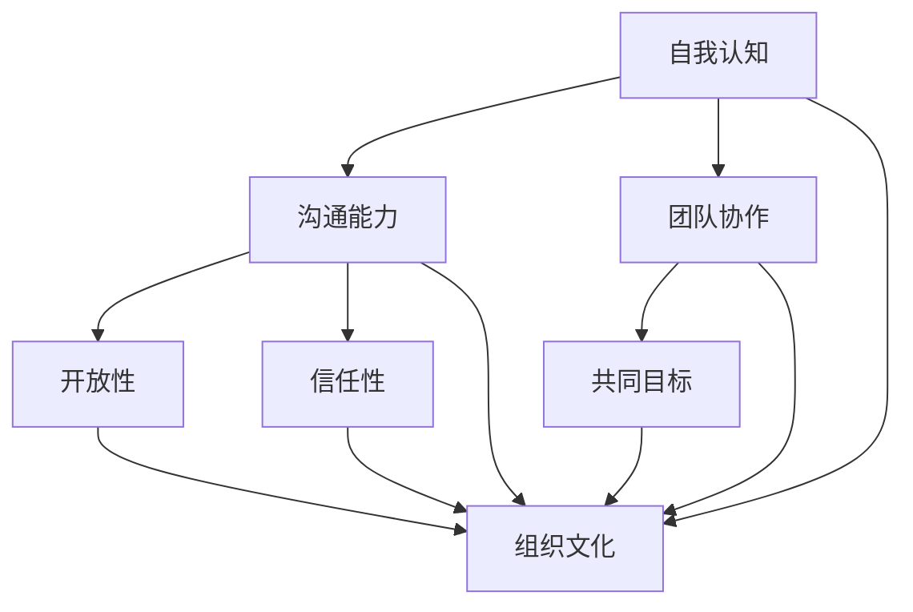

                 

### 引言：谦逊领导的概念与重要性

#### 1.1 谦逊领导定义

谦逊领导是一种领导方式，它强调领导者不仅要具备卓越的领导能力和知识，还要拥有谦逊的心态和自我反思的精神。谦逊领导不仅仅是一种行为模式，更是一种领导哲学。它主张领导者应该承认自己的不足，愿意接受他人的批评和建议，并在实践中不断学习和改进。

谦逊领导与传统领导方式有所不同。传统的领导方式常常强调权威和控制，领导者往往以自我为中心，忽视团队成员的意见和建议。而谦逊领导则更注重团队合作和共同成长。谦逊领导者愿意与团队成员平等交流，倾听不同的声音，并从中汲取智慧。

#### 1.2 谦逊领导的重要性

谦逊领导在现代社会中具有极其重要的意义。首先，谦逊领导能够促进团队的合作和沟通。在一个谦逊的领导环境中，团队成员更愿意分享自己的想法和观点，这将有助于团队的创新和进步。其次，谦逊领导能够提高组织的适应能力。在快速变化的市场环境中，组织需要不断地调整和改进。谦逊领导者愿意承认错误，从失败中学习，这使得组织能够更快地适应新的变化。

此外，谦逊领导还有助于建立组织的信任文化。当领导者能够真诚地承认错误并努力改进时，团队成员会感到领导者是值得信赖的。这种信任关系不仅能够提高团队的士气，还能够增强组织的凝聚力。

然而，实现谦逊领导并不容易。谦逊领导要求领导者具备较高的自我认知能力，能够真诚地面对自己的不足。同时，领导者还需要具备开放的心态，愿意接受他人的反馈和建议。这对于一些习惯于权威和控制的传统领导者来说，无疑是一个巨大的挑战。

#### 1.3 谦逊领导的挑战与机遇

谦逊领导的实施过程中，领导者将面临诸多挑战。首先，领导者需要克服自己的虚荣心和自尊心。在传统领导观念中，领导者往往被视为权威和智慧的象征，承认错误可能会损害他们的形象。然而，谦逊领导要求领导者放下这种观念，真诚地面对自己的不足。

其次，谦逊领导要求领导者具备良好的沟通能力。领导者需要能够有效地与团队成员沟通，传达自己的观点和期望，同时也需要倾听团队成员的声音。这对于一些不擅长沟通的领导者来说，是一个巨大的挑战。

然而，面对这些挑战，谦逊领导也为领导者提供了巨大的机遇。通过谦逊领导，领导者能够建立更加和谐、高效的团队关系，提高组织的整体绩效。此外，谦逊领导还能够提升领导者的个人魅力和影响力，使其在组织中获得更高的认可和尊重。

总之，谦逊领导是一种重要的领导方式，它不仅有助于提升团队的绩效，还能够提高组织的适应能力和凝聚力。虽然实施谦逊领导面临诸多挑战，但通过克服这些挑战，领导者能够获得更大的机遇和成功。

### 谦逊领导的理论基础

谦逊领导并非凭空出现，它有其深厚的理论基础。了解这些理论基础，有助于我们更全面地理解谦逊领导的概念和重要性。

#### 2.1 谦逊领导理论的发展历程

谦逊领导的概念在管理学领域已有悠久的历史。早在20世纪初，管理学大师彼得·德鲁克（Peter Drucker）就提出了“领导者应该以身作则”的观点。他认为，领导者不仅要具备卓越的领导能力，还要具备高尚的品质，如诚实、正直和谦逊。这一观点为后来的谦逊领导理论奠定了基础。

在21世纪初，随着管理学理论的不断发展和变革，谦逊领导逐渐成为一个独立的领域。一些学者开始深入研究谦逊领导的理论基础，提出了许多新的观点和理论。例如，心理学家卡尔·罗杰斯（Carl Rogers）提出了“非指导性领导”（nondirective leadership）理论，主张领导者应该尊重团队成员的自我决定权和独立性。这一理论为谦逊领导提供了一种新的视角。

#### 2.2 谦逊领导的核心要素

谦逊领导的核心要素主要包括自我认知、沟通能力和团队协作。

1. **自我认知**：谦逊领导者具备较高的自我认知能力，能够真诚地面对自己的不足。他们不仅知道自己的优点，也知道自己的缺点。这种自我认知使得他们能够更加客观地看待自己和团队，从而更好地发挥领导作用。

2. **沟通能力**：谦逊领导者具备良好的沟通能力，能够与团队成员进行有效的沟通。他们不仅能够清晰地传达自己的观点和期望，还能够倾听团队成员的声音，理解他们的需求和想法。这种沟通能力有助于建立良好的团队关系，提高团队的凝聚力和合作效率。

3. **团队协作**：谦逊领导者注重团队协作，愿意与团队成员共同成长。他们能够充分信任团队成员，给予他们足够的自由和空间，鼓励他们发挥自己的才能。同时，谦逊领导者也愿意承担团队的责任，共同面对挑战和困难。

#### 2.3 谦逊领导与组织文化

谦逊领导与组织文化密切相关。一个具有谦逊领导氛围的组织，往往具有以下特点：

1. **开放性**：组织鼓励成员表达不同的观点和意见，形成开放的氛围。这种开放性有助于团队成员之间的沟通和协作，提高组织的创新能力和竞争力。

2. **信任性**：组织成员之间相互信任，领导者能够真诚地承认错误并努力改进。这种信任关系有助于提高团队成员的工作积极性和效率。

3. **共同目标**：组织成员具有共同的目标和愿景，愿意为实现组织的目标而努力。这种共同目标有助于提高团队的凝聚力，增强组织的整体竞争力。

总之，谦逊领导是一种重要的领导方式，它不仅有助于提升团队的绩效，还能够促进组织的健康发展。了解谦逊领导的理论基础，有助于我们更好地理解和实践谦逊领导。

#### 2.4 谦逊领导理论的核心概念与联系

为了更好地理解谦逊领导理论，我们需要构建一个核心概念之间的关系架构，使用Mermaid流程图来展示这些概念之间的相互关系。

这个Mermaid流程图展示了谦逊领导的核心概念及其相互关系。首先，自我认知是谦逊领导的基础，它直接影响沟通能力和团队协作。良好的沟通能力有助于建立开放性和信任性，而团队协作则有助于实现共同目标。这些核心概念共同构成了组织文化的基石，从而推动组织的健康发展。

通过这种关系架构的展示，我们可以更清晰地理解谦逊领导的理论内涵，认识到各个核心概念之间的密切联系。这有助于我们在实际工作中更好地实践谦逊领导，提升团队的绩效和组织的竞争力。

### 谦逊领导的行为特征

谦逊领导的行为特征是领导者在实际工作中表现出的具体行为，这些行为不仅体现了谦逊领导的核心理念，还能对团队成员产生积极的影响。

#### 3.1 自我意识与反思

自我意识是谦逊领导的一个重要特征。谦逊领导者对自己的能力和局限性有清晰的认识，他们不仅了解自己的优点，也勇于面对自己的不足。这种自我意识使他们在工作中能够更加客观地评估自己的表现，避免盲目自信或自我怀疑。

反思是谦逊领导的另一重要行为特征。谦逊领导者习惯于在完成任务后进行自我反思，分析自己的决策和行为，从中吸取经验教训。通过反思，他们能够不断优化自己的工作方法，提高领导效能。例如，当团队遇到挑战时，谦逊领导者会首先反思自己的决策是否合理，是否存在改进的空间。

#### 3.2 求知欲与学习能力

谦逊领导者具有强烈的求知欲和学习能力。他们渴望不断学习新知识、新技能，以适应快速变化的工作环境。求知欲使他们主动寻找学习机会，如参加培训课程、阅读专业书籍或与行业专家交流。学习能力则使他们能够迅速吸收和应用新知识，将其转化为实际的工作成果。

在学习过程中，谦逊领导者不仅关注理论知识，更注重实践应用。他们会通过实际案例来验证理论，确保所学知识能够真正解决工作中的问题。例如，在项目管理中，谦逊领导者可能会学习最新的敏捷管理方法，并通过实际项目来验证其有效性。

#### 3.3 开放式沟通与反馈

开放式沟通是谦逊领导的关键特征之一。谦逊领导者鼓励团队成员畅所欲言，分享他们的想法和意见。这种开放性不仅有助于团队内部的沟通，还能激发成员的创造力和创新精神。例如，在团队会议中，谦逊领导者会鼓励成员提出不同的观点，并通过讨论来达成共识。

反馈是谦逊领导的重要工具。谦逊领导者不仅愿意接受团队成员的反馈，还主动寻求反馈。他们相信，通过反馈，可以发现自己的不足并加以改进。例如，在项目评估阶段，谦逊领导者会邀请团队成员提出意见和建议，以帮助团队更好地完成任务。

#### 3.4 尊重与支持

谦逊领导者尊重团队成员的意见和决策，支持他们的工作。他们相信每个成员都有独特的价值和能力，能够为团队作出贡献。例如，在团队讨论中，谦逊领导者会认真倾听每个成员的意见，并给予充分的尊重。

此外，谦逊领导者还提供必要的支持和资源，帮助团队成员克服困难，实现目标。例如，在项目执行过程中，谦逊领导者会为团队成员提供技术支持和心理辅导，确保他们能够顺利完成任务。

通过这些具体的行为特征，谦逊领导者不仅能够提升团队的绩效，还能培养团队成员的自信心和积极性，为组织的长期发展奠定坚实的基础。

#### 3.5 谦逊领导的行为特征与谦逊领导理论的关系

谦逊领导的行为特征与谦逊领导理论之间有着密切的联系。这些特征不仅体现了谦逊领导的核心要素，如自我认知、沟通能力和团队协作，还通过具体的行为实践来验证这些理论的有效性。

首先，自我意识与反思是谦逊领导理论的基础。谦逊领导者通过自我反思，不断评估和调整自己的行为，从而提高自我认知。这种自我认知使他们能够真诚地面对自己的不足，从而更好地履行领导职责。这与谦逊领导理论中的自我认知要素是一致的。

其次，求知欲与学习能力是谦逊领导理论的扩展。谦逊领导者通过不断学习和吸收新知识，不断提升自己的能力和领导水平。这种求知欲和学习能力不仅有助于个人成长，还能带动整个团队的进步。这与谦逊领导理论中的持续学习要素相吻合。

开放式沟通与反馈是谦逊领导理论在实践中的具体体现。谦逊领导者通过开放性沟通，鼓励团队成员表达不同的观点和意见，从而形成良好的沟通氛围。同时，他们通过主动寻求和接受反馈，不断完善自己的领导方法和决策。这与谦逊领导理论中的开放性和反馈要素密切相关。

最后，尊重与支持是谦逊领导理论的核心特征之一。谦逊领导者尊重团队成员的意见和决策，并提供必要的支持和资源，确保团队成员能够充分发挥自己的潜力。这种尊重与支持不仅能够提高团队成员的工作积极性，还能增强团队的凝聚力。这与谦逊领导理论中的团队协作要素相一致。

通过这些具体的行为特征，谦逊领导者不仅体现了谦逊领导理论的核心要素，还在实际工作中验证了这些理论的有效性。这些行为特征不仅有助于提升团队的绩效，还能为组织的长期发展提供坚实的支持。

### 承认错误的艺术

承认错误是谦逊领导中至关重要的一部分，它不仅体现了领导者的真诚和勇气，还能够为团队和组织带来积极的影响。然而，承认错误并非一件容易的事情，领导者需要在适当的时机和方法上做出正确的决策。

#### 4.1 错误认知的转变

首先，领导者需要认识到错误是成长的一部分。在传统的领导观念中，错误往往被视为失败和耻辱的象征，领导者害怕承认错误，担心这会损害他们的形象和权威。然而，在现代管理学中，错误被视为学习和改进的机会。领导者需要转变对错误的认知，将其视为一种正常现象，而不是一种例外。

其次，领导者需要认识到，承认错误并不意味着他们必须是全能的。在快速变化的环境中，没有任何人能够做到完美无缺。领导者承认错误，实际上是在向团队成员传达一个信息：即使是领导者也会犯错误，但是他们会从错误中学习并改进。

#### 4.2 承认错误的策略

为了有效地承认错误，领导者可以采取以下策略：

1. **及时承认**：领导者应该在错误发生后尽快承认，避免拖延。这样可以减少错误的负面影响，并让团队成员看到领导者真诚的态度。

2. **具体说明**：领导者应该具体说明错误的性质和原因，而不是简单地道歉。这样可以让团队成员了解到错误的具体情况，从而更好地理解领导者的立场。

3. **承担责任**：领导者应该明确表示他们将承担错误的责任，而不是将责任推卸给其他成员。这可以树立领导者负责任的形象，增强团队成员的信任感。

4. **提出改进措施**：领导者应该在承认错误的同时，提出具体的改进措施。这不仅可以显示领导者的决心和诚意，还可以为团队提供改进的方向。

#### 4.3 从错误中学习

承认错误只是第一步，更重要的是要从错误中学习。领导者可以通过以下方式来实现这一目标：

1. **反思与总结**：领导者应该反思错误的根本原因，总结经验教训，避免类似错误再次发生。这可以通过定期的反思会议或个人日记来实现。

2. **培训与指导**：领导者可以通过培训和教育来提高团队成员的技能和知识，从而减少错误的发生。例如，可以组织技能培训、研讨会或工作坊。

3. **建立反馈机制**：领导者应该建立有效的反馈机制，鼓励团队成员提供意见和建议。这样不仅可以发现潜在的问题，还可以为团队提供改进的机会。

4. **鼓励试错**：领导者应该鼓励团队成员勇于尝试新的方法和想法，即使这些尝试可能失败。这样可以培养团队成员的创新精神和解决问题的能力。

总之，承认错误是谦逊领导的重要组成部分。通过正确的认知、策略和学习方法，领导者不仅能够提升自己的领导能力，还能够为团队和组织创造积极的氛围，推动组织的持续发展。

### 虚心学习的实践方法

虚心学习是谦逊领导的关键要素，它要求领导者持续地更新知识和技能，以适应不断变化的环境。在现代社会，技术进步日新月异，领导者必须具备强烈的求知欲和学习能力，才能带领团队取得成功。以下是一些具体的实践方法，可以帮助领导者实现虚心学习。

#### 5.1 虚心学习的重要性

首先，虚心学习对于提升领导者的综合素质至关重要。通过不断学习，领导者可以拓宽视野，增强解决问题的能力，提高决策水平。这不仅有助于个人成长，还能够为团队和组织带来积极的变革。

其次，虚心学习有助于建立信任和尊重的领导形象。当领导者展现出愿意学习和接受反馈的态度时，团队成员会更加信任和尊重他们。这种信任关系能够增强团队的凝聚力，提高团队的整体绩效。

此外，虚心学习还能够提升组织的创新能力。在一个持续学习的企业文化中，成员愿意分享知识和经验，共同探索新的解决方案。这种开放和合作的精神有助于企业保持竞争优势，实现可持续发展。

#### 5.2 虚心学习的原则

为了实现有效的虚心学习，领导者应遵循以下原则：

1. **主动学习**：领导者应主动寻求学习机会，不仅限于正式的教育培训，还可以通过自学、阅读、参加行业研讨会等方式获取知识。

2. **持续学习**：学习是一个持续的过程，领导者应将其视为一种生活方式，而不是一项临时任务。定期评估自己的知识结构，确保不断更新和补充。

3. **批判性思维**：领导者应具备批判性思维，不仅接受新知识，还要批判性地分析其适用性和局限性。这样可以避免盲目跟风，确保学习的有效性。

4. **反思与总结**：学习后的反思和总结是关键步骤。领导者应定期回顾自己的学习成果，分析哪些方法有效，哪些需要改进，以便在未来的学习中进行调整。

#### 5.3 虚心学习的技巧

以下是实现虚心学习的一些实用技巧：

1. **时间管理**：合理安排学习时间，确保每天有固定的学习时间。可以利用碎片时间，如通勤或休息时间，进行阅读或学习。

2. **知识共享**：鼓励团队成员分享知识和经验，建立知识共享的平台，如内部博客、讨论组或培训课程。这样可以形成良好的学习氛围，促进知识的传播和运用。

3. **跨学科学习**：领导者应尝试跨学科学习，不仅限于自己的专业领域，还可以涉及其他相关领域。这样可以拓宽知识面，提高综合解决问题的能力。

4. **实践应用**：将所学知识应用到实际工作中，通过实践来验证和巩固所学。这不仅可以加深对知识的理解，还可以发现新问题和挑战，为持续学习提供动力。

5. **反馈与改进**：定期接受团队成员的反馈，了解他们在工作中遇到的问题和挑战。根据反馈进行自我评估和改进，确保学习成果能够真正转化为工作效能。

总之，虚心学习是谦逊领导的重要实践方法。通过遵循学习原则和运用学习技巧，领导者不仅能够提升自己的综合素质，还能够为团队和组织创造持续的价值。持续的学习和成长，是领导者实现长期成功的关键。

### 谦逊领导力在组织中的应用

谦逊领导力在组织中的应用，不仅能够提升领导者的个人影响力，还能够对整个组织的文化、项目管理和团队建设产生深远的影响。

#### 6.1 谦逊领导力对企业文化的塑造

谦逊领导力对组织文化的塑造具有重要作用。首先，谦逊领导者能够建立一种开放、包容和信任的企业文化。他们鼓励团队成员自由表达观点，尊重不同的意见，这种开放性有助于激发团队的创造力和创新精神。

其次，谦逊领导者通过自我反思和接受反馈，树立了诚实和透明的榜样。他们不仅承认自己的错误，还愿意公开分享失败和挑战的经历。这种做法能够打破组织的恐惧文化，鼓励团队成员勇于面对问题和挑战，从而促进企业的持续改进和成长。

此外，谦逊领导力还强调共同成长和团队协作。领导者愿意与团队成员共同学习和进步，这不仅能够提高团队成员的能力和信心，还能增强团队的凝聚力和协作精神。这种文化氛围有助于形成强大的团队合力，推动组织的整体发展。

#### 6.2 谦逊领导力在项目管理中的应用

在项目管理中，谦逊领导力同样发挥着重要作用。首先，谦逊领导者能够建立清晰的项目目标和愿景，他们通过与团队成员的深入沟通，确保每个成员都理解项目的目标和期望。这种透明的沟通有助于减少项目中的误解和冲突，提高团队的工作效率。

其次，谦逊领导者注重项目过程中的风险管理。他们鼓励团队成员提出潜在的风险和问题，并通过开放性的讨论来制定应对措施。这种主动识别和解决风险的做法，能够有效降低项目失败的概率，提高项目的成功率。

此外，谦逊领导者还强调项目的持续改进。他们通过定期的项目回顾和反思，分析项目中的优点和不足，并制定改进措施。这种持续改进的精神，有助于项目团队不断提升项目管理和执行能力，从而实现项目的长期成功。

#### 6.3 谦逊领导力在团队建设中的作用

谦逊领导力在团队建设中具有独特的作用。首先，谦逊领导者通过开放性和信任性，建立了一种积极的团队氛围。团队成员在这种氛围中，更愿意分享自己的想法和观点，提出改进意见和建议。这种开放性有助于团队的创新和进步。

其次，谦逊领导者注重团队成员的个人成长和职业发展。他们不仅提供必要的培训和发展机会，还鼓励团队成员自主学习和提升。这种关注和支持，能够提高团队成员的工作满意度和忠诚度，从而增强团队的稳定性。

此外，谦逊领导者通过团队协作和共同目标，增强了团队的凝聚力。他们鼓励团队成员相互支持、共同承担责任，形成了一种紧密的团队关系。这种团队关系不仅能够提高团队的工作效率，还能在面对挑战时提供强大的支持。

总之，谦逊领导力在组织中的应用，不仅能够提升领导者的个人魅力和影响力，还能够对企业的文化、项目管理和团队建设产生积极的推动作用。通过实践谦逊领导力，组织能够建立一种开放、包容、创新和协作的文化氛围，从而实现长期的可持续发展。

### 案例分析：谦逊领导实践

在实际工作中，谦逊领导力通过具体案例得以体现。以下我们将分析三个不同类型的组织，探讨他们在实践中如何运用谦逊领导力，并取得了显著成效。

#### 7.1 案例一：跨国公司的谦逊领导实践

一个成功的案例是一家全球知名的跨国公司。该公司CEO在接任之初，发现公司内部存在严重的沟通障碍和部门壁垒，导致项目进度缓慢、创新能力不足。为了解决这些问题，CEO采取了以下谦逊领导策略：

1. **开放沟通**：CEO定期组织跨部门会议，邀请不同部门的主管和员工参与。在会议上，CEO鼓励成员提出问题和建议，并耐心倾听。这种开放性的沟通环境，使得团队成员能够自由表达意见，增强了团队之间的信任和理解。

2. **承认错误**：CEO在管理过程中，勇于承认自己的错误，并在公开场合向员工道歉。例如，在一次重大项目失败后，CEO亲自召开全体员工会议，承认项目管理的不足，并提出了具体的改进措施。这种真诚的态度赢得了员工的信任和支持。

3. **共同学习**：CEO提倡团队合作，鼓励员工通过跨部门合作项目来提升技能和知识。他本人也积极参与项目，与员工共同学习和进步。这种共同学习的氛围，促进了公司内部的知识共享和技能提升。

通过这些谦逊领导实践，公司内部的沟通障碍和部门壁垒逐渐消失，团队协作效率显著提高。员工的工作积极性和创造力也大幅提升，公司逐渐恢复了市场竞争力。

#### 7.2 案例二：初创企业的谦逊领导实践

另一个典型的案例是一家初创企业。这家公司在成立初期，面临着市场环境变化快、资源有限等挑战。CEO在管理过程中，通过以下方式实践谦逊领导力：

1. **反思与调整**：CEO在每次项目失败后，都会组织团队成员进行深入反思，分析失败的原因和教训。他鼓励员工提出改进建议，并在公司内部进行分享。这种反思文化使得公司能够在失败中不断学习和进步。

2. **学习与适应**：CEO本人具备强烈的求知欲和学习能力，他不断学习新的管理知识和技能，并将其应用到公司运营中。他鼓励团队成员也积极学习，提供培训和发展机会。这种持续学习的氛围，使得公司在快速变化的市场环境中，能够迅速适应并抓住机遇。

3. **透明管理**：CEO在公司内部实行透明管理，定期向员工公布公司运营数据和财务状况。他鼓励员工提出意见和建议，积极参与公司决策。这种透明度增强了员工的归属感和责任感，提高了公司的管理效率。

通过这些谦逊领导实践，初创企业在激烈的市场竞争中脱颖而出，逐渐成长为行业的领先者。员工的工作积极性和创新能力大幅提升，公司的发展速度和质量都得到了显著改善。

#### 7.3 案例三：非营利组织的谦逊领导实践

最后一个案例是一个非营利组织。这个组织致力于环保事业，但其资源和影响力有限。在领导者的带领下，组织通过以下谦逊领导实践，取得了显著成效：

1. **社区参与**：组织领导者在制定环保项目时，注重与社区居民的沟通和合作。他们定期组织社区会议，了解居民的需求和意见，并根据反馈调整项目方案。这种社区参与的方式，不仅提高了项目的有效性，还增强了组织的社区影响力。

2. **资源整合**：领导者善于整合内外部资源，与政府、企业和其他非营利组织建立合作关系。他们通过资源共享和合作，提高了项目的执行效率和影响力。例如，他们与一家环保企业合作，获得了技术支持和资金赞助，使得项目得以顺利进行。

3. **持续反思**：领导者重视项目的持续反思，定期评估项目成果和效果。他们鼓励员工提出改进意见，并根据反馈进行项目调整。这种持续反思的文化，使得组织能够在不断变化的环境中，保持项目的活力和创新能力。

通过这些谦逊领导实践，非营利组织在环保领域取得了显著成果，不仅提高了组织的公信力和影响力，还带动了更多的社会资源投入到环保事业中。

总之，这些案例表明，谦逊领导力在不同类型的组织中，都可以发挥重要作用。通过开放沟通、承认错误、共同学习和透明管理，组织能够建立积极的团队关系，提升整体绩效，实现可持续发展。

### 总结与展望

谦逊领导作为一种重要的领导方式，其在现代组织中的价值不容忽视。本文通过多个方面的深入探讨，揭示了谦逊领导的概念、理论基础、行为特征及其在组织中的应用。谦逊领导不仅能够提升领导者的个人影响力，还能为组织创造积极的文化氛围，提高团队的协作效率和创新能力。

首先，谦逊领导强调自我认知和反思，这有助于领导者真诚地面对自己的不足，并持续改进。其次，谦逊领导者具备良好的沟通能力，能够建立开放、信任的团队关系，促进知识共享和团队协作。此外，谦逊领导强调共同成长和透明管理，有助于增强团队的凝聚力和组织的适应能力。

然而，谦逊领导在实践中也面临诸多挑战，如克服虚荣心和自尊心、提升沟通能力等。领导者需要通过持续学习和自我提升，克服这些挑战，实现谦逊领导。

未来，谦逊领导的研究和实践将继续深入。随着组织环境的不断变化，谦逊领导理论需要不断创新和发展，以适应新的挑战和机遇。例如，在数字化和全球化背景下，谦逊领导如何适应远程工作和跨文化团队，将是未来研究的重要方向。

总之，谦逊领导是一种具有深远意义的领导方式，它不仅有助于提升个人的领导能力，还能为组织的长期发展提供坚实的支持。通过不断学习和实践谦逊领导，领导者能够为组织创造更加积极和可持续的未来。

### 拓展阅读与最佳实践

为了进一步深入了解谦逊领导，以下是一些推荐书籍、文章和最佳实践，供读者参考。

#### 书籍推荐

1. **《谦逊领导：从自我认知到团队协作的实践指南》** - 作者：（美）史蒂芬·罗宾斯
   - 本书详细介绍了谦逊领导的理论和实践方法，适合希望提升领导能力的领导者阅读。

2. **《领导者的五个层次》** - 作者：（美）拉姆·查兰
   - 本书通过五个层次的理论，探讨了领导者如何在不同阶段提升领导能力，其中包括谦逊领导的重要性。

3. **《卓越领导者的秘密》** - 作者：（美）约翰·麦斯威尔
   - 本书分享了多位卓越领导者的故事和经验，强调了谦逊领导在个人和团队成长中的关键作用。

#### 文章推荐

1. **《如何在组织中实践谦逊领导》** - 作者：杰克·韦尔奇（Jack Welch）
   - 本文是前通用电气CEO杰克·韦尔奇关于谦逊领导的文章，分享了他在领导实践中的经验和教训。

2. **《谦逊领导：如何在不确定的环境中保持领导力》** - 作者：彼得·德鲁克（Peter Drucker）
   - 本文由管理学大师彼得·德鲁克撰写，探讨了谦逊领导在不确定环境中的重要性。

3. **《谦逊领导与组织文化》** - 作者：詹姆斯·M·库泽斯（James M. Kouzes）和巴里·波斯纳（Barry Z. Posner）
   - 本文由领导力研究专家撰写，分析了谦逊领导对组织文化的影响和构建方法。

#### 最佳实践

1. **建立反思文化**：定期组织团队反思会议，鼓励团队成员分享经验和反思工作中的不足，从中汲取教训。

2. **开展培训与发展**：为团队成员提供定期的培训和职业发展机会，帮助他们提升技能和知识，增强团队凝聚力。

3. **设立反馈机制**：建立有效的反馈机制，鼓励团队成员互相反馈意见和建议，确保团队成员能够持续改进。

4. **实践开放沟通**：鼓励团队成员自由表达观点，建立开放的沟通环境，促进知识共享和团队协作。

通过阅读这些书籍和文章，实践这些最佳方法，领导者可以更好地理解和应用谦逊领导，为组织和团队的长期发展奠定坚实基础。

