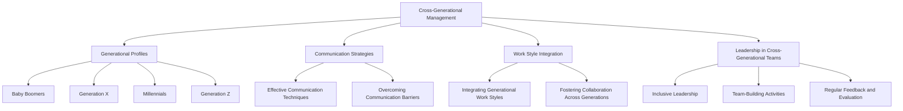
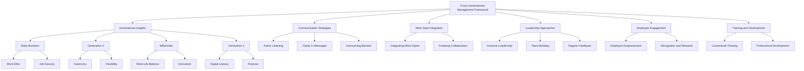

                 

### Introduction

#### What is Cross-Generational Management?

**Definition and Scope**

Cross-generational management refers to the approach of leading, coordinating, and optimizing teams consisting of individuals from different generations. In today's dynamic and diverse workplace, this concept has gained significant importance. As the workforce becomes increasingly multicultural and multigenerational, managers and leaders are confronted with the challenge of balancing the unique characteristics and expectations of each generation.

The scope of cross-generational management encompasses various aspects such as communication strategies, work styles, leadership roles, and team collaboration. It involves understanding the historical, cultural, and social context that shapes each generation's values, attitudes, and behaviors. The goal is to create an inclusive and harmonious work environment that leverages the strengths of each generation while mitigating potential conflicts and inefficiencies.

**Importance in Today's Diverse Workplaces**

The importance of cross-generational management in today's diverse workplaces cannot be overstated. Several factors contribute to this:

1. **Globalization**: The rise of globalization has led to an increased flow of talent across borders. Organizations now have the opportunity to hire individuals from different cultures and generations, bringing diverse perspectives and skills to the table. Effective cross-generational management is crucial in harnessing this diversity and creating a cohesive team.

2. **Demographic Shifts**: The aging population and the increasing number of younger workers are causing significant demographic shifts in the workforce. Managing a multigenerational team requires understanding the different values, priorities, and work habits of each generation to maintain productivity and morale.

3. **Technological Advancements**: The rapid pace of technological advancements has also impacted the way we work. Different generations have varying levels of familiarity and comfort with technology, and managers need to adapt their strategies to accommodate these differences.

4. **Employee Engagement and Retention**: Engaging and retaining employees from different generations is a key challenge for organizations. Cross-generational management helps create a work environment that resonates with all employees, fostering loyalty and reducing turnover.

In conclusion, cross-generational management is essential for navigating the complexities of today's diverse workplaces. By understanding and embracing the unique characteristics of each generation, managers can build high-performing teams that drive innovation, productivity, and overall success.

### Challenges in Cross-Generational Teams

**Communication Barriers**

One of the primary challenges in managing cross-generational teams is communication barriers. These barriers can manifest in various forms, such as differences in language usage, cultural nuances, and communication styles. For example, Baby Boomers may prefer face-to-face communication and structured meetings, while Millennials and Generation Z might favor digital communication tools and flexible working hours.

**Generational Differences in Work Styles**

Generational differences in work styles can also lead to challenges in cross-generational teams. Each generation has its own set of values, priorities, and approaches to work. For instance, Baby Boomers tend to value loyalty, hard work, and a strong work ethic, while Generation Z prioritizes work-life balance, flexibility, and personal growth. These differences can create conflicts if not managed effectively.

**Managing Multiple Generations in One Team**

Managing a team with multiple generations requires a nuanced approach. Leaders must be aware of the unique needs and expectations of each generation and adapt their management strategies accordingly. This includes understanding the different career development paths, communication preferences, and work-life balance priorities of each generation.

** Strategies to Overcome Communication Barriers**

To overcome communication barriers in cross-generational teams, managers can adopt several strategies:

1. **Active Listening**: Encouraging active listening can help bridge the communication gap. This involves paying attention to non-verbal cues, asking clarifying questions, and demonstrating empathy.

2. **Cultural Awareness**: Developing cultural awareness can help managers navigate cultural differences and avoid misunderstandings. This includes understanding the historical and social context that shapes each generation's values and communication styles.

3. **Open Dialogue**: Creating a safe and open environment for dialogue can encourage team members to express their thoughts and concerns. This can be facilitated through regular team meetings, feedback sessions, and open-door policies.

4. **Technology Utilization**: Leveraging technology can help bridge communication gaps. Tools such as video conferencing, instant messaging, and project management software can facilitate communication and collaboration across generations.

** Strategies to Address Generational Differences in Work Styles**

To address generational differences in work styles, managers can implement the following strategies:

1. **Flexibility**: Offering flexible work arrangements, such as remote work, flextime, and compressed workweeks, can accommodate the different work styles and preferences of each generation.

2. **Training and Development**: Providing training and development opportunities tailored to the unique needs of each generation can help bridge the skills gap and foster a sense of inclusivity.

3. **Mentorship Programs**: Establishing mentorship programs can facilitate knowledge sharing and cross-generational learning. This can help younger employees gain insights from more experienced colleagues and vice versa.

4. **Inclusion and Diversity Initiatives**: Implementing inclusion and diversity initiatives can help create a work environment that values and respects the unique perspectives of each generation.

** Strategies for Managing Multiple Generations in One Team**

To effectively manage a team with multiple generations, managers can adopt the following strategies:

1. **Inclusive Leadership**: Embracing inclusive leadership principles can help managers create an environment where all team members feel valued and heard. This involves promoting open communication, recognizing diverse contributions, and fostering a culture of respect and collaboration.

2. **Team-Building Activities**: Organizing team-building activities and events that cater to the interests and preferences of different generations can help foster camaraderie and unity within the team.

3. **Regular Feedback and Evaluation**: Conducting regular feedback and evaluation sessions can help identify areas of improvement and ensure that the needs of all team members are being met.

4. **Leadership Development**: Investing in leadership development programs can help managers build the skills and confidence needed to effectively lead and manage a diverse team.

In conclusion, managing cross-generational teams involves addressing various challenges related to communication barriers, generational differences in work styles, and managing multiple generations in one team. By adopting the right strategies and fostering an inclusive and collaborative work environment, managers can harness the strengths of each generation and drive team success.

### Baby Boomers (born 1946-1964)

**Characteristics and Values**

Baby Boomers, born between 1946 and 1964, are often characterized by their loyalty, work ethic, and strong sense of responsibility. Raised during a period of post-war prosperity and social change, they value traditional values such as hard work, discipline, and respect for authority. Baby Boomers are known for their commitment to long-term career stability and their preference for face-to-face communication and structured work environments.

**Work Styles and Expectations**

Baby Boomers typically approach work with a focus on long-term goals and a strong work ethic. They are known for their dedication to their careers and their willingness to put in long hours to achieve success. This generation often values job security and is less likely to embrace job hopping. Baby Boomers expect clear roles and responsibilities, and they prefer a hierarchical management style where decisions are made by senior leaders.

**Communication Preferences**

Baby Boomers tend to favor face-to-face communication and structured meetings. They prefer clear, direct communication and appreciate when their managers provide regular updates and feedback. They are less comfortable with ambiguous language and value transparency and openness in communication.

**Career Development and Advantages**

Baby Boomers prioritize career development and are often willing to invest in training and professional development to enhance their skills. Their strong work ethic and commitment to their careers make them highly valuable assets to any organization. They are known for their ability to mentor and guide younger employees, passing on their knowledge and experience.

**Challenges and Mitigations**

One of the main challenges of managing Baby Boomers is their preference for traditional work practices, which can sometimes conflict with the more flexible and digital-centric approaches favored by younger generations. Managers should strive to create a balance between traditional and modern work practices to accommodate the needs of all team members. Additionally, it's important to recognize and appreciate the experience and wisdom that Baby Boomers bring to the team.

### Generation X (born 1965-1979/1981)

**Characteristics and Values**

Generation X, born between 1965 and 1979/1981, is often described as a pragmatic and independent generation. Raised during a period of economic uncertainty and social change, they have developed a strong sense of self-reliance and are known for their adaptability and resourcefulness. Generation X values work-life balance, personal freedom, and a sense of humor. They tend to be critical thinkers and problem solvers, often taking on leadership roles in the workplace.

**Work Styles and Expectations**

Generation X employees typically approach work with a focus on efficiency and practicality. They value autonomy and appreciate a flexible work environment that allows them to balance their professional and personal lives. Generation X expects clear goals and expectations, and they prefer a collaborative work culture where they can contribute their ideas and expertise. They are less likely to tolerate bureaucracy and prefer direct communication with their managers and colleagues.

**Communication Preferences**

Generation X prefers a mix of communication methods, including face-to-face interactions, email, and instant messaging. They value clear and concise communication and appreciate when their managers and colleagues provide timely feedback and clarity. They are comfortable with digital communication tools and are often early adopters of new technologies.

**Career Development and Advantages**

Generation X is known for their strong work ethic and ability to adapt to changing circumstances. They are often driven by personal and professional growth and are willing to take on new challenges and responsibilities. Their experience and skills make them valuable assets to any organization. Generation X employees are also known for their ability to mentor and support younger team members, helping them navigate the complexities of the workplace.

**Challenges and Mitigations**

One of the main challenges of managing Generation X is their tendency to be critical and sometimes outspoken. Managers should foster a culture of open communication and feedback, encouraging employees to express their opinions and concerns. It's also important to provide opportunities for professional development and growth to keep Generation X engaged and motivated.

### Millennials (born 1981-1996/early 2000s)

**Characteristics and Values**

Millennials, born between 1981 and 1996/early 2000s, are often described as a generation that values diversity, inclusion, and work-life balance. Raised during a period of rapid technological advancement and economic globalization, they have grown up in a world that is more interconnected and diverse than ever before. Millennials are known for their entrepreneurial spirit, adaptability, and willingness to embrace new technologies. They value work-life balance, personal growth, and meaningful work.

**Work Styles and Expectations**

Millennials typically approach work with a focus on flexibility and autonomy. They appreciate a work environment that allows them to balance their personal and professional lives and values remote work and flexible hours. Millennials expect clear goals and feedback, and they prefer a collaborative and inclusive work culture where they can contribute their ideas and expertise. They are less likely to tolerate a hierarchical work structure and prefer a flat organizational culture.

**Communication Preferences**

Millennials prefer digital communication methods, including email, instant messaging, and video conferencing. They are comfortable with technology and often use various digital tools to stay connected and collaborate with their colleagues. They value clear and concise communication and appreciate when their managers and colleagues provide timely feedback and support.

**Career Development and Advantages**

Millennials are known for their innovative and creative thinking. They are often early adopters of new technologies and approaches to work, driving digital transformation within organizations. Their ability to adapt to changing circumstances and embrace new ideas makes them valuable assets to any organization. Millennials also prioritize personal and professional growth and are willing to take on new challenges and responsibilities.

**Challenges and Mitigations**

One of the main challenges of managing Millennials is their tendency to seek frequent feedback and support. Managers should foster a culture of continuous feedback and provide regular check-ins and development opportunities. It's also important to create a sense of purpose and meaning in the work, as Millennials are driven by the desire to contribute to something larger than themselves.

### Generation Z (born mid-1990s to early 2000s)

**Characteristics and Values**

Generation Z, born between the mid-1990s and early 2000s, is often described as a generation that has grown up in a digital world. Raised during a period of rapid technological advancement and globalization, they are known for their digital literacy, adaptability, and resourcefulness. Generation Z values diversity, inclusion, and work-life balance. They are highly motivated by innovation, personal growth, and meaningful work.

**Work Styles and Expectations**

Generation Z typically approaches work with a focus on flexibility, autonomy, and innovation. They appreciate a work environment that allows them to balance their personal and professional lives and values remote work and flexible hours. Generation Z expects clear goals and feedback, and they prefer a collaborative and inclusive work culture where they can contribute their ideas and expertise. They are comfortable with digital communication tools and often use technology to stay connected and collaborate with their colleagues.

**Communication Preferences**

Generation Z prefers digital communication methods, including instant messaging, video conferencing, and social media. They are comfortable with technology and often use various digital tools to stay connected and collaborate with their colleagues. They value clear and concise communication and appreciate when their managers and colleagues provide timely feedback and support.

**Career Development and Advantages**

Generation Z is known for their innovative and creative thinking. They are often early adopters of new technologies and approaches to work, driving digital transformation within organizations. Their ability to adapt to changing circumstances and embrace new ideas makes them valuable assets to any organization. Generation Z also prioritizes personal and professional growth and is willing to take on new challenges and responsibilities.

**Challenges and Mitigations**

One of the main challenges of managing Generation Z is their tendency to seek frequent feedback and support. Managers should foster a culture of continuous feedback and provide regular check-ins and development opportunities. It's also important to create a sense of purpose and meaning in the work, as Generation Z is driven by the desire to contribute to something larger than themselves. Additionally, understanding and addressing the unique needs of Generation Z, such as their desire for job security and a sense of belonging, can help mitigate potential challenges.

### Core Concepts in Cross-Generational Management

**Mermaid Flowchart**: Illustrating the Relationships Between Key Concepts

To provide a comprehensive understanding of cross-generational management, it's essential to map out the key concepts and their relationships. Below is a **Mermaid flowchart** that illustrates the connections between various core concepts:

**Explanation of the Flowchart**

1. **Cross-Generational Management (A)**: This is the overarching concept that encompasses the strategies and practices aimed at effectively managing diverse teams across generations.

2. **Generational Profiles (B)**: This branch includes the specific characteristics, values, and work styles of different generations, such as Baby Boomers, Generation X, Millennials, and Generation Z.

3. **Communication Strategies (C)**: This branch covers the techniques and methods for effective communication in cross-generational teams, including active listening, clarity in messages, and overcoming communication barriers.

4. **Work Style Integration (D)**: This branch focuses on integrating the unique work styles of different generations to create a harmonious and productive work environment.

5. **Leadership in Cross-Generational Teams (E)**: This branch discusses the role of leadership in managing cross-generational teams, including inclusive leadership, team-building activities, and regular feedback and evaluation.

6. **Generational Profiles (B)**: Each of the sub-nodes (F, G, H, I) provides detailed information on the characteristics and values of specific generations, helping to inform the management strategies.

7. **Communication Strategies (C)**: Each of the sub-nodes (J, K) provides specific techniques for effective communication and overcoming barriers within cross-generational teams.

8. **Work Style Integration (D)**: Each of the sub-nodes (L, M) discusses strategies for integrating different work styles and fostering collaboration across generations.

9. **Leadership in Cross-Generational Teams (E)**: Each of the sub-nodes (N, O, P) covers specific aspects of leadership, including inclusive leadership principles, team-building activities, and regular feedback mechanisms.

This flowchart provides a structured overview of the core concepts in cross-generational management, illustrating how they are interconnected and how each contributes to the overall effectiveness of managing diverse teams. By understanding these concepts and their relationships, managers can better navigate the challenges and harness the strengths of cross-generational teams.

### Management Frameworks for Cross-Generational Teams

**Mermaid Diagram**: Visualizing the Framework Components

To effectively manage cross-generational teams, it's essential to have a well-defined framework that encompasses various components. Below is a **Mermaid diagram** that visualizes the key elements of a cross-generational management framework:

**Explanation of the Diagram**

1. **Cross-Generational Management Framework (A)**: This is the central component that integrates various strategies and approaches to effectively manage teams with diverse generations.

2. **Generational Insights (B)**: This section provides deep insights into the characteristics, values, and work styles of different generations, including Baby Boomers, Generation X, Millennials, and Generation Z.

3. **Communication Strategies (C)**: This component focuses on enhancing communication within cross-generational teams through active listening, clear messaging, and overcoming communication barriers.

4. **Work Style Integration (D)**: This section addresses the integration of diverse work styles to foster a cohesive and productive team environment.

5. **Leadership Approaches (E)**: This component emphasizes the role of leadership in managing cross-generational teams, including inclusive leadership principles, team-building activities, and regular feedback mechanisms.

6. **Employee Engagement (F)**: This section highlights strategies for engaging employees from different generations, such as empowerment, recognition, and rewards.

7. **Training and Development (G)**: This component focuses on providing customized training and professional development opportunities to enhance the skills and capabilities of all team members.

8. **Generational Profiles (B)**: Each of the sub-nodes (H, I, J, K) provides detailed information on the specific characteristics and values of each generation, helping to inform the management strategies.

9. **Communication Strategies (C)**: Each of the sub-nodes (L, M, N) provides specific techniques for effective communication within cross-generational teams.

10. **Work Style Integration (D)**: Each of the sub-nodes (O, P) discusses strategies for integrating different work styles and fostering collaboration across generations.

11. **Leadership Approaches (E)**: Each of the sub-nodes (Q, R, S) covers specific aspects of leadership, including inclusive leadership principles, team-building activities, and regular feedback mechanisms.

12. **Employee Engagement (F)**: Each of the sub-nodes (T, U) emphasizes strategies for engaging employees, such as empowerment and recognition.

13. **Training and Development (G)**: Each of the sub-nodes (V, W) focuses on providing customized training and professional development opportunities.

This diagram provides a comprehensive visual representation of the key components of a cross-generational management framework, illustrating how each element contributes to the overall effectiveness of managing diverse teams. By understanding and implementing these components, managers can create a cohesive and high-performing team that leverages the strengths of each generation.

### Effective Communication Techniques

**Active Listening**

Active listening is a crucial communication technique for bridging the generational gap in cross-generational teams. It involves fully concentrating, understanding, responding, and remembering what is being said. To practice active listening, managers can follow these steps:

1. **Focus on the Speaker**: Give your undivided attention to the speaker. Maintain eye contact and avoid distractions.
2. **Paraphrase and Summarize**: Repeat or summarize what the speaker has said to ensure you have understood correctly. This also helps to clarify any misunderstandings.
3. **Ask Clarifying Questions**: If there are any points you don't understand, ask for clarification. This shows that you are engaged and interested in what the speaker has to say.
4. **Provide Feedback**: Offer feedback to show that you are actively listening and processing the information. This can be as simple as nodding or using verbal cues like “I see” or “Go on.”

**Clarity in Messages**

Clear communication is essential for avoiding misunderstandings and conflicts in cross-generational teams. To ensure clarity in messages, managers should:

1. **Be Specific**: Avoid vague or ambiguous language. Clearly define tasks, expectations, and deadlines to avoid confusion.
2. **Use Simple Language**: Use language that is easy to understand, avoiding jargon or technical terms that may be unfamiliar to all team members.
3. **Provide Context**: Always provide the necessary context for your communication. This helps team members understand the bigger picture and why certain decisions or actions are necessary.
4. **Use Visual Aids**: When appropriate, use visual aids like charts, graphs, or presentations to convey complex information more effectively.

**Feedback Mechanisms**

Feedback mechanisms are vital for continuous improvement and development in cross-generational teams. Managers can implement the following feedback mechanisms:

1. **Regular Check-Ins**: Schedule regular one-on-one meetings or check-ins with team members to discuss progress, challenges, and areas for improvement.
2. **Performance Reviews**: Conduct formal performance reviews on a regular basis to provide constructive feedback on individual and team performance.
3. **Open-Door Policy**: Encourage team members to approach managers with their concerns, questions, or suggestions. Having an open-door policy fosters a culture of open communication and trust.
4. **Anonymous Surveys**: Use anonymous surveys to gather feedback from team members. This helps ensure that everyone feels comfortable sharing their thoughts and opinions.

** Mathematical Model**: Formulating a Model to Quantify Communication Effectiveness

To quantify the effectiveness of communication in cross-generational teams, managers can use a mathematical model. One approach is to measure communication effectiveness using a combination of factors such as clarity, feedback, and feedback loops. Here's a simplified mathematical model:

$$
Communication\ Efficiency = \frac{Clarity + Feedback + Feedback\ Loops}{Total\ Communication\ Attempts}
$$

Where:

- **Clarity** represents the degree to which messages are clear and specific.
- **Feedback** represents the frequency and quality of feedback provided.
- **Feedback Loops** represent the mechanisms in place for continuous feedback and improvement.

**Example: Calculating Communication Efficiency**

Assume a team has conducted 100 communication attempts in the past month. Out of these attempts, 90% of the messages were clear, 80% received constructive feedback, and there were 20 effective feedback loops. Using the model above, we can calculate the communication efficiency:

$$
Communication\ Efficiency = \frac{0.90 \times 0.80 \times 0.20}{100} = 0.0144
$$

This means that the team's communication efficiency is 1.44%. By continuously monitoring and improving these factors, managers can enhance the overall effectiveness of communication within the team.

In conclusion, effective communication techniques are essential for managing cross-generational teams. By practicing active listening, ensuring clarity in messages, and implementing robust feedback mechanisms, managers can foster a collaborative and inclusive work environment that drives team success.

### Overcoming Communication Barriers

In cross-generational teams, communication barriers can arise due to various factors such as language differences, cultural nuances, and varying communication styles. Overcoming these barriers is crucial for ensuring effective collaboration and harmony within the team. Below are several strategies to address these challenges:

#### Language and Cultural Differences

Language differences can create significant barriers in communication, especially when team members speak different native languages. To mitigate this, managers can take the following steps:

1. **Translation Services**: Provide translation services or employ bilingual team members to facilitate communication.
2. **Common Language**: Establish a common working language for the team. This ensures that all team members can communicate effectively and reduces the risk of misunderstandings.
3. **Cultural Training**: Offer cultural training programs to help team members understand and appreciate the cultural nuances of their colleagues. This includes differences in communication styles, business etiquette, and non-verbal cues.
4. **Cross-Cultural Communication Workshops**: Conduct workshops or training sessions that focus on cross-cultural communication techniques. These sessions can help team members develop the skills needed to communicate effectively across cultures.

#### Technology in Communication

Technology can be a powerful tool for overcoming communication barriers. Here are some ways to leverage technology:

1. **Digital Communication Tools**: Use digital communication tools such as instant messaging, video conferencing, and collaboration platforms to facilitate communication. These tools can help bridge the gap between team members who are geographically dispersed.
2. **Translation Apps**: Utilize translation apps or services to help team members understand each other's languages. Tools like Google Translate can be useful for providing quick translations.
3. **Language Learning Platforms**: Encourage team members to learn each other's languages through online language learning platforms. This can foster a sense of inclusivity and respect within the team.

#### Strategies to Enhance Communication Effectiveness

1. **Active Listening**: As mentioned earlier, practicing active listening is crucial for effective communication. Encourage team members to listen carefully, ask clarifying questions, and provide feedback to ensure that messages are understood correctly.
2. **Clear and Concise Messages**: Ensure that messages are clear, concise, and specific. Avoid using complex language or jargon that may be unfamiliar to all team members.
3. **Visual Aids**: Use visual aids such as charts, graphs, and presentations to convey information more effectively. Visuals can help clarify complex concepts and make messages more accessible.
4. **Regular Feedback**: Implement regular feedback mechanisms to ensure that communication is effective. This can include one-on-one meetings, team debriefs, and performance reviews.
5. **Open Dialogue**: Create a culture of open dialogue where team members feel comfortable sharing their thoughts, concerns, and ideas. This can be facilitated through open-door policies, team meetings, and suggestion boxes.

#### Mathematical Model: Formulating a Model to Quantify Communication Effectiveness

To quantify the effectiveness of communication in cross-generational teams, managers can use a mathematical model. One approach is to measure communication effectiveness using a combination of factors such as clarity, feedback, and feedback loops. Here's a simplified mathematical model:

$$
Communication\ Efficiency = \frac{Clarity + Feedback + Feedback\ Loops}{Total\ Communication\ Attempts}
$$

Where:

- **Clarity** represents the degree to which messages are clear and specific.
- **Feedback** represents the frequency and quality of feedback provided.
- **Feedback Loops** represent the mechanisms in place for continuous feedback and improvement.

**Example: Calculating Communication Efficiency**

Assume a team has conducted 100 communication attempts in the past month. Out of these attempts, 90% of the messages were clear, 80% received constructive feedback, and there were 20 effective feedback loops. Using the model above, we can calculate the communication efficiency:

$$
Communication\ Efficiency = \frac{0.90 \times 0.80 \times 0.20}{100} = 0.0144
$$

This means that the team's communication efficiency is 1.44%. By continuously monitoring and improving these factors, managers can enhance the overall effectiveness of communication within the team.

In conclusion, overcoming communication barriers in cross-generational teams requires a combination of strategies, including addressing language and cultural differences, leveraging technology, and enhancing communication techniques. By implementing these strategies and using a quantitative model to measure effectiveness, managers can create a cohesive and high-performing team that leverages the strengths of each generation.

### Integrating Generational Work Styles

**Balancing Traditional and Modern Work Practices**

In a cross-generational team, balancing traditional and modern work practices is crucial for creating a harmonious and productive work environment. Each generation brings unique perspectives and approaches to work, and it's important for managers to recognize and respect these differences while finding ways to integrate them effectively.

**Traditional Work Practices**

Traditional work practices, often favored by Baby Boomers and Generation X, include:

- **Hierarchical Organizational Structure**: Traditional work environments typically have a clear hierarchy with defined roles and reporting structures.
- **Long Work Hours**: Traditionalists value long hours and are often willing to work overtime to complete tasks.
- **Face-to-Face Communication**: Communication is usually conducted through face-to-face interactions and structured meetings.
- **Long-Term Commitment**: Traditionalists tend to stay with an organization for a longer period, valuing loyalty and job security.

**Modern Work Practices**

Modern work practices, more common among Millennials and Generation Z, include:

- **Flexible Work Arrangements**: Modern work environments emphasize flexibility, including remote work, flexible hours, and compressed workweeks.
- **Collaborative Work Culture**: Modern teams often operate in a collaborative and inclusive manner, valuing open communication and team input.
- **Agile Project Management**: Modern work practices often embrace agile methodologies, which prioritize adaptability, iterative development, and continuous improvement.
- **Emphasis on Work-Life Balance**: Modern workers prioritize a healthy work-life balance and often seek roles that allow them to balance their personal and professional lives.

** Strategies to Integrate Traditional and Modern Work Practices**

To integrate traditional and modern work practices, managers can adopt the following strategies:

1. **Blended Work Models**: Implement blended work models that combine elements of both traditional and modern practices. For example, while maintaining a clear hierarchical structure, managers can also offer flexible work arrangements and encourage collaborative environments.

2. **Tailored Work Practices**: Recognize the unique needs and preferences of each generation and tailor work practices accordingly. For instance, while Baby Boomers may appreciate face-to-face communication, Millennials and Generation Z may benefit from more digital and remote communication tools.

3. **Training and Development**: Provide training and development opportunities that help team members develop skills relevant to both traditional and modern work practices. This can include leadership development programs, communication workshops, and technology training.

4. **Mentorship Programs**: Establish mentorship programs where older and younger employees can share knowledge and insights. This can help bridge the gap between generations and foster a culture of learning and growth.

**Fostering Flexibility and Adaptability**

Fostering flexibility and adaptability within a cross-generational team is essential for ensuring that all team members can thrive. Here are some strategies to promote these qualities:

1. **Empowerment**: Empower team members to make decisions and take ownership of their work. This encourages autonomy and innovation, which are key aspects of modern work practices.

2. **Continuous Improvement**: Encourage a culture of continuous improvement where team members are constantly seeking ways to enhance their work processes. This can involve regular retrospectives and feedback sessions to identify areas for improvement.

3. **Technology Adoption**: Embrace technology to enhance communication, collaboration, and productivity. Tools like project management software, instant messaging platforms, and video conferencing can facilitate modern work practices.

4. **Cross-Generational Collaboration**: Promote cross-generational collaboration by assigning team members from different generations to work on projects together. This can foster a shared understanding and appreciation of each generation's strengths and perspectives.

**Example: A Blended Work Model in Practice**

Imagine a software development team consisting of Baby Boomers, Generation X, Millennials, and Generation Z. The team adopts a blended work model that incorporates traditional and modern practices:

- **Hierarchy**: The team has a clear hierarchy with a project manager overseeing the overall progress and a lead developer managing specific tasks.
- **Flexible Scheduling**: Team members have the option to work remotely and choose their working hours, accommodating their personal schedules.
- **Agile Methodologies**: The team follows agile methodologies, conducting daily stand-ups, sprint planning, and retrospectives to ensure continuous progress and feedback.
- **Collaborative Tools**: The team uses collaboration tools like Slack for instant communication and Trello for project management, facilitating seamless collaboration.

By balancing traditional and modern work practices and fostering flexibility and adaptability, managers can create a cohesive and high-performing team that leverages the strengths of each generation.

### Fostering Collaboration Across Generations

**Team-Building Activities**

Team-building activities are essential for creating a cohesive and collaborative environment in cross-generational teams. These activities can help break down barriers, foster trust, and promote communication among team members from different generations. Here are some effective team-building activities to consider:

1. **Outdoor Team-building Events**: Organize outdoor activities such as hiking, picnics, or sports tournaments. These events provide a relaxed and informal setting where team members can bond and interact outside the workplace.

2. **Team Lunches and Dinners**: Host regular team lunches or dinners where team members can socialize and discuss non-work-related topics. This helps to build camaraderie and create a sense of team identity.

3. **Retreats and Workshops**: Conduct team retreats or workshops focused on team-building, leadership development, and communication skills. These events provide opportunities for team members to learn from each other and develop stronger working relationships.

4. **Mentorship Programs**: Implement mentorship programs where older team members mentor younger ones. This can foster knowledge sharing and help younger team members gain insights from more experienced colleagues.

**Mentorship Programs**

Mentorship programs are an effective way to foster collaboration across generations by facilitating knowledge transfer and personal development. Here's how to set up and implement a successful mentorship program:

1. **Define Objectives**: Clearly define the objectives of the mentorship program, such as enhancing knowledge sharing, promoting personal growth, and fostering a collaborative work environment.

2. **Match Mentors and Mentees**: Pair mentors and mentees based on their interests, career goals, and complementary skills. This helps ensure a productive and mutually beneficial relationship.

3. **Set Regular Check-Ins**: Schedule regular check-ins between mentors and mentees to discuss progress, challenges, and areas for improvement. These check-ins can be one-on-one meetings or group sessions.

4. **Provide Training**: Offer training and resources to both mentors and mentees to help them develop the skills needed for effective mentoring. This can include communication workshops, leadership training, and professional development resources.

5. **Recognize and Reward Contributions**: Recognize and reward mentors and mentees for their contributions to the program. This can help foster a culture of appreciation and encourage ongoing participation.

**Mathematical Formula**: Analyzing Collaboration Efficiency

To quantify the efficiency of collaboration across generations, managers can use a mathematical formula that takes into account various factors such as team diversity, communication effectiveness, and knowledge sharing. Here's a simplified formula:

$$
Collaboration\ Efficiency = \frac{Diversity \times Communication\ Effectiveness \times Knowledge\ Sharing}{Total\ Effort}
$$

Where:

- **Diversity** represents the degree of diversity within the team, including generational diversity.
- **Communication Effectiveness** measures the team's ability to communicate clearly and effectively.
- **Knowledge Sharing** reflects the extent to which team members share their knowledge and insights.
- **Total Effort** represents the overall effort invested by the team.

**Example: Calculating Collaboration Efficiency**

Assume a team has a high degree of generational diversity, with effective communication and strong knowledge sharing practices. The team has invested a significant amount of effort in collaboration. Using the formula above, we can calculate the collaboration efficiency:

$$
Collaboration\ Efficiency = \frac{0.90 \times 0.85 \times 0.80}{1.00} = 0.612
$$

This means that the team's collaboration efficiency is 61.2%. By continuously monitoring and improving these factors, managers can enhance the overall efficiency of collaboration within the team.

In conclusion, fostering collaboration across generations involves a combination of team-building activities, mentorship programs, and quantitative analysis. By implementing these strategies and using a mathematical formula to measure collaboration efficiency, managers can create a cohesive and high-performing team that leverages the strengths of each generation.

### Leadership in Cross-Generational Teams

#### Inclusive Leadership

Inclusive leadership is crucial for effectively managing cross-generational teams. It involves creating an environment where all team members feel valued, respected, and motivated to contribute their best. Here are the key components of inclusive leadership:

1. **Empowerment**: Empower team members by giving them autonomy and decision-making power. This fosters a sense of ownership and accountability, encouraging team members to take initiative and contribute their unique perspectives.

2. **Diversity Awareness**: Develop a deep understanding of the diverse backgrounds, experiences, and perspectives of team members. This helps leaders appreciate the value of diversity and avoid biases that can hinder collaboration and innovation.

3. **Active Listening**: Practice active listening by genuinely listening to team members, acknowledging their opinions, and responding thoughtfully. This builds trust and fosters open communication, creating a supportive and inclusive work environment.

4. **Equitable Opportunities**: Provide equal opportunities for all team members to participate, contribute, and grow. This includes offering training, development, and advancement opportunities to ensure that everyone has a fair chance to succeed.

5. **Recognition and Appreciation**: Recognize and appreciate the contributions of all team members, regardless of their generation or background. This helps to foster a sense of belonging and encourages continued engagement and motivation.

#### Team-Building Activities

Team-building activities are essential for strengthening the bond among team members and enhancing collaboration in cross-generational teams. Here are some effective team-building activities:

1. **Icebreakers**: Start team meetings or events with icebreakers to help team members get to know each other better. Activities like “Two Truths and a Lie” or “Speed Networking” can encourage open communication and build rapport.

2. **Outdoor Activities**: Organize outdoor activities such as hiking, sports tournaments, or team retreats. These activities provide opportunities for team members to bond outside the workplace and develop stronger relationships.

3. **Team Challenges**: Engage team members in collaborative challenges or projects that require problem-solving and teamwork. Activities like escape rooms, scavenger hunts, or volunteer projects can foster teamwork and strengthen bonds.

4. **Workshops and Training**: Conduct workshops and training sessions focused on team-building, communication skills, and leadership development. These sessions can help team members develop the skills needed to work effectively together.

#### Regular Feedback and Evaluation

Regular feedback and evaluation are essential for continuous improvement and growth in cross-generational teams. Here are some strategies for providing effective feedback and conducting evaluations:

1. **Constructive Feedback**: Provide feedback that is specific, constructive, and focused on behaviors rather than personalities. Feedback should be delivered in a way that encourages learning and growth.

2. **Regular Check-Ins**: Schedule regular one-on-one meetings or check-ins with team members to discuss their progress, challenges, and areas for improvement. These check-ins can help identify and address issues early on.

3. **Performance Reviews**: Conduct formal performance reviews on a regular basis to assess individual and team performance. Performance reviews should be transparent, fair, and provide clear goals and expectations for improvement.

4. **360-Degree Feedback**: Implement 360-degree feedback systems where team members receive feedback from their peers, managers, and subordinates. This provides a comprehensive view of performance and helps identify strengths and areas for improvement.

5. **Self-Assessment Tools**: Encourage team members to engage in self-assessment to reflect on their own performance and set personal goals for improvement.

In conclusion, effective leadership in cross-generational teams requires an inclusive approach that values diversity, fosters collaboration, and promotes continuous improvement. By implementing strategies such as inclusive leadership, team-building activities, and regular feedback and evaluation, leaders can create a cohesive and high-performing team that leverages the strengths of each generation.

### Conclusion

In conclusion, cross-generational management is essential for navigating the complexities of today's diverse workplaces. By understanding and embracing the unique characteristics and values of each generation, managers can create a cohesive and high-performing team that leverages the strengths of each member. The strategies outlined in this article, including effective communication techniques, work style integration, mentorship programs, and inclusive leadership, provide a comprehensive framework for managing cross-generational teams successfully.

As we look to the future, the importance of cross-generational management will only continue to grow. The increasing diversity in the workforce, coupled with rapid technological advancements, will require managers to be more adaptable and strategic in their approach. Here are some key trends and future considerations for cross-generational management:

1. **Embracing Technology**: As technology continues to evolve, managers will need to stay abreast of new tools and platforms that can enhance communication and collaboration across generations. This includes leveraging artificial intelligence, virtual reality, and other emerging technologies to create more inclusive and efficient work environments.

2. **Global Workforces**: With the rise of globalization, managing cross-generational teams that span multiple countries and cultures will become increasingly common. Managers will need to develop cultural intelligence and adopt global leadership practices to effectively lead and motivate diverse teams.

3. **Continual Learning**: As the workplace becomes more complex, the need for continuous learning and development will become paramount. Managers should encourage team members to pursue ongoing education and professional development to enhance their skills and stay relevant in a rapidly changing environment.

4. **Diversity and Inclusion**: The focus on diversity and inclusion will continue to grow, not only as a moral imperative but also as a strategic advantage. Managers should prioritize creating an inclusive culture that values and respects the unique perspectives of all team members, fostering innovation and creativity.

5. **Adaptive Leadership**: Effective cross-generational management will require adaptive leadership that can respond to changing circumstances and new challenges. Managers will need to be flexible, open-minded, and willing to experiment with new strategies to stay ahead of the curve.

In summary, cross-generational management is a vital component of modern leadership. By understanding the unique needs and expectations of each generation, adopting inclusive leadership practices, and staying adaptable to changing trends, managers can create a dynamic and high-performing team that drives success in today's diverse and ever-evolving workplace.

