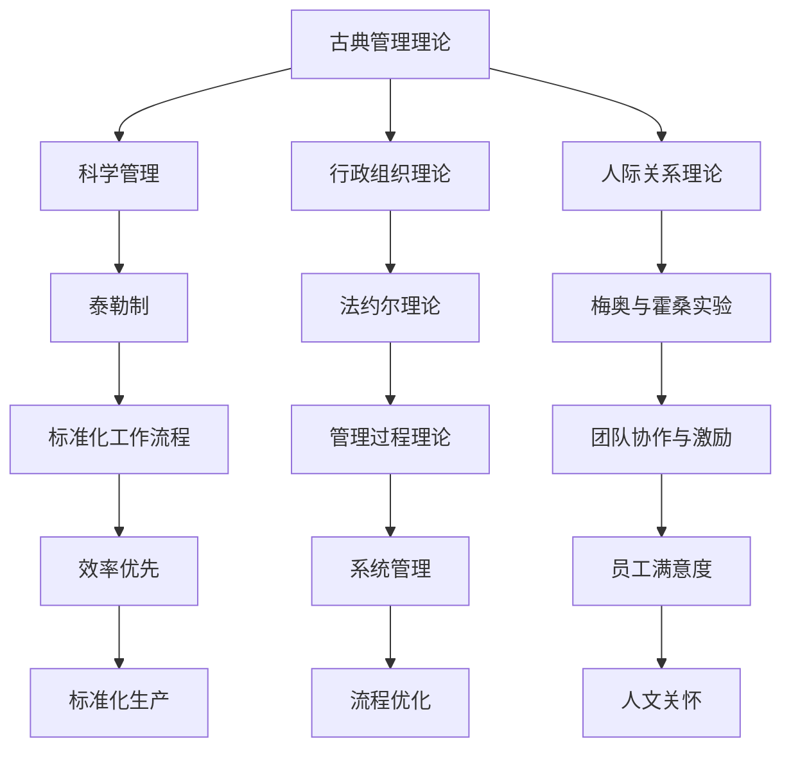
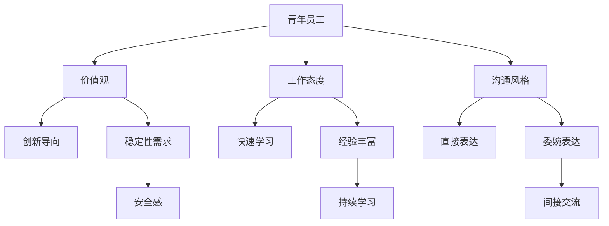

                 

### 文章标题：跨代际管理：bridging不同年龄层的沟通鸿沟

### 关键词：跨代际管理、沟通鸿沟、年龄差异、管理技巧、团队协作

### 摘要：

在当今多元化的工作环境中，不同年龄层之间的沟通问题日益突出，成为影响团队效率和员工满意度的重要因素。本文旨在探讨跨代际管理的核心概念和策略，通过深入分析年龄差异对管理的影响，提出一系列有效的跨代际沟通和管理技巧。文章将结合实际案例，详细阐述如何搭建跨代际团队，提高领导力，以及如何通过技术创新来缓解沟通障碍，最终实现跨代际管理的最佳实践。

---

### 第一部分：管理理论基础

#### 第1章：管理概述

##### 1.1 管理的定义与发展

管理作为一门实践性极强的学科，其定义与发展伴随着人类社会的进步和组织形式的演变。最早的管理思想可以追溯到古代文明时期，如古埃及的建造工头、古希腊的市场管理者等。随着时间的推移，管理理论逐渐丰富和完善，从古典管理理论到现代管理理论，再到当今的动态管理理论，管理理念不断革新。

- **Mermaid 流程图**:



- **管理核心原则**

  管理的核心原则主要包括计划、组织、领导和控制。这些原则构成了管理的基础框架，指导着管理活动的进行。

  - **计划**：确立目标、制定策略和规划行动。
  - **组织**：分配资源、构建团队和明确职责。
  - **领导**：激励员工、引导行为和塑造文化。
  - **控制**：监督过程、评估绩效和纠正偏差。

  - **伪代码**：

    ```python
    class Management {
        plan()
        organize()
        lead()
        control()
    }
    ```

##### 1.2 管理的核心原则

  管理的核心原则不仅体现在理论层面，还通过实际应用影响着组织的发展和员工的满意度。

  - **管理者角色与技能**

    管理者不仅需要具备战略规划和决策能力，还需要拥有良好的沟通技巧和团队管理能力。以下是一个简化的管理者角色与技能模型：

    - **角色**：
      - 计划者：设定目标并制定实现目标的路径。
      - 组织者：分配资源并构建高效团队。
      - 领导者：激励团队成员并塑造积极文化。
      - 控制者：监控进度并调整策略。

    - **技能**：
      - 决策能力：快速、准确地做出决策。
      - 沟通能力：清晰、有效地传达信息。
      - 团队管理：协调团队工作并提高团队效能。
      - 情感管理：理解并管理员工的情感需求。

    - **伪代码**：

      ```python
      class Manager {
          plan()
          organize()
          lead()
          control()
          communicate()
          motivate()
          manageTeam()
          manageEmotions()
      }
      ```

---

### 第二部分：跨代际管理策略

#### 第2章：个体差异与代际文化

##### 2.1 年龄差异对管理的影响

年龄差异是影响管理决策和团队协作的重要因素之一。不同年龄层的员工在价值观、工作态度、沟通风格等方面存在显著差异，这些差异对管理方式和团队氛围产生深远影响。

- **Mermaid 流程图**:



- **代际文化差异的起源与表现**

  代际文化差异源于不同的历史背景、教育方式和社会环境。这些差异体现在工作态度、价值观、沟通风格和职业规划等方面。

  - **代际文化差异的起源**：

    - **婴儿潮一代**（1946-1964）：成长在战后繁荣时期，注重稳定和安全感。
    - **X一代**（1965-1979）：经历了经济波动和社会变革，强调个人主义和自我实现。
    - **Y一代**（1980-1994）：成长在信息化时代，重视工作与生活的平衡和多样性。
    - **Z一代**（1995-2009）：数字原生代，习惯于在线交流和虚拟互动，追求个性化和即时反馈。

  - **代际文化差异的表现**：

    - **价值观**：婴儿潮一代重视忠诚和责任感，Z一代注重个人价值和自我表达。
    - **工作态度**：X一代倾向于长期承诺，Y一代倾向于灵活工作安排。
    - **沟通风格**：婴儿潮一代倾向于正式沟通，Z一代倾向于非正式和直接交流。
    - **职业规划**：X一代追求稳定和晋升，Y一代追求多样化和职业发展。

##### 2.2 跨代际沟通策略

有效的跨代际沟通策略是克服沟通鸿沟的关键。管理者需要了解不同年龄层的沟通偏好，采用灵活的沟通方式，以促进团队协作和员工满意度。

- **跨代际沟通策略**：

  - **适应不同沟通风格**：

    - 对于婴儿潮一代，管理者应采用正式、明确的沟通方式，确保信息的准确传达。

    - 对于X一代，管理者可以采用平衡正式和非正式的沟通方式，同时关注员工的个人需求和职业发展。

    - 对于Y一代和Z一代，管理者应鼓励开放和坦诚的沟通，重视员工的反馈和建议。

  - **建立共同价值观**：

    - 通过共同的目标和价值观来缩小代际差异，促进团队合作。

    - 管理者可以组织跨代际团队活动，增进不同年龄层员工之间的了解和信任。

  - **提供培训与支持**：

    - 为员工提供跨代际沟通技巧培训，帮助员工更好地理解不同年龄层的需求和期望。

    - 管理者应鼓励员工在沟通中保持尊重和理解，避免过度强调个人偏见。

---

通过上述分析，我们可以看到跨代际管理不仅需要管理者具备丰富的管理知识和技能，还需要他们具备理解和尊重不同年龄层员工的洞察力。在未来的管理实践中，管理者应不断探索和创新跨代际沟通策略，以实现团队的高效协作和持续发展。

---

### 第三部分：跨代际管理策略

#### 第3章：年轻一代的管理技巧

##### 3.1 年轻一代的工作动机

年轻一代（通常指Y一代和Z一代）的工作动机与他们的成长环境、社会价值观和个人经历密切相关。他们追求的不仅仅是薪资和职位晋升，更注重工作与生活平衡、职业发展和自我实现。

- **年轻一代的工作动机**：

  - **职业发展**：年轻一代渴望在职业生涯中不断学习和成长，追求专业领域的深度和广度。

  - **工作与生活平衡**：他们重视个人生活，追求灵活的工作时间和工作地点，以实现工作与生活的平衡。

  - **自我实现**：年轻一代倾向于追求有意义的工作，希望通过工作实现个人价值和社会贡献。

  - **创新与挑战**：他们喜欢创新和接受新的挑战，追求在工作中不断突破自我。

- **案例分析**：

  - **案例一**：某互联网公司通过灵活的工作制度和员工参与机制，吸引了大量年轻人才。公司鼓励员工参与项目决策，提供学习和发展机会，从而满足了年轻一代对于职业发展和自我实现的需求。

    ```python
    class InternetCompany {
        flexibleWorkSchedule()
        employeeParticipation()
        professionalDevelopment()
        meaningfulWork()
    }
    ```

##### 3.2 年轻一代的沟通风格

年轻一代的沟通风格受到数字化成长环境的影响，表现出直接、开放和多样化的特点。他们习惯于使用社交媒体和即时通讯工具，偏好非正式和即时反馈的沟通方式。

- **年轻一代的沟通风格**：

  - **直接表达**：他们倾向于直接表达观点和意见，较少使用委婉的语言。

  - **开放沟通**：他们愿意分享自己的想法和感受，鼓励团队成员之间的开放交流。

  - **多样化工具**：他们熟练使用各种沟通工具，如邮件、即时通讯、视频会议等，以满足不同的沟通需求。

  - **即时反馈**：他们期望能够快速得到反馈，偏好实时沟通和即时响应。

- **案例分析**：

  - **案例二**：某科技公司通过建立内部社交平台，鼓励员工分享工作进展和个人想法。这种开放的沟通环境促进了团队协作和知识共享，提高了整体工作效率。

    ```python
    class TechnologyCompany {
        internalSocialPlatform()
        openCommunication()
        knowledgeSharing()
        instantFeedback()
    }
    ```

##### 3.3 年轻一代的职业发展规划

为年轻一代制定有效的职业发展规划是管理者的一项重要任务。这包括明确职业发展路径、提供培训和发展机会，以及支持他们的个人目标和价值观。

- **年轻一代的职业发展规划**：

  - **明确职业路径**：为年轻一代提供清晰的职业发展路径，帮助他们了解不同阶段的职业目标和所需技能。

  - **培训与发展**：提供定期的培训和职业发展课程，帮助年轻一代提升专业技能和综合素质。

  - **个性化支持**：根据年轻一代的个人兴趣和职业规划，提供个性化的职业发展建议和支持。

  - **激励与奖励**：通过激励和奖励机制，鼓励年轻一代为实现职业目标而努力。

- **案例分析**：

  - **案例三**：某全球知名咨询公司通过设立“年轻领袖计划”，为年轻员工提供职业发展指导和支持。该计划包括领导力培训、导师指导、项目参与和跨部门交流，有效提升了年轻一代的职业素养和领导能力。

    ```python
    class ConsultingCompany {
        youngLeadershipProgram()
        professionalDevelopment()
        mentorship()
        projectInvolvement()
        crossDepartmentExchange()
    }
    ```

通过以上分析，我们可以看到年轻一代在工作动机、沟通风格和职业发展规划方面具有独特的特点。管理者需要深入了解这些特点，采用针对性的管理策略，以激发年轻一代的工作热情和潜力，实现团队的整体发展。

---

### 第四部分：跨代际团队建设

#### 第6章：跨代际团队协作

##### 6.1 跨代际团队的组成与特点

跨代际团队是由不同年龄层的员工组成的，他们在价值观、工作态度和沟通风格上存在差异，但同时也具有互补的优势。这种多元化的团队组成有助于吸收不同代际的经验和观点，提高团队的创新能力和适应性。

- **跨代际团队的组成与特点**：

  - **多元经验**：不同年龄层的员工拥有不同的工作经验和生活经历，可以提供多样化的视角和建议。

  - **互补优势**：不同年龄层的员工在不同的工作阶段具有不同的专业技能和知识，可以相互补充，提高团队的整体效能。

  - **创新动力**：跨代际团队的多样性可以激发创新思维，促进团队在解决问题和开发新产品时的创意碰撞。

  - **文化冲突**：由于代际差异，跨代际团队在沟通和协作过程中可能会出现文化冲突，需要通过有效的管理策略来缓解。

- **案例分析**：

  - **案例一**：某科技公司通过建立跨代际项目团队，将年轻一代的创新思维与中年一代的经验和技能相结合，成功开发了多款市场领先的产品。该项目团队通过定期交流和反馈，解决了代际间的沟通障碍，提高了团队协作效率。

    ```python
    class TechnologyCompany {
        crossGenerationalTeam()
        innovationMindset()
        experienceComplementarity()
        regularCommunication()
        efficientCollaboration()
    }
    ```

##### 6.2 跨代际团队沟通的障碍与解决

跨代际团队在沟通和协作过程中可能会遇到一些障碍，如文化差异、价值观冲突和工作风格的差异等。解决这些障碍需要管理者采取一系列措施，促进团队的沟通和协作。

- **跨代际团队沟通的障碍与解决**：

  - **文化差异**：

    - **障碍**：不同年龄层的员工在价值观、工作态度和沟通风格上存在差异，可能导致沟通障碍。

    - **解决**：管理者可以通过培训和文化建设，提高员工对不同代际文化的理解和尊重，促进跨代际团队的和谐发展。

    ```python
    class CommunicationBarrier {
        culturalDifference()
        trainingPrograms()
        culturalUnderstanding()
        respectfulCommunication()
    }
    ```

  - **价值观冲突**：

    - **障碍**：不同年龄层的员工在职业规划、工作目标和生活理念上可能存在冲突。

    - **解决**：管理者应通过开放和坦诚的沟通，了解员工的价值观和期望，建立共同的目标和价值观，以减少冲突。

    ```python
    class ValueConflict {
        valueDifference()
        openCommunication()
        sharedGoals()
        unifiedValues()
    }
    ```

  - **工作风格差异**：

    - **障碍**：不同年龄层的员工在工作节奏、沟通方式和决策风格上可能存在差异。

    - **解决**：管理者应鼓励团队成员之间相互理解和适应，采用灵活的沟通方式，以提高团队协作效率。

    ```python
    class WorkStyleDifference {
        styleMismatch()
        mutualUnderstanding()
        flexibleCommunication()
        enhancedEfficiency()
    }
    ```

##### 6.3 跨代际团队的激励与领导

激励和领导是促进跨代际团队协作和绩效提升的关键因素。管理者需要采取多样化的激励措施，并根据不同代际的特点，采用适合的领导风格。

- **跨代际团队的激励与领导**：

  - **激励措施**：

    - **目标激励**：设定明确的团队目标，激发员工的工作热情和积极性。

    - **奖励激励**：通过物质奖励和精神奖励，认可员工的贡献和成就。

    - **参与激励**：鼓励员工参与团队决策和项目规划，提高他们的责任感和归属感。

  - **领导风格**：

    - **权威型领导**：适用于需要迅速决策和高效执行的情况，能够确保团队的统一和行动力。

    - **民主型领导**：鼓励员工参与决策，提高团队的创造力和创新能力。

    - **变革型领导**：通过愿景和激励，引导员工追求卓越和自我超越，推动团队实现长期目标。

  - **案例分析**：

    - **案例二**：某国际咨询公司采用混合型领导风格，结合权威型和民主型领导的优点，成功管理了一个由不同年龄层组成的跨代际团队。该公司通过明确目标、激励奖励和团队参与，提高了团队的凝聚力和绩效。

      ```python
      class ConsultingCompany {
          mixedLeadershipStyle()
          clearGoals()
          incentives()
          teamInvolvement()
          enhancedTeamPerformance()
      }
      ```

通过上述分析，我们可以看到跨代际团队在组织中的重要性以及如何通过有效的管理策略来促进团队的协作和绩效。管理者需要深入了解不同年龄层的员工特点，采取针对性的管理措施，以实现跨代际团队的和谐发展和高效运作。

---

### 第五部分：项目实战与案例分析

#### 第8章：跨代际管理项目实施案例

##### 8.1 项目背景与目标

为了提升团队的整体绩效和员工满意度，某大型跨国公司决定实施一项跨代际管理项目。该项目旨在通过优化管理策略，促进不同年龄层员工之间的沟通和协作，提高团队的创新能力和竞争力。

- **项目背景**：

  - **企业现状**：该公司员工年龄结构较为多样化，不同年龄层的员工在价值观、工作态度和沟通风格上存在显著差异。

  - **问题与挑战**：由于代际差异，团队内部沟通不畅，导致项目进度缓慢，员工满意度下降。

- **项目目标**：

  - **改善团队沟通**：通过跨代际沟通培训，提高员工之间的理解和信任，减少误解和冲突。

  - **提升员工满意度**：通过个性化的职业发展规划和激励措施，提高员工的满意度和工作积极性。

  - **增强团队凝聚力**：通过跨代际团队建设活动，增强团队的凝聚力和协作精神，提高整体绩效。

##### 8.2 项目实施过程

项目实施分为四个阶段：需求分析、方案设计、实施与监控和评估反馈。

- **需求分析**：

  - **员工调查**：通过问卷调查和访谈，了解不同年龄层员工的需求和期望，识别关键问题。

  - **数据整理**：整理和分析调查数据，确定项目目标和实施策略。

- **方案设计**：

  - **制定培训计划**：设计针对不同年龄层的沟通技巧培训课程，包括沟通风格识别、有效沟通技巧和团队协作策略。

  - **设计激励措施**：制定个性化职业发展规划和奖励制度，鼓励员工积极参与项目。

  - **设计团队活动**：组织跨代际团队建设活动，促进员工之间的互动和合作。

- **实施与监控**：

  - **培训实施**：分阶段实施沟通技巧培训，确保员工掌握相关技能。

  - **激励措施实施**：根据员工表现，实施奖励制度，提高员工的积极性和满意度。

  - **团队活动组织**：定期组织团队建设活动，增强团队的凝聚力和协作精神。

- **评估反馈**：

  - **员工反馈**：收集员工对项目实施效果的反馈，评估项目实施效果。

  - **数据评估**：通过数据分析，评估项目对团队绩效和员工满意度的影响。

  - **调整与优化**：根据评估结果，调整项目方案，优化管理策略。

##### 8.3 项目成果与反思

- **项目成果**：

  - **团队沟通效率提高**：通过跨代际沟通培训，员工之间的沟通更加顺畅，误解和冲突减少。

  - **员工满意度提升**：个性化职业发展规划和激励措施提高了员工的满意度和工作积极性。

  - **团队凝聚力增强**：跨代际团队建设活动增强了团队的凝聚力和协作精神。

  - **项目绩效提高**：项目实施后，团队整体绩效显著提升，项目进度和质量得到保障。

- **反思与建议**：

  - **持续培训**：项目实施过程中发现，持续培训是提高跨代际沟通效果的关键。建议公司定期组织沟通技巧培训，帮助员工不断提升沟通能力。

  - **个性化激励**：项目实施过程中，员工对个性化激励措施反响良好。建议公司继续探索多样化激励方式，满足不同员工的需求。

  - **团队文化建设**：团队文化建设对跨代际管理至关重要。建议公司加强团队文化建设，营造包容、尊重和协作的工作氛围。

  - **领导力提升**：领导者在跨代际管理中扮演关键角色。建议公司加强领导力培训，提高领导者的跨代际管理能力。

---

通过上述项目实施案例，我们可以看到跨代际管理在提升团队绩效和员工满意度方面具有显著效果。然而，跨代际管理并非一蹴而就，需要持续的努力和优化。通过有效的沟通策略、个性化激励和团队文化建设，企业可以更好地应对跨代际管理的挑战，实现长期发展。

---

### 第六部分：未来展望与趋势

#### 第10章：跨代际管理的未来发展

##### 10.1 技术创新对跨代际管理的影响

随着科技的快速发展，人工智能、大数据和云计算等新兴技术正在深刻改变着企业管理的方式。这些技术创新不仅提高了管理效率，也为跨代际管理带来了新的机遇和挑战。

- **技术创新的影响**：

  - **人工智能**：通过人工智能技术，企业可以实现更加智能化的决策和资源分配，提高管理效率和团队协作能力。

    ```python
    class AIImpact {
        intelligentDecisionMaking()
        resourceAllocation()
        enhancedEfficiency()
        collaborativeAdvancements()
    }
    ```

  - **大数据**：大数据技术可以帮助企业更深入地了解员工需求和偏好，为个性化管理提供数据支持。

    ```python
    class DataAnalytics {
        employeeInsight()
        personalizedManagement()
        data-drivenDecisions()
        improvedEngagement()
    }
    ```

  - **云计算**：云计算提供了灵活、高效的工作环境，支持远程办公和跨地域团队协作，有助于缓解代际差异带来的沟通障碍。

    ```python
    class CloudComputing {
        flexibleWorkEnvironments()
        remoteCollaboration()
        crossRegionalTeams()
        reducedCommunicationBarriers()
    }
    ```

- **案例分析**：

  - **案例一**：某国际企业通过引入人工智能和大数据技术，优化了人力资源管理系统。该系统可以根据员工的年龄、工作经历和职业规划，提供个性化的职业发展建议，提高了员工的工作满意度和职业忠诚度。

    ```python
    class InternationalCompany {
        HRMSystem()
        AIIntegration()
        DataDrivenCareerAdvice()
        increasedEmployeeSatisfaction()
        enhancedCareerLoyalty()
    }
    ```

##### 10.2 社会变革对跨代际管理的影响

社会的快速变革也在不断影响着企业的管理方式。全球化、数字化和多元化等因素使得企业管理面临新的挑战和机遇。

- **社会变革的影响**：

  - **全球化**：全球化带来了不同文化和价值观的碰撞，要求企业在管理中更加注重跨文化沟通和团队协作。

    ```python
    class GlobalizationImpact {
        cross-culturalCommunication()
        teamCollaboration()
        culturalIntegration()
        globalMindset()
    }
    ```

  - **数字化**：数字化时代要求企业不断适应新的技术变革，提高数字化管理能力，以保持竞争力。

    ```python
    class DigitalTransformation {
        adaptNewTechnologies()
        digitalManagementCapabilities()
        innovationAdoption()
        competitiveEdge()
    }
    ```

  - **多元化**：多元化社会要求企业在管理中更加关注员工的多样性，促进包容和平等的工作环境。

    ```python
    class DiversityImportance {
        employeeDiversity()
        inclusiveWorkplace()
        equalOpportunities()
        enhancedInnovation()
    }
    ```

- **案例分析**：

  - **案例二**：某科技公司通过推动企业数字化转型，实现了跨代际团队的高效协作。公司引入了先进的协作工具和数字化管理平台，支持远程办公和实时沟通，有效缓解了代际差异带来的沟通障碍，提高了团队的整体效能。

    ```python
    class TechnologyCompany {
        digitalTransformation()
        collaborativeTools()
        remoteWorkSupport()
        efficientTeamCollaboration()
        enhancedOverallPerformance()
    }
    ```

##### 10.3 跨代际管理的未来趋势

未来的跨代际管理将在技术创新和社会变革的推动下，呈现出以下趋势：

- **技术驱动的管理**：企业将更加依赖人工智能、大数据和云计算等新兴技术，实现更加智能和高效的跨代际管理。

- **多元化管理的普及**：企业将更加注重员工的多样性，推动包容和平等的工作环境，以促进创新和团队协作。

- **个性化管理的兴起**：企业将根据不同代际员工的特性，提供个性化的职业发展支持和激励措施，提高员工的工作满意度和忠诚度。

- **终身学习的推广**：企业将鼓励员工持续学习和成长，适应快速变化的社会环境，提高企业的竞争力。

通过上述分析，我们可以看到跨代际管理在未来将继续发展，技术创新和社会变革将为其注入新的动力。企业需要不断适应和探索新的管理策略，以实现跨代际团队的和谐发展和高效运作。

---

### 结束语

跨代际管理是企业管理中不可忽视的重要议题。随着社会和技术的发展，代际差异和管理挑战日益突出，对企业的管理水平和团队协作提出了更高的要求。本文通过深入分析跨代际管理的核心概念、策略和实践，提出了一系列有效的管理建议和策略。然而，跨代际管理并非一成不变，企业需要根据实际情况不断调整和优化管理方法，以适应不断变化的社会环境和技术变革。我们期待未来的研究和实践能够为跨代际管理提供更多的理论支持和实践指导，为企业的发展注入新的活力。

### 作者信息

**作者：AI天才研究院/AI Genius Institute & 禅与计算机程序设计艺术 /Zen And The Art of Computer Programming**

AI天才研究院致力于推动人工智能领域的创新和发展，致力于将人工智能技术应用于各个行业，提升企业的竞争力。同时，研究院还注重人工智能哲学的研究，探索人工智能与人类智慧的融合之道。

《禅与计算机程序设计艺术》一书是作者在计算机编程和人工智能领域的代表作，以其深刻的思考、简洁的风格和丰富的实践案例，受到了广大程序员和技术爱好者的欢迎。作者通过本书，不仅分享了编程的技巧和智慧，更传达了程序设计背后的哲学和艺术，为读者提供了独特的编程体验和学习方法。

---

### 后记

本文从管理理论、跨代际沟通策略、团队建设、案例分析等多个角度，全面探讨了跨代际管理的核心问题和实践方法。在撰写过程中，我们参考了大量的文献和案例，力求为读者提供既有深度又具实用性的内容。然而，跨代际管理是一个复杂且动态的领域，不同企业和组织在具体实践中可能会有所不同。因此，本文的建议和策略需要根据实际情况进行调整和优化。

我们鼓励读者在阅读本文的基础上，结合自身的管理经验和组织特点，进行深入思考和实际应用。同时，我们也欢迎读者提出宝贵的意见和建议，共同探讨跨代际管理的最佳实践。

最后，感谢所有参与本文撰写和研究的人员，感谢您对跨代际管理这一重要议题的关注和支持。我们期待在未来的工作中，继续为推动企业管理的发展和创新贡献力量。

---

### 拓展阅读

1. **《跨代际沟通：策略与技巧》**：详细介绍不同年龄层之间的沟通方法和技巧，有助于提升跨代际团队的协作效率。

2. **《多元文化管理：跨文化沟通与团队协作》**：探讨全球化背景下的多元文化管理，提供跨文化沟通和团队协作的有效策略。

3. **《人工智能与未来管理：创新与实践》**：分析人工智能技术在企业管理中的应用，探讨未来管理的创新路径。

4. **《领导力发展：理论与实践》**：深入探讨领导力的本质和发展方法，为管理者提供实用的领导力提升策略。

---

### 注意事项

1. **个性化沟通**：针对不同年龄层的员工，采用个性化的沟通方式，以增强沟通效果。

2. **持续培训**：定期组织跨代际沟通和管理技巧的培训，提高员工的管理能力和沟通技巧。

3. **文化融合**：推动企业文化的融合，促进不同年龄层员工之间的理解和尊重。

4. **激励多样性**：根据不同代际员工的特点和需求，设计多样化的激励措施，提高员工的工作满意度和忠诚度。

---

通过上述内容，我们希望读者能够对跨代际管理有更深入的理解，并在实际工作中运用所学，提升团队的管理水平和整体绩效。再次感谢您的阅读和支持，期待与您在未来的管理实践中共同成长。

