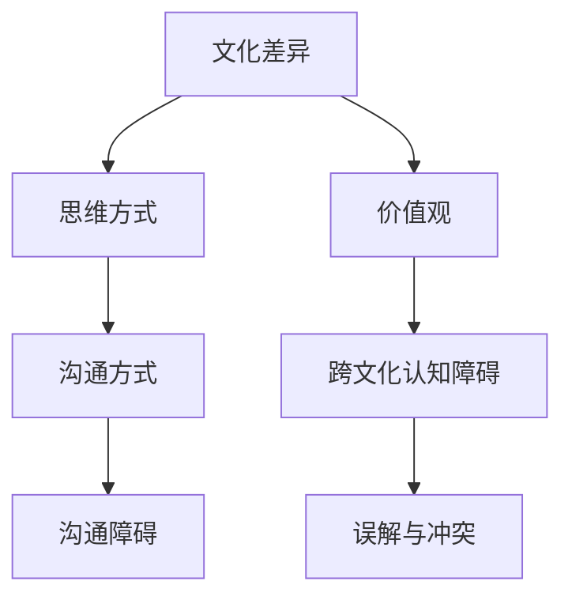

                 


### 文章标题

《跨文化团队协作：全球化时代的挑战》

### 关键词

跨文化团队协作，全球化，文化差异，沟通策略，团队建设，案例分析，工具与技术

### 摘要

随着全球化进程的不断加速，跨文化团队协作成为现代企业中不可避免的现象。本文将深入探讨跨文化团队协作的挑战，包括文化差异、沟通障碍和团队管理难题，并提供一系列实用的策略和工具，以帮助团队克服这些挑战，实现高效协作。通过案例分析、核心算法原理讲解和数学模型分析，本文将为读者提供全面的指导，助力跨文化团队在全球化时代取得成功。

---

#### 1. 构建整体框架

整体框架可以分为五个主要部分：

1. **引言**：介绍跨文化团队协作的重要性以及全球化时代的背景。
2. **文化差异与理解**：讨论不同文化背景下的思维方式、价值观和沟通方式。
3. **团队沟通策略**：提供有效的沟通技巧和策略，帮助团队成员更好地理解和协作。
4. **跨文化团队建设**：探讨如何建立和管理一个多元化的团队。
5. **案例分析**：通过实际案例展示跨文化团队协作的成功与挑战。
6. **工具与技术**：介绍一些实用的工具和技术，如跨文化培训、语言工具和协作平台。
7. **结论与展望**：总结全书内容，并对未来跨文化团队协作的趋势进行展望。

---

#### 2. 明确每个部分的章节

**引言**
- **1.1 跨文化团队协作的背景**
- **1.2 全球化时代的挑战与机遇**

**文化差异与理解**
- **2.1 文化差异的基本概念**
  - **2.1.1 文化定义**
  - **2.1.2 文化类型的划分**
- **2.2 文化背景与价值观**
  - **2.2.1 价值观的差异**
  - **2.2.2 文化背景的影响**
- **2.3 跨文化认知障碍**
  - **2.3.1 沟通障碍**
  - **2.3.2 误解与冲突**

**团队沟通策略**
- **3.1 有效沟通技巧**
  - **3.1.1 提高倾听技巧**
  - **3.1.2 明确表达意图**
- **3.2 跨文化沟通策略**
  - **3.2.1 适应不同文化的沟通风格**
  - **3.2.2 建立共同语言**
- **3.3 跨文化冲突处理**
  - **3.3.1 冲突的类型**
  - **3.3.2 冲突解决方法**

**跨文化团队建设**
- **4.1 团队构建原则**
  - **4.1.1 多元文化价值观的尊重**
  - **4.1.2 平等与包容**
- **4.2 团队管理策略**
  - **4.2.1 管理多元文化团队的挑战**
  - **4.2.2 领导者角色与责任**
- **4.3 团队文化塑造**
  - **4.3.1 团队文化的定义与重要性**
  - **4.3.2 如何建立积极的团队文化**

**案例分析**
- **5.1 成功案例**
  - **5.1.1 跨文化团队协作的成功经验**
  - **5.1.2 案例解析**
- **5.2 挑战与解决方案**
  - **5.2.1 面临的挑战**
  - **5.2.2 案例中的解决方案**

**工具与技术**
- **6.1 跨文化培训**
  - **6.1.1 培训的目标与内容**
  - **6.1.2 培训的实施方法**
- **6.2 语言工具**
  - **6.2.1 语言翻译工具的使用**
  - **6.2.2 语言学习资源的推荐**
- **6.3 协作平台**
  - **6.3.1 跨文化协作工具的介绍**
  - **6.3.2 平台的特点与优势**

**结论与展望**
- **7.1 跨文化团队协作的总结**
- **7.2 未来趋势与展望**
  - **7.2.1 新技术的应用**
  - **7.2.2 跨文化团队协作的发展方向**

---

#### 3. 添加核心概念与联系

**核心概念与联系**



---

#### 4. 编写核心算法原理讲解

本文将介绍一个简单的沟通模型算法，用于模拟跨文化团队中的沟通过程。

**沟通模型算法**

```plaintext
// 伪代码：沟通模型算法
class CommunicationModel {
    function communicate(message, receiver, culture) {
        translator = culture.getTranslator();
        adapted_message = translator.translate(message);
        receiver.receiveMessage(adapted_message);
        response = receiver.sendResponse();
        return response;
    }
}
```

**算法解释**

1. **初始化**：创建一个`CommunicationModel`实例。
2. **传递消息**：将原始消息传递给模型。
3. **翻译消息**：根据当前文化选择合适的翻译器，将消息翻译为适应目标文化的版本。
4. **接收消息**：将翻译后的消息传递给接收者。
5. **获取反馈**：接收者发送回复，完成沟通循环。

---

#### 5. 填充数学模型和数学公式

在跨文化团队协作中，我们可以使用一些数学模型来分析和预测团队成员之间的沟通效果。以下是一个简单的线性回归模型，用于预测沟通满意度。

**线性回归模型**

```latex
$$
满意度 = a \times 文化适配度 + b \times 沟通技巧 + e
$$

其中，a 和 b 为常数，文化适配度和沟通技巧为自变量，满意度为因变量，e 为随机误差。
```

**解释**

1. **文化适配度**：衡量团队成员对目标文化的适应程度。
2. **沟通技巧**：衡量团队成员的沟通能力和技巧。
3. **满意度**：预测团队成员对沟通效果的满意度。

---

#### 6. 设计项目实战

为了更好地理解跨文化团队协作，我们可以设计一个实际项目，比如开发一个跨文化协作平台。

**项目实战：跨文化协作平台**

**1. 需求分析**
- **功能**：支持多语言翻译、实时沟通、文档共享等。
- **用户**：跨文化团队成员、管理人员、外部合作伙伴。

**2. 开发环境搭建**
- **技术栈**：React（前端）、Node.js（后端）、MongoDB（数据库）。

**3. 源代码实现**
- **前端**：使用React构建用户界面，集成翻译API。
- **后端**：使用Node.js搭建服务器，处理数据请求。

**4. 代码解读**
- **前端**：解释组件设计、状态管理、API调用。
- **后端**：解释服务器配置、数据库连接、API实现。

**5. 应用解读与分析**
- **用户测试**：分析用户反馈，优化功能。
- **性能测试**：确保平台在高负载下的稳定性。

**6. 实际案例分析**
- **成功案例**：介绍一个成功的跨文化协作平台案例。
- **挑战**：讨论在项目中遇到的文化差异和沟通障碍。

**7. 项目小结**
- **总结**：回顾项目目标、实现方法、收获与改进。

---

#### 7. 保证大纲完整性和简洁性

在完成每个章节的编写后，我们需要对整体框架进行审查，确保每个部分的内容完整且简洁：

- **检查每个部分的完整性**：确保每个章节都有详细的内容，没有遗漏关键点。
- **删除多余内容**：删减冗长或不必要的段落，保持内容的简洁性。
- **确保字数在限制范围内**：调整内容，确保总字数在8000～12000字左右。

---

### 总结

本文系统地探讨了跨文化团队协作的各个方面，从文化差异到沟通策略，再到实际案例和工具技术。通过逐步分析推理，我们提供了一系列实用的方法和工具，帮助团队在全球化时代实现高效协作。希望这篇文章能为从事跨文化团队协作的读者提供有价值的指导和启示。作者：AI天才研究院/AI Genius Institute & 禅与计算机程序设计艺术 /Zen And The Art of Computer Programming。

