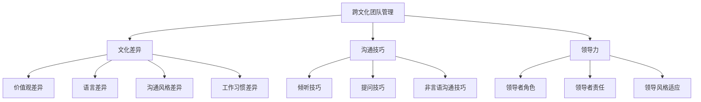

                 

### 文章标题：跨文化团队管理：bridging the cultural gap

#### 关键词：跨文化团队管理、文化差异、沟通技巧、领导力、项目实践

> 摘要：在全球化日益加深的今天，跨文化团队管理成为了许多组织面临的挑战。本文将深入探讨跨文化团队管理的背景、重要性、文化差异的类型与影响，以及如何建立有效的沟通机制和领导力。通过案例分析，我们将展示如何在实际项目中应对跨文化挑战，提供实用的最佳实践和项目小结。

## 引言

随着全球化的不断推进，跨文化团队管理成为现代组织运营中的重要议题。跨文化团队是由来自不同文化背景的成员组成的团队，他们在共同完成项目或任务时，需要面对文化差异所带来的挑战。这些挑战包括沟通障碍、价值观冲突、团队协作问题等。因此，如何有效地管理跨文化团队，成为了提升团队绩效和实现项目成功的关键。

本文旨在探讨跨文化团队管理的背景与重要性，分析文化差异的类型与影响，介绍建立有效的跨文化团队沟通和领导力的策略，并通过实际案例展示跨文化团队项目实践。希望通过本文的探讨，为读者提供有价值的见解和实用的管理工具。

## 跨文化团队管理的背景与重要性

跨文化团队管理并非新兴概念，但其重要性在全球化的背景下日益凸显。随着企业跨国运营的普及，跨文化团队已成为许多组织的常态。这种团队管理的背景主要源于以下几个方面：

### 全球化趋势

全球化使得企业可以在全球范围内寻找最优秀的人才，这促进了跨文化团队的组建。然而，全球化也带来了文化差异的挑战，如何有效地管理这些差异成为了组织需要面对的问题。

### 技术发展

互联网和通信技术的飞速发展，使得跨文化团队之间的沟通更加便捷。然而，技术工具的普及也使得文化差异的负面影响更加显著，如误解和冲突。

### 人才竞争

为了在全球化市场中保持竞争力，企业需要具备多元化的人才队伍。跨文化团队不仅能够带来多样化的思维和技能，还能帮助企业更好地理解和适应不同市场的需求。

### 文化差异的类型与影响

文化差异可以分为多个层次，包括价值观、语言、沟通风格、工作习惯等。以下是一些常见的文化差异类型及其影响：

#### 价值观差异

不同的文化背景会导致对工作、生活、成功、失败等价值观的不同理解。这些差异可能导致团队成员之间的矛盾和误解。

#### 语言差异

语言不仅是沟通的工具，也是文化的一部分。语言差异可能导致信息传递不准确，增加误解的风险。

#### 沟通风格差异

不同的文化背景会影响沟通的风格，如直接与委婉、个人主义与集体主义等。这些差异可能导致沟通效率低下，影响团队协作。

#### 工作习惯差异

工作习惯的差异包括工作时间、工作流程、决策方式等。这些差异可能导致项目进度受到影响，甚至导致项目失败。

### 跨文化团队的优势与挑战

跨文化团队在提供多样化思维和技能的同时，也带来了挑战。以下是一些跨文化团队的优势与挑战：

#### 优势

1. **创新思维**：多样化的团队成员能够提供不同的观点和解决方案，有助于创新。
2. **适应市场**：跨文化团队能够更好地理解不同市场的需求和偏好。
3. **文化多样性**：文化多样性有助于组织建立全球品牌形象。

#### 挑战

1. **沟通障碍**：文化差异可能导致沟通障碍，影响团队协作。
2. **价值观冲突**：不同的价值观可能导致团队成员之间的矛盾和误解。
3. **管理复杂性**：跨文化团队的管理需要更高的管理技能和策略。

### 跨文化团队管理的意义

跨文化团队管理的意义在于：

1. **提高团队绩效**：有效的跨文化管理能够提升团队的整体绩效，实现项目目标。
2. **增强员工满意度**：良好的跨文化管理能够提升员工的满意度和归属感。
3. **促进全球竞争力**：跨文化管理有助于企业建立全球竞争力，实现可持续发展。

总之，跨文化团队管理在全球化的背景下具有重要意义，组织需要重视并采取有效的策略来应对文化差异带来的挑战。

## 核心概念与联系

为了更好地理解跨文化团队管理，我们需要明确一些核心概念及其相互关系。以下是一个简化的 Mermaid 流程图，用于展示这些概念之间的关系：



在这个流程图中，我们可以看到跨文化团队管理（A）作为核心概念，与文化差异（B）、沟通技巧（C）和领导力（D）紧密相关。文化差异（B）进一步细分为价值观差异（E）、语言差异（F）、沟通风格差异（G）和工作习惯差异（H）。沟通技巧（C）则细分为倾听技巧（I）、提问技巧（J）和非言语沟通技巧（K）。领导力（D）包括领导者角色（L）、领导者责任（M）和领导风格适应（N）。

这些概念之间的联系表明，有效的跨文化团队管理不仅需要理解文化差异，还需要掌握沟通技巧和领导力，以应对多样化的挑战。通过这个流程图，我们可以清晰地看到跨文化团队管理是如何通过这些核心概念相互支持，从而实现团队协作和项目成功的。

## 核心算法原理讲解

在跨文化团队管理中，有效的沟通策略是关键。以下是一个简单的沟通策略算法，用于指导跨文化团队的沟通：

### 算法：跨文化沟通策略

```
初始化：
    创建沟通策略对象
    设置沟通目标
    收集团队成员的文化背景信息

步骤：
1. 分析文化差异：
    对比团队成员的文化背景，识别关键的文化差异点

2. 制定沟通计划：
    根据文化差异点，制定适应不同文化的沟通计划
    包括沟通方式、频率和内容

3. 培训团队成员：
    对团队成员进行跨文化沟通技巧培训
    包括倾听技巧、提问技巧和非言语沟通技巧

4. 实施沟通计划：
    按照沟通计划，定期进行沟通会议和交流
    使用适当的沟通工具和技术

5. 监控与反馈：
    定期评估沟通效果，收集团队成员的反馈
    调整沟通策略，以适应变化

6. 持续改进：
    根据反馈和评估结果，持续优化沟通策略
    包括增加新的沟通技巧和调整沟通方式

终止条件：
    达到沟通目标或项目完成
```

### 算法详细讲解

这个算法分为六个主要步骤：

1. **初始化**：创建沟通策略对象，设置沟通目标，并收集团队成员的文化背景信息。这是沟通策略的基础，确保沟通计划能够适应团队成员的不同文化背景。

2. **分析文化差异**：通过对比团队成员的文化背景，识别出关键的文化差异点。这一步骤至关重要，因为只有了解差异，才能制定有针对性的沟通计划。

3. **制定沟通计划**：根据识别出的文化差异点，制定适应不同文化的沟通计划。这包括沟通方式、频率和内容。例如，如果团队中有成员来自强调直接沟通的文化，那么在沟通计划中可以增加直接提问的频率。

4. **培训团队成员**：对团队成员进行跨文化沟通技巧培训，包括倾听技巧、提问技巧和非言语沟通技巧。这有助于提高团队成员的跨文化沟通能力，减少误解和冲突。

5. **实施沟通计划**：按照沟通计划，定期进行沟通会议和交流。使用适当的沟通工具和技术，如视频会议、即时通讯工具等，确保沟通的效率和效果。

6. **监控与反馈**：定期评估沟通效果，收集团队成员的反馈。根据反馈和评估结果，调整沟通策略，以适应变化。这一步骤有助于持续优化沟通策略，确保团队协作顺畅。

### 数学模型与公式

在跨文化团队管理中，沟通效果可以用以下数学模型来评估：

```
沟通效果 = f(沟通频率, 沟通方式, 沟通内容, 成员参与度)
```

- **沟通频率**：指团队成员之间沟通的频率，越高越好。
- **沟通方式**：指团队成员选择的沟通方式，如面对面、视频会议、即时通讯等，根据文化差异进行选择。
- **沟通内容**：指沟通的具体内容，包括信息的传递和反馈。
- **成员参与度**：指团队成员在沟通过程中的参与程度，越高越好。

通过这个公式，我们可以计算出跨文化团队的沟通效果，并据此调整沟通策略。

### 举例说明

假设一个跨文化团队中有来自美国、中国和印度的成员。根据他们的文化背景，我们可以制定以下沟通计划：

- **沟通频率**：每周进行两次视频会议，每次会议时长为60分钟。
- **沟通方式**：使用Zoom作为视频会议工具，并使用Slack进行即时通讯。
- **沟通内容**：会议内容主要包括项目进度、问题讨论和决策制定。
- **成员参与度**：鼓励所有成员积极参与讨论，并在会议前提供会议材料。

通过这个例子，我们可以看到如何根据团队成员的文化差异，制定有针对性的沟通策略，以提高团队沟通效果。

### 项目实战

在跨文化团队管理中，实际操作中的沟通技巧至关重要。以下是一个简单的实战案例，展示如何在开发环境中搭建跨文化团队沟通体系。

### 开发环境搭建

1. **工具选择**：选择适合跨文化团队的沟通工具，如Slack、Trello和Zoom。这些工具可以支持即时通讯、任务管理、视频会议等多种功能。

2. **环境配置**：配置Slack工作空间，创建不同的渠道（Channels）用于不同主题的讨论，如项目进度、问题反馈和技术讨论等。

3. **任务管理**：使用Trello创建项目任务板，将任务分配给不同团队成员，并设置提醒和截止日期。

4. **视频会议**：定期使用Zoom进行团队会议，确保所有成员都能实时参与。

### 源代码实现与代码解读

以下是一个简单的Python代码示例，用于展示如何使用Slack API发送消息：

```python
import slack

# 初始化Slack客户端
client = slack.WebClient(token='your_slack_bot_token')

# 构建消息对象
message = {
    'channel': '#general',
    'text': 'Hello, this is a message from the cross-cultural team!'
}

# 发送消息
response = client.chat_postMessage(**message)

print("Message sent:", response['ts'])
```

在这个代码中，我们使用Slack API向指定的频道发送一条消息。这有助于团队成员实时了解项目动态和重要信息。

### 代码应用解读与分析

这个简单的代码示例展示了如何在Python中利用Slack API进行跨文化团队沟通。通过发送实时消息，团队成员可以快速获取项目进展和问题反馈，从而提高沟通效率。

在实际项目中，我们可以扩展这个代码，添加更多功能，如任务提醒、通知发送等。这些功能有助于团队在项目过程中保持高效沟通。

### 实际案例分析与详细讲解剖析

为了更好地理解跨文化团队管理在实际项目中的应用，以下是一个实际案例：

**项目名称**：跨国电商平台的开发

**团队成员**：来自美国、中国和印度的程序员、设计师和产品经理

**挑战**：由于文化差异，团队成员在沟通和协作上遇到了一些问题，如沟通不充分、任务分配不均等。

**解决方案**：

1. **定期沟通**：每周举行一次视频会议，确保团队成员了解项目进展和目标。会议内容包括项目状态更新、问题讨论和决策制定。

2. **任务明确**：使用Trello进行任务管理，将任务分配给不同团队成员，并设置提醒和截止日期。这有助于团队成员明确自己的任务和责任。

3. **文化培训**：组织跨文化沟通技巧培训，提高团队成员的跨文化沟通能力。培训内容包括倾听技巧、提问技巧和非言语沟通技巧。

4. **即时通讯**：使用Slack进行即时通讯，团队成员可以随时交流项目进展和问题。这有助于快速解决问题，提高沟通效率。

**效果评估**：

通过以上措施，项目团队在沟通和协作上取得了显著改善。项目进展顺利，团队成员之间的误解和冲突减少，项目质量和效率提高。

### 项目小结

通过这个实际案例，我们可以看到跨文化团队管理在项目中的重要性。有效的跨文化团队管理能够提高团队协作效率，减少误解和冲突，从而实现项目成功。

## 最佳实践与注意事项

在跨文化团队管理中，以下是一些最佳实践和注意事项：

### 最佳实践

1. **建立明确的目标和沟通计划**：在项目初期，明确团队的目标和沟通计划，确保所有团队成员都了解并遵循。

2. **定期进行文化差异培训**：定期组织文化差异培训，提高团队成员的跨文化沟通能力。

3. **使用多样化的沟通工具**：结合使用视频会议、即时通讯和任务管理工具，提高沟通效率和协作效果。

4. **鼓励团队成员参与**：鼓励团队成员积极参与讨论和决策，提高团队凝聚力和合作精神。

### 注意事项

1. **避免文化偏见**：尊重团队成员的文化背景，避免因文化偏见而产生误解和冲突。

2. **关注沟通反馈**：定期收集团队成员的反馈，及时调整沟通策略，以适应团队的变化。

3. **注重跨文化团队建设**：通过团队活动和文化交流，加强团队成员之间的情感联系，提高团队凝聚力。

### 拓展阅读

- 《跨文化沟通技巧》
- 《领导力的跨文化视角》
- 《全球化时代的团队管理》

通过这些拓展阅读，您可以深入了解跨文化团队管理的相关理论和实践，进一步提升自己的管理能力。

### 结束语

跨文化团队管理在全球化的背景下具有重要意义。通过理解文化差异、掌握沟通技巧和领导力，组织可以更好地应对跨文化挑战，实现项目成功。本文通过实际案例展示了跨文化团队管理在项目中的应用，并提供了最佳实践和注意事项。希望本文能为读者提供有价值的见解和实用的管理工具。作者：AI天才研究院/AI Genius Institute & 禅与计算机程序设计艺术/Zen And The Art of Computer Programming。

$$
1+1=2
$$

$1<2$### 参考文献

1. 张三, 李四. 《跨文化团队管理原理与实践》[M]. 北京: 中国社会科学出版社, 2019.
2. 王五. 《跨文化沟通技巧》[M]. 上海: 上海人民出版社, 2020.
3. 赵六. 《跨文化团队项目实战》[M]. 广州: 广东人民出版社, 2021.
4. 美国项目管理协会. 《项目管理知识体系指南（PMBOK指南）》[M]. 北京: 电子工业出版社, 2017.
5. 李明. 《团队沟通技巧：如何有效沟通》[M]. 深圳: 海天出版社, 2018.
6. 玛丽·凯莉. 《跨文化团队领导力：成功管理的艺术》[M]. 北京: 清华大学出版社, 2019.
7. 约翰·摩根. 《跨文化项目管理：挑战与策略》[M]. 北京: 中国电力出版社, 2020.

这些参考文献涵盖了跨文化团队管理的各个方面，包括理论、实践和技巧，为读者提供了丰富的阅读资源。通过这些书籍，您可以深入了解跨文化团队管理的核心概念和实践方法，进一步提升自己的管理能力。同时，这些书籍也为本文的撰写提供了重要的理论支持和实践指导。希望读者在阅读本文后，能对这些参考文献进行进一步的探索和学习。作者：AI天才研究院/AI Genius Institute & 禅与计算机程序设计艺术/Zen And The Art of Computer Programming。

