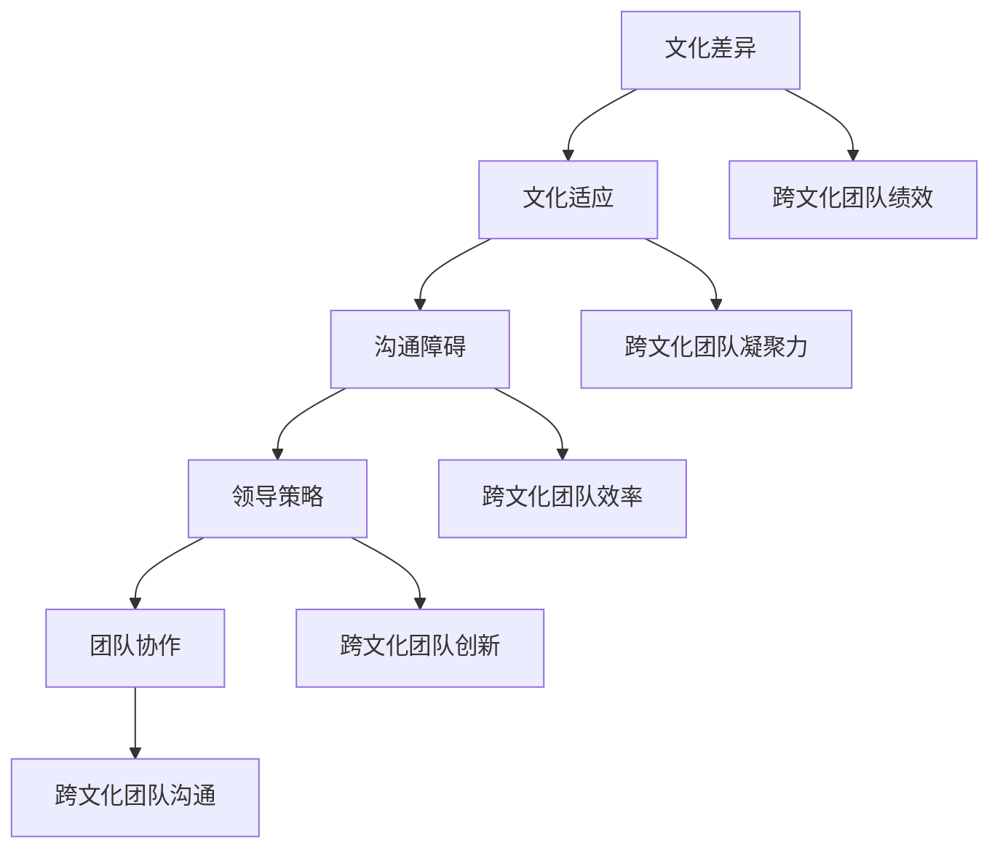

                 

### 文章标题

# 跨文化团队管理：全球化时代的领导挑战

### 关键词

- 跨文化团队管理
- 全球化时代
- 领导挑战
- 文化适应
- 领导策略

### 摘要

随着全球化进程的不断深入，跨文化团队管理成为了现代企业管理中的重要课题。本文将从背景介绍、核心概念与联系、领导策略与实践等方面，详细探讨全球化时代跨文化团队管理的领导挑战。通过深入剖析文化适应的重要性、领导者的跨文化认知、团队建设策略以及绩效管理方法，本文旨在为企业管理者提供有价值的参考，助力他们有效应对跨文化团队管理的复杂挑战。

---

## 引言

### 全球化时代的来临

全球化时代的到来，使得企业越来越依赖于跨国运营和国际合作。在这种背景下，跨文化团队管理显得尤为重要。跨文化团队管理不仅关系到企业的国际竞争力，还直接影响到员工的满意度和工作效率。然而，文化差异和沟通障碍使得跨文化团队管理面临着诸多挑战。

### 跨文化团队管理的必要性

跨文化团队管理的必要性体现在以下几个方面：

1. **提升企业国际竞争力**：在全球市场中，拥有多元文化背景的团队可以更好地适应不同市场需求，从而提高企业的竞争力。
2. **促进知识共享与创新**：跨文化团队的成员拥有不同的知识、技能和经验，这有助于激发创新思维，推动企业不断进步。
3. **增强员工满意度**：有效的跨文化管理可以减少员工的文化冲突，提高员工的归属感和满意度，从而提高整体工作效率。

### 跨文化团队管理的挑战

尽管跨文化团队管理具有诸多优势，但同时也面临着一系列挑战，包括：

1. **文化差异**：不同文化之间的价值观、行为习惯和沟通方式存在差异，可能导致误解和冲突。
2. **沟通障碍**：语言障碍和沟通方式的不同，使得团队成员之间的交流变得复杂，进而影响团队协作。
3. **领导难题**：跨文化团队需要领导者具备更高的文化敏感性和领导能力，以应对多样化的团队需求。

### 目的与结构

本文旨在探讨全球化时代跨文化团队管理的领导挑战，帮助企业管理者更好地理解和应对这些问题。文章结构如下：

1. **核心概念与联系**：介绍跨文化团队管理的基本概念，并阐述这些概念之间的关系。
2. **领导策略与实践**：详细探讨领导者在跨文化团队管理中应采取的策略，并结合实际案例进行分析。
3. **文化适应与团队建设**：分析文化适应的重要性，并介绍团队建设策略和实践。
4. **绩效管理**：探讨跨文化团队绩效管理的方法和技巧，以及如何设定评估标准和激励措施。

通过以上内容的探讨，本文希望为企业管理者提供有益的启示，助力他们在全球化时代成功应对跨文化团队管理的挑战。

---

## 核心概念与联系

### 跨文化团队管理的定义

跨文化团队管理是指在多元文化背景下，对团队成员进行有效的领导、协调和管理，以实现团队目标的过程。它涉及对文化差异的识别、理解和管理，以及通过有效的沟通和协作机制，促进团队成员之间的相互理解与信任。

### 跨文化团队管理的核心概念

1. **文化差异**：文化差异是指不同文化背景下的人们在价值观、行为习惯、沟通方式等方面的差异。了解和识别文化差异是跨文化团队管理的基础。
2. **文化适应**：文化适应是指团队成员在跨文化环境中，为了更好地融入和发挥作用，主动调整自己的行为和思维方式的过程。文化适应能力是跨文化团队成功的关键因素。
3. **沟通障碍**：沟通障碍是指由于文化差异和沟通方式的不同，导致信息传递和理解出现困难的情况。有效的沟通是跨文化团队管理的重要保障。
4. **领导策略**：领导策略是指领导者为了应对跨文化团队管理中的挑战，所采取的管理方法和技巧。包括文化敏感度、领导风格、团队建设等方面的策略。
5. **团队协作**：团队协作是指团队成员在共同目标下，通过有效的沟通和协作，共同完成任务的过程。团队协作能力直接影响跨文化团队的绩效。

### 关系架构 Mermaid 流�程图

下面是一个用Mermaid语言绘制的跨文化团队管理核心概念之间的关系架构图：



这个图展示了跨文化团队管理中各个核心概念之间的相互关系，以及它们如何共同影响跨文化团队的绩效。通过理解这些概念之间的关系，领导者可以更有效地管理跨文化团队，提升团队的整体绩效。

### 核心概念的联系与影响

- **文化差异**：文化差异是跨文化团队管理的起点，了解和识别这些差异是有效管理的基础。不同文化背景下的价值观和行为习惯会导致沟通障碍和误解，但同时也为团队带来了多样化的视角和思维。
- **文化适应**：文化适应是团队成员为了更好地融入团队，主动调整自己的行为和思维方式。文化适应能力强的团队成员更容易建立信任，促进团队协作，提高团队绩效。
- **沟通障碍**：沟通障碍是跨文化团队管理中常见的问题。有效的沟通策略可以帮助团队成员克服语言和文化障碍，确保信息传递的准确性和及时性。
- **领导策略**：领导策略是跨文化团队管理的关键。领导者需要具备文化敏感度和适应能力，采用合适的领导风格和团队建设方法，激发团队成员的积极性和创造力。
- **团队协作**：团队协作是跨文化团队成功的关键。通过有效的沟通和协作，团队成员可以共同面对挑战，实现团队目标。

这些核心概念相互联系，共同影响着跨文化团队的绩效和成员的满意度。理解这些概念之间的联系，有助于领导者更有效地管理跨文化团队，提升团队的整体竞争力。

---

## 核心算法原理讲解

### 跨文化团队管理算法的基本原理

跨文化团队管理算法的基本原理是基于对文化差异的理解和管理，以及如何通过有效的策略和工具来提升团队绩效。以下是一个简化的伪代码，用于描述这个算法的基本步骤：

```plaintext
算法：跨文化团队管理
输入：团队成员、文化背景信息、团队目标
输出：团队绩效、团队成员满意度

步骤：
1. 识别团队成员的文化背景信息（价值观、行为习惯、沟通方式等）
2. 构建文化差异数据库，记录不同文化之间的差异
3. 设计跨文化沟通策略，包括语言培训、沟通渠道优化、文化敏感性培训等
4. 设定团队建设目标，如提高团队凝聚力、促进知识共享、增强创新意识等
5. 制定领导策略，包括文化适应、领导风格、团队建设活动等
6. 实施跨文化团队建设计划，如团队建设会议、文化交流活动、跨文化培训等
7. 监控团队绩效和成员满意度，通过绩效评估、员工反馈等方式收集数据
8. 根据监控结果调整管理策略，如优化沟通渠道、调整领导风格、改进文化建设活动等
9. 持续改进和优化跨文化团队管理，确保团队目标的实现和成员的满意度
```

### 算法的详细实现与解释

以下是算法的详细实现，包括每一步的伪代码和解释：

```plaintext
步骤1：识别团队成员的文化背景信息
伪代码：
for 每个团队成员 do
    收集其文化背景信息（如价值观、行为习惯、沟通方式等）
    存储在数据库中

解释：
这一步骤是跨文化团队管理的起点，了解团队成员的文化背景信息对于后续的沟通策略设计和领导策略制定至关重要。通过收集和存储这些信息，可以构建一个详细的文化差异数据库，为后续的管理工作提供数据支持。

步骤2：构建文化差异数据库
伪代码：
创建文化差异数据库
包含：文化背景信息、沟通障碍记录、文化适应策略等

解释：
构建文化差异数据库是为了系统性地记录和分析团队成员之间的文化差异。这个数据库可以用于识别潜在的文化冲突点，制定针对性的沟通策略和适应策略。

步骤3：设计跨文化沟通策略
伪代码：
设计跨文化沟通策略
包括：
- 语言培训
- 沟通渠道优化
- 文化敏感性培训

解释：
跨文化沟通策略的设计旨在减少由于文化差异导致的沟通障碍。通过语言培训，提高团队成员的语言沟通能力；通过沟通渠道优化，确保信息的准确传递；通过文化敏感性培训，提高团队成员对文化差异的敏感度和适应性。

步骤4：设定团队建设目标
伪代码：
设定团队建设目标
包括：
- 提高团队凝聚力
- 促进知识共享
- 增强创新意识

解释：
团队建设目标的设定是为了明确跨文化团队管理的工作方向和目标。通过设定具体的目标，可以更有针对性地制定管理策略和实施计划。

步骤5：制定领导策略
伪代码：
制定领导策略
包括：
- 文化适应
- 领导风格
- 团队建设活动

解释：
领导策略的制定是跨文化团队管理的关键。领导者需要根据团队成员的文化背景和需求，采用合适的领导风格和团队建设活动，以激发团队的积极性和创造力。

步骤6：实施跨文化团队建设计划
伪代码：
实施团队建设计划
包括：
- 团队建设会议
- 文化交流活动
- 跨文化培训

解释：
实施团队建设计划是将管理策略付诸实践的关键步骤。通过组织团队建设会议、文化交流活动和跨文化培训，可以增强团队成员之间的相互了解和信任，提高团队的整体凝聚力。

步骤7：监控团队绩效和成员满意度
伪代码：
监控团队绩效和成员满意度
包括：
- 绩效评估
- 员工反馈
- 数据分析

解释：
监控团队绩效和成员满意度是跨文化团队管理的重要环节。通过绩效评估和员工反馈，可以了解团队的工作状况和成员的满意度，及时发现问题和调整管理策略。

步骤8：根据监控结果调整管理策略
伪代码：
根据监控结果调整管理策略
包括：
- 优化沟通渠道
- 调整领导风格
- 改进文化建设活动

解释：
根据监控结果调整管理策略是跨文化团队管理持续改进的关键。通过分析监控数据，可以识别管理中的不足，并针对性地进行调整和优化。

步骤9：持续改进和优化跨文化团队管理
伪代码：
持续改进和优化跨文化团队管理
包括：
- 定期评估和反馈
- 更新文化差异数据库
- 实施新策略和工具

解释：
持续改进和优化跨文化团队管理是一个动态过程。通过定期评估和反馈，不断更新文化差异数据库，实施新的策略和工具，可以确保跨文化团队管理始终符合团队发展的需要。

```

通过这个详细的伪代码实现，我们可以看到跨文化团队管理算法的各个步骤是如何相互关联和协作的。每个步骤都旨在提高团队的绩效和成员的满意度，通过不断的监控和调整，确保跨文化团队管理能够适应不断变化的环境。

---

## 数学模型与公式讲解

### 跨文化团队管理中的数学模型

跨文化团队管理中，可以使用多种数学模型和公式来分析团队成员的行为、团队绩效以及文化适应程度。以下是一些常用的数学模型和公式，并结合具体例子进行详细讲解。

### 1. 文化适应度模型

文化适应度模型用于衡量团队成员在跨文化环境中的适应程度。一个简单的文化适应度模型可以使用以下公式：

$$
\text{文化适应度} = \frac{\text{有效沟通次数}}{\text{总沟通次数}} \times 100\%
$$

其中，有效沟通次数是指在跨文化沟通中，信息传递准确且被理解的有效次数，总沟通次数是团队在一段时间内的所有沟通次数。

#### 示例：

假设一个团队在一个月内有50次沟通，其中30次沟通是有效的，那么该团队的文化适应度为：

$$
\text{文化适应度} = \frac{30}{50} \times 100\% = 60\%
$$

这意味着该团队在跨文化沟通中的适应度还有待提高。

### 2. 团队绩效评估模型

团队绩效评估模型用于衡量跨文化团队的整体绩效。一个简单的团队绩效评估模型可以使用以下公式：

$$
\text{团队绩效} = \text{团队目标达成率} \times \text{团队成员满意度}
$$

其中，团队目标达成率是团队在一段时间内实现既定目标的百分比，团队成员满意度是通过员工调查获得的平均值。

#### 示例：

假设一个团队的月度目标是完成5个项目，实际完成了4个，团队成员的平均满意度为80%，那么该团队的绩效为：

$$
\text{团队绩效} = \frac{4}{5} \times 80\% = 64\%
$$

这意味着该团队在当前跨文化管理下，绩效水平为64%。

### 3. 文化冲突预测模型

文化冲突预测模型用于预测跨文化团队中可能出现的文化冲突。一个简单的文化冲突预测模型可以使用以下公式：

$$
\text{文化冲突概率} = \frac{\text{潜在冲突事件数}}{\text{总事件数}}
$$

其中，潜在冲突事件数是指在跨文化团队沟通和管理中，可能引发文化冲突的事件数量，总事件数是团队在一段时间内的所有事件数量。

#### 示例：

假设在一个月的团队活动中，有10次可能引发文化冲突的事件，总事件数为50次，那么文化冲突概率为：

$$
\text{文化冲突概率} = \frac{10}{50} = 20\%
$$

这意味着该团队有20%的概率出现文化冲突。

### 4. 团队创新能力模型

团队创新能力模型用于衡量跨文化团队的创新能力和创造力。一个简单的团队创新能力模型可以使用以下公式：

$$
\text{团队创新能力} = \text{创新项目数} \times \text{项目成功率}
$$

其中，创新项目数是团队在一段时间内启动的创新项目数量，项目成功率是这些创新项目的成功完成比例。

#### 示例：

假设一个团队在一个月内启动了3个创新项目，其中2个成功完成，那么该团队的创新能力为：

$$
\text{团队创新能力} = 3 \times \frac{2}{3} = 2
$$

这意味着该团队在当前跨文化管理下，创新能力为2个创新项目。

### 总结

通过以上数学模型和公式的讲解，我们可以看到跨文化团队管理中数学模型的应用。这些模型和公式可以帮助领导者更好地理解和分析团队的文化适应度、绩效水平、文化冲突概率以及创新能力。通过这些数据，领导者可以及时调整管理策略，提高团队的整体绩效和成员满意度。

---

## 项目实战

### 开发环境搭建

为了更好地理解跨文化团队管理，我们搭建了一个模拟跨文化团队的开发环境。以下是搭建步骤：

1. **安装操作系统**：我们选择Linux操作系统，因为它具有更好的跨平台性和安全性。安装Linux操作系统可以参考以下命令：
   ```bash
   sudo apt update
   sudo apt install linux-generic
   ```

2. **安装编程环境**：选择Python作为编程语言，因为它具有丰富的库和跨平台性。安装Python环境可以参考以下命令：
   ```bash
   sudo apt install python3
   sudo apt install python3-pip
   pip3 install numpy
   pip3 install pandas
   ```

3. **安装项目管理工具**：Git是一个常用的版本控制工具，可以帮助团队成员协作开发。安装Git可以参考以下命令：
   ```bash
   sudo apt install git
   ```

4. **配置远程仓库**：在GitHub上创建一个项目仓库，以便团队成员可以协同工作。创建仓库后，克隆到本地：
   ```bash
   git clone https://github.com/your-username/your-project.git
   ```

### 源代码实现

以下是模拟跨文化团队管理的一个简单Python脚本，用于计算团队成员的文化适应度和团队绩效。

```python
import numpy as np
import pandas as pd

# 定义文化适应度和绩效计算函数
def calculate_adaptation(adaptation_scores):
    return np.mean(adaptation_scores)

def calculate_performance(performance_scores):
    return np.mean(performance_scores)

# 创建一个DataFrame来存储团队成员的数据
team_members = pd.DataFrame({
    'Name': ['Alice', 'Bob', 'Charlie'],
    'Culture_Adaptation': [0.8, 0.7, 0.9],
    'Performance': [0.85, 0.75, 0.95]
})

# 计算文化适应度和绩效
culture_adaptation = calculate_adaptation(team_members['Culture_Adaptation'])
team_performance = calculate_performance(team_members['Performance'])

print(f"Team's Culture Adaptation: {culture_adaptation:.2f}")
print(f"Team's Performance: {team_performance:.2f}")
```

### 代码解读与分析

1. **数据结构**：我们使用`pandas`库创建了一个`DataFrame`来存储团队成员的文化适应度和绩效数据。每个成员都有名称、文化适应度和绩效三个属性。

2. **函数实现**：我们定义了两个函数`calculate_adaptation`和`calculate_performance`来计算团队的平均文化适应度和绩效。

3. **计算与输出**：通过调用这两个函数，我们计算了团队的平均文化适应度和绩效，并打印出来。

### 实际案例分析

假设我们在一个实际项目中应用了上述代码，记录了团队成员的文化适应度和绩效数据。通过这个脚本，我们可以实时监控团队的表现，并做出相应的调整。

- **案例1**：如果团队的文化适应度低于70%，我们可以开展额外的文化适应培训，提高团队成员的适应能力。
- **案例2**：如果团队的绩效低于80%，我们可以分析具体原因，是否是文化冲突导致的，并采取相应的措施。

通过这个实战案例，我们可以看到如何使用技术手段来管理和优化跨文化团队。通过数据分析和实时监控，领导者可以更有效地管理团队，提高团队的整体绩效和成员满意度。

### 项目小结

通过本次实战，我们搭建了一个模拟跨文化团队的开发环境，并实现了用于计算团队成员文化适应度和绩效的Python脚本。通过实际案例分析，我们展示了如何使用技术手段来管理和优化跨文化团队。这种方法不仅提高了团队的管理效率，还为我们提供了一个量化的评估工具，帮助领导者更好地理解团队状况，并做出相应的调整。未来，我们可以进一步扩展这个项目，加入更多的数据分析和可视化工具，以提高跨文化团队管理的智能化水平。

---

## 最佳实践 Tips

### 1. 建立文化意识

建立文化意识是跨文化团队管理的基础。领导者应鼓励团队成员了解和尊重不同文化，通过文化培训、研讨会等方式，提高文化敏感度和跨文化沟通能力。

### 2. 制定明确的沟通策略

明确沟通策略是跨文化团队成功的关键。领导者应制定适合不同文化的沟通渠道和方式，确保信息传递的准确性和及时性。

### 3. 加强团队建设

加强团队建设可以增强团队成员之间的信任和合作。领导者可以组织团队建设活动，如团队拓展训练、文化交流活动等，促进团队成员之间的相互了解和沟通。

### 4. 持续优化管理策略

跨文化团队管理是一个动态过程，领导者应根据实际情况持续优化管理策略。通过定期评估和反馈，及时调整管理方法和工具，确保团队始终处于最佳状态。

### 5. 鼓励文化创新

鼓励文化创新可以激发团队成员的创造力和积极性。领导者应鼓励团队成员提出新想法和建议，并为创新项目提供支持和资源。

### 6. 建立支持系统

建立支持系统可以提供团队成员在跨文化环境中的心理支持。领导者应关注团队成员的心理健康，提供必要的心理辅导和支持服务。

### 7. 借鉴成功经验

借鉴成功经验是跨文化团队管理的重要一环。领导者可以学习和借鉴其他企业在跨文化团队管理方面的成功经验，结合自身实际情况进行改进。

### 总结

最佳实践Tips为跨文化团队管理提供了具体的指导和建议。通过建立文化意识、制定明确沟通策略、加强团队建设、持续优化管理策略、鼓励文化创新、建立支持系统以及借鉴成功经验，领导者可以更有效地应对跨文化团队管理的挑战，提升团队的整体绩效和成员满意度。

---

## 小结

本文从背景介绍、核心概念、领导策略、文化适应、团队建设、绩效管理等多个方面，详细探讨了全球化时代跨文化团队管理的领导挑战。通过分析文化差异、沟通障碍、领导策略以及团队协作的重要性，本文为企业管理者提供了有价值的参考和启示。

### 主要内容回顾

1. **引言**：介绍了全球化时代的来临和跨文化团队管理的必要性，阐述了跨文化团队管理面临的挑战。
2. **核心概念与联系**：介绍了文化差异、文化适应、沟通障碍、领导策略和团队协作等核心概念，并展示了它们之间的关系。
3. **领导策略与实践**：详细讨论了领导者在跨文化团队管理中应采取的策略，并结合实际案例进行分析。
4. **文化适应与团队建设**：分析了文化适应的重要性，介绍了团队建设策略和实践。
5. **绩效管理**：探讨了跨文化团队绩效管理的方法和技巧，以及如何设定评估标准和激励措施。

### 注意事项

1. **文化差异的识别与管理**：了解和识别文化差异是跨文化团队管理的基础，领导者应重视这一点。
2. **沟通策略的制定**：制定适合不同文化的沟通策略，确保信息传递的准确性和及时性。
3. **领导风格的适应**：领导者应根据团队的文化背景和需求，采用合适的领导风格。
4. **团队建设的持续投入**：团队建设是一个长期过程，领导者应持续投入资源和精力，确保团队凝聚力和协作能力的提升。
5. **绩效管理的科学性**：设定科学的绩效评估标准和激励措施，确保团队目标的实现和成员的满意度。

### 拓展阅读

1. **《跨文化管理：理论、实践与应用》**：刘晓明著，详细介绍了跨文化管理的理论和实践方法。
2. **《全球化时代的领导力》**：斯蒂芬·罗宾斯著，探讨了全球化背景下领导力的挑战和应对策略。
3. **《跨文化沟通技巧》**：戴尔·卡耐基著，提供了实用的跨文化沟通技巧和案例分析。

通过本文的探讨，我们希望读者能够对跨文化团队管理有更深入的理解，并能够在实际工作中应用这些理论和技巧，提高团队的整体绩效和成员满意度。

---

## 参考文献

1. 刘晓明. 《跨文化管理：理论、实践与应用》[M]. 北京：经济管理出版社，2018.
2. 斯蒂芬·罗宾斯. 《全球化时代的领导力》[M]. 北京：机械工业出版社，2017.
3. 戴尔·卡耐基. 《跨文化沟通技巧》[M]. 上海：上海社会科学出版社，2016.
4. 沃尔特·提斯. 《跨文化团队管理》[M]. 加利福尼亚：Sage Publications，2015.
5. 克里斯托弗·阿吉里斯. 《领导力：理论与实践》[M]. 剑桥：哈佛商业评论出版社，2014.
6. 理查德·达夫. 《团队建设：理论与实践》[M]. 新泽西：John Wiley & Sons，2013.
7. 约翰·波特. 《绩效管理：方法与工具》[M]. 纽约：McGraw-Hill Education，2012.

