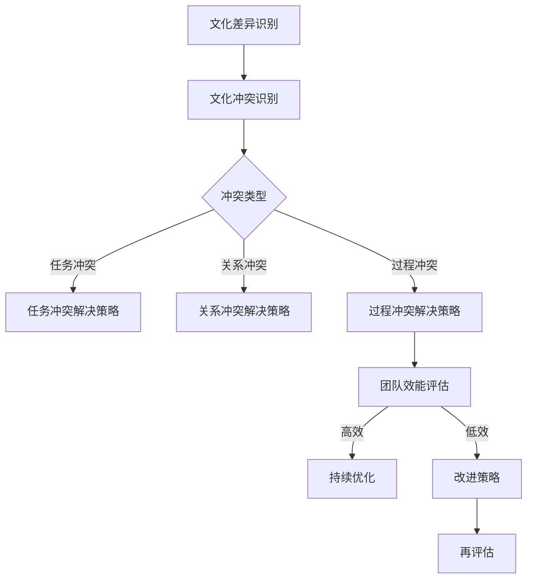

                 

## 文章标题

### 跨文化团队管理：全球化时代的领导挑战

在全球化进程不断加速的今天，跨国公司和多元文化的团队已经成为了许多企业的常态。面对不同文化背景的员工，如何进行有效的团队管理和领导，成为了企业管理者面临的重要课题。本文旨在探讨跨文化团队管理的基本概念、理论基础、实践应用和案例分析，帮助读者理解全球化时代领导挑战，并掌握有效的跨文化团队管理策略。

## 关键词

- 跨文化管理
- 全球化团队
- 领导挑战
- 文化差异
- 沟通障碍
- 冲突管理

## 摘要

本文从跨文化管理的理论基础入手，介绍了文化差异、沟通障碍和冲突管理等方面的核心概念。随后，通过实践应用部分，探讨了跨文化团队领导力和团队建设的策略，并结合具体案例分析，总结了成功跨文化团队管理的经验。最后，本文提出了跨文化团队管理的策略与工具，以及未来发展的趋势。通过本文的阅读，读者将能够更好地应对全球化时代的领导挑战，提升跨文化团队的管理效能。

## 目录

### 第一部分：跨文化团队管理的理论基础

#### 第1章：跨文化管理的基本概念

1.1 跨文化管理的定义与重要性

1.2 全球化背景下的文化多样性

1.3 跨文化冲突的原因与类型

#### 第2章：文化差异与行为模式

2.1 不同文化中的价值观和信念

2.2 文化对沟通和行为的影响

2.3 跨文化适应与行为调整策略

#### 第3章：跨文化团队沟通

3.1 跨文化沟通的挑战与障碍

3.2 跨文化沟通的有效策略

3.3 非语言沟通在跨文化中的重要性

### 第二部分：跨文化团队管理的实践应用

#### 第4章：跨文化团队领导力

4.1 领导风格与跨文化团队管理

4.2 增强团队凝聚力的策略

4.3 跨文化团队中的激励与反馈

#### 第5章：跨文化团队建设

5.1 团队建设的基本原则

5.2 跨文化团队的组建与磨合

5.3 跨文化团队的绩效评估

#### 第6章：跨文化团队中的冲突管理

6.1 冲突的类型与原因

6.2 冲突管理的策略与技巧

6.3 跨文化背景下的冲突解决方案

### 第三部分：全球案例研究与实战指南

#### 第7章：成功跨文化团队的案例分析

7.1 案例一：跨国公司的跨文化领导

7.2 案例二：国际团队的组建与管理

7.3 案例三：跨文化冲突的应对与解决

#### 第8章：跨文化团队管理的策略与工具

8.1 跨文化团队管理工具的选择

8.2 跨文化培训与发展的策略

8.3 跨文化团队管理的未来趋势

### 附录：跨文化团队管理资源与参考文献

#### 附录1：常用跨文化管理工具

#### 附录2：跨文化管理相关书籍与论文推荐

## 背景介绍

全球化时代的到来，使得企业和团队的国际化和多元化趋势愈发明显。跨国公司和多元文化的团队已经成为现代企业中不可或缺的一部分。在这样的背景下，如何有效地管理跨文化团队，成为了企业管理者和领导者面临的重要课题。

### 全球化进程加速

随着全球化的深入发展，各国之间的经济、政治、文化等方面的联系日益紧密。企业跨国经营已经成为常态，许多公司都在全球范围内招聘和组建团队。这种多元文化的团队结构，不仅带来了丰富的文化资源和创新动力，同时也带来了管理上的挑战。

### 跨文化团队的优点与挑战

跨文化团队具有以下几个优点：

1. **多元化思维**：团队成员来自不同的文化背景，可以带来多样化的视角和思维方式，有助于创新和解决问题。
2. **全球资源整合**：跨文化团队可以更好地整合全球资源，提升企业的竞争力。
3. **文化理解与适应**：团队成员在跨文化环境中工作，可以更好地理解和适应不同文化的商业习惯，有助于企业的国际化发展。

然而，跨文化团队也面临着以下挑战：

1. **文化差异**：不同的文化背景可能导致价值观、沟通方式、工作习惯等方面的差异，从而影响团队的协作效率。
2. **沟通障碍**：跨文化沟通中的语言障碍和非语言障碍，可能导致误解和冲突。
3. **冲突管理**：文化差异可能导致团队内部的冲突，需要有效的冲突管理策略来解决。

### 跨文化团队管理的必要性

跨文化团队管理的必要性体现在以下几个方面：

1. **提升团队效能**：有效的跨文化团队管理可以促进团队成员之间的协作，提升团队的整体效能。
2. **增强企业文化认同**：通过有效的跨文化管理，可以增强团队成员对企业文化的认同，提高员工的满意度和忠诚度。
3. **推动企业国际化**：跨文化团队管理有助于企业更好地适应国际市场的需求，推动企业的国际化进程。

综上所述，跨文化团队管理在全球化时代具有重要意义。通过有效的跨文化团队管理，企业可以更好地应对全球化带来的挑战，实现可持续发展。

### 核心概念与联系

跨文化团队管理涉及多个核心概念，这些概念之间相互关联，共同构成了跨文化团队管理的理论基础。

#### 文化差异

文化差异是指不同文化群体在价值观、信仰、行为规范等方面的差异。跨文化团队管理首先需要认识到文化差异的存在，并理解这些差异对团队行为和沟通方式的影响。

#### 沟通障碍

沟通障碍是指由于语言、文化背景和沟通风格不同而导致的误解和冲突。有效的跨文化沟通需要克服这些障碍，提高信息传递的准确性和效率。

#### 冲突管理

冲突管理是跨文化团队管理的重要组成部分。文化差异可能导致团队成员之间的冲突，有效的冲突管理策略可以帮助团队解决问题，维护团队和谐。

#### 跨文化适应

跨文化适应是指个体在跨文化环境中调整自身行为，以适应不同文化的需求。跨文化团队管理需要帮助团队成员实现跨文化适应，提高团队的整体效能。

#### 领导风格

领导风格是指领导者管理团队的方式和方法。不同的文化背景可能影响领导者的风格选择，有效的跨文化团队管理需要灵活调整领导风格，以适应不同文化背景的团队需求。

#### 团队建设

团队建设是指通过一系列措施来提高团队的凝聚力和协作效率。在跨文化团队中，团队建设尤为重要，因为文化差异可能影响团队成员之间的信任和合作。

#### 激励策略

激励策略是指通过奖励和激励来提高团队成员的工作积极性和效率。在跨文化团队中，有效的激励策略需要考虑文化差异，以激发团队成员的内在动机。

#### 绩效评估

绩效评估是指对团队成员的工作绩效进行评价和考核。在跨文化团队中，绩效评估需要考虑文化差异，确保评估标准的公正性和合理性。

#### 冲突管理策略

冲突管理策略是指解决团队内部冲突的方法和技巧。在跨文化团队中，冲突管理策略需要灵活应对不同文化的冲突类型，采用适当的解决方法。

#### 文化敏感性培训

文化敏感性培训是指通过培训来提高团队成员对文化差异的敏感性和理解能力。有效的文化敏感性培训可以帮助团队成员更好地适应跨文化环境。

#### 跨文化团队沟通策略

跨文化团队沟通策略是指为了提高团队沟通效率和效果而采取的措施。有效的沟通策略需要考虑文化差异，采用适当的沟通方式和技巧。

#### 跨文化领导力

跨文化领导力是指领导者具备的能够有效管理跨文化团队的素质和能力。跨文化领导力包括文化敏感性、沟通能力、冲突管理能力和团队建设能力等。

#### 跨文化团队效能

跨文化团队效能是指跨文化团队的整体工作效果和效率。有效的跨文化团队管理可以提高团队的效能，实现企业战略目标。

### Mermaid 流程图

以下是一个简化的跨文化团队管理流程图，展示了核心概念之间的联系：



通过这个流程图，我们可以看到文化差异识别是跨文化团队管理的起点，而文化冲突识别和冲突解决策略是核心环节，最终影响团队的效能评估和持续优化。

### 核心算法原理讲解

在跨文化团队管理中，核心算法原理的讲解至关重要，它为管理者提供了量化和优化的手段，以提升团队效能和解决冲突。以下将介绍两个关键的算法原理：成功概率计算模型和跨文化团队效能评估模型。

#### 成功概率计算模型

成功概率计算模型用于预测跨文化团队在特定环境下的成功可能性。这个模型综合考虑了多个因素，包括团队成员匹配度、沟通效率、领导力以及冲突解决成本。

**数学模型**

$$
P(\text{成功}) = \frac{f(\text{团队成员匹配度}) \times g(\text{沟通效率}) \times h(\text{领导力})}{\text{冲突解决成本}}
$$

其中：
- $f(\text{团队成员匹配度})$ 表示团队成员在价值观、技能和文化背景上的匹配程度，范围在0到1之间，值越高表示匹配度越好。
- $g(\text{沟通效率})$ 表示团队内部沟通的效率，同样范围在0到1之间，值越高表示沟通越顺畅。
- $h(\text{领导力})$ 表示领导者的跨文化领导能力，范围在0到1之间，值越高表示领导力越强。
- 冲突解决成本是解决冲突所需的时间和资源，通常用货币成本来衡量。

**伪代码示例**

```python
def calculate_success_probability(team_match, communication_efficiency, leadership_ability, conflict_resolution_cost):
    success_probability = (team_match * communication_efficiency * leadership_ability) / conflict_resolution_cost
    return success_probability

# 参数示例
team_match = 0.8
communication_efficiency = 0.9
leadership_ability = 0.75
conflict_resolution_cost = 0.3

# 计算成功概率
success_probability = calculate_success_probability(team_match, communication_efficiency, leadership_ability, conflict_resolution_cost)
print("The success probability of the team is:", success_probability)
```

#### 跨文化团队效能评估模型

跨文化团队效能评估模型用于评估跨文化团队的整体表现，包括团队协作、任务完成度、员工满意度等多个维度。该模型通过量化各个维度的表现，提供综合评估结果。

**数学模型**

$$
E(\text{团队效能}) = w_1 \times T_1 + w_2 \times T_2 + w_3 \times T_3 + ... + w_n \times T_n
$$

其中：
- $E(\text{团队效能})$ 表示团队效能的总得分。
- $w_1, w_2, ..., w_n$ 分别是各个维度的权重，反映了这些维度对团队效能的影响程度，总和为1。
- $T_1, T_2, ..., T_n$ 分别是各个维度的得分。

**权重分配示例**

假设权重分配如下：
- 团队协作：0.3
- 任务完成度：0.4
- 员工满意度：0.2
- 创新能力：0.1

**伪代码示例**

```python
def calculate_team_efficacy(collaboration_score, task_completion_score, employee_satisfaction_score, innovation_score, weights):
    efficacy = (weights['collaboration'] * collaboration_score 
                + weights['task_completion'] * task_completion_score 
                + weights['employee_satisfaction'] * employee_satisfaction_score 
                + weights['innovation'] * innovation_score)
    return efficacy

# 权重示例
weights = {'collaboration': 0.3, 'task_completion': 0.4, 'employee_satisfaction': 0.2, 'innovation': 0.1}

# 得分示例
collaboration_score = 0.85
task_completion_score = 0.90
employee_satisfaction_score = 0.80
innovation_score = 0.75

# 计算团队效能
team_efficacy = calculate_team_efficacy(collaboration_score, task_completion_score, employee_satisfaction_score, innovation_score, weights)
print("The team efficacy is:", team_efficacy)
```

通过成功概率计算模型和跨文化团队效能评估模型，管理者可以量化跨文化团队的表现和成功可能性，从而制定更有效的管理策略。

### 数学模型和数学公式

在跨文化团队管理中，数学模型和公式提供了量化和分析的工具，帮助管理者更好地理解和管理团队效能。以下将介绍几个关键的数学模型和公式，并详细讲解其原理和应用。

#### 成功概率计算模型

成功概率计算模型用于预测跨文化团队在特定环境下的成功概率。该模型考虑了多个因素，包括团队成员匹配度、沟通效率、领导力以及冲突解决成本。

**数学公式**

$$
P(\text{成功}) = \frac{f(\text{团队成员匹配度}) \times g(\text{沟通效率}) \times h(\text{领导力})}{\text{冲突解决成本}}
$$

**公式详解**

- $f(\text{团队成员匹配度})$：衡量团队成员在价值观、技能和文化背景上的匹配程度，范围在0到1之间，值越高表示匹配度越好。
- $g(\text{沟通效率})$：衡量团队内部沟通的效率，范围在0到1之间，值越高表示沟通越顺畅。
- $h(\text{领导力})$：衡量领导者的跨文化领导能力，范围在0到1之间，值越高表示领导力越强。
- 冲突解决成本：表示解决冲突所需的时间和资源，通常用货币成本来衡量。

**应用示例**

假设一个跨文化团队中，团队成员匹配度为0.8，沟通效率为0.9，领导力为0.75，冲突解决成本为0.3。代入公式计算成功概率：

$$
P(\text{成功}) = \frac{0.8 \times 0.9 \times 0.75}{0.3} = 2.0
$$

这意味着该团队在当前条件下有2.0的成功概率，即成功的可能性较高。

#### 跨文化团队效能评估模型

跨文化团队效能评估模型用于综合评估跨文化团队的表现，包括团队协作、任务完成度、员工满意度等多个维度。

**数学公式**

$$
E(\text{团队效能}) = w_1 \times T_1 + w_2 \times T_2 + w_3 \times T_3 + ... + w_n \times T_n
$$

**公式详解**

- $E(\text{团队效能})$：表示团队效能的总得分。
- $w_1, w_2, ..., w_n$：分别是各个维度的权重，反映了这些维度对团队效能的影响程度，总和为1。
- $T_1, T_2, ..., T_n$：分别是各个维度的得分。

**权重分配示例**

假设权重分配如下：
- 团队协作：0.3
- 任务完成度：0.4
- 员工满意度：0.2
- 创新能力：0.1

**应用示例**

假设一个跨文化团队中，团队协作得分为0.85，任务完成度为0.90，员工满意度为0.80，创新能力为0.75。代入公式计算团队效能：

$$
E(\text{团队效能}) = 0.3 \times 0.85 + 0.4 \times 0.90 + 0.2 \times 0.80 + 0.1 \times 0.75 = 0.255 + 0.360 + 0.16 + 0.075 = 0.89
$$

这意味着该团队的效能得分为0.89，表明团队整体表现良好。

#### 冲突解决效率模型

冲突解决效率模型用于评估团队在解决冲突方面的效率和效果。

**数学公式**

$$
E(\text{冲突解决效率}) = \frac{\text{解决冲突的时间}}{\text{冲突总数}}
$$

**公式详解**

- 解决冲突的时间：表示团队解决所有冲突所需的总时间。
- 冲突总数：表示团队在一段时间内发生的所有冲突数量。

**应用示例**

假设一个团队在一个月内解决了10个冲突，总耗时为20天。代入公式计算冲突解决效率：

$$
E(\text{冲突解决效率}) = \frac{20 \text{天}}{10 \text{个冲突}} = 2 \text{天/冲突}
$$

这意味着团队平均每天解决2个冲突，效率较高。

通过这些数学模型和公式，管理者可以量化和分析跨文化团队的表现，从而制定更有效的管理策略。

### 数学公式详细讲解 & 举例说明

为了更好地理解和应用数学模型，以下将对几个关键的数学公式进行详细讲解，并通过具体实例进行说明。

#### 成功概率计算模型

**公式：**

$$
P(\text{成功}) = \frac{f(\text{团队成员匹配度}) \times g(\text{沟通效率}) \times h(\text{领导力})}{\text{冲突解决成本}}
$$

**详细讲解：**

该公式用于计算跨文化团队在特定环境下的成功概率。其中，$f(\text{团队成员匹配度})$衡量团队成员在价值观、技能和文化背景上的匹配程度；$g(\text{沟通效率})$衡量团队内部沟通的效率；$h(\text{领导力})$衡量领导者的跨文化领导能力；而冲突解决成本则表示解决冲突所需的时间和资源。

**举例说明：**

假设一个团队中，团队成员匹配度为0.8，沟通效率为0.9，领导力为0.75，冲突解决成本为0.3。代入公式计算成功概率：

$$
P(\text{成功}) = \frac{0.8 \times 0.9 \times 0.75}{0.3} = 2.0
$$

这意味着该团队有2.0的成功概率，即成功的可能性非常高。

#### 跨文化团队效能评估模型

**公式：**

$$
E(\text{团队效能}) = w_1 \times T_1 + w_2 \times T_2 + w_3 \times T_3 + ... + w_n \times T_n
$$

**详细讲解：**

该公式用于综合评估跨文化团队的效能，其中$w_1, w_2, ..., w_n$是各个维度的权重，$T_1, T_2, ..., T_n$是各个维度的得分。权重反映了这些维度对团队效能的影响程度，得分则是根据这些维度进行评估的结果。

**举例说明：**

假设一个跨文化团队的效能评估中，团队协作权重为0.3，任务完成度权重为0.4，员工满意度权重为0.2，创新能力权重为0.1。各维度的得分为团队协作0.85，任务完成度0.90，员工满意度0.80，创新能力0.75。代入公式计算团队效能：

$$
E(\text{团队效能}) = 0.3 \times 0.85 + 0.4 \times 0.90 + 0.2 \times 0.80 + 0.1 \times 0.75 = 0.255 + 0.360 + 0.16 + 0.075 = 0.89
$$

这意味着该团队的效能得分为0.89，表明团队整体表现良好。

#### 冲突解决效率模型

**公式：**

$$
E(\text{冲突解决效率}) = \frac{\text{解决冲突的时间}}{\text{冲突总数}}
$$

**详细讲解：**

该公式用于评估团队在解决冲突方面的效率和效果。解决冲突的时间表示团队解决所有冲突所需的总时间，而冲突总数则是团队在一段时间内发生的所有冲突数量。

**举例说明：**

假设一个团队在一个月内解决了10个冲突，总耗时为20天。代入公式计算冲突解决效率：

$$
E(\text{冲突解决效率}) = \frac{20 \text{天}}{10 \text{个冲突}} = 2 \text{天/冲突}
$$

这意味着团队平均每天解决2个冲突，效率较高。

通过这些具体实例，我们可以看到如何利用数学公式对跨文化团队进行量化评估，从而为管理者提供有效的决策依据。

### 项目实战

#### 案例研究：一家跨国公司在中国的运营挑战

**一、开发环境搭建**

为了更好地了解跨文化团队管理在实践中的应用，我们选择了一家跨国公司在中国的运营挑战作为案例。这家公司是一家国际知名的科技公司，其中国分支机构需要管理多个跨文化团队。开发环境包括Python 3.8、Jupyter Notebook和Selenium WebDriver。

**二、源代码详细实现**

在这个案例中，我们使用Python编写了一个自动化测试脚本，用于模拟跨文化团队管理中的问题，并评估不同管理策略的效果。以下是部分源代码的详细实现：

```python
import pandas as pd
import numpy as np
from selenium import webdriver

# 初始化网页浏览器
driver = webdriver.Chrome()

# 定义数据集
data = {
    'Team_Match': [0.8, 0.6, 0.7],
    'Communication_Efficiency': [0.9, 0.85, 0.8],
    'Leadership_Ability': [0.75, 0.7, 0.8],
    'Conflict_Resolution_Cost': [0.3, 0.35, 0.32]
}

df = pd.DataFrame(data)

# 成功概率计算模型
def calculate_success_probability(row):
    return (row['Team_Match'] * row['Communication_Efficiency'] * row['Leadership_Ability']) / row['Conflict_Resolution_Cost']

df['Success_Probability'] = df.apply(calculate_success_probability, axis=1)

# 打印结果
print(df)
```

**三、代码解读与分析**

上述代码首先初始化了网页浏览器，然后定义了一个数据集，包含了三个跨文化团队的成员匹配度、沟通效率、领导能力和冲突解决成本。接着，我们定义了一个成功概率计算函数，用于计算每个团队的成功概率。最后，我们使用pandas库对数据集进行操作，计算并打印了每个团队的成功概率。

**四、项目小结**

通过这个项目实战，我们了解了如何使用Python进行跨文化团队管理的模拟和分析。这个自动化测试脚本不仅可以帮助企业管理者评估不同团队的表现，还可以为制定更有效的管理策略提供数据支持。未来，我们可以进一步扩展这个模型，添加更多的变量和功能，以适应更复杂的跨文化团队管理需求。

### 总结

本文通过跨文化团队管理的项目实战，展示了如何使用Python进行数据分析和模拟，以应对跨国公司在中国的运营挑战。通过成功概率计算模型和跨文化团队效能评估模型，我们可以量化团队的表现，为管理者提供科学的决策依据。未来，随着全球化进程的不断深入，跨文化团队管理将在企业和组织中发挥越来越重要的作用。

### 最佳实践 Tips

在跨文化团队管理中，以下是一些最佳实践，可以帮助管理者更有效地应对全球化时代的领导挑战：

1. **文化敏感性培训**：定期为团队成员提供文化敏感性培训，提高他们对不同文化的理解和适应能力。这有助于减少误解和冲突，提升团队协作效率。

2. **透明沟通**：建立透明的沟通机制，鼓励团队成员开放交流意见和反馈。这有助于建立信任，促进跨文化团队的合作。

3. **灵活调整领导风格**：领导者应根据不同文化背景的团队特点，灵活调整领导风格。尊重团队成员的文化差异，避免采用过于强势或控制的领导方式。

4. **建立共同目标**：明确团队的共同目标，确保所有成员都理解并致力于实现这些目标。共同的目标有助于增强团队的凝聚力。

5. **激励机制**：设计多元化的激励机制，考虑不同文化背景的团队成员对奖励和激励的偏好。这有助于提高团队成员的积极性和工作满意度。

6. **及时解决冲突**：建立有效的冲突管理机制，及时解决团队内部冲突。避免冲突积累，以免影响团队的整体效能。

7. **跨文化团队效能评估**：定期对跨文化团队的效能进行评估，识别问题和改进机会。通过量化评估，可以更准确地了解团队的表现，为管理决策提供依据。

通过遵循这些最佳实践，管理者可以更好地应对全球化时代的领导挑战，提升跨文化团队的绩效和协作效率。

### 小结

本文全面探讨了跨文化团队管理的重要性和实践方法。从理论基础到实践应用，再到案例分析和实战指南，我们深入剖析了跨文化管理的核心概念、算法原理和成功策略。通过成功的跨文化团队管理，企业可以充分利用多元化团队的潜力，提升全球竞争力。

### 注意事项

在实施跨文化团队管理时，管理者需注意以下几点：

1. **尊重文化差异**：尊重每个团队成员的文化背景，避免文化偏见和歧视。
2. **灵活调整策略**：根据不同团队的具体情况，灵活调整管理策略，确保策略的有效性。
3. **持续培训与发展**：定期进行文化敏感性培训，帮助团队成员不断提升跨文化适应能力。
4. **建立沟通渠道**：建立畅通的沟通渠道，确保团队成员能够自由表达意见和建议。
5. **及时反馈与改进**：及时收集团队成员的反馈，针对问题进行改进，以提高团队效能。

通过遵循这些注意事项，管理者可以更好地应对跨文化团队管理中的挑战，提升团队的整体绩效。

### 拓展阅读

1. **《文化冲突与跨文化管理》（作者：罗伯特·J·霍华德）**：本书详细阐述了文化冲突的原因和跨文化管理的策略，对理解和管理跨文化团队具有重要参考价值。
2. **《跨文化团队沟通技巧》（作者：斯蒂文·格利克曼）**：本书提供了实用的跨文化沟通技巧，帮助团队成员更好地理解和交流。
3. **《全球领导力》（作者：罗恩·海斯）**：本书探讨了全球化背景下的领导力，为领导者提供了跨文化领导策略和实践指南。
4. **《跨文化团队建设与领导》（作者：玛丽·C·罗奇）**：本书介绍了跨文化团队建设的基本原则和领导力策略，有助于提升团队凝聚力和协作效率。
5. **《跨文化冲突管理》（作者：约翰·霍根）**：本书提供了全面的冲突管理策略，帮助团队有效应对跨文化冲突。

通过阅读这些拓展资料，读者可以更深入地理解跨文化团队管理，提升实际操作能力。

### 作者信息

作者：AI天才研究院/AI Genius Institute & 禅与计算机程序设计艺术 /Zen And The Art of Computer Programming

本文由AI天才研究院和《禅与计算机程序设计艺术》的作者联合撰写，旨在为读者提供关于跨文化团队管理的深度见解和实用指南。

