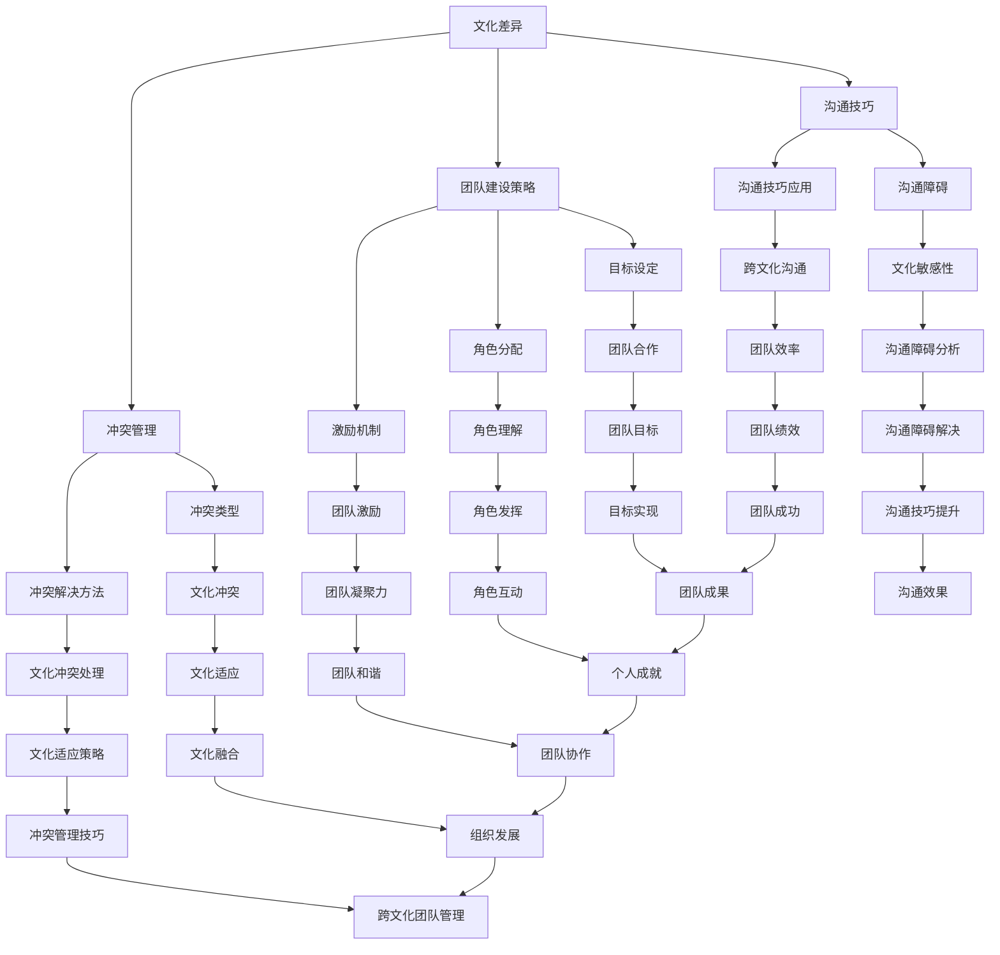

                 

### 文章标题

# 跨文化团队管理：全球化背景下的挑战

### 关键词

- 跨文化团队管理
- 全球化
- 文化差异
- 沟通技巧
- 冲突管理
- 建设策略

### 摘要

本文旨在探讨全球化背景下跨文化团队管理的挑战与策略。文章首先介绍了跨文化团队管理的核心概念，随后分析了全球化背景下的文化差异及其影响。接着，本文详细探讨了跨文化沟通技巧、团队建设策略和冲突管理方法，并通过成功与失败的案例研究，总结了跨文化团队管理的最佳实践。最后，文章展望了跨文化团队管理的未来趋势，为读者提供了全面的管理指南。文章采用markdown格式，包含Mermaid流程图、伪代码、数学模型和公式等元素，旨在提供清晰、系统的论述。

### 背景介绍

在全球化不断深化的今天，跨文化团队管理已经成为企业管理中不可忽视的一部分。随着跨国公司、国际项目和远程工作的增加，团队成员来自不同的文化背景，如何在这样的环境中有效管理团队，成为企业管理者面临的重要挑战。

首先，全球化背景下的文化差异是跨文化团队管理的重要背景。不同的文化背景意味着团队成员在价值观、沟通方式、工作态度等方面存在差异。例如，在集体主义文化中，团队成员更注重团队合作和集体利益；而在个人主义文化中，团队成员更注重个人成就和自我表达。这些文化差异可能导致团队内部的冲突和沟通障碍，影响团队的协作效率和绩效。

其次，跨文化沟通技巧是跨文化团队管理的关键。有效的沟通能够促进团队成员之间的理解和信任，提高团队协作效果。然而，文化差异使得跨文化沟通变得复杂。例如，某些文化中直接表达意见被视为不礼貌，而在其他文化中，间接表达可能被视为虚伪或缺乏诚意。因此，掌握跨文化沟通技巧对于管理者来说至关重要。

此外，跨文化团队建设策略也是成功管理跨文化团队的重要一环。通过制定明确的目标、合理的角色分配和有效的激励机制，可以促进团队成员之间的合作，增强团队的凝聚力。同时，管理者还需要关注跨文化冲突的管理，及时解决团队内部的矛盾和问题，确保团队稳定和谐。

### 核心概念与联系

#### 跨文化团队管理的核心概念

跨文化团队管理涉及多个核心概念，包括文化差异、沟通技巧、团队建设策略和冲突管理。以下是一个Mermaid流程图，展示了这些核心概念之间的关系：

#### 核心概念联系

- **文化差异**是跨文化团队管理的起点，了解文化差异有助于管理者更好地理解和适应团队成员。
- **沟通技巧**是跨文化团队管理的桥梁，通过有效的沟通技巧，可以减少文化差异带来的误解和冲突。
- **团队建设策略**是跨文化团队管理的保障，通过合理的目标设定、角色分配和激励机制，可以增强团队的凝聚力和合作效率。
- **冲突管理**是跨文化团队管理的必要环节，及时有效的冲突管理可以确保团队内部的稳定和和谐。

这些核心概念相互联系、相互影响，共同构成了跨文化团队管理的完整体系。

#### 跨文化团队管理的基本原则

在跨文化团队管理中，以下基本原则尤为关键：

1. **尊重文化差异**：尊重文化差异是跨文化团队管理的基础。管理者应该认识到每个团队成员都有其独特的文化背景，避免对其他文化进行刻板印象或歧视。通过尊重文化差异，可以建立团队成员之间的信任和尊重，促进团队合作。

2. **促进文化融合**：在尊重文化差异的同时，管理者还应该努力促进文化融合。通过组织跨文化培训、团队建设活动和跨文化交流，可以增强团队成员之间的理解和认同，形成共同的文化价值观。

3. **培养跨文化意识**：跨文化意识是跨文化团队管理的关键能力。管理者应该积极培养团队成员的跨文化意识，使其能够更好地理解和适应其他文化。这不仅有助于提升团队的整体绩效，也有助于提升个人的跨文化沟通能力。

4. **建立有效的沟通机制**：有效的沟通是跨文化团队管理的重要保障。管理者应该建立开放的沟通机制，鼓励团队成员畅所欲言，充分表达自己的观点和意见。同时，管理者还应该注重非语言沟通的运用，避免因语言障碍导致误解和冲突。

5. **关注团队建设**：团队建设是跨文化团队管理的重要组成部分。管理者应该关注团队成员的个体需求，提供个性化的支持和发展机会。通过建立有效的团队协作机制和激励机制，可以增强团队的凝聚力，提高团队的协作效率。

6. **及时解决冲突**：跨文化团队中难免会出现冲突，管理者应该及时解决冲突，避免冲突升级。通过冲突管理技巧，如倾听、沟通、调解和协商，可以有效地解决跨文化冲突，维护团队的稳定和谐。

7. **持续学习和改进**：跨文化团队管理是一个持续学习和改进的过程。管理者应该不断学习和吸收最新的跨文化管理理论和实践经验，结合实际情况进行改进，不断提升团队的管理效能。

通过遵循这些基本原则，管理者可以更好地应对全球化背景下的跨文化团队管理挑战，实现团队的长期稳定和发展。

### 全球化背景下的文化差异

全球化进程的加速使得文化差异成为了跨文化团队管理中不可忽视的重要因素。了解和识别这些文化差异是有效管理跨文化团队的关键步骤。

#### 文化差异的类型

1. **价值观差异**：不同的文化背景导致人们对价值观有不同的理解。例如，在集体主义文化中，个人往往更加注重团队的利益和整体的和谐，而在个人主义文化中，个人成就和自我实现被放在首位。

2. **沟通风格差异**：不同文化背景下的沟通风格也各不相同。在一些文化中，直接表达意见被视为诚实和坦率的体现，而在其他文化中，委婉和含蓄的沟通方式更为常见。

3. **工作态度差异**：工作态度在不同文化背景下也有所不同。例如，在一些文化中，工作时间观念较为严格，而另一些文化中则更加灵活。

4. **管理风格差异**：管理风格在不同文化背景下也存在差异。在一些文化中，层级分明、权威式的管理方式更为普遍，而在其他文化中，扁平化、参与式管理更为常见。

#### 文化价值观的比较

1. **时间观念**：在时间观念方面，西方文化通常强调效率和结果，时间被视为宝贵的资源，而东方文化则更加注重过程和关系，时间的紧迫感可能相对较弱。

2. **权力距离**：权力距离是指社会中权力分配的不平等程度。在一些文化中，权力距离较大，如日本和泰国，而另一些文化中，如美国和德国，权力距离相对较小。

3. **个人主义与集体主义**：个人主义文化强调个人自由和自我实现，而集体主义文化则强调团队协作和社会责任。

4. **直接与间接沟通**：直接沟通文化如美国和德国，人们倾向于直接表达意见和批评；而间接沟通文化如日本和墨西哥，人们更倾向于通过委婉的方式表达意见。

#### 全球化对团队文化的影响

全球化不仅带来了文化差异，也改变了团队文化的组成和表现形式：

1. **多元文化融合**：全球化使得团队成员来自不同的文化背景，多元文化的融合成为团队文化的重要组成部分。这种多元文化的融合可以丰富团队的文化内涵，提高团队的创新能力。

2. **文化适应**：全球化要求团队成员能够适应不同的文化环境。文化适应能力成为跨文化团队成功的关键。通过文化适应，团队成员可以更好地理解和融入其他文化，提高团队合作效率。

3. **文化冲突**：全球化也带来了文化冲突的挑战。文化差异可能导致团队成员之间的误解和冲突。有效的文化冲突管理是保持团队稳定和谐的重要手段。

4. **文化敏感性**：全球化要求管理者具备较高的文化敏感性，能够识别和理解文化差异，避免因文化冲突导致的团队问题。

#### 如何识别和理解文化差异

1. **文化调查**：通过文化调查了解团队成员的文化背景和价值观，有助于管理者更好地识别和理解文化差异。

2. **文化培训**：开展文化培训，提高团队成员的文化素养和跨文化沟通能力，有助于减少文化冲突和误解。

3. **开放沟通**：建立开放的沟通机制，鼓励团队成员表达不同的观点和意见，有助于增进相互理解和信任。

4. **文化适应策略**：制定文化适应策略，帮助团队成员适应不同文化环境，提高团队合作效率。

通过以上方法，管理者可以更好地识别和理解文化差异，为跨文化团队的有效管理打下基础。

### 跨文化沟通技巧

跨文化沟通是跨文化团队管理中的关键环节，有效的跨文化沟通技巧能够减少误解和冲突，提高团队协作效率。以下是一些关键的跨文化沟通技巧：

#### 跨文化沟通的基本原则

1. **尊重差异**：尊重文化差异是跨文化沟通的基础。管理者应避免对其他文化进行刻板印象或歧视，通过尊重差异建立团队成员之间的信任和尊重。

2. **透明沟通**：透明沟通有助于减少误解和谣言。管理者应鼓励团队成员直接表达意见和问题，确保信息流通畅通。

3. **文化敏感性**：文化敏感性是指对其他文化的理解和敏感度。管理者应具备文化敏感性，避免因文化差异导致误解和冲突。

4. **共同目标**：明确团队共同目标，有助于团队成员在跨文化沟通中保持一致。通过共同目标，可以增强团队成员之间的合作意愿。

5. **积极倾听**：积极倾听是有效沟通的重要技巧。管理者应倾听团队成员的观点和意见，了解他们的需求和期望。

#### 非语言沟通在跨文化中的重要性

非语言沟通在跨文化沟通中扮演着重要角色。不同文化对非语言沟通的解读可能存在差异，因此，管理者需要特别注意以下几个方面：

1. **肢体语言**：肢体语言在不同文化中的含义可能不同。例如，点头在某些文化中表示同意，而在其他文化中可能表示礼貌。

2. **面部表情**：面部表情也是非语言沟通的一部分。在某些文化中，微笑可能表示友善和认可，而在其他文化中可能表示尴尬或不确定。

3. **空间距离**：不同文化对个人空间的要求不同。在一些文化中，近距离接触被视为亲密和尊重的体现，而在其他文化中，则可能被视为侵犯隐私。

4. **触摸礼仪**：触摸礼仪在不同文化中的含义也有所不同。在某些文化中，握手是常见的问候方式，而在其他文化中，触摸可能被视为不礼貌或不适当。

#### 跨文化沟通障碍及解决方案

跨文化沟通中可能会遇到多种障碍，以下是一些常见的障碍及解决方案：

1. **语言障碍**：语言障碍是跨文化沟通中最常见的障碍。解决方案包括：
    - 提供语言培训，提高团队成员的语言能力。
    - 使用简单的语言和常见词汇，避免复杂术语。
    - 使用视觉辅助工具，如图表和演示，帮助解释复杂概念。

2. **文化误解**：文化误解可能导致沟通障碍。解决方案包括：
    - 加强文化培训，提高团队成员的文化素养。
    - 建立开放沟通机制，鼓励团队成员表达不同观点。
    - 定期组织跨文化交流活动，增进团队成员之间的了解。

3. **时间观念差异**：时间观念差异可能导致沟通效率低下。解决方案包括：
    - 确定共同的时间管理策略，确保团队成员在时间观念上达成一致。
    - 提前安排会议和讨论时间，避免时间冲突。
    - 使用时间跟踪工具，确保任务按时完成。

4. **非语言沟通误解**：非语言沟通误解可能导致误解和冲突。解决方案包括：
    - 提高文化敏感性，了解不同文化的非语言沟通习惯。
    - 使用明确的语言和表达方式，避免含糊其辞。
    - 在沟通时，注意观察对方的非语言反应，及时调整沟通策略。

通过遵循这些跨文化沟通技巧和解决方案，管理者可以有效地减少沟通障碍，提高跨文化团队的协作效率。

### 跨文化团队建设策略

跨文化团队建设是跨文化团队管理的重要组成部分，有效的团队建设策略可以增强团队成员之间的信任和协作，提高团队的整体绩效。以下是一些关键的跨文化团队建设策略：

#### 团队目标设定

团队目标设定是团队建设的第一步，明确的目标有助于团队成员明确方向和任务。在跨文化团队中，设定目标时应注意以下几点：

1. **共同目标**：确保团队成员共同认可和追求相同的目标，减少文化差异带来的分歧。
2. **明确性**：目标应明确具体，避免模糊不清，确保团队成员理解并能够执行。
3. **可测量性**：目标应具备可测量性，便于评估团队绩效和进度。
4. **灵活性**：在设定目标时，考虑团队成员的不同文化背景和需求，保持一定的灵活性。

#### 团队成员角色分配

合理分配团队成员的角色是团队建设的关键，确保每个成员都能在其擅长的领域发挥最大价值。在跨文化团队中，角色分配应考虑以下几点：

1. **能力匹配**：根据团队成员的能力和技能分配角色，确保每个成员都能在其擅长的领域发挥。
2. **文化适配**：考虑团队成员的文化背景，将其分配到最适合其文化的团队角色中。
3. **协作性**：确保角色之间的协作性和互补性，提高团队的整体协作效率。
4. **职责明确**：明确每个角色的职责和权限，避免职责重叠和冲突。

#### 团队合作机制建立

建立有效的团队合作机制可以促进团队成员之间的沟通和协作，以下是一些关键的团队合作机制：

1. **沟通平台**：建立畅通的沟通平台，如定期会议、邮件、即时通讯工具等，确保团队成员能够及时交流和分享信息。
2. **决策机制**：建立明确的决策机制，确保团队成员在决策过程中能够充分参与，提高决策的合理性和执行效率。
3. **任务分工**：明确每个成员的任务和责任，确保任务分工合理，避免任务重叠和资源浪费。
4. **奖励机制**：建立奖励机制，鼓励团队成员积极参与团队建设和协作，提高团队的凝聚力和积极性。

#### 跨文化团队激励策略

有效的激励策略可以激发团队成员的积极性和创造力，提高团队的整体绩效。以下是一些跨文化团队激励策略：

1. **个性化激励**：根据团队成员的不同需求和背景，提供个性化的激励措施，如职业发展机会、培训机会等。
2. **认可与奖励**：对团队成员的成就和贡献给予认可和奖励，增强其自信心和归属感。
3. **公平竞争**：建立公平的竞争机制，确保团队成员在相同的机会下竞争，激发团队成员的竞争意识和进取心。
4. **文化适应性**：考虑团队成员的文化背景，提供符合其文化习惯和价值观的激励措施，提高激励效果。

通过以上团队建设策略，管理者可以有效地提升跨文化团队的协作效率，实现团队的长期稳定和发展。

### 跨文化冲突管理

跨文化团队中的冲突是不可避免的，有效的冲突管理对于维护团队稳定和谐至关重要。以下是一些关键的跨文化冲突管理策略：

#### 冲突的类型

1. **价值观冲突**：由于不同文化背景导致的价值观差异，可能导致团队成员在决策、工作方式等方面产生冲突。
2. **沟通障碍**：跨文化沟通中的误解和沟通不畅可能导致冲突的产生。
3. **资源分配冲突**：团队中有限的资源分配可能导致成员之间的竞争和冲突。
4. **角色模糊**：团队成员在角色和职责分配上的模糊可能导致工作冲突。

#### 冲突解决方法

1. **倾听和理解**：在冲突发生时，管理者应首先倾听和理解双方的立场和观点，避免因误解和偏见加剧冲突。
2. **事实分析**：通过对冲突事件进行事实分析，找出问题的根本原因，为解决冲突提供依据。
3. **协商和妥协**：在冲突解决过程中，鼓励双方进行协商和妥协，寻找双方都能接受的解决方案。
4. **第三方调解**：在双方无法自行解决冲突时，可以引入第三方调解，提供中立的意见和建议。

#### 跨文化冲突的特殊考虑

1. **文化敏感性**：管理者在处理跨文化冲突时，应具备较高的文化敏感性，避免因文化偏见或误解加剧冲突。
2. **文化适应**：鼓励团队成员适应其他文化，提高文化适应能力，减少文化冲突。
3. **文化融合**：通过文化融合策略，促进团队成员之间的理解和信任，减少冲突。

#### 建立有效的冲突管理机制

1. **预防机制**：通过培训和文化建设，提高团队成员的文化敏感性和沟通能力，预防冲突的发生。
2. **快速响应机制**：建立快速响应机制，确保冲突能够在早期得到及时解决，避免冲突升级。
3. **反馈机制**：建立反馈机制，鼓励团队成员表达对冲突管理过程的意见和建议，不断优化冲突管理策略。

通过以上冲突管理策略，管理者可以有效地应对跨文化团队中的冲突，维护团队的稳定和谐。

### 案例研究：成功与失败的跨文化团队管理实例

在跨文化团队管理中，成功与失败的实例为我们提供了宝贵的经验和教训。以下是一些成功与失败的跨文化团队管理实例及其分析。

#### 成功的跨文化团队管理实例

**案例 1：华为在欧洲市场的成功**

华为是一家全球领先的信息和通信技术（ICT）解决方案提供商，其成功在很大程度上得益于跨文化团队管理。华为在欧洲市场建立了多个跨文化团队，通过以下策略实现了成功：

1. **文化适应性培训**：华为为团队成员提供了文化适应性培训，帮助其了解和适应欧洲文化。
2. **本地化管理**：华为采取本地化管理策略，尊重并融合当地文化，确保团队与当地市场紧密相连。
3. **开放沟通**：华为建立了开放的沟通机制，鼓励团队成员畅所欲言，确保信息畅通无阻。
4. **文化融合**：华为通过组织跨文化交流活动，促进团队成员之间的理解和信任，实现了文化融合。

**案例分析**：华为的成功经验表明，跨文化团队管理的关键在于文化适应性和开放沟通。通过文化适应性培训和本地化管理，华为成功融合了不同文化，提高了团队的协作效率。同时，开放的沟通机制有助于团队成员之间的理解与信任，减少了文化冲突。

#### 失败的跨文化团队管理实例

**案例 2：跨国公司的失败项目**

某跨国公司曾在一次国际项目中遭遇失败，主要原因在于跨文化团队管理不当：

1. **文化偏见**：公司管理层对其他文化存在偏见，导致团队成员之间的信任缺失。
2. **沟通不畅**：项目团队内部沟通不畅，误解和冲突频发。
3. **角色模糊**：团队成员在角色和职责上的分配不明确，导致工作冲突。
4. **缺乏文化适应性**：公司未对团队成员进行文化适应性培训，导致团队成员无法适应其他文化。

**案例分析**：这个案例表明，跨文化团队管理中的文化偏见、沟通不畅、角色模糊和缺乏文化适应性是导致项目失败的主要原因。文化偏见和沟通不畅会加剧团队成员之间的冲突，角色模糊和工作冲突会降低团队的协作效率。缺乏文化适应性则使团队成员无法适应其他文化环境，影响项目的成功。

#### 案例分析及启示

通过对成功与失败的跨文化团队管理实例进行分析，我们可以得出以下启示：

1. **尊重文化差异**：尊重文化差异是跨文化团队管理的基础。管理者应避免对其他文化进行偏见，通过文化适应性培训提高团队成员的文化素养。
2. **开放沟通**：建立开放的沟通机制，鼓励团队成员畅所欲言，确保信息畅通无阻。
3. **明确角色分配**：确保团队成员在角色和职责上的明确分配，避免工作冲突。
4. **文化融合**：通过文化融合策略，促进团队成员之间的理解和信任，提高团队的协作效率。
5. **持续改进**：跨文化团队管理是一个持续改进的过程。管理者应不断学习和吸收最新的跨文化管理理论和实践经验，结合实际情况进行优化。

通过以上措施，管理者可以更好地应对跨文化团队管理中的挑战，实现团队的长期稳定和发展。

### 跨文化团队管理的未来趋势

随着全球化的进一步加深，跨文化团队管理面临着新的挑战和机遇。以下是跨文化团队管理的未来趋势及其影响：

#### 全球化趋势对团队管理的影响

1. **文化多样性增加**：全球化使得团队成员的文化背景更加多样化，管理者需要应对更加复杂的跨文化挑战。
2. **远程工作的普及**：远程工作的普及使得跨文化团队管理的难度增加，管理者需要寻找有效的远程协作和管理策略。
3. **技术进步**：人工智能、大数据和区块链等技术的进步为跨文化团队管理提供了新的工具和手段，如虚拟现实培训、智能沟通工具等。

#### 技术在跨文化团队管理中的应用

1. **智能沟通工具**：智能沟通工具如聊天机器人、语音助手等可以辅助跨文化沟通，提高沟通效率。
2. **虚拟现实培训**：虚拟现实技术可以模拟不同文化环境，帮助团队成员提高文化适应能力。
3. **数据分析**：通过数据分析，管理者可以更准确地了解团队成员的文化背景和工作需求，制定更有效的管理策略。

#### 跨文化团队管理的持续发展

1. **持续学习**：跨文化团队管理需要不断学习和更新知识，管理者应积极参加相关培训和学习活动，提升自身能力。
2. **文化融合**：推动团队成员之间的文化融合，建立共同的文化价值观，提高团队的凝聚力。
3. **创新管理**：在跨文化团队管理中，管理者应鼓励创新思维，通过创新的管理模式和方法提高团队效能。

通过以上措施，跨文化团队管理可以在全球化的背景下持续发展，为企业和组织带来更大的价值。

### 附录

#### 附录A：跨文化团队管理工具和资源

1. **跨文化培训工具**：例如Cultural Intelligence（CQ）培训、Intercultural Development Inventory（IDI）等。
2. **跨文化沟通工具**：如Google Translate、文化地图等。
3. **远程协作工具**：如Slack、Zoom、Trello等。
4. **文化调查工具**：如Hofstede的文化维度模型调查问卷等。

#### 附录B：跨文化团队管理实用技巧清单

1. **尊重差异**：避免对其他文化进行刻板印象或歧视。
2. **开放沟通**：建立开放的沟通机制，鼓励团队成员畅所欲言。
3. **文化敏感性**：提高文化敏感性，避免因文化差异导致误解和冲突。
4. **共同目标**：明确团队共同目标，确保团队成员方向一致。
5. **积极倾听**：倾听团队成员的观点和意见，增进相互理解。
6. **文化适应**：鼓励团队成员适应其他文化，提高文化适应能力。
7. **及时解决冲突**：及时解决跨文化冲突，避免冲突升级。

通过使用这些工具和技巧，管理者可以更好地应对跨文化团队管理中的挑战，提高团队的协作效率和绩效。

### 结论

本文系统地探讨了跨文化团队管理的核心概念、文化差异、沟通技巧、团队建设策略和冲突管理方法。通过成功与失败的案例研究，我们总结了跨文化团队管理的最佳实践。展望未来，全球化趋势和技术的进步将继续影响跨文化团队管理，管理者需要不断提升自身的文化适应能力和管理技巧。通过尊重差异、开放沟通、共同目标和及时解决冲突，跨文化团队管理可以实现长期稳定和发展，为企业和组织创造更大的价值。作者：AI天才研究院/AI Genius Institute & 禅与计算机程序设计艺术/Zen And The Art of Computer Programming。

