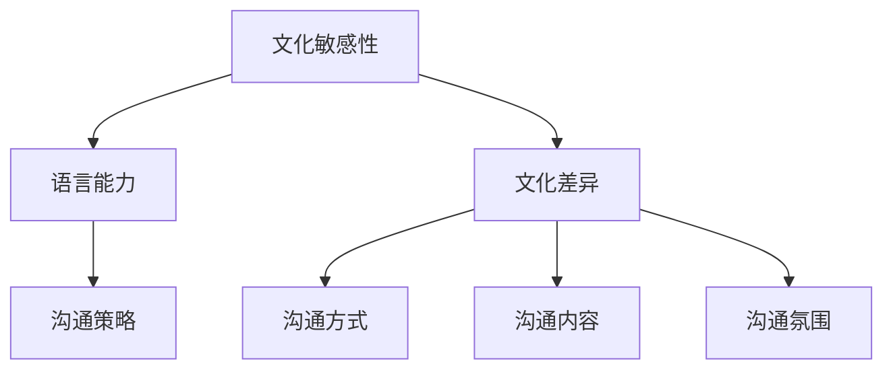

                 

## 跨文化沟通技巧：增进多元化团队理解的方法

### 关键词：
- 跨文化沟通
- 多元化团队
- 沟通技巧
- 文化敏感性
- 冲突管理

### 摘要：
随着全球化的发展，跨文化沟通成为了现代团队工作中的关键要素。本文将探讨跨文化沟通的基本概念、核心技巧以及实践指南，旨在帮助团队成员更好地理解不同文化背景，提高跨文化沟通能力，以促进多元化团队的合作与发展。

### 文章目录

#### 第一部分：理解跨文化沟通的基本概念

##### 第1章：跨文化沟通的定义与重要性
- 跨文化沟通的定义
- 跨文化沟通的重要性
- 跨文化沟通的主要挑战

##### 第2章：文化差异与跨文化沟通
- 文化差异的类型
- 文化差异对沟通的影响
- 跨文化沟通的关键要素

##### 第3章：跨文化沟通的核心概念和联系
- 跨文化沟通的Mermaid流程图
- 核心概念的联系与解释
- 实例分析：不同文化背景下的沟通策略

#### 第二部分：跨文化沟通技巧

##### 第4章：提高跨文化沟通能力的策略
- 文化敏感性培训
- 语言技能的提升
- 沟通技巧的实践

##### 第5章：跨文化团队协作
- 多元化团队的优势与挑战
- 建立有效的团队沟通机制
- 团队成员间的相互理解和尊重

##### 第6章：跨文化沟通中的冲突管理
- 冲突的类型与原因
- 冲突管理的策略
- 实例：跨文化冲突的解决方法

##### 第7章：跨文化沟通案例分析
- 成功的跨文化沟通案例
- 失败的跨文化沟通案例
- 启示与经验总结

#### 第三部分：实践中的跨文化沟通技巧

##### 第8章：跨文化沟通实战指南
- 跨文化沟通计划与准备
- 沟通过程中的要点
- 沟通后的反馈与评估

##### 附录：跨文化沟通资源与工具
- 常用的跨文化沟通工具
- 推荐的跨文化沟通书籍与文章
- 跨文化沟通网络资源

---

### 第一部分：理解跨文化沟通的基本概念

#### 第1章：跨文化沟通的定义与重要性

##### 1.1 跨文化沟通的定义

跨文化沟通是指在不同文化背景下进行的沟通活动，涉及文化差异、语言障碍和不同社会习俗等方面。它不仅仅是语言上的差异，还包括了行为、价值观、思维方式等多方面的差异。

##### 1.2 跨文化沟通的重要性

跨文化沟通在全球化背景下变得尤为重要。以下是一些关键点：

- **促进合作与发展**：跨文化沟通可以帮助团队成员更好地理解彼此，减少误解，提高工作效率和团队凝聚力。
- **提升竞争力**：在国际化的市场中，具备跨文化沟通能力的企业更能适应多样化的客户需求，提高市场竞争力。
- **降低风险**：有效的跨文化沟通可以减少误解和冲突，降低项目失败的风险。

##### 1.3 跨文化沟通的主要挑战

- **语言障碍**：语言不同可能导致沟通不畅，甚至产生误解。
- **文化差异**：不同的文化背景可能导致价值观和行为方式的差异，影响沟通效果。
- **沟通方式**：不同的文化可能对沟通方式有不同的偏好，如直接与间接沟通。

---

#### 第2章：文化差异与跨文化沟通

##### 2.1 文化差异的类型

文化差异可以分为以下几类：

- **语言差异**：包括语言结构、发音、语法和词汇等方面的差异。
- **社会习俗**：如问候方式、饮食习惯、礼仪和节日庆祝等。
- **价值观**：包括个人主义与集体主义、权力距离、不确定性规避等。

##### 2.2 文化差异对沟通的影响

文化差异会影响沟通的各个方面，包括：

- **沟通方式**：直接与间接沟通、正式与非正式沟通等。
- **沟通内容**：对信息的表达和接收方式可能有所不同。
- **沟通氛围**：文化差异可能导致沟通氛围的不同，影响沟通效果。

##### 2.3 跨文化沟通的关键要素

为了有效进行跨文化沟通，需要关注以下关键要素：

- **文化敏感性**：了解不同文化的特点，尊重文化差异。
- **语言能力**：提高语言沟通能力，减少语言障碍。
- **沟通策略**：根据不同文化背景调整沟通方式，提高沟通效果。

---

#### 第3章：跨文化沟通的核心概念和联系

##### 3.1 跨文化沟通的Mermaid流程图

为了更好地理解跨文化沟通的核心概念和联系，我们可以使用Mermaid流程图来表示：

##### 3.2 核心概念的联系与解释

- **文化敏感性**：了解不同文化的特点，尊重文化差异，是跨文化沟通的基础。
- **语言能力**：提高语言沟通能力，减少语言障碍，有助于更准确地表达和接收信息。
- **沟通策略**：根据不同文化背景调整沟通方式，提高沟通效果。

这些核心概念相互联系，共同构成了跨文化沟通的理论基础。

##### 3.3 实例分析：不同文化背景下的沟通策略

以下是一个实例分析，说明在不同文化背景下的沟通策略：

- **美国与中国的跨文化沟通**：
  - **文化敏感性**：了解中美文化差异，尊重对方的文化习俗和价值观。
  - **语言能力**：提高英语和汉语的沟通能力，减少语言障碍。
  - **沟通策略**：美国文化偏好直接沟通，而中国文化偏好间接沟通。因此，在与美国合作伙伴沟通时，应采取更加直接的方式；在与中国合作伙伴沟通时，应采取更加间接的方式。

通过这个实例，我们可以看到跨文化沟通的关键要素如何在不同文化背景下发挥作用。

---

### 第二部分：跨文化沟通技巧

#### 第4章：提高跨文化沟通能力的策略

##### 4.1 文化敏感性培训

文化敏感性培训是提高跨文化沟通能力的重要手段。以下是一些关键点：

- **了解文化差异**：学习不同文化的价值观、社会习俗和行为规范。
- **增强文化意识**：培养尊重和理解不同文化的态度。
- **案例分析**：通过案例分析，了解文化差异对沟通的影响。

##### 4.2 语言技能的提升

语言技能的提升是跨文化沟通的关键。以下是一些方法：

- **语言学习**：参加语言课程，提高语言能力。
- **实践交流**：通过与来自不同文化背景的人进行实践交流，提高语言应用能力。
- **跨文化语言资源**：利用跨文化语言资源，如在线课程、语言学习软件和在线交流平台。

##### 4.3 沟通技巧的实践

沟通技巧的实践是提高跨文化沟通能力的重要环节。以下是一些技巧：

- **倾听**：倾听对方的话语，理解对方的观点。
- **提问**：通过提问，澄清对方的意图，减少误解。
- **反馈**：及时给予反馈，确认沟通的效果。

---

#### 第5章：跨文化团队协作

##### 5.1 多元化团队的优势与挑战

多元化团队具有以下优势：

- **创新性**：团队成员来自不同文化背景，有助于带来新的观点和想法。
- **适应力**：多元化团队更能适应多样化的市场和客户需求。

然而，多元化团队也面临以下挑战：

- **沟通障碍**：文化差异可能导致沟通不畅。
- **冲突**：不同文化背景可能导致价值观和行为方式的冲突。

##### 5.2 建立有效的团队沟通机制

为了应对多元化团队的优势与挑战，需要建立有效的团队沟通机制：

- **建立共同的价值观**：通过共同的价值观，减少文化差异带来的冲突。
- **明确沟通目标**：确保团队成员了解沟通的目标和期望。
- **定期沟通会议**：定期举行沟通会议，促进团队成员之间的交流。

##### 5.3 团队成员间的相互理解和尊重

团队成员间的相互理解和尊重是多元化团队协作的关键。以下是一些方法：

- **文化培训**：组织文化培训，提高团队成员对文化差异的理解和尊重。
- **跨文化交流**：鼓励团队成员进行跨文化交流，增进相互了解。
- **尊重差异**：尊重不同文化背景的价值观和行为方式，避免对他人进行歧视。

---

#### 第6章：跨文化沟通中的冲突管理

##### 6.1 冲突的类型与原因

跨文化沟通中的冲突可以分为以下几种类型：

- **价值观冲突**：由于不同的价值观导致的冲突。
- **行为冲突**：由于不同的行为规范和文化习惯导致的冲突。
- **沟通障碍冲突**：由于沟通不畅导致的冲突。

冲突的原因包括：

- **文化差异**：不同的文化背景可能导致对同一问题的理解不同。
- **沟通不畅**：信息传递不畅可能导致误解和冲突。

##### 6.2 冲突管理的策略

为了有效管理跨文化沟通中的冲突，可以采取以下策略：

- **主动沟通**：及时沟通，主动解决问题。
- **理解对方**：尽量理解对方的观点和立场。
- **寻求共识**：通过协商，寻求双方都能接受的解决方案。
- **尊重差异**：尊重不同文化的差异，避免对他人进行指责。

##### 6.3 实例：跨文化冲突的解决方法

以下是一个跨文化冲突的解决方法实例：

- **美国与中国的项目团队冲突**：
  - **冲突原因**：美国团队倾向于直接沟通，而中国团队更倾向于间接沟通，导致沟通不畅。
  - **解决方法**：
    - **主动沟通**：双方团队主动沟通，明确沟通目标和期望。
    - **理解对方**：了解对方的沟通习惯和价值观，尊重差异。
    - **寻求共识**：通过协商，找到双方都能接受的沟通方式。

通过这个实例，我们可以看到如何在跨文化沟通中管理冲突，实现有效沟通。

---

#### 第7章：跨文化沟通案例分析

##### 7.1 成功的跨文化沟通案例

以下是一个成功的跨文化沟通案例：

- **跨国企业并购**：
  - **背景**：一家美国企业与一家法国企业进行并购。
  - **沟通策略**：
    - **文化敏感性培训**：对双方团队成员进行文化敏感性培训，提高跨文化沟通能力。
    - **共同价值观**：建立共同的价值观，减少文化差异带来的冲突。
    - **定期沟通会议**：定期举行沟通会议，促进团队成员之间的交流。

这个案例展示了如何在跨文化并购中，通过有效的跨文化沟通策略，实现团队协作和项目成功。

##### 7.2 失败的跨文化沟通案例

以下是一个失败的跨文化沟通案例：

- **国际项目合作**：
  - **背景**：一家中国公司与一家印度公司合作开展国际项目。
  - **沟通问题**：
    - **沟通不畅**：由于语言和文化差异，导致沟通不畅，项目进度延误。
    - **冲突**：双方对项目目标的理解不一致，导致冲突加剧。

这个案例提醒我们，在跨文化合作中，沟通不畅和冲突管理不当可能导致项目失败。

##### 7.3 启示与经验总结

从成功和失败的跨文化沟通案例中，我们可以得出以下启示和经验总结：

- **重视文化敏感性培训**：提高团队成员的跨文化沟通能力，减少误解和冲突。
- **建立共同价值观**：通过共同价值观，减少文化差异带来的冲突。
- **定期沟通会议**：定期沟通，促进团队成员之间的交流和理解。
- **冲突管理策略**：采取有效的冲突管理策略，及时解决冲突。

---

#### 第8章：跨文化沟通实战指南

##### 8.1 跨文化沟通计划与准备

在进行跨文化沟通之前，需要进行充分的计划和准备：

- **了解文化差异**：了解对方的文化背景和价值观，避免因文化差异导致的误解。
- **制定沟通策略**：根据文化差异，制定相应的沟通策略，提高沟通效果。
- **准备沟通材料**：准备相关的沟通材料，如翻译文档、文化指南等。

##### 8.2 沟通过程中的要点

在跨文化沟通过程中，需要注意以下要点：

- **倾听**：倾听对方的观点，理解对方的意图。
- **提问**：通过提问，澄清对方的意图，减少误解。
- **尊重差异**：尊重不同的文化差异，避免对他人进行指责。
- **反馈**：及时给予反馈，确认沟通的效果。

##### 8.3 沟通后的反馈与评估

沟通结束后，需要进行反馈和评估：

- **收集反馈**：收集团队成员的反馈意见，了解沟通的效果。
- **评估沟通策略**：根据反馈，评估沟通策略的有效性，进行改进。
- **持续优化**：持续优化跨文化沟通策略，提高沟通效果。

---

##### 附录：跨文化沟通资源与工具

以下是一些跨文化沟通的资源和工具：

- **跨文化沟通书籍**：《跨文化沟通技巧》、《沟通的艺术》等。
- **在线课程**：Coursera、Udemy等平台上的跨文化沟通课程。
- **文化指南**：国际组织和文化协会提供的文化指南。
- **在线交流平台**：LinkedIn、Twitter等社交媒体平台。

---

### 结论

跨文化沟通是现代团队工作中的关键要素。通过提高跨文化沟通能力，团队成员可以更好地理解不同文化背景，减少误解和冲突，促进多元化团队的合作与发展。本文提供了跨文化沟通的基本概念、核心技巧和实践指南，旨在帮助读者在跨文化沟通中取得成功。

---

### 作者信息

作者：AI天才研究院/AI Genius Institute & 禅与计算机程序设计艺术 /Zen And The Art of Computer Programming

