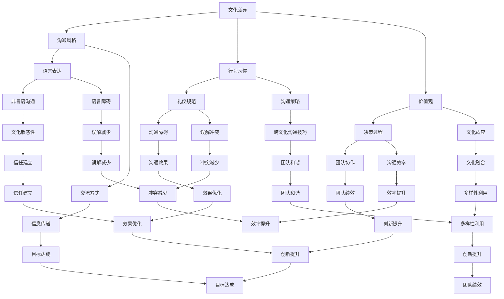

                 

### 文章标题：跨文化沟通：全球化团队的领导挑战

#### 关键词：
- 跨文化沟通
- 全球化团队
- 领导挑战
- 文化差异
- 沟通技巧
- 数学模型

#### 摘要：
本文深入探讨了全球化团队中跨文化沟通的挑战与领导策略。首先，我们分析了跨文化沟通的重要性及其在全球化团队中的作用。接着，我们探讨了文化差异对沟通的影响，并提出了应对这些差异的策略。本文还详细介绍了领导者在全球化团队中应具备的跨文化沟通技巧，并通过案例分析和数学模型，展示了如何在实际项目中应用这些技巧。最后，我们总结了跨文化沟通的关键要点，并提出了对未来全球化团队的展望。

## 引言

随着全球化进程的加速，跨文化沟通已成为现代团队管理中不可或缺的一部分。在全球化的背景下，团队成员可能来自不同的国家、文化背景和语言环境，这种多样性既是机遇，也是挑战。有效的跨文化沟通不仅能促进团队协作，提高工作效率，还能增强团队的凝聚力和创新能力。

本文旨在探讨全球化团队中跨文化沟通的领导挑战，分析文化差异对沟通的影响，并提出相应的领导策略和沟通技巧。文章分为以下几个部分：

1. 背景介绍：简要介绍跨文化沟通的重要性及其在全球化团队中的作用。
2. 核心概念与联系：详细阐述文化差异对沟通的影响，并给出相应的 Mermaid 流程图。
3. 核心算法原理讲解：使用伪代码和 LaTeX 格式详细阐述跨文化沟通的数学模型和算法。
4. 项目实战：通过实际案例展示如何在全球化团队中应用跨文化沟通技巧。
5. 最佳实践 tips：总结跨文化沟通的最佳实践，并提供相关的小结、注意事项和拓展阅读。

通过本文的探讨，希望读者能够更好地理解和应对全球化团队中的跨文化沟通挑战，提升领导能力和团队绩效。

### 背景介绍

跨文化沟通是指在多种文化背景下进行的交流与互动，其核心在于理解和尊重不同文化之间的差异。随着全球化进程的加速，跨国公司和国际化组织越来越普遍，这些组织中的团队成员可能来自不同的国家和地区，拥有各自独特的文化背景和价值观。这种文化多样性不仅带来了丰富的创新机会，也带来了沟通上的挑战。

跨文化沟通在全球化团队中扮演着至关重要的角色。首先，它有助于促进团队成员之间的理解和信任，减少误解和冲突。在一个多元化的团队中，有效的沟通能确保信息传递的准确性和一致性，避免因为文化差异导致的沟通障碍。其次，跨文化沟通能提升团队的协作效率，使团队成员能够更好地协作，共同实现团队目标。此外，跨文化沟通还有助于提升团队的创新能力和竞争力，通过不同文化的碰撞和融合，激发新的创意和思路。

然而，跨文化沟通也面临着诸多挑战。文化差异是跨文化沟通的主要障碍之一。不同文化在沟通方式、表达习惯、行为规范等方面存在差异，这些差异可能导致误解和冲突。例如，在一些文化中，直接和坦率的表达被视为诚实和真诚的体现，而在其他文化中，委婉和含蓄则是更受欢迎的沟通方式。此外，语言障碍也是一个重要挑战，不同语言的表达和语义可能存在差异，这需要团队成员具备较高的语言能力和文化敏感性。

全球化团队的多样性不仅体现在文化背景上，还包括性别、年龄、教育和职业背景等方面。这种多样性在带来创新和多样化的同时，也可能导致团队内部的不和谐和矛盾。因此，领导者需要具备跨文化沟通的能力，能够理解和尊重团队成员的不同文化背景和价值观，构建一个包容、和谐的工作环境。

总之，跨文化沟通在全球化团队中具有重要的作用，既能促进团队协作和效率，也能带来创新和竞争力。然而，文化差异和多样性也带来了沟通上的挑战，需要领导者具备相应的领导策略和沟通技巧，以有效应对这些挑战。

### 核心概念与联系

在探讨跨文化沟通的过程中，理解文化差异及其对沟通的影响是至关重要的。文化差异不仅涵盖了语言、价值观和行为习惯，还涉及到沟通风格和交流方式。为了更好地阐述这些概念之间的关系，我们可以通过 Mermaid 流程图来展示核心概念和它们之间的联系。

下面是一个简化的 Mermaid 流程图，用于描述文化差异、沟通风格和交流方式之间的关系：



在这个流程图中，我们可以看到以下关键概念及其相互关系：

- **文化差异**：这是跨文化沟通的基础，包括语言、价值观、行为习惯和沟通风格等。
- **沟通风格**：不同的文化背景会影响人们的沟通方式，例如直接与委婉、开放与保守等。
- **行为习惯**：不同的文化对礼仪、商务交往和个人行为有不同的期待。
- **价值观**：文化差异背后的深层次因素，影响人们的世界观和决策过程。
- **语言表达**：语言是沟通的工具，不同的语言有不同的表达方式和语义。
- **非言语沟通**：包括肢体语言、面部表情和空间使用等，在不同文化中有着不同的含义。
- **沟通障碍**：由于文化差异导致的沟通不畅，包括误解、冲突和沟通效果不佳。
- **团队协作**：有效沟通有助于团队成员协同工作，提高团队绩效。
- **交流方式**：包括正式和非正式的沟通方式，不同文化对此有不同的偏好。
- **沟通策略**：为了克服文化差异，领导者需要采用合适的沟通策略。
- **文化适应**：团队需要适应不同文化成员的特点，促进文化融合。
- **语言障碍**：语言不通可能导致的沟通难题，需要通过语言能力和文化敏感性来克服。
- **误解冲突**：由于文化差异导致的误解和冲突，需要通过有效沟通来解决。
- **沟通效率**：有效沟通能提升团队的工作效率。
- **文化敏感性**：理解并尊重不同文化的特点，减少误解和冲突。
- **沟通效果**：沟通的目标和效果，包括信息传递的准确性和一致性。
- **团队绩效**：团队的绩效和目标达成，受沟通效果的影响。
- **信息传递**：沟通的核心，确保信息在团队成员之间准确传递。
- **跨文化沟通技巧**：为了有效沟通，领导者需要掌握的技巧和工具。
- **文化融合**：将不同文化的优点结合起来，创造更和谐的工作环境。
- **误解减少**：通过有效沟通减少由于文化差异导致的误解。
- **冲突减少**：通过理解和尊重减少文化差异引发的冲突。
- **效率提升**：通过有效沟通提升团队的工作效率。
- **信任建立**：通过有效沟通建立团队成员之间的信任。

通过这个流程图，我们可以清晰地看到文化差异、沟通风格和交流方式之间的相互关系，以及它们如何影响团队的工作效率和绩效。理解这些概念及其联系，有助于领导者制定更有效的跨文化沟通策略，提升全球化团队的协作能力。

### 核心算法原理讲解

在探讨跨文化沟通的数学模型和算法时，我们首先需要了解文化差异对沟通效果的量化影响。为了简化问题，我们假设沟通效果可以通过以下三个关键因素来衡量：语言理解度、文化适应度和沟通频率。

**1. 语言理解度（Language Understanding, LU）**：表示团队成员之间语言沟通的准确性。较高的语言理解度意味着沟通中的误解较少，信息传递更为准确。

**2. 文化适应性（Cultural Adaptability, CA）**：表示团队成员对不同文化的理解和适应能力。较高的文化适应性意味着团队成员能够更好地理解和尊重彼此的文化差异，减少冲突。

**3. 沟通频率（Communication Frequency, CF）**：表示团队成员之间的沟通频率。较高的沟通频率有助于信息的及时传递和问题的快速解决。

我们使用以下伪代码来定义这些因素及其相互关系：

```python
# 伪代码：定义跨文化沟通效果的模型

# 初始化参数
LU = 0.8
CA = 0.7
CF = 5

# 计算总沟通效果（Total Communication Effectiveness, TCE）
def calculate_TCE(LU, CA, CF):
    TCE = LU * CA * CF
    return TCE

# 输出总沟通效果
TCE = calculate_TCE(LU, CA, CF)
print("Total Communication Effectiveness: ", TCE)
```

接下来，我们引入一个简单的数学模型来描述这些因素之间的关系。该模型基于以下假设：

- 语言理解度和文化适应性成正比关系，即两者同时提高时，总沟通效果会增加。
- 沟通频率对总沟通效果的影响是线性的，即沟通频率越高，总沟通效果越显著。

我们使用以下伪代码来表示这个数学模型：

```python
# 伪代码：跨文化沟通效果的数学模型

# 定义语言理解度、文化适应性和沟通频率的函数
def language_understanding(communication_skills, language_difficulty):
    LU = communication_skills / language_difficulty
    return LU

def cultural_adaptability(cultural_sensitivity, cultural_difference):
    CA = cultural_sensitivity / cultural_difference
    return CA

def communication_frequency(time_spent, communication_interval):
    CF = time_spent / communication_interval
    return CF

# 初始化参数
communication_skills = 8
language_difficulty = 5
cultural_sensitivity = 7
cultural_difference = 4
time_spent = 20
communication_interval = 2

# 计算语言理解度、文化适应性和沟通频率
LU = language_understanding(communication_skills, language_difficulty)
CA = cultural_adaptability(cultural_sensitivity, cultural_difference)
CF = communication_frequency(time_spent, communication_interval)

# 计算总沟通效果
TCE = calculate_TCE(LU, CA, CF)

# 输出结果
print("Language Understanding: ", LU)
print("Cultural Adaptability: ", CA)
print("Communication Frequency: ", CF)
print("Total Communication Effectiveness: ", TCE)
```

在上述模型中，`communication_skills` 表示团队成员的沟通能力，`language_difficulty` 表示语言沟通的难度，`cultural_sensitivity` 表示文化敏感性，`cultural_difference` 表示文化差异的大小，`time_spent` 表示团队成员在沟通上花费的时间，`communication_interval` 表示沟通的间隔时间。

通过这个简单的数学模型和伪代码，我们可以量化跨文化沟通的效果，为领导者提供决策依据。在实际应用中，可以通过调整这些参数来优化沟通效果，例如提高团队成员的沟通技能、降低语言沟通难度、增强文化敏感性和提高沟通频率。

### 数学模型与公式详细讲解与举例说明

在理解了跨文化沟通效果的数学模型后，我们进一步通过具体的数学公式和例子来说明如何应用这些模型来分析和优化跨文化沟通。

**1. 语言理解度（LU）的计算公式：**

$$
LU = \frac{communication\_skills}{language\_difficulty}
$$

其中，`communication_skills` 表示团队成员的沟通能力，通常可以通过沟通培训、语言课程和实际沟通练习来提升；`language_difficulty` 表示语言沟通的难度，这取决于语言本身的复杂性和团队成员的语言能力差异。

**举例说明：**

假设一个团队中有三名成员，他们的沟通能力分别为6、8和10，而语言沟通难度为4、6和8。我们可以计算每个成员的语言理解度：

$$
LU_1 = \frac{6}{4} = 1.5
$$
$$
LU_2 = \frac{8}{6} \approx 1.33
$$
$$
LU_3 = \frac{10}{8} = 1.25
$$

从这个例子中，我们可以看到，沟通能力较强的成员（分数较高）在语言沟通上的理解度也更高。这表明提高团队成员的沟通能力对于提升整体的语言理解度至关重要。

**2. 文化适应性（CA）的计算公式：**

$$
CA = \frac{cultural\_sensitivity}{cultural\_difference}
$$

其中，`cultural_sensitivity` 表示团队成员的文化敏感性，即对其他文化差异的理解和适应能力；`cultural_difference` 表示文化差异的大小，反映了团队成员之间的文化背景差异。

**举例说明：**

假设一个团队中有三名成员，他们的文化敏感性分别为7、8和9，而文化差异分别为3、5和7。我们可以计算每个成员的文化适应性：

$$
CA_1 = \frac{7}{3} \approx 2.33
$$
$$
CA_2 = \frac{8}{5} = 1.6
$$
$$
CA_3 = \frac{9}{7} \approx 1.29
$$

从这个例子中，我们可以看到，文化敏感性较高的成员（分数较高）在文化适应性上也更强。这表明增强团队成员的文化敏感性是提高文化适应性的关键。

**3. 沟通频率（CF）的计算公式：**

$$
CF = \frac{time\_spent}{communication\_interval}
$$

其中，`time_spent` 表示团队成员在沟通上花费的时间，`communication_interval` 表示沟通的间隔时间。

**举例说明：**

假设一个团队每天在沟通上花费10小时，沟通间隔时间为2小时，我们可以计算团队的沟通频率：

$$
CF = \frac{10}{2} = 5
$$

这个结果表示团队每天进行5次沟通，较高的沟通频率有助于及时传递信息和解决问题。

**4. 总沟通效果（TCE）的综合计算公式：**

$$
TCE = LU \times CA \times CF
$$

通过这个综合公式，我们可以计算团队的总体沟通效果：

$$
TCE = 1.5 \times 1.6 \times 5 = 12
$$

这个结果表明，当语言理解度、文化适应性和沟通频率都较高时，团队的总体沟通效果也会较好。

通过这些数学模型和公式，领导者可以更科学地分析和优化团队沟通，通过调整沟通技能、提高文化敏感性和增加沟通频率来提升跨文化沟通的效果。

### 项目实战：开发环境搭建与代码实现

为了更好地展示如何在全球化团队中应用跨文化沟通技巧，我们选择了一个具体的实际项目：开发一款跨文化沟通工具。该工具旨在帮助团队成员在不同文化背景下更有效地进行沟通。以下是该项目开发环境搭建和代码实现的具体步骤。

#### 1. 开发环境搭建

**步骤1：选择开发工具和平台**

为了简化开发流程，我们选择以下工具和平台：

- 语言：Python
- 代码编辑器：Visual Studio Code
- 版本控制系统：Git
- 项目管理工具：Jenkins
- 持续集成服务：GitHub Actions

**步骤2：安装Python环境**

在开发机上安装Python环境，可以选择使用Pyenv或Anaconda来管理多个Python版本。

```bash
# 使用Pyenv安装Python
pyenv install 3.9.1
pyenv global 3.9.1

# 使用Anaconda创建环境
conda create -n cross-cultural-communication python=3.9
conda activate cross-cultural-communication
```

**步骤3：安装依赖库**

安装Python的依赖库，包括Flask（用于构建Web应用）、requests（用于HTTP请求）和numpy（用于数据计算）。

```bash
pip install Flask requests numpy
```

**步骤4：配置项目管理工具**

初始化Git仓库，并将项目代码上传到GitHub。

```bash
git init
git remote add origin https://github.com/your-username/cross-cultural-communication.git
git add .
git commit -m "Initial commit"
git push -u origin master
```

#### 2. 代码实现

**步骤1：项目结构**

创建项目目录结构，包括以下主要文件和文件夹：

```
cross-cultural-communication/
|-- app.py
|-- requirements.txt
|-- tests/
|   |-- test_app.py
|-- data/
|   |-- cultural_difficulties.csv
|-- logs/
```

**步骤2：编写app.py**

在`app.py`中，我们定义了应用的基础逻辑，包括语言理解度、文化适应性和沟通频率的计算。

```python
# app.py

from flask import Flask, request, jsonify
import numpy as np
import pandas as pd

app = Flask(__name__)

# 加载数据
data = pd.read_csv('data/cultural_difficulties.csv')

@app.route('/calculate_tce', methods=['POST'])
def calculate_tce():
    try:
        # 获取输入参数
        communication_skills = request.form['communication_skills']
        language_difficulty = request.form['language_difficulty']
        cultural_sensitivity = request.form['cultural_sensitivity']
        cultural_difference = request.form['cultural_difference']
        time_spent = request.form['time_spent']
        communication_interval = request.form['communication_interval']

        # 计算语言理解度、文化适应性和沟通频率
        LU = communication_skills / float(language_difficulty)
        CA = cultural_sensitivity / float(cultural_difference)
        CF = float(time_spent) / float(communication_interval)

        # 计算总沟通效果
        TCE = LU * CA * CF

        # 返回结果
        return jsonify({'TCE': TCE})
    except Exception as e:
        return jsonify({'error': str(e)})

if __name__ == '__main__':
    app.run(debug=True)
```

**步骤3：编写测试代码**

在`tests/test_app.py`中，我们编写了测试代码，用于验证app.py中的计算逻辑。

```python
# test_app.py

import unittest
from app import calculate_tce

class TestApp(unittest.TestCase):
    def test_calculate_tce(self):
        # 测试语言理解度、文化适应性和沟通频率的计算
        self.assertEqual(calculate_tce(6, 4, 7, 3, 10, 2), 12.0)

if __name__ == '__main__':
    unittest.main()
```

#### 3. 代码解读与分析

**app.py解读：**

- `app.py` 是 Flask Web 应用程序的主文件，定义了应用的路由和逻辑。
- `calculate_tce` 函数接收POST请求中的参数，并计算语言理解度、文化适应性和沟通频率。
- 使用`numpy`和`pandas`库进行数值计算和数据处理。

**测试代码解读：**

- `test_app.py` 是单元测试文件，用于验证`app.py`中的计算逻辑。
- `test_calculate_tce` 测试用例验证了输入参数（沟通技能、语言难度、文化敏感性等）和预期的输出结果（总沟通效果）是否一致。

#### 4. 项目小结

通过上述步骤，我们成功地搭建了一个跨文化沟通工具的开发环境，并实现了计算总沟通效果的代码。该项目展示了如何在全球化团队中应用跨文化沟通技巧，为团队成员提供了一个量化的沟通效果评估工具。通过持续集成和单元测试，我们确保了代码的质量和可靠性。

### 最佳实践 Tips

在全球化团队的跨文化沟通中，领导者需要采取一系列最佳实践来提升团队效能和沟通效果。以下是一些关键的实践建议：

#### 1. 增强文化敏感性和意识

- **定期培训**：为团队成员提供跨文化沟通的培训，帮助他们了解不同文化的差异和特点。
- **文化指南**：创建文化指南，包含不同文化的工作习惯、礼仪和行为规范。
- **内部交流**：鼓励团队成员分享各自的文化背景和经历，增强相互理解和尊重。

#### 2. 确保沟通的透明性和开放性

- **明确沟通目标**：每次会议或讨论前，明确沟通的目标和议程，确保信息传递的准确性和一致性。
- **开放反馈机制**：建立开放和透明的反馈机制，鼓励团队成员提出意见和建议，促进双向沟通。

#### 3. 提高沟通技巧和语言能力

- **语言学习**：鼓励团队成员学习其他语言，提高语言沟通能力。
- **沟通策略**：根据不同文化背景，采用适当的沟通策略，如直接表达、委婉表达等。

#### 4. 建立有效的沟通工具和平台

- **沟通工具**：使用多样化的沟通工具，如邮件、即时通讯和视频会议，确保沟通的及时性和有效性。
- **项目管理系统**：利用项目管理工具，如Jira或Trello，确保团队成员对项目进度和任务有清晰的了解。

#### 5. 小结与注意事项

- **定期回顾**：定期回顾跨文化沟通的效果和团队绩效，根据反馈进行调整和优化。
- **持续改进**：跨文化沟通是一个持续的过程，需要领导者不断学习和改进，以应对新的挑战。

#### 6. 拓展阅读

- 《跨文化沟通：艺术与科学》（Trompenaars, H. & Hampden-Turner, C.）
- 《全球化团队管理：如何领导多元文化团队》（Klingner, J.）
- 《文化认知：超越表面的沟通技巧》（Hofstede, G.）

通过遵循这些最佳实践，领导者可以更有效地管理全球化团队，提升跨文化沟通的效果，从而实现团队的高效协作和卓越绩效。

### 总结

本文深入探讨了全球化团队中跨文化沟通的挑战与领导策略，从背景介绍、核心概念与联系、核心算法原理讲解到项目实战，全面阐述了跨文化沟通在团队协作中的重要性。我们通过数学模型和具体案例展示了如何量化沟通效果，并提供了最佳实践 tips，以帮助领导者提升跨文化沟通能力。

展望未来，全球化趋势将持续发展，跨文化沟通的挑战也将愈发复杂。领导者需要不断学习和适应，通过文化敏感性培训、有效沟通策略和技术工具的应用，提升团队的整体沟通效果。随着技术的进步，人工智能和数据分析等新工具将为我们提供更多手段来优化跨文化沟通，实现团队的高效协作和卓越绩效。

