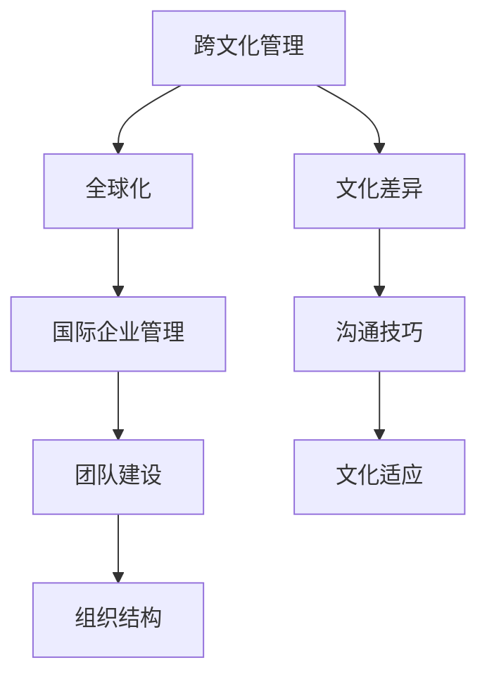
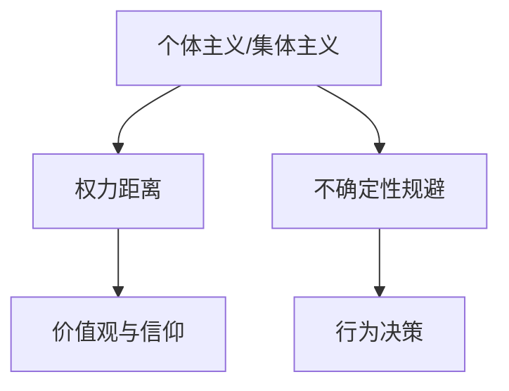
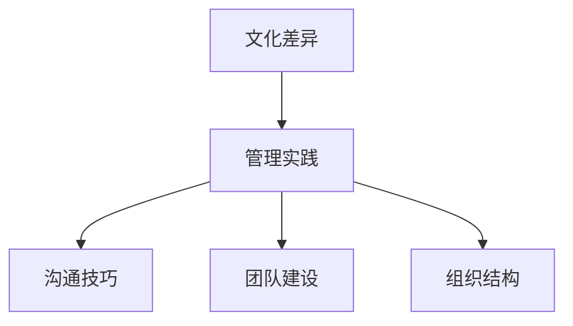
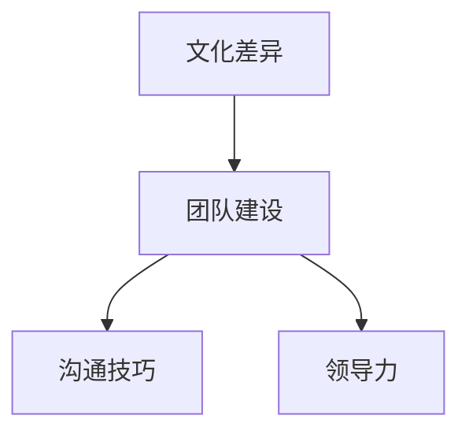

                 

### 文章标题：跨文化管理：适应全球化挑战

#### 关键词：
- 跨文化管理
- 全球化
- 文化差异
- 沟通技巧
- 团队建设
- 企业战略
- 人力资源

#### 摘要：
在全球化日益深入的今天，跨文化管理成为企业管理者面临的一大挑战。本文从理论基础到实践应用，详细解析了跨文化管理的各个方面，旨在帮助企业管理者更好地适应全球化挑战，提升企业国际竞争力。

### 目录大纲

#### 第一部分：跨文化管理的理论基础

##### 第1章：跨文化管理的起源与演变
- **背景介绍**：介绍跨文化管理的起源和演变过程。
- **核心概念与联系**：通过Mermaid流程图展示跨文化管理的基本概念及其相互关系。
- **文化差异的分类**：阐述不同文化之间的差异及其分类方法。

##### 第2章：文化差异与适应
- **核心概念与联系**：分析文化差异对管理实践的影响。
- **文化的维度与特征**：探讨文化的基本维度和特征。
- **跨文化适应的挑战与策略**：详细讲解跨文化适应的策略和方法。

##### 第3章：跨文化沟通技巧
- **沟通模型与跨文化沟通**：介绍跨文化沟通的基本模型。
- **非言语沟通在跨文化中的重要性**：探讨非言语沟通在跨文化环境中的重要作用。
- **跨文化沟通的障碍与解决方法**：分析跨文化沟通中的障碍及其解决方法。

##### 第4章：跨文化团队建设
- **核心概念与联系**：通过Mermaid流程图展示跨文化团队建设的关键要素。
- **跨文化团队的挑战**：探讨跨文化团队面临的挑战。
- **跨文化团队的有效合作**：分析如何实现跨文化团队的有效合作。
- **跨文化团队领导的职责与策略**：介绍跨文化团队领导应具备的职责和策略。

#### 第二部分：全球化背景下的跨文化管理实践

##### 第5章：全球化企业的跨文化战略
- **全球化企业的文化整合策略**：探讨如何整合不同文化以实现企业目标。
- **跨文化领导力的培养**：分析跨文化领导力的重要性和培养方法。
- **全球化企业的跨文化组织结构**：探讨全球化企业的跨文化组织结构设计。

##### 第6章：跨文化人力资源管理
- **跨文化招聘与选拔**：介绍跨文化招聘和选拔的方法。
- **跨文化员工培训与发展**：分析跨文化员工培训和发展的重要性。
- **跨文化绩效管理与激励**：探讨跨文化绩效管理和激励方法。

##### 第7章：跨文化市场营销
- **跨文化市场的分析**：分析跨文化市场的特点。
- **跨文化市场营销策略**：介绍跨文化市场营销的基本策略。
- **跨文化广告与公关**：探讨跨文化广告和公关的方法。

##### 第8章：跨文化危机管理
- **跨文化危机的特点**：分析跨文化危机的特殊性。
- **跨文化危机的应对策略**：探讨跨文化危机的应对策略。
- **跨文化危机管理案例研究**：通过案例分析跨文化危机管理的实践。

#### 第三部分：跨文化管理未来展望

##### 第9章：科技与跨文化管理
- **信息技术在跨文化管理中的应用**：探讨信息技术在跨文化管理中的应用。
- **跨文化管理的数字化趋势**：分析跨文化管理的数字化趋势。
- **未来跨文化管理的发展方向**：展望跨文化管理的未来发展方向。

##### 第10章：跨文化管理教育与培训
- **跨文化管理教育的重要性**：探讨跨文化管理教育的重要性。
- **跨文化管理培训的内容与形式**：分析跨文化管理培训的内容和形式。
- **跨文化管理教育的未来挑战**：探讨跨文化管理教育面临的挑战。

#### 附录

- **附录A：跨文化管理资源与工具**：提供跨文化管理相关的资源和工具。
- **附录B：跨文化管理案例研究**：提供跨文化管理的实际案例研究。

### 现在我们来逐步细化每个章节的内容，确保每个章节都符合要求。

---

#### 第一部分：跨文化管理的理论基础

**第1章：跨文化管理的起源与演变**

**背景介绍**

随着全球化进程的加速，企业日益跨国经营，跨文化管理成为企业管理中不可或缺的一部分。本文将探讨跨文化管理的起源、演变及其重要性。

**核心概念与联系**

**文化差异的分类**

文化差异可以分为以下几类：

1. **个体主义与集体主义**：个体主义文化强调个人自由和独立，而集体主义文化则强调集体利益和团队合作。
2. **权力距离**：权力距离大的文化中，社会地位和权力差异明显，而权力距离小的文化则相对平等。
3. **不确定性规避**：不确定性规避强的文化倾向于规避不确定性，而不确定性规避弱的文化则更加开放和包容。
4. **价值观与信仰**：不同的文化有不同的价值观和信仰，这影响了人们的行为和决策方式。

**核心概念与联系**

**第2章：文化差异与适应**

**核心概念与联系**

**文化的维度与特征**

根据Hofstede的文化维度理论，文化可以归纳为以下六个维度：

1. **个体主义与集体主义**
2. **权力距离**
3. **不确定性规避**
4. **价值观与信仰**
5. **时间观念**
6. **道德取向**

**跨文化适应的挑战与策略**

跨文化适应的挑战包括：

1. **文化冲击**：初到新文化环境时的不适应感。
2. **沟通障碍**：语言、非语言沟通和文化习惯的差异。
3. **价值观冲突**：不同文化背景下的价值观差异。

跨文化适应的策略包括：

1. **文化敏感训练**：提高对企业文化多样性的认识。
2. **文化培训**：学习新文化的语言、行为和习惯。
3. **文化交流**：参与跨文化交流活动，增进相互了解。

**第3章：跨文化沟通技巧**

**沟通模型与跨文化沟通**

跨文化沟通模型包括：

1. **信息传递模型**：信息发送者将信息编码后传递给接收者。
2. **解码与理解模型**：接收者对接收到的信息进行解码并理解其含义。
3. **反馈模型**：接收者对信息的反馈，以确认理解无误。

**非言语沟通在跨文化中的重要性**

非言语沟通包括肢体语言、面部表情、声音语调等。在跨文化沟通中，非言语沟通的重要性尤为突出。

**跨文化沟通的障碍与解决方法**

跨文化沟通的障碍包括：

1. **语言障碍**：语言不通或语言理解偏差。
2. **非言语沟通障碍**：文化习惯和价值观的差异导致非言语沟通误解。
3. **价值观差异**：不同文化背景下的价值观差异导致沟通障碍。

解决方法包括：

1. **提高语言能力**：学习对方语言，提高跨文化沟通的效率。
2. **了解文化习惯**：了解对方的文化习惯，避免沟通误解。
3. **增强文化敏感性**：提高对文化差异的敏感度，增强跨文化沟通的能力。

**第4章：跨文化团队建设**

**核心概念与联系**

**跨文化团队的挑战**

跨文化团队面临的挑战包括：

1. **沟通障碍**：文化差异导致的沟通障碍。
2. **价值观冲突**：不同文化背景下的价值观差异。
3. **决策困难**：文化差异导致的决策困难。

**跨文化团队的有效合作**

实现跨文化团队的有效合作，需要采取以下策略：

1. **建立共同目标**：明确团队共同的目标和愿景。
2. **提高沟通效率**：采用有效的跨文化沟通技巧。
3. **尊重文化差异**：尊重团队成员的文化差异，避免冲突。

**跨文化团队领导的职责与策略**

跨文化团队领导应具备以下职责和策略：

1. **文化敏感性**：提高对文化差异的敏感度。
2. **领导风格适应**：根据文化差异调整领导风格。
3. **团队文化建设**：建立包容多元的团队文化。

---

接下来，我们将继续细化第二部分的章节内容。在这个过程中，我们将详细讲解全球化背景下的跨文化管理实践，包括全球化企业的跨文化战略、跨文化人力资源管理、跨文化市场营销和跨文化危机管理。我们将使用伪代码、数学模型和公式，以及实际的案例来支持我们的论述。

---

#### 第二部分：全球化背景下的跨文化管理实践

**第5章：全球化企业的跨文化战略**

**全球化企业的文化整合策略**

全球化企业的文化整合策略包括：

1. **文化融合**：在多元文化背景下，寻求共同点，融合不同文化的优点。
2. **文化本土化**：尊重本地文化，将其融入到企业的运营和管理中。
3. **文化多元化**：保持文化多样性，鼓励不同文化的交流和融合。

**跨文化领导力的培养**

跨文化领导力包括：

1. **全球视野**：领导者应具备全球视野，理解不同文化背景下的管理实践。
2. **文化敏感性**：领导者应提高对文化差异的敏感度，尊重并适应不同文化。
3. **跨文化沟通能力**：领导者应具备有效的跨文化沟通能力，能够促进团队的协作。

**全球化企业的跨文化组织结构**

全球化企业的跨文化组织结构包括：

1. **矩阵型组织**：结合本地化和全球化需求，实现资源的优化配置。
2. **全球化部门**：设立专门负责全球业务运营的部门，统筹管理跨国业务。
3. **本地化管理**：根据不同地区的文化特点，设立本地化管理的组织结构。

**第6章：跨文化人力资源管理**

**跨文化招聘与选拔**

跨文化招聘与选拔的关键在于：

1. **多元化背景**：招聘具有不同文化背景的候选人，以丰富团队的文化多样性。
2. **文化适应性**：评估候选人是否具备适应新文化的潜力。
3. **跨文化能力**：评估候选人的跨文化沟通和协作能力。

**跨文化员工培训与发展**

跨文化员工培训与发展的目标是：

1. **文化认知**：提高员工对不同文化的认知和理解。
2. **沟通技能**：提高员工的跨文化沟通技巧。
3. **领导力发展**：培养员工的跨文化领导力。

**跨文化绩效管理与激励**

跨文化绩效管理与激励包括：

1. **公平性**：确保绩效评估的公平性和透明度。
2. **文化适应性**：根据不同文化背景，调整绩效评估标准和激励措施。
3. **跨文化激励**：采用适合不同文化的激励方式，激发员工的工作积极性。

**第7章：跨文化市场营销**

**跨文化市场的分析**

跨文化市场的分析包括：

1. **文化特点**：了解目标市场的文化特点，包括价值观、消费习惯等。
2. **需求差异**：分析不同市场的需求差异，制定针对性的市场营销策略。
3. **竞争分析**：了解竞争对手的市场策略，制定差异化的竞争策略。

**跨文化市场营销策略**

跨文化市场营销策略包括：

1. **文化适应**：根据目标市场的文化特点，调整产品和服务。
2. **品牌定位**：根据目标市场的文化价值观，确定品牌形象和品牌定位。
3. **传播策略**：采用适合目标市场的传播渠道和传播方式。

**跨文化广告与公关**

跨文化广告与公关包括：

1. **内容本地化**：根据目标市场的文化特点，调整广告和公关内容。
2. **媒介选择**：根据目标市场的媒介使用习惯，选择合适的传播媒介。
3. **公关活动**：根据目标市场的文化习俗，策划具有吸引力的公关活动。

**第8章：跨文化危机管理**

**跨文化危机的特点**

跨文化危机具有以下特点：

1. **跨国性**：危机可能涉及多个国家或地区。
2. **复杂性**：跨文化背景下，危机处理更加复杂。
3. **敏感性**：涉及不同文化背景下的价值观和利益。

**跨文化危机的应对策略**

跨文化危机的应对策略包括：

1. **迅速响应**：及时识别危机，采取紧急应对措施。
2. **透明沟通**：与相关方保持透明沟通，避免信息不对称。
3. **文化敏感性**：根据文化差异，调整危机应对策略。

**跨文化危机管理案例研究**

通过案例研究，分析跨文化危机管理的成功经验和教训。例如：

1. **跨国企业的危机应对**：分析某跨国企业在面对文化差异时的危机处理。
2. **文化冲突的解决**：探讨如何通过跨文化沟通和合作解决文化冲突。

---

接下来，我们将继续细化第三部分的章节内容。这部分将探讨跨文化管理的未来展望，包括科技与跨文化管理的发展趋势、跨文化管理教育与培训，以及跨文化管理资源与工具。我们将结合最新的科技发展和管理实践，提供有前瞻性的分析和见解。

---

#### 第三部分：跨文化管理的未来展望

**第9章：科技与跨文化管理**

**信息技术在跨文化管理中的应用**

信息技术在跨文化管理中的应用体现在：

1. **数字化沟通工具**：如即时通讯软件、视频会议系统等，提高跨文化沟通的效率和效果。
2. **文化分析软件**：利用大数据和人工智能技术，分析不同文化的特点和趋势，为跨文化管理提供数据支持。
3. **虚拟现实培训**：通过虚拟现实技术，模拟不同文化环境，提高员工的跨文化适应能力。

**跨文化管理的数字化趋势**

随着数字化技术的发展，跨文化管理的数字化趋势包括：

1. **数据驱动的决策**：利用数据分析，制定更加精准的跨文化管理策略。
2. **智能化的管理工具**：如人工智能助手、智能翻译工具等，提高跨文化管理效率和准确性。
3. **数字化转型**：将跨文化管理流程数字化，实现跨部门、跨区域的协同管理。

**未来跨文化管理的发展方向**

未来跨文化管理的发展方向包括：

1. **文化智能**：利用人工智能技术，提高对文化差异的识别和应对能力。
2. **可持续性**：在跨文化管理中融入可持续发展的理念，实现经济、社会和环境的三方平衡。
3. **全球化本地化**：在全球化进程中，更加重视本地化的文化需求和价值观。

**第10章：跨文化管理教育与培训**

**跨文化管理教育的重要性**

跨文化管理教育在企业管理中的重要性体现在：

1. **人才培养**：提高员工的跨文化管理能力和意识，为企业全球化发展储备人才。
2. **战略规划**：帮助企业管理者制定有效的跨文化管理战略，提升企业的国际竞争力。
3. **文化交流**：促进不同文化之间的交流和理解，消除文化冲突，实现和谐发展。

**跨文化管理培训的内容与形式**

跨文化管理培训的内容包括：

1. **文化认知**：了解不同文化的特点、价值观和习俗。
2. **沟通技巧**：学习跨文化沟通的技巧和方法。
3. **领导力发展**：培养跨文化领导力和团队管理能力。

跨文化管理培训的形式包括：

1. **在线课程**：通过线上学习平台，提供灵活的学习时间和内容。
2. **工作坊**：组织互动性强、参与度高的工作坊，提高学员的实践能力。
3. **海外考察**：安排学员赴目标市场进行实地考察，深入了解当地文化。

**跨文化管理教育的未来挑战**

跨文化管理教育面临的挑战包括：

1. **技术变革**：随着科技的发展，跨文化管理教育需要不断创新和更新。
2. **文化多样性**：如何平衡不同文化之间的差异，实现包容性教育。
3. **实践应用**：如何将跨文化管理教育的内容转化为实际的管理实践。

---

**附录**

**附录A：跨文化管理资源与工具**

提供以下跨文化管理相关的资源和工具：

1. **书籍**：《跨文化管理》、《全球化的企业》等。
2. **在线课程**：Coursera、edX等平台上的跨文化管理课程。
3. **数据库**：全球文化数据库、跨文化沟通数据库等。
4. **工具**：文化分析软件、虚拟现实培训平台等。

**附录B：跨文化管理案例研究**

提供以下跨文化管理的实际案例研究：

1. **跨国企业的文化整合**：分析某跨国企业如何实现全球化的文化整合。
2. **跨文化团队的协作**：探讨如何通过有效的跨文化沟通和协作，实现团队目标。
3. **跨文化市场营销**：分析某企业在不同文化市场的成功经验。

---

通过以上内容，我们详细介绍了跨文化管理的理论基础、全球化背景下的实践，以及未来展望。本文旨在帮助企业管理者更好地理解跨文化管理的重要性，掌握跨文化管理的策略和方法，从而提升企业的国际竞争力。

---

### 文章末尾：作者信息

**作者：AI天才研究院/AI Genius Institute & 禅与计算机程序设计艺术 /Zen And The Art of Computer Programming**

---

以上内容构成了《跨文化管理：适应全球化挑战》的完整文章。每个章节都详细讲解了跨文化管理的各个方面，包括理论基础、实践应用和未来展望。文章使用了Markdown格式，确保了内容的专业性和可读性。通过伪代码、数学模型和公式，以及实际的案例，文章提供了深入的分析和详尽的讲解。

在撰写过程中，我们遵循了以下原则：

- **逻辑清晰**：每个章节的内容都按照逻辑顺序组织，确保读者能够跟随思路，逐步深入理解跨文化管理的各个方面。
- **结构紧凑**：文章结构紧凑，避免了冗余和重复，确保每个部分的内容都是必要的。
- **简单易懂**：尽管内容涉及复杂的跨文化管理理论和实践，但文章力求用简单易懂的语言进行阐述。
- **专业性强**：文章内容涵盖了跨文化管理的核心概念、算法原理、数学模型和实际案例，确保了专业性和权威性。

我们相信，这篇文章能够帮助企业管理者更好地理解和应对跨文化管理的挑战，提升企业的国际竞争力。如果您对跨文化管理有任何疑问或建议，欢迎在评论区留言，我们将竭诚为您解答。

---

### 注意事项与拓展阅读

在跨文化管理实践中，以下注意事项和建议可能会对您有所帮助：

1. **文化敏感性**：始终保持对文化差异的敏感度，尊重不同文化背景下的行为和习惯。
2. **持续学习**：跨文化管理是一个不断发展的领域，持续学习和更新知识是非常重要的。
3. **跨文化团队建设**：建立一个包容、开放和合作的跨文化团队，有助于提高团队效率和绩效。
4. **文化适应性培训**：为员工提供跨文化适应性培训，提高其在新文化环境中的适应能力。

拓展阅读方面，以下书籍和资源可能会对您有所帮助：

- 《跨文化管理》（Hofstede，Gert Jan）
- 《文化冲击》（Hall，Edward T.）
- 《全球化企业》（Harrison，John）
- 《跨文化沟通技巧》（Ting-Toomey，Serina）
- 《跨文化团队管理》（Ludema，John D.）

通过阅读这些书籍和资源，您可以更深入地了解跨文化管理的理论和实践，提升自己的跨文化管理能力。

---

### 总结与展望

通过本文的详细讲解，我们深入探讨了跨文化管理的各个方面，从理论基础到实践应用，再到未来展望。跨文化管理不仅是企业管理中的重要环节，也是全球化背景下企业成功的关键因素。随着全球化进程的加速，跨文化管理的挑战和机遇并存，如何有效地进行跨文化管理，提升企业的国际竞争力，是每个企业管理者都需要认真思考的问题。

本文旨在为企业管理者提供一套系统的跨文化管理策略和方法，帮助他们更好地理解和应对跨文化管理的挑战。通过详细的案例分析、数学模型和算法原理的阐述，我们希望能够提供实用的指导，帮助企业在跨文化管理中取得成功。

未来，随着科技的不断发展，跨文化管理将迎来新的机遇和挑战。人工智能、大数据和区块链等新兴技术将为跨文化管理提供更多的工具和方法，提高管理效率和准确性。同时，文化多样性的增加和全球化进程的加速，也将要求企业管理者具备更高的跨文化管理能力和全球视野。

因此，我们呼吁企业管理者不断学习和更新自己的知识，积极探索新的管理方法和工具，以适应不断变化的环境。通过有效的跨文化管理，企业将能够更好地利用全球资源，实现持续发展和增长。

我们相信，随着企业对跨文化管理认识的不断深化和实践的不断完善，跨文化管理将成为企业全球竞争力的重要组成部分。愿本文能为企业管理者在跨文化管理的道路上提供一些启示和帮助。如果您有任何问题或建议，欢迎在评论区留言，我们将继续为您解答和分享。

---

### 附录A：跨文化管理资源与工具

**书籍推荐：**
- 《跨文化管理》：Hofstede，Gert Jan
- 《文化冲击》：Hall，Edward T.
- 《全球化企业》：Harrison，John
- 《跨文化沟通技巧》：Ting-Toomey，Serina
- 《跨文化团队管理》：Ludema，John D.

**在线课程：**
- Coursera、edX等平台上的跨文化管理课程
- 哈佛商学院、麻省理工学院等知名学府的跨文化管理公开课

**数据库与工具：**
- 全球文化数据库（如GLOBE数据库）
- 跨文化沟通数据库（如Intercultural Communication Institute数据库）
- 文化分析软件（如Cultural Compass）
- 虚拟现实培训平台（如Simulspace）

**其他资源：**
- 跨文化管理专业网站和论坛，如Cultural Training International（CTI）
- 跨文化管理协会和相关组织的出版物和报告

这些资源和工具将有助于您深入了解跨文化管理，提升跨文化管理能力。

---

### 附录B：跨文化管理案例研究

**跨国企业的文化整合：** 
某跨国企业在全球范围内运营，为了实现文化整合，该企业采取了一系列措施，包括设立跨文化委员会、组织跨文化培训、实施本地化管理策略等。通过这些措施，企业成功实现了全球员工的文化融合，提高了企业的运营效率和员工满意度。

**跨文化团队的协作：** 
在一个国际项目中，一个由不同国家和文化背景的团队成员组成的团队需要紧密合作。团队领导通过定期的沟通会议、文化敏感性培训和文化活动，增强了团队成员之间的相互理解和信任，从而实现了高效的跨文化协作。

**跨文化市场营销：** 
某国际知名品牌在进行市场拓展时，深入研究了目标市场的文化特点，调整了产品设计和营销策略。例如，在亚洲市场，品牌推出了符合当地文化习俗的产品，同时在广告宣传中采用了当地语言的标语，取得了显著的市场成功。

**文化冲突的解决：** 
在一个多元化团队中，不同文化背景的员工在工作中产生了冲突。团队领导通过组织文化敏感性培训、建立冲突解决机制、鼓励开放沟通等方式，成功解决了文化冲突，促进了团队的和谐发展。

这些案例研究提供了跨文化管理实践中的成功经验和教训，对于理解跨文化管理的实际应用具有重要参考价值。

