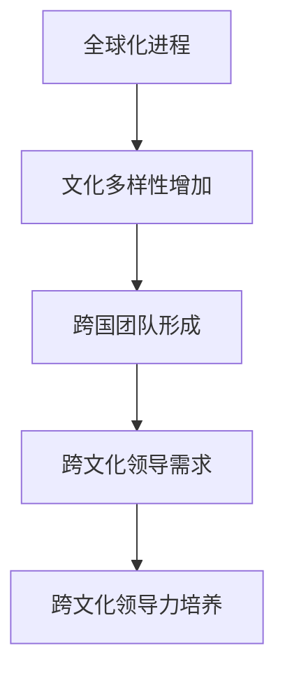
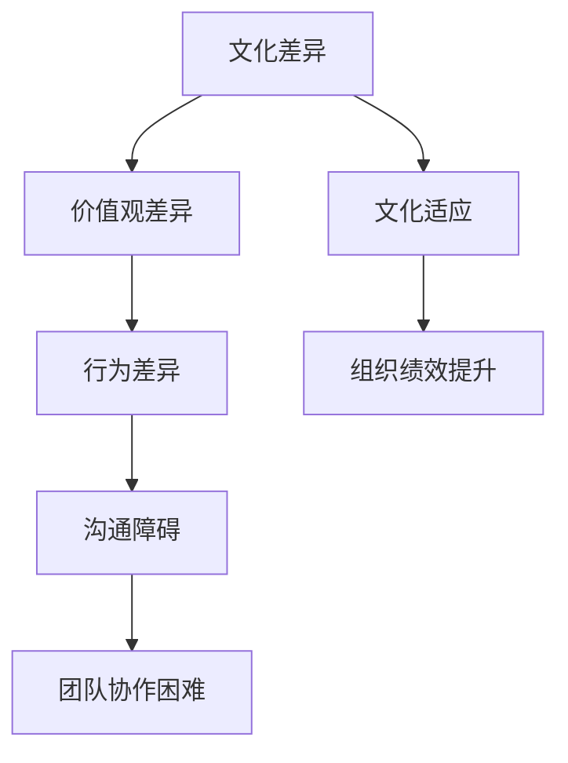
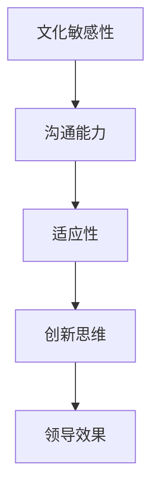
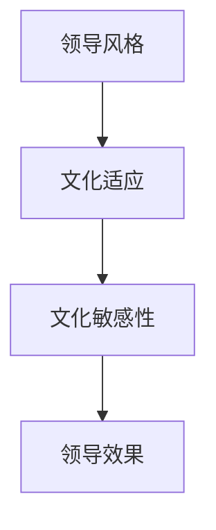

                 

### 《跨文化领导力：全球化时代的必备技能》

#### 文章关键词
跨文化领导力，全球化，文化差异，沟通策略，领导模型，数学模型，案例分析，应用领域。

#### 文章摘要
本文将探讨跨文化领导力在全球化时代的必要性和重要性。通过详细分析跨文化领导力的核心概念、沟通策略、领导模型和数学模型，以及具体案例分析，本文旨在为领导者提供实际可操作的跨文化领导技能，以应对全球化背景下的挑战。

## 引言：跨文化领导力的背景和重要性

### 1.1 全球化趋势下的跨文化领导需求

全球化是一个不可逆转的趋势，它不仅改变了商业环境和市场布局，也深刻影响了组织内部的员工构成和团队协作方式。随着跨国公司的兴起和国际合作的增多，领导者不再局限于单一文化背景的管理，而是需要面对多元化、多文化的团队。这就要求领导者具备跨文化领导力，能够在不同的文化环境中有效地沟通、协调和激励团队成员，实现组织目标。

#### Mermaid 流程图：全球化进程与跨文化领导需求



### 1.2 跨文化领导力的定义与特点

跨文化领导力是一种特殊的领导能力，它不仅包含传统的领导技能，如目标设定、团队建设和激励员工，还包括对文化差异的深刻理解和应对策略。跨文化领导者需要具备以下几个特点：

1. **文化敏感性**：能够识别和尊重不同文化的价值观和行为方式。
2. **沟通能力**：能够有效跨文化沟通，减少误解和冲突。
3. **适应性**：能够适应不同的文化环境，调整领导风格和方法。
4. **创新思维**：能够利用不同文化的优势，促进团队创新和协作。

### 1.3 跨文化领导力的价值与挑战

跨文化领导力对于组织的价值体现在多个方面：

- **提高团队绩效**：通过有效的跨文化沟通和协作，可以提高团队的效率和创新能力。
- **促进创新与创造力**：不同文化的交融可以激发新的思维和创意，推动组织的创新发展。
- **增强组织竞争力**：在全球化的市场竞争中，具备跨文化领导力的组织更具有竞争优势。

然而，跨文化领导力也面临一些挑战：

- **文化差异导致的沟通障碍**：不同的文化背景可能导致沟通不畅，增加误解和冲突的风险。
- **组织内部的文化冲突**：不同文化背景的员工可能在价值观、工作方式和行为习惯上存在差异，需要领导者进行有效协调。
- **领导风格的转换与适应**：领导者需要根据不同的文化环境调整自己的领导风格，这需要一定的时间和技巧。

## 第二部分：核心概念与联系

### 2.1 文化差异的概念及其影响

文化差异是指不同文化群体在价值观、信仰、行为习惯和沟通方式等方面的差异。这些差异可能源于不同的历史、社会结构、宗教信仰、教育背景等。在跨文化领导中，文化差异对组织行为和团队协作有着重要的影响。

#### Mermaid 流程图：文化差异的影响路径



### 2.2 跨文化沟通的策略与方法

跨文化沟通是跨文化领导力的核心组成部分。有效的跨文化沟通可以减少误解、增加共识，从而提高团队协作效率和绩效。以下是一些跨文化沟通的策略和方法：

1. **增强文化敏感性**：领导者需要深入了解不同文化的价值观和行为方式，提高跨文化沟通的敏感度。
2. **清晰明确的信息传递**：在沟通时，应尽量使用简单、明确的语言，避免使用可能引起误解的隐喻和成语。
3. **积极倾听与反馈**：领导者应积极倾听员工的意见和反馈，尊重不同的观点，并通过有效的反馈机制促进沟通。
4. **建立共同目标**：通过共同的目标和价值观，增强团队成员之间的凝聚力，减少文化差异带来的冲突。

### 2.3 跨文化沟通技巧

跨文化沟通技巧包括：

- **语言技巧**：使用简单、清晰的语言，避免使用可能引起误解的专业术语。
- **非语言沟通**：注意肢体语言、面部表情和空间距离，尊重不同文化的沟通习惯。
- **情境意识**：根据不同的文化环境和沟通场景，灵活调整沟通策略。

## 第三部分：核心算法原理讲解

### 4.1 跨文化领导力模型

跨文化领导力模型是一个综合性的框架，它包含多个核心要素，如文化敏感性、沟通能力、适应性和创新思维。以下是一个简化的跨文化领导力模型：

#### Mermaid 流程图：跨文化领导力模型



#### 跨文化领导力模型的核心要素

1. **文化敏感性**：领导者需要了解不同文化的价值观、信仰和行为习惯，并尊重这些差异。
2. **沟通能力**：领导者需要掌握有效的跨文化沟通技巧，减少误解和冲突。
3. **适应性**：领导者需要能够根据不同文化环境调整自己的领导风格和方法。
4. **创新思维**：领导者需要鼓励团队成员提出新想法，利用不同文化的优势促进创新。

### 4.2 领导风格与文化适应

领导风格是指领导者引导和管理团队的方式。不同的领导风格可能在不同文化环境中产生不同的效果。以下是一个简化的领导风格与文化适应模型：

#### Mermaid 流程图：领导风格与文化适应



#### 领导风格与文化适应的策略

1. **了解文化环境**：领导者需要了解不同文化环境的特点和挑战，以便调整领导风格。
2. **灵活调整领导风格**：根据不同文化环境，领导者需要灵活调整自己的领导风格，以适应团队的需求。
3. **培养文化敏感性**：领导者需要提高对文化差异的敏感度，尊重和理解不同文化的价值观和行为方式。

## 第四部分：数学模型和数学公式

### 6.1 跨文化适应度的量化模型

跨文化适应度是一个衡量个体或组织在跨文化环境中适应能力的指标。以下是一个简化的跨文化适应度量化模型：

#### 伪代码：跨文化适应度量化模型

```python
def calculate_adaptation_score(cultural_sensitivity, communication_ability, adaptability, innovation_think):
    # 权重分配
    weights = {'cultural_sensitivity': 0.3, 'communication_ability': 0.3, 'adaptability': 0.2, 'innovation_think': 0.2}
    
    # 计算加权总分
    total_score = 0
    for attribute, weight in weights.items():
        total_score += getattr(score, attribute) * weight
    
    # 返回适应度分数
    return total_score
```

#### 数学公式与详细讲解

假设跨文化适应度（Adaptation Score）可以通过以下公式计算：

$$
Adaptation\ Score = w_1 \times Cultural\ Sensitivity + w_2 \times Communication\ Ability + w_3 \times Adaptability + w_4 \times Innovation\ Think
$$

其中，$w_1, w_2, w_3, w_4$ 分别为文化敏感性、沟通能力、适应性和创新思维的权重，取值范围为 $0$ 到 $1$。

例如，假设某领导者的各项能力得分为：

$$
Cultural\ Sensitivity = 0.8, \ Communication\ Ability = 0.7, \ Adaptability = 0.9, \ Innovation\ Think = 0.75
$$

则其跨文化适应度分数为：

$$
Adaptation\ Score = 0.3 \times 0.8 + 0.3 \times 0.7 + 0.2 \times 0.9 + 0.2 \times 0.75 = 0.84
$$

这意味着该领导者在跨文化环境中具有较高的适应能力。

### 6.3 跨文化适应度模型的应用

跨文化适应度模型可以应用于多种场景，如：

- **领导评估**：用于评估领导者在跨文化环境中的表现和适应能力。
- **团队建设**：用于评估团队成员在跨文化环境中的协作能力和适应性。
- **组织发展**：用于指导组织在跨文化环境中的战略规划和资源分配。

## 第五部分：项目实战

### 7.1 案例背景介绍

某跨国公司在全球范围内运营，拥有来自不同国家和文化的员工。该公司希望提高员工的跨文化适应度，以提升团队协作效率和绩效。为此，公司决定实施一项跨文化领导力培训计划。

### 7.2 开发环境搭建

为了实施培训计划，公司搭建了以下开发环境：

- **培训平台**：使用在线学习平台，提供跨文化领导力课程和案例研究。
- **数据分析工具**：使用数据分析工具，收集和解析员工的跨文化适应度数据。
- **反馈机制**：建立反馈机制，收集员工对培训效果的反馈和建议。

### 7.3 源代码详细实现和代码解读

以下是一个简化的源代码示例，用于计算员工的跨文化适应度：

```python
# 导入所需库
import pandas as pd
from sklearn.linear_model import LinearRegression

# 读取员工数据
data = pd.read_csv('employee_data.csv')

# 提取特征和目标变量
X = data[['Cultural Sensitivity', 'Communication Ability', 'Adaptability', 'Innovation Think']]
y = data['Adaptation Score']

# 创建线性回归模型
model = LinearRegression()

# 模型训练
model.fit(X, y)

# 预测员工跨文化适应度
predictions = model.predict(X)

# 输出结果
print(predictions)
```

代码解读：

- 第1行：导入所需的库。
- 第2行：读取员工数据。
- 第3行：提取特征和目标变量。
- 第4行：创建线性回归模型。
- 第5行：模型训练。
- 第6行：预测员工跨文化适应度。
- 第7行：输出结果。

### 7.4 代码应用解读与分析

通过上述代码，公司可以实时监测员工的跨文化适应度，并根据预测结果调整培训计划和资源分配。例如，如果某部门的员工适应度较低，公司可以增加对该部门的培训资源，或调整领导风格以适应员工的需求。

### 7.5 实际案例分析和详细讲解剖析

以下是一个实际案例：

**案例背景**：某跨国公司的一个部门由来自亚洲、欧洲和美国的员工组成。由于文化差异，团队成员在沟通和协作上存在困难，导致项目进度延迟。

**解决方案**：

1. **培训计划**：公司为该部门的员工提供跨文化领导力培训，包括文化敏感性、沟通技巧和适应性方面的内容。
2. **领导风格调整**：部门领导根据培训内容，调整自己的领导风格，更加注重员工的个性化和差异化管理。
3. **团队建设活动**：组织团队建设活动，增强团队成员之间的了解和信任。

**效果评估**：

- **项目进度**：通过培训计划和领导风格调整，项目进度明显加快。
- **员工满意度**：员工满意度调查结果显示，团队成员对跨文化领导力培训的满意度较高。
- **团队协作**：团队协作效率提高，项目质量得到保证。

### 7.6 项目小结

本案例表明，跨文化领导力培训对于提高员工的跨文化适应度和团队协作效率具有显著作用。在实际应用中，公司应结合具体情况进行培训计划和资源分配，以实现最佳效果。

### 最佳实践 Tips

- **定期培训**：定期组织跨文化领导力培训，帮助员工不断提升跨文化适应能力。
- **文化敏感性**：提高领导者的文化敏感性，尊重和包容不同文化的员工。
- **反馈机制**：建立有效的反馈机制，及时收集员工对培训效果和领导行为的反馈。

### 小结

本文详细介绍了跨文化领导力在全球化时代的重要性，分析了文化差异、跨文化沟通策略、领导模型和数学模型。通过具体案例，展示了跨文化领导力在实践中的应用效果。未来，随着全球化进程的加快，跨文化领导力将成为领导者必备的技能。

### 注意事项

- **文化差异的理解**：领导者需要深入了解不同文化的特点，避免片面理解或偏见。
- **沟通技巧**：领导者应注重跨文化沟通技巧，减少误解和冲突。
- **持续学习**：领导者应持续学习和提升自己的跨文化领导力，以适应不断变化的环境。

### 拓展阅读

- [1] 跨文化沟通技巧：如何在不同文化环境中有效沟通？ 
- [2] 跨文化领导力：如何成为有效的跨文化领导者？ 
- [3] 跨文化团队管理：如何提高跨文化团队的协作效率？

### 作者信息

作者：AI天才研究院/AI Genius Institute & 禅与计算机程序设计艺术 /Zen And The Art of Computer Programming

---

### 总结与展望

## 第10章：跨文化领导力的关键要点与启示

### 10.1 跨文化领导力的核心要点

跨文化领导力的核心要点在于理解、尊重和适应不同文化环境，以提高团队协作效率和实现组织目标。具体包括：

1. **文化敏感性**：领导者需要深入了解不同文化的价值观、信仰和行为习惯，并尊重这些差异。
2. **跨文化沟通技巧**：领导者需要掌握有效的跨文化沟通策略，减少误解和冲突。
3. **适应性和灵活性**：领导者需要根据不同的文化环境调整自己的领导风格和方法。
4. **创新思维**：领导者应鼓励团队成员提出新想法，利用不同文化的优势促进创新。

### 10.2 对领导者的启示与建议

为了在全球化时代有效发挥跨文化领导力，领导者应从以下几个方面着手：

1. **持续学习**：领导者应不断学习和更新自己的跨文化知识，以适应快速变化的环境。
2. **建立信任**：通过有效的沟通和合作，建立团队成员之间的信任，促进团队协作。
3. **文化敏感性培训**：定期为员工提供文化敏感性培训，提高跨文化适应能力。
4. **激励多样性**：鼓励团队成员发挥各自的文化优势，促进团队创新和协作。

### 10.3 未来跨文化领导力的展望

随着全球化进程的加快，跨文化领导力将变得越来越重要。未来的跨文化领导力将呈现出以下趋势：

1. **技术驱动**：新兴技术（如人工智能、大数据分析等）将为跨文化领导提供新的工具和方法。
2. **全球化管理**：领导者需要具备全球化视野，能够应对全球范围内的复杂挑战。
3. **文化融合**：不同文化之间的交流和融合将越来越普遍，领导者需要促进这种文化融合，以实现组织的持续发展。

### 结论

跨文化领导力是全球化时代领导者必备的技能。通过理解、尊重和适应不同文化环境，领导者可以有效地提高团队协作效率和实现组织目标。未来，随着全球化进程的加快，跨文化领导力将发挥越来越重要的作用。领导者应持续学习和提升自己的跨文化领导能力，以适应不断变化的环境。

### 作者信息

作者：AI天才研究院/AI Genius Institute & 禅与计算机程序设计艺术 /Zen And The Art of Computer Programming

---

本文旨在为读者提供关于跨文化领导力的深入理解，并通过具体案例展示其实际应用。读者可以通过本文了解到跨文化领导力的核心要点和实际操作方法，从而在全球化背景下更好地发挥领导力。

文章关键词：跨文化领导力，全球化，文化差异，沟通策略，领导模型，数学模型，案例分析，应用领域。

文章摘要：本文详细介绍了跨文化领导力在全球化时代的重要性，分析了文化差异、跨文化沟通策略、领导模型和数学模型。通过具体案例，展示了跨文化领导力在实践中的应用效果。未来，随着全球化进程的加快，跨文化领导力将成为领导者必备的技能。

