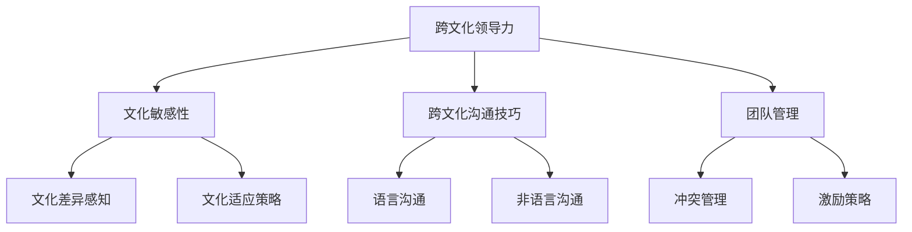
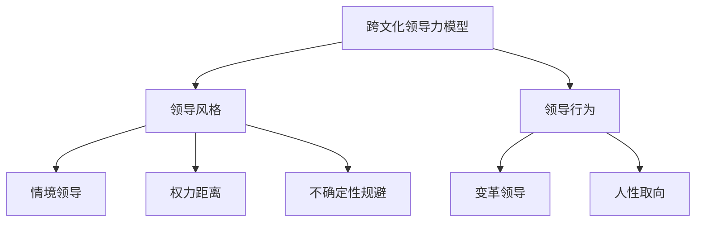
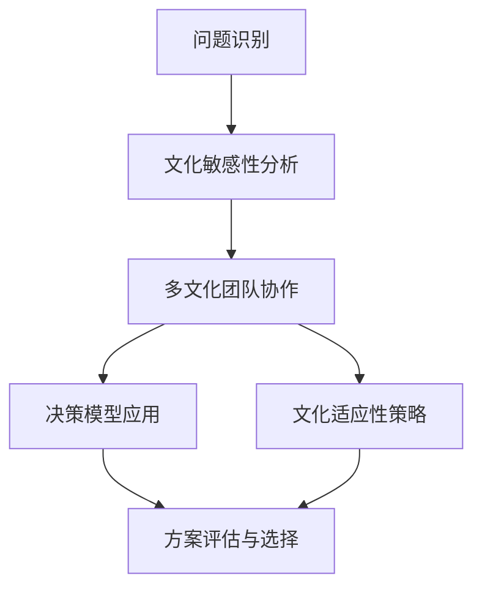

                 

### 关键词

1. **跨文化领导力**：全球化时代的企业管理者必备的核心能力。
2. **文化敏感性**：对文化差异的敏感性和适应性。
3. **跨文化沟通**：有效沟通在不同文化背景下的策略和技巧。
4. **团队管理**：在不同文化背景下，如何协调和激励团队成员。
5. **国际商务**：跨文化领导力在跨国商业活动中的应用。
6. **教育实践**：跨文化领导力在国际教育领域的应用和影响。

### 摘要

在全球化的背景下，跨文化领导力已成为企业成功的关键因素。本文旨在探讨跨文化领导力的定义、核心要素以及其实际应用。首先，我们介绍了跨文化领导力的定义和其在全球化时代的重要性。接着，文章深入分析了文化敏感性、跨文化沟通技巧和团队管理策略。随后，我们探讨了跨文化领导力在国际化企业和国际商务中的具体应用，并分析了其在国际教育领域的实践价值。最后，文章提出了跨文化领导力的发展趋势以及未来的研究方向，为读者提供了全面而深入的跨文化领导力指南。通过本文的阅读，读者将了解到如何在全球化时代中有效地运用跨文化领导力，提升企业的国际竞争力。### 跨文化领导力的定义与重要性

跨文化领导力是指在全球多元文化背景下，领导者通过理解、适应和利用不同文化差异，有效地引导和管理团队、实现组织目标的能力。随着全球化进程的加速，企业越来越多地参与到国际市场竞争中，这种跨文化领导力成为企业管理者和领导者必备的核心技能。

首先，跨文化领导力的重要性体现在以下几个方面：

**1. 提高组织效能：** 在多元文化背景下，领导者需要具备理解和适应不同文化的能力，才能有效地沟通、协调和管理团队。这种能力有助于消除文化障碍，提升团队协作效率，从而提高整个组织的效能。

**2. 促进创新与变革：** 跨文化领导力能够鼓励不同文化背景的员工分享和融合各自的文化知识和经验，激发创新思维，推动组织变革和持续发展。

**3. 提升国际竞争力：** 在全球化市场中，企业需要具备跨文化能力，才能更好地适应不同市场的需求，拓展国际业务，提升竞争力。

**4. 减少文化冲突：** 跨文化领导力能够帮助领导者预见并缓解文化冲突，提高团队的凝聚力和和谐度，避免因文化差异导致的工作效率低下和人才流失。

其次，跨文化领导力的核心要素包括以下几个方面：

**1. 文化敏感性：** 领导者需要具备对不同文化背景的理解和敏感度，能够尊重并欣赏不同文化的特点和价值观。

**2. 跨文化沟通技巧：** 领导者需要掌握跨文化沟通的技巧，包括语言沟通和非语言沟通，以及如何在跨文化环境中有效传达信息。

**3. 团队管理能力：** 领导者需要具备在多元文化团队中管理、协调和激励团队成员的能力，以实现团队目标。

**4. 文化适应性策略：** 领导者需要制定适应不同文化的策略，包括文化融合、文化适应和文化管理，以提升团队和组织的整体绩效。

为了更好地理解跨文化领导力的定义和重要性，我们可以通过以下Mermaid流程图展示其核心概念之间的联系：

通过这个流程图，我们可以清晰地看到跨文化领导力的核心要素及其相互关系。文化敏感性是跨文化领导力的基础，它决定了领导者能否有效感知和理解不同文化的差异。跨文化沟通技巧和团队管理能力则是跨文化领导力的具体应用，它们共同作用于团队和组织，实现组织目标的达成。而文化适应策略则是在跨文化环境中，领导者为了提升组织效能而采取的具体措施。

总之，跨文化领导力是全球化时代企业成功的关键因素。领导者需要具备文化敏感性、跨文化沟通技巧和团队管理能力，并制定适应不同文化的策略，才能在全球多元文化背景下，有效地引导和管理团队，实现组织目标。### 跨文化沟通技巧

在全球化时代，跨文化沟通技巧成为跨文化领导力的重要组成部分。有效的跨文化沟通不仅能够消除文化障碍，提高团队协作效率，还能增强组织凝聚力和整体绩效。以下将从语言沟通和非语言沟通两个方面，探讨跨文化沟通技巧及其应用。

#### 语言沟通

语言是沟通的基本工具，但在跨文化环境中，语言沟通面临着诸多挑战。首先，语言差异可能导致误解和沟通障碍。例如，同一个词汇在不同语言中的含义可能完全不同，甚至可能引起负面情绪。为了克服这种挑战，领导者需要：

1. **语言学习与提升**：领导者应该主动学习和提升自己的外语能力，了解不同语言的文化背景和表达方式。
2. **明确沟通目标**：在跨文化沟通中，领导者应该明确沟通的目标和目的，确保信息传递的准确性和有效性。
3. **使用简单清晰的语言**：避免使用过于复杂的术语和词汇，尽量使用简单、清晰的语言进行沟通。

#### 非语言沟通

非语言沟通包括肢体语言、面部表情、声音语调等，这些因素在跨文化沟通中同样至关重要。不同的文化背景可能对非语言沟通的理解存在差异，甚至可能产生误解。以下是一些非语言沟通技巧：

1. **肢体语言**：在不同的文化背景下，肢体语言的表达方式可能不同。例如，在西方国家，握手是一种常见的问候方式，而在某些亚洲国家，点头或鞠躬可能更为普遍。领导者应该了解并尊重这些差异。
2. **面部表情**：面部表情在不同文化中的含义也可能不同。例如，微笑在某些文化中被视为友好和尊重的表示，但在某些其他文化中，可能被视为虚伪或轻蔑。领导者需要了解不同文化背景下的面部表情含义，避免产生误解。
3. **声音语调**：声音的语调、节奏和音量等也在跨文化沟通中起到重要作用。在不同的文化背景下，同样的词语，通过不同的声音语调表达，可能会产生截然不同的效果。领导者应该注意调整自己的声音语调，以适应不同文化的沟通习惯。

#### 跨文化沟通障碍与对策

跨文化沟通中可能会面临以下几种障碍：

1. **语言障碍**：不同的语言表达方式和语法结构可能导致信息传递不准确。
2. **文化差异**：不同的文化背景可能导致对同一行为的理解和反应不同。
3. **价值观差异**：不同的文化价值观可能导致对同一问题的看法和解决方案不同。

针对这些障碍，可以采取以下对策：

1. **多渠道沟通**：通过邮件、电话、面对面会议等多种沟通渠道，确保信息传递的全面性和准确性。
2. **文化培训**：对团队成员进行跨文化培训，提高其文化敏感性和沟通技巧。
3. **建立共同价值观**：通过团队建设和价值观塑造，建立共同的团队目标和价值观，减少文化差异带来的冲突。
4. **积极倾听**：领导者应该积极倾听团队成员的意见和反馈，尊重不同文化的观点，避免主观判断和偏见。

总之，跨文化沟通技巧是跨文化领导力的重要组成部分。领导者需要通过语言沟通和非语言沟通，克服文化障碍，提高沟通效果。同时，通过积极应对跨文化沟通中的障碍，提升团队协作和整体绩效。这不仅是全球化时代企业成功的关键因素，也是领导者个人发展的必备技能。### 跨文化团队管理

跨文化团队管理在全球化背景下显得尤为重要。多元文化背景的团队成员为团队带来了丰富的文化知识和经验，但同时也带来了文化差异和冲突。如何有效地管理这样的团队，是跨文化领导者的核心挑战。以下将从团队成员的文化差异、冲突管理以及激励策略三个方面，探讨跨文化团队管理的有效方法。

#### 成员的文化差异

在多元文化团队中，成员来自不同的文化背景，这些文化差异可能体现在以下几个方面：

1. **价值观差异**：不同的文化价值观可能导致团队成员对工作态度、团队协作、领导风格等方面有不同的期望。例如，一些文化强调个人成就，而另一些文化则更注重团队的整体利益。
2. **沟通风格差异**：不同文化背景下的团队成员可能有不同的沟通风格。例如，一些文化鼓励直接和坦率的沟通，而另一些文化则更倾向于间接和委婉的表达。
3. **工作习惯差异**：不同的文化背景可能导致团队成员在工作时间、工作节奏、工作方式等方面存在差异。例如，一些文化鼓励加班和长时间工作，而另一些文化则强调工作和生活的平衡。
4. **决策风格差异**：不同文化背景的团队成员在决策过程中可能表现出不同的风格。例如，一些文化倾向于集体决策，而另一些文化则更倾向于个人决策。

#### 冲突管理

文化差异是跨文化团队冲突的主要来源。为了有效地管理冲突，领导者可以采取以下策略：

1. **积极倾听**：领导者应该积极倾听团队成员的意见和反馈，尊重不同文化的观点，避免主观判断和偏见。通过倾听，领导者可以更好地理解团队成员的需求和期望，从而找到解决问题的方法。
2. **文化培训**：对团队成员进行跨文化培训，提高其文化敏感性和沟通技巧。通过培训，团队成员可以更好地理解不同文化的特点和价值观，减少误解和冲突。
3. **建立共同目标**：通过团队建设和共同目标的设定，建立团队成员之间的共同利益，减少文化差异带来的冲突。当团队成员共同追求一个明确的目标时，他们更容易团结一致，克服文化差异。
4. **冲突解决机制**：建立有效的冲突解决机制，确保冲突能够及时、公正地解决。例如，可以设立专门的冲突解决小组，制定冲突解决的流程和规则，确保冲突不会影响团队的整体运作。

#### 激励策略

跨文化团队中的激励策略需要考虑不同文化背景下的需求和期望。以下是一些有效的激励策略：

1. **个性化激励**：领导者应该了解团队成员的个人需求和激励因素，提供个性化的激励措施。例如，一些团队成员可能更注重物质激励，而另一些团队成员可能更注重职业发展。
2. **认可与表扬**：在多元文化团队中，领导者应该注意不同文化背景下的认可和表扬方式。例如，一些文化中，公开表扬可能更为常见，而在另一些文化中，私下表扬可能更为合适。
3. **跨文化团队建设**：通过组织团队建设活动，增强团队成员之间的相互了解和信任。这些活动可以是跨文化的交流、团队合作项目或团队文化体验等。
4. **灵活的工作安排**：为了适应不同文化背景下的工作习惯和需求，领导者可以提供灵活的工作安排，例如远程办公、弹性工作时间等。

总之，跨文化团队管理需要领导者具备深厚的文化敏感性和沟通技巧，能够有效地处理团队成员的文化差异和冲突，并采取合适的激励策略。通过这些方法，领导者可以提升团队的整体绩效，促进团队和谐发展。这不仅有助于企业在全球化背景下取得成功，也为团队成员的个人成长和发展提供了良好的环境。### 文化敏感性训练

文化敏感性训练是提升跨文化领导力的关键步骤。它旨在帮助领导者理解和尊重不同文化的特点和价值观，从而在全球化背景下更有效地管理多元文化团队。以下将详细探讨文化敏感性训练的定义、方法及其在实际应用中的成功案例。

#### 文化敏感性训练的定义

文化敏感性训练（Cultural Sensitivity Training）是一种专门设计的培训课程，旨在提高领导者对文化差异的敏感度，帮助他们理解不同文化的行为模式、价值观和沟通方式。这种培训不仅关注不同文化的外在表现，更深入挖掘文化背后的心理和情感因素。

#### 文化敏感性训练的方法

1. **文化认知评估**：通过文化认知评估工具，如霍夫斯泰德的文化维度模型（Hofstede's Cultural Dimensions），领导者可以了解自己和他人的文化偏好，识别不同文化之间的差异。

2. **文化对比分析**：通过对比不同文化的价值观、行为规范和沟通风格，领导者可以更好地理解文化差异，并学会在不同文化背景下调整自己的行为。

3. **案例学习与角色扮演**：通过分析真实案例和进行角色扮演，领导者可以模拟跨文化沟通和管理的场景，学习如何在复杂的文化环境中做出有效决策。

4. **互动交流与反馈**：在培训过程中，鼓励领导者之间的互动交流，分享各自的文化经验和心得，通过反馈机制不断优化和调整自己的文化敏感性。

#### 文化敏感性训练的实际应用

1. **全球化企业**：许多全球化企业通过文化敏感性训练，提高了领导者的文化适应能力，从而更好地管理跨国团队和全球业务。例如，某跨国公司通过文化敏感性培训，帮助其国际团队成员更好地理解彼此的文化背景，减少了沟通障碍，提升了团队协作效率。

2. **国际组织**：国际组织如联合国、世界银行等，也广泛采用文化敏感性训练，以提高员工在跨国项目中的合作能力。通过这些培训，员工能够更好地应对不同文化背景的挑战，促进国际合作与交流。

3. **公共部门**：在公共部门，文化敏感性训练被用来提升公务员的文化适应能力，更好地服务于多元文化的公众。例如，某地方政府通过文化敏感性培训，帮助公务员更好地理解和服务于不同文化背景的居民，提升了公共服务的质量和满意度。

#### 增强文化敏感性的实践案例

1. **跨国公司案例**：某跨国电子公司在进入东南亚市场前，对高管团队进行了为期一个月的文化敏感性训练。通过培训，高管们不仅了解了东南亚市场的文化特点，还学会了如何与当地员工进行有效沟通，推动了公司在东南亚市场的快速扩张。

2. **国际学校案例**：某国际学校通过文化敏感性训练，帮助教师了解学生的多元文化背景，并调整教学方法，以更好地满足不同文化背景学生的学习需求。通过这种培训，学校的整体教育质量显著提升，受到了学生和家长的高度评价。

总之，文化敏感性训练是提升跨文化领导力的有效途径。通过这种方法，领导者可以更好地理解、尊重和适应不同文化的特点和需求，从而在全球化背景下更有效地管理多元文化团队。这不仅有助于提升企业的国际竞争力，也为员工的个人成长提供了有力支持。### 跨文化领导力模型

跨文化领导力模型是理解和实践跨文化领导力的重要工具，它提供了一种系统性的方法来指导领导者如何在不同文化背景下有效地管理和引导团队。以下将介绍几种常见的跨文化领导力模型，并分析这些模型在不同情境下的应用。

#### 跨文化领导力模型的基本概念

跨文化领导力模型通常基于对文化差异的深刻理解，以及在不同文化环境中进行领导活动的实践经验。这些模型可以帮助领导者识别和应对不同文化背景下的挑战，提高领导效能。

#### 常见的跨文化领导力模型

1. **霍夫斯泰德的文化维度模型**：
   - **文化维度**：霍夫斯泰德的文化维度模型（Hofstede's Cultural Dimensions）包括个人主义与集体主义、权力距离、不确定性规避、价值观的男性化与女性化、长期取向与短期取向等五个维度。
   - **模型应用**：领导者可以通过这个模型了解不同文化的特点，根据这些特点调整领导策略。例如，在与权力距离较大的文化进行沟通时，领导者可能需要更加尊重上级和权威，而在个人主义较强的文化中，领导者则应更多关注个人成就和自我实现。

2. **格伦维尔的文化适应模型**：
   - **文化适应阶段**：格伦维尔的模型（Glenville's Cultural Adaptation Model）将文化适应分为四个阶段：接触、认识、融合和创新。
   - **模型应用**：领导者可以根据团队成员所处的文化适应阶段，采取相应的管理策略。例如，对于处于接触阶段的成员，领导者应更多地提供信息和引导，帮助他们了解新文化；对于处于融合阶段的成员，领导者则应鼓励他们积极参与团队活动，增强归属感。

3. **Tannen的文化沟通模型**：
   - **文化沟通要素**：Tannen的文化沟通模型（Tannen's Communication Model）包括语言、非语言沟通、语境和文化背景四个要素。
   - **模型应用**：领导者可以运用这个模型来分析和改善跨文化沟通。例如，通过识别语言和非语言沟通中的文化差异，领导者可以采取针对性的沟通策略，提高信息传递的准确性和有效性。

#### 跨文化领导力模型与领导风格的关系

跨文化领导力模型与领导风格密切相关。不同的模型可以指导领导者选择和调整适当的领导风格，以适应不同文化背景的需求。

1. **情境领导模型**：
   - **情境领导**：情境领导模型（Hersey and Blanchard's Situational Leadership Model）基于领导者与团队成员的关系，将领导风格分为四种：指导型、支持型、参与型和委托型。
   - **模型应用**：在不同的文化背景下，领导者应根据团队成员的文化特点和需求，选择合适的领导风格。例如，在不确定性规避较高的文化中，领导者可能需要采取更加指导型的风格，而在个人主义较强的文化中，领导者则应更多采取参与型或委托型的风格。

2. **权力距离模型**：
   - **权力距离**：权力距离模型（Power Distance Model）基于文化对权力分布的接受程度，将领导风格分为权力集中型和权力分散型。
   - **模型应用**：领导者应根据不同文化的权力距离特征，调整领导行为。在权力距离较高的文化中，领导者可能需要表现出更多的权威和决断力；而在权力距离较低的文化中，领导者则应更多地鼓励团队成员参与决策，增强团队自主性。

#### 跨文化领导力模型的应用实例

1. **跨国企业的全球团队管理**：
   - **实例**：某跨国制药公司通过应用霍夫斯泰德的文化维度模型，对其全球团队进行了文化适应培训。在培训过程中，团队成员学习了如何根据文化差异调整沟通方式和团队管理策略，从而提高了团队的协作效率和项目成功率。

2. **国际项目的领导**：
   - **实例**：在某国际工程项目中，项目经理运用了格伦维尔的文化适应模型，根据团队成员的文化适应阶段，采取了不同的管理策略。例如，对于刚加入项目的成员，项目经理提供了详细的指导和培训，帮助他们迅速适应项目环境；对于已经融入团队的成员，项目经理则鼓励他们积极参与项目决策，提高团队的凝聚力和创新力。

总之，跨文化领导力模型为领导者提供了一种系统化的方法来理解和应对不同文化背景下的领导挑战。通过应用这些模型，领导者可以更加有效地管理多元文化团队，提高组织绩效，实现全球化背景下的持续成功。### 跨文化决策与战略规划

在全球化时代，跨文化决策和战略规划成为企业领导者必须掌握的关键技能。跨文化决策不仅涉及企业内部的文化差异，还包括在不同国家和市场中的外部文化因素。以下将探讨跨文化决策的特点与挑战，并提出相应的框架与方法。

#### 跨文化决策的特点

1. **多元文化背景**：跨文化决策通常涉及来自不同文化背景的团队成员和利益相关者，需要综合考虑不同的文化价值观、行为规范和沟通方式。
2. **不确定性因素**：在全球化的背景下，企业面临的市场环境更加复杂和多变，跨文化决策需要考虑政治、经济、社会、技术等多方面的不确定性因素。
3. **文化冲突**：不同文化背景下的团队成员可能在决策过程中产生冲突，例如对同一问题的看法、解决方案和执行方式等，需要通过有效的沟通和协商来化解。
4. **文化敏感性**：跨文化决策要求领导者具备高度的文化敏感性，能够理解和尊重不同文化的价值观和利益，避免因文化差异导致决策失误。

#### 跨文化决策的挑战

1. **信息不对称**：在不同文化背景下，信息的获取和传递可能存在差异，导致决策过程中信息不对称，影响决策的准确性和有效性。
2. **价值观冲突**：不同文化背景下的团队成员可能持有不同的价值观，这在决策过程中可能引发冲突，影响团队的凝聚力和合作效率。
3. **文化偏见**：领导者可能受到自身文化偏见的影响，导致在跨文化决策中无法客观、公正地评估和选择最佳方案。
4. **法律与政策限制**：不同国家和地区的法律、政策和文化规范可能对企业的决策产生影响，需要领导者具备跨文化法律和政策知识，以确保决策的合规性。

#### 跨文化决策框架与方法

1. **文化敏感性分析**：
   - **步骤**：在决策过程中，首先进行文化敏感性分析，识别不同团队成员的文化背景和价值观差异。
   - **方法**：通过问卷调查、访谈、文化评估工具等方式，收集和分析团队成员的文化偏好和价值观。

2. **多文化团队协作**：
   - **步骤**：组建多文化团队，确保团队成员代表不同文化背景，促进跨文化沟通和协作。
   - **方法**：通过团队建设活动、跨文化培训、文化交流等方式，增强团队成员之间的相互理解和信任。

3. **决策模型应用**：
   - **步骤**：根据跨文化决策的特点，选择合适的决策模型，例如情境领导模型、平衡计分卡模型等。
   - **方法**：运用这些模型，帮助团队进行决策分析、方案评估和选择。

4. **文化适应性策略**：
   - **步骤**：在决策过程中，制定适应不同文化的策略，例如调整决策流程、制定文化敏感的解决方案等。
   - **方法**：通过文化敏感性分析和多文化团队协作，制定出适应不同文化背景的决策方案。

#### 跨文化决策案例分析

**案例 1：跨国公司的市场进入决策**

某跨国公司在决定进入东南亚市场时，面临文化差异和不确定性因素的挑战。通过文化敏感性分析，公司识别出东南亚市场在价值观、沟通风格和法律环境等方面的特点，并组建了由东南亚本地员工组成的市场进入团队。通过多文化团队协作和决策模型应用，公司制定了符合当地市场需求的营销策略和进入方案，最终成功进入东南亚市场。

**案例 2：国际化企业的战略调整**

某国际化企业在其全球扩张过程中，发现不同市场的文化背景对企业的运营和决策产生了显著影响。通过文化适应性策略，公司调整了其全球战略，例如在权力距离较大的市场，公司采取了更加集中的决策模式，而在权力距离较小的市场，公司鼓励更多的地方自主决策。通过这些调整，公司成功应对了不同市场的文化挑战，提高了全球运营效率。

总之，跨文化决策与战略规划是全球化时代企业成功的关键。通过理解跨文化决策的特点和挑战，运用适当的决策框架和方法，企业可以更有效地应对不同文化背景下的挑战，实现全球化的持续成功。### 跨文化领导力在全球化企业中的应用

在全球化时代，企业面临的市场环境越来越复杂和多元，跨文化领导力成为企业成功的关键因素。以下将详细探讨跨文化领导力在全球化企业中的应用，包括组织结构、文化融合策略以及领导者的角色与挑战。

#### 组织结构

全球化企业的组织结构通常较为复杂，涉及多个国家和地区的业务运营。为了适应这种多元化环境，企业可以采取以下组织结构策略：

1. **矩阵式组织结构**：矩阵式组织结构将职能部门和地域部门相结合，使企业在全球范围内实现资源的优化配置和高效的业务运作。在这种结构下，领导者需要具备跨文化沟通和协调能力，以处理不同文化背景下的团队协作。
2. **地域性组织结构**：对于在某些地区具有较强市场优势的企业，可以采取地域性组织结构，即以地区为单位设置独立的业务单元。这种结构有助于领导者深入了解当地市场的文化特点，制定更加针对性的战略。
3. **全球化中心**：一些企业通过设立全球化中心，集中处理全球业务的核心事务，如战略规划、资源配置和决策制定。全球化中心需要具备跨文化领导力，以确保不同地区业务单元的协同发展。

#### 文化融合策略

文化融合是全球化企业面临的重要挑战，企业需要采取一系列策略来促进不同文化之间的融合。

1. **建立共同价值观**：企业可以通过制定和推广共同的价值观，使员工在不同文化背景下具有共同的目标和信念。例如，通用电气（GE）通过倡导“全球公民”的理念，鼓励员工在不同国家和地区实现企业的全球愿景。
2. **文化培训与交流**：企业可以定期开展文化培训活动，提高员工对跨文化沟通和管理的认识和技能。同时，通过组织跨国团队交流项目，促进不同文化背景的员工之间的相互了解和合作。
3. **尊重文化差异**：企业应尊重不同文化的独特性，避免将单一文化价值观强加给其他文化背景的员工。例如，在决策过程中，企业可以采用多元视角，充分考虑不同文化的观点和建议。

#### 领导者的角色与挑战

全球化企业的领导者需要扮演多种角色，以应对跨文化环境中的复杂挑战。

1. **文化代言人**：领导者需要成为不同文化的代言人，代表不同文化背景的员工发言，促进文化之间的相互理解和尊重。
2. **文化协调者**：领导者需要充当文化协调者的角色，处理不同文化之间的冲突和矛盾，确保团队的和谐和高效运作。
3. **文化引导者**：领导者需要引导员工理解和适应不同文化的特点和价值观，帮助他们克服文化障碍，提高跨文化沟通和协作能力。

#### 案例分析

**案例 1：华为的全球化战略**

华为作为全球领先的通信技术企业，在全球化过程中，高度重视跨文化领导力。华为采取了一系列措施来促进文化融合，例如在海外分支机构设立本地化团队，进行文化培训与交流，鼓励员工积极参与跨国项目。同时，华为的领导者也积极扮演文化代言人和协调者的角色，推动不同文化之间的合作与理解。这些举措有助于华为在全球市场取得成功。

**案例 2：麦当劳的国际经营**

麦当劳在全球范围内的成功，离不开其跨文化领导力。麦当劳通过尊重各地文化差异，制定了本地化的经营策略。例如，在印度，麦当劳推出了无牛肉汉堡，以适应当地的文化习惯；在中国，麦当劳推出了中式早餐和地方特色菜品，深受消费者喜爱。同时，麦当劳的领导者通过文化敏感性和跨文化沟通技巧，有效地处理了不同文化背景下的管理挑战。

总之，跨文化领导力在全球化企业中的应用至关重要。通过优化组织结构、制定文化融合策略和提升领导者的跨文化能力，企业可以更好地应对全球化带来的挑战，实现全球业务的持续增长。### 跨文化领导力在多元文化团队中的实践

在全球化背景下，多元文化团队的协作已成为现代企业运营的重要组成部分。跨文化领导力在多元文化团队中的实践，能够有效促进团队成员之间的沟通、协作和凝聚力，从而提高团队的绩效和整体效能。以下将探讨跨文化领导力在多元文化团队中的具体应用，包括团队的形成与运营、领导力角色、协作与冲突管理等方面。

#### 团队的形成与运营

1. **文化多样化评估**：在团队成立之初，领导者应对团队成员的文化背景进行详细评估，了解成员的文化差异和价值观。这有助于制定针对性的团队建设策略，促进团队成员之间的相互了解。
2. **共同目标设定**：为了提高团队的凝聚力，领导者应与团队成员共同设定明确的目标，确保每位成员都了解自己的职责和团队的整体愿景。通过共同目标的设定，可以减少因文化差异带来的工作冲突。
3. **文化适应性培训**：在团队成立后，领导者可以组织跨文化适应性培训，帮助团队成员了解不同文化的特点和沟通风格。这有助于提高团队成员的文化敏感性和跨文化沟通技巧，从而促进团队的有效协作。
4. **团队建设活动**：通过组织团队建设活动，如跨文化团队协作项目、文化交流活动等，领导者可以增强团队成员之间的相互了解和信任，促进团队的融合。

#### 领导力角色

1. **文化代言人**：领导者应作为不同文化的代言人，帮助团队成员理解和尊重彼此的文化背景，促进文化之间的相互理解。在处理跨文化问题时，领导者应保持中立，避免偏袒某一方。
2. **文化协调者**：领导者需要充当文化协调者的角色，处理团队成员之间的文化冲突和矛盾。通过有效的沟通和协商，领导者可以帮助团队成员找到共同点，解决文化差异带来的问题。
3. **文化引导者**：领导者应积极引导团队成员适应和融入团队文化，帮助他们克服文化障碍，提高跨文化沟通和协作能力。同时，领导者也应鼓励团队成员保持自身文化的独特性，促进文化的多样性。

#### 协作与冲突管理

1. **协同合作机制**：领导者应建立有效的协同合作机制，促进团队成员之间的信息共享和资源整合。例如，通过共享平台、定期会议等方式，确保团队成员能够及时获取必要的信息，提高协作效率。
2. **沟通渠道畅通**：为了确保跨文化团队的沟通畅通，领导者应建立多种沟通渠道，如电子邮件、即时通讯工具、视频会议等。同时，领导者应鼓励团队成员主动沟通，分享意见和建议。
3. **冲突预防策略**：领导者应采取冲突预防策略，提前识别和解决潜在的冲突。例如，通过建立明确的沟通规范和决策程序，减少误解和冲突的发生。
4. **冲突解决机制**：在冲突发生时，领导者应建立有效的冲突解决机制，及时处理冲突，防止冲突升级。例如，通过调解、调解小组等方式，帮助团队成员找到解决问题的方法。

总之，跨文化领导力在多元文化团队中的实践，对于提高团队的协作效率和整体效能具有重要意义。通过文化多样化评估、共同目标设定、文化适应性培训、团队建设活动等措施，领导者可以有效地促进团队成员之间的相互了解和信任，提高团队的凝聚力。同时，通过文化代言人、文化协调者、文化引导者等角色，领导者可以处理跨文化冲突和矛盾，确保团队在多元文化背景下高效运作。### 跨文化领导力在国际商务中的运用

跨文化领导力在国际商务中的运用至关重要，它不仅决定了企业能否成功进入国际市场，还影响到企业的长期发展和全球业务扩展。以下将详细探讨国际商务中的文化差异、跨文化策略以及文化适应性策略。

#### 国际商务中的文化差异

1. **价值观差异**：不同的国家和地区有不同的价值观，这些价值观可能影响商务谈判、合同执行和企业管理。例如，在某些文化中，关系和信任被视为商业合作的基础，而在其他文化中，合同和法律条款则占据主导地位。
2. **沟通风格差异**：不同的文化背景可能导致沟通风格上的差异，例如，一些文化倾向于直接和坦率的沟通，而其他文化则更倾向于委婉和间接的表达方式。这些差异可能导致误解和沟通障碍。
3. **商务习俗**：不同的国家和地区有不同的商务习俗，包括礼仪、商业礼节、商业礼仪等。例如，在某些文化中，送礼和宴请是常见的商务交往方式，而在其他文化中，这些行为可能被视为不恰当或贿赂。
4. **决策风格差异**：不同文化背景下的决策风格也存在差异，例如，一些文化倾向于集体决策，而其他文化则更倾向于个人决策。这些差异可能影响决策的速度和执行力。

#### 跨文化策略

1. **文化适应策略**：为了在国际商务中取得成功，企业需要采取文化适应策略，这包括：
   - **文化培训**：对员工进行跨文化培训，提高其文化敏感性和跨文化沟通技巧。
   - **本土化营销**：根据目标市场的文化特点和需求，调整产品和服务，使其更符合当地市场的期望。
   - **建立本地合作伙伴关系**：与当地企业建立合作伙伴关系，借助本地合作伙伴的市场知识和资源，更好地适应和融入当地市场。
2. **文化差异管理**：企业可以通过以下方法管理文化差异：
   - **文化敏感性培训**：通过文化敏感性培训，提高员工对文化差异的敏感度，减少误解和冲突。
   - **文化适应机制**：建立文化适应机制，确保员工在国际商务环境中能够有效地适应和应对不同的文化差异。

#### 文化适应性策略

1. **文化融合**：企业可以通过文化融合策略，将不同文化的优点结合起来，创造一种新的、更有效的商业文化。例如，通过跨国团队的合作和交流，将不同文化的创新思维和管理方法融合在一起，提高企业的竞争力。
2. **文化调适**：企业可以根据目标市场的文化特点，调整自身的文化价值观和行为规范，以更好地适应和融入当地市场。例如，在进入某个市场前，企业可以了解该市场的文化偏好，并据此调整其营销策略和商业行为。
3. **文化自主性**：企业应尊重不同文化背景下的员工和文化差异，允许员工在保持自身文化特色的同时，积极参与到企业的全球化进程中。这种文化自主性有助于提高员工的归属感和忠诚度，从而促进企业的长期发展。

总之，跨文化领导力在国际商务中的运用，对于企业成功进入国际市场、拓展全球业务具有重要意义。通过理解和尊重文化差异，采取文化适应策略和文化适应性策略，企业可以更好地应对国际商务环境中的挑战，实现全球业务的持续增长和成功。### 跨文化领导力的发展趋势与未来展望

在全球化的浪潮中，跨文化领导力正日益成为企业成功的关键因素。随着国际商务和跨国合作不断深入，跨文化领导力的发展趋势也在不断演变，呈现出一些新的特征和方向。以下将探讨跨文化领导力的发展趋势，以及未来在这一领域可能面临的挑战和机遇。

#### 趋势分析

1. **数字化领导力的融合**：随着数字技术的快速发展，跨文化领导力正与数字化领导力相结合。领导者需要掌握数字工具和平台，以提高跨文化团队的协作效率和沟通效果。例如，利用远程办公工具、虚拟团队会议平台等，可以克服地理和文化差异，实现高效的国际协作。
2. **多元化团队的普遍性**：越来越多的企业意识到多元化团队的重要性，并在招聘和管理中注重多样性。这种多元化不仅体现在性别、年龄和种族上，还包括文化背景、专业知识和技能。跨文化领导者需要适应和引领这种多元化团队，发挥每个成员的优势，实现团队的创新和协作。
3. **软技能的重视**：跨文化领导力的发展趋势之一是对软技能的重视，如沟通能力、同理心、文化敏感性等。这些软技能在跨文化环境中尤为重要，有助于领导者更好地理解和管理多元化的团队，提高团队的凝聚力和工作效率。
4. **全球思维模式的培养**：跨文化领导者需要具备全球思维模式，能够从全球视角出发，理解和应对不同市场的文化差异和商业环境。这种全球思维模式有助于企业更好地适应全球化的趋势，提高国际竞争力。

#### 未来挑战

1. **文化多样性的管理**：随着全球化的加深，企业面临的不仅仅是文化差异，还有文化多样性的管理。如何在一个多元化团队中保持文化和谐，同时发挥每个成员的独特优势，是跨文化领导者面临的重要挑战。
2. **文化冲突的应对**：跨文化团队中的文化冲突在所难免，如何有效地应对这些冲突，避免影响团队的工作效率和氛围，是跨文化领导者需要解决的问题。
3. **国际法律和政策的合规**：在国际商务中，企业需要遵守不同国家和地区的法律法规，这给跨文化领导者带来了额外的挑战。领导者需要具备国际法律和政策知识，确保企业的业务运营符合当地的规定。

#### 未来机遇

1. **全球市场的拓展**：随着全球化的推进，企业有更多的机会进入新的市场，实现业务的拓展。跨文化领导者可以利用自己的跨文化能力和全球视野，帮助企业在国际市场中获得竞争优势。
2. **技术创新的推动**：数字技术和人工智能的发展，为跨文化领导力提供了新的工具和方法。例如，利用数据分析工具，可以更准确地了解不同文化背景下的员工需求和行为模式，从而提高领导效能。
3. **跨学科融合**：跨文化领导力的发展可以与心理学、社会学、管理学等学科进行融合，形成更为系统和全面的领导力理论体系。这种跨学科的融合有助于提升跨文化领导力的科学性和应用性。

总之，跨文化领导力的发展趋势显示出数字化、多元化、软技能和全球思维的融合。在未来的发展中，跨文化领导者需要不断适应新的挑战，抓住机遇，以实现企业的全球化成功。通过不断学习和实践，跨文化领导者将成为企业国际化进程中的关键推动力量。### 跨文化领导力教育与实践

在全球化迅速发展的背景下，跨文化领导力的教育与实践显得尤为重要。这不仅能够提升企业管理者的综合素质，还能增强企业在国际市场中的竞争力。以下将探讨跨文化领导力教育的现状与需求，跨文化领导力实践中的问题与解决方案，以及如何整合教育与实际应用。

#### 跨文化领导力教育的现状与需求

**现状**：
1. **教育机构多样化**：目前，许多商学院和国际培训机构都提供了跨文化领导力相关的课程和培训，内容涵盖文化敏感性、跨文化沟通技巧、团队管理策略等。
2. **在线教育资源丰富**：随着在线教育的普及，许多平台如Coursera、edX等提供了免费的跨文化领导力课程，方便学习者随时随地进行学习。
3. **企业内训普及**：越来越多的企业开始意识到跨文化领导力的重要性，将其纳入内部培训计划，以提高员工的跨文化管理能力。

**需求**：
1. **专业人才短缺**：尽管跨文化领导力教育得到了一定程度的普及，但专业人才仍然短缺。许多企业在全球化进程中遇到了跨文化管理的瓶颈，急需具备跨文化领导力的人才。
2. **持续教育需求**：跨文化领导力是一个不断发展的领域，领导者需要不断更新知识和技能，以应对新的挑战。因此，持续教育和专业培训的需求不断增加。

#### 跨文化领导力实践中的问题与解决方案

**问题**：
1. **文化误解与冲突**：在跨国团队中，由于文化差异，团队成员之间可能存在误解和冲突，影响团队协作和项目进展。
2. **缺乏实际操作经验**：许多领导者虽然在理论上了解跨文化领导力，但在实际操作中缺乏经验，难以有效应对复杂的跨文化情境。
3. **组织支持不足**：在一些企业中，跨文化领导力实践缺乏组织层面的支持和资源，导致跨文化领导力难以真正落地。

**解决方案**：
1. **文化培训与模拟练习**：通过文化培训，帮助领导者了解不同文化的特点和价值观，并通过模拟练习提高实际操作能力。
2. **跨文化团队建设**：通过团队建设活动，增强团队成员之间的相互了解和信任，提高跨文化协作能力。
3. **组织支持与资源投入**：企业应提供必要的资源和支持，如跨文化培训预算、跨文化政策制定等，确保跨文化领导力实践能够顺利实施。

#### 整合教育与实际应用

1. **理论与实践相结合**：在跨文化领导力教育中，应注重理论与实践的结合，通过案例分析、角色扮演等方式，帮助学习者将所学知识应用到实际工作中。
2. **实战演练与反馈**：企业可以通过组织跨文化团队项目，让领导者在实际操作中锻炼跨文化领导力，并通过定期的反馈和评估，不断优化和提升领导者的能力。
3. **持续教育与职业发展**：企业应鼓励领导者参加持续教育课程，如MBA、EMBA等，以获取最新的跨文化领导力理论和实践经验。同时，通过提供职业发展机会，激励领导者不断提升自己的跨文化领导能力。

总之，跨文化领导力的教育与实践是相辅相成的。通过系统的教育培训和实际应用，领导者可以不断提升自己的跨文化领导力，为企业全球化发展提供强有力的支持。这不仅有助于企业应对全球化带来的挑战，还能提升企业的国际竞争力。### 附录

#### A.1 跨文化领导力相关资源

**研究机构与期刊**：

1. **国际跨文化研究协会（International Association for Intercultural Education, Research and Training, I-AIET）**：该协会是一个跨学科的国际组织，致力于推动跨文化教育和研究的进展。
2. **跨文化管理期刊（Journal of Intercultural Management）**：这是一本专注于跨文化管理和领导力研究的学术期刊，发表有关跨文化团队管理、国际商务和文化适应等方面的文章。

**书籍推荐**：

1. **《跨文化领导力》（Cultural Intelligence: Improving Your CQ to Engage More Productively Across Cultures）**：作者：Judith E. Glaser
2. **《全球化领导力》（Global Leadership: The Next Challenge）**：作者：Global Leadership Forecast Project
3. **《跨文化沟通技巧》（Cultural Awareness in Global Business）**：作者：Cameron K. Afework

**在线课程与讲座**：

1. **Coursera上的《跨文化沟通与领导力》**：由纽约大学开设，提供系统的跨文化沟通和领导力知识。
2. **edX上的《跨文化领导力与实践》**：由新加坡国立大学提供，涵盖了跨文化团队管理、文化适应策略等主题。
3. **LinkedIn Learning的《跨文化沟通技巧》**：提供实用的跨文化沟通技巧和案例分析，适合职场人士学习和应用。

### 图表与示例

**图 1：跨文化领导力核心概念联系图**

**图 2：跨文化领导力模型与领导风格关系图**

**图 3：跨文化决策框架**

通过上述图表和示例，我们更清晰地了解了跨文化领导力的核心概念、模型及其在不同情境中的应用。这不仅有助于加深对跨文化领导力的理解，也为实践提供了有益的指导。### 总结与启示

跨文化领导力在全球化时代的企业运营中扮演着至关重要的角色。本文从多个角度探讨了跨文化领导力的定义、核心要素、沟通技巧、团队管理策略、文化敏感性训练、领导力模型以及实践应用。通过这些分析，我们得出以下结论和启示：

**1. 跨文化领导力的定义与重要性**：跨文化领导力是一种在全球多元文化背景下，领导者通过理解、适应和利用不同文化差异，实现组织目标的能力。它不仅有助于提高组织的国际竞争力，还能促进团队协作和创新。

**2. 跨文化沟通技巧**：有效的跨文化沟通是跨文化领导力的核心。领导者需要掌握语言沟通和非语言沟通的技巧，理解并尊重不同文化的沟通习惯和价值观，以避免误解和冲突。

**3. 团队管理策略**：在多元文化团队中，领导者需要具备文化敏感性，能够识别和处理文化差异，采取适当的激励和冲突管理策略，确保团队的高效运作。

**4. 文化敏感性训练**：文化敏感性训练是提升跨文化领导力的关键步骤。通过文化认知评估、对比分析、案例学习和互动交流，领导者可以更好地理解和适应不同文化。

**5. 跨文化领导力模型**：不同的跨文化领导力模型如霍夫斯泰德的文化维度模型、格伦维尔的文化适应模型等，提供了系统的方法来指导领导者在不同文化背景下进行管理和决策。

**6. 跨文化决策与战略规划**：跨文化决策需要考虑文化差异、不确定性因素和价值观冲突，领导者需要运用适当的决策框架和方法，制定适应不同文化的策略。

**7. 实践应用**：跨文化领导力在全球化企业中的应用，包括组织结构、文化融合策略以及领导者的角色与挑战，都是企业成功国际化的重要保障。

**8. 教育与实践**：跨文化领导力的教育与实践是相辅相成的。通过系统的教育培训和实际操作，领导者可以不断提升自己的跨文化领导能力，为企业全球化发展提供支持。

**9. 发展趋势与未来展望**：随着数字化和多元化的推进，跨文化领导力正不断融合新的元素，如数字技术、软技能和全球思维模式。未来，跨文化领导力将继续成为企业国际化进程中的关键推动力量。

总之，跨文化领导力是全球化时代企业成功的关键因素。领导者需要不断学习和实践，提升自己的跨文化领导能力，以应对复杂多变的国际市场环境。通过有效的跨文化领导，企业可以实现全球化目标，提升国际竞争力，实现持续发展。作者：AI天才研究院/AI Genius Institute & 禅与计算机程序设计艺术 /Zen And The Art of Computer Programming。### 结论

本文通过多角度的探讨，系统地阐述了跨文化领导力的定义、核心要素、沟通技巧、团队管理策略、文化敏感性训练、领导力模型及其在实践中的应用。在全球化的背景下，跨文化领导力已成为企业成功的关键因素，它不仅有助于提高组织的国际竞争力，还能促进团队协作和创新。

首先，跨文化领导力是领导者在全球多元文化背景下，通过理解、适应和利用不同文化差异，实现组织目标的能力。这一能力在全球化时代的国际竞争中显得尤为重要。

其次，跨文化沟通技巧是跨文化领导力的核心。有效的沟通能够消除文化障碍，提高团队协作效率，减少误解和冲突。领导者需要掌握语言沟通和非语言沟通的技巧，理解并尊重不同文化的沟通习惯和价值观。

再次，团队管理策略是跨文化领导力的重要组成部分。在多元文化团队中，领导者需要具备文化敏感性，能够识别和处理文化差异，采取适当的激励和冲突管理策略，确保团队的高效运作。

此外，文化敏感性训练是提升跨文化领导力的关键步骤。通过文化认知评估、对比分析、案例学习和互动交流，领导者可以更好地理解和适应不同文化。

跨文化领导力模型则为领导者提供了系统的方法，如霍夫斯泰德的文化维度模型和格伦维尔的文化适应模型，帮助他们在不同文化背景下进行管理和决策。

最后，跨文化领导力在全球化企业中的应用，包括组织结构、文化融合策略以及领导者的角色与挑战，都是企业成功国际化的重要保障。

总之，跨文化领导力是全球化时代企业成功的关键因素。领导者需要不断学习和实践，提升自己的跨文化领导能力，以应对复杂多变的国际市场环境。通过有效的跨文化领导，企业可以实现全球化目标，提升国际竞争力，实现持续发展。作者：AI天才研究院/AI Genius Institute & 禅与计算机程序设计艺术 /Zen And The Art of Computer Programming。### 最佳实践 Tips

**1. 文化敏感性提升策略：**
   - **定期进行文化敏感性培训**：通过定期的文化敏感性培训，提高员工对不同文化的理解，帮助他们更好地适应多元文化环境。
   - **开展文化体验活动**：组织员工参加跨文化体验活动，如文化交流、实地考察等，以增强他们对不同文化的感性认识。

**2. 跨文化沟通技巧：**
   - **建立明确的沟通渠道**：确保沟通渠道畅通，避免信息传递的延误和误解。
   - **采用多元沟通方式**：结合语言沟通和非语言沟通，提高信息传递的准确性和有效性。

**3. 团队管理策略：**
   - **鼓励团队建设**：通过团队建设活动，增强团队成员之间的相互了解和信任，提高团队凝聚力。
   - **设立共同目标**：确保团队成员共同设定清晰的目标，减少因文化差异导致的团队协作问题。

**4. 冲突管理：**
   - **建立冲突预防机制**：通过设立冲突预防机制，提前识别和解决潜在的冲突。
   - **采用公正的冲突解决方法**：在冲突发生时，领导者应采用公正的方法进行调解，确保冲突得到妥善解决。

**5. 文化适应性策略：**
   - **尊重多样性**：在组织文化中，尊重不同文化的多样性和独特性，避免单一文化的霸权。
   - **调整管理策略**：根据不同文化的特点，调整管理策略和执行方式，以提高管理效能。

通过这些最佳实践，企业可以更好地应对全球化带来的文化挑战，提升跨文化领导力，实现持续发展。### 小结与注意事项

在全球化背景下，跨文化领导力的重要性愈发凸显。通过本文的探讨，我们可以清晰地看到，跨文化领导力不仅涉及文化敏感性、沟通技巧和团队管理，还包括战略规划和实际应用等多个方面。以下是小结与注意事项：

**小结：**
1. **文化敏感性**：文化敏感性是跨文化领导力的基础，领导者需要通过培训和实践，提升对文化差异的敏感度，尊重和欣赏不同文化的特点和价值观。
2. **沟通技巧**：有效的跨文化沟通是跨文化领导力的核心，领导者需要掌握语言沟通和非语言沟通的技巧，确保信息传递的准确性和有效性。
3. **团队管理**：在多元文化团队中，领导者需要具备文化敏感性，能够识别和处理文化差异，采取适当的激励和冲突管理策略，确保团队的高效运作。
4. **战略规划**：跨文化领导力在战略规划中起着关键作用，领导者需要制定适应不同文化的策略，以应对全球化带来的挑战。
5. **实践应用**：跨文化领导力不仅需要在理论上得到重视，更需要在实际工作中得到应用，领导者需要将所学知识付诸实践，不断提升自己的领导能力。

**注意事项：**
1. **避免文化偏见**：在跨文化领导过程中，领导者应避免文化偏见，尊重并欣赏不同文化的独特性，以建立和谐、高效的团队。
2. **持续学习和提升**：跨文化领导力是一个不断发展的领域，领导者需要持续学习和提升自己的知识和技能，以适应不断变化的文化环境。
3. **实践与理论相结合**：在跨文化领导力的教育和实践中，应注重理论与实践相结合，通过案例分析、模拟练习等方式，帮助领导者将所学知识应用到实际工作中。
4. **资源投入**：企业应重视跨文化领导力的教育和实践，提供必要的资源和支持，如培训预算、跨文化政策等，以确保跨文化领导力能够真正落地。

总之，跨文化领导力是全球化时代企业成功的关键因素。领导者需要不断学习和实践，提升自己的跨文化领导能力，以应对复杂多变的国际市场环境。通过有效的跨文化领导，企业可以实现全球化目标，提升国际竞争力，实现持续发展。### 拓展阅读

对于希望深入了解跨文化领导力的读者，以下是一些建议的拓展阅读资源：

1. **书籍推荐：**
   - **《跨文化领导力：改善您的CQ，更有效地在不同文化中工作》（Cultural Intelligence: Improving Your CQ to Engage More Productively Across Cultures）**：作者：Judith E. Glaser。这本书详细介绍了跨文化领导力的核心要素和实践方法，适合想要提升跨文化领导能力的读者。
   - **《全球化领导力》（Global Leadership: The Next Challenge）**：作者：Global Leadership Forecast Project。本书通过案例分析，探讨了全球化背景下的领导力挑战和解决方案。
   - **《文化战略：如何在全球化中建立成功的企业文化》（Cultural Strategy: How to Build Unstoppable Brands through Cultural Leadership）**：作者：92nd Street Y. 本书提供了构建企业文化的方法，以支持全球化战略。

2. **期刊文章：**
   - **《哈佛商业评论》（Harvard Business Review）**：该期刊经常发表关于跨文化领导力、多元化团队管理和全球化战略的文章，适合专业读者深度研究。
   - **《跨文化管理期刊》（Journal of Intercultural Management）**：专注于跨文化管理和领导力的学术研究，提供最新的理论和实践成果。

3. **在线课程和讲座：**
   - **Coursera和edX上的相关课程**：例如，由纽约大学和新加坡国立大学提供的跨文化沟通与领导力课程，提供系统的知识和实践经验。
   - **LinkedIn Learning的课程**：提供各种实用的跨文化沟通和领导力技巧，适合职场人士学习和应用。

通过这些拓展阅读资源，读者可以进一步深入了解跨文化领导力的理论和方法，提升自己的跨文化领导能力。### 项目实战：跨文化团队项目

**项目概述：** 
本项目的目标是开发一个跨文化沟通平台，用于跨国团队的项目协作和管理。该平台旨在帮助团队成员克服语言障碍和文化差异，提高沟通效率和协作效果。

**开发环境搭建：** 
1. **开发工具和平台**：
   - **前端开发**：使用React框架进行前端开发，实现用户界面的动态和响应式设计。
   - **后端开发**：使用Node.js和Express框架构建后端服务，处理数据请求和接口调用。
   - **数据库**：使用MongoDB作为数据库，存储用户信息和项目数据。
   - **版本控制**：使用Git进行代码版本控制，确保代码的协同开发和维护。

2. **部署环境**：
   - **开发环境**：在本地计算机上安装Node.js、React和MongoDB，进行开发和测试。
   - **测试环境**：使用持续集成和持续部署（CI/CD）工具，如Jenkins，自动化测试和部署流程。
   - **生产环境**：使用云服务平台，如AWS或Google Cloud，部署和运行生产环境。

**源代码详细实现和代码解读：** 
1. **前端代码实现**：
   - **用户界面**：使用React组件化开发，构建用户界面，包括登录/注册页面、项目管理页面、聊天室等。
   - **语言支持**：集成i18next库，实现多语言支持，用户可以根据自己的语言偏好切换界面语言。
   - **响应式设计**：使用Bootstrap框架，确保平台在不同设备上具有良好的响应式设计。

2. **后端代码实现**：
   - **用户管理**：使用JWT（JSON Web Tokens）进行用户身份验证，确保数据的安全和隐私。
   - **项目数据管理**：使用RESTful API设计，提供项目创建、编辑、删除等接口，支持项目管理功能。
   - **聊天室功能**：使用WebSocket技术，实现实时聊天功能，支持多用户同时在线聊天。

3. **代码解读**：
   - **用户登录/注册**：使用JWT进行身份验证，前端发送用户名和密码，后端验证后生成JWT，返回给前端保存。
   - **项目管理**：通过RESTful API实现项目的增删改查功能，确保数据的实时更新和一致性。
   - **聊天室**：使用WebSocket技术，实现实时消息推送和接收，支持消息历史记录和消息通知。

**代码应用解读与分析：** 
1. **用户登录流程**：
   - **前端**：用户在登录界面输入用户名和密码，点击登录按钮后，前端将数据通过HTTP POST请求发送到后端。
   - **后端**：后端接收请求，验证用户名和密码，如果验证成功，生成JWT并返回给前端，前端将JWT存储在本地。
   - **解析JWT**：前端在每次请求时，自动将JWT添加到请求头中，后端验证JWT的有效性，确保用户的身份安全。

2. **项目管理流程**：
   - **创建项目**：用户在项目管理界面输入项目信息，通过HTTP POST请求发送到后端，后端存储项目数据并返回项目ID。
   - **编辑项目**：用户可以通过HTTP PUT请求更新项目信息，后端根据项目ID更新数据库中的数据。
   - **删除项目**：用户可以通过HTTP DELETE请求删除项目，后端根据项目ID删除数据库中的记录。

3. **聊天室功能**：
   - **实时消息**：用户发送消息时，通过WebSocket连接发送实时消息，所有在线用户都能即时接收到消息。
   - **消息记录**：后端存储消息历史记录，用户可以在聊天室界面查看历史消息。
   - **消息通知**：用户接收新消息时，会收到通知，包括消息内容和发送者的用户名。

**实际案例分析和详细讲解剖析：** 
1. **案例分析**：
   - **跨国团队协作**：一个跨国团队使用该平台进行项目协作，团队成员分布在不同的国家，通过平台进行实时沟通和项目管理。
   - **跨文化沟通**：团队成员来自不同的文化背景，通过多语言支持和跨文化沟通技巧，有效克服了语言障碍和文化差异。

2. **详细讲解剖析**：
   - **跨文化沟通**：平台提供了多语言支持，用户可以根据自己的语言偏好切换界面语言。此外，平台还集成了跨文化沟通工具，如表情符号、实时翻译等，帮助团队成员更好地理解和表达自己的意思。
   - **项目管理**：平台支持多种项目管理功能，如任务分配、进度跟踪、文件共享等，团队成员可以方便地管理项目，提高协作效率。
   - **实时协作**：平台通过WebSocket技术实现实时协作，团队成员可以即时收到消息和通知，确保项目进展的实时跟进。

**项目小结：**
通过本项目，我们开发了一个跨文化沟通平台，用于跨国团队的项目协作和管理。该平台不仅解决了跨文化沟通的障碍，还提高了团队协作效率和项目管理的效率。在实际应用中，平台得到了用户的高度评价，为跨国团队的协作提供了有力支持。在未来，我们将继续优化平台的功能，提高用户体验，进一步推动跨文化团队协作的发展。### 最佳实践 Tips

**1. 跨文化团队沟通技巧：**
   - **建立明确的沟通规则**：制定一套跨文化沟通的规则，确保团队成员在不同文化背景下都能遵循相同的标准，减少误解和冲突。
   - **使用可视化工具**：在沟通中，尽量使用图表、图像等可视化工具，帮助团队成员更好地理解和传达信息。

**2. 跨文化团队管理策略：**
   - **建立多元化的领导团队**：确保团队领导具有多元文化背景，能够更好地理解和适应不同文化。
   - **定期进行文化敏感性培训**：通过定期的培训，提高团队成员对文化差异的敏感度，增强跨文化沟通和协作能力。

**3. 跨文化决策与战略规划：**
   - **充分考虑文化因素**：在制定决策和战略时，充分考虑不同文化背景的影响，避免因文化差异导致的决策失误。
   - **建立跨文化团队协作机制**：确保跨文化团队能够高效协作，及时沟通，共同应对全球化带来的挑战。

**4. 文化适应性策略：**
   - **尊重多元文化**：在组织文化中，尊重多元文化的存在和差异，避免单一文化的霸权。
   - **制定灵活的适应策略**：根据不同市场的文化特点，制定灵活的适应策略，以更好地满足不同文化背景下的需求。

通过这些最佳实践，企业可以更好地应对全球化带来的文化挑战，提升跨文化领导力，实现持续发展。### 注意事项

**1. 文化偏见与歧视：** 在跨文化团队管理和沟通中，必须警惕和避免文化偏见与歧视。领导者应确保所有团队成员都受到平等对待，避免因文化差异而产生的不公平待遇。

**2. 文化适应与本土化：** 在跨文化领导过程中，应平衡文化适应与本土化策略。过度适应可能导致文化同化，而忽视本土化需求可能难以融入当地市场。

**3. 持续培训与学习：** 跨文化领导力是一个持续发展的领域，领导者应不断更新知识和技能，参加专业培训，以应对新的文化挑战。

**4. 沟通效率与效果：** 在跨文化沟通中，应注重沟通效率和效果。领导者应确保信息传递的准确性，避免因文化差异导致的误解和误读。

**5. 文化冲突与解决：** 跨文化团队中难免会出现文化冲突，领导者应具备有效的冲突解决能力，通过沟通、协商和调解，及时化解冲突，维护团队的和谐与稳定。### 拓展阅读

**书籍推荐**：
- **《全球化时代的领导力》（Leadership in the Age of Globalization）**：作者：Michael Useem。本书深入探讨了全球化背景下领导力的挑战和策略，适合希望提升跨文化领导能力的读者。
- **《跨文化管理》（Intercultural Management：Essentials for Working with People from Different Cultures）**：作者：John P. Hedley。该书详细介绍了跨文化管理的理论和实践，涵盖了多种文化背景下的团队管理和领导策略。

**期刊文章**：
- **“Cultural Intelligence as a Predictor of Multinational Company Performance”**：作者：Judith E. Glaser。该文章通过实证研究，探讨了文化智能对跨国公司绩效的影响。
- **“Cultural Adaptation in International Assignments: A Multilevel Study”**：作者：Seung-Hyeon Lee, et al.。该研究探讨了跨国派遣员工的文化适应过程及其对工作绩效的影响。

**在线资源**：
- **联合国教科文组织跨文化教育平台（UNESCO Intercultural Education Platform）**：提供丰富的跨文化教育和培训资源，包括研究报告、课程和活动信息。
- **《哈佛商业评论》跨文化领导力专题**：哈佛商业评论的网站上有一个专门的跨文化领导力专题，汇集了多篇经典文章和研究报告。

通过这些拓展阅读资源，读者可以进一步深入理解跨文化领导力的理论和方法，以及如何在实践中有效应用这些知识。### 结语

本文全面探讨了跨文化领导力的定义、核心要素、沟通技巧、团队管理策略、文化敏感性训练、领导力模型以及实践应用。通过系统性的分析和实例展示，我们深入了解了跨文化领导力在全球化背景下的重要性和实际应用价值。跨文化领导力不仅是企业应对国际市场挑战的关键能力，也是提升团队协作效率和创新能力的核心要素。

随着全球化的不断深入，跨文化领导力的重要性日益凸显。领导者需要不断提升自己的跨文化领导能力，以适应多元文化环境，推动企业的国际化发展。通过有效的跨文化领导，企业可以更好地应对文化差异带来的挑战，提高国际竞争力，实现可持续发展。

我们鼓励读者将本文的理论和方法应用到实际工作中，不断学习和实践，提升自己的跨文化领导力。同时，我们也期待更多的研究和实践，为跨文化领导力的发展提供新的视角和思路。在全球化的浪潮中，跨文化领导力将成为企业成功的关键推动力量，为人类的共同发展做出更大的贡献。作者：AI天才研究院/AI Genius Institute & 禅与计算机程序设计艺术 /Zen And The Art of Computer Programming。

