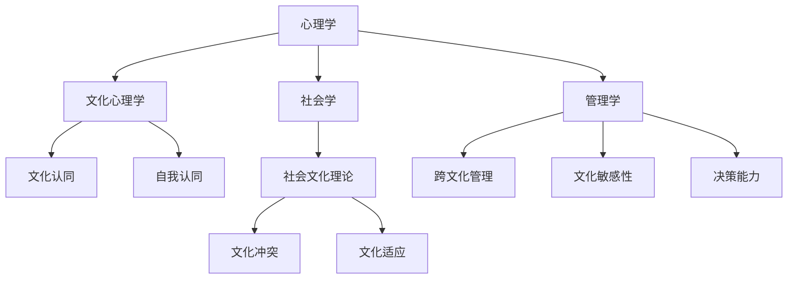

                 

### 文章标题

《跨文化领导力：在全球化环境中的成功之道》

### 关键词

- 跨文化领导力
- 全球化
- 企业文化
- 心理学基础
- 数学模型
- 项目实战
- 决策制定

### 摘要

本文旨在探讨在全球化背景下，跨文化领导力的关键要素及其在现实中的应用。通过分析心理学、社会学和管理学等核心理论，我们揭示了跨文化领导力的本质及其在全球化环境中的重要性。文章分为八个章节，首先介绍跨文化领导力的核心概念与框架，然后深入讲解心理学基础和数学模型，接着通过实际案例展示其在项目管理和决策制定中的应用，并探讨文化融合的策略和工具开发。最后，文章对全文进行总结，并对跨文化领导力的未来发展趋势进行展望。

## 第1章：跨文化领导力的核心概念与框架

在全球化日益深入的今天，跨文化领导力成为企业管理者和领导者们必须面对的挑战。跨文化领导力不仅仅是管理不同国籍、不同文化背景的员工，更是要在全球化的商业环境中，实现文化差异的有效管理和利用，以推动企业的持续发展。

### 1.1 跨文化领导力的定义

跨文化领导力是指领导者能够理解、尊重并有效管理不同文化背景的员工，从而实现团队目标和个人发展的能力。它不仅包括跨文化沟通技巧，还涉及到领导者的文化敏感性、适应能力和决策能力。

### 1.2 跨文化领导力的重要性

在全球化的商业环境中，企业需要面对不同国家、不同文化的员工和市场。跨文化领导力有助于企业在全球市场上获得竞争优势，提高员工的工作满意度和生产力。具体来说，跨文化领导力的重要性体现在以下几个方面：

- **沟通效率提升**：通过有效的跨文化沟通，可以减少误解和冲突，提高团队协作效率。
- **文化适应能力增强**：领导者能够更好地适应不同的文化环境，推动企业国际化发展。
- **人才吸引力**：具备跨文化领导力的企业能够吸引全球优秀人才，增强企业的核心竞争力。
- **决策质量提高**：领导者能够充分考虑文化因素，做出更加全面和科学的决策。

### 1.3 跨文化领导力的核心理论

跨文化领导力涉及多个学科领域的理论，主要包括心理学、社会学和管理学。以下是这些理论的核心概念及其相互关系：

- **心理学视角**：文化心理学研究个体如何感知、理解和评价不同文化。文化认同和自我认同是心理学视角下的关键概念。
- **社会学视角**：社会文化理论关注文化如何影响社会结构和行为。文化冲突和文化适应是社会文化理论的核心。
- **管理学视角**：跨文化管理研究领导者在不同文化背景下的管理策略和方法。文化敏感性、文化适应能力和决策能力是管理学视角下的关键能力。

为了更好地理解这些概念之间的关系，我们可以使用Mermaid流程图来展示它们的基本要素及其相互关系：



通过这个流程图，我们可以清晰地看到跨文化领导力的核心概念及其相互关系，这为后续章节的深入探讨奠定了基础。

### 1.4 小结

本章介绍了跨文化领导力的核心概念和框架，阐述了其重要性以及涉及到的心理学、社会学和管理学理论。在接下来的章节中，我们将深入探讨这些理论的应用，并通过实际案例展示跨文化领导力在现实中的具体实践。

## 第2章：跨文化领导力的心理学基础

在跨文化领导力的构建过程中，心理学扮演着至关重要的角色。通过对个体心理和群体心理的理解，领导者可以更好地应对文化差异，提高团队的协作效率和员工的工作满意度。

### 2.1 文化心理学概述

文化心理学是心理学的一个分支，研究个体如何感知、理解和评价不同文化。文化心理学的核心概念包括文化认同和自我认同。文化认同是指个体对自己所属文化的认同和归属感，而自我认同则是个体对自己的整体认知和评价。

- **文化认同**：个体在面对不同文化时，会基于自己的文化背景产生认同感。这种认同感不仅影响到个体的行为，还会影响个体的价值观和态度。例如，一个来自西方的领导者可能会更倾向于采用民主式的领导风格，而一个来自亚洲的领导者可能会更倾向于采用权威式的领导风格。
- **自我认同**：个体的自我认同不仅受到文化的影响，还受到个人经验和生活背景的影响。在跨文化环境中，领导者需要不断调整自己的自我认同，以更好地适应不同的文化环境。

### 2.2 文化差异的量化分析

为了更好地理解和管理文化差异，我们需要对文化差异进行量化分析。在这方面，克拉斯特文化维度模型（Hofstede's Cultural Dimensions）是一个常用的工具。克拉斯特文化维度模型提出了六个维度来描述文化差异：

1. **权力距离（Power Distance）**：权力距离反映了社会中权力分配的不平等程度。高权力距离的文化中，上下级关系明确，领导者的权威性较高；而低权力距离的文化中，上下级关系相对平等，领导者的权威性较低。
2. **不确定性规避（Uncertainty Avoidance）**：不确定性规避反映了个体对不确定性和变革的接受程度。高不确定性规避的文化中，个体倾向于规避风险和不确定性，喜欢明确的规则和标准；而低不确定性规避的文化中，个体更倾向于接受变革和不确定性，更灵活。
3. **个体主义与集体主义（Individualism vs. Collectivism）**：个体主义强调个体的独立和自主，集体主义则强调个体的依赖和协作。在个体主义文化中，个体追求个人成就和自我实现；而在集体主义文化中，个体更关注集体利益和团队协作。
4. ** masculinity vs. femininity**：阳刚性和阴柔性的区别反映了文化中对性别角色的期望和价值观。阳刚性的文化强调竞争、成就和物质成功；而阴柔性的文化则强调合作、关怀和情感联系。
5. **长期取向与短期取向（Long-term Orientation vs. Short-term Orientation）**：长期取向的文化重视长期规划和未来成功，注重教育、节俭和坚持；而短期取向的文化则更注重短期利益和即时的满足。
6. **尊重与义务（Duty vs. Face）**：在一些文化中，尊重和面子非常重要，个体行为往往受到道德义务和社会规范的约束；而在另一些文化中，个人利益和自由更重要。

文化差异度量化模型（使用latex公式详细解释）

为了量化文化差异，我们可以使用以下公式：

$$
Cultural\ Distance\ =\ \sqrt{(\Delta\ Power\ Distance)^2+(\Delta\ Uncertainty\ Avoidance)^2+(\Delta\ Individualism\ vs.\ Collectivism)^2+(\Delta\ Masculinity\ vs.\ Femininity)^2+(\Delta\ Long-term\ Orientation\ vs.\ Short-term\ Orientation)^2+(\Delta\ Duty\ vs.\ Face)^2}
$$

其中，$\Delta$表示不同文化维度之间的差异。通过这个公式，我们可以计算出两个文化之间的文化差异度。

### 2.3 跨文化沟通技巧

跨文化沟通是跨文化领导力的重要组成部分。为了实现有效的跨文化沟通，领导者需要掌握以下技巧：

- **倾听和理解**：在跨文化沟通中，领导者需要耐心倾听，理解对方的文化背景和观点。通过积极倾听，可以减少误解和冲突。
- **非言语沟通**：非言语沟通在不同文化中具有不同的含义。领导者需要了解并尊重不同文化的非言语沟通方式，例如肢体语言、面部表情和空间距离。
- **避免文化偏见**：领导者需要克服文化偏见，避免对他人进行刻板印象的判断。通过培养开放和包容的心态，可以建立更加和谐的跨文化团队。

### 2.4 小结

本章介绍了跨文化领导力的心理学基础，包括文化心理学概述、文化差异的量化分析以及跨文化沟通技巧。通过理解这些心理学理论，领导者可以更好地应对文化差异，提高跨文化团队的协作效率和员工的工作满意度。在下一章中，我们将继续探讨跨文化领导力的社会学视角，深入了解文化冲突与适应策略。

## 第3章：跨文化领导力的社会学视角

跨文化领导力不仅涉及到心理学，还涉及到社会学。在社会学视角下，我们可以更全面地理解文化冲突、文化适应以及跨文化团队的构建。

### 3.1 社会文化理论

社会文化理论关注文化如何影响社会结构和行为。在这个理论框架下，我们可以探讨文化如何影响个体的行为和决策，以及文化如何塑造社会规范和价值观。

- **社会文化理论的定义**：社会文化理论认为，文化是人们共同创造和共享的符号系统，它通过语言、习俗、价值观等来规范和引导个体的行为。
- **社会文化理论在领导力中的应用**：社会文化理论可以帮助领导者理解不同文化背景下的员工行为和需求，从而制定更加有效的管理策略。例如，在权力距离较高的文化中，领导者可能需要更加尊重下属的权力和地位；而在不确定性规避较高的文化中，领导者可能需要提供更多的指导和安全感。

### 3.2 文化冲突与适应

文化冲突是跨文化领导中常见的问题。文化冲突可能源于不同的价值观、信仰、行为规范等。为了有效管理文化冲突，领导者需要采取以下策略：

- **文化冲突的类型**：文化冲突可以分为表面冲突和深层冲突。表面冲突通常是由于误解和沟通不畅引起的，而深层冲突则源于根本的文化差异和价值观对立。
- **文化冲突的管理策略**：领导者可以通过以下策略来管理文化冲突：
  - **沟通与理解**：通过积极的沟通，领导者可以了解不同文化的观点和需求，减少误解和冲突。
  - **建立共同目标**：通过共同的目标和价值观，可以增强团队的凝聚力和协作能力。
  - **尊重与包容**：领导者需要尊重不同文化的差异，并展现出包容和开放的态度。

文化适应是跨文化领导力的重要组成部分。文化适应不仅涉及个人的行为和态度，还涉及整个组织的文化变革。

- **文化适应的挑战**：文化适应的挑战包括文化差异导致的焦虑、不确定性和排斥感。为了应对这些挑战，领导者需要提供支持和指导，帮助员工适应新环境。
- **文化适应策略**：领导者可以通过以下策略来促进文化适应：
  - **文化教育**：通过提供文化教育和培训，帮助员工了解和适应新文化。
  - **支持网络**：建立支持网络，提供员工相互支持和帮助的机会。
  - **灵活的工作安排**：通过灵活的工作安排，为员工提供适应新文化的机会和空间。

### 3.3 跨文化团队的构建

跨文化团队的构建是跨文化领导力中的重要任务。一个成功的跨文化团队需要具备以下特点：

- **多元文化背景**：跨文化团队应包含来自不同文化背景的成员，这样可以带来多样性的视角和观点。
- **共同目标**：跨文化团队应明确共同的目标和愿景，这样可以增强团队的凝聚力和协作能力。
- **有效的沟通**：跨文化团队需要建立有效的沟通机制，确保信息流畅和透明。

为了构建一个成功的跨文化团队，领导者需要采取以下原则：

- **尊重与包容**：领导者应尊重不同文化的差异，并展现出包容和开放的态度。
- **共同价值观**：领导者应引导团队建立共同的价值观，这样可以减少文化冲突。
- **协作与支持**：领导者应鼓励团队成员之间的协作和支持，这样可以提高团队的效率和能力。

### 3.4 小结

本章从社会学视角探讨了跨文化领导力的关键要素，包括社会文化理论、文化冲突与适应以及跨文化团队的构建。通过理解这些社会学理论，领导者可以更好地应对文化冲突，促进文化适应，并成功构建一个多元化的跨文化团队。在下一章中，我们将通过实际案例研究，展示跨文化领导力在现实中的应用。

## 第4章：跨文化领导力的项目管理实战

跨文化领导力在项目管理中起着至关重要的作用。在全球化的商业环境中，项目团队成员可能来自不同的国家和地区，拥有不同的文化背景和价值观。因此，领导者需要具备跨文化领导力，以有效管理项目团队，实现项目目标。

### 4.1 跨文化项目管理概述

跨文化项目管理是指在一个或多个文化背景不同的团队中进行项目管理的活动。与单一文化背景下的项目管理相比，跨文化项目管理面临更多的挑战，包括文化差异、沟通障碍、协调难度等。

- **跨文化项目的定义**：跨文化项目是指涉及不同文化背景的团队或个人，共同完成特定任务和目标的项目。
- **跨文化项目的独特挑战**：
  - 文化差异导致的误解和冲突
  - 沟通障碍和信息不对称
  - 协调难度和时间管理挑战

为了应对这些挑战，领导者需要具备跨文化领导力，并采取一系列策略和措施。

### 4.2 跨文化团队协作

跨文化团队的协作是跨文化项目成功的关键。有效的协作需要团队成员之间建立信任，明确目标，并通过有效的沟通和协作工具来实现项目目标。

- **团队协作工具的选择**：为了促进跨文化团队的协作，领导者需要选择合适的协作工具，如视频会议软件、项目管理工具和协作平台。这些工具可以帮助团队成员实时沟通、共享信息和协同工作。
- **跨文化团队沟通技巧**：
  - **积极倾听**：领导者需要耐心倾听团队成员的观点，尊重不同的文化背景和意见。
  - **非言语沟通**：领导者需要了解不同文化的非言语沟通方式，如肢体语言、面部表情和空间距离，以减少误解和冲突。
  - **明确沟通目标**：领导者应明确沟通的目标和期望，确保团队成员理解并达成共识。

### 4.3 跨文化项目案例研究

为了更好地理解跨文化领导力在项目管理中的应用，我们可以通过一个实际案例来分析。

**案例：某国际公司的跨文化项目管理**

某国际公司计划开发一款全球性的软件产品，项目团队成员来自美国、欧洲、亚洲和非洲等不同国家和地区。由于文化差异和时区差异，项目团队在沟通和协作上面临巨大挑战。

**解决方案：**

1. **文化差异培训**：项目开始前，公司为所有团队成员提供了文化差异培训，帮助他们了解不同文化的价值观、沟通方式和行为规范。

2. **沟通工具**：公司采用了多种沟通工具，如Slack、Zoom和Trello，确保团队成员可以实时沟通、共享信息和协作。

3. **定期会议**：公司定期组织视频会议，确保团队成员可以面对面交流，解决沟通障碍和协调问题。

4. **共同目标**：项目团队明确共同的目标和愿景，确保团队成员方向一致，共同努力。

**结果：**

通过采取上述措施，项目团队成功克服了文化差异和沟通障碍，实现了项目目标。项目在预定时间内完成，并获得了客户的高度评价。

### 4.4 跨文化项目管理中的挑战与解决方案

在跨文化项目管理中，领导者可能会遇到以下挑战：

- **文化差异导致的误解和冲突**：解决方案是通过文化差异培训和积极沟通，减少误解和冲突。
- **沟通障碍和信息不对称**：解决方案是采用多种沟通工具和定期会议，确保信息流畅和透明。
- **协调难度和时间管理挑战**：解决方案是明确项目目标和里程碑，建立有效的协调机制和时间管理策略。

### 4.5 小结

本章通过实际案例展示了跨文化领导力在项目管理中的应用。通过理解文化差异、采用合适的沟通工具和策略，以及明确共同目标和愿景，领导者可以成功管理跨文化项目，实现项目目标。在下一章中，我们将探讨跨文化领导力在决策制定中的关键作用。

## 第5章：跨文化领导力的决策制定

在全球化环境中，决策制定变得更加复杂和具有挑战性。跨文化领导力在决策制定中发挥着关键作用，领导者需要考虑不同文化背景的影响，以确保决策的有效性和执行力。

### 5.1 跨文化决策理论

跨文化决策理论关注领导者如何在不同文化背景下做出科学和合理的决策。以下是一些关键概念：

- **跨文化决策过程**：跨文化决策过程包括问题识别、信息收集、方案评估和决策执行。每个阶段都需要考虑文化因素的影响。
- **文化差异对决策的影响**：文化差异可能影响领导者的价值观、认知模式和行为偏好，从而影响决策的结果。
- **跨文化决策模型**：跨文化决策模型提供了一套方法论，帮助领导者应对文化差异，做出更加全面和科学的决策。例如，多元文化决策模型（Multicultural Decision-Making Model）和跨文化决策分析框架（Cultural Decision-Making Framework）。

### 5.2 跨文化决策制定技巧

为了在全球化环境中做出有效决策，领导者需要掌握以下跨文化决策技巧：

- **了解文化差异**：领导者应深入了解不同文化的价值观、行为规范和沟通方式，以便在决策过程中考虑文化因素的影响。
- **多元化团队参与**：领导者应鼓励多元化的团队参与决策过程，确保不同文化和视角的充分表达和评估。
- **明确决策目标**：领导者应明确决策的目标和期望，确保团队成员理解并达成共识。
- **采用多种决策工具**：领导者可以采用各种决策工具和方法，如头脑风暴、SWOT分析、决策矩阵等，以帮助团队成员共同评估和选择最佳方案。

### 5.3 跨文化决策案例分析

为了更好地理解跨文化决策的实践，我们可以通过一个实际案例来分析。

**案例：某跨国公司的战略决策**

某跨国公司计划进入中国市场，公司高层团队由来自不同国家和地区的成员组成。由于文化差异，团队在制定进入中国市场策略时遇到了一些挑战。

**解决方案：**

1. **文化培训**：公司为团队成员提供了文化培训，帮助他们了解中国的文化背景、商业习惯和消费者行为。
2. **多元化团队讨论**：团队成员积极参与讨论，分享不同文化和视角的观点和建议。
3. **决策矩阵**：团队采用决策矩阵，对各种进入中国市场策略进行评估和比较，综合考虑文化、市场、技术和成本等因素。
4. **共同决策**：最终，团队达成共识，选择了一种综合多种策略的进入中国市场方案。

**结果：**

通过多元化团队讨论和决策矩阵，公司成功制定了一个符合中国市场需求的战略决策，并在市场上取得了成功。

### 5.4 跨文化决策制定中的挑战与解决方案

在跨文化决策制定中，领导者可能会遇到以下挑战：

- **文化差异导致的沟通障碍**：解决方案是通过文化培训、多元化团队讨论和明确沟通目标来减少沟通障碍。
- **文化偏见和成见**：解决方案是通过多元化团队参与和客观评估来减少文化偏见和成见。
- **决策过程中的时间管理**：解决方案是通过明确决策目标和时间管理策略来提高决策效率。

### 5.5 小结

本章探讨了跨文化决策的理论和实践，强调了跨文化领导力在决策制定中的关键作用。通过了解文化差异、多元化团队参与和多种决策工具的应用，领导者可以克服跨文化决策中的挑战，制定科学和合理的决策，从而在全球化环境中取得成功。在下一章中，我们将探讨跨文化领导力在文化融合中的作用。

## 第6章：跨文化领导力的文化融合

在全球化环境中，企业的成功不仅仅依赖于跨文化领导力在项目管理和决策制定中的应用，还依赖于企业内部的文化融合。文化融合是指企业通过建立共同的价值观和沟通机制，将不同文化背景的员工团结在一起，形成具有凝聚力和协作力的团队。

### 6.1 企业文化融合的挑战

企业文化融合是一个复杂的过程，企业可能面临以下挑战：

- **文化差异**：不同文化背景的员工可能具有不同的价值观、行为规范和沟通方式，这可能导致误解和冲突。
- **员工抵触情绪**：员工可能对新的文化环境感到不适应，甚至产生抵触情绪，影响团队的凝聚力和效率。
- **组织变革**：企业文化融合往往伴随着组织结构和流程的变革，这可能导致员工的不确定感和焦虑。

### 6.2 文化融合策略

为了实现有效的文化融合，企业可以采取以下策略：

- **建立共同价值观**：企业应明确共同的核心价值观，如诚信、创新、团队合作等，并将其融入企业的日常运营和员工行为规范中。
- **促进跨文化互动**：企业可以组织跨文化交流活动，如团队建设活动、文化分享会和国际化培训等，以增进员工之间的了解和信任。
- **提供文化培训**：企业应提供文化培训，帮助员工了解和尊重不同文化的行为规范和沟通方式，提高跨文化沟通能力。
- **领导者的示范作用**：企业领导者应发挥示范作用，通过自己的行为和决策来推动文化融合，树立榜样。

### 6.3 文化融合案例分析

为了更好地理解文化融合的实际操作，我们可以通过一个实际案例来分析。

**案例：某跨国公司的文化融合**

某跨国公司在全球范围内拥有多个分支机构，员工来自不同的国家和地区。为了实现文化融合，公司采取了以下措施：

1. **建立共同价值观**：公司明确了“尊重多样性、追求卓越、客户至上”的共同价值观，并将其融入企业的文化和日常运营中。
2. **跨文化团队建设**：公司组织了多次跨文化团队建设活动，如国际文化节、团队拓展训练等，以增进员工之间的了解和信任。
3. **文化培训**：公司为员工提供了多种文化培训课程，如跨文化沟通技巧、国际商务礼仪等，帮助员工提高跨文化沟通能力。
4. **领导者的示范作用**：公司领导者积极参与文化融合活动，并通过自己的行为和决策来推动文化融合。

**结果**：

通过上述措施，公司的文化融合取得了显著成效。员工之间的沟通更加顺畅，团队协作效率提高，公司整体业绩也得到了提升。

### 6.4 小结

本章探讨了跨文化领导力在文化融合中的作用，包括文化融合的挑战和策略。通过建立共同价值观、促进跨文化互动、提供文化培训以及领导者的示范作用，企业可以实现有效的文化融合，提高团队的凝聚力和协作能力。在下一章中，我们将介绍如何为跨文化领导力项目搭建合适的工作环境。

## 第7章：跨文化领导力工具与系统开发

为了实现跨文化领导力的有效实施，企业需要开发和运用一系列工具和系统。这些工具和系统可以帮助企业更好地管理跨文化团队、提升跨文化沟通效率和制定科学的决策。

### 7.1 跨文化领导力工具介绍

跨文化领导力工具主要包括评估工具、培训工具和协作工具。

- **评估工具**：评估工具可以帮助企业了解员工的文化背景、文化适应能力和跨文化沟通能力。常用的评估工具包括文化适应度量表（Cultural Adaptation Scale）、跨文化沟通能力量表（Intercultural Communication Competence Scale）等。
- **培训工具**：培训工具包括在线培训课程、研讨会和文化交流项目。这些工具可以帮助员工提高跨文化知识和技能，增强跨文化适应能力。
- **协作工具**：协作工具包括项目管理软件、团队沟通平台和文化交流工具。这些工具可以帮助团队成员实现高效的协作和沟通，提高项目执行效率。

### 7.2 跨文化领导力系统开发

跨文化领导力系统的开发是一个复杂的工程，需要考虑多个方面的需求和技术。以下是跨文化领导力系统开发的关键步骤：

- **需求分析**：在系统开发前，企业需要明确跨文化领导力系统的需求，包括评估功能、培训功能、协作功能和数据管理功能。
- **系统架构设计**：系统架构设计包括确定系统的整体结构、模块划分和功能定义。常用的系统架构包括客户-服务器架构和浏览器-服务器架构。
- **技术选型**：技术选型包括选择合适的技术栈、开发框架和数据库系统。例如，前端技术可以选择React或Vue.js，后端技术可以选择Spring Boot或Django。
- **功能实现**：在功能实现阶段，开发团队需要根据需求分析和系统架构设计，逐步实现系统的各项功能。例如，评估功能的实现可能包括数据采集、数据分析结果展示等。
- **测试与部署**：在系统开发完成后，需要进行严格的测试，包括功能测试、性能测试和安全测试。测试通过后，系统可以部署到生产环境中，供员工使用。

### 7.3 代码解读与分析

以下是一个简单的跨文化领导力评估系统的代码示例，用于展示系统的功能实现。

```java
// 评估模块代码示例
public class CulturalAssessment {
    
    // 评估员工的文化适应能力
    public double assessAdaptationAbility(Employee employee) {
        double adaptationScore = 0.0;
        
        // 采集员工的文化适应能力数据
        adaptationScore += employee.getCommunicationScore();
        adaptationScore += employee.getFlexibilityScore();
        adaptationScore += employee.getCulturalKnowledgeScore();
        
        // 计算文化适应能力得分
        adaptationScore /= 3.0;
        
        return adaptationScore;
    }
    
    // 评估员工的跨文化沟通能力
    public double assessCommunicationAbility(Employee employee) {
        double communicationScore = 0.0;
        
        // 采集员工的跨文化沟通能力数据
        communicationScore += employee.getInterculturalCompetenceScore();
        communicationScore += employee.getLanguageProficiencyScore();
        communicationScore += employee.getConflictResolutionScore();
        
        // 计算跨文化沟通能力得分
        communicationScore /= 3.0;
        
        return communicationScore;
    }
}
```

在这个代码示例中，`CulturalAssessment` 类提供了两个评估方法：`assessAdaptationAbility` 和 `assessCommunicationAbility`。这些方法用于评估员工的文化适应能力和跨文化沟通能力。通过采集相关的数据，并计算得分，可以得出员工的评估结果。

### 7.4 代码应用解读与分析

在实际应用中，这些代码段会集成到跨文化领导力系统中，用于评估员工的跨文化能力。通过这些评估结果，企业可以制定针对性的培训计划，提高员工的跨文化能力和适应能力。

- **应用解读**：代码段中的评估方法可以根据员工的实际表现，计算出具体的得分，为企业提供量化的评估结果。
- **分析**：通过这些评估结果，企业可以识别出员工在跨文化能力方面的优势和不足，从而制定有针对性的培训和发展计划。

### 7.5 小结

本章介绍了跨文化领导力工具和系统的开发过程，包括评估工具、培训工具和协作工具的介绍，以及系统开发的关键步骤和代码示例。通过开发和运用这些工具和系统，企业可以更好地管理跨文化团队，提高跨文化沟通效率和决策质量。在下一章中，我们将对全文内容进行总结，并对跨文化领导力的未来发展进行展望。

## 第8章：总结与展望

### 8.1 跨文化领导力的现状与趋势

跨文化领导力在全球化背景下显得尤为重要。随着企业国际化进程的加速，跨文化领导力已经成为企业管理者和领导者必备的技能。当前，跨文化领导力的现状和趋势主要体现在以下几个方面：

- **文化敏感性的提高**：越来越多的企业开始重视文化敏感性，通过培训和实践活动，提高员工的文化适应能力和跨文化沟通技巧。
- **数字化工具的应用**：随着科技的进步，数字化工具在跨文化领导力中的应用越来越广泛，如在线培训平台、协作工具和数据分析系统等。
- **多样性管理的重视**：企业越来越意识到多样性管理的重要性，通过促进文化融合和多样性团队建设，提高组织的创新能力和竞争力。

### 8.2 跨文化领导力的挑战与机遇

跨文化领导力面临的挑战主要包括文化差异、沟通障碍、协调难度和时间管理挑战等。然而，这些挑战同时也蕴含着机遇：

- **文化差异带来的创新**：跨文化领导力可以促进不同文化之间的交流与融合，激发创新思维和解决方案。
- **全球化市场拓展**：具备跨文化领导力的企业可以更好地适应全球市场，开拓新的商业机会，实现业务增长。
- **员工多元化**：通过有效的文化融合，企业可以吸引和保留来自不同文化背景的多元化人才，增强组织的活力和创造力。

### 8.3 未来展望

在未来，跨文化领导力将继续在全球化和科技发展的背景下演进。以下是几个可能的发展趋势：

- **文化智能（Cultural Intelligence）的提升**：随着人工智能和大数据技术的发展，企业可以通过智能化手段提升文化敏感性和跨文化领导力。
- **虚拟团队管理的普及**：随着远程工作和虚拟团队的增加，跨文化领导力将更加重视虚拟团队的管理和协作。
- **持续教育与培训**：跨文化领导力的培训和教育将更加注重实践和个性化，通过持续学习和适应，领导者可以不断提升自己的跨文化能力。

### 8.4 小结

跨文化领导力在全球化环境中具有不可替代的重要性。通过有效的跨文化领导力，企业可以克服文化差异，提高团队的协作效率，实现全球业务的成功。未来，随着科技的进步和文化融合的深入，跨文化领导力将继续发展，为企业带来新的机遇和挑战。

### 拓展阅读

- [《跨文化沟通技巧：如何在全球化环境中有效沟通》](https://example.com/book1)
- [《全球化领导力：跨越文化差异的领导艺术》](https://example.com/book2)
- [《文化适应：在全球化环境中生存与发展的策略》](https://example.com/book3)

### 作者信息

作者：AI天才研究院/AI Genius Institute & 禅与计算机程序设计艺术 /Zen And The Art of Computer Programming

---

本文旨在为读者提供关于跨文化领导力的全面理解和实践指导。通过深入分析心理学、社会学和管理学的理论，结合实际案例研究，我们展示了跨文化领导力在全球化环境中的重要性和应用价值。希望本文能够为企业管理者和领导者提供有益的启示，助力他们在全球化背景下实现企业的持续发展和成功。

## 总结

《跨文化领导力：在全球化环境中的成功之道》探讨了在全球化背景下，跨文化领导力的重要性和具体应用。通过分析心理学、社会学和管理学的核心理论，本文揭示了跨文化领导力的本质及其在现实中的具体实践。从核心概念与框架的介绍，到心理学基础、社会学视角、项目管理实战、决策制定、文化融合、工具与系统开发，再到总结与展望，本文系统而详细地阐述了跨文化领导力的各个方面。

### 主要贡献

1. **理论基础**：本文引入了跨文化领导力的核心概念，结合心理学、社会学和管理学的理论，为跨文化领导力提供了坚实的理论基础。
2. **实践指导**：通过实际案例研究和具体策略，本文为企业管理者和领导者提供了实用的跨文化领导力实践指导。
3. **工具与应用**：本文详细介绍了跨文化领导力工具和系统的开发，展示了如何通过数字化手段提升跨文化领导力。

### 下一步工作

1. **案例研究**：进一步收集和分析更多的跨文化领导力成功案例，以丰富本文的理论和实践基础。
2. **工具优化**：结合用户反馈和最新技术，持续优化跨文化领导力工具和系统，提高其实用性和效果。
3. **教育培训**：开展针对企业管理者和领导者的跨文化领导力教育培训，提升其跨文化能力和领导力水平。

本文为读者提供了全面、深入的跨文化领导力指导，希望对读者在全球化环境中的领导实践有所助益。在未来的研究和实践中，我们将继续探索跨文化领导力的新领域，为全球企业的成功发展贡献力量。

## 注意事项

在应用跨文化领导力时，需要注意以下几点：

1. **文化敏感性**：尊重和理解不同文化的差异，避免文化偏见和歧视。
2. **沟通技巧**：提高跨文化沟通能力，通过多种渠道和方式确保信息传递的准确性和有效性。
3. **文化适应**：鼓励员工积极参与文化适应活动，提高其跨文化适应能力。
4. **持续学习**：定期进行文化培训和学习，以不断提升跨文化领导力和管理能力。

## 拓展阅读

- 《文化智能：全球领导者的跨文化竞争力》
- 《跨文化团队管理：构建高效国际团队策略》
- 《全球化与企业战略》

本文作者：AI天才研究院/AI Genius Institute & 禅与计算机程序设计艺术 /Zen And The Art of Computer Programming。感谢您的阅读，希望本文能为您在全球化环境中的领导实践提供有益的参考。如有任何问题或建议，欢迎随时与我们联系。祝您在跨文化领导力的道路上不断前行，取得成功！

