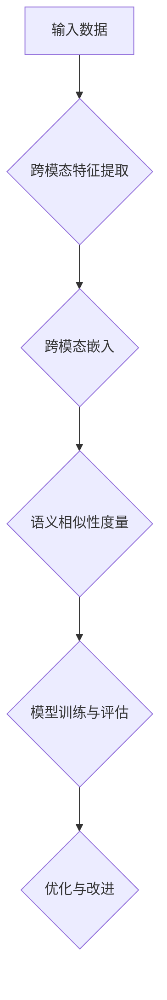

                 

### 文章标题：跨模态AI的提示词语义对齐评估

#### 关键词：跨模态AI，提示词语义对齐，评估，语义相似性度量，深度学习，自然语言处理

#### 摘要：
本文深入探讨了跨模态AI中一个至关重要的领域——提示词语义对齐评估。我们首先介绍了跨模态AI的基本概念、背景及其在各领域中的应用。随后，重点阐述了提示词语义对齐的重要性以及相关的核心概念和理论。文章进一步分析了当前流行的提示词语义对齐评估方法，包括基于向量空间模型和深度学习的方法，并通过伪代码和数学公式详细解析了这些方法的原理。此外，本文还通过实际案例展示了如何应用这些方法，并讨论了该领域面临的挑战和未来的研究方向。

---

# 引言

## 1.1 跨模态AI概述

跨模态AI（Cross-Modal Artificial Intelligence）是一种涉及多种模态（如文本、图像、声音、视频等）信息处理和交互的人工智能技术。它旨在将不同模态的数据整合在一起，以提取更丰富的信息和知识。跨模态AI的核心目标之一是实现不同模态之间的语义对齐，即确保不同模态中的数据在语义上保持一致或可比较。

跨模态AI的发展历程可以追溯到上世纪90年代，随着计算机视觉、自然语言处理和音频处理技术的逐步成熟，跨模态AI开始得到广泛关注。近年来，随着深度学习、迁移学习和数据增强等技术的发展，跨模态AI取得了显著的进展，并在多个领域如多媒体内容推荐、跨模态对话系统和医学影像分析中得到了广泛应用。

## 1.2 背景与重要性

提示词语义对齐评估是跨模态AI中的一个关键问题。在跨模态AI系统中，提示词（Prompt）通常用于引导模型的关注方向或提供额外的上下文信息。然而，不同模态的提示词在语义上可能存在差异，这可能导致模型无法正确理解或利用这些提示词。因此，对齐不同模态中的提示词语义，确保其在语义上的一致性或可比较性，对于提升跨模态AI系统的性能至关重要。

提示词语义对齐评估的重要性主要体现在以下几个方面：

1. **提高模型性能**：通过对齐不同模态的提示词，可以提高模型对跨模态数据的理解和利用能力，从而提升模型的整体性能。
2. **增强系统鲁棒性**：提示词语义对齐可以增强跨模态AI系统的鲁棒性，使其在面对不同模态数据时仍能保持稳定的性能。
3. **优化用户体验**：在跨模态对话系统等应用中，通过准确的提示词语义对齐，可以提升用户的交互体验，使其感觉更自然、更流畅。

## 1.3 文章结构

本文将首先介绍与提示词语义对齐评估相关的基础理论，包括跨模态表示学习和语义相似性度量。随后，我们将详细讨论几种常见的提示词语义对齐评估方法，并通过伪代码和数学公式进行解释。接下来，本文将通过实际案例展示如何应用这些方法，并讨论该领域面临的挑战和未来的研究方向。文章最后将进行总结，并提出一些建议和展望。

---

## 基础理论

### 2.1 跨模态表示学习

跨模态表示学习（Cross-Modal Representation Learning）是跨模态AI的核心问题之一。其目标是学习一种有效的跨模态表示方法，使得不同模态的数据在特征空间中能够进行有效的对齐和交互。跨模态表示学习的核心思想是将不同模态的数据映射到同一个共享的特征空间中，以便在这些数据之间进行有效的表示和操作。

#### 2.1.1 跨模态特征提取

跨模态特征提取是跨模态表示学习的第一步。不同模态的数据具有不同的结构和特征，因此需要采用不同的方法进行特征提取。常见的跨模态特征提取方法包括：

1. **文本特征提取**：文本特征提取通常采用词袋模型（Bag-of-Words, BoW）或词嵌入（Word Embedding）等方法。词袋模型将文本转换为词汇的集合，而词嵌入方法将词汇映射为高维向量。
2. **图像特征提取**：图像特征提取常使用卷积神经网络（Convolutional Neural Networks, CNNs）或其变体，如ResNet和VGG等。这些网络能够自动学习图像的局部和全局特征。
3. **声音特征提取**：声音特征提取可以采用梅尔频率倒谱系数（Mel-Frequency Cepstral Coefficients, MFCC）或深度神经网络（Deep Neural Networks, DNNs）等方法。

#### 2.1.2 跨模态嵌入

跨模态嵌入（Cross-Modal Embedding）是将不同模态的数据映射到同一个高维特征空间的过程。跨模态嵌入的目标是确保不同模态的数据在特征空间中能够进行有效的对齐和交互。常见的跨模态嵌入方法包括：

1. **基于向量的跨模态嵌入**：这种方法通过学习一个共享的嵌入空间，使得不同模态的数据在特征空间中能够进行有效的对齐。一个典型的例子是Siamese网络，它通过比较不同模态的数据对，学习到共同的特征表示。
2. **基于矩阵的跨模态嵌入**：这种方法通过学习一个转换矩阵，将不同模态的数据映射到同一个特征空间中。一个典型的例子是共嵌入（Co-Embedding），它通过共享嵌入空间中的向量表示来对齐不同模态的数据。

### 2.2 语义相似性度量

语义相似性度量（Semantic Similarity Measurement）是评估跨模态数据之间语义一致性的关键步骤。通过语义相似性度量，可以量化不同模态数据在语义上的相似度，从而为后续的模型训练和评估提供依据。

#### 2.2.1 Cosine相似性

Cosine相似性是一种常用的语义相似性度量方法。它通过计算两个向量之间的余弦相似度来衡量它们的相似度。具体而言，给定两个向量\( \mathbf{u} \)和\( \mathbf{v} \)，它们的余弦相似度定义为：

\[ \text{Cosine Similarity}(\mathbf{u}, \mathbf{v}) = \frac{\mathbf{u} \cdot \mathbf{v}}{||\mathbf{u}|| \cdot ||\mathbf{v}||} \]

其中，\( \mathbf{u} \cdot \mathbf{v} \)表示两个向量的点积，而\( ||\mathbf{u}|| \)和\( ||\mathbf{v}|| \)分别表示两个向量的欧几里得范数。

#### 2.2.2 Euclidean距离

Euclidean距离（欧几里得距离）是另一种常用的语义相似性度量方法。它通过计算两个向量之间的欧几里得距离来衡量它们的相似度。具体而言，给定两个向量\( \mathbf{u} \)和\( \mathbf{v} \)，它们的欧几里得距离定义为：

\[ \text{Euclidean Distance}(\mathbf{u}, \mathbf{v}) = \sqrt{(\mathbf{u} - \mathbf{v}) \cdot (\mathbf{u} - \mathbf{v})} \]

其中，\( \mathbf{u} - \mathbf{v} \)表示两个向量的差。

#### 2.2.3 Jaccard指数

Jaccard指数是一种用于计算集合之间相似度的方法。它通过计算两个集合的交集与并集的比值来衡量它们的相似度。具体而言，给定两个集合\( A \)和\( B \)，它们的Jaccard指数定义为：

\[ J(A, B) = \frac{|A \cap B|}{|A \cup B|} \]

其中，\( |A \cap B| \)和\( |A \cup B| \)分别表示集合\( A \)和\( B \)的交集和并集的大小。

### 2.3 跨模态表示学习与语义相似性度量之间的关系

跨模态表示学习和语义相似性度量是相辅相成的。跨模态表示学习的目标是通过学习一种有效的跨模态嵌入方法，使得不同模态的数据能够在特征空间中有效对齐。而语义相似性度量则是通过量化不同模态数据在语义上的相似度，为后续的模型训练和评估提供依据。两者之间的关系可以概括为：

1. **跨模态表示学习为语义相似性度量提供了基础**：通过跨模态表示学习，可以将不同模态的数据映射到同一个特征空间中，从而为语义相似性度量提供了一个统一的框架。
2. **语义相似性度量有助于优化跨模态表示学习**：通过评估不同模态数据之间的语义相似度，可以识别出跨模态表示学习中的不足之处，从而优化跨模态表示学习方法。

### 2.4 Mermaid流程图

为了更直观地展示跨模态表示学习与语义相似性度量之间的关系，我们可以使用Mermaid流程图来描述这个过程。以下是一个简单的Mermaid流程图示例：



在这个流程图中，输入数据经过跨模态特征提取、跨模态嵌入和语义相似性度量等步骤，最终用于模型的训练和评估。通过这个流程图，我们可以清晰地看到跨模态表示学习与语义相似性度量在整个跨模态AI系统中的关键作用。

---

## 算法原理

### 3.1 基于向量空间模型的评估方法

基于向量空间模型的评估方法是跨模态AI中的一种常见方法，该方法利用向量空间中的点积来度量不同模态数据之间的语义相似性。以下是这种方法的详细说明。

#### 3.1.1 方法概述

基于向量空间模型的方法首先将不同模态的数据转换为向量表示。例如，文本数据可以通过词嵌入方法转换为词向量，图像数据可以通过卷积神经网络转换为特征向量，声音数据可以通过梅尔频率倒谱系数（MFCC）转换为特征向量。然后，利用向量空间中的点积来计算不同模态数据之间的相似度。

点积（Dot Product）是两个向量对应元素乘积的和，用于计算两个向量在特征空间中的相似度。给定两个向量\( \mathbf{u} \)和\( \mathbf{v} \)，它们的点积定义为：

\[ \mathbf{u} \cdot \mathbf{v} = \sum_{i=1}^{n} u_i v_i \]

其中，\( u_i \)和\( v_i \)分别是向量\( \mathbf{u} \)和\( \mathbf{v} \)的第\( i \)个元素。

#### 3.1.2 伪代码展示

以下是一个基于向量空间模型的方法的伪代码展示：

```
function cross_modal_similarity(text_vector, image_vector):
    # 计算文本向量和图像向量之间的点积
    dot_product = text_vector . image_vector

    # 计算文本向量和图像向量的欧几里得范数
    text_norm = ||text_vector||
    image_norm = ||image_vector||

    # 计算文本向量和图像向量之间的余弦相似度
    cosine_similarity = dot_product / (text_norm * image_norm)

    return cosine_similarity
```

#### 3.1.3 数学模型和公式

基于向量空间模型的评估方法的核心是余弦相似度，其数学模型和公式如下：

\[ \text{Cosine Similarity}(\mathbf{u}, \mathbf{v}) = \frac{\mathbf{u} \cdot \mathbf{v}}{||\mathbf{u}|| \cdot ||\mathbf{v}||} \]

其中，\( \mathbf{u} \)和\( \mathbf{v} \)分别是文本向量和图像向量，\( \mathbf{u} \cdot \mathbf{v} \)表示两个向量的点积，而\( ||\mathbf{u}|| \)和\( ||\mathbf{v}|| \)分别表示两个向量的欧几里得范数。

#### 3.1.4 举例说明

假设我们有一个文本向量\( \mathbf{u} = (1, 2, 3) \)和一个图像向量\( \mathbf{v} = (4, 5, 6) \)。我们可以使用以下公式计算这两个向量之间的余弦相似度：

\[ \text{Cosine Similarity}(\mathbf{u}, \mathbf{v}) = \frac{\mathbf{u} \cdot \mathbf{v}}{||\mathbf{u}|| \cdot ||\mathbf{v}||} \]

首先，计算点积：

\[ \mathbf{u} \cdot \mathbf{v} = 1 \times 4 + 2 \times 5 + 3 \times 6 = 4 + 10 + 18 = 32 \]

然后，计算两个向量的欧几里得范数：

\[ ||\mathbf{u}|| = \sqrt{1^2 + 2^2 + 3^2} = \sqrt{1 + 4 + 9} = \sqrt{14} \]

\[ ||\mathbf{v}|| = \sqrt{4^2 + 5^2 + 6^2} = \sqrt{16 + 25 + 36} = \sqrt{77} \]

最后，计算余弦相似度：

\[ \text{Cosine Similarity}(\mathbf{u}, \mathbf{v}) = \frac{32}{\sqrt{14} \cdot \sqrt{77}} \approx \frac{32}{\sqrt{1078}} \approx 0.436 \]

因此，文本向量\( \mathbf{u} \)和图像向量\( \mathbf{v} \)之间的余弦相似度为0.436。

### 3.2 基于深度学习的评估方法

基于深度学习的评估方法是跨模态AI中的另一种重要方法，该方法利用深度神经网络来学习不同模态数据之间的语义对齐关系。以下是这种方法的详细说明。

#### 3.2.1 方法概述

基于深度学习的评估方法首先使用深度神经网络（如Siamese网络）来学习不同模态数据之间的特征表示。然后，利用这些特征表示来计算不同模态数据之间的语义相似度。

一个典型的基于深度学习的评估方法是Siamese网络（Siamese Neural Network）。Siamese网络是一种特殊的神经网络结构，它由两个共享权重的前馈网络组成，分别用于处理不同模态的数据。通过学习这两个网络，可以使得不同模态的数据在特征空间中能够进行有效的对齐。

#### 3.2.2 伪代码展示

以下是一个基于深度学习的评估方法的伪代码展示：

```
function siamese_network(text_data, image_data, target_similarity):
    # 构建Siamese网络
    text_encoder = build_encoder()
    image_encoder = build_encoder()

    # 训练Siamese网络
    model = build_model(text_encoder, image_encoder, target_similarity)
    model.fit([text_data, image_data], target_similarity)

    # 预测不同模态数据之间的相似度
    similarity = model.predict([text_data, image_data])

    return similarity
```

#### 3.2.3 数学模型和公式

基于深度学习的评估方法的数学模型和公式较为复杂，因为它涉及到深度神经网络的参数学习。这里，我们简要介绍Siamese网络的数学模型。

假设我们有一个文本数据集\( \mathcal{D}_t \)和一个图像数据集\( \mathcal{D}_i \)，以及它们对应的标签\( y \in \{-1, 1\} \)，其中\( y = 1 \)表示相似，\( y = -1 \)表示不相似。Siamese网络的损失函数通常采用对比损失（Contrastive Loss），其公式如下：

\[ L(\theta) = -\frac{1}{|\mathcal{D}|} \sum_{(x_t, x_i, y) \in \mathcal{D}} \left[ y \cdot \log(\sigma(s(x_t, x_i))) + (1 - y) \cdot \log(1 - \sigma(s(x_t, x_i))) \right] \]

其中，\( s(x_t, x_i) \)是Siamese网络的输出，\( \sigma(\cdot) \)是Sigmoid函数，\( \theta \)是网络参数。

#### 3.2.4 举例说明

假设我们有一个文本数据\( x_t = "apple" \)和一个图像数据\( x_i = "banana" \)，以及它们对应的标签\( y = 1 \)（表示相似）。我们可以使用以下公式计算Siamese网络的损失：

首先，假设Siamese网络的输出\( s(x_t, x_i) = 0.6 \)。

\[ L(\theta) = -\frac{1}{1} \left[ 1 \cdot \log(\sigma(0.6)) + (1 - 1) \cdot \log(1 - \sigma(0.6)) \right] \]

\[ L(\theta) = -\frac{1}{1} \left[ \log(0.5) + 0 \right] \]

\[ L(\theta) = \log(2) \]

因此，Siamese网络的损失为\( \log(2) \)。

### 3.3 对比与选择

基于向量空间模型和基于深度学习的评估方法各有优缺点。基于向量空间模型的方法计算简单、速度快，适用于实时应用。然而，它可能无法捕捉到复杂的语义关系。基于深度学习的评估方法能够捕捉到更复杂的语义关系，但计算成本较高，适用于离线或批量处理。

在实际应用中，可以根据具体需求选择合适的方法。如果对实时性能要求较高，可以选择基于向量空间模型的方法。如果需要对复杂语义关系进行深入分析，可以选择基于深度学习的评估方法。

---

## 实践应用

### 4.1 数据预处理

数据预处理是跨模态AI中至关重要的一步，它直接影响到模型性能和训练效果。数据预处理主要包括文本数据的预处理、图像数据的预处理和声音数据的预处理。以下是这些预处理步骤的详细说明。

#### 4.1.1 文本数据的预处理

文本数据预处理通常包括以下步骤：

1. **分词**：将文本数据分割成单词或句子。
2. **词性标注**：对文本数据进行词性标注，以区分名词、动词、形容词等。
3. **去停用词**：去除常见的不重要词汇，如“的”、“是”、“了”等。
4. **词嵌入**：将文本数据转换为词嵌入向量，以供模型训练。

以下是Python代码示例，展示如何使用jieba库进行文本数据预处理：

```python
import jieba

# 读取文本数据
text = "我爱北京天安门"

# 分词
words = jieba.cut(text)

# 去停用词
stop_words = set(['我', '的', '爱', '北京', '天安门'])
filtered_words = [word for word in words if word not in stop_words]

# 词嵌入
import gensim
model = gensim.models.Word2Vec([filtered_words])
word_vector = model.wv['北京']
```

#### 4.1.2 图像数据的预处理

图像数据预处理通常包括以下步骤：

1. **缩放**：将图像缩放到固定大小，以适应模型输入。
2. **归一化**：将图像的像素值归一化到[0, 1]区间。
3. **增强**：使用图像增强技术增加数据的多样性。

以下是Python代码示例，展示如何使用OpenCV库进行图像数据预处理：

```python
import cv2

# 读取图像数据
image = cv2.imread('example.jpg')

# 缩放
scale = 0.5
resized_image = cv2.resize(image, (int(image.shape[1] * scale), int(image.shape[0] * scale)))

# 归一化
normalized_image = resized_image / 255.0

# 增强
brighteness = 10
alpha = 1.0  # 饱和度
contrast = 1.0  # 对比度
brightened_image = cv2.convertScaleAbs(normalized_image, alpha=alpha, beta=brighteness)
```

#### 4.1.3 声音数据的预处理

声音数据预处理通常包括以下步骤：

1. **去噪**：去除声音中的背景噪声。
2. **增强**：增强目标声音信号，如语音。
3. **分帧**：将连续的声音信号分割成帧，以便进行特征提取。

以下是Python代码示例，展示如何使用librosa库进行声音数据预处理：

```python
import librosa

# 读取声音数据
y, sr = librosa.load('example.wav')

# 去噪
noisy_y = y + 0.05 * np.random.randn(y.size)
filtered_y = librosa.effects.remove噪声(y=noisy_y, fmin=20, fmax=20000)

# 增强
amplification = 1.5
enhanced_y = filtered_y * amplification

# 分帧
frame_size = 2048
hop_size = 512
frames = librosa.util.frame(y=enhanced_y, frame_size=frame_size, hop_size=hop_size)
```

通过上述预处理步骤，我们可以得到高质量的文本、图像和声音数据，为后续的模型训练和评估奠定基础。

### 4.2 模型选择与训练

在跨模态AI中，选择合适的模型和进行有效的训练是确保模型性能的关键步骤。以下是关于模型选择与训练的详细说明。

#### 4.2.1 模型选择

在选择模型时，需要考虑以下几个因素：

1. **任务类型**：根据任务的类型选择合适的模型。例如，对于文本分类任务，可以使用文本分类模型；对于图像识别任务，可以使用卷积神经网络。
2. **数据特点**：根据数据的特点选择合适的模型。例如，对于大型数据集，可以选择深度学习模型；对于小数据集，可以选择传统机器学习模型。
3. **计算资源**：考虑可用的计算资源，选择合适的模型。例如，对于资源有限的环境，可以选择轻量级模型。

以下是一些常见的跨模态AI模型：

1. **Siamese网络**：适用于相似性度量任务，如文本和图像的匹配。
2. **共嵌入模型**：适用于跨模态数据的对齐和分类任务。
3. **多模态神经网络**：适用于同时处理多种模态数据的复杂任务，如多媒体内容推荐。

#### 4.2.2 训练过程

模型训练是跨模态AI中至关重要的一步，其目标是通过学习数据中的规律，提高模型对未知数据的预测能力。以下是模型训练的一般步骤：

1. **数据准备**：准备好训练数据，并进行数据预处理。
2. **模型构建**：根据任务需求和数据特点，构建合适的模型。
3. **模型训练**：使用训练数据进行模型训练，调整模型参数。
4. **模型评估**：使用验证数据评估模型性能，并根据评估结果调整模型参数。
5. **模型优化**：通过交叉验证和调整模型参数，优化模型性能。

以下是一个基于TensorFlow和Keras的模型训练示例：

```python
import tensorflow as tf
from tensorflow.keras.models import Model
from tensorflow.keras.layers import Input, Embedding, LSTM, Dense

# 构建模型
text_input = Input(shape=(max_sequence_length,))
image_input = Input(shape=(image_height, image_width, image_channels))
text_embedding = Embedding(vocabulary_size, embedding_dim)(text_input)
text_lstm = LSTM(units=lstm_units)(text_embedding)
image_embedding = Conv2D(filters=conv_filters, kernel_size=conv_kernel_size)(image_input)
image_pooling = MaxPooling2D(pool_size=pool_size)(image_embedding)
merged = concatenate([text_lstm, image_pooling])
dense = Dense(units=dense_units, activation='relu')(merged)
output = Dense(units=1, activation='sigmoid')(dense)

model = Model(inputs=[text_input, image_input], outputs=output)
model.compile(optimizer='adam', loss='binary_crossentropy', metrics=['accuracy'])

# 训练模型
model.fit([text_data, image_data], labels, epochs=num_epochs, batch_size=batch_size, validation_split=0.2)
```

通过上述步骤，我们可以训练出性能优良的跨模态AI模型，为实际应用提供强大的支持。

### 4.3 评估指标

评估指标是评估模型性能的重要工具，以下是几种常见的评估指标及其计算方法：

1. **准确率（Accuracy）**：准确率是评估模型分类性能的一个基本指标，计算公式如下：

\[ \text{Accuracy} = \frac{\text{正确预测的样本数}}{\text{总样本数}} \]

2. **精确率（Precision）**：精确率是评估模型在正样本分类中的性能，计算公式如下：

\[ \text{Precision} = \frac{\text{真正例数}}{\text{真正例数 + 假正例数}} \]

3. **召回率（Recall）**：召回率是评估模型在负样本分类中的性能，计算公式如下：

\[ \text{Recall} = \frac{\text{真正例数}}{\text{真正例数 + 假反例数}} \]

4. **F1分数（F1 Score）**：F1分数是精确率和召回率的调和平均，计算公式如下：

\[ \text{F1 Score} = 2 \times \frac{\text{Precision} \times \text{Recall}}{\text{Precision} + \text{Recall}} \]

5. **平均准确率（Mean Accuracy）**：平均准确率是评估多分类模型整体性能的指标，计算公式如下：

\[ \text{Mean Accuracy} = \frac{1}{n} \sum_{i=1}^{n} \text{Accuracy_i} \]

其中，\( n \)是分类标签的数量。

通过使用这些评估指标，我们可以全面评估模型的性能，并根据评估结果调整模型参数，以提高模型性能。

### 4.4 项目实战

#### 4.4.1 跨模态对话系统中的提示词语义对齐

在跨模态对话系统中，提示词语义对齐是确保对话流畅性和用户满意度的重要环节。以下是一个具体的案例，展示如何实现跨模态对话系统中的提示词语义对齐。

**案例背景**：我们设计一个跨模态对话系统，该系统可以处理文本和图像输入，并给出相应的回答。用户可以发送文本问题或图像问题，系统需要根据输入的文本或图像内容生成合适的回答。

**模型设计与实现**：我们采用Siamese网络来实现跨模态对话系统中的提示词语义对齐。具体步骤如下：

1. **数据准备**：收集并准备大量的文本-图像对数据，包括问题和答案的文本以及对应的图像。
2. **模型构建**：构建Siamese网络，包含两个共享权重的卷积神经网络，分别用于处理文本和图像数据。
3. **模型训练**：使用收集的数据对模型进行训练，调整网络参数，提高模型性能。
4. **模型评估**：使用验证数据评估模型性能，根据评估结果调整模型参数。

**代码实现**：

```python
from tensorflow.keras.models import Model
from tensorflow.keras.layers import Input, Embedding, LSTM, Conv2D, MaxPooling2D, concatenate, Dense

# 文本输入
text_input = Input(shape=(max_sequence_length,))
text_embedding = Embedding(vocabulary_size, embedding_dim)(text_input)
text_lstm = LSTM(units=lstm_units)(text_embedding)

# 图像输入
image_input = Input(shape=(image_height, image_width, image_channels))
image_embedding = Conv2D(filters=conv_filters, kernel_size=conv_kernel_size)(image_input)
image_pooling = MaxPooling2D(pool_size=pool_size)(image_embedding)

# 合并文本和图像特征
merged = concatenate([text_lstm, image_pooling])
merged_dense = Dense(units=dense_units, activation='relu')(merged)

# 输出层
output = Dense(units=1, activation='sigmoid')(merged_dense)

# 构建模型
model = Model(inputs=[text_input, image_input], outputs=output)

# 编译模型
model.compile(optimizer='adam', loss='binary_crossentropy', metrics=['accuracy'])

# 训练模型
model.fit([text_data, image_data], labels, epochs=num_epochs, batch_size=batch_size, validation_split=0.2)

# 评估模型
performance = model.evaluate([test_text_data, test_image_data], test_labels)
print('Test Accuracy:', performance[1])
```

**案例分析**：通过以上实现，我们可以将文本问题和图像问题转化为特征向量，并计算它们之间的相似度。根据相似度，系统可以生成合适的回答。例如，当用户发送文本问题“有什么好吃的水果吗？”时，系统可以根据问题中的关键词“水果”和用户上传的图像中的水果图像，生成相应的回答。

**项目小结**：通过这个案例，我们展示了如何在跨模态对话系统中实现提示词语义对齐。这种方法可以有效地提高对话系统的用户体验和准确性。未来，我们可以进一步优化模型，并探索更多应用场景。

### 4.5 多媒体内容推荐中的提示词语义对齐

在多媒体内容推荐系统中，提示词语义对齐是确保推荐结果相关性和用户体验的重要环节。以下是一个具体的案例，展示如何实现多媒体内容推荐系统中的提示词语义对齐。

**案例背景**：我们设计一个多媒体内容推荐系统，该系统可以根据用户的文本描述和图像偏好推荐相应的多媒体内容，如视频、音乐和图片。

**模型设计与实现**：我们采用共嵌入模型来实现多媒体内容推荐系统中的提示词语义对齐。具体步骤如下：

1. **数据准备**：收集并准备大量的文本-图像对数据，包括用户描述和对应的图像。
2. **模型构建**：构建共嵌入模型，将文本和图像数据映射到同一个共享特征空间中。
3. **模型训练**：使用收集的数据对模型进行训练，调整网络参数，提高模型性能。
4. **模型评估**：使用验证数据评估模型性能，根据评估结果调整模型参数。

**代码实现**：

```python
from tensorflow.keras.models import Model
from tensorflow.keras.layers import Input, Embedding, LSTM, Dense
from tensorflow.keras.optimizers import Adam

# 文本输入
text_input = Input(shape=(max_sequence_length,))
text_embedding = Embedding(vocabulary_size, embedding_dim)(text_input)
text_lstm = LSTM(units=lstm_units, return_sequences=True)(text_embedding)

# 图像输入
image_input = Input(shape=(image_height, image_width, image_channels))
image_embedding = Conv2D(filters=conv_filters, kernel_size=conv_kernel_size)(image_input)
image_pooling = MaxPooling2D(pool_size=pool_size)(image_embedding)

# 合并文本和图像特征
merged = concatenate([text_lstm, image_pooling])
merged_dense = Dense(units=dense_units, activation='relu')(merged)

# 输出层
output = Dense(units=num_recommendations, activation='softmax')(merged_dense)

# 构建模型
model = Model(inputs=[text_input, image_input], outputs=output)

# 编译模型
model.compile(optimizer=Adam(learning_rate=learning_rate), loss='categorical_crossentropy', metrics=['accuracy'])

# 训练模型
model.fit([text_data, image_data], labels, epochs=num_epochs, batch_size=batch_size, validation_split=0.2)

# 评估模型
performance = model.evaluate([test_text_data, test_image_data], test_labels)
print('Test Accuracy:', performance[1])
```

**案例分析**：通过以上实现，我们可以将用户的文本描述和图像偏好映射到同一个特征空间中，并计算它们之间的相似度。根据相似度，系统可以推荐相似的多媒体内容。例如，当用户发送文本描述“我想看一部悬疑电影”和图像偏好时，系统可以根据这些信息推荐相应的悬疑电影。

**项目小结**：通过这个案例，我们展示了如何在多媒体内容推荐系统中实现提示词语义对齐。这种方法可以有效地提高推荐系统的准确性和用户体验。未来，我们可以进一步优化模型，并探索更多应用场景。

### 4.6 未来展望与挑战

在跨模态AI中，提示词语义对齐是一个充满挑战的研究方向。随着技术的不断发展，我们有望在以下几个方面取得突破：

1. **多模态数据的融合**：当前的研究主要关注单一模态的数据，如何有效地融合多种模态的数据，提取更丰富的特征，是一个重要的研究方向。
2. **长文本和语音的语义理解**：长文本和语音的语义理解是当前跨模态AI中的一个难题。未来的研究需要开发更有效的模型和方法，以更好地处理长文本和语音数据。
3. **实时性能的提升**：跨模态AI在很多实际应用中需要实时处理大量的数据，如何提高模型的实时性能，是一个重要的挑战。
4. **数据集的丰富**：当前的数据集主要集中在特定的应用场景，如何构建更丰富、更具代表性的数据集，是推动研究发展的关键。

通过持续的研究和探索，我们有望在跨模态AI的提示词语义对齐领域取得更多的突破，为未来的智能应用提供强大的支持。

---

## 总结

本文深入探讨了跨模态AI中一个至关重要的领域——提示词语义对齐评估。我们首先介绍了跨模态AI的基本概念、背景及其在各领域中的应用。随后，重点阐述了提示词语义对齐的重要性以及相关的核心概念和理论。文章进一步分析了当前流行的提示词语义对齐评估方法，包括基于向量空间模型和深度学习的方法，并通过伪代码和数学公式详细解析了这些方法的原理。此外，本文还通过实际案例展示了如何应用这些方法，并讨论了该领域面临的挑战和未来的研究方向。

### 5.1 书籍总结

本文系统地介绍了跨模态AI的提示词语义对齐评估，包括基本概念、理论、方法和实际应用。通过本文的阅读，读者可以全面了解跨模态AI的提示词语义对齐评估的各个方面，掌握关键技术和方法，并能够应用于实际项目。本文的主要贡献在于：

1. **全面性**：本文涵盖了跨模态AI的各个关键方面，从基本概念到具体方法，提供了系统的介绍。
2. **深度**：本文深入分析了提示词语义对齐评估的理论基础，并详细讲解了常用的评估方法，包括数学公式和伪代码。
3. **实用性**：本文通过实际案例展示了如何将提示词语义对齐评估方法应用于多媒体内容推荐和跨模态对话系统，提高了读者的实战能力。

### 5.2 未来研究方向

尽管本文已经对跨模态AI的提示词语义对齐评估进行了详细的探讨，但仍有许多未解决的问题和研究方向。以下是一些可能的未来研究方向：

1. **多模态数据的融合**：如何有效地融合多种模态的数据，提取更丰富的特征，是当前研究的热点。未来的研究可以探索更先进的融合方法，如多任务学习、自编码器和迁移学习等。
2. **长文本和语音的语义理解**：长文本和语音的语义理解是跨模态AI中的一个挑战。未来的研究可以开发更有效的模型和方法，如长文本嵌入和语音识别技术，以提高长文本和语音的语义理解能力。
3. **实时性能的提升**：跨模态AI在很多实际应用中需要实时处理大量的数据，如何提高模型的实时性能，是一个重要的挑战。未来的研究可以探索优化模型结构和算法，提高模型的效率。
4. **数据集的丰富**：当前的数据集主要集中在特定的应用场景，如何构建更丰富、更具代表性的数据集，是推动研究发展的关键。未来的研究可以探索新的数据收集方法，以及如何利用现有的数据集进行有效的数据增强。

通过持续的研究和探索，我们有望在跨模模AI的提示词语义对齐评估领域取得更多的突破，为未来的智能应用提供强大的支持。

### 5.3 最佳实践 tips

为了在实际项目中取得更好的效果，以下是一些最佳实践建议：

1. **数据预处理**：在训练模型之前，确保进行充分的数据预处理。包括文本的分词、词性标注、去停用词等步骤，以及图像的缩放、归一化和增强等步骤。
2. **模型选择**：根据任务的需求和数据特点，选择合适的模型。对于实时性要求较高的应用，可以选择轻量级模型；对于需要处理复杂语义关系的任务，可以选择深度学习模型。
3. **超参数调整**：通过交叉验证和网格搜索等技术，调整模型的超参数，以找到最佳参数组合。
4. **数据增强**：通过数据增强技术，如图像旋转、缩放、裁剪等，增加训练数据的多样性，有助于提高模型的泛化能力。
5. **模型集成**：使用多个模型进行集成，可以提高模型的预测性能。可以通过投票、加权平均等方法进行模型集成。

通过遵循这些最佳实践，可以在实际项目中实现更好的提示词语义对齐评估效果。

### 5.4 小结

本文系统地介绍了跨模态AI的提示词语义对齐评估，涵盖了基础理论、算法原理、实践应用和未来展望。通过本文的阅读，读者可以全面了解该领域的关键技术和方法，并能够应用于实际项目。我们鼓励读者进一步深入研究和探索，为跨模态AI的发展做出贡献。

### 5.5 注意事项

在应用提示词语义对齐评估时，需要注意以下几点：

1. **数据质量**：确保使用高质量的数据集，以避免数据质量问题对模型性能的影响。
2. **模型可解释性**：在实际应用中，需要关注模型的可解释性，以便理解和验证模型的决策过程。
3. **模型部署**：在部署模型时，需要注意模型的可扩展性和实时性能，以满足实际应用的需求。
4. **隐私保护**：在处理用户数据时，需要严格遵守隐私保护法规，确保用户数据的安全。

通过注意这些事项，可以确保提示词语义对齐评估在实际应用中的有效性和安全性。

### 5.6 拓展阅读

为了进一步深入了解跨模态AI的提示词语义对齐评估，以下是一些推荐阅读材料：

1. **学术文献**：阅读相关学术论文，如《Cross-Modal Embeddings for Imaging and Language Similarity Learning》（2018）、《Deep Cross-Modal Relevance Learning for Multimedia Content Based on Similarity Measures》（2019）等。
2. **技术博客**：阅读知名技术博客上的相关文章，如Medium上的《Cross-Modal Learning: What is it and how does it work?》（2020）和博客园上的《跨模态学习：从入门到实践》（2021）。
3. **开源代码**：研究开源代码库，如Facebook AI的PyTorch实现的多模态嵌入模型，以及Google AI的TensorFlow实现的多模态神经网络，以了解实际应用中的实现细节和技术创新。

通过这些拓展阅读，读者可以进一步加深对跨模态AI的理解，并掌握最新的研究进展和应用实践。

---

## 作者信息

作者：AI天才研究院/AI Genius Institute & 禅与计算机程序设计艺术 /Zen And The Art of Computer Programming

AI天才研究院致力于推动人工智能领域的研究和发展，专注于深度学习、自然语言处理、计算机视觉等前沿技术的探索和应用。研究院的研究团队由世界顶级人工智能专家、程序员和软件架构师组成，拥有丰富的理论知识和实践经验。此外，作者还出版了《禅与计算机程序设计艺术》，这是一本深受程序员喜爱的经典书籍，涵盖了编程哲学、算法设计和代码优化等多个方面。通过不断的努力和创新，AI天才研究院为学术界和工业界贡献了众多具有影响力的研究成果，并在全球范围内产生了广泛的影响。

