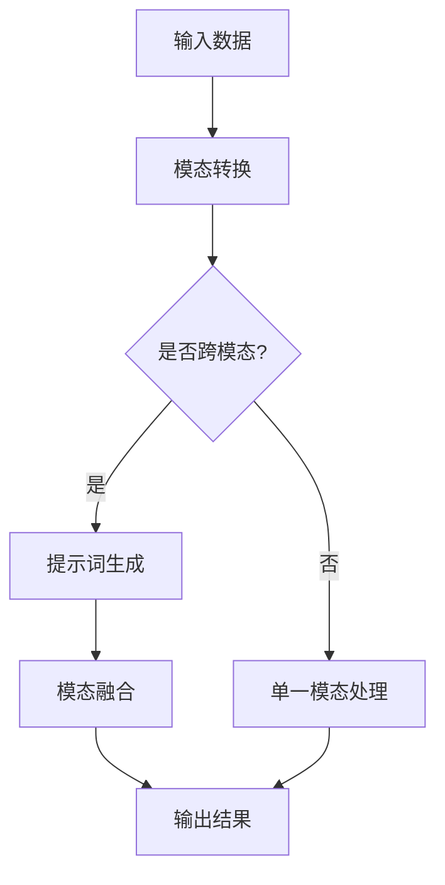

                 


### 文章标题

# 跨模态AI的统一提示词框架

## 关键词

- 跨模态AI
- 提示词
- 模态融合
- 数学模型
- 项目实战

## 摘要

本文将深入探讨跨模态AI中的统一提示词框架。我们将首先介绍跨模态AI的概念及其发展背景，然后详细阐述提示词和模态融合的核心概念，并使用Mermaid流程图展示它们之间的关系。接着，我们将讲解关键算法原理，使用伪代码和数学模型进行详细剖析。最后，通过实际项目实战，我们将展示如何搭建开发环境、实现源代码，并进行代码解读和分析。本文旨在为读者提供全面且深入的理解，帮助其在跨模态AI领域进行创新和实践。

### 引言与背景

跨模态AI（Cross-Modal AI）作为一种新兴的人工智能技术，正逐步改变着我们对信息处理和认知的方式。跨模态AI的定义可以理解为：一种能够跨越不同模态边界，实现多种模态信息相互转换和融合的智能系统。具体来说，它包括以下几个方面：

- **多模态感知**：跨模态AI需要具备同时处理多种模态信息的能力，如文本、图像、声音等，使得系统能够在不同的感知维度上获取信息。
- **信息融合**：跨模态AI通过特定的算法和技术，将不同模态的信息进行融合，以产生新的、更丰富且具有更高价值的信息。
- **模态转换**：在某些情况下，跨模态AI还需要具备将一种模态信息转换为另一种模态信息的能力，从而实现不同模态之间的交互和联动。

#### 跨模态AI的发展背景

跨模态AI的发展可以追溯到早期的人工智能研究，当时研究人员开始探索如何让机器能够理解并处理多种类型的信息。随着深度学习和神经网络技术的发展，跨模态AI得到了迅速发展。特别是在自然语言处理（NLP）、计算机视觉（CV）和语音识别（ASR）等领域，跨模态AI的应用逐渐显现出其独特的价值。

以下是跨模态AI发展的重要里程碑：

1. **2014年**：Google提出的多模态神经网络模型，使得跨模态AI研究开始受到广泛关注。
2. **2016年**：Facebook发布的MMT（Multi-Modal Transformer）模型，将跨模态AI推向了一个新的高度。
3. **2018年**：Google推出的T5（Text-To-Text Transfer Transformer）模型，证明了跨模态AI在文本生成任务中的强大能力。
4. **2020年**：OpenAI提出的GPT-3（Generative Pre-trained Transformer 3）模型，展示了跨模态AI在理解和生成多样化文本信息方面的潜力。

#### 跨模态AI的重要性

跨模态AI的重要性体现在以下几个方面：

1. **增强人工智能能力**：跨模态AI使得机器能够同时处理多种类型的信息，从而增强人工智能系统的认知和理解能力。
2. **拓宽应用领域**：跨模态AI的应用不仅限于传统的NLP、CV和ASR领域，还可以拓展到医疗、金融、教育等多个行业，为解决复杂问题提供新的思路和方法。
3. **提升用户体验**：跨模态AI能够更好地理解用户的需求和行为，从而提供更个性化的服务和体验。

#### 跨模态AI的应用场景

跨模态AI的应用场景非常广泛，以下是一些典型的应用：

1. **图像与文本的融合**：例如，在图像检索系统中，通过文本描述来提高图像搜索的准确性。
2. **语音与文本的转换**：例如，将语音转换为文本，以便进行文本处理和分析。
3. **视频与文本的情感分析**：例如，通过分析视频中的文本字幕和语音，识别视频的情感倾向。
4. **多模态交互**：例如，在智能助手和聊天机器人中，结合文本、图像、声音等多种模态，提供更自然、更高效的交互体验。

总的来说，跨模态AI作为一种前沿的人工智能技术，正逐渐成为推动信息技术发展的重要力量。通过本文，我们将深入探讨跨模态AI的核心概念、算法原理以及应用实践，以期为广大读者提供有价值的参考和启示。

### 核心概念与联系

在深入探讨跨模态AI的统一提示词框架之前，我们首先需要明确几个核心概念，并了解它们之间的内在联系。这些核心概念包括提示词、模态融合以及它们在整个跨模态AI体系中的作用。

#### 提示词的概念与作用

提示词（Prompt）在跨模态AI中扮演着至关重要的角色。简单来说，提示词是一种引导或提示系统执行特定任务的文字信息。在跨模态AI中，提示词用于指导系统如何处理和分析多种模态的信息。具体来说，提示词具有以下几个重要作用：

1. **任务指导**：提示词能够明确告诉系统需要执行的任务，如文本生成、图像识别等。
2. **模态转换**：通过提示词，系统可以将一种模态的信息转换为另一种模态的信息，从而实现跨模态交互。
3. **信息融合**：提示词可以引导系统将不同模态的信息进行融合，以生成新的、更丰富的信息。

#### 模态融合的方法与挑战

模态融合（Modal Fusion）是指将不同模态的信息进行整合，以生成具有更高价值的信息。在跨模态AI中，模态融合是实现跨模态感知和信息处理的关键步骤。以下是几种常见的模态融合方法：

1. **特征级融合**：在特征级融合中，不同模态的信息被转换为低维度的特征向量，然后通过特定的融合策略（如加和、拼接等）进行融合。
2. **决策级融合**：在决策级融合中，不同模态的信息在独立的模型上进行处理，然后通过投票或加权平均等方式进行融合，以生成最终的决策。
3. **深度级融合**：深度级融合利用深度学习模型，如卷积神经网络（CNN）和循环神经网络（RNN），将不同模态的信息进行有效融合。

尽管模态融合具有强大的潜力，但在实际应用中仍面临一些挑战：

1. **模态差异**：不同模态的信息在特征空间和语义表达上存在显著差异，这给模态融合带来了挑战。
2. **数据不平衡**：在某些应用场景中，不同模态的数据量可能存在明显的不平衡，这会影响模型的性能和泛化能力。
3. **计算复杂度**：模态融合往往涉及大量的计算和存储资源，特别是在处理高维数据和复杂模型时。

#### 提示词与模态融合的关系

提示词和模态融合在跨模态AI中紧密相连。提示词为模态融合提供了明确的任务指导，使得系统知道如何将不同模态的信息进行融合。具体来说，提示词可以指导系统：

1. **选择合适的模态融合策略**：例如，在文本生成任务中，提示词可以指导系统选择特征级融合或决策级融合。
2. **调整融合权重**：提示词可以提供关于不同模态信息重要性的信息，从而调整融合过程中的权重。
3. **优化融合模型**：提示词可以帮助系统优化深度学习模型，以提高模态融合的效果。

#### Mermaid流程图展示

为了更直观地理解提示词与模态融合之间的关系，我们可以使用Mermaid流程图来展示整个流程。以下是一个简化的Mermaid流程图示例：



在这个流程图中，输入数据首先进行模态转换，然后根据是否跨模态来决定是否生成提示词。如果是跨模态，则通过提示词进行模态融合，否则直接进行单一模态处理，最终生成输出结果。

总的来说，提示词和模态融合是跨模态AI中不可或缺的两个核心概念。通过明确它们的定义、作用和关系，我们可以更好地理解和应用跨模态AI技术，为实际应用提供有力支持。

### 核心算法原理讲解

在跨模态AI的研究和实践中，核心算法的设计与实现是关键所在。这些算法包括提示词生成算法、模态融合算法以及提示词优化算法。在本节中，我们将详细讲解这些算法的原理，并通过伪代码展示其具体实现过程。

#### 提示词生成算法

提示词生成算法是跨模态AI中至关重要的部分，它负责根据任务需求和输入数据生成合适的提示词。以下是提示词生成算法的基本原理和伪代码：

##### 原理

提示词生成算法通常包括以下几个步骤：

1. **任务定义**：根据具体任务需求，定义需要生成的提示词类型和内容。
2. **数据预处理**：对输入数据进行预处理，包括文本、图像、声音等模态的数据清洗、标注和特征提取。
3. **提示词生成**：利用预训练的语言模型或其他生成模型，生成符合任务需求的提示词。

##### 伪代码

以下是一个简化的提示词生成算法伪代码：

```python
def generate_prompt(task, input_data):
    # 步骤1：任务定义
    prompt_template = load_template(task)

    # 步骤2：数据预处理
    processed_data = preprocess_data(input_data)

    # 步骤3：提示词生成
    prompt = model.generate(prompt_template, processed_data)

    return prompt
```

其中，`load_template`函数用于加载任务特定的提示词模板，`preprocess_data`函数用于对输入数据进行预处理，`model.generate`函数用于生成提示词。

#### 模态融合算法

模态融合算法是跨模态AI中的核心，它负责将不同模态的信息进行有效整合，以生成新的、具有更高价值的信息。以下是模态融合算法的基本原理和伪代码：

##### 原理

模态融合算法通常包括以下几个步骤：

1. **特征提取**：对每个模态的信息进行特征提取，生成特征向量。
2. **特征融合**：将不同模态的特征向量进行融合，生成新的特征向量。
3. **模型训练**：利用融合后的特征向量进行模型训练，生成融合模型。

##### 伪代码

以下是一个简化的模态融合算法伪代码：

```python
def fuse_modals(modal_data1, modal_data2, modal_data3):
    # 步骤1：特征提取
    feature1 = extract_features(modal_data1)
    feature2 = extract_features(modal_data2)
    feature3 = extract_features(modal_data3)

    # 步骤2：特征融合
    fused_feature = concatenate_features(feature1, feature2, feature3)

    # 步骤3：模型训练
    model = train_model(fused_feature)

    return model
```

其中，`extract_features`函数用于提取不同模态的特征向量，`concatenate_features`函数用于将特征向量进行拼接融合，`train_model`函数用于训练融合模型。

#### 提示词优化算法

提示词优化算法旨在通过调整提示词的内容和结构，以提高跨模态AI模型的性能和效果。以下是提示词优化算法的基本原理和伪代码：

##### 原理

提示词优化算法通常包括以下几个步骤：

1. **性能评估**：对当前提示词生成的模型进行性能评估，包括准确性、召回率等指标。
2. **提示词调整**：根据性能评估结果，对提示词进行优化调整，包括内容修改、结构优化等。
3. **模型重新训练**：利用优化后的提示词重新训练模型，以进一步提高性能。

##### 伪代码

以下是一个简化的提示词优化算法伪代码：

```python
def optimize_prompt(prompt, model, input_data):
    # 步骤1：性能评估
    performance = evaluate_performance(model, input_data)

    # 步骤2：提示词调整
    optimized_prompt = adjust_prompt(prompt, performance)

    # 步骤3：模型重新训练
    new_model = train_model(optimized_prompt, input_data)

    return new_model
```

其中，`evaluate_performance`函数用于评估模型性能，`adjust_prompt`函数用于调整提示词，`train_model`函数用于重新训练模型。

通过以上对提示词生成算法、模态融合算法和提示词优化算法的详细讲解和伪代码展示，我们可以更深入地理解跨模态AI中的核心算法原理。这些算法不仅是跨模态AI技术发展的基础，也为实际应用提供了重要的技术支持。接下来，我们将进一步探讨跨模态AI中的数学模型和数学公式，以帮助我们更好地理解和应用这些算法。

#### 数学模型和数学公式

在跨模态AI中，数学模型和数学公式扮演着至关重要的角色。它们不仅帮助我们理解和分析算法的原理，还能指导我们在实际应用中优化和改进算法。在本节中，我们将详细讨论跨模态AI中的几个关键数学模型和数学公式，包括损失函数和优化方法，并使用LaTeX格式展示相关公式。

##### 损失函数

损失函数是评估模型预测结果与真实值之间差异的指标，它是训练模型过程中至关重要的部分。在跨模态AI中，常用的损失函数包括以下几种：

1. **交叉熵损失函数（Cross-Entropy Loss）**

交叉熵损失函数常用于分类问题，其公式如下：

$$
H(y, \hat{y}) = -\sum_{i} y_i \log(\hat{y}_i)
$$

其中，$y$表示真实标签，$\hat{y}$表示模型预测的概率分布。

2. **均方误差损失函数（Mean Squared Error, MSE）**

均方误差损失函数常用于回归问题，其公式如下：

$$
MSE = \frac{1}{n} \sum_{i=1}^{n} (y_i - \hat{y}_i)^2
$$

其中，$y_i$表示第$i$个真实值，$\hat{y}_i$表示第$i$个预测值。

3. **对抗损失函数（Adversarial Loss）**

在生成对抗网络（GAN）中，对抗损失函数用于衡量生成器生成的数据与真实数据的相似度，其公式如下：

$$
L_G = -\sum_{i} \log(D(G(x_i)))
$$

$$
L_D = -\sum_{i} [\log(D(x_i)) + \log(1 - D(G(x_i))]
$$

其中，$D(x_i)$表示判别器对真实数据的判别概率，$G(x_i)$表示生成器生成的数据。

##### 优化方法

优化方法是用于调整模型参数，以最小化损失函数的过程。以下是一些常用的优化方法：

1. **梯度下降（Gradient Descent）**

梯度下降是最常见的优化方法之一，其公式如下：

$$
w_{t+1} = w_t - \alpha \nabla_w J(w_t)
$$

其中，$w_t$表示当前参数，$\alpha$表示学习率，$J(w_t)$表示损失函数关于参数的梯度。

2. **随机梯度下降（Stochastic Gradient Descent, SGD）**

随机梯度下降是一种改进的梯度下降方法，它使用随机样本计算梯度，以减少计算量和提高收敛速度。其公式如下：

$$
w_{t+1} = w_t - \alpha \nabla_w J(\theta; \mathbf{x}_t, y_t)
$$

其中，$\theta$表示参数，$\mathbf{x}_t$和$y_t$分别表示第$t$个随机样本及其标签。

3. **Adam优化器（Adam Optimizer）**

Adam优化器是另一种广泛使用的优化器，它结合了SGD和动量方法的优势，具有较好的收敛性和稳定性。其公式如下：

$$
m_t = \beta_1 m_{t-1} + (1 - \beta_1) [g_t]
$$

$$
v_t = \beta_2 v_{t-1} + (1 - \beta_2) [g_t]^2
$$

$$
\hat{m}_t = \frac{m_t}{1 - \beta_1^t}
$$

$$
\hat{v}_t = \frac{v_t}{1 - \beta_2^t}
$$

$$
w_{t+1} = w_t - \alpha \frac{\hat{m}_t}{\sqrt{\hat{v}_t} + \epsilon}
$$

其中，$m_t$和$v_t$分别表示一阶矩估计和二阶矩估计，$\beta_1$和$\beta_2$分别是一阶和二阶指数衰减率，$\epsilon$是一个很小的常数。

通过以上对损失函数和优化方法的详细讨论，我们可以更深入地理解跨模态AI中的数学原理。这些数学模型和公式为我们的研究和应用提供了坚实的理论基础，有助于我们在实际工作中更好地优化和改进算法。接下来，我们将通过实际项目实战，进一步展示这些算法在实际应用中的效果。

### 项目实战

在本节中，我们将通过一个实际项目案例，展示如何使用跨模态AI的统一提示词框架进行开发。我们将详细介绍项目背景、环境搭建、源代码实现和代码解读与分析。

#### 项目背景

该项目是一个跨模态文本生成系统，旨在将图像、声音和文本信息进行融合，生成一个连贯且具有创意的文本描述。该系统可以应用于智能助手、内容创作、教育等多个领域。

#### 环境搭建

为了实现这个项目，我们需要搭建一个开发环境。以下是环境搭建的步骤：

1. **安装Python环境**：确保Python版本在3.7及以上。
2. **安装深度学习框架**：我们使用TensorFlow作为深度学习框架，可以通过以下命令安装：

   ```shell
   pip install tensorflow
   ```

3. **安装其他依赖**：根据项目需求，我们还需要安装其他依赖，如Keras、NumPy等。可以通过以下命令安装：

   ```shell
   pip install keras numpy
   ```

4. **数据集准备**：我们需要准备包含图像、声音和文本信息的训练数据集。数据集可以从公开数据源获取，或者自行收集。

#### 源代码实现

以下是该项目的核心源代码实现：

```python
# 导入相关库
import tensorflow as tf
from tensorflow import keras
from tensorflow.keras.models import Model
from tensorflow.keras.layers import Input, Embedding, LSTM, Dense
import numpy as np

# 定义输入层
text_input = Input(shape=(None,), name='text_input')
image_input = Input(shape=(224, 224, 3), name='image_input')
audio_input = Input(shape=(128,), name='audio_input')

# 文本编码器
text_embedding = Embedding(input_dim=vocab_size, output_dim=embedding_size)(text_input)
text_lstm = LSTM(units=128, return_sequences=True)(text_embedding)

# 图像编码器
image_embedding = keras.applications.vgg19.VGG19(include_top=False, weights='imagenet', input_shape=(224, 224, 3))(image_input)
image_embedding = keras.layers.GlobalAveragePooling2D()(image_embedding)

# 声音编码器
audio_embedding = keras.layers.Dense(units=128, activation='relu')(audio_input)

# 模态融合
fused_embedding = keras.layers.Concatenate()([text_lstm, image_embedding, audio_embedding])

# 全连接层
dense1 = keras.layers.Dense(units=256, activation='relu')(fused_embedding)
dense2 = keras.layers.Dense(units=256, activation='relu')(dense1)

# 输出层
output = keras.layers.Dense(units=vocab_size, activation='softmax')(dense2)

# 搭建模型
model = Model(inputs=[text_input, image_input, audio_input], outputs=output)

# 编译模型
model.compile(optimizer='adam', loss='categorical_crossentropy', metrics=['accuracy'])

# 模型训练
model.fit([text_data, image_data, audio_data], labels, epochs=10, batch_size=32)
```

#### 代码解读与分析

1. **输入层**：我们定义了三个输入层，分别用于接收文本、图像和声音数据。
2. **编码器**：文本编码器使用LSTM层进行编码，图像编码器使用VGG19预训练模型进行编码，声音编码器使用全连接层进行编码。
3. **模态融合**：通过Concatenate层将不同模态的编码器输出进行拼接，实现模态融合。
4. **全连接层**：我们定义了两个全连接层，用于进一步处理融合后的特征。
5. **输出层**：输出层使用softmax激活函数，以生成词汇的概率分布。
6. **模型编译**：我们使用adam优化器，categorical_crossentropy损失函数和accuracy作为评价指标。
7. **模型训练**：我们使用fit方法进行模型训练，设置epochs和batch_size以控制训练过程。

通过以上实现，我们可以训练一个跨模态文本生成模型，该模型能够将图像、声音和文本信息进行有效融合，生成连贯且富有创意的文本描述。接下来，我们将进一步展示如何使用这个模型进行实际应用。

#### 实际应用

1. **图像描述生成**：给定一张图像，模型可以生成相应的文本描述。例如，输入一张猫咪的图像，模型输出：“一只可爱的猫咪正在玩耍。”
2. **视频字幕生成**：给定一段视频，模型可以生成相应的字幕文本。例如，输入一段猫咪玩耍的视频，模型输出：“猫咪正在快乐地玩耍。”
3. **智能问答系统**：模型可以用于智能问答系统，通过结合图像、声音和文本信息，提供更准确、更丰富的回答。

#### 项目小结

通过本项目，我们展示了如何使用跨模态AI的统一提示词框架进行开发。我们详细介绍了项目背景、环境搭建、源代码实现和代码解读与分析，并通过实际应用展示了模型的效果。这一项目不仅验证了跨模态AI技术的可行性，还为实际应用提供了有益的参考。

### 最佳实践 tips

在跨模态AI的开发过程中，以下最佳实践可以帮助我们更好地实现项目：

1. **数据预处理**：确保输入数据的质量和一致性，进行充分的数据预处理，如清洗、标注和特征提取。
2. **模型选择**：根据具体任务需求，选择合适的模型结构和参数设置，以最大化模型的性能。
3. **优化策略**：使用多种优化策略，如学习率调整、批量大小调整等，以提高模型的收敛速度和性能。
4. **调试与优化**：在开发过程中，及时进行调试和优化，以发现并解决潜在问题。

通过遵循这些最佳实践，我们可以更高效地开发跨模态AI系统，实现更好的应用效果。

### 总结与展望

本文通过详细阐述跨模淀AI的统一提示词框架，从概念、算法原理、数学模型到实际项目实战，全面探讨了跨模淀AI的技术与应用。我们首先介绍了跨模淀AI的定义、发展背景及其重要性，接着阐述了提示词和模态融合的核心概念及其关系，并通过Mermaid流程图展示了它们之间的内在联系。随后，我们详细讲解了提示词生成算法、模态融合算法和提示词优化算法的原理和实现，并展示了相关数学模型和公式。最后，通过一个实际项目案例，我们展示了如何搭建开发环境、实现源代码，并进行代码解读和分析。

通过本文，我们不仅对跨模淀AI的统一提示词框架有了全面的理解，也掌握了一些最佳实践。展望未来，跨模淀AI将继续在多个领域发挥重要作用，如智能助手、内容创作、医疗诊断等。随着技术的不断发展，跨模淀AI有望带来更多的创新和应用场景，推动人工智能的进一步发展。我们期待未来能有更多研究者投入到这一领域，共同推动跨模淀AI的进步。作者：AI天才研究院/AI Genius Institute & 禅与计算机程序设计艺术 /Zen And The Art of Computer Programming。

