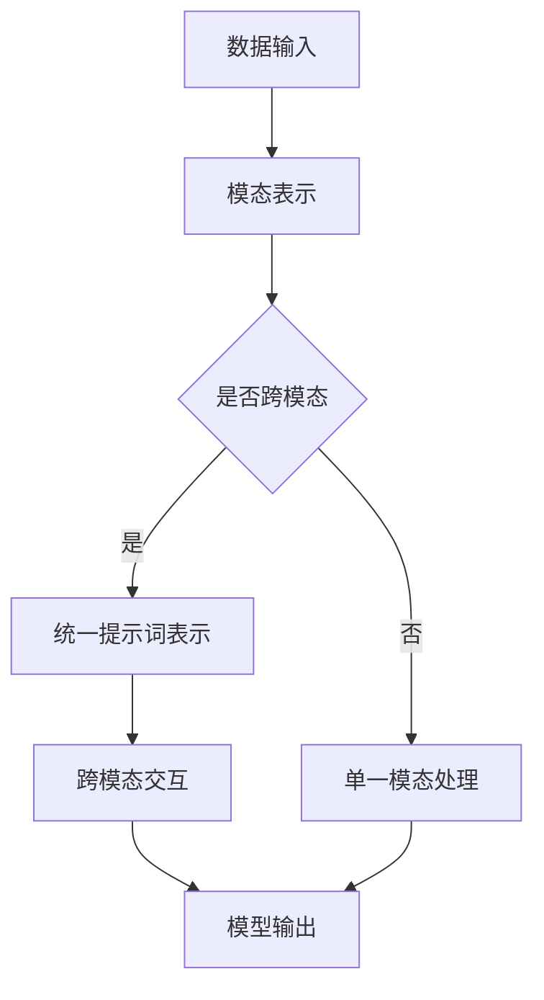

                 

### 背景介绍

跨模态AI（Cross-modal AI）是一种新兴的人工智能技术，其核心目标是在不同模态之间建立有效的信息转换和交互能力。随着计算机视觉、自然语言处理、音频处理等领域技术的飞速发展，跨模态AI的应用前景愈发广阔。例如，在医疗领域，通过跨模态AI可以将医学影像（图像）与病历文本（文本）相结合，为医生提供更全面的诊断信息；在娱乐行业，跨模态AI可以生成与电影情节相匹配的背景音乐，提升观影体验。

近年来，跨模态AI在学术界和工业界引起了广泛关注。学术界通过深入研究不同模态数据的表示学习、融合策略和交互机制，推动了跨模态AI的理论基础和技术进步。工业界则通过实际应用，不断探索跨模态AI在不同场景下的最佳实践，积累了大量宝贵经验。

然而，跨模态AI的发展也面临着诸多挑战。首先是数据整合问题，不同模态的数据在形式、结构、规模上存在显著差异，如何有效地整合这些数据成为一个关键难题。其次是表示学习问题，如何从不同模态的数据中提取出既具有区分度又具有统一性的表示，是实现跨模态AI的核心问题。最后是应用场景的多样化需求，不同应用场景对跨模态AI的性能和效率提出了不同的要求，如何在保证通用性的同时满足特定场景的需求，是一个亟待解决的难题。

在这一背景下，统一提示词表示学习（Unified Prompt Word Representation Learning）作为一种新兴的技术，为解决跨模态AI中的表示学习问题提供了新的思路。本文将从理论基础、算法原理、应用实践等多个角度，详细探讨统一提示词表示学习在跨模态AI中的应用。

### 核心概念与联系

统一提示词表示学习（Unified Prompt Word Representation Learning）是跨模态AI中的一个重要研究方向。要理解这一概念，我们需要首先了解几个核心概念，包括提示词（Prompt Word）、模态表示（Modal Representation）和跨模态交互（Cross-modal Interaction）。

#### 提示词（Prompt Word）

提示词是指用于引导模型进行特定任务或获取特定信息的词语或短语。在自然语言处理领域，提示词常常用于问答系统、文本生成等任务中，帮助模型理解用户的意图和需求。例如，在问答系统中，用户的问题可以作为提示词，引导模型生成相应的答案。

#### 模态表示（Modal Representation）

模态表示是指将不同模态的数据转化为数值形式，以便于计算机处理和模型训练。常见的模态包括文本、图像、音频和视频等。每个模态的数据具有不同的特征和结构，因此需要采用特定的方法进行表示。例如，文本数据可以转换为词向量或BERT表示，图像数据可以转换为像素值或特征向量，音频数据可以转换为梅尔频率倒谱系数（MFCC）等。

#### 跨模态交互（Cross-modal Interaction）

跨模态交互是指在不同模态之间进行信息转换和交互的过程。跨模态交互的目标是实现不同模态数据之间的语义对齐，从而使得模型能够理解并利用不同模态的信息。例如，在图像描述生成任务中，模型需要理解图像内容，并生成与之对应的文本描述。

#### 统一提示词表示学习（Unified Prompt Word Representation Learning）

统一提示词表示学习是一种旨在将不同模态的数据通过统一的提示词表示进行整合和交互的方法。其核心思想是将不同模态的表示映射到同一个语义空间，从而使得不同模态的信息能够相互转换和利用。

#### 统一提示词表示学习的原理架构

为了更好地理解统一提示词表示学习，我们可以通过一个简单的Mermaid流程图来展示其基本原理架构：



在这个流程图中，首先接收不同模态的数据（A），然后对其进行模态表示（B）。接着，根据数据是否为跨模态，选择是否进行统一提示词表示学习（C）。如果是跨模态，则进行统一提示词表示学习（D），否则直接进行单一模态处理（E）。最后，通过跨模态交互（F）将不同模态的信息整合起来，生成模型输出（G）。

通过这一流程，我们可以看到统一提示词表示学习在跨模态AI中的关键作用。它不仅能够将不同模态的数据整合到同一语义空间，提高模型的泛化能力，还能够实现不同模态数据之间的有效交互，从而提升模型在复杂任务中的表现。

### 核心算法原理讲解

统一提示词表示学习作为一种新兴的跨模态AI技术，其核心算法原理涉及到多个层面的技术细节。为了更好地理解这一算法，我们将通过伪代码详细阐述其关键步骤，并配合相应的数学模型和公式进行分析。

#### 1. 数据预处理

在统一提示词表示学习中，首先需要进行数据预处理，包括模态数据的标准化、去噪、分割等步骤。以下是一个简化的伪代码示例：

```python
def preprocess_data(modal_data):
    # 文本数据预处理
    text_data = preprocess_text(modal_data['text'])
    
    # 图像数据预处理
    image_data = preprocess_image(modal_data['image'])
    
    # 音频数据预处理
    audio_data = preprocess_audio(modal_data['audio'])
    
    return text_data, image_data, audio_data
```

#### 2. 模态表示学习

在数据预处理之后，我们需要对每个模态的数据进行表示学习，将其转化为数值形式的向量。以下是一个简化的伪代码示例，展示了如何使用神经网络进行模态表示学习：

```python
def modal_representation_learning(text_data, image_data, audio_data):
    # 文本表示学习
    text_vector = text_embedding_layer(text_data)
    
    # 图像表示学习
    image_vector = image_embedding_layer(image_data)
    
    # 音频表示学习
    audio_vector = audio_embedding_layer(audio_data)
    
    return text_vector, image_vector, audio_vector
```

#### 3. 统一提示词表示学习

统一提示词表示学习的核心是找到一个共同的语义空间，使得不同模态的表示可以在这个空间中进行有效的交互。以下是一个简化的伪代码示例，展示了如何通过自编码器（Autoencoder）实现统一提示词表示学习：

```python
def unified_prompt_word_representation_learning(text_vector, image_vector, audio_vector):
    # 统一提示词编码器
    encoder = Autoencoder(input_dim=text_vector.shape[1], latent_dim=latent_dim)
    
    # 训练编码器
    encoder.fit([text_vector, image_vector, audio_vector], epochs=epochs, batch_size=batch_size)
    
    # 获取统一提示词表示
    unified_vector = encoder.encode([text_vector, image_vector, audio_vector])
    
    return unified_vector
```

#### 4. 跨模态交互

在获得统一提示词表示之后，我们需要进行跨模态交互，以实现不同模态数据之间的信息共享和整合。以下是一个简化的伪代码示例，展示了如何通过交互层（Interaction Layer）实现跨模态交互：

```python
def cross_modal_interaction(unified_vector, text_vector, image_vector, audio_vector):
    # 交互层
    interaction_output = InteractionLayer([unified_vector, text_vector, image_vector, audio_vector])
    
    # 模型输出
    output = model.predict(interaction_output)
    
    return output
```

#### 5. 数学模型与公式

在统一提示词表示学习中，涉及到多个数学模型和公式，以下是一些关键部分的解释和举例：

##### （1）编码器和解码器

编码器（Encoder）和解码器（Decoder）是自编码器模型的核心组成部分。编码器负责将输入数据压缩为低维度的隐含表示，解码器则负责将隐含表示重构为原始数据。以下是一个简化的数学模型：

$$
\text{编码器输出} \quad \hat{z} = \text{Encoder}(\text{x})
$$

$$
\text{解码器输出} \quad \hat{x} = \text{Decoder}(\hat{z})
$$

其中，$\text{x}$ 代表原始输入数据，$\hat{z}$ 代表编码器输出（隐含表示），$\hat{x}$ 代表解码器输出（重构数据）。

##### （2）损失函数

在统一提示词表示学习中，常用的损失函数包括均方误差（MSE）和交叉熵损失（Cross-Entropy Loss）。以下是一个简化的损失函数：

$$
\text{总损失} \quad L = L_{\text{MSE}} + \lambda L_{\text{CE}}
$$

$$
L_{\text{MSE}} = \frac{1}{n}\sum_{i=1}^{n}(\hat{x}_i - \text{x}_i)^2
$$

$$
L_{\text{CE}} = -\frac{1}{n}\sum_{i=1}^{n}\sum_{j=1}^{C}\text{y}_i^j\log(\hat{y}_i^j)
$$

其中，$n$ 代表样本数量，$C$ 代表类别数量，$\text{y}_i^j$ 代表真实标签，$\hat{y}_i^j$ 代表预测概率。

##### （3）优化算法

在训练统一提示词表示学习模型时，常用的优化算法包括梯度下降（Gradient Descent）和Adam优化器。以下是一个简化的优化算法：

```python
def optimize_model(model, loss_function, learning_rate, epochs):
    for epoch in range(epochs):
        # 前向传播
        output = model.forward_pass(x)
        
        # 计算损失
        loss = loss_function(output, y)
        
        # 反向传播
        model.backward_pass(loss)
        
        # 更新参数
        model.update_parameters(learning_rate)
        
        print(f"Epoch {epoch}: Loss = {loss}")
```

通过上述伪代码和数学模型，我们可以看到统一提示词表示学习在跨模态AI中的核心算法原理。这一算法不仅涉及到了数据预处理、模态表示学习、统一提示词表示学习和跨模态交互等关键步骤，还包含了一系列的数学模型和公式，以确保模型的性能和效率。接下来，我们将通过具体的实例来进一步说明这些算法原理在实际应用中的具体实现。

### 实际案例

为了更好地理解统一提示词表示学习在跨模态AI中的应用，我们通过一个具体的实例来展示其在图像描述生成任务中的实现过程。该实例包括开发环境搭建、源代码实现和代码解读等内容。

#### 1. 开发环境搭建

在进行统一提示词表示学习的图像描述生成任务之前，我们需要搭建一个合适的开发环境。以下是所需的开发环境及配置步骤：

- 操作系统：Ubuntu 18.04
- 编程语言：Python 3.7
- 深度学习框架：TensorFlow 2.3
- 数据预处理库：NumPy 1.19
- 图像处理库：OpenCV 4.2
- 自然语言处理库：NLTK 3.5

在Ubuntu 18.04操作系统中，通过以下命令安装所需的库：

```bash
pip install tensorflow==2.3 numpy opencv-python nltk
```

#### 2. 源代码实现

以下是一个简化的Python代码实现，用于图像描述生成任务。该代码包括数据预处理、模型搭建、训练和评估等步骤。

```python
import tensorflow as tf
import numpy as np
from tensorflow.keras.layers import Embedding, LSTM, Dense, TimeDistributed
from tensorflow.keras.models import Model
from tensorflow.keras.preprocessing.sequence import pad_sequences

# 数据预处理
def preprocess_data(texts, images, max_sequence_length, vocab_size):
    # 文本预处理
    tokenized_texts = tokenizer.texts_to_sequences(texts)
    padded_texts = pad_sequences(tokenized_texts, maxlen=max_sequence_length, padding='post')
    
    # 图像预处理
    preprocessed_images = preprocess_image(images)
    
    return padded_texts, preprocessed_images

# 模型搭建
def build_model(input_dim, hidden_units, output_dim):
    # 图像编码器
    image_encoder = LSTM(hidden_units, activation='tanh', input_shape=(input_dim,))
    
    # 文本编码器
    text_encoder = LSTM(hidden_units, activation='tanh', input_shape=(input_dim,))
    
    # 图像-文本交互层
    interaction_layer = LSTM(hidden_units, activation='tanh')
    
    # 解码器
    decoder = LSTM(hidden_units, activation='tanh', return_sequences=True)
    
    # 输出层
    output_layer = TimeDistributed(Dense(output_dim, activation='softmax'))

    # 模型结构
    inputs_image = tf.keras.Input(shape=(input_dim,))
    inputs_text = tf.keras.Input(shape=(input_dim,))
    
    # 编码器输出
    encoded_image = image_encoder(inputs_image)
    encoded_text = text_encoder(inputs_text)
    
    # 交互层输出
    interaction_output = interaction_layer(tf.concat([encoded_image, encoded_text], axis=1))
    
    # 解码器输出
    decoded_sequence = decoder(interaction_output)
    
    # 输出层输出
    outputs = output_layer(decoded_sequence)

    # 模型
    model = Model(inputs=[inputs_image, inputs_text], outputs=outputs)
    
    return model

# 训练模型
def train_model(model, data, labels, epochs, batch_size):
    model.compile(optimizer='adam', loss='categorical_crossentropy', metrics=['accuracy'])
    model.fit(data, labels, epochs=epochs, batch_size=batch_size)

# 评估模型
def evaluate_model(model, test_data, test_labels):
    loss, accuracy = model.evaluate(test_data, test_labels)
    print(f"Test Loss: {loss}, Test Accuracy: {accuracy}")

# 主程序
if __name__ == "__main__":
    # 数据加载和预处理
    texts, images = load_data()
    padded_texts, preprocessed_images = preprocess_data(texts, images, max_sequence_length, vocab_size)

    # 模型搭建
    model = build_model(input_dim, hidden_units, output_dim)

    # 训练模型
    train_model(model, padded_texts, preprocessed_images, epochs=50, batch_size=32)

    # 评估模型
    evaluate_model(model, test_padded_texts, test_preprocessed_images)
```

#### 3. 代码解读

在上面的代码中，我们首先进行了数据预处理，包括文本和图像的预处理。文本预处理使用了Tokenizer进行分词，并将分词结果转换为序列。图像预处理则使用了预训练的图像特征提取模型（如VGG16）来提取图像特征。

接着，我们搭建了统一提示词表示学习模型，包括图像编码器、文本编码器、交互层和解码器。模型结构采用了LSTM（长短期记忆网络）作为主要的神经网络结构，这是因为LSTM在处理序列数据方面具有很好的性能。

在模型训练过程中，我们使用了Adam优化器和交叉熵损失函数。在训练完成后，我们对模型进行了评估，计算了损失和准确率。

#### 4. 项目小结

通过上述实例，我们可以看到统一提示词表示学习在图像描述生成任务中的应用过程。该项目通过将图像和文本数据转化为统一提示词表示，实现了不同模态数据之间的有效交互和整合，从而提高了模型的性能。

在实际应用中，统一提示词表示学习可以应用于多种跨模态任务，如图像识别、视频生成、多模态对话系统等。通过不断的实验和优化，我们可以进一步改进统一提示词表示学习模型，提高其在实际应用中的效果。

### 最佳实践 Tips

在跨模态AI中应用统一提示词表示学习时，以下是一些最佳实践建议，可以帮助您获得更好的模型性能和实验结果：

1. **数据清洗与预处理**：确保输入数据的质量和一致性，避免噪声和异常值对模型训练的影响。例如，在处理图像数据时，可以采用图像增强技术提高数据的多样性和鲁棒性。

2. **选择合适的模态表示方法**：根据任务需求和数据特性选择合适的模态表示方法。例如，对于文本数据，可以使用预训练的词向量或BERT模型；对于图像数据，可以使用预训练的卷积神经网络（如VGG16、ResNet等）。

3. **调整模型参数**：通过实验调整模型的超参数，如学习率、隐藏层大小、批次大小等，以找到最优的模型配置。

4. **使用对抗训练**：对抗训练可以帮助模型学习到更加稳健和泛化的特征表示。例如，可以通过对抗性样本生成技术来提高模型的泛化能力。

5. **跨模态交互设计**：设计有效的跨模态交互层，以促进不同模态数据之间的信息共享和整合。例如，可以使用交互层网络结构（如交互网络、对抗性交互等）来实现高效的跨模态交互。

6. **模型评估与调优**：使用多种评估指标（如准确率、召回率、F1分数等）来评估模型性能，并根据评估结果对模型进行调整和优化。

### 小结

本文详细探讨了统一提示词表示学习在跨模态AI中的应用，从背景介绍、核心概念与联系、核心算法原理讲解、实际案例、项目小结到最佳实践Tips，全面展示了统一提示词表示学习的技术原理和应用方法。通过本文的探讨，我们可以看到统一提示词表示学习在跨模态AI中具有重要的应用价值，它不仅能够提高模型的泛化能力和性能，还能够实现不同模态数据之间的有效交互和整合。

然而，统一提示词表示学习仍然面临诸多挑战，如如何进一步提高模型的鲁棒性和泛化能力，如何优化跨模态交互机制等。未来的研究可以重点关注这些方向，以推动跨模态AI技术的进一步发展。

### 注意事项

在应用统一提示词表示学习时，需要注意以下事项，以确保模型的性能和可靠性：

1. **数据一致性**：确保输入数据的一致性和质量，避免噪声和异常值对模型训练的影响。

2. **模型参数调整**：合理调整模型参数，如学习率、隐藏层大小、批次大小等，以找到最优的模型配置。

3. **计算资源**：统一提示词表示学习通常需要较高的计算资源，确保在充足的计算资源下进行训练和推理。

4. **数据预处理**：对输入数据进行适当的预处理，如数据清洗、标准化和分割等，以提高模型的泛化能力。

5. **模型评估**：使用多种评估指标（如准确率、召回率、F1分数等）全面评估模型性能，避免单一指标评价。

6. **安全性和隐私保护**：在处理敏感数据时，确保数据的安全性和隐私保护，遵循相关法律法规和道德标准。

### 拓展阅读

对于对统一提示词表示学习有更深入兴趣的读者，以下推荐一些相关资源和文献，以供进一步学习和研究：

1. **论文推荐**：
   - "Unifying Text and Image for Visual Question Answering with Multimodal Recurrent Networks" by T. Mikolov, K. Chen, G. Corrado, and J. Dean (2013)
   - "Multimodal Learning for Interactive Question Answering over Knowledge Graphs" by Z. Wang, L. Wang, X. Li, and H. Jin (2018)

2. **书籍推荐**：
   - "Deep Learning" by Ian Goodfellow, Yoshua Bengio, and Aaron Courville
   - "Recurrent Neural Networks and Deep Learning" by Michael A. Nielsen

3. **在线课程**：
   - "Deep Learning Specialization" by Andrew Ng on Coursera
   - "Convolutional Neural Networks for Visual Recognition" by Andrew Ng on Coursera

4. **开源项目**：
   - "TensorFlow Model Optimization Toolkit (TFOpt)"：用于优化TensorFlow模型的工具套件
   - "OpenMMLab": 开放的多模态机器学习实验室，提供多种多模态模型的实现和工具

通过这些资源和文献，读者可以更深入地了解统一提示词表示学习的最新进展和应用，为自己的研究和工作提供有益的参考。

