                 

。

### 第一部分：跨界创新的背景与重要性

在当今快速变化的世界中，跨界创新已经成为企业实现持续发展的关键因素。本部分将深入探讨跨界创新的背景和重要性，以帮助读者更好地理解这一概念。

#### 背景介绍

1. **全球化趋势**

   全球化进程的加速使得企业面临着前所未有的机遇和挑战。不同国家和地区之间的文化、经济和技术的交流日益频繁，这为企业提供了跨界创新的广阔空间。企业可以通过跨文化合作，整合全球资源，创造出全新的商业模式和产品。

2. **科技革命**

   科技的飞速发展，尤其是互联网、人工智能、大数据等新兴技术的出现，为企业提供了丰富的跨界创新工具和平台。例如，人工智能可以帮助企业实现业务自动化和智能化，而大数据分析则为企业提供了洞察市场趋势和消费者需求的能力。

3. **企业竞争加剧**

   随着市场竞争的加剧，企业需要不断创新来保持竞争优势。跨界创新可以帮助企业跳出传统思维的框架，通过整合多领域的智慧，实现业务的突破和转型。

#### 核心概念与联系

为了更好地理解跨界创新的背景，我们可以通过以下Mermaid流程图来展示其核心概念和联系：

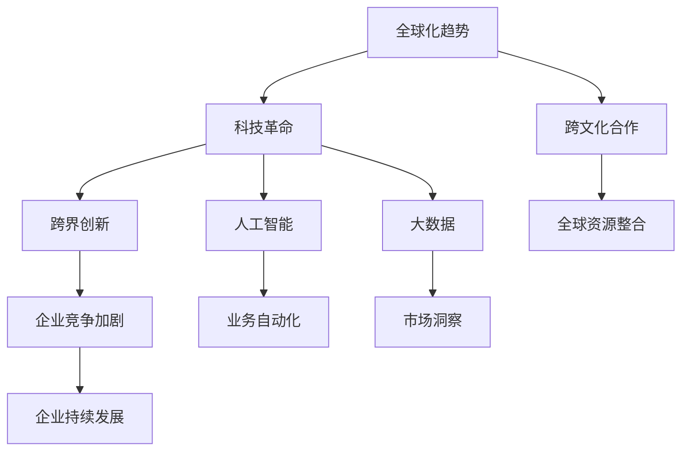

#### 核心概念与联系

在跨界创新中，核心概念包括：

1. **多领域智慧**：通过整合不同领域的知识和资源，实现创新的突破。

2. **资源整合**：跨界创新需要企业具备整合内外部资源的能力，以实现创新。

3. **创新思维**：跨界创新要求企业领导者具备开放、创新和跨领域的思维方式。

4. **商业模式**：跨界创新往往带来全新的商业模式，为企业创造新的价值。

以下是这些核心概念之间的联系Mermaid流程图：

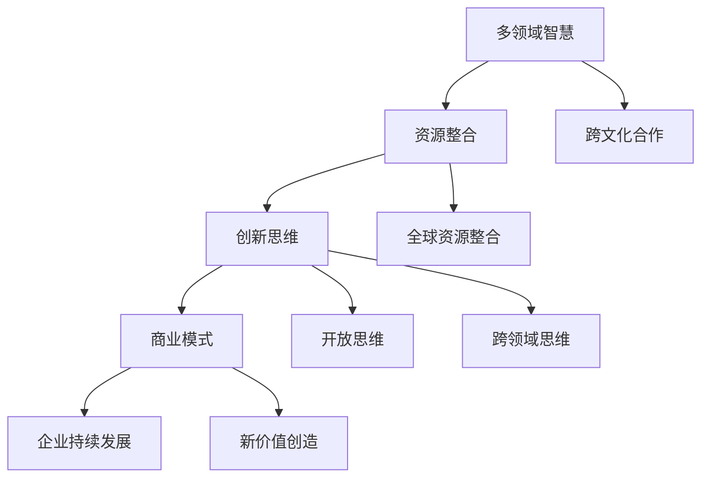

通过以上分析，我们可以看到跨界创新的背景和重要性。在接下来的部分中，我们将进一步探讨跨界创新的方法与工具，以帮助企业实现跨领域的创新和突破。

---

在探讨跨界创新的背景与重要性时，我们首先介绍了全球化趋势、科技革命和企业竞争加剧这三个关键背景因素。这些因素共同推动了企业跨界创新的必要性。接下来，我们通过Mermaid流程图展示了这些背景因素之间的联系，以及它们如何促进企业持续发展。

核心概念与联系部分，我们详细讨论了多领域智慧、资源整合、创新思维和商业模式这四个关键概念，并展示了它们之间的相互关系。通过Mermaid流程图，我们更加清晰地理解了这些概念如何相互交织，共同推动跨界创新的发展。

通过这一部分的讨论，我们为接下来的内容奠定了基础。在接下来的部分中，我们将深入探讨跨界创新的具体方法与工具，以帮助读者更好地理解如何在实际操作中实现跨界创新。

## 第二部分：跨界创新的方法与工具

在了解了跨界创新的背景和重要性之后，接下来我们将探讨实现跨界创新的具体方法和工具。这些方法和工具将帮助企业有效地整合多领域智慧，推动创新和突破。

### 4. 跨界创新的方法

#### 4.1 混合思维

**混合思维**是一种将不同领域、文化和观点融合在一起进行思考的方法。通过混合思维，企业可以打破传统思维的限制，激发创新的火花。具体步骤如下：

1. **识别不同领域的思维模式**：了解不同领域（如工程、艺术、人文科学）的思维方式和特点。
2. **融合多领域思维**：将不同领域的思维模式进行交叉融合，形成独特的思考方式。
3. **实践混合思维**：在实际项目中应用混合思维，尝试将不同领域的知识结合起来，解决复杂问题。

以下是混合思维的伪代码实现：

```python
def mixed_thinking(domain1, domain2):
    # 识别不同领域的思维模式
    domain1_thinking_mode = get_thinking_mode(domain1)
    domain2_thinking_mode = get_thinking_mode(domain2)
    
    # 融合多领域思维
    mixed_mode = merge_thinkings(domain1_thinking_mode, domain2_thinking_mode)
    
    # 实践混合思维
    solution = apply_mixed_mode(mixed_mode)
    
    return solution
```

#### 4.2 跨界合作

**跨界合作**是指不同领域、行业或组织之间的合作，以实现共同的目标。跨界合作可以带来新的观点、资源和能力，促进创新和突破。具体步骤如下：

1. **确定跨界合作的目标**：明确合作的目标和期望成果。
2. **建立跨界合作团队**：组建由不同领域专家组成的团队，确保团队成员具备互补的技能和知识。
3. **进行跨界交流**：鼓励团队成员之间的交流，分享各自领域的观点和经验。
4. **协同工作**：在团队内部进行协同工作，共同解决复杂问题。

以下是跨界合作的伪代码实现：

```python
def cross_domain Cooperation(domain1, domain2, domain3):
    # 确定跨界合作的目标
    cooperation_objective = define_objective(domain1, domain2, domain3)
    
    # 建立跨界合作团队
    team = create_team(domain1_experts, domain2_experts, domain3_experts)
    
    # 进行跨界交流
    team_communication = facilitate_communication(team)
    
    # 协同工作
    solution = collaborative_work(team)
    
    return solution
```

#### 4.3 模式创新

**模式创新**是指通过改变现有业务模式或创造新的业务模式，实现企业价值和竞争力的提升。模式创新可以涉及多个方面，如商业模式、运营模式、营销模式等。具体步骤如下：

1. **分析现有模式**：深入了解现有业务模式和运营流程，找出问题和改进空间。
2. **探索新模式**：基于对现有模式的分析，探索新的商业模式和运营模式。
3. **实施新模式**：将新模式应用到实际运营中，并进行测试和优化。

以下是模式创新的伪代码实现：

```python
def business_model_innovation(current_model):
    # 分析现有模式
    analyzed_model = analyze_current_model(current_model)
    
    # 探索新模式
    new_model = explore_new_models(analyzed_model)
    
    # 实施新模式
    implemented_model = implement_new_model(new_model)
    
    return implemented_model
```

#### 4.4 平台思维

**平台思维**是一种以平台为核心，整合多方资源和能力的思维方式。通过平台思维，企业可以构建一个开放的生态系统，促进创新和协同发展。具体步骤如下：

1. **构建平台战略**：明确企业的发展愿景，制定平台战略和规划。
2. **搭建平台架构**：设计和搭建平台的架构，包括技术平台、业务平台、合作平台等。
3. **整合多方资源**：吸引和整合外部合作伙伴和资源，共同构建平台生态。
4. **促进平台协同**：通过平台机制，促进多方协同合作，实现共赢。

以下是平台思维的伪代码实现：

```python
def platform_thinking(platform_strategy):
    # 构建平台战略
    strategy = build_platform_strategy(platform_strategy)
    
    # 搭建平台架构
    platform Architecture = build_platform_architecture(strategy)
    
    # 整合多方资源
    resources = integrate_multiple_resources(platform_architecture)
    
    # 促进平台协同
    collaboration = promote_platform_collaboration(resources)
    
    return collaboration
```

### 5. 跨界创新的工具

除了方法，跨界创新还需要一些具体的工具来支持和推动。以下是一些常用的跨界创新工具：

#### 5.1 设计思维

**设计思维**是一种以用户需求为中心，通过迭代和协作实现创新的方法。设计思维强调用户体验和迭代优化，适用于跨界创新的各个阶段。具体步骤如下：

1. **用户需求分析**：深入了解目标用户的需求和痛点。
2. **头脑风暴**：收集创意和想法，进行头脑风暴。
3. **原型设计**：快速构建原型，进行用户测试和反馈。
4. **迭代优化**：根据用户反馈，不断迭代和优化产品。

以下是设计思维的伪代码实现：

```python
def design_thinking(user_needs):
    # 用户需求分析
    analyzed_needs = analyze_user_needs(user_needs)
    
    # 头脑风暴
    ideas = brainstorm_ideas(analyzed_needs)
    
    # 原型设计
    prototype = design_prototype(ideas)
    
    # 迭代优化
    optimized_solution = iterate_and_optimize(prototype)
    
    return optimized_solution
```

#### 5.2 情景规划

**情景规划**是一种通过设定不同的未来情景，探索潜在机会和挑战的方法。情景规划有助于企业预测未来趋势，制定相应的创新策略。具体步骤如下：

1. **设定情景**：基于对未来趋势的判断，设定不同的情景。
2. **情景分析**：分析每个情景下的机会和挑战。
3. **策略制定**：根据情景分析结果，制定相应的创新策略。

以下是情景规划的伪代码实现：

```python
def scenario_planning(scenarios):
    # 设定情景
    set_scenarios = define_scenarios(scenarios)
    
    # 情景分析
    analyzed_scenarios = analyze_scenarios(set_scenarios)
    
    # 策略制定
    strategies = define_strategies(analyzed_scenarios)
    
    return strategies
```

#### 5.3 系统思维

**系统思维**是一种通过整体视角理解和解决问题的方法。系统思维强调各个部分之间的相互关系和相互作用，适用于跨界创新的复杂问题解决。具体步骤如下：

1. **识别系统元素**：确定系统中各个关键元素。
2. **分析元素关系**：分析各个元素之间的相互关系。
3. **优化系统结构**：根据分析结果，优化系统结构和流程。

以下是系统思维的伪代码实现：

```python
def system_thinking(system_elements):
    # 识别系统元素
    identified_elements = identify_system_elements(system_elements)
    
    # 分析元素关系
    relationships = analyze_element_relationships(identified_elements)
    
    # 优化系统结构
    optimized_structure = optimize_system_structure(relationships)
    
    return optimized_structure
```

#### 5.4 蓝海战略

**蓝海战略**是一种通过创造新的市场空间，规避竞争的方法。蓝海战略鼓励企业寻找并开拓未被竞争占据的市场领域，实现持续增长。具体步骤如下：

1. **市场分析**：分析现有市场和潜在市场。
2. **寻找蓝海**：通过创新和差异化，寻找新的市场机会。
3. **蓝海开拓**：制定并实施蓝海开拓策略，建立新的市场空间。

以下是蓝海战略的伪代码实现：

```python
def blue_ocean_strategy(current_market):
    # 市场分析
    analyzed_market = analyze_market(current_market)
    
    # 寻找蓝海
    blue_oceans = find_blue_oceans(analyzed_market)
    
    # 蓝海开拓
    blue_ocean_business = open_blue_ocean(blue_oceans)
    
    return blue_ocean_business
```

通过以上方法和工具，企业可以有效地进行跨界创新，实现跨领域、跨行业的创新和突破。在接下来的部分中，我们将通过实际案例，进一步探讨如何运用这些方法和工具，实现跨界创新的实践与应用。

---

在第二部分中，我们深入探讨了跨界创新的多种方法和工具。这些方法和工具包括混合思维、跨界合作、模式创新和平台思维，它们共同构成了跨界创新的框架。通过具体的伪代码实现，我们展示了如何在实际操作中应用这些方法。

此外，我们还介绍了跨界创新的工具，包括设计思维、情景规划、系统思维和蓝海战略。这些工具为企业提供了具体的操作指南，帮助它们在跨界创新的过程中，更好地应对复杂问题和市场变化。

通过这一部分的讨论，我们为跨界创新的实践与应用奠定了坚实的基础。在接下来的部分中，我们将通过实际案例，进一步探讨如何运用这些方法和工具，实现跨界创新的实践与应用。

## 第三部分：跨界创新的实践与应用

在前面的部分中，我们详细介绍了跨界创新的方法和工具。在本节中，我们将通过具体的案例，探讨如何在实际操作中运用这些方法和工具，实现跨界创新的实践与应用。

### 6. 跨界创新的案例研究

#### 案例一：苹果公司的跨界创新

**苹果公司**是一家全球知名的高科技企业，以其创新的电子产品和服务著称。苹果公司的成功很大程度上得益于其持续的跨界创新。

1. **混合思维**：苹果公司在产品设计过程中，充分运用了混合思维。例如，iPhone的推出融合了通信、互联网、媒体和娱乐等多个领域的特性，开创了智能手机的新时代。

2. **跨界合作**：苹果公司在软件开发和硬件设计上与多个领域的公司进行跨界合作。例如，与谷歌合作开发Safari浏览器，与英特尔合作研发芯片。

3. **模式创新**：苹果公司通过创建App Store，颠覆了传统的软件分发模式，建立了全新的商业模式。

4. **平台思维**：苹果公司构建了iOS和MacOS等平台，吸引了大量的开发者和用户，形成了强大的生态系统。

**案例总结**：苹果公司的成功在于其不断创新，通过混合思维、跨界合作、模式创新和平台思维，实现了跨界创新。

#### 案例二：谷歌的AI医疗创新

**谷歌**是一家全球领先的科技公司，其在人工智能医疗领域的创新引人注目。

1. **设计思维**：谷歌在开发AI医疗应用时，采用了设计思维，深入分析医生和患者的需求，设计出实用的工具。

2. **情景规划**：谷歌通过情景规划，预测未来的医疗趋势，制定相应的创新策略。

3. **系统思维**：谷歌在整合医疗数据时，采用了系统思维，确保数据的准确性和完整性。

4. **蓝海战略**：谷歌通过AI医疗创新，开拓了全新的市场空间，避免了与现有医疗企业的直接竞争。

**案例总结**：谷歌的AI医疗创新通过设计思维、情景规划、系统思维和蓝海战略，实现了跨界创新。

#### 案例三：京东的无界零售

**京东**是一家中国的电商巨头，其在无界零售领域的创新具有代表性。

1. **跨界合作**：京东与多家零售企业、品牌进行跨界合作，打造全新的零售模式。

2. **模式创新**：京东通过无人超市、无人便利店等模式创新，实现了线下与线上的无缝连接。

3. **平台思维**：京东构建了京东云、京东物流等平台，为合作伙伴提供基础设施支持。

4. **系统思维**：京东在物流配送和供应链管理中，采用了系统思维，优化了整个流程。

**案例总结**：京东的无界零售通过跨界合作、模式创新、平台思维和系统思维，实现了跨界创新。

### 7. 跨界创新的实践策略

通过以上案例，我们可以总结出跨界创新的实践策略：

1. **建立跨界思维**：企业领导者需要具备跨界思维，鼓励团队成员跨领域学习和合作。

2. **跨界资源的整合**：企业需要积极整合内部和外部资源，包括人才、技术、资金等。

3. **创新文化的培育**：企业需要建立创新文化，鼓励员工提出新想法，支持创新实践。

4. **跨界风险的管理**：企业需要对跨界创新过程中的风险进行管理，确保创新的可持续性。

通过以上策略，企业可以有效地进行跨界创新，实现持续发展。

---

在本部分中，我们通过三个实际案例，详细探讨了如何在不同领域和行业中实现跨界创新。苹果公司的成功在于其混合思维、跨界合作、模式创新和平台思维的运用；谷歌的AI医疗创新则通过设计思维、情景规划、系统思维和蓝海战略取得了显著成果；京东的无界零售通过跨界合作、模式创新、平台思维和系统思维实现了零售行业的创新。

这些案例不仅展示了跨界创新的多种方法和工具的实际应用，还为我们提供了跨界创新的实践策略。通过建立跨界思维、整合跨界资源、培育创新文化和有效管理风险，企业可以实现跨界创新，推动业务发展。

在接下来的部分中，我们将进一步探讨跨界创新的领导方法，以帮助读者更好地理解如何在实际操作中发挥领导者的作用。

## 第四部分：跨界创新的领导方法

在跨界创新的旅程中，领导者的作用至关重要。他们不仅需要具备跨界思维和创新能力，还需要掌握有效的领导方法，以激发团队潜力，推动创新实践。本部分将探讨跨界创新的领导者角色、思维模式、决策能力和领导策略，以帮助领导者更好地引导企业实现跨界创新。

### 8. 跨界创新的领导者角色

#### 8.1 领导者的素质要求

作为跨界创新的领导者，需要具备以下素质要求：

1. **跨领域知识**：领导者应具备跨领域知识，能够理解不同领域的思维方式和运作模式。这有助于他们在跨界合作中发挥桥梁作用，促进不同领域的有效沟通和协作。

2. **创新能力**：领导者应具备强烈的创新能力，敢于打破传统思维框架，提出新颖的观点和解决方案。

3. **开放心态**：领导者应具备开放心态，接受不同的意见和观点，鼓励团队成员提出创新想法。

4. **风险管理能力**：领导者应具备风险管理能力，能够识别和应对跨界创新过程中可能出现的风险。

5. **沟通能力**：领导者应具备优秀的沟通能力，能够清晰地传达愿景和目标，激励团队成员积极参与创新实践。

#### 8.2 领导者的思维模式

跨界创新的领导者需要具备以下思维模式：

1. **系统思维**：领导者应具备系统思维，能够从整体视角理解组织结构和流程，识别关键要素和相互关系。

2. **用户思维**：领导者应具备用户思维，始终关注用户需求和体验，以用户为中心进行创新。

3. **前瞻思维**：领导者应具备前瞻思维，能够预测未来趋势，提前布局，抢占市场先机。

4. **跨界思维**：领导者应具备跨界思维，能够打破传统界限，整合多领域智慧，实现跨领域的创新突破。

#### 8.3 领导者的决策能力

跨界创新的领导者需要具备以下决策能力：

1. **战略决策**：领导者应具备战略决策能力，能够制定明确的创新战略，为企业的长远发展指明方向。

2. **资源分配**：领导者应具备资源分配能力，能够合理配置人力、物力和财力，确保创新项目的顺利推进。

3. **风险管理**：领导者应具备风险管理能力，能够识别和评估创新项目中的潜在风险，并采取有效的风险应对措施。

4. **危机管理**：领导者应具备危机管理能力，能够应对跨界创新过程中出现的突发情况和挑战，确保项目的稳定进行。

### 9. 跨界创新的领导策略

为了实现跨界创新，领导者需要采取一系列有效的领导策略，包括：

#### 9.1 建立跨界团队

1. **跨界团队的组织结构**：建立由不同领域专家组成的跨界团队，确保团队成员具备互补的技能和知识。
2. **跨界团队的协作机制**：制定明确的协作机制，促进团队成员之间的沟通和合作，提高团队的整体效率。
3. **跨界团队的激励机制**：制定激励政策，鼓励团队成员积极参与跨界创新，提高创新积极性。

#### 9.2 促进跨界沟通

1. **跨领域知识分享**：鼓励团队成员分享各自领域的知识和经验，促进跨领域的知识融合。
2. **跨界会议**：定期组织跨界会议，为团队成员提供交流平台，讨论创新想法和解决方案。
3. **跨界论坛**：举办跨界论坛，邀请外部专家和合作伙伴参与，拓展团队的视野和资源。

#### 9.3 激励创新行为

1. **创新奖励制度**：制定创新奖励制度，对在跨界创新中表现突出的团队成员给予奖励，激励他们继续创新。
2. **创新文化**：建立创新文化，鼓励团队成员勇于尝试、包容失败，营造一个积极向上的创新氛围。
3. **创新培训**：提供创新培训，提高团队成员的创新能力和跨界协作能力。

#### 9.4 创造有利环境

1. **资源支持**：为跨界创新项目提供充足的资源支持，包括资金、人力和技术支持等。
2. **灵活的决策机制**：建立灵活的决策机制，确保创新项目能够快速响应市场变化，实现及时调整。
3. **风险管理**：建立风险管理机制，对跨界创新项目进行全程监控，及时发现和解决潜在风险。

通过以上领导策略，领导者可以有效地激发团队的创新潜力，推动跨界创新的实践和应用。在接下来的部分中，我们将进一步探讨跨界创新的未来趋势与挑战，以帮助读者更好地应对未来的机遇和挑战。

---

在第四部分中，我们详细探讨了跨界创新的领导者角色和领导方法。领导者需要具备跨领域知识、创新能力、开放心态、风险管理能力和沟通能力等素质要求。同时，领导者应具备系统思维、用户思维、前瞻思维和跨界思维等思维模式，以及战略决策、资源分配、风险管理和危机管理等决策能力。

为了推动跨界创新，领导者需要采取建立跨界团队、促进跨界沟通、激励创新行为和创造有利环境的策略。通过这些方法，领导者可以有效地激发团队的潜力，推动跨界创新的实践和应用。

在接下来的部分中，我们将进一步探讨跨界创新的未来趋势与挑战，以帮助读者更好地理解跨界创新的发展方向和应对策略。

## 第五部分：跨界创新的未来趋势与挑战

### 10. 跨界创新的未来趋势

随着科技的飞速发展和全球化进程的加速，跨界创新的未来趋势愈发明显。以下是几个关键趋势：

#### 10.1 数字化转型的深化

数字化转型已经成为全球企业的重要战略。随着大数据、人工智能、物联网等技术的普及，企业可以通过跨界合作，实现业务流程的智能化和高效化，提升竞争力。

**示例：**制造业企业与科技公司合作，利用大数据和人工智能优化生产流程，提高生产效率和产品质量。

#### 10.2 新兴技术的融合

未来，新兴技术如人工智能、区块链、5G等将不断融合，带来更多的创新机会。这些技术将为跨界创新提供强大的工具和支持。

**示例：**区块链技术可以与供应链管理结合，实现供应链的透明化和智能化，提高供应链的效率。

#### 10.3 全球价值链的重塑

全球化进程使得企业的价值链越来越复杂，跨界创新将帮助企业重塑全球价值链，优化资源配置，提高竞争力。

**示例：**跨国企业通过跨界合作，整合全球资源，实现全球价值链的优化，提高市场响应速度。

### 11. 跨界创新的挑战与应对

尽管跨界创新带来了巨大的机遇，但也伴随着一系列挑战。以下是几个关键挑战及应对策略：

#### 11.1 技术变革的压力

新兴技术的快速迭代给企业带来了巨大的压力，企业需要不断更新技术，以保持竞争力。

**应对策略：**
- **持续投资**：企业应持续投资技术研发，保持技术领先地位。
- **人才引进**：引进具备新技术能力的人才，提升企业的技术实力。

#### 11.2 组织变革的阻力

跨界创新往往需要企业进行组织变革，打破部门壁垒，实现跨部门合作。然而，组织变革往往面临阻力。

**应对策略：**
- **领导者的示范作用**：领导者应积极推动组织变革，通过自身行为树立榜样。
- **员工培训**：为员工提供培训，提升他们的跨部门协作能力和创新意识。

#### 11.3 跨界风险的增加

跨界创新过程中，企业面临的风险也相对增加，包括技术风险、市场风险和运营风险等。

**应对策略：**
- **风险管理**：建立完善的风险管理机制，对跨界创新项目进行全程监控。
- **试点项目**：通过试点项目，逐步探索和验证跨界创新方案，降低风险。

通过应对以上挑战，企业可以更好地把握跨界创新的机遇，实现持续发展。在未来的跨界创新道路上，企业需要持续关注科技发展，积极应对挑战，以实现跨界创新的突破和成功。

---

在第五部分中，我们详细探讨了跨界创新的未来趋势与挑战。首先，我们分析了数字化转型的深化、新兴技术的融合和全球价值链的重塑等趋势，展示了这些趋势如何推动跨界创新的发展。接着，我们讨论了技术变革的压力、组织变革的阻力和跨界风险的增加等挑战，并提出了相应的应对策略。

通过这一部分的讨论，我们为读者提供了对跨界创新的未来发展的全面理解，帮助他们更好地应对未来的机遇和挑战。在跨界创新的旅途中，企业需要持续关注科技发展，积极应对挑战，以实现持续创新和成功。

## 附录

### 跨界创新相关资源推荐

1. **书籍**：
   - 《跨界创新：融合多领域智慧的领导方法》
   - 《跨界思维：打造创新思维，实现跨领域突破》
   - 《设计思维：创新的思考方式与实战指南》

2. **在线课程**：
   - Coursera上的“Design Thinking for Innovation”课程
   - Udemy上的“Cross-Disciplinary Innovation: Bridging Diverse Fields for Breakthrough Ideas”课程

3. **期刊与杂志**：
   - 《科学美国人》杂志的“Scientific American”
   - 《哈佛商业评论》杂志的“Harvard Business Review”

4. **在线平台**：
   - Medium上的“Crossing Boundaries”专栏
   - LinkedIn上的“Innovation and Entrepreneurship”群组

### 跨界创新方法论框架图

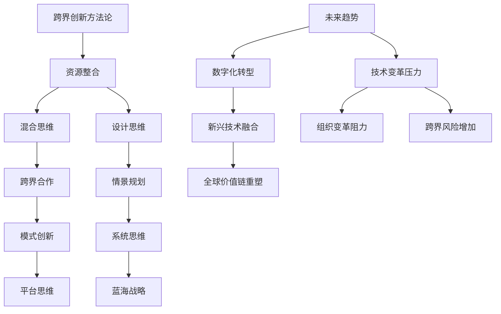

### 最佳实践 Tips

- **鼓励跨部门合作**：建立跨部门协作机制，促进不同部门之间的信息共享和资源整合。
- **建立创新实验室**：设立创新实验室，为创新项目提供资金、技术和人力资源支持。
- **关注用户反馈**：持续关注用户反馈，根据用户需求进行调整和优化，确保创新产品或服务的市场适应性。

### 小结

跨界创新是企业实现持续发展的重要途径。通过融合多领域智慧、运用创新方法与工具、建立跨界团队、促进跨界沟通、激励创新行为和创造有利环境，企业可以有效地实现跨界创新，提升竞争力。

### 注意事项

- **充分准备**：在跨界创新过程中，企业应充分准备，包括人才储备、技术储备和资源整合等。
- **风险管理**：跨界创新过程中，企业需重视风险管理，提前识别和应对潜在风险。
- **持续学习**：跨界创新要求企业持续学习，不断提升自身的技术和管理能力。

### 拓展阅读

- **“跨界创新：从0到1的实践指南”**
- **“跨界思维：打造创新思维，实现跨领域突破”**
- **“跨界合作：如何建立跨界合作关系，实现共赢”**

通过以上推荐资源和方法论框架，读者可以深入了解跨界创新的实践和理论，提升跨界创新能力，实现企业的发展和突破。希望这些内容能够为读者的跨界创新之旅提供有益的指导和支持。

---

## 文章标题

### 跨界创新：融合多领域智慧的领导方法

---

### 关键词

- 跨界创新
- 多领域智慧
- 领导方法
- 创新思维
- 平台思维
- 设计思维
- 情景规划
- 系统思维
- 蓝海战略

---

### 摘要

本文深入探讨了跨界创新的概念、背景、方法与工具，以及跨界创新的领导方法。首先，我们介绍了跨界创新的背景和重要性，阐述了全球化趋势、科技革命和企业竞争加剧对跨界创新的影响。接着，我们详细讨论了跨界创新的方法，包括混合思维、跨界合作、模式创新和平台思维，以及跨界创新的工具，如设计思维、情景规划、系统思维和蓝海战略。通过实际案例研究，我们展示了如何在不同领域和行业中运用这些方法和工具实现跨界创新。随后，我们探讨了跨界创新的领导者角色、思维模式、决策能力和领导策略，帮助领导者更好地引导团队进行跨界创新。最后，我们分析了跨界创新的未来趋势与挑战，为读者提供了应对策略和建议。通过本文，读者可以深入了解跨界创新的内涵和实现方法，提升跨界创新能力，推动企业实现持续发展。

---

## 完整文章

### 跨界创新：融合多领域智慧的领导方法

### 关键词：跨界创新、多领域智慧、领导方法、创新思维、平台思维、设计思维、情景规划、系统思维、蓝海战略

### 摘要

本文深入探讨了跨界创新的概念、背景、方法与工具，以及跨界创新的领导方法。首先，我们介绍了跨界创新的背景和重要性，阐述了全球化趋势、科技革命和企业竞争加剧对跨界创新的影响。接着，我们详细讨论了跨界创新的方法，包括混合思维、跨界合作、模式创新和平台思维，以及跨界创新的工具，如设计思维、情景规划、系统思维和蓝海战略。通过实际案例研究，我们展示了如何在不同领域和行业中运用这些方法和工具实现跨界创新。随后，我们探讨了跨界创新的领导者角色、思维模式、决策能力和领导策略，帮助领导者更好地引导团队进行跨界创新。最后，我们分析了跨界创新的未来趋势与挑战，为读者提供了应对策略和建议。通过本文，读者可以深入了解跨界创新的内涵和实现方法，提升跨界创新能力，推动企业实现持续发展。

---

#### 第一部分：跨界创新背景与重要性

在当今快速变化的世界中，跨界创新已经成为企业实现持续发展的关键因素。本部分将深入探讨跨界创新的背景和重要性，以帮助读者更好地理解这一概念。

##### 1. 跨界创新的定义与意义

**1.1 跨界创新的定义**

跨界创新是指通过融合不同领域、行业或学科的智慧与资源，推动技术创新、产品创新或业务模式创新的过程。它不仅仅局限于单一领域或技术的突破，而是强调通过跨界合作和思维，实现跨领域、跨行业的创新和突破。

**核心概念与联系：**
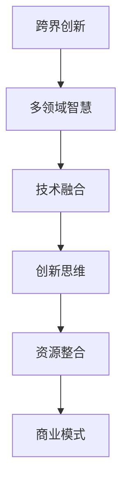

**1.2 跨界创新的意义**

跨界创新能够帮助企业打破传统思维定式，发掘新的市场机会，提升竞争力。通过跨界合作，企业可以借助外部智慧，快速应对市场变化，实现创新突破。

- **跨界创新在领导中的作用**：跨界创新要求领导者具备跨领域知识、创新能力和开放心态，能够推动团队进行跨领域的合作和创新。

##### 2. 跨界创新的背景

**2.1 全球化趋势**

全球化进程的加速使得企业面临着前所未有的机遇和挑战。不同国家和地区之间的文化、经济和技术的交流日益频繁，这为企业提供了跨界创新的广阔空间。企业可以通过跨文化合作，整合全球资源，创造出全新的商业模式和产品。

**2.2 科技革命**

科技的飞速发展，尤其是互联网、人工智能、大数据等新兴技术的出现，为企业提供了丰富的跨界创新工具和平台。例如，人工智能可以帮助企业实现业务自动化和智能化，而大数据分析则为企业提供了洞察市场趋势和消费者需求的能力。

**2.3 企业竞争加剧**

随着市场竞争的加剧，企业需要不断创新来保持竞争优势。跨界创新可以帮助企业跳出传统思维的框架，通过整合多领域的智慧，实现业务的突破和转型。

##### 3. 跨界创新的必要性

**3.1 创新驱动的需求**

在科技日新月异的时代，企业需要通过创新来保持竞争力。跨界创新可以为企业提供新的视角和思路，推动技术、产品和业务的创新。

**3.2 企业发展的挑战**

随着市场环境的不断变化，企业面临着越来越多的挑战。跨界创新可以帮助企业应对这些挑战，实现持续发展。

**3.3 市场竞争的压力**

在激烈的市场竞争中，企业需要通过创新来赢得市场份额。跨界创新可以为企业提供新的竞争优势，提升市场竞争力。

#### 第二部分：跨界创新的方法与工具

在了解了跨界创新的背景和重要性之后，接下来我们将探讨实现跨界创新的具体方法和工具。这些方法和工具将帮助企业有效地整合多领域智慧，推动创新和突破。

##### 4. 跨界创新的方法

**4.1 混合思维**

混合思维是一种将不同领域、文化和观点融合在一起进行思考的方法。通过混合思维，企业可以打破传统思维的限制，激发创新的火花。

**核心概念与联系：**
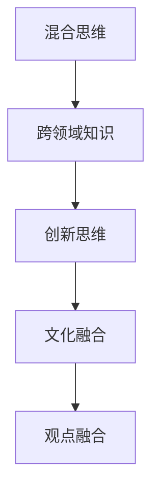

**混合思维的实现步骤：**

1. **识别不同领域的思维模式**：了解不同领域（如工程、艺术、人文科学）的思维方式和特点。
2. **融合多领域思维**：将不同领域的思维模式进行交叉融合，形成独特的思考方式。
3. **实践混合思维**：在实际项目中应用混合思维，尝试将不同领域的知识结合起来，解决复杂问题。

**伪代码实现：**
```python
def mixed_thinking(domain1, domain2):
    domain1_thinking_mode = get_thinking_mode(domain1)
    domain2_thinking_mode = get_thinking_mode(domain2)
    mixed_mode = merge_thinkings(domain1_thinking_mode, domain2_thinking_mode)
    solution = apply_mixed_mode(mixed_mode)
    return solution
```

**4.2 跨界合作**

跨界合作是指不同领域、行业或组织之间的合作，以实现共同的目标。跨界合作可以带来新的观点、资源和能力，促进创新和突破。

**核心概念与联系：**
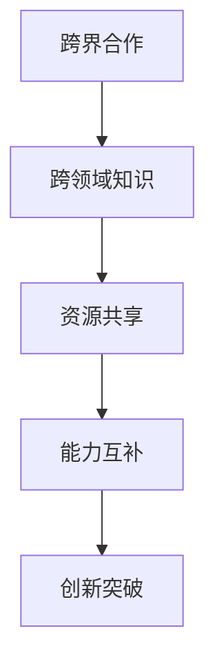

**跨界合作的实现步骤：**

1. **确定跨界合作的目标**：明确合作的目标和期望成果。
2. **建立跨界合作团队**：组建由不同领域专家组成的团队，确保团队成员具备互补的技能和知识。
3. **进行跨界交流**：鼓励团队成员之间的交流，分享各自领域的观点和经验。
4. **协同工作**：在团队内部进行协同工作，共同解决复杂问题。

**伪代码实现：**
```python
def cross_domain Cooperation(domain1, domain2, domain3):
    cooperation_objective = define_objective(domain1, domain2, domain3)
    team = create_team(domain1_experts, domain2_experts, domain3_experts)
    team_communication = facilitate_communication(team)
    solution = collaborative_work(team)
    return solution
```

**4.3 模式创新**

模式创新是指通过改变现有业务模式或创造新的业务模式，实现企业价值和竞争力的提升。模式创新可以涉及多个方面，如商业模式、运营模式、营销模式等。

**核心概念与联系：**
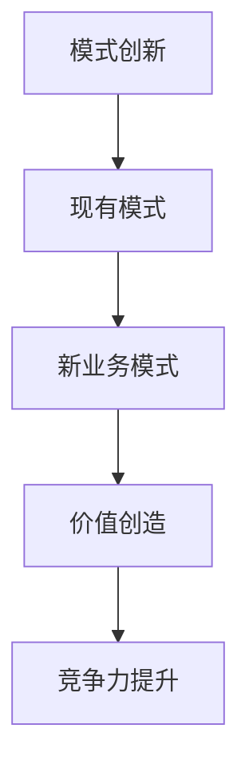

**模式创新的实现步骤：**

1. **分析现有模式**：深入了解现有业务模式和运营流程，找出问题和改进空间。
2. **探索新模式**：基于对现有模式的分析，探索新的商业模式和运营模式。
3. **实施新模式**：将新模式应用到实际运营中，并进行测试和优化。

**伪代码实现：**
```python
def business_model_innovation(current_model):
    analyzed_model = analyze_current_model(current_model)
    new_model = explore_new_models(analyzed_model)
    implemented_model = implement_new_model(new_model)
    return implemented_model
```

**4.4 平台思维**

平台思维是一种以平台为核心，整合多方资源和能力的思维方式。通过平台思维，企业可以构建一个开放的生态系统，促进创新和协同发展。

**核心概念与联系：**
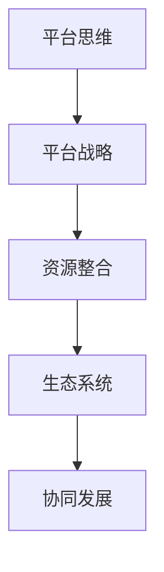

**平台思维的实现步骤：**

1. **构建平台战略**：明确企业的发展愿景，制定平台战略和规划。
2. **搭建平台架构**：设计和搭建平台的架构，包括技术平台、业务平台、合作平台等。
3. **整合多方资源**：吸引和整合外部合作伙伴和资源，共同构建平台生态。
4. **促进平台协同**：通过平台机制，促进多方协同合作，实现共赢。

**伪代码实现：**
```python
def platform_thinking(platform_strategy):
    strategy = build_platform_strategy(platform_strategy)
    platform_Architecture = build_platform_architecture(strategy)
    resources = integrate_multiple_resources(platform_architecture)
    collaboration = promote_platform_collaboration(resources)
    return collaboration
```

##### 5. 跨界创新的工具

除了方法，跨界创新还需要一些具体的工具来支持和推动。以下是一些常用的跨界创新工具：

**5.1 设计思维**

设计思维是一种以用户需求为中心，通过迭代和协作实现创新的方法。设计思维强调用户体验和迭代优化，适用于跨界创新的各个阶段。

**核心概念与联系：**
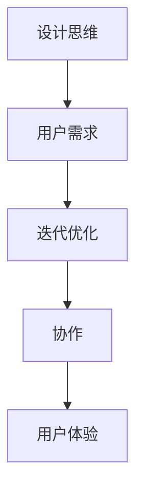

**设计思维的实现步骤：**

1. **用户需求分析**：深入了解目标用户的需求和痛点。
2. **头脑风暴**：收集创意和想法，进行头脑风暴。
3. **原型设计**：快速构建原型，进行用户测试和反馈。
4. **迭代优化**：根据用户反馈，不断迭代和优化产品。

**伪代码实现：**
```python
def design_thinking(user_needs):
    analyzed_needs = analyze_user_needs(user_needs)
    ideas = brainstorm_ideas(analyzed_needs)
    prototype = design_prototype(ideas)
    optimized_solution = iterate_and_optimize(prototype)
    return optimized_solution
```

**5.2 情景规划**

情景规划是一种通过设定不同的未来情景，探索潜在机会和挑战的方法。情景规划有助于企业预测未来趋势，制定相应的创新策略。

**核心概念与联系：**
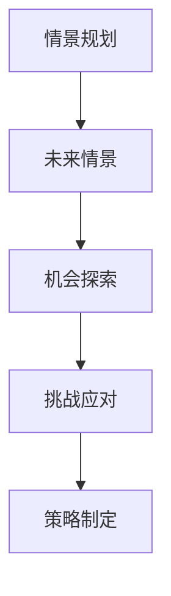

**情景规划的实现步骤：**

1. **设定情景**：基于对未来趋势的判断，设定不同的情景。
2. **情景分析**：分析每个情景下的机会和挑战。
3. **策略制定**：根据情景分析结果，制定相应的创新策略。

**伪代码实现：**
```python
def scenario_planning(scenarios):
    set_scenarios = define_scenarios(scenarios)
    analyzed_scenarios = analyze_scenarios(set_scenarios)
    strategies = define_strategies(analyzed_scenarios)
    return strategies
```

**5.3 系统思维**

系统思维是一种通过整体视角理解和解决问题的方法。系统思维强调各个部分之间的相互关系和相互作用，适用于跨界创新的复杂问题解决。

**核心概念与联系：**
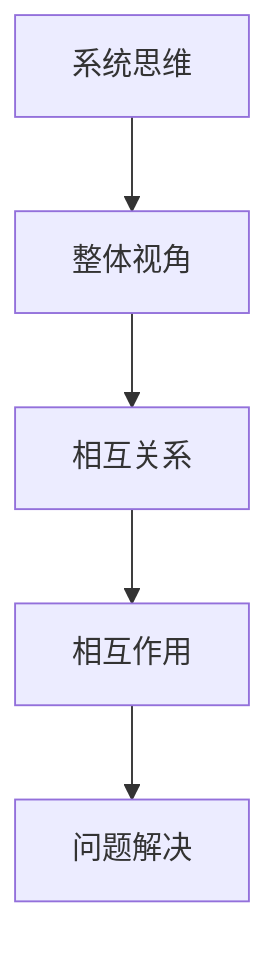

**系统思维的实现步骤：**

1. **识别系统元素**：确定系统中各个关键元素。
2. **分析元素关系**：分析各个元素之间的相互关系。
3. **优化系统结构**：根据分析结果，优化系统结构和流程。

**伪代码实现：**
```python
def system_thinking(system_elements):
    identified_elements = identify_system_elements(system_elements)
    relationships = analyze_element_relationships(identified_elements)
    optimized_structure = optimize_system_structure(relationships)
    return optimized_structure
```

**5.4 蓝海战略**

蓝海战略是一种通过创造新的市场空间，规避竞争的方法。蓝海战略鼓励企业寻找并开拓未被竞争占据的市场领域，实现持续增长。

**核心概念与联系：**
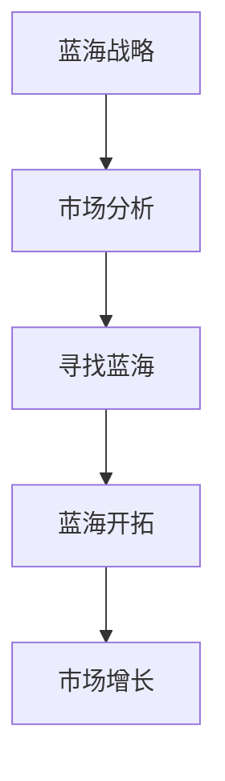

**蓝海战略的实现步骤：**

1. **市场分析**：分析现有市场和潜在市场。
2. **寻找蓝海**：通过创新和差异化，寻找新的市场机会。
3. **蓝海开拓**：制定并实施蓝海开拓策略，建立新的市场空间。

**伪代码实现：**
```python
def blue_ocean_strategy(current_market):
    analyzed_market = analyze_market(current_market)
    blue_oceans = find_blue_oceans(analyzed_market)
    blue_ocean_business = open_blue_ocean(blue_oceans)
    return blue_ocean_business
```

通过以上方法和工具，企业可以有效地进行跨界创新，实现跨领域、跨行业的创新和突破。在接下来的部分中，我们将通过实际案例，进一步探讨如何运用这些方法和工具，实现跨界创新的实践与应用。

#### 第三部分：跨界创新的实践与应用

在前面的部分中，我们详细介绍了跨界创新的方法和工具。在本节中，我们将通过具体的案例，探讨如何在实际操作中运用这些方法和工具，实现跨界创新的实践与应用。

##### 6. 跨界创新的案例研究

**案例一：苹果公司的跨界创新**

苹果公司是一家全球知名的高科技公司，其成功在很大程度上得益于持续的跨界创新。

**6.1 混合思维**

苹果公司在产品设计过程中，充分运用了混合思维。例如，iPhone的推出融合了通信、互联网、媒体和娱乐等多个领域的特性，开创了智能手机的新时代。

**6.2 跨界合作**

苹果公司在软件开发和硬件设计上与多个领域的公司进行跨界合作。例如，与谷歌合作开发Safari浏览器，与英特尔合作研发芯片。

**6.3 模式创新**

苹果公司通过创建App Store，颠覆了传统的软件分发模式，建立了全新的商业模式。

**6.4 平台思维**

苹果公司构建了iOS和MacOS等平台，吸引了大量的开发者和用户，形成了强大的生态系统。

**案例总结**：苹果公司的成功在于其不断创新，通过混合思维、跨界合作、模式创新和平台思维，实现了跨界创新。

**案例二：谷歌的AI医疗创新**

谷歌是一家全球领先的科技公司，其在人工智能医疗领域的创新引人注目。

**6.1 设计思维**

谷歌在开发AI医疗应用时，采用了设计思维，深入分析医生和患者的需求，设计出实用的工具。

**6.2 情景规划**

谷歌通过情景规划，预测未来的医疗趋势，制定相应的创新策略。

**6.3 系统思维**

谷歌在整合医疗数据时，采用了系统思维，确保数据的准确性和完整性。

**6.4 蓝海战略**

谷歌通过AI医疗创新，开拓了全新的市场空间，避免了与现有医疗企业的直接竞争。

**案例总结**：谷歌的AI医疗创新通过设计思维、情景规划、系统思维和蓝海战略，实现了跨界创新。

**案例三：京东的无界零售**

京东是一家中国的电商巨头，其在无界零售领域的创新具有代表性。

**6.1 跨界合作**

京东与多家零售企业、品牌进行跨界合作，打造全新的零售模式。

**6.2 模式创新**

京东通过无人超市、无人便利店等模式创新，实现了线下与线上的无缝连接。

**6.3 平台思维**

京东构建了京东云、京东物流等平台，为合作伙伴提供基础设施支持。

**6.4 系统思维**

京东在物流配送和供应链管理中，采用了系统思维，优化了整个流程。

**案例总结**：京东的无界零售通过跨界合作、模式创新、平台思维和系统思维，实现了跨界创新。

##### 7. 跨界创新的实践策略

通过以上案例，我们可以总结出跨界创新的实践策略：

**7.1 建立跨界思维**

企业领导者需要具备跨界思维，鼓励团队成员跨领域学习和合作。

**7.2 跨界资源的整合**

企业需要积极整合内部和外部资源，包括人才、技术、资金等。

**7.3 创新文化的培育**

企业需要建立创新文化，鼓励员工提出新想法，支持创新实践。

**7.4 跨界风险的管理**

企业需要对跨界创新过程中的风险进行管理，确保创新的可持续性。

通过以上策略，企业可以有效地进行跨界创新，实现持续发展。

#### 第四部分：跨界创新的领导方法

在跨界创新的旅程中，领导者的作用至关重要。他们不仅需要具备跨界思维和创新能力，还需要掌握有效的领导方法，以激发团队潜力，推动创新实践。本部分将探讨跨界创新的领导者角色、思维模式、决策能力和领导策略，以帮助领导者更好地引导企业实现跨界创新。

##### 8. 跨界创新的领导者角色

**8.1 领导者的素质要求**

作为跨界创新的领导者，需要具备以下素质要求：

- **跨领域知识**：领导者应具备跨领域知识，能够理解不同领域的思维方式和运作模式。这有助于他们在跨界合作中发挥桥梁作用，促进不同领域的有效沟通和协作。

- **创新能力**：领导者应具备强烈的创新能力，敢于打破传统思维框架，提出新颖的观点和解决方案。

- **开放心态**：领导者应具备开放心态，接受不同的意见和观点，鼓励团队成员提出创新想法。

- **风险管理能力**：领导者应具备风险管理能力，能够识别和应对跨界创新过程中可能出现的风险。

- **沟通能力**：领导者应具备优秀的沟通能力，能够清晰地传达愿景和目标，激励团队成员积极参与创新实践。

**8.2 领导者的思维模式**

跨界创新的领导者需要具备以下思维模式：

- **系统思维**：领导者应具备系统思维，能够从整体视角理解组织结构和流程，识别关键要素和相互关系。

- **用户思维**：领导者应具备用户思维，始终关注用户需求和体验，以用户为中心进行创新。

- **前瞻思维**：领导者应具备前瞻思维，能够预测未来趋势，提前布局，抢占市场先机。

- **跨界思维**：领导者应具备跨界思维，能够打破传统界限，整合多领域智慧，实现跨领域的创新突破。

**8.3 领导者的决策能力**

跨界创新的领导者需要具备以下决策能力：

- **战略决策**：领导者应具备战略决策能力，能够制定明确的创新战略，为企业的长远发展指明方向。

- **资源分配**：领导者应具备资源分配能力，能够合理配置人力、物力和财力，确保创新项目的顺利推进。

- **风险管理**：领导者应具备风险管理能力，能够识别和评估创新项目中的潜在风险，并采取有效的风险应对措施。

- **危机管理**：领导者应具备危机管理能力，能够应对跨界创新过程中出现的突发情况和挑战，确保项目的稳定进行。

##### 9. 跨界创新的领导策略

为了实现跨界创新，领导者需要采取一系列有效的领导策略，包括：

**9.1 建立跨界团队**

- **跨界团队的组织结构**：建立由不同领域专家组成的跨界团队，确保团队成员具备互补的技能和知识。

- **跨界团队的协作机制**：制定明确的协作机制，促进团队成员之间的沟通和合作，提高团队的整体效率。

- **跨界团队的激励机制**：制定激励政策，鼓励团队成员积极参与跨界创新，提高创新积极性。

**9.2 促进跨界沟通**

- **跨领域知识分享**：鼓励团队成员分享各自领域的知识和经验，促进跨领域的知识融合。

- **跨界会议**：定期组织跨界会议，为团队成员提供交流平台，讨论创新想法和解决方案。

- **跨界论坛**：举办跨界论坛，邀请外部专家和合作伙伴参与，拓展团队的视野和资源。

**9.3 激励创新行为**

- **创新奖励制度**：制定创新奖励制度，对在跨界创新中表现突出的团队成员给予奖励，激励他们继续创新。

- **创新文化**：建立创新文化，鼓励团队成员勇于尝试、包容失败，营造一个积极向上的创新氛围。

- **创新培训**：提供创新培训，提高团队成员的创新能力和跨界协作能力。

**9.4 创造有利环境**

- **资源支持**：为跨界创新项目提供充足的资源支持，包括资金、人力和技术支持等。

- **灵活的决策机制**：建立灵活的决策机制，确保创新项目能够快速响应市场变化，实现及时调整。

- **风险管理**：建立风险管理机制，对跨界创新项目进行全程监控，及时发现和解决潜在风险。

通过以上领导策略，领导者可以有效地激发团队的创新潜力，推动跨界创新的实践和应用。在接下来的部分中，我们将进一步探讨跨界创新的未来趋势与挑战，以帮助读者更好地应对未来的机遇和挑战。

#### 第五部分：跨界创新的未来趋势与挑战

随着科技的飞速发展和全球化进程的加速，跨界创新的未来趋势愈发明显。以下是几个关键趋势：

**10.1 数字化转型的深化**

数字化转型已经成为全球企业的重要战略。随着大数据、人工智能、物联网等技术的普及，企业可以通过跨界合作，实现业务流程的智能化和高效化，提升竞争力。

- **示例**：制造业企业与科技公司合作，利用大数据和人工智能优化生产流程，提高生产效率和产品质量。

**10.2 新兴技术的融合**

未来，新兴技术如人工智能、区块链、5G等将不断融合，带来更多的创新机会。这些技术将为跨界创新提供强大的工具和支持。

- **示例**：区块链技术可以与供应链管理结合，实现供应链的透明化和智能化，提高供应链的效率。

**10.3 全球价值链的重塑**

全球化进程使得企业的价值链越来越复杂，跨界创新将帮助企业重塑全球价值链，优化资源配置，提高竞争力。

- **示例**：跨国企业通过跨界合作，整合全球资源，实现全球价值链的优化，提高市场响应速度。

##### 11. 跨界创新的挑战与应对

尽管跨界创新带来了巨大的机遇，但也伴随着一系列挑战。以下是几个关键挑战及应对策略：

**11.1 技术变革的压力**

新兴技术的快速迭代给企业带来了巨大的压力，企业需要不断更新技术，以保持竞争力。

- **应对策略**：
  - **持续投资**：企业应持续投资技术研发，保持技术领先地位。
  - **人才引进**：引进具备新技术能力的人才，提升企业的技术实力。

**11.2 组织变革的阻力**

跨界创新往往需要企业进行组织变革，打破部门壁垒，实现跨部门合作。然而，组织变革往往面临阻力。

- **应对策略**：
  - **领导者的示范作用**：领导者应积极推动组织变革，通过自身行为树立榜样。
  - **员工培训**：为员工提供培训，提升他们的跨部门协作能力和创新意识。

**11.3 跨界风险的增加**

跨界创新过程中，企业面临的风险也相对增加，包括技术风险、市场风险和运营风险等。

- **应对策略**：
  - **风险管理**：建立完善的风险管理机制，对跨界创新项目进行全程监控。
  - **试点项目**：通过试点项目，逐步探索和验证跨界创新方案，降低风险。

通过应对以上挑战，企业可以更好地把握跨界创新的机遇，实现持续发展。在未来的跨界创新道路上，企业需要持续关注科技发展，积极应对挑战，以实现跨界创新的突破和成功。

### 附录

##### 跨界创新相关资源推荐

1. **书籍**：
   - 《跨界创新：融合多领域智慧的领导方法》
   - 《跨界思维：打造创新思维，实现跨领域突破》
   - 《设计思维：创新的思考方式与实战指南》

2. **在线课程**：
   - Coursera上的“Design Thinking for Innovation”课程
   - Udemy上的“Cross-Disciplinary Innovation: Bridging Diverse Fields for Breakthrough Ideas”课程

3. **期刊与杂志**：
   - 《科学美国人》杂志的“Scientific American”
   - 《哈佛商业评论》杂志的“Harvard Business Review”

4. **在线平台**：
   - Medium上的“Crossing Boundaries”专栏
   - LinkedIn上的“Innovation and Entrepreneurship”群组

##### 跨界创新方法论框架图


##### 最佳实践 Tips

- **鼓励跨部门合作**：建立跨部门协作机制，促进不同部门之间的信息共享和资源整合。
- **建立创新实验室**：设立创新实验室，为创新项目提供资金、技术和人力资源支持。
- **关注用户反馈**：持续关注用户反馈，根据用户需求进行调整和优化，确保创新产品或服务的市场适应性。

##### 小结

跨界创新是企业实现持续发展的重要途径。通过融合多领域智慧、运用创新方法与工具、建立跨界团队、促进跨界沟通、激励创新行为和创造有利环境，企业可以有效地实现跨界创新，提升竞争力。

##### 注意事项

- **充分准备**：在跨界创新过程中，企业应充分准备，包括人才储备、技术储备和资源整合等。
- **风险管理**：跨界创新过程中，企业需重视风险管理，提前识别和应对潜在风险。
- **持续学习**：跨界创新要求企业持续学习，不断提升自身的技术和管理能力。

##### 拓展阅读

- **“跨界创新：从0到1的实践指南”**
- **“跨界思维：打造创新思维，实现跨领域突破”**
- **“跨界合作：如何建立跨界合作关系，实现共赢”**

通过以上推荐资源和方法论框架，读者可以深入了解跨界创新的实践和理论，提升跨界创新能力，实现企业的发展和突破。

---

### 作者信息

作者：AI天才研究院/AI Genius Institute & 禅与计算机程序设计艺术 /Zen And The Art of Computer Programming

