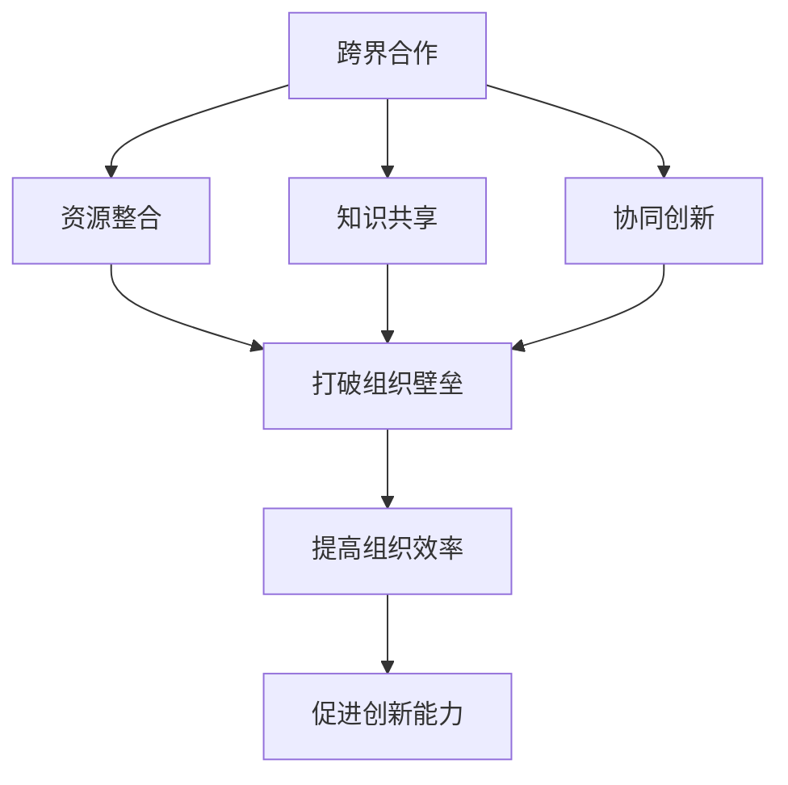

                 

### 背景介绍

在当今的快速变化和高度竞争的商业环境中，企业面临着前所未有的挑战和机遇。传统的垂直分工和部门隔阂已不再适应市场需求的多样性和复杂性。跨界合作作为一种创新的领导策略，正逐渐成为企业提升竞争力、实现可持续发展的重要手段。跨界合作不仅仅是跨行业、跨领域的合作，更是一种打破传统思维模式，实现资源整合、知识共享和协同创新的过程。

本篇文章旨在探讨跨界合作在企业管理中的重要性，以及如何通过打破组织壁垒，实现跨界合作的领导策略。文章将首先介绍跨界合作的概念，解析其与组织壁垒之间的联系。接着，我们将深入探讨跨界合作的理论基础，以及组织壁垒的成因与影响。在此基础上，文章将详细阐述跨界合作的领导策略，包括领导者的角色、跨部门合作机制的建立、跨文化沟通与理解等。随后，我们将通过实践应用、案例分析，以及领导艺术等角度，进一步探讨如何在实际操作中实现跨界合作。最后，文章将总结跨界合作的未来趋势，提出相应的最佳实践和注意事项。

通过这一系列的分析和探讨，我们希望读者能够对跨界合作有一个全面、深入的理解，掌握其在企业管理中的实际应用方法，从而为企业的持续创新和长远发展提供有力支持。

### 核心概念与联系

首先，我们需要明确两个关键概念：跨界合作与组织壁垒。

#### 跨界合作

跨界合作是指不同行业、领域或组织之间的合作，通过资源整合、知识共享和协同创新，实现各自目标和价值的最大化。在跨界合作中，各参与方不仅可以在技术和资源上互相补充，还可以在文化和思维上相互启发，从而激发创新的火花。

**跨界合作的关键特征**：

1. **多样性**：跨界合作跨越了不同的行业、领域和学科，涵盖了广泛的知识和技能。
2. **互补性**：各参与方在资源、技术和人才上各有所长，通过合作实现优势互补。
3. **协同性**：跨界合作要求各参与方协同工作，共同面对挑战，实现共同目标。
4. **创新性**：跨界合作往往能够带来新的思路和方法，促进技术创新和商业模式创新。

#### 组织壁垒

组织壁垒是指企业内部由于分工、文化和流程等原因产生的障碍，限制了信息的流通和资源的有效配置。这些壁垒不仅影响了组织的效率，也限制了其创新能力。

**组织壁垒的主要表现**：

1. **部门隔离**：各部门之间缺乏有效的沟通和协调，导致信息孤岛现象。
2. **文化冲突**：不同的部门或团队拥有不同的价值观和工作方式，容易产生文化冲突。
3. **流程障碍**：繁琐的审批流程和复杂的组织结构，增加了工作的难度和成本。
4. **资源分配不均**：资源分配的不均衡可能导致某些部门或团队资源过剩，而另一些则资源匮乏。

**跨界合作与组织壁垒的关系**

跨界合作与组织壁垒之间存在密切的联系。一方面，跨界合作往往需要打破组织壁垒，实现跨部门的协作和资源的有效配置。例如，一个企业在开展跨行业合作时，需要跨越部门隔离、文化冲突和流程障碍等壁垒，建立高效的跨部门合作机制。另一方面，组织壁垒的存在也可能阻碍跨界合作的发展。如果企业内部存在严重的组织壁垒，跨界合作可能面临沟通不畅、资源调配困难等问题，从而影响合作效果。

**跨界合作与组织壁垒的关系架构 Mermaid 流程图**

下面是一个简化的 Mermaid 流程图，描述了跨界合作与组织壁垒之间的关系：

在这个流程图中，跨界合作通过资源整合、知识共享和协同创新，打破了组织壁垒，从而提高了组织的效率和创新能力。这种关系强调了跨界合作在企业管理中的重要性，同时也提醒领导者需要关注如何有效打破组织壁垒，实现跨界合作的长期成功。

### 跨界合作的理论基础

要深入理解跨界合作，我们需要探讨其理论基础，包括跨界合作的原理、模式以及其背后的动力与障碍。

#### 跨界合作的原理

跨界合作的原理主要基于以下几个方面：

1. **资源整合**：跨界合作通过整合不同行业、领域或组织中的资源，包括人才、技术和资金等，实现优势互补，提高整体效益。
2. **知识共享**：跨界合作促进了不同领域之间的知识交流，使得各参与方能够从中获取新的思维和方法，激发创新。
3. **协同效应**：跨界合作通过跨部门的协作，可以降低成本、提高效率，实现“1+1>2”的效果。
4. **风险分担**：跨界合作可以将风险分散到多个参与方，从而降低单个企业的风险承受能力。

#### 跨界合作的模式

跨界合作可以采取多种模式，以下是一些常见的合作模式：

1. **战略联盟**：通过签订战略合作协议，不同企业或组织在特定领域内共享资源和市场，实现共赢。
2. **合资企业**：两个或多个企业共同出资成立新的企业，共同承担风险和收益。
3. **供应链合作**：企业通过与其供应商和分销商建立紧密的合作关系，实现供应链的整体优化。
4. **技术创新联盟**：企业、研究机构和大学等在特定技术领域内合作，共同进行研发和创新。

#### 跨界合作的动力

跨界合作之所以能够得到广泛推广，源于以下几个动力：

1. **市场需求的多样化**：消费者需求越来越多样化，企业需要通过跨界合作来满足不同市场的需求。
2. **技术创新的驱动**：跨界合作能够带来新的技术和思维，推动企业技术创新和产品升级。
3. **资源优化配置**：跨界合作可以优化资源配置，提高企业效率和竞争力。
4. **风险分担**：通过跨界合作，企业可以将风险分散到多个合作伙伴，降低风险。

#### 跨界合作的障碍

尽管跨界合作具有诸多优势，但企业在实际操作中仍会面临以下障碍：

1. **文化冲突**：不同企业或组织之间的文化差异可能导致沟通不畅和合作障碍。
2. **信任缺失**：跨界合作要求各方之间建立信任，但不同企业之间存在竞争关系，信任建立难度较大。
3. **利益分配**：跨界合作的收益和风险分配需要各方协商，但利益分配不均可能影响合作的持续性。
4. **管理复杂性**：跨界合作增加了企业的管理复杂性，需要协调多个合作伙伴，管理难度较大。

通过以上对跨界合作的理论基础的探讨，我们可以更好地理解跨界合作在企业管理中的重要作用。理解跨界合作的原理和模式，有助于企业领导者制定有效的跨界合作策略，克服合作中的障碍，实现企业的发展目标。

### 组织壁垒的成因与影响

组织壁垒是企业管理中常见的现象，其成因复杂多样，直接影响企业的运营效率和创新力。以下我们将详细分析组织壁垒的成因及其对企业的影响。

#### 组织壁垒的成因

1. **部门隔离**：企业的部门设置往往导致信息孤岛，各部门之间缺乏有效的沟通和协作，形成隔离。这种隔离不仅限制了信息的流通，还可能导致资源的重复配置和浪费。

2. **文化差异**：不同部门或团队之间的价值观、工作方式和习惯可能存在显著差异，导致文化冲突。文化差异可能源于不同部门的历史背景、管理风格和人员构成。

3. **流程障碍**：企业的流程设计和审批流程可能过于繁琐，增加了工作难度和成本。一些跨部门的流程需要经过多个审批环节，导致决策效率低下，增加了协作难度。

4. **资源分配不均**：企业内部资源分配的不均衡可能导致某些部门资源过剩，而另一些则资源匮乏。资源分配不均可能源于企业战略、业务需求和部门优先级的不同。

5. **信息不对称**：信息不对称是指企业内部某些部门或员工掌握重要信息，而其他部门或员工无法及时获取。这种信息不对称可能导致决策失误和运营问题。

#### 组织壁垒的影响

1. **效率低下**：组织壁垒限制了跨部门的协作和信息流通，导致工作效率降低。部门之间的沟通不畅、资源调配困难，增加了企业的运营成本。

2. **创新受阻**：组织壁垒阻碍了新思想和新技术的传播，限制了企业的创新能力。文化差异和流程障碍使得企业难以快速响应市场变化，创新力受到抑制。

3. **人才流失**：组织壁垒可能使得员工感到被隔离和不被重视，影响员工的积极性和忠诚度。文化冲突和管理复杂性可能导致优秀人才流失。

4. **决策困难**：组织壁垒增加了企业的决策难度和成本。信息不对称和流程障碍使得高层管理者难以全面了解企业运营情况，影响决策质量。

5. **竞争力下降**：组织壁垒限制了企业的资源配置和协同能力，导致其难以在激烈的市场竞争中保持优势。效率低下和创新受阻使得企业竞争力下降。

通过以上分析，我们可以看到组织壁垒对企业的负面影响是多方面的。企业需要认识到组织壁垒的存在及其危害，采取有效措施加以解决，以提升运营效率、增强创新能力和提升竞争力。

#### 破解组织壁垒的策略

为了有效破解组织壁垒，企业需要从多个维度采取综合性的策略，以下是一些关键措施：

1. **加强跨部门沟通**：建立跨部门的沟通机制，促进信息流通。可以定期组织跨部门会议、工作坊和培训，增强各部门之间的了解和协作。

2. **建立跨职能团队**：通过成立跨职能团队，将不同部门的人员集中在一起，共同完成项目。这种团队模式有助于打破部门隔阂，促进协作和创新。

3. **优化流程设计**：简化审批流程，减少冗余环节，提高决策效率。通过流程再造和流程优化，降低跨部门协作的难度和成本。

4. **文化融合**：推动企业文化的融合，建立共同价值观和行为准则。通过团队建设活动、文化交流和领导者的示范作用，增强企业内部的文化认同和协作精神。

5. **共享资源与信息**：建立资源共享平台和信息管理系统，促进企业内部资源的合理配置和信息的快速传递。通过共享资源的手段，减少资源浪费和重复配置。

6. **激励机制**：建立有效的激励机制，鼓励员工积极参与跨部门协作和创新。通过绩效评估、奖励制度和晋升机会，激发员工的积极性和创造力。

7. **领导者的角色**：领导者需要发挥关键作用，推动和引领跨部门合作。领导者应具备开放的心态和卓越的沟通能力，积极倡导和推动组织变革。

通过以上策略，企业可以逐步破解组织壁垒，提高运营效率和创新能力，从而在激烈的市场竞争中保持优势。

### 跨界合作的领导策略

在跨界合作中，领导者的角色至关重要。领导者不仅需要具备卓越的领导能力，还需要明确跨界合作的目标，建立有效的跨部门合作机制，并推动跨文化的沟通与理解。

#### 领导者的角色与责任

领导者作为跨界合作的核心，需要承担以下责任：

1. **愿景规划**：领导者需要明确跨界合作的目标和愿景，为团队成员提供清晰的方向和目标。
2. **资源调配**：领导者需要协调各方资源，确保跨界合作项目的顺利进行。
3. **冲突调解**：在跨界合作过程中，领导者需要具备出色的沟通和调解能力，解决潜在的冲突和问题。
4. **团队建设**：领导者需要推动团队建设，增强团队成员的凝聚力和合作精神。
5. **持续激励**：领导者需要通过激励措施，保持团队成员的积极性和创造力。

#### 建立跨部门合作机制

建立有效的跨部门合作机制，是实现跨界合作的关键。以下是一些具体措施：

1. **明确职责和权限**：明确各部门在跨界合作中的职责和权限，确保每个部门都能在项目中发挥其最大价值。
2. **设立项目办公室**：设立专门的项目办公室，负责协调和管理跨界合作项目，确保各方的协作和沟通。
3. **定期会议和沟通**：定期组织跨部门会议和沟通，确保各部门之间的信息畅通和协作高效。
4. **共同目标和考核**：制定共同的目标和考核标准，确保各部门在跨界合作中的努力方向一致，并能够公正地评估项目成果。

#### 促进跨文化沟通与理解

跨文化沟通与理解是跨界合作成功的关键。以下是一些策略：

1. **文化培训**：为员工提供文化培训，帮助他们了解和尊重不同文化背景的同事，减少文化冲突。
2. **开放沟通渠道**：建立开放的沟通渠道，鼓励员工表达不同观点和意见，促进团队的多元性和创新性。
3. **建立信任关系**：通过建立信任关系，增强团队成员之间的信任和合作意愿。
4. **领导者示范作用**：领导者需要通过自身的行为示范，推动跨文化的沟通和理解，树立榜样。

通过以上策略，领导者可以有效地推动跨界合作，实现资源的整合和创新，提升企业的整体竞争力。

### 跨界合作的实践应用

在实际操作中，跨界合作需要具体的规划和执行，以下将从项目规划、风险管理和绩效评估三个方面，详细探讨跨界合作的实践应用。

#### 项目规划

项目规划是跨界合作成功的关键步骤，包括以下关键要素：

1. **需求分析**：明确跨界合作的需求和目标，分析各方的利益和期望，确保合作项目的可行性和价值。
2. **资源调配**：根据项目需求，调配各方资源，包括人力、资金和技术等，确保项目的顺利推进。
3. **时间表和里程碑**：制定详细的时间表和里程碑，明确项目的进度和关键节点，确保各阶段目标的实现。
4. **预算管理**：合理规划项目的预算，确保资金的使用效率和项目的经济效益。
5. **沟通计划**：制定沟通计划，确保各方在项目执行过程中能够及时沟通和协作，解决潜在的问题和冲突。

#### 风险管理

在跨界合作中，风险管理是确保项目成功的重要环节。以下是一些风险管理策略：

1. **风险识别**：识别项目中可能出现的风险，包括技术风险、市场风险、资源风险和沟通风险等。
2. **风险评估**：对识别出的风险进行评估，确定其影响程度和发生概率，制定相应的应对策略。
3. **风险应对**：制定具体的应对措施，包括风险规避、风险转移、风险减轻和风险接受等，确保在风险发生时能够及时响应和应对。
4. **持续监控**：在项目执行过程中，持续监控风险的变化和项目进展，及时调整风险管理策略，确保项目的顺利进行。

#### 绩效评估

绩效评估是衡量跨界合作项目成效的重要手段。以下是一些绩效评估策略：

1. **目标设定**：明确项目目标和绩效指标，确保评估有明确的标准和依据。
2. **数据收集**：收集项目执行过程中的数据，包括项目进度、资源使用、质量指标和客户反馈等。
3. **评估方法**：采用多种评估方法，如关键绩效指标（KPI）、平衡计分卡（BSC）和360度评估等，确保评估的全面性和客观性。
4. **反馈和改进**：根据评估结果，及时反馈项目执行中的优点和不足，制定改进措施，优化项目执行流程。
5. **持续优化**：通过持续的绩效评估和反馈，不断优化项目执行和管理，提高项目的整体效益。

通过项目规划、风险管理和绩效评估的全面实践，企业可以有效地推进跨界合作，实现资源的整合和创新，提升企业的竞争力和可持续发展能力。

### 跨界合作案例分析

为了更深入地理解跨界合作在实际操作中的成功和挑战，以下将通过两个典型案例，详细分析其跨界合作的过程、成果和经验教训。

#### 案例一：跨国企业的成功跨界合作

**案例背景**：
某国际知名电子产品制造商在与全球领先的互联网公司合作开发智能设备时，面临跨行业、跨文化的挑战。

**合作过程**：
1. **需求分析与目标设定**：双方在合作初期进行了详细的需求分析，明确了合作的目标和预期成果，包括智能设备的研发和市场的快速占领。
2. **资源整合与分工**：双方整合了各自的优势资源，电子产品制造商提供了硬件技术和生产资源，互联网公司提供了软件技术和市场渠道。
3. **项目管理和沟通**：建立了联合项目办公室，定期召开项目会议，确保信息的畅通和协调。双方还设立了专门的跨文化沟通团队，处理文化差异和沟通障碍。
4. **技术创新与合作**：在项目执行过程中，双方通过技术创新和协作，成功开发了多款智能设备，并在短时间内投放市场。

**成果**：
- **市场占有率**：智能设备在市场上取得了较高的占有率，帮助电子产品制造商拓展了新市场，实现了业绩增长。
- **技术创新**：通过跨界合作，双方在技术和产品上取得了显著的突破，提高了市场竞争力。
- **品牌提升**：跨界合作的成功，提升了双方的品牌形象和声誉，为未来的合作奠定了基础。

**经验教训**：
- **明确目标与分工**：在合作初期，明确双方的目标和分工，确保合作方向一致，避免资源浪费和冲突。
- **文化融合与沟通**：建立有效的跨文化沟通机制，处理文化差异和沟通障碍，确保合作顺利进行。
- **持续创新与协作**：通过持续的技术创新和协作，保持项目的活力和竞争力。

#### 案例二：国内企业的跨界合作实践

**案例背景**：
某国内领先的新能源企业与一家知名的汽车制造商合作，开发新能源汽车。

**合作过程**：
1. **需求分析与目标设定**：双方在合作初期明确了新能源汽车的市场需求和发展趋势，设定了共同的目标，即开发出具有市场竞争力的新能源汽车。
2. **资源整合与分工**：新能源企业提供了电池技术，汽车制造商提供了整车设计和生产资源。双方在资源整合的基础上，制定了详细的项目计划和分工。
3. **技术研发与生产**：双方在技术研发和生产环节上紧密合作，通过多次试验和调整，最终开发出了性能优异的新能源汽车。
4. **市场推广与合作**：双方共同负责新能源汽车的市场推广，利用各自的市场渠道和品牌影响力，迅速扩大市场份额。

**成果**：
- **市场份额**：新能源汽车在市场上取得了显著的成功，迅速占据了较大的市场份额。
- **技术创新**：通过跨界合作，双方在电池技术和整车设计上取得了突破，提升了新能源汽车的整体性能。
- **品牌提升**：跨界合作的成功，提升了双方的品牌形象和市场地位。

**经验教训**：
- **技术创新的重要性**：跨界合作中，技术创新是关键，双方需要共同投入资源和精力，确保技术的先进性和实用性。
- **市场策略的协同**：双方在市场推广策略上需要协同一致，利用各自的优势，提高市场占有率和品牌影响力。
- **合作机制的灵活性**：跨界合作需要灵活应对市场变化，调整合作策略，确保项目的持续性和稳定性。

通过以上两个案例的分析，我们可以看到，跨界合作在成功实施过程中，需要明确的规划、有效的沟通和持续的创新。同时，也面临着文化和资源的挑战。成功的关键在于明确目标、资源整合和持续创新。这些经验教训对于企业实施跨界合作具有重要的指导意义。

### 跨界合作中的领导艺术

在跨界合作中，领导者的角色至关重要。领导者不仅需要具备卓越的领导能力，还需要掌握一系列的领导艺术，以应对跨界合作中的复杂性和挑战。

#### 领导者的信任建立

信任是跨界合作的基础，领导者需要在合作各方之间建立信任关系。以下是一些关键策略：

1. **开放沟通**：领导者应保持开放的沟通态度，鼓励团队成员表达不同观点和意见，建立透明的沟通渠道。
2. **公正决策**：领导者需在决策过程中保持公正，确保各方的利益得到公平对待，增强合作意愿。
3. **诚信行为**：领导者应以诚信为本，言行一致，树立良好的榜样，赢得团队的信任。

#### 领导者的沟通技巧

有效的沟通是跨界合作成功的关键。以下是一些提升沟通技巧的方法：

1. **倾听**：领导者应学会倾听，理解各方的需求和期望，确保信息传递的准确性和完整性。
2. **明确表达**：领导者需清晰、准确地表达自己的想法和意见，避免误解和冲突。
3. **情感共鸣**：领导者应尝试从对方的角度思考问题，建立情感共鸣，增强合作共识。

#### 领导者的团队建设

团队建设是提升跨界合作效率的重要手段。以下是一些团队建设的策略：

1. **共同目标**：领导者需明确团队的目标和愿景，确保团队成员在共同目标下协同工作。
2. **多元化团队**：领导者应鼓励多元化团队的建设，利用不同背景和技能的成员优势，提升团队的创新力和适应性。
3. **持续培训**：领导者应定期为团队成员提供培训和学习机会，提升其专业能力和团队协作能力。

#### 领导者的激励策略

激励是保持团队活力和创造力的关键。以下是一些有效的激励策略：

1. **绩效考核**：建立合理的绩效考核体系，对团队成员的工作进行公正的评价和激励。
2. **奖励制度**：设立奖励制度，对在跨界合作中表现优异的团队和个人进行奖励，激发其积极性和创造力。
3. **职业发展**：为团队成员提供职业发展的机会和平台，激励其持续学习和成长。

通过以上领导艺术的运用，领导者可以有效提升跨界合作的效率和质量，实现资源的整合和创新，推动企业的持续发展。

### 跨界合作的未来趋势

随着全球化进程的加速和技术的不断创新，跨界合作正在迎来新的发展趋势。这些趋势不仅对企业的运营模式产生深远影响，也要求领导者具备前瞻性和适应性。

#### 新趋势

1. **数字化转型**：数字化转型已经成为跨界合作的重要驱动力。通过大数据、人工智能、区块链等技术的应用，企业可以更高效地整合资源、优化流程和提升决策质量。
2. **生态系统的形成**：跨界合作正从单点合作向生态系统合作转变。企业不再局限于单一行业的合作，而是构建涵盖多个行业和领域的生态系统，实现更大范围的价值创造。
3. **可持续发展**：可持续发展成为跨界合作的新目标。企业通过跨界合作，共同应对环境、社会和经济挑战，实现长期可持续发展。
4. **开放式创新**：开放式创新正成为跨界合作的重要模式。企业通过开放平台、合作研发和共享资源，与外部合作伙伴共同创新，提升企业的竞争力。

#### 挑战与机遇

1. **技术挑战**：跨界合作中的新技术应用，如人工智能和大数据，虽然带来了新的机遇，但也对企业的技术能力和管理水平提出了更高要求。
2. **文化冲突**：跨界合作中的文化差异和价值观冲突，可能影响团队协作和项目进展。领导者需要具备跨文化沟通和管理的技能，以应对这些挑战。
3. **资源分配**：跨界合作中，如何合理分配资源，确保各方的利益得到平衡，是领导者需要解决的重要问题。
4. **风险控制**：跨界合作中的风险更大，领导者需要建立有效的风险管理机制，确保项目的稳定性和可持续性。

#### 发展预测

1. **跨界合作的常态化**：随着跨界合作的不断深入，它将成为企业运营的常态，而非特殊情况。
2. **领导者角色的转变**：领导者需要从传统的控制者转变为协作者和促进者，推动跨界合作的成功。
3. **跨界合作的深化**：跨界合作将不再局限于单一行业或领域，而是深入到各个产业链和生态系统中，实现更广泛的协同创新。

通过以上分析，我们可以预见，跨界合作将在未来持续发展，成为企业提升竞争力、实现可持续发展的重要手段。领导者需要敏锐洞察市场变化，灵活应对挑战，积极把握机遇，推动跨界合作的深入发展。

### 最佳实践

在跨界合作中，企业可以借鉴以下最佳实践来确保项目成功：

1. **明确目标与分工**：在项目启动前，明确各方的目标和职责，确保合作方向一致，避免资源浪费和冲突。
2. **文化融合**：为团队成员提供跨文化培训，建立共同价值观和行为准则，减少文化差异带来的冲突。
3. **透明沟通**：建立开放的沟通渠道，鼓励团队成员表达不同观点和意见，确保信息传递的准确性和及时性。
4. **共享资源**：通过资源共享平台，促进企业内部资源的合理配置和信息的快速传递，减少资源浪费。
5. **建立信任**：通过诚信行为和公正决策，建立各方之间的信任关系，为跨界合作奠定坚实基础。
6. **持续反馈与改进**：定期评估项目进展和绩效，及时反馈问题，制定改进措施，优化项目执行流程。

这些最佳实践有助于企业克服跨界合作中的障碍，实现资源的整合和创新，提升整体竞争力。

### 小结

本文系统地探讨了跨界合作的重要性以及如何通过打破组织壁垒实现有效的领导策略。我们从背景介绍、核心概念与联系、理论基础、组织壁垒成因与影响、领导策略、实践应用、案例分析到未来趋势，全面剖析了跨界合作的各个方面。关键结论包括：

1. **跨界合作是企业管理中的关键策略**，通过资源整合、知识共享和协同创新，企业可以实现优势互补和持续创新。
2. **打破组织壁垒**是跨界合作成功的前提，领导者需要采取一系列策略，如加强跨部门沟通、建立跨职能团队和优化流程设计等。
3. **领导者的角色至关重要**，他们需要建立信任、掌握沟通技巧和推动团队建设，以确保跨界合作的顺利进行。
4. **跨界合作在实践中面临诸多挑战**，但通过科学的项目规划、有效的风险管理和合理的绩效评估，企业可以克服这些挑战，实现跨界合作的成功。

通过本文的分析，我们希望读者能够对跨界合作有更深入的理解，掌握其实施方法和策略，为企业的持续创新和长远发展提供有力支持。

### 注意事项与拓展阅读

在实施跨界合作时，企业需要特别注意以下几点：

1. **确保明确目标与分工**：在项目启动前，明确各方的目标和职责，避免合作过程中的目标偏差和资源浪费。
2. **文化融合与沟通**：为团队成员提供跨文化培训，建立共同价值观和行为准则，减少文化差异带来的冲突。
3. **透明沟通**：建立开放的沟通渠道，确保信息传递的准确性和及时性，增强团队成员之间的信任和协作。
4. **共享资源与信息**：通过资源共享平台，促进企业内部资源的合理配置和信息的快速传递，提高整体效率。

为了进一步了解跨界合作的相关理论和实践，推荐以下拓展阅读资源：

1. **书籍**：《跨界创新：重塑企业的竞争力》（作者：陈春花）和《跨界共赢：如何建立成功的跨界合作》（作者：张涛）。
2. **论文**：查阅相关学术期刊和会议论文，如《管理科学学报》、《工业技术经济》等，了解跨界合作的前沿研究。
3. **案例研究**：研究国内外成功和失败的跨界合作案例，从实际操作中学习经验和教训。
4. **在线资源**：访问相关行业网站和论坛，如“MBA智库”、“企业观察家”等，获取最新的跨界合作资讯和实践经验。

通过以上阅读资源，读者可以进一步深化对跨界合作的理解，提升其实际操作能力。

