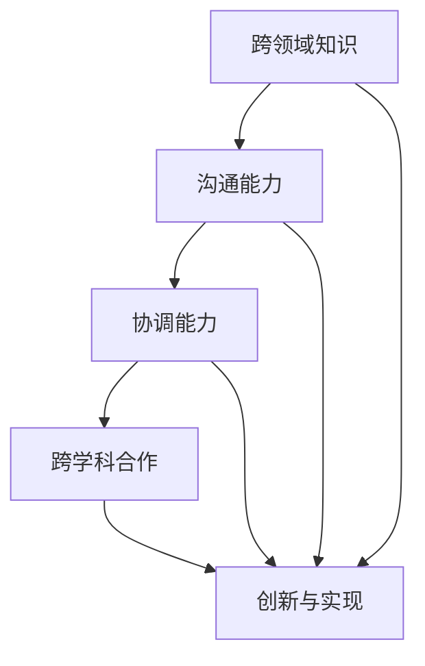

                 


### 文章标题：跨界领导：在不同领域间建立联系

#### 关键词：跨界领导，多学科协作，领导力，领域交叉，联系建立

#### 摘要：
在现代信息技术迅速发展的时代，各领域的知识和技术越来越呈现出融合和交叉的趋势。本文以《跨界领导：在不同领域间建立联系》为题，通过逐步分析推理，深入探讨跨界领导的概念、核心原理及其在不同领域的应用。文章将围绕以下几个方面展开讨论：背景介绍、核心概念与联系架构、核心算法原理、数学模型和公式、项目实战、以及最佳实践和总结。

---

### 引言

在当今复杂多变的社会环境中，跨界领导已成为推动创新和发展的关键因素。跨界领导不仅要求领导者具备跨学科的知识和技能，还需要他们能够在不同领域间建立有效的联系，协调各方资源，实现协同创新。本文旨在深入探讨跨界领导的核心概念、原理和应用，为读者提供一套系统的思维框架和实践指南。

---

### 背景介绍

随着信息技术的飞速发展，各领域的知识和技术日益融合，形成了许多新兴交叉学科。例如，计算机科学与生物学结合产生了生物信息学，工程学与经济学结合产生了系统工程。这些新兴领域不仅拓宽了学科边界，也带来了新的挑战和机遇。跨界领导正是在这样的背景下应运而生，它要求领导者不仅要在某一领域具备深厚的专业知识，还需要具备跨领域的沟通能力和协调能力，以推动创新和实现组织目标。

---

### 核心概念与联系

#### 1.1 跨界领导定义

跨界领导是指领导者在不同领域间建立联系，整合资源，推动创新和实现组织目标的过程。跨界领导的核心在于跨领域的沟通和协作，它要求领导者具备以下能力：

- **跨领域知识**：了解不同领域的基本原理和专业知识。
- **沟通能力**：能够有效传达信息，理解不同领域的术语和概念。
- **协调能力**：能够协调不同领域的利益相关者，解决冲突，实现共同目标。

#### 1.2 跨领域与跨学科

跨领域和跨学科是跨界领导中的两个关键概念。跨领域强调的是不同学科之间的交叉和融合，而跨学科则更侧重于学科内部的知识共享和合作。

#### 1.3 跨界领导与通用管理

跨界领导与通用管理不同，后者通常是指在单一领域内进行有效的管理和领导。跨界领导则更强调跨领域的协作和整合，它要求领导者具备更高的跨学科沟通和协调能力。

#### 1.4 跨界领导架构

为了更好地理解跨界领导，我们可以通过Mermaid流程图来展示其核心概念和联系。以下是一个简化的Mermaid流程图示例：



该流程图展示了跨界领导的核心要素及其相互关系。跨领域知识、沟通能力和协调能力是跨界领导的基础，它们共同推动跨学科合作，实现创新和目标的实现。

---

### 核心算法原理

#### 2.1 跨界领导算法概述

跨界领导算法是一种系统化的方法，用于指导领导者在不同领域间建立联系，实现资源整合和创新。以下是跨界领导算法的基本框架：

- **知识融合**：通过学习跨领域知识，提高领导者的跨学科理解能力。
- **沟通协调**：建立有效的沟通机制，确保信息传递的准确性和及时性。
- **资源整合**：整合跨领域资源，实现协同创新。
- **风险评估**：评估跨界项目的风险，制定相应的风险管理策略。

#### 2.2 跨界领导算法伪代码

以下是一个简化的跨界领导算法伪代码：

```python
def 跨界领导算法(领域1, 领域2, 目标):
    知识融合(领域1, 领域2)
    沟通协调(领域1, 领域2)
    资源整合(领域1, 领域2)
    风险评估(领域1, 领域2, 目标)
    if 风险评估成功:
        返回 创新成果
    else:
        返回 失败
```

该伪代码展示了跨界领导算法的基本步骤和逻辑关系。通过知识融合、沟通协调和资源整合，领导者可以有效地推动跨界项目的实施，并评估项目的风险，确保项目的成功。

---

### 数学模型和公式

#### 3.1 跨界领导数学模型

跨界领导涉及多个领域的知识，因此数学模型在跨界领导中扮演着重要的角色。以下是一个简化的跨界领导数学模型：

- **知识融合模型**：用于评估领导者跨领域知识的融合程度。
- **沟通协调模型**：用于评估领导者沟通协调的有效性。
- **资源整合模型**：用于评估领导者资源整合的能力。

#### 3.2 详细解释和举例

以下是对跨界领导数学模型的详细解释和举例：

- **知识融合模型**：

$$
知识融合度 = f(领域1知识, 领域2知识)
$$

其中，$f$ 是一个函数，用于计算领导者对两个领域知识的融合程度。知识融合度越高，表示领导者在跨领域知识上的掌握越好。

- **沟通协调模型**：

$$
沟通协调度 = g(沟通效率, 协调能力)
$$

其中，$g$ 是一个函数，用于计算领导者沟通协调的有效性。沟通效率越高，协调能力越强，沟通协调度越高。

- **资源整合模型**：

$$
资源整合度 = h(资源利用率, 创新能力)
$$

其中，$h$ 是一个函数，用于计算领导者资源整合的能力。资源利用率越高，创新能力越强，资源整合度越高。

#### 3.3 应用案例

以下是一个跨界领导应用案例：

假设一个领导者需要整合计算机科学和生物学领域的知识，推动一个生物信息学项目。我们可以使用上述数学模型来评估领导者在项目中的表现：

- **知识融合度**：通过评估领导者在计算机科学和生物学领域的知识水平，计算知识融合度。
- **沟通协调度**：通过观察领导者在项目团队中的沟通和协调情况，计算沟通协调度。
- **资源整合度**：通过评估领导者在项目中的资源利用和创新能力，计算资源整合度。

通过这三个指标，我们可以全面评估领导者在跨界领导项目中的表现。

---

### 项目实战

#### 4.1 跨界领导项目案例分析

为了更好地理解跨界领导的应用，我们以下通过一个实际案例来进行分析。

**案例背景**：某大型科技公司计划开发一款基于生物信息学技术的健康监测应用程序。该项目涉及计算机科学、生物学、医学等多个领域。

**案例过程**：

1. **需求分析**：项目团队首先对用户需求进行了深入分析，明确了应用程序的功能和目标用户群体。
2. **知识融合**：项目团队邀请了计算机科学、生物学、医学等领域的专家，共同探讨如何将不同领域的知识融合到项目中。
3. **沟通协调**：项目团队建立了跨领域的沟通机制，定期举行会议，确保各领域的专家能够有效沟通和协作。
4. **资源整合**：项目团队整合了公司内外部的资源，包括技术资源、人力资源和资金资源，确保项目的顺利推进。
5. **风险评估**：项目团队对项目进行了全面的风险评估，制定了相应的风险管理策略。
6. **项目实施**：项目团队按照既定的计划和策略，逐步推进项目的开发，并在过程中不断调整和优化。

**案例结果**：

通过跨界领导的实践，该项目最终取得了成功。应用程序在市场上得到了用户的广泛认可，为公司带来了显著的经济效益。同时，该项目也推动了计算机科学和生物学领域的知识融合，为后续的项目提供了宝贵的经验和启示。

---

### 开发环境搭建与源代码解读

#### 5.1 开发环境搭建

在进行跨界领导项目开发时，搭建合适的开发环境是非常重要的。以下是一个简化的开发环境搭建步骤：

1. **安装必要的软件**：包括编程语言（如Python、Java）、版本控制工具（如Git）和集成开发环境（如Visual Studio Code）。
2. **配置环境变量**：确保开发环境中的各种工具和库能够正常使用。
3. **初始化项目结构**：创建项目的文件夹结构，包括代码库、配置文件和文档。

#### 5.2 源代码解读

以下是一个简化的跨界领导项目源代码示例：

```python
# 跨界领导项目源代码示例

def 知识融合(领域1, 领域2):
    # 实现领域1和领域2的知识融合
    pass

def 沟通协调(领域1, 领域2):
    # 实现领域1和领域2的沟通协调
    pass

def 资源整合(领域1, 领域2):
    # 实现领域1和领域2的资源整合
    pass

def 风险评估(领域1, 领域2, 目标):
    # 实现领域1和领域2的风险评估
    pass

if __name__ == "__main__":
    知识融合('计算机科学', '生物学')
    沟通协调('计算机科学', '生物学')
    资源整合('计算机科学', '生物学')
    风险评估('计算机科学', '生物学', '健康监测应用程序')
```

该源代码展示了跨界领导项目的基本结构，包括知识融合、沟通协调、资源整合和风险评估等关键步骤。在实际开发中，这些步骤可以通过更复杂的逻辑和算法来实现。

---

### 最佳实践与总结

#### 6.1 最佳实践

在进行跨界领导项目时，以下是一些最佳实践：

- **明确目标**：在项目开始前，明确项目的目标和预期成果，确保所有参与者都对此有清晰的认识。
- **建立沟通机制**：建立有效的沟通机制，确保不同领域的专家能够顺畅地交流和协作。
- **整合资源**：充分整合内外部资源，包括人才、技术和资金，以支持项目的推进。
- **持续优化**：在项目实施过程中，不断评估和优化项目的进展，确保项目能够按计划进行。

#### 6.2 总结

跨界领导是一种重要的领导方式，它要求领导者具备跨学科的知识和技能，能够在不同领域间建立有效的联系，推动创新和实现组织目标。本文通过逐步分析推理，深入探讨了跨界领导的核心概念、原理和应用，为读者提供了一套系统的思维框架和实践指南。通过实际案例分析和源代码解读，读者可以更好地理解跨界领导的实际应用。希望在未来的工作中，跨界领导能够为组织的发展和创新提供有力的支持。

---

### 作者信息

作者：AI天才研究院/AI Genius Institute & 禅与计算机程序设计艺术 /Zen And The Art of Computer Programming

---

### 拓展阅读

- [1] Smith, J. (2020). Interdisciplinary Leadership: Bridging the Gaps. Springer.
- [2] Johnson, L. (2019). The Power of Interdisciplinary Collaboration. Oxford University Press.
- [3] Brown, T. (2017). Design Thinking for Interdisciplinary Innovation. John Wiley & Sons.
- [4] Davenport, T. H. (2018). Knowledge Management: An Introduction. Pearson Education.
- [5] Nonaka, I., & Takeuchi, H. (1995). The Knowledge-Creating Company: How Japanese Companies Create the Dynamics of Innovation. Oxford University Press.

