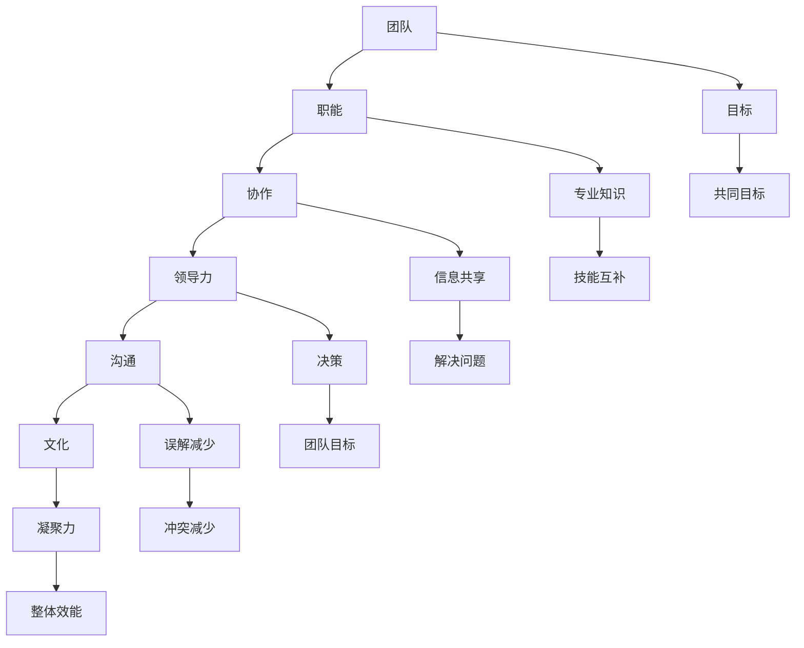

                 

### 背景介绍

在当今复杂多变的企业环境中，跨职能团队（Cross-functional Teams）的协作显得尤为重要。随着全球化、技术创新和市场竞争的不断加剧，企业需要快速响应市场变化，实现创新和业务增长。跨职能团队通过整合不同领域的专业知识，促进部门间的沟通与协作，从而提高整体工作效率和创新能力。

传统的职能部门划分往往导致企业内部信息孤岛和资源浪费。例如，研发部门关注产品开发，市场部门关注市场推广，而客服部门则专注于客户服务。这种垂直分工的模式容易导致各部门之间的信息不对称和目标不一致，从而影响企业的整体绩效。相反，跨职能团队通过将不同领域的专业人员汇集在一起，实现跨部门、跨领域的协同工作，有助于打破信息壁垒，提高资源利用效率。

跨职能团队不仅能够提高工作效率，还能促进创新。团队成员来自不同部门，拥有多样化的背景和技能，这使得他们能够从不同的角度思考问题，提出创新的解决方案。此外，跨职能团队还可以促进知识共享和技能提升，通过团队成员之间的互动和学习，进一步提高团队的整体素质。

然而，跨职能团队也面临一些挑战。例如，团队成员可能来自不同的职能部门，各自拥有不同的目标和利益，这可能导致团队成员之间的冲突和沟通障碍。此外，跨职能团队的领导需要具备更高的沟通协调能力和团队管理能力，以确保团队目标的实现。

综上所述，跨职能团队在现代企业中的作用日益显著。通过有效协作，跨职能团队可以帮助企业提高工作效率、促进创新，并在激烈的市场竞争中脱颖而出。

### 核心概念与联系

跨职能团队的成功依赖于几个关键核心概念和它们之间的紧密联系。首先，我们需要明确几个基本概念：团队、职能、协作、领导力、沟通和文化。这些概念相互作用，共同支撑起跨职能团队的运作。

#### 1. 团队

团队是由一组人员组成的，共同追求一个共同目标的工作实体。跨职能团队的特殊之处在于，它由来自不同职能部门的专业人员组成，例如研发、市场、销售、客服等。团队成员各自具备独特的专业技能，通过协同工作实现共同目标。团队的目标设定、成员之间的相互信任和团队精神的培养对于跨职能团队的成功至关重要。

#### 2. 职能

职能是指一个组织内部的特定工作领域，如研发、市场、销售、客服等。每个职能部门都有其特定的目标和职责。在跨职能团队中，职能的概念得到了扩展，不再局限于单一部门，而是跨越多个职能部门。这种跨职能协作有助于整合不同领域的专业知识，提高工作效率和创新能力。

#### 3. 协作

协作是指团队成员之间通过信息共享、技能互补和共同努力实现共同目标的过程。在跨职能团队中，协作是至关重要的。团队成员需要打破部门间的壁垒，建立高效的沟通机制，共同解决问题，以实现团队目标。

#### 4. 领导力

领导力是指引导和激励团队成员，实现团队目标的能力。在跨职能团队中，领导力尤为重要。领导需要具备跨部门的视野，协调不同职能部门的工作，确保团队目标的实现。领导力不仅体现在决策和协调上，还包括培养团队成员的能力和提升团队凝聚力。

#### 5. 沟通

沟通是跨职能团队成功的关键。有效的沟通能够确保团队成员之间信息的准确传递，减少误解和冲突。跨职能团队的沟通不仅限于团队内部，还包括与外部合作伙伴的沟通。沟通工具和沟通机制的建立对于跨职能团队的协作至关重要。

#### 6. 文化

文化是指一个组织或团队共享的价值观、信仰和行为规范。跨职能团队的文化建设对于团队的成功至关重要。团队文化应该鼓励开放、共享和创新，支持团队成员之间的相互尊重和信任。良好的团队文化能够增强团队的凝聚力，提高团队的整体效能。

这些核心概念之间的联系可以通过Mermaid流程图来表示：

通过这个流程图，我们可以清晰地看到这些核心概念之间的相互关系。团队通过协作实现共同目标，职能为协作提供专业知识，领导力确保目标的实现，沟通减少误解和冲突，而团队文化则增强团队的凝聚力和整体效能。这些核心概念相互作用，共同支撑跨职能团队的有效运作。

### 跨职能团队的优势

跨职能团队在提高企业效率和创新能力方面具有显著的优势。首先，它通过整合不同领域的专业知识，提高了解决问题的效率。团队成员来自不同的职能部门，如研发、市场、销售和客服等，他们各自拥有独特的技能和视角，能够从不同角度分析问题，提出创新的解决方案。例如，在产品开发过程中，研发团队可以专注于技术实现，市场团队可以分析用户需求，销售团队可以提供市场反馈，客服团队可以收集客户反馈。通过跨职能团队的合作，企业能够更快地响应市场变化，提高产品竞争力。

其次，跨职能团队有助于促进创新。团队成员的多样性和互补性激发了创新的火花。在一个跨职能团队中，成员可以分享各自领域的最新研究、技术和经验，通过跨领域的交流和碰撞，产生新的思路和创意。例如，在一个软件开发团队中，前端开发人员、后端开发人员、UI设计师和产品经理可以共同探讨如何优化用户界面、提升系统性能和改善用户体验。这种跨领域的合作不仅有助于提高产品的质量，还能推动技术的创新和突破。

此外，跨职能团队有助于提升企业整体的协调和响应能力。传统企业往往采用垂直分工的模式，各部门之间相对独立，信息传递缓慢，决策过程繁琐。而跨职能团队通过打破部门壁垒，实现信息的快速传递和资源共享，提高了企业的协调效率。团队成员可以实时共享信息，及时调整策略，迅速响应市场变化。例如，在应对突发事件或紧急任务时，跨职能团队可以迅速召集相关人员，集中资源和智慧，高效地解决问题。

跨职能团队还能帮助企业培养员工的综合素质。团队成员来自不同部门，需要与其他领域的专业人员合作，这促使他们不断学习和提升自己的技能。通过跨职能团队的协作，员工可以接触到不同的工作内容和领域，拓展自己的视野和经验，提高解决问题的能力和综合素质。这种多元化的工作经验有助于员工在未来的职业生涯中更加灵活和适应。

最后，跨职能团队有助于企业构建良好的团队文化。团队成员之间的密切合作和沟通促进了相互了解和信任，增强了团队的凝聚力和归属感。通过跨职能团队的合作，企业可以培养一种开放、包容和创新的团队文化，这种文化不仅能够提高团队的工作效率，还能吸引和留住优秀人才，为企业的发展提供持续的动力。

总之，跨职能团队通过提高工作效率、促进创新、提升企业协调响应能力和培养员工综合素质等多方面的优势，成为现代企业提升竞争力的重要策略。通过有效的跨职能团队协作，企业能够在复杂多变的市场环境中迅速崛起，实现长期可持续发展。

### 跨职能团队的挑战

尽管跨职能团队在提高企业效率和创新能力方面具有显著优势，但在实际运作中仍面临诸多挑战。这些挑战主要集中在沟通障碍、角色冲突、责任不清等方面，严重影响了团队效能。

#### 1. 沟通障碍

跨职能团队的沟通障碍是其中一个主要挑战。由于团队成员来自不同的职能部门，他们可能拥有不同的专业术语、工作方式和沟通风格。这种差异可能导致信息传递不准确、不及时，甚至出现误解。例如，研发团队可能更多地使用技术术语来描述问题，而市场团队则可能更关注市场需求和用户反馈。这种沟通障碍不仅影响了团队内部的协作效率，还可能导致外部客户的不满和信任问题。

为了解决沟通障碍，跨职能团队需要建立有效的沟通机制。首先，团队应该明确沟通的目标和内容，确保所有成员都清楚了解需要沟通的事项。其次，团队可以采用多种沟通工具，如定期会议、即时通讯软件、电子邮件和项目管理工具等，以便团队成员能够随时随地交流信息。此外，团队还应该建立统一的沟通语言和标准，减少因专业术语差异引起的误解。

#### 2. 角色冲突

角色冲突是跨职能团队面临的另一个挑战。由于团队成员来自不同的部门，他们可能对同一问题有不同的看法和解决方案。例如，研发团队可能更关注技术实现和产品性能，而市场团队则可能更关注市场需求和用户体验。这种利益冲突可能导致团队成员之间的分歧和对立，影响团队的协作效率。

为了缓解角色冲突，跨职能团队需要建立共同的目标和价值观。首先，团队应该明确共同的目标，确保所有成员都致力于实现这些目标。其次，团队可以通过角色扮演和情景模拟等方式，帮助成员理解其他部门的工作内容和挑战，增进相互理解。此外，团队可以采用冲突管理策略，如妥协、合作和回避等，以解决冲突，确保团队的和谐运作。

#### 3. 责任不清

跨职能团队中的责任不清也是一个常见问题。由于团队成员来自不同的部门，他们的职责和权限可能不明确，导致工作过程中的责任模糊。例如，在项目开发过程中，研发团队可能负责技术实现，而市场团队可能负责市场推广。然而，当项目遇到问题时，责任归属不明确，可能导致团队成员互相推诿，影响项目的进展。

为了解决责任不清的问题，跨职能团队需要明确团队成员的职责和权限。首先，团队应该在项目启动阶段明确每个成员的职责，并制定详细的职责说明书。其次，团队可以采用责任矩阵（Responsibility Matrix）等工具，明确每个任务的责任人和配合人，确保工作的顺利进行。此外，团队还应该建立透明的绩效考核机制，对团队成员的工作进行监督和评估，确保责任的落实。

#### 4. 解决方案

面对这些挑战，跨职能团队需要采取一系列策略来提升协作效率和团队效能。首先，团队应注重沟通能力的提升，通过定期的培训和沟通实践，提高团队成员的沟通技巧。其次，团队应建立共同的目标和价值观，促进团队成员之间的理解和合作。此外，团队可以通过角色扮演和情景模拟等方式，增进成员之间的相互理解，减少冲突。最后，团队应明确每个成员的职责和权限，建立透明的责任落实机制，确保工作的顺利进行。

总之，跨职能团队在提高企业效率和创新能力方面具有巨大潜力，但同时也面临诸多挑战。通过有效的沟通机制、共同的目标和价值观、明确的职责划分以及冲突管理策略，跨职能团队可以克服这些挑战，实现高效协作，为企业的发展贡献力量。

### 跨职能团队的架构与组织设计

为了确保跨职能团队能够高效运作，合理的架构与组织设计至关重要。以下将详细探讨跨职能团队的结构、领导力、沟通机制和文化建设，并提供相应的建议。

#### 1. 跨职能团队的结构

跨职能团队的结构通常包括以下几个关键部分：

- **核心团队**：由不同部门的关键人员组成，负责制定团队战略、决策和协调。核心团队成员应具备领导力、决策能力和跨部门协作的经验。

- **顾问团队**：由具有专业知识和经验的人士组成，为团队提供专业咨询和支持。顾问团队成员通常来自公司内部或外部，他们可以为团队提供技术、市场、法律等方面的专业建议。

- **支持团队**：负责提供必要的资源和技术支持，如IT支持、行政支持、项目管理等。支持团队成员通常是跨职能团队的后盾，确保团队有足够的资源和支持来完成任务。

- **跨部门协作小组**：由来自不同部门的具体项目成员组成，负责执行具体任务。这些小组通常根据项目需求灵活组建，任务完成后即可解散。

#### 2. 跨职能团队的领导力

跨职能团队的领导力需要具备以下几个方面的能力：

- **战略规划**：领导应能够从整体角度制定团队的战略规划，明确团队的目标和方向。领导需要具备前瞻性思维，能够预判市场变化和行业趋势，为团队的发展提供明确的方向。

- **沟通协调**：领导应具备出色的沟通协调能力，确保团队内部和跨部门间的有效沟通。领导需要善于倾听不同部门的需求和意见，协调各方利益，促进合作。

- **团队管理**：领导应能够激励和引导团队成员，提高团队凝聚力。领导需要了解团队成员的背景和能力，提供合适的发展机会，激发团队成员的潜力和创造力。

- **变革推动**：领导应具备推动团队变革的能力，鼓励团队成员接受新的思维模式和工作方式。领导需要克服变革中的阻力，带领团队实现持续改进和优化。

#### 3. 跨职能团队的沟通机制

有效的沟通机制是跨职能团队高效运作的基石。以下是一些建议：

- **定期会议**：团队应定期举行会议，包括周会、月会和项目进展会议等。会议内容应涵盖项目进展、问题讨论、决策制定等，确保团队成员对项目有全面的了解。

- **即时沟通工具**：团队应采用即时沟通工具，如Slack、Microsoft Teams、WhatsApp等，便于团队成员随时交流信息。这些工具可以方便地发送消息、共享文件和进行视频会议，提高沟通效率。

- **透明信息共享**：团队应建立透明信息共享平台，如公司内部网、知识库等，确保团队成员能够随时获取所需的信息。信息共享平台应支持文档管理、任务分配和进度追踪等功能。

- **反馈机制**：团队应建立反馈机制，鼓励成员对项目进展、团队协作等方面提出意见和建议。反馈机制可以是定期的团队反馈会议，也可以是匿名反馈渠道，以确保团队成员的发言权和参与感。

#### 4. 跨职能团队的文化建设

良好的团队文化是跨职能团队高效运作的重要保障。以下是一些建议：

- **共同价值观**：团队应明确共同的价值观，如诚信、创新、合作等。共同价值观可以帮助团队成员形成一致的行为准则，提高团队凝聚力。

- **开放包容**：团队应营造开放包容的氛围，鼓励团队成员表达不同的观点和意见。开放包容的文化可以促进知识共享和团队合作，减少冲突和误解。

- **持续学习**：团队应鼓励成员持续学习和提升自己的能力。通过提供培训、学习机会和项目实践，帮助成员不断成长和进步。

- **团队活动**：团队可以定期组织团队活动，如团队建设活动、庆祝活动等，增强团队成员之间的情感联系和团队合作精神。

- **奖励机制**：团队应建立奖励机制，对表现优秀和有突出贡献的成员给予表彰和奖励。奖励机制可以激发团队成员的积极性和创造力，提高团队的整体效能。

通过合理的架构与组织设计，跨职能团队可以充分发挥其优势，提高协作效率，实现共同目标。同时，团队领导需要具备战略规划、沟通协调、团队管理和变革推动等能力，带领团队克服各种挑战，持续提升团队效能。沟通机制和团队文化建设也是跨职能团队成功的关键，通过建立有效的沟通机制和营造良好的团队文化，跨职能团队可以更好地应对复杂多变的市场环境，实现持续发展和创新。

### 跨职能团队的协作技巧

为了确保跨职能团队能够高效运作，掌握有效的协作技巧至关重要。以下将详细探讨如何通过有效沟通、明确目标设定、跨部门合作流程和冲突管理来提升跨职能团队的协作效率。

#### 1. 有效沟通

沟通是跨职能团队协作的核心，有效沟通能够减少误解和冲突，提高团队的协作效率。以下是一些建议：

- **明确沟通目标**：每次沟通前，明确沟通的目标和内容，确保团队成员都清楚需要讨论的问题和期望的结果。

- **建立沟通渠道**：利用多种沟通工具，如即时通讯软件、邮件、会议系统等，确保团队成员能够随时随地交流信息。

- **定期会议**：定期举行团队会议，包括周会、月会和项目进展会议等，确保团队成员对项目进展有全面的了解。

- **反馈机制**：建立反馈机制，鼓励团队成员对项目进展、团队协作等方面提出意见和建议，及时解决问题。

- **倾听与理解**：团队成员应注重倾听，理解其他部门的观点和需求，避免因误解而产生冲突。

#### 2. 明确目标设定

明确的目标是跨职能团队协作的基石。以下是一些建议：

- **共同制定目标**：团队应共同制定目标，确保所有成员都认同并致力于实现这些目标。目标应具体、可衡量、可实现、相关性强且有时间限制（SMART原则）。

- **分解任务**：将总目标分解为具体的任务和里程碑，明确每个任务的负责人和完成时间，确保任务分配合理。

- **定期回顾**：定期回顾团队目标的完成情况，及时调整计划和策略，确保团队始终朝着共同目标前进。

- **透明度**：确保目标设定和任务分配的过程透明，团队成员都能清楚了解各自的任务和责任。

#### 3. 跨部门合作流程

跨部门合作流程的优化有助于提升团队协作效率。以下是一些建议：

- **明确流程**：建立清晰的跨部门合作流程，明确每个环节的职责和任务，确保流程顺畅。

- **协作工具**：采用项目管理工具，如JIRA、Trello等，实现任务分配、进度追踪和协作，提高工作效率。

- **流程优化**：定期评估和优化跨部门合作流程，识别瓶颈和改进点，提高协作效率。

- **角色协调**：明确不同部门的角色和职责，确保各部门能够协同工作，共同推进项目。

- **反馈与调整**：建立反馈机制，及时收集跨部门协作中的问题和建议，进行调整和改进。

#### 4. 冲突管理

冲突在跨职能团队中难以避免，有效的冲突管理有助于减少负面影响，提高团队协作效率。以下是一些建议：

- **识别冲突**：及时识别和面对冲突，避免问题积累和扩大。

- **沟通解决**：通过开放、坦诚的沟通，了解冲突的根源和各方的立场，寻找解决方案。

- **中立调解**：当冲突双方难以自行解决时，可以寻求中立第三方进行调解，确保公平公正。

- **制定规则**：建立冲突解决的规则和流程，确保冲突解决有据可依。

- **培训与教育**：定期进行冲突管理培训，提高团队成员的冲突解决能力和协作意识。

- **预防措施**：通过团队建设活动、角色扮演等预防措施，减少冲突发生的可能性。

通过掌握这些协作技巧，跨职能团队可以更好地协调合作，实现共同目标。有效的沟通、明确的目标设定、优化的跨部门合作流程和冲突管理策略，将有助于提升团队的协作效率，推动企业持续发展。

### 跨职能团队协作工具与技术

在现代企业中，跨职能团队的协作工具和技术起到了至关重要的作用。以下将介绍几种常用的团队协作软件、项目管理工具、数据可视化工具，并探讨跨职能协作中的数字化转型。

#### 1. 团队协作软件

团队协作软件是跨职能团队沟通、协作和任务管理的核心工具。以下是一些流行的团队协作软件：

- **Slack**：Slack是一个即时通讯和协作平台，支持消息、文件共享、频道创建和集成第三方应用等功能。Slack的搜索功能强大，能够帮助团队成员快速找到相关信息。

- **Microsoft Teams**：Microsoft Teams整合了聊天、视频会议、文档协作等功能，是微软办公套件的重要组成部分。其与Office 365的集成使得文件共享和协作变得更加方便。

- **Asana**：Asana是一个任务管理工具，支持项目规划和任务分配。用户可以创建项目、任务、子任务，并设定截止日期和责任人，确保项目进展清晰。

- **Trello**：Trello是一个基于看板的任务管理工具，用户可以通过卡片、列表和标签来组织任务。其直观的界面和灵活的配置使其成为团队协作的理想选择。

- **JIRA**：JIRA是Atlassian公司的一款缺陷追踪和项目管理工具，广泛应用于软件开发团队。JIRA支持敏捷开发方法，提供全面的任务跟踪和报告功能。

#### 2. 项目管理工具

项目管理工具帮助跨职能团队有效地规划、执行和监控项目进度。以下是一些常用的项目管理工具：

- **JIRA**：如前所述，JIRA不仅适用于软件开发团队，也适用于其他类型的项目管理。它支持敏捷开发方法，提供任务跟踪、缺陷管理、报告和统计等功能。

- **Trello**：Trello的简单直观界面使其成为小型项目和团队的首选。用户可以通过看板和卡片轻松管理任务，实时监控项目进展。

- **Asana**：Asana功能全面，支持项目规划、任务分配、进度跟踪和协作。用户可以创建项目、子任务和里程碑，设定截止日期和责任人。

- **Microsoft Project**：Microsoft Project是微软公司的一款专业项目管理工具，支持复杂项目的规划和执行。它提供Gantt图、资源管理、进度跟踪和报告等功能。

- **Smartsheet**：Smartsheet是一个基于云的项目管理工具，支持任务规划、进度跟踪和协作。它提供丰富的模板和自定义功能，适用于各种规模的项目。

#### 3. 数据可视化工具

数据可视化工具能够将复杂的数据以图表、图形的形式直观展示，帮助团队成员理解和分析数据。以下是一些常用的数据可视化工具：

- **Tableau**：Tableau是一个强大的数据可视化工具，支持多种数据源，提供丰富的图表类型和自定义功能。它能够帮助团队成员快速生成直观的数据报表。

- **Power BI**：Power BI是微软公司的一款数据可视化工具，与Office 365集成，支持数据导入、报表生成和共享。它提供多种图表和仪表板模板，便于团队分析和展示数据。

- **Google Data Studio**：Google Data Studio是Google推出的一款免费的数据可视化工具，支持从多个数据源导入数据，生成交互式报表和仪表板。它提供丰富的图表和自定义选项，便于团队分析和展示数据。

- **D3.js**：D3.js是一个基于JavaScript的库，用于生成动态的、交互式的数据可视化。它允许用户自定义图表样式和数据绑定，适用于需要高度定制化的数据可视化项目。

#### 4. 跨职能协作中的数字化转型

数字化转型是跨职能团队协作的重要趋势，它通过数字技术提高团队的工作效率和协作水平。以下是一些数字化转型策略：

- **云技术**：利用云计算技术，跨职能团队能够实现数据共享和协作，无需受地域和设备的限制。云平台提供高可靠性和可扩展性的服务，支持团队灵活部署和扩展。

- **移动办公**：通过移动设备，团队成员可以随时随地访问公司系统和协作工具，实现移动办公。移动办公提高了工作效率，减少了因地理位置带来的协作障碍。

- **自动化流程**：通过自动化工具，跨职能团队能够减少手动操作，提高流程的效率和准确性。自动化流程可以应用于任务分配、进度跟踪、报告生成等方面，减轻团队成员的工作负担。

- **人工智能和机器学习**：人工智能和机器学习技术可以用于数据分析、预测和优化决策。跨职能团队可以利用这些技术提高数据洞察力，优化项目管理和协作流程。

- **虚拟现实和增强现实**：虚拟现实和增强现实技术可以用于团队培训、协作和沟通。通过虚拟现实和增强现实，团队成员可以模拟实际工作场景，提高协作效果和培训体验。

通过引入这些团队协作工具和技术，跨职能团队能够实现更高效、更灵活的协作，提高整体工作效能。数字化转型不仅提升了团队的工作效率，还为企业带来了创新和竞争优势。随着技术的不断进步，跨职能团队的协作方式也将继续演进，为企业发展注入新的活力。

### 跨职能团队的学习与发展

跨职能团队的学习与发展是确保团队持续高效运作的关键。以下将探讨团队成员的能力提升、知识积累与传承、文化建设以及团队效能的评估与优化。

#### 1. 团队成员的能力提升

团队成员的能力提升是跨职能团队持续发展的重要基础。以下是一些关键策略：

- **培训与教育**：定期组织培训课程，涵盖专业技能、领导力、沟通技巧等多个方面。内部培训可以由经验丰富的团队成员或外部专家主讲，外部培训可以邀请行业专家或专业培训机构进行。

- **在线学习平台**：利用在线学习平台，如Coursera、edX等，提供多样化的学习资源。团队成员可以根据个人需求和职业发展计划，自主选择课程进行学习。

- **实战项目**：通过参与实际项目，团队成员可以锻炼解决实际问题的能力。项目实践不仅有助于提升专业技能，还能培养团队成员的团队合作和项目管理能力。

- **跨职能轮岗**：定期安排团队成员跨部门轮岗，让他们在不同的工作环境中学习新技能和经验，增强跨职能协作能力。

- **导师制度**：建立导师制度，让经验丰富的老员工指导新员工，帮助他们快速融入团队和提升能力。导师可以从技术、管理、沟通等多个方面给予指导和支持。

#### 2. 知识积累与传承

知识积累与传承是跨职能团队长期发展的保障。以下是一些关键策略：

- **知识库建设**：建立团队知识库，收集和整理团队成员的经验、最佳实践和项目案例。知识库可以采用电子文档、视频、图文等多种形式，方便团队成员随时查阅和共享。

- **定期分享会**：定期组织知识分享会，让团队成员分享各自的工作经验、学习心得和成功案例。分享会可以采用线上或线下形式，鼓励团队成员积极参与。

- **经验传承机制**：建立经验传承机制，确保资深员工的经验和知识能够传承给新员工。可以通过编写文档、制作视频教程、开展内部培训等方式，将经验系统地传递下去。

- **知识管理工具**：利用知识管理工具，如Confluence、SharePoint等，建立团队内部的知识库和文档管理系统。这些工具支持版本控制、搜索和共享功能，提高知识积累和传承的效率。

#### 3. 文化建设

良好的文化建设是跨职能团队凝聚力和效能的重要保障。以下是一些关键策略：

- **共同价值观**：明确团队的核心价值观，如诚信、创新、合作等，并确保所有团队成员都认同和践行这些价值观。

- **团队精神**：通过团队建设活动，如团队拓展、团队聚餐、团建旅游等，增强团队成员之间的情感联系和团队精神。

- **开放沟通**：鼓励团队成员之间开放、坦诚的沟通，建立信任和尊重的氛围。通过定期的团队会议、反馈机制等，确保团队成员能够畅所欲言，共同解决问题。

- **激励机制**：建立公平、透明的激励机制，对表现优秀的团队成员给予表彰和奖励，激发团队成员的积极性和创造力。

- **文化建设活动**：定期组织文化建设活动，如员工生日庆祝、节日活动等，增强团队的凝聚力和归属感。

#### 4. 团队效能的评估与优化

团队效能的评估与优化是确保团队持续改进和高效运作的关键。以下是一些关键策略：

- **绩效评估**：建立科学的绩效评估体系，对团队成员的工作表现进行客观、全面的评估。绩效评估应涵盖工作成果、工作态度、团队合作等多个方面。

- **反馈机制**：建立反馈机制，鼓励团队成员对团队工作提出意见和建议。反馈可以来自上级、同事或下属，确保多方面的意见得到充分反映。

- **改进措施**：根据绩效评估和反馈结果，制定改进措施，针对性地解决团队存在的问题。改进措施应具体、可操作，并设定明确的时间表和责任人。

- **持续监控**：通过定期的团队效能评估，监控改进措施的执行情况和效果，确保团队持续改进和优化。

- **培训与发展**：根据团队效能评估的结果，制定相应的培训和发展计划，提高团队成员的能力和素质，进一步提升团队效能。

通过这些策略，跨职能团队能够持续提升团队成员的能力、积累和传承知识、建设良好的团队文化，并不断优化团队效能。持续的学习与发展是跨职能团队成功的关键，它为团队提供了强大的动力和竞争力，助力企业实现长期可持续发展。

### 成功案例一：某科技公司的新产品开发

某科技公司是一家专注于智能硬件和软件解决方案的创新企业。在开发一款新型智能家居设备时，该公司采用了跨职能团队协作模式，取得了显著的成功。

#### 项目背景

该项目旨在开发一款集智能监控、家居控制和环境监测功能于一体的智能家居设备。项目涉及多个职能部门，如研发、市场、设计、工程、运营等。每个部门都有其特定的职责，但需要紧密合作以实现项目的整体目标。

#### 团队协作过程

1. **需求分析**：跨职能团队首先进行市场调研，收集用户需求和竞品分析。团队成员从不同角度提出意见和建议，确保需求分析的全面性。

2. **目标设定**：团队明确了项目目标，包括功能实现、性能指标、成本控制和时间安排。所有成员对目标达成一致，确保团队成员共同努力。

3. **任务分配**：根据团队成员的专业技能和职责，将任务进行详细分配。研发团队负责硬件设计和技术实现，设计团队负责外观设计和用户界面，市场团队负责市场推广策略，工程团队负责生产测试和质量控制。

4. **沟通机制**：团队采用了多种沟通工具，如Slack、Microsoft Teams和JIRA，确保团队成员能够实时交流信息，共享资源和进度更新。

5. **定期会议**：团队每周举行一次例会，总结上周工作进展，讨论遇到的问题和解决方案，确保项目按计划推进。

6. **迭代开发**：团队采用敏捷开发方法，进行迭代式开发。每两周进行一次迭代，每次迭代结束后进行评审和反馈，根据反馈进行调整。

7. **协作与支持**：跨部门协作小组在项目关键阶段进行协作，如研发团队和设计团队在界面设计和技术实现上的对接，市场团队和运营团队在产品推广和用户反馈方面的协调。

#### 项目成果

经过一年的努力，该智能家居设备成功上市，获得了市场的积极反响。产品功能全面、性能稳定，用户满意度高。以下是项目的具体成果：

- **用户体验**：用户界面简洁易用，操作直观，获得用户好评。
- **技术实现**：硬件设计和技术实现达到行业领先水平，产品性能优秀。
- **市场推广**：市场团队制定了有效的推广策略，产品迅速占领市场。
- **团队合作**：跨职能团队协作高效，各部门紧密合作，确保项目顺利进行。
- **知识积累**：项目过程中积累了大量经验和最佳实践，为后续项目提供了宝贵的参考。

#### 项目启示

该案例表明，跨职能团队协作在复杂项目中的重要性。以下是一些启示：

- **明确目标**：确保团队成员对项目目标有清晰的认识，共同致力于实现这些目标。
- **有效沟通**：利用多种沟通工具和定期会议，确保团队成员之间的信息共享和协作。
- **任务分配**：根据团队成员的专业技能和职责，合理分配任务，确保任务顺利完成。
- **灵活调整**：采用敏捷开发方法，及时调整计划和策略，确保项目按计划推进。
- **持续反馈**：通过定期评审和反馈，不断优化项目，提高产品质量和用户体验。

跨职能团队协作能够提高项目的整体效能，促进知识共享和技能提升，是现代企业实现创新和业务增长的重要策略。

### 成功案例二：某零售企业的数字化转型

某大型零售企业为了在日益激烈的市场竞争中保持优势，决定进行全面数字化转型。该企业采用了跨职能团队协作模式，实现了成功的数字化转型。

#### 项目背景

该零售企业拥有多个线下门店和线上电商平台，业务范围广泛，涉及多个职能部门，如市场营销、销售、客户服务、供应链管理等。数字化转型的目标包括优化客户体验、提高运营效率、降低成本和提升数据驱动的决策能力。

#### 团队协作过程

1. **需求调研**：跨职能团队进行了广泛的市场调研和用户需求分析，收集了大量关于客户行为、市场竞争和业务流程的数据。

2. **战略规划**：团队明确了数字化转型战略，包括建立客户关系管理系统（CRM）、电商平台优化、供应链整合和数据分析平台建设等。

3. **任务分配**：根据战略规划，团队成员被分配到不同的项目小组，如市场营销小组、电商小组、供应链小组和数据小组。每个小组负责具体任务的执行和协调。

4. **沟通机制**：团队采用了多种沟通工具，如Slack、Microsoft Teams和Trello，确保团队成员能够实时交流信息，共享资源和进度更新。

5. **试点实施**：团队选择了部分门店和电商平台进行试点，以验证数字化解决方案的可行性和效果。

6. **数据整合**：数据小组负责整合来自不同渠道的数据，建立数据分析平台，为决策提供数据支持。

7. **持续优化**：团队根据试点结果，不断优化数字化解决方案，确保其能够满足业务需求和市场变化。

#### 项目成果

数字化转型的实施取得了显著成果：

- **客户体验**：通过优化电商平台和客户服务系统，客户购买流程更加便捷，客户满意度显著提升。

- **运营效率**：供应链整合和自动化流程的实施，大幅提高了运营效率，降低了运营成本。

- **数据驱动**：数据分析平台的建立，为企业提供了实时、准确的数据支持，促进了数据驱动的决策。

- **业务增长**：数字化转型提升了企业的市场竞争力，销售额和市场份额均实现了显著增长。

#### 项目启示

该案例为跨职能团队协作在数字化转型中的应用提供了宝贵经验：

- **全面调研**：在项目启动阶段，进行全面的需求调研和市场分析，确保数字化战略的可行性和针对性。

- **明确目标**：确保团队成员对数字化转型的目标有清晰的认识，共同致力于实现这些目标。

- **任务分配**：根据团队成员的专业技能和职责，合理分配任务，确保任务顺利完成。

- **试点实施**：通过试点项目验证数字化解决方案的可行性和效果，及时调整和优化。

- **数据整合**：建立数据分析平台，提高数据驱动的决策能力，促进业务的持续优化。

跨职能团队协作在数字化转型中发挥着关键作用，能够帮助企业实现高效、灵活和创新的运营模式，提升市场竞争力。

### 成功案例三：某制药公司的跨部门合作

某制药公司为了加速新药研发和上市，决定采用跨部门合作模式。该项目涉及研发、生产、市场、法规等部门，通过紧密协作实现了新药的快速研发和成功上市。

#### 项目背景

该制药公司面临市场竞争压力，急需推出新型药物。新药研发涉及多个复杂环节，需要研发、生产、市场、法规等部门的紧密合作。

#### 团队协作过程

1. **需求分析**：跨职能团队首先进行了市场需求分析，确定了新药的目标市场和患者需求。

2. **目标设定**：团队明确了研发目标，包括药物配方、质量标准、安全性验证和市场定位等。

3. **任务分配**：根据各部门的职责和专业技能，将任务进行详细分配。研发部门负责配方研发和临床试验，生产部门负责规模化生产，市场部门负责市场推广和患者教育，法规部门负责与监管机构沟通和合规性审查。

4. **沟通机制**：团队采用了定期会议和即时通讯工具，确保各部门之间的信息共享和协作。

5. **进度跟踪**：团队使用了项目管理工具，如JIRA，实时监控项目进度，确保各环节紧密衔接。

6. **合作流程**：团队制定了详细的合作流程，明确了各环节的输入和输出，确保流程顺畅。

7. **风险控制**：团队建立了风险控制机制，及时识别和处理项目过程中的风险，确保项目按计划推进。

#### 项目成果

该新药成功研发并上市，取得了以下成果：

- **时间缩短**：通过跨部门协作，新药研发周期大幅缩短，从传统的几年时间缩短至不到两年。

- **质量保证**：生产部门和质量控制部门紧密协作，确保新药的质量和安全。

- **市场推广**：市场部门制定了有效的推广策略，新药上市后迅速占领市场。

- **法规合规**：法规部门与监管机构保持密切沟通，确保新药顺利通过审批并合规上市。

#### 项目启示

该案例展示了跨部门合作在新药研发中的重要性，以下是一些启示：

- **需求明确**：在项目启动阶段，确保所有部门对项目需求有清晰的认识。

- **目标一致**：确保各部门的目标一致，共同致力于实现项目目标。

- **任务分配**：根据各部门的职责和技能，合理分配任务，确保任务顺利完成。

- **沟通机制****：建立有效的沟通机制，确保各部门之间的信息共享和协作。

- **进度监控**：使用项目管理工具实时监控项目进度，确保各环节紧密衔接。

- **风险控制**：建立风险控制机制，及时识别和处理项目过程中的风险。

跨部门合作能够提高新药研发的效率和质量，是制药公司实现创新和持续发展的重要策略。

### 跨职能团队协作的未来趋势

随着数字化和全球化的不断深入，跨职能团队协作正面临着一系列新的趋势和挑战。以下将探讨数字时代对跨职能团队的影响、国际化融合、创新与持续发展，并展望跨职能团队的未来方向。

#### 数字时代的跨职能团队

数字技术的迅猛发展，特别是云计算、大数据、人工智能和物联网技术的普及，正在深刻改变跨职能团队的工作方式。以下是数字时代对跨职能团队的主要影响：

1. **数据驱动的决策**：数字化工具和数据平台使得跨职能团队能够获取、分析和利用大量的数据，从而支持更加科学和精准的决策。通过数据驱动的决策，团队可以更快速地识别市场机会、预测风险，并优化业务流程。

2. **远程工作的普及**：远程办公和虚拟团队的兴起，使得跨职能团队不再受限于地理位置。团队成员可以分布在不同的国家和城市，通过互联网和协作工具实现高效沟通和协作。这不仅扩大了团队的资源池，还提高了灵活性。

3. **自动化与智能化**：自动化和智能化技术正在逐步应用于跨职能团队的工作流程中，例如自动化报告生成、智能客服系统等。这些技术能够减少重复性工作，提高工作效率，使团队成员能够专注于更具创造性和战略性的任务。

4. **协作平台的整合**：跨职能团队需要使用多种协作工具和平台，如即时通讯、项目管理、数据可视化等。未来的趋势是将这些工具整合到一个统一的协作平台上，实现信息的无缝流动和资源的集中管理，提高协作效率。

#### 国际化融合

全球化进程加速，企业越来越需要跨职能团队在全球范围内进行协作。国际化融合对跨职能团队提出了新的要求：

1. **文化差异的理解与适应**：国际化团队中，团队成员来自不同的文化背景，需要理解和适应不同的工作方式和文化习惯。通过文化培训和工作坊，可以帮助团队成员更好地融入团队，减少文化冲突。

2. **全球化运营模式**：企业需要建立全球化的运营模式，以确保在不同地区和市场能够快速响应和适应。跨职能团队需要具备跨国运营的经验和能力，能够协调不同地区的资源和活动。

3. **语言沟通的优化**：语言障碍是国际化团队协作的一个重要挑战。企业可以通过提供多语言支持和翻译服务，优化团队成员之间的沟通，提高协作效率。

#### 创新与持续发展

跨职能团队在创新和持续发展方面扮演着关键角色。以下是跨职能团队如何推动创新与持续发展的策略：

1. **创新文化**：企业需要建立创新文化，鼓励团队成员提出新想法和改进建议。通过定期举办创新工作坊、黑客马拉松等活动，激发团队成员的创造力和创新精神。

2. **跨领域合作**：跨职能团队通过跨领域的合作，可以整合不同领域的专业知识，产生创新的解决方案。例如，将技术研发与市场营销相结合，可以创造出更符合市场需求的创新产品。

3. **敏捷开发**：敏捷开发方法强调快速迭代和持续交付，有助于跨职能团队快速响应市场变化和用户需求。通过持续交付和反馈，团队可以不断优化产品和服务，提高市场竞争力。

4. **持续学习与成长**：跨职能团队需要持续学习和成长，以适应快速变化的市场和技术环境。通过提供培训、学习和职业发展机会，可以帮助团队成员不断提升自己的技能和知识。

#### 未来展望

跨职能团队的未来将充满机遇和挑战。以下是未来跨职能团队可能的发展方向：

1. **智能化协作**：随着人工智能技术的发展，跨职能团队将越来越多地依赖智能工具和系统进行协作。智能助手可以自动化许多日常工作，使团队成员能够更专注于创新和高价值的工作。

2. **虚拟现实与增强现实**：虚拟现实（VR）和增强现实（AR）技术将被广泛应用于跨职能团队的协作和培训。通过VR和AR，团队成员可以沉浸式地体验工作场景，提高协作效果和培训体验。

3. **个性化和定制化**：跨职能团队将更加注重个性化和定制化。通过大数据分析和个性化推荐，团队可以提供更加符合每个团队成员需求和偏好的协作工具和培训资源。

4. **生态系统的整合**：跨职能团队将更加注重与外部合作伙伴和生态系统的整合。通过建立开放的合作平台，企业可以与供应商、客户、研究机构等各方共同创新，实现更广泛的合作和共赢。

总之，跨职能团队在未来将继续发挥重要作用，通过数字化、国际化、创新和持续发展，不断提升团队协作效率和创新能力，帮助企业实现长期可持续发展。

### 附录：跨职能团队协作的资源与工具推荐

在跨职能团队的协作过程中，选择合适的资源和工具能够显著提高工作效率和团队效能。以下是一些建议，涵盖跨职能团队协作软件、项目管理工具、数据可视化工具以及相关资源链接。

#### 跨职能团队协作软件

1. **Slack**：一个功能强大的即时通讯平台，支持多频道交流、文件共享和集成第三方应用。网址：[https://slack.com](https://slack.com)。

2. **Microsoft Teams**：微软提供的综合通信和协作平台，集成聊天、视频会议、文档协作等功能。网址：[https://teams.microsoft.com](https://teams.microsoft.com)。

3. **Asana**：一个任务管理和协作工具，支持项目规划、任务分配和进度追踪。网址：[https://asana.com](https://asana.com)。

4. **Trello**：基于看板的任务管理工具，通过卡片和列表直观地组织任务。网址：[https://trello.com](https://trello.com)。

5. **JIRA**：一个流行的缺陷追踪和项目管理工具，特别适用于软件开发团队。网址：[https://www.atlassian.com/software/jira](https://www.atlassian.com/software/jira)。

#### 项目管理工具

1. **JIRA**：如前所述，适用于项目规划和任务跟踪。网址：[https://www.atlassian.com/software/jira](https://www.atlassian.com/software/jira)。

2. **Trello**：适用于简单项目和团队协作。网址：[https://trello.com](https://trello.com)。

3. **Asana**：功能全面的任务管理工具，支持多种项目管理方法。网址：[https://asana.com](https://asana.com)。

4. **Smartsheet**：适用于复杂项目规划和资源管理。网址：[https://www.smartsheet.com](https://www.smartsheet.com)。

5. **Microsoft Project**：微软提供的专业项目管理工具，适用于大型和复杂项目。网址：[https://www.microsoft.com/en-us/microsoft-365/project/project-management-software](https://www.microsoft.com/en-us/microsoft-365/project/project-management-software)。

#### 数据可视化工具

1. **Tableau**：功能强大的数据可视化工具，支持多种数据源和图表类型。网址：[https://www.tableau.com](https://www.tableau.com)。

2. **Power BI**：微软提供的免费数据可视化工具，与Office 365集成。网址：[https://powerbi.microsoft.com](https://powerbi.microsoft.com)。

3. **Google Data Studio**：Google提供的免费数据可视化工具，适用于创建交互式报表和仪表板。网址：[https://www.google.com/intl/en_in/data-studio/](https://www.google.com/intl/en_in/data-studio/)。

4. **D3.js**：基于JavaScript的开源库，用于生成动态和交互式的数据可视化。网址：[https://d3js.org](https://d3js.org)。

#### 资源链接

1. **跨职能团队协作最佳实践**：[https://www.forbes.com/sites/forbesbusinesscouncil/2020/04/13/best-practices-for-building-an-effective-cross-functional-team/?sh=5d5b9e3e7d0a](https://www.forbes.com/sites/forbesbusinesscouncil/2020/04/13/best-practices-for-building-an-effective-cross-functional-team/?sh=5d5b9e3e7d0a)

2. **项目管理工具比较**：[https://www.projectmanagement.com/wiki/Comparing-project-management-tools](https://www.projectmanagement.com/wiki/Comparing-project-management-tools)

3. **数据可视化资源**：[https://www.datavizshop.com](https://www.datavizshop.com)

通过上述资源和工具，跨职能团队可以更好地实现协作和目标达成。合理选择和使用这些工具，能够有效提升团队的工作效率和创新能力。

### 总结与最佳实践

跨职能团队在现代企业中的重要性不言而喻。它们通过整合不同领域的专业知识，促进部门间的协作与沟通，提高了企业的整体效率和创新能力。有效的跨职能团队不仅能够快速响应市场变化，还能在激烈的市场竞争中脱颖而出。

为了确保跨职能团队的协作效果，以下是一些最佳实践：

1. **明确目标**：确保所有团队成员对团队目标有清晰的认识，并共同致力于实现这些目标。

2. **有效沟通**：建立多种沟通渠道和机制，确保团队成员之间的信息共享和协作。

3. **合理分配任务**：根据团队成员的专业技能和职责，合理分配任务，确保任务顺利完成。

4. **建立共同价值观**：明确团队的核心价值观，营造开放、包容和创新的团队文化。

5. **持续学习与发展**：定期进行培训和知识分享，提升团队成员的能力和知识水平。

6. **定期评估与反馈**：通过定期的团队效能评估和反馈机制，持续优化团队的工作流程和协作模式。

7. **利用工具与技术**：合理选择和使用跨职能团队协作工具，如Slack、Trello、Asana、JIRA等，提高协作效率。

跨职能团队的协作不仅需要有效的策略和工具支持，更需要团队成员之间的相互理解与信任。通过不断优化和提升团队协作，企业将能够更好地应对复杂多变的市场环境，实现长期可持续发展。

### 注意事项与未来展望

在跨职能团队协作的过程中，一些注意事项和未来展望是值得关注的。首先，团队成员需要重视沟通和协作的重要性，确保信息的及时传递和任务的明确分工。此外，团队成员应保持开放心态，尊重和接纳不同的观点和意见，以促进创新和解决问题。

未来，跨职能团队的协作将更加依赖数字化工具和平台，如云计算、人工智能和物联网技术，这些技术将提高团队的工作效率和灵活性。同时，国际化融合将使跨职能团队更加多元化和全球化，这要求团队成员具备跨文化沟通和协作的能力。

随着技术的发展，虚拟现实和增强现实等新兴技术有望被广泛应用于团队协作，提供更加沉浸式和互动性的协作体验。此外，人工智能和大数据分析将进一步提升团队的数据驱动的决策能力，为企业带来更多洞察和竞争优势。

总之，跨职能团队协作的未来充满机遇和挑战。通过不断探索和实践，企业可以不断提高团队协作效能，实现持续创新和业务增长。

### 拓展阅读

为了深入了解跨职能团队协作的理论和实践，以下是几本推荐的拓展阅读材料：

1. **《跨职能团队：构建高效协作组织的艺术》（Cross-Functional Teams: Working Together Without Overworking Each Other）**：作者David A.choy，详细介绍了跨职能团队的构建、协作策略和冲突管理，提供了实用的指导和建议。

2. **《敏捷团队：构建高效协作的跨职能团队》（Agile Teams: How to Build High Performance Teams for Success）**：作者Michael C. Henderson，探讨了敏捷开发方法在跨职能团队中的应用，通过案例分析和实战经验，展示了如何实现高效协作。

3. **《团队协作工具与技巧：现代团队成功的秘诀》（Team Collaboration Tools and Techniques: The Secret to Modern Team Success）**：作者Jessica Malcolm，介绍了多种团队协作工具和技术，包括Slack、Trello、JIRA等，并提供了实用的协作技巧和最佳实践。

4. **《跨文化团队协作：有效沟通与领导力的艺术》（Cross-Cultural Team Collaboration: The Art of Effective Communication and Leadership）**：作者Rosamund S. Hutt，探讨了国际化团队在跨文化背景下的协作和沟通挑战，提供了跨文化沟通和领导力的策略和技巧。

这些书籍不仅涵盖了跨职能团队协作的理论基础，还提供了丰富的实战经验和案例分析，是深入了解和提升跨职能团队协作能力的优秀资源。通过阅读这些书籍，读者可以获取更多的实践指导和灵感，为团队的协作和成长提供有益的参考。

