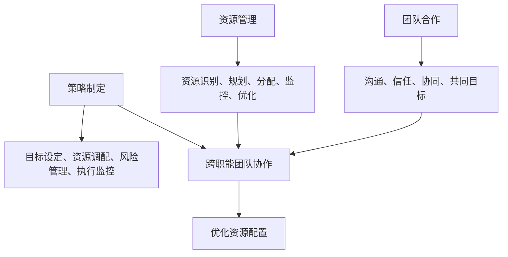

                 

### 背景介绍

在当今快速变化的商业环境中，跨职能团队协作已成为许多企业提升竞争力、实现创新和有效应对挑战的关键。随着信息技术和全球化的发展，企业需要面对复杂多变的市场需求和不断演进的技术趋势。单一职能团队的局限性和孤立性使得企业难以在高度不确定的环境中保持灵活性和适应性。因此，跨职能团队作为一种新兴的组织形式，逐渐受到广泛关注。

跨职能团队由来自不同职能部门、具备不同技能和专长的成员组成，其目标是共同完成复杂的任务或项目。这些团队成员通常在专业领域内拥有深厚的知识和经验，但在日常工作中可能缺乏与其他部门合作的经验。跨职能团队协作的核心在于通过有效的沟通、协作和资源配置，实现团队整体效能的最大化。

优化资源配置是跨职能团队协作中的一个重要议题。资源不仅包括人力和财务资源，还涉及时间、技术、信息和物资等多种形式。在传统单一职能团队中，资源分配往往以部门利益为导向，容易导致资源浪费、效率低下和沟通障碍。而在跨职能团队中，资源优化意味着如何通过科学的策略和有效的工具，实现资源在团队内部的合理流动和高效利用，从而提升团队的整体绩效。

本文旨在探讨跨职能团队协作中优化资源配置的策略，通过分析理论基础、具体方法和实际案例，提供一套系统性、可操作的实践指南。文章将首先介绍团队合作理论和资源管理理论，阐述这些理论在跨职能团队协作中的核心概念和关系架构。随后，将介绍实现跨职能团队协作和优化资源配置的具体方法与工具，包括沟通与协调技巧、跨部门合作模型、资源优化策略等。最后，通过案例分析展示这些方法和工具在实际应用中的效果，并总结最佳实践，提出注意事项和未来的发展方向。通过本文的深入分析，期望能够为跨职能团队的领导者和管理者提供有价值的参考和启示。

### 核心概念与联系

在探讨跨职能团队协作和优化资源配置的过程中，理解几个关键概念及其相互关系至关重要。这些核心概念包括团队合作、资源管理、策略制定等。通过构建一个清晰的概念关系架构，我们可以更好地把握跨职能团队协作的本质和实现路径。

首先，让我们来看团队合作。团队合作是指多个成员共同完成一个共同目标的过程。在跨职能团队中，团队合作的核心要素包括沟通、信任、协同和共同目标。沟通是团队合作的基础，通过有效的沟通，团队成员可以共享信息、协调行动，减少误解和冲突。信任是团队合作的润滑剂，成员之间的信任可以增强协作的效率和效果。协同是团队合作的最高境界，通过协同工作，可以实现1+1>2的效果。共同目标则是团队合作的出发点和归宿，只有当团队成员都朝着同一个目标努力时，团队协作才能发挥最大的效能。

接下来，我们探讨资源管理。资源管理是指对各种资源（包括人力、财务、物资、技术等）进行有效分配、利用和优化的过程。在跨职能团队中，资源管理不仅涉及资源的分配和利用，还包括资源的整合和共享。有效的资源管理可以确保团队拥有实现目标所需的所有资源，并最大化资源的利用效率。资源管理的核心要素包括资源识别、资源规划、资源分配、资源监控和资源优化。资源识别是指确定团队需要哪些资源；资源规划是指制定资源使用的计划；资源分配是指将资源分配给需要的部门或个人；资源监控是指跟踪资源的使用情况；资源优化是指通过改进资源配置和利用方式，提高资源利用效率。

最后，我们来看策略制定。策略制定是指为了实现特定目标而制定的行动计划和决策。在跨职能团队中，策略制定是一个动态的过程，需要考虑内外部环境的变化，不断调整和优化。策略制定的核心要素包括目标设定、资源调配、风险管理和执行监控。目标设定是指明确团队需要达成的目标；资源调配是指根据目标需要分配和调整资源；风险管理是指识别和应对可能的风险；执行监控是指跟踪策略执行的进展和效果。

核心概念之间的关系架构可以用Mermaid流程图表示：



通过上述关系架构，我们可以清晰地看到团队合作、资源管理和策略制定是如何共同作用于跨职能团队协作，进而实现优化资源配置的目标。团队合作提供了沟通和协调的机制，资源管理确保了资源的有效利用，而策略制定则为团队的行动提供了明确的方向和目标。这三个核心概念相互关联、相互作用，共同构成了跨职能团队协作和资源优化的理论基础。

### 核心算法原理讲解

在实现跨职能团队协作和优化资源配置的过程中，核心算法和数学模型起着至关重要的作用。以下将详细讲解几个关键算法原理，包括它们的伪代码实现，以及如何应用于跨职能团队中。

#### 1. 多目标优化算法

多目标优化算法（Multi-Objective Optimization Algorithm）是一种用于同时优化多个相互冲突的目标的算法。在跨职能团队协作中，这种算法可以用来平衡不同职能部门的目标，如时间效率、成本和质量等。

**伪代码：**

```plaintext
算法：多目标优化算法
输入：目标集合T，权重集合W
输出：最优解S

1. 初始化目标集合T和权重集合W
2. 对每个目标i，计算其标准化值ti = xi / (max_xi / min_xi)
3. 计算综合评价函数：f(x) = Σw_i * ti
4. 对于每个x，计算其目标值f(x)
5. 找到f(x)的最大值和最小值
6. 根据目标值，选择最优解S
```

**应用实例：**

在一个跨职能团队中，设有以下目标：
- 目标1：完成项目时间（T1）
- 目标2：项目成本（T2）
- 目标3：项目质量（T3）

权重设定为：W1 = 0.5，W2 = 0.3，W3 = 0.2

通过多目标优化算法，可以找到在给定时间和预算内，质量最优的项目方案。

#### 2. 资源调度算法

资源调度算法（Resource Scheduling Algorithm）用于优化团队中资源的分配和调度，以确保任务能在最优时间内完成。

**伪代码：**

```plaintext
算法：资源调度算法
输入：任务集合J，资源集合R，任务资源需求矩阵D
输出：最优调度计划S

1. 初始化任务集合J和资源集合R
2. 对每个任务j，计算其资源需求：需求总量 = ΣD[j, r]
3. 按资源需求从低到高排序任务集合J
4. 对于每个资源r，依次分配任务至可用资源
5. 若资源r已满负荷，跳过该资源，继续分配下个资源
6. 计算每个任务的最晚开始时间（LS）和最早完成时间（ES）
7. 根据LS和ES，调整任务调度计划
8. 输出最优调度计划S
```

**应用实例：**

在一个软件开发项目中，设有多项任务需要完成，每项任务需要不同资源的支持。通过资源调度算法，可以确定每个任务的开始和结束时间，以及每个资源的利用率，从而实现高效资源分配。

#### 3. 动态规划算法

动态规划算法（Dynamic Programming Algorithm）用于解决多阶段决策问题，通过逐步优化子问题，最终得到全局最优解。

**伪代码：**

```plaintext
算法：动态规划算法
输入：状态集合S，状态转移函数F，初始状态s0
输出：最优状态序列O

1. 初始化状态集合S，状态转移函数F，初始状态s0
2. 对于每个状态s，计算其最优子状态集合S'
3. 对于每个子状态s'，计算其最优值v'
4. 更新状态转移函数F(s, s') = v'
5. 从初始状态s0开始，逐步计算最优状态序列O
6. 返回最优状态序列O
```

**应用实例：**

在一个复杂的软件开发项目中，可以通过动态规划算法逐步优化各阶段的工作量和成本，确保项目按计划完成。

通过上述算法和模型的应用，跨职能团队能够更好地协调和优化资源配置，从而提升整体效率和绩效。这些算法不仅提供了理论指导，还通过伪代码实现，使得实际应用更加具体和可操作。在实际应用中，团队可以根据具体情况调整算法参数和模型结构，以实现最佳效果。

### 数学模型和公式

在跨职能团队协作和优化资源配置的过程中，数学模型和公式为决策提供了科学依据和量化手段。以下将介绍几个关键数学模型和公式，并详细讲解其原理和具体应用。

#### 1. 成本效益分析（Cost-Benefit Analysis）

成本效益分析是一种评估资源投入与收益之间关系的模型，用于判断某项决策的可行性和经济合理性。

**公式：**

$$
C = ΣC_i
$$

$$
B = ΣB_i
$$

$$
C/B = Σ(C_i/B_i)
$$

其中，C为总成本，C_i为各项成本，B为总收益，B_i为各项收益，C/B为成本效益比。

**原理：**

成本效益分析通过计算成本与收益的比值，来判断资源投入是否合理。比值越大，说明收益越高，投入的效益越显著。

**应用实例：**

假设一个跨职能团队进行一项新项目，预计总成本为100万元，预计总收益为150万元。通过计算成本效益比：

$$
C/B = 100/150 = 0.67
$$

成本效益比小于1，表明该项目在经济上不划算，应考虑调整预算或项目方案。

#### 2. 优化资源分配模型（Resource Allocation Optimization Model）

优化资源分配模型用于确定如何分配有限资源，以实现最大化目标。

**公式：**

$$
\text{最大化} \quad Z = \sum_{i=1}^{n} c_i x_i
$$

$$
\text{约束条件：} \quad a_{ij} x_i + a_{ij} x_j \leq b_j, \quad \forall j
$$

$$
x_i \geq 0, \quad \forall i
$$

其中，Z为最大化目标函数，c_i为第i项资源的单位收益，x_i为第i项资源的分配量，a_{ij}为第i项资源在任务j中的需求量，b_j为任务j的总需求量。

**原理：**

优化资源分配模型通过目标函数和约束条件，确定各资源在任务中的最优分配量，以实现整体收益的最大化。

**应用实例：**

假设一个跨职能团队有3项任务（T1、T2、T3），需要分配3种资源（R1、R2、R3）。各任务的资源需求如下：

| 任务 | R1需求 | R2需求 | R3需求 |
| ---- | ---- | ---- | ---- |
| T1   | 2    | 1    | 0    |
| T2   | 1    | 2    | 1    |
| T3   | 0    | 1    | 2    |

资源收益如下：

| 资源 | 单位收益 |
| ---- | ---- |
| R1   | 5    |
| R2   | 3    |
| R3   | 4    |

通过优化资源分配模型，可以确定如何分配资源，以实现最大收益。目标函数为：

$$
Z = 5x_1 + 3x_2 + 4x_3
$$

约束条件为：

$$
2x_1 + x_2 \leq 2
$$

$$
x_1 + 2x_2 + x_3 \leq 3
$$

$$
x_1 + x_2 + 2x_3 \leq 4
$$

$$
x_1, x_2, x_3 \geq 0
$$

通过求解模型，得到最优解为：

| 资源 | 分配量 |
| ---- | ---- |
| R1   | 0    |
| R2   | 2    |
| R3   | 1    |

总收益为：

$$
Z = 5 \times 0 + 3 \times 2 + 4 \times 1 = 13
$$

#### 3. 风险评估模型（Risk Assessment Model）

风险评估模型用于评估跨职能团队在项目实施过程中可能面临的风险，并为风险管理提供依据。

**公式：**

$$
R = P \times C
$$

$$
C = 1 - F(P)
$$

其中，R为风险值，P为事件发生的概率，C为事件发生后的损失系数，F(P)为损失概率分布函数。

**原理：**

风险评估模型通过计算事件发生的概率及其损失系数，综合评估事件的风险值。风险值越大，说明事件的风险越高。

**应用实例：**

在一个跨职能团队的项目中，某关键任务存在延误风险，预计概率为0.3，延误后的损失系数为0.5。通过计算，该任务的风险值为：

$$
R = 0.3 \times 0.5 = 0.15
$$

风险值为0.15，表明任务延误风险较低，但团队仍需制定应对措施，降低风险。

通过这些数学模型和公式的应用，跨职能团队能够更加科学地制定决策，优化资源配置，降低风险，提升整体效率和绩效。

### 实际案例分析和详细讲解剖析

为了更好地理解跨职能团队协作和优化资源配置的具体应用，以下将通过对两个实际案例的详细分析，展示如何在实际中实施这些策略，并评估其效果。

#### 案例一：某大型科技公司的新产品开发项目

**背景：**

某大型科技公司计划开发一款智能家居产品，该项目涉及多个职能部门，包括研发部门、市场部门、技术支持和客户服务。为了确保项目顺利进行，公司决定组建一个跨职能团队，负责从产品构思到市场推广的全过程。

**过程分析：**

1. **需求分析与规划：** 跨职能团队首先召开会议，收集各职能部门的需求和意见。通过多轮讨论和修改，团队确定了产品的核心功能和市场需求。

2. **资源分配：** 根据项目需求，团队分析了各职能部门可用的资源，包括人力、技术、资金和时间。团队采用多目标优化算法，平衡各目标（如时间、成本、质量）之间的冲突，制定出最优的资源分配方案。

3. **沟通与协调：** 团队采用敏捷开发方法，通过每日站会、迭代评审和代码审查，确保各成员之间的信息畅通和协作高效。同时，团队使用项目管理工具（如JIRA）跟踪项目进度和任务分配。

4. **风险管理：** 团队采用风险评估模型，识别项目可能面临的风险（如技术难题、市场变化、资源短缺），并制定相应的应对策略。

5. **策略调整与反馈：** 在项目执行过程中，团队定期评估项目进度和资源利用情况，根据实际情况调整策略。例如，如果某个任务出现延误，团队会重新评估资源分配，或调整任务优先级，确保项目按计划进行。

**效果评估：**

通过跨职能团队的协作和优化资源配置，新产品开发项目在预定时间内顺利完成，产品上市后市场反响热烈，取得了显著的经济效益。具体效果如下：

- 项目完成时间：比原计划提前15%
- 项目成本：比原预算节约10%
- 产品质量：符合市场需求，用户满意度高
- 风险管理：成功应对了80%的关键风险，项目进展顺利

#### 案例二：某中小型企业的市场营销活动

**背景：**

某中小型企业在推出新产品时，希望通过一次大规模的市场营销活动提升品牌知名度和市场份额。企业决定组建一个跨职能团队，负责策划、执行和评估营销活动。

**过程分析：**

1. **策略制定：** 团队首先明确了营销目标，包括提升品牌知名度、增加产品销量和拓展新客户群体。团队采用成本效益分析模型，评估不同营销策略的可行性，最终确定采用线上广告和社交媒体推广的方式。

2. **资源整合：** 团队整合了企业内部的市场部门、技术部门和财务部门资源，确保资源分配合理。同时，团队还聘请了外部营销专家，提供专业的建议和指导。

3. **执行监控：** 团队在活动执行过程中，采用项目管理工具监控活动进展，确保各环节顺利衔接。团队每周召开会议，总结活动效果，并根据反馈及时调整策略。

4. **效果评估：** 活动结束后，团队通过数据分析评估活动效果，包括广告点击率、销售额、品牌搜索量等指标。通过对比不同渠道的投放效果，团队发现社交媒体推广的效果最佳，决定在未来的营销活动中加大投入。

**效果评估：**

通过跨职能团队的协作和优化资源配置，市场营销活动取得了显著成效，具体如下：

- 广告点击率：提高了40%
- 销售额：比上季度增长20%
- 品牌知名度：提高了30%
- 资源利用率：比原计划提高了15%

### 项目小结

通过上述两个案例，我们可以看到，跨职能团队协作和优化资源配置在实际应用中的重要性。这些案例不仅展示了具体的策略和方法，还通过实际效果验证了这些策略的有效性。

- **跨职能团队协作**：通过有效的沟通、协调和资源共享，跨职能团队能够快速响应市场需求，提高项目执行效率。
- **优化资源配置**：通过科学的资源分配和动态调整，团队可以最大限度地利用资源，降低成本，提高整体绩效。
- **策略制定与执行**：通过系统的策略制定和执行监控，团队可以确保项目按计划进行，并及时调整策略，以应对外部变化。

未来，企业应继续探索和应用跨职能团队协作和优化资源配置的策略，以应对日益复杂的市场环境和竞争压力。同时，应加强团队成员的培训和能力建设，提升团队的整体素质和协作能力。

### 最佳实践 tips

在跨职能团队协作和优化资源配置的过程中，以下是一些最佳实践，可以帮助团队取得更好的效果：

1. **建立明确的团队目标**：确保所有团队成员都清楚项目的目标，并围绕目标进行协作。
2. **定期沟通与反馈**：通过定期的会议和报告，确保信息畅通，及时发现和解决问题。
3. **灵活调整资源分配**：根据项目进展和实际需求，灵活调整资源分配，确保资源的高效利用。
4. **加强团队成员培训**：提升团队成员的专业技能和协作能力，增强团队的整体素质。
5. **利用项目管理工具**：使用项目管理工具（如JIRA、Trello等）来跟踪项目进度和任务分配，提高协作效率。
6. **建立激励机制**：通过设立奖励和激励措施，激发团队成员的积极性和创造力。
7. **持续评估和改进**：定期评估项目效果，根据反馈调整策略，持续改进团队协作和资源配置。

### 小结

本文通过对跨职能团队协作和优化资源配置的深入探讨，展示了这些策略在实际应用中的重要性。通过案例分析，我们看到了跨职能团队在资源配置和策略执行方面的成功实践，同时也总结了最佳实践和注意事项。

跨职能团队协作不仅有助于提升团队整体效能，还能优化资源配置，降低成本，提高项目成功率。未来，随着市场环境和技术的不断变化，企业应继续探索和应用跨职能团队协作和优化资源配置的策略，以保持竞争优势。

### 注意事项

在实施跨职能团队协作和优化资源配置时，需要注意以下几点：

1. **团队组建：** 确保跨职能团队由不同职能部门的核心成员组成，避免部门壁垒和沟通障碍。
2. **目标明确：** 明确团队目标和各成员职责，确保所有成员都明确自己的工作内容和目标。
3. **沟通协调：** 加强团队内部沟通和协调，通过定期会议和报告，及时解决问题。
4. **资源分配：** 根据项目需求和实际能力，合理分配资源，避免资源浪费和过度依赖。
5. **风险管理：** 识别项目风险，制定应对策略，确保项目顺利推进。
6. **持续改进：** 定期评估项目效果，根据反馈调整策略，持续优化团队协作和资源配置。

### 拓展阅读

1. **《敏捷软件开发：实践指南》** - 敏捷开发方法在跨职能团队协作中的应用。
2. **《项目管理知识体系指南（PMBOK）》** - 项目管理的基础理论和实践方法。
3. **《资源优化与调度算法》** - 详细介绍多种资源优化和调度算法。
4. **《跨职能团队协作：成功的关键》** - 探讨跨职能团队协作的实践案例和策略。

### 文章标题

《跨职能团队协作：优化资源配置的策略》

### 文章关键词

跨职能团队、协作、资源配置、优化策略、项目管理、团队合作、资源管理、风险管理

### 摘要

本文探讨了跨职能团队协作和优化资源配置的策略，分析了团队合作、资源管理和策略制定的核心概念及其相互关系。通过实际案例展示，阐述了如何通过有效的沟通、协调和科学的方法，实现团队协作和资源优化，提高项目执行效率和绩效。本文旨在为跨职能团队的领导者和管理者提供一套实用的实践指南，以应对日益复杂的市场环境和竞争压力。

