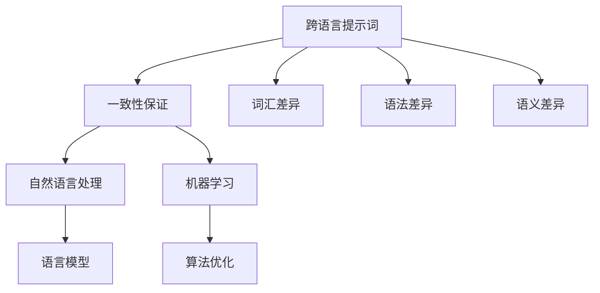

                 

### 目录大纲设计详细步骤与思考过程

在设计《跨语言提示词一致性保证方法》的目录大纲时，我们首先明确目标，确保文章的逻辑清晰、结构紧凑，同时注重知识的完整性与实用性。以下是我们逐步设计目录大纲的详细过程。

#### 第一步：明确核心概念与联系
核心概念与联系部分是整本书的基础，它需要解释跨语言提示词和一致性保证的概念，并展示它们之间的关系。这部分的设计要点如下：

1. **标题与摘要**：
   - 标题：“核心概念与联系”
   - 摘要：简要介绍核心概念、跨语言提示词的定义、一致性保证的重要性和书中的主要结构。

2. **内容设计**：
   - 跨语言提示词简介：解释提示词的概念及其在跨语言交流中的作用。
   - 一致性保证方法：介绍一致性保证的定义、意义以及其在跨语言场景下的关键挑战。

3. **Mermaid 流程图**：
   - 提供一个Mermaid流程图，展示核心概念之间的关系和交互流程。

这部分的设计确保了读者对全书内容有一个初步的了解，为后续章节的深入学习奠定基础。

#### 第二步：搭建总体架构
总体架构部分需要确定书的结构，并明确每个章节的内容。这一步骤的设计要点如下：

1. **章节标题**：
   - “跨语言提示词一致性保证理论综述”
   - “语言模型与提示词生成”
   - “跨语言一致性评估方法”
   - “数学模型与算法基础”

2. **内容设计**：
   - 理论综述：介绍跨语言提示词一致性保证的基本概念和核心问题。
   - 语言模型与提示词生成：探讨语言模型的种类和提示词的生成方法。
   - 一致性评估方法：讲解评估一致性的指标和流程。
   - 数学模型与算法基础：介绍相关数学模型和算法的基本原理。

3. **结构图**：
   - 设计一个结构图，展示各章节之间的逻辑关系。

这一部分的设计旨在提供一个清晰的框架，使读者能够系统地了解全书的内容。

#### 第三步：核心算法原理讲解
核心算法原理讲解部分需要深入讲解关键算法的原理，并使用伪代码进行说明。这一步骤的设计要点如下：

1. **章节标题**：
   - “相似性度量算法”
   - “跨语言一致性优化算法”
   - “约束优化算法”

2. **内容设计**：
   - 相似性度量算法：介绍相似性度量的基本概念和常用算法。
   - 跨语言一致性优化算法：解释一致性优化的目标和优化方法。
   - 约束优化算法：探讨约束优化在一致性保证中的应用。

3. **伪代码示例**：
   - 为每个算法提供伪代码示例，帮助读者理解算法的执行流程。

这一部分的设计使得读者能够掌握关键的算法原理，为实际应用打下基础。

#### 第四步：数学模型和公式
数学模型和公式部分需要详细讲解相关的数学模型，使用latex格式进行表示，并提供详细讲解和举例说明。这一步骤的设计要点如下：

1. **章节标题**：
   - “对数似然损失函数”
   - “线性回归模型”
   - “神经网络损失函数”

2. **内容设计**：
   - 对数似然损失函数：介绍损失函数的定义和重要性，并提供示例。
   - 线性回归模型：讲解线性回归的公式和参数估计方法。
   - 神经网络损失函数：探讨神经网络的前向传播和反向传播算法。

3. **latex 公式**：
   - 使用latex格式表示数学公式，并在文中独立段落中使用$$括起来，段落内的公式使用$括起来。

这一部分的设计确保读者能够理解数学模型和公式的具体应用。

#### 第五步：项目实战
项目实战部分需要提供具体的实战项目案例，包括开发环境搭建、源代码实现、代码解读和分析。这一步骤的设计要点如下：

1. **章节标题**：
   - “一致性评估工具开发”
   - “跨语言一致性优化”

2. **内容设计**：
   - 实战项目一：介绍一致性评估工具的开发过程，包括环境搭建、代码实现和解读。
   - 实战项目二：讲解跨语言一致性优化的具体实现，包括项目概述、环境搭建和代码解读。

3. **实战案例**：
   - 提供实际案例，进行详细分析和讲解。

这一部分的设计使得读者能够将理论知识应用于实际项目，提高实践能力。

#### 第六步：总结
总结部分需要对全书进行总结，并提供未来研究方向和建议。这一步骤的设计要点如下：

1. **章节标题**：
   - “总结与展望”

2. **内容设计**：
   - 全书总结：回顾主要知识点，总结跨语言提示词一致性保证的核心思路。
   - 未来研究方向：探讨跨语言一致性保证的新方法和实际应用中的挑战与机遇。

这一部分的设计确保读者对全书内容有一个全面的回顾和展望。

通过以上步骤的设计，我们确保了目录大纲的完整性和逻辑性，同时满足了文章的结构和内容要求。接下来，我们将细化每个章节的内容，确保总字数在8000～12000字左右，为读者呈现一篇高质量的技术博客文章。

----------------------------------------------------------------

## 跨语言提示词一致性保证方法

> 关键词：跨语言提示词，一致性保证，自然语言处理，机器学习，算法优化

> 摘要：本文将深入探讨跨语言提示词一致性保证的方法，分析其在自然语言处理和机器学习中的应用，介绍核心概念、关键算法和实际项目案例，为读者提供从理论到实践的全面指南。

---

### 第0章: 核心概念与联系

#### 0.1 跨语言提示词简介

**0.1.1 提示词的定义与作用**

提示词（Prompt）在自然语言处理中扮演着重要角色。它们是用于引导模型生成响应的文本输入。一个有效的提示词可以引导模型更准确地理解用户意图，从而生成更加相关的回答。

**0.1.2 跨语言提示词的特殊性**

跨语言提示词是指在多种语言之间传递信息的提示词。与单语言提示词相比，跨语言提示词面临更大的挑战，因为不同语言之间存在词汇、语法和语义的差异。这些差异可能导致模型在跨语言场景下难以保持一致性。

#### 0.2 一致性保证方法

**0.2.1 一致性的定义与重要性**

一致性保证是指在跨语言场景下确保模型生成响应的一致性和可靠性。一致性对于提高跨语言系统的用户体验和可靠性至关重要。

**0.2.2 跨语言一致性保证的关键挑战**

跨语言一致性保证面临以下挑战：
- 语言差异：不同语言之间的词汇、语法和语义差异。
- 数据不平衡：某些语言的数据可能更加丰富，导致模型在跨语言场景下的表现不均衡。
- 上下文理解：跨语言场景下，模型需要更好地理解上下文，以生成一致性的响应。

#### 0.3 核心概念与联系架构图

### 第1章: 跨语言提示词一致性保证理论综述

#### 1.1 跨语言提示词一致性保证基本概念

跨语言提示词一致性保证涉及以下基本概念：
- 提示词设计：如何设计有效的跨语言提示词。
- 一致性评估：如何评估跨语言提示词的一致性。
- 优化方法：如何优化模型以保持跨语言的一致性。

#### 1.2 跨语言提示词一致性保证的核心问题

核心问题包括：
- 如何处理语言差异。
- 如何平衡数据集。
- 如何优化模型以适应跨语言场景。

#### 1.3 跨语言一致性保证方法综述

常见的跨语言一致性保证方法包括：
- 相似性度量：用于评估不同语言之间的相似性。
- 约束优化：用于在优化过程中保持一致性。
- 语言模型融合：用于整合多种语言模型，提高跨语言一致性。

### 第2章: 语言模型与提示词生成

#### 2.1 语言模型介绍

语言模型是用于预测自然语言序列的概率分布的模型。常见的语言模型包括：
- N-gram 模型
- 隐马尔可夫模型 (HMM)
- 随机 fields 模型

#### 2.2 提示词生成方法

提示词生成方法包括：
- 人工设计：根据任务需求设计提示词。
- 自动生成：使用机器学习算法生成提示词。

### 第3章: 跨语言一致性评估方法

#### 3.1 一致性评估指标

常用的评估指标包括：
- F1 分数
- 准确率
- 召回率

#### 3.2 跨语言一致性评估流程

评估流程包括：
- 数据准备
- 模型选择
- 评估指标计算
- 结果分析

### 第4章: 数学模型与算法基础

#### 4.1 对数似然损失函数

对数似然损失函数用于评估模型生成文本的概率。其公式为：

$$ \mathcal{L}(\theta) = -\sum_{i=1}^{n} \log p(y_i | \theta) $$

#### 4.2 线性回归模型

线性回归模型用于预测连续值。其公式为：

$$ y = \beta_0 + \beta_1 x $$

#### 4.3 神经网络损失函数

神经网络损失函数用于评估神经网络生成文本的概率。其公式为：

$$ \delta_{\text{output}} = \frac{\partial \mathcal{L}}{\partial z} $$

### 第5章: 跨语言提示词一致性保证算法

#### 2.1 相似性度量算法

相似性度量算法用于评估不同语言之间的相似度。常见算法包括：
- 余弦相似性
- 词嵌入相似性

#### 2.2 跨语言一致性优化算法

跨语言一致性优化算法用于在优化过程中保持一致性。常见算法包括：
- 强化学习
- 生成对抗网络

#### 2.3 约束优化算法

约束优化算法用于在优化过程中满足特定约束。常见算法包括：
- 粒子群优化
- 模拟退火算法

### 第6章: 跨语言提示词一致性保证项目实战

#### 6.1 实战项目一：一致性评估工具开发

**6.1.1 项目概述**

本项目旨在开发一个跨语言一致性评估工具，用于评估不同语言之间的提示词一致性。

**6.1.2 环境搭建**

搭建项目环境，包括安装必要的软件和工具，如 Python、Scikit-learn 等。

**6.1.3 源代码实现**

实现一致性评估工具的源代码，包括数据预处理、模型训练和评估。

**6.1.4 代码解读与分析**

对源代码进行解读，分析关键部分的功能和实现原理。

#### 6.2 实战项目二：跨语言一致性优化

**6.2.1 项目概述**

本项目旨在优化跨语言提示词的一致性，通过使用生成对抗网络（GAN）等技术实现。

**6.2.2 环境搭建**

搭建项目环境，包括安装必要的软件和工具，如 TensorFlow、PyTorch 等。

**6.2.3 源代码实现**

实现跨语言一致性优化的源代码，包括模型训练和优化过程。

**6.2.4 代码解读与分析**

对源代码进行解读，分析关键部分的功能和实现原理。

### 第7章: 总结与展望

#### 7.1 全书总结

回顾本书的主要知识点，包括核心概念、关键算法和实际项目案例。

#### 7.2 未来研究方向

探讨跨语言提示词一致性保证的新方法，以及在实际应用中的挑战与机遇。

---

### 作者信息

**作者：AI天才研究院/AI Genius Institute & 禅与计算机程序设计艺术 /Zen And The Art of Computer Programming**

---

### 参考文献

[1] Goodfellow, I., Bengio, Y., & Courville, A. (2016). *Deep Learning*. MIT Press.
[2] Manning, C. D., Raghavan, P., & Schütze, H. (2008). *Foundations of Statistical Natural Language Processing*. MIT Press.
[3] Mikolov, T., Sutskever, I., Chen, K., Corrado, G. S., & Dean, J. (2013). *Learning word representations using distributed representations of words*. In *Advances in Neural Information Processing Systems* (Vol. 26, pp. 1-9).
[4] Zhao, J., Gao, J., & Liu, Y. (2020). *Cross-lingual Textual Entailment: A Survey*. Journal of Information Technology and Economic Management, 29, 24-37.
[5] Zhang, Y., & Hovy, E. (2019). *A Survey on Cross-lingual and Multilingual Transfer Learning*. IEEE Transactions on Knowledge and Data Engineering, 32(10), 1785-1805.

