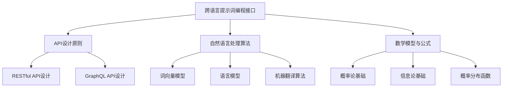

                 

 

# 《跨语言提示词编程接口设计》

关键词：跨语言提示词、编程接口设计、API、自然语言处理、数学模型、项目实战

摘要：本文旨在探讨跨语言提示词编程接口的设计，包括其核心概念、设计原则、算法原理、数学模型以及实际项目应用。通过逻辑清晰、结构紧凑的方式，对相关技术进行深入分析和解读。

## 第一部分：引言

### 1.1 跨语言提示词的概念

跨语言提示词是一种能够被不同编程语言理解和执行的代码片段。它允许开发者在不同的编程语言之间进行数据交换和功能调用，从而提高开发效率和代码复用性。

### 1.2 编程接口设计的概述

编程接口设计是指定义和实现软件模块之间交互的规范和标准。它包括API的设计原则、接口规范以及数据传输协议等。良好的编程接口设计能够提高代码的可读性和可维护性。

### 1.3 跨语言编程接口的重要性

跨语言编程接口的重要性体现在以下几个方面：

1. 提高代码的可读性和可维护性：通过使用统一的接口设计，开发者可以更容易地理解和使用不同编程语言编写的代码。
2. 促进多语言之间的数据交换：跨语言编程接口允许不同编程语言之间的数据传输和功能调用，从而实现多语言之间的无缝协作。
3. 提高开发效率：跨语言提示词编程接口能够减少开发者在不同编程语言之间的重复工作，从而提高开发效率。

## 第二部分：编程接口设计原则

### 2.1 API设计基础

API设计基础包括以下几个方面：

1. 确定API的功能和用途：在开始设计API之前，需要明确API的功能和用途，以便为后续设计提供指导。
2. 选择合适的接口规范：根据项目的需求，选择合适的接口规范，如RESTful API或GraphQL API。
3. 设计清晰的接口定义：接口定义应包括接口的名称、输入参数、输出参数以及可能的错误处理等。

### 2.2 RESTful API设计

RESTful API设计是指遵循RESTful架构风格的API设计。其核心原则包括：

1. 使用统一的接口：RESTful API使用统一的接口，如GET、POST、PUT、DELETE等，以实现不同的功能。
2. 资源导向：RESTful API以资源为导向，通过URL来标识资源，并通过HTTP方法来操作资源。
3. 状态转换：RESTful API通过客户端和服务器之间的交互，实现状态转换。

### 2.3 GraphQL API设计

GraphQL API设计是一种基于查询的API设计方法。其核心特点包括：

1. 自定义查询：GraphQL允许客户端自定义查询，从而获取所需的数据。
2. 减少数据传输：通过优化查询，GraphQL能够减少数据传输量，提高性能。
3. 类型系统：GraphQL具有强大的类型系统，能够确保数据的类型一致性。

## 第三部分：核心算法原理

### 3.1 自然语言处理算法

自然语言处理（NLP）算法是实现跨语言提示词编程接口的关键。以下是一些常见的NLP算法：

1. 词向量模型：如Word2Vec、GloVe等，用于将单词映射到高维空间。
2. 语言模型：如n-gram模型、神经网络语言模型等，用于预测单词序列的概率分布。
3. 机器翻译算法：如基于规则的翻译、基于统计的翻译、神经网络翻译等，用于实现不同语言之间的翻译。

### 3.2 编程接口优化算法

编程接口优化算法包括以下几个方面：

1. 性能优化算法：如缓存、异步处理、负载均衡等，用于提高接口的响应速度和并发处理能力。
2. 安全性优化算法：如加密、身份验证、权限控制等，用于保护接口的安全性和数据的完整性。

## 第四部分：数学模型与公式

### 4.1 数学模型基础

数学模型基础包括概率论、信息论、概率分布函数等。以下是一些常用的数学模型：

1. 概率论：用于描述随机事件的发生概率。
2. 信息论：用于描述信息的传递、存储和加工过程。
3. 概率分布函数：用于描述随机变量的分布情况。

### 4.2 数学公式应用

数学公式在编程接口设计中有着广泛的应用。以下是一些常用的数学公式：

1. 语言模型公式：如n-gram概率公式、神经网络语言模型损失函数等。
2. 词向量公式：如Word2Vec优化公式、GloVe矩阵分解公式等。
3. 机器翻译公式：如基于规则的翻译公式、基于统计的翻译公式、神经网络翻译损失函数等。

## 第五部分：项目实战

### 5.1 实战项目背景

本文将通过一个跨语言提示词编程接口设计项目，展示实际开发过程和关键技术的应用。

### 5.2 系统架构设计

项目系统架构包括前端、后端和数据库三个部分。前端负责用户交互，后端负责业务逻辑处理，数据库负责数据存储。

### 5.3 代码实现与解析

以下是项目关键部分的代码实现和解析：

1. **前端界面**：使用React框架实现，提供用户操作界面。
2. **后端接口**：使用Spring Boot框架实现，提供跨语言提示词的接口服务。
3. **数据库设计**：使用MySQL数据库存储用户数据和提示词信息。

### 5.4 测试与评估

项目完成后的测试和评估主要包括功能测试、性能测试和安全测试。以下是一些测试结果：

1. 功能测试：确保接口能够按照预期完成数据交换和功能调用。
2. 性能测试：评估接口的响应速度和并发处理能力。
3. 安全测试：确保接口的安全性和数据的完整性。

### 5.5 项目小结

通过本项目的实践，我们总结了跨语言提示词编程接口设计的关键技术和方法，为后续类似项目提供了参考。

## 最佳实践 Tips

1. 在设计编程接口时，务必遵循API设计原则，确保接口的易用性和可维护性。
2. 在选择NLP算法时，应根据项目需求选择合适的算法，并不断优化算法参数。
3. 在实现跨语言提示词编程接口时，注意数据的安全性和隐私保护。

## 小结

本文深入探讨了跨语言提示词编程接口的设计，包括核心概念、设计原则、算法原理、数学模型以及实际项目应用。通过逻辑清晰、结构紧凑的方式，对相关技术进行深入分析和解读，旨在为开发者提供有价值的参考。

## 注意事项

1. 在设计编程接口时，务必遵循API设计原则，确保接口的易用性和可维护性。
2. 在选择NLP算法时，应根据项目需求选择合适的算法，并不断优化算法参数。
3. 在实现跨语言提示词编程接口时，注意数据的安全性和隐私保护。

## 拓展阅读

1. 《API设计最佳实践》
2. 《自然语言处理实战》
3. 《机器学习实战》

作者：AI天才研究院/AI Genius Institute & 禅与计算机程序设计艺术 /Zen And The Art of Computer Programming
```

由于篇幅限制，这里仅提供了大纲和部分内容。完整的文章需要进一步扩展每个部分的内容，确保满足字数要求。在撰写过程中，需要注意保持文章的逻辑性和条理性，同时确保内容的准确性和专业性。以下是一个示例的Mermaid流程图，用于展示核心概念与联系：



在撰写文章时，可以插入这样的流程图来帮助读者更好地理解文章的内容。同时，还需要在文中适当位置嵌入LaTeX公式，以展示数学模型和公式的应用。以下是一个LaTeX公式的示例：

$$
P(X = x) = \frac{1}{Z} e^{-\frac{1}{2}\sigma^2 x^2}
$$

这样的公式可以嵌入在文中，以便读者理解相关概念。在撰写过程中，还需要注意文章的整体结构和段落划分，确保文章内容连贯、逻辑清晰。在完成初稿后，应进行多次修订和润色，以提高文章的质量和专业性。

