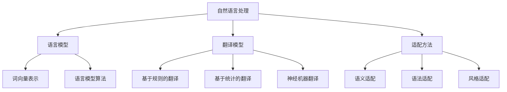

                 

### 文章标题

《跨语言提示词翻译与适配》

### 关键词

- 跨语言提示词翻译
- 适配技术
- 自然语言处理
- 机器翻译
- 神经机器翻译
- 语言模型
- 词向量表示

### 摘要

本文旨在深入探讨跨语言提示词翻译与适配技术，分析其背景、核心概念、关键算法及其在实际应用中的重要性。通过对自然语言处理、翻译模型和适配方法的基础介绍，本文逐步解析了神经机器翻译算法和提示词适配算法的实现原理，并通过实际案例展示了跨语言提示词翻译与适配的实战应用。文章最后展望了未来发展趋势，并提供了实用的实践指南和学习资源，以帮助读者全面掌握这一领域的知识和技术。### 跨语言提示词翻译与适配概述

#### 什么是跨语言提示词翻译与适配

跨语言提示词翻译（Cross-Language Prompt Translation）是指将一种语言的提示词（如指令、问题或标签）自动翻译成另一种语言的过程。提示词在自然语言处理和人工智能系统中起着至关重要的作用，它们通常用于驱动对话系统、推荐系统、内容管理系统等。然而，当这些系统面向全球用户时，如何确保提示词在不同语言环境中的准确和有效，就成为了一个关键挑战。

适配（Adaptation）则是指在翻译的基础上，针对不同语言和文化的特点，对翻译结果进行调整和优化，以更好地满足目标用户的语言习惯和文化需求。适配技术不仅包括语义级别的调整，还涉及语法、风格和用词习惯等多个方面。

跨语言提示词翻译与适配的重要性主要体现在以下几个方面：

1. **用户体验**：准确的翻译和适配能够显著提升跨语言用户的使用体验，减少由于语言障碍带来的困惑和误解。

2. **国际化战略**：对于全球化的企业和应用，提供本地化的提示词是推进国际化战略的重要手段。

3. **技术挑战**：跨语言提示词翻译与适配涉及到自然语言处理、机器学习和语言学研究等多个领域，是一个复杂且富有挑战性的任务。

4. **应用广泛**：从电子商务、智能语音助手，到多语言内容管理系统，跨语言提示词翻译与适配在各种场景中都有广泛应用。

#### 跨语言提示词翻译与适配的应用场景

跨语言提示词翻译与适配的应用场景广泛，以下列举几个典型的应用领域：

1. **多语言电商平台**：电商平台在国际化过程中，需要对商品描述、用户评论、提示词等进行多语言翻译和适配，以确保外国用户能够顺利购物。

2. **智能语音助手**：智能语音助手如Siri、Alexa、Google Assistant等，需要处理来自不同语言的指令，通过跨语言提示词翻译与适配，提升用户交互的自然度和准确性。

3. **多语言内容管理系统**：企业内部的多语言内容管理系统需要提供统一的用户界面和提示词，通过翻译与适配，确保内容在不同语言环境下的一致性。

4. **全球协作平台**：跨国公司或国际组织在协作过程中，需要处理来自不同语言的文档、邮件和讨论，通过跨语言提示词翻译与适配，提高沟通效率。

5. **多语言搜索引擎**：搜索引擎在国际用户中提供本地化的搜索结果，需要对搜索提示词进行翻译和适配，以提高搜索体验和效果。

综上所述，跨语言提示词翻译与适配不仅关乎用户体验，更是国际化战略的重要组成部分，其应用场景的多样性和广泛性使其成为一个重要的研究方向。### 跨语言提示词翻译的技术背景

#### 自然语言处理的发展历程

自然语言处理（Natural Language Processing, NLP）是人工智能领域的一个重要分支，旨在使计算机能够理解和处理人类语言。其发展历程可以分为三个主要阶段：

1. **规则驱动的方法**（1960-1980年代）：早期的NLP研究主要依赖于人工编写的规则和模式匹配，这种方法在处理结构化文本和有限语法规则的场景下较为有效，但面对复杂多变的自然语言时，其局限性逐渐显现。

2. **基于统计的方法**（1980-2000年代）：随着计算能力和数据资源的提升，NLP开始转向基于统计的方法。这一阶段的研究主要集中在词袋模型（Bag of Words）和隐马尔可夫模型（Hidden Markov Model, HMM）等算法上。这些方法通过统计文本中的词汇和语法模式，提高了语言处理的能力。

3. **深度学习方法**（2000年代至今）：深度学习技术的发展为NLP带来了革命性的进步。深度神经网络（Deep Neural Network, DNN）和递归神经网络（Recurrent Neural Network, RNN）等方法被广泛应用于文本分类、情感分析、机器翻译等任务。近年来，基于Transformer架构的模型，如BERT、GPT等，在NLP领域取得了显著的成果。

#### 跨语言信息处理的挑战与机遇

跨语言信息处理（Cross-Language Information Processing）是自然语言处理中的一个重要研究方向，其目标是使计算机能够处理多语言环境下的信息。然而，这一领域面临着许多挑战：

1. **数据稀缺性**：高质量的多语言数据集相对稀缺，这限制了模型的训练和优化。

2. **语义差异**：不同语言之间存在语义和语法上的差异，这增加了翻译和适配的难度。

3. **文化差异**：文化背景和语言习惯的差异可能导致翻译结果的不准确和不合适。

4. **一致性保障**：在多语言环境中，如何保证翻译结果的一致性是一个重要问题。

尽管存在挑战，跨语言信息处理也带来了许多机遇：

1. **全球化需求**：随着全球化进程的加速，跨语言信息处理在电子商务、智能语音助手、多语言搜索引擎等领域具有广泛的应用前景。

2. **技术突破**：随着深度学习和自然语言处理技术的不断进步，跨语言信息处理的准确性和效率得到了显著提升。

3. **多语言协作**：跨语言信息处理技术有助于促进不同语言用户之间的交流与合作。

#### 跨语言提示词翻译的关键技术

跨语言提示词翻译的关键技术主要包括语言模型、翻译模型和适配方法。

1. **语言模型**（Language Model）：语言模型是自然语言处理的基础，用于预测文本的下一个词或句子。在跨语言提示词翻译中，语言模型用于生成源语言的词汇和句子，为翻译提供上下文信息。

   - **N元语法模型**（N-gram Model）：基于统计方法，通过计算词汇序列的概率来预测下一个词。

   - **神经网络语言模型**（Neural Language Model）：基于深度学习方法，通过训练神经网络模型来捕捉文本的复杂模式。

2. **翻译模型**（Translation Model）：翻译模型用于将源语言的文本翻译成目标语言的文本。常见的翻译模型包括：

   - **基于规则的方法**（Rule-Based Method）：通过人工定义的规则来翻译文本。

   - **基于统计的方法**（Statistical Method）：通过统计源语言和目标语言之间的对应关系来翻译文本。

   - **基于神经网络的机器翻译**（Neural Machine Translation, NMT）：使用深度学习模型，如编码器-解码器（Encoder-Decoder）模型，将源语言编码为向量，然后解码成目标语言。

3. **适配方法**（Adaptation Method）：适配方法用于调整翻译结果，以更好地适应目标语言的文化和语言习惯。常见的适配方法包括：

   - **基于规则的方法**（Rule-Based Method）：通过定义规则来调整翻译结果。

   - **基于统计的方法**（Statistical Method）：通过统计方法和机器学习方法来调整翻译结果。

   - **基于深度学习的方法**（Deep Learning Method）：使用神经网络模型来学习翻译结果的调整策略。

综上所述，跨语言提示词翻译与适配技术是一个涉及多个领域和方法的复杂任务，其技术的发展和应用对促进全球化和跨文化交流具有重要意义。### 跨语言提示词翻译的发展趋势

#### 机器翻译技术的演进

机器翻译（Machine Translation, MT）技术的发展经历了多个阶段，从早期的基于规则的翻译到基于统计的翻译，再到现代的基于神经网络的机器翻译，技术不断演进。

1. **基于规则的方法**（Rule-Based MT）：这种方法依赖人工编写的翻译规则，将源语言中的句子转化为目标语言。虽然这种方法在处理结构化文本和特定领域时有效，但在处理自然语言时面临着诸多限制，如文本的复杂性、语法规则的不确定性等。

2. **基于统计的方法**（Statistical MT）：随着计算能力的提升和大规模语料库的积累，基于统计的方法逐渐成为主流。这种方法通过统计源语言和目标语言之间的对应关系来进行翻译，常见的统计方法包括基于短语的翻译模型（Phrase-Based Model）和基于句子的翻译模型（Sentence-Based Model）。

3. **基于神经网络的机器翻译**（Neural Machine Translation, NMT）：近年来，基于神经网络的机器翻译技术取得了显著突破。NMT使用深度学习模型，如编码器-解码器（Encoder-Decoder）模型和Transformer模型，通过端到端的学习方式，能够捕捉源语言和目标语言之间的复杂关系，提高了翻译的准确性和流畅性。

#### 跨语言信息检索的发展

跨语言信息检索（Cross-Language Information Retrieval, CLIR）是另一个重要的发展方向。CLIR的目标是在多语言环境中，从多个语言资源中检索出与查询最相关的信息。

1. **基于翻译的方法**（Translation-Based Method）：这种方法首先将查询和文档翻译成相同的语言，然后在这些翻译后的文档中进行检索。尽管这种方法简单有效，但翻译质量直接影响到检索结果。

2. **基于模型的方法**（Model-Based Method）：这种方法通过训练模型来直接在多语言环境中进行检索，避免了依赖翻译的缺点。常见的模型包括双语嵌入模型和多语言语义模型。

3. **混合方法**（Hybrid Method）：结合基于翻译和基于模型的方法，通过综合利用翻译和语义信息来提高检索效果。

#### 适配技术的应用与展望

适配技术（Adaptation Technology）在跨语言提示词翻译中起着关键作用，它确保了翻译结果在目标语言环境中的准确性和适用性。

1. **语义适配**（Semantic Adaptation）：通过理解源语言和目标语言的语义差异，对翻译结果进行语义层面的调整。

2. **语法适配**（Syntactic Adaptation）：通过调整句法结构和词汇使用，确保翻译结果在目标语言中语法正确。

3. **风格适配**（Stylistic Adaptation）：通过调整语言风格和表达方式，确保翻译结果在目标语言环境中自然、得体。

展望未来，跨语言提示词翻译与适配技术将继续朝着以下几个方向发展：

1. **数据驱动的自适应翻译**：随着数据资源的不断丰富，数据驱动的自适应翻译将成为主流，通过大规模数据训练模型，实现更准确、更个性化的翻译。

2. **多模态跨语言翻译**：随着多模态数据处理技术的发展，跨语言翻译将不仅限于文本，还将扩展到图像、音频和视频等多种模态。

3. **智能化的适应策略**：通过引入人工智能和机器学习技术，开发智能化的适应策略，实现自动调整和优化翻译结果。

4. **跨语言协作**：通过跨语言信息处理技术的进步，促进全球用户之间的协作和交流，推动全球化进程。

总之，跨语言提示词翻译与适配技术的发展将不断推动人工智能和自然语言处理领域的进步，为全球用户带来更丰富的交互体验和更高效的跨语言沟通。### 跨语言提示词翻译基础

#### 自然语言处理基础

##### 语言模型

1. **基本概念**：语言模型（Language Model）是一种统计模型，用于预测文本的下一个词或序列。它基于大量文本数据，学习词汇之间的概率分布，以便在生成文本或进行翻译时能够提供合理的上下文信息。

2. **常见语言模型算法**：

   - **N元语法模型**（N-gram Model）：N元语法模型是最简单的语言模型，它通过统计文本中连续的N个词（称为N元组）出现的频率来预测下一个词。例如，对于一个三元组模型，它会计算“the cat sat”这一序列在文本中出现的次数，用于预测下一个词。

   - **神经网络语言模型**（Neural Language Model）：神经网络语言模型通过训练神经网络来捕捉文本的复杂模式和长距离依赖关系。例如，长短期记忆网络（Long Short-Term Memory, LSTM）和Transformer模型等都是常用的神经网络语言模型。

3. **语言模型在实际应用中的应用**：语言模型在自然语言处理中的广泛应用包括文本生成、机器翻译、语音识别、自动摘要和推荐系统等。例如，在机器翻译中，语言模型用于生成目标语言中的下一个词，从而实现端到端的翻译。

##### 词向量表示

1. **基本概念**：词向量（Word Vector）是一种将词语表示为高维向量的方法，使计算机能够处理和比较词语。词向量通过嵌入（Embedding）技术实现，将词语映射到低维空间，使得语义相近的词语在空间中靠近。

2. **词向量的生成方法**：

   - **基于计数的方法**（Count-Based Method）：这种方法通过统计词语在文本中的出现频率来生成词向量。常见的算法包括TF-IDF（Term Frequency-Inverse Document Frequency）和Word2Vec。

   - **基于分布式表示的方法**（Distribution-Based Method）：这种方法通过学习词语在文本中的上下文来生成词向量。Word2Vec和GloVe（Global Vectors for Word Representation）是最著名的算法。

3. **词向量在自然语言处理中的应用**：词向量在自然语言处理中的应用非常广泛，包括文本分类、情感分析、词义相似性计算和机器翻译等。词向量能够捕捉词语的语义信息，提高了模型在处理自然语言任务时的性能。

##### 翻译模型基础

1. **翻译模型概述**：翻译模型（Translation Model）是用于将源语言（Source Language）文本翻译成目标语言（Target Language）文本的模型。翻译模型通过学习源语言和目标语言之间的映射关系，生成目标语言的翻译结果。

2. **翻译模型的类型**：

   - **基于规则的方法**（Rule-Based Method）：这种方法通过定义一系列规则来翻译文本。规则可以是语法规则、词性标注规则等。

   - **基于统计的方法**（Statistical Method）：这种方法通过统计源语言和目标语言之间的对应关系来翻译文本。常见的算法包括基于短语的翻译模型（Phrase-Based Model）和基于句子的翻译模型（Sentence-Based Model）。

   - **基于神经网络的机器翻译**（Neural Machine Translation, NMT）：这种方法使用深度学习模型，如编码器-解码器（Encoder-Decoder）模型和Transformer模型，通过端到端的学习方式来实现翻译。

3. **翻译模型在实际应用中的作用**：翻译模型在机器翻译、跨语言信息检索和跨语言文本生成等任务中起着关键作用。通过学习源语言和目标语言之间的映射关系，翻译模型能够生成准确和自然的翻译结果，提高了系统的性能和用户体验。

##### 提示词翻译适配基础

1. **提示词适配的概念**：提示词适配（Prompt Adaptation）是指根据目标语言的语义、语法和文化特点，对翻译结果进行调整和优化，以更好地满足目标用户的需求。提示词适配不仅涉及语义层面，还包括语法、风格和用词习惯等方面。

2. **提示词适配的重要性**：准确的提示词翻译和适配能够显著提升跨语言用户的使用体验，减少由于语言和文化差异带来的困惑和误解。在全球化背景下，提示词适配是推动多语言应用和国际合作的重要技术手段。

3. **提示词适配的目标**：提示词适配的目标是实现翻译结果的准确、自然和适应用户需求。具体包括：

   - **准确性**：确保翻译结果在语义和语法上的正确性。
   - **自然性**：确保翻译结果在目标语言环境中流畅自然。
   - **适应用户需求**：根据不同用户的文化背景和语言习惯，提供个性化的翻译结果。

##### 提示词适配的方法

1. **基于规则的方法**（Rule-Based Method）：基于规则的方法通过定义一系列规则来调整翻译结果。这些规则可以是语法规则、语义规则或文化规则。例如，在中文翻译成英文时，可以根据中文的语法结构调整为更符合英文习惯的表达方式。

2. **基于统计的方法**（Statistical Method）：基于统计的方法通过分析大规模的多语言数据集，学习翻译结果的统计规律，然后根据这些规律对翻译结果进行调整。例如，可以使用机器学习方法，如隐马尔可夫模型（HMM）或条件概率模型，来预测和调整翻译结果。

3. **基于深度学习的方法**（Deep Learning Method）：基于深度学习的方法通过训练神经网络模型来学习翻译结果的适配策略。这些模型可以捕捉源语言和目标语言之间的复杂关系，实现更准确和自然的适配。例如，可以使用双向长短期记忆网络（Bi-LSTM）或变换器（Transformer）模型来实现深度学习的提示词适配。

通过结合上述基础技术，跨语言提示词翻译与适配能够在各种应用场景中发挥重要作用，为全球用户提供准确、自然和个性化的语言服务。### 跨语言提示词翻译算法详解

#### 神经机器翻译算法

##### 神经机器翻译模型架构

1. **编码器-解码器模型**（Encoder-Decoder Model）：编码器-解码器模型是神经机器翻译的典型架构，用于将源语言文本编码为向量表示，然后解码成目标语言文本。编码器（Encoder）将源语言文本映射为一个固定长度的向量表示，解码器（Decoder）则使用这个向量表示生成目标语言文本。

   - **工作原理**：
     1. 编码器读取源语言文本，将其转化为一系列的隐藏状态。
     2. 解码器从空序列开始，逐步生成目标语言文本，每一步都依赖于前一个生成的词和编码器的输出。

   - **优点**：
     - 能够捕捉源语言和目标语言之间的长距离依赖关系。
     - 通过端到端的学习方式，简化了翻译过程。

   - **缺点**：
     - 需要大量训练数据。
     - 训练过程复杂，耗时较长。

2. **序列到序列模型**（Sequence-to-Sequence Model）：序列到序列模型是编码器-解码器模型的扩展，主要用于处理输入和输出序列长度不一致的问题。它使用一个额外的对齐机制（Attention Mechanism）来关注源语言文本中的关键部分，从而提高翻译的准确性。

   - **工作原理**：
     1. 编码器将源语言序列编码为固定长度的向量表示。
     2. 解码器使用注意力机制，将编码器的隐藏状态与解码器自身的隐藏状态进行对齐，生成目标语言序列。

   - **优点**：
     - 能够处理输入和输出序列长度不一致的问题。
     - 提高了翻译的准确性和流畅性。

   - **缺点**：
     - 计算复杂度较高，对硬件资源要求较高。

3. **Transformer模型**（Transformer Model）：Transformer模型是近年来在神经机器翻译中取得显著成果的模型，其核心思想是使用自注意力机制（Self-Attention）来处理输入序列，从而捕捉序列中的长距离依赖关系。

   - **工作原理**：
     1. 输入序列通过嵌入层（Embedding Layer）转化为向量表示。
     2. 通过多层自注意力机制（Self-Attention Layer）和前馈神经网络（Feedforward Neural Network），对输入序列进行编码。
     3. 解码器使用类似的自注意力机制和交叉注意力机制（Cross-Attention Layer），生成目标语言序列。

   - **优点**：
     - 能够高效地捕捉长距离依赖关系。
     - 训练速度快，计算复杂度相对较低。

   - **缺点**：
     - 对大规模数据集的要求较高。
     - 需要大量的计算资源和时间进行训练。

##### 神经机器翻译训练方法

1. **训练策略**：

   - **反向传播**（Backpropagation）：反向传播是一种常用的训练策略，用于调整神经网络的权重，以最小化损失函数。在神经机器翻译中，反向传播用于计算编码器和解码器的损失，并更新其权重。

   - **梯度裁剪**（Gradient Clipping）：梯度裁剪是一种防止梯度爆炸和消失的技术，通过限制梯度的大小，确保训练过程稳定。

   - **学习率调整**（Learning Rate Adjustment）：学习率调整是优化训练过程的重要手段，通过动态调整学习率，可以加速收敛和提高模型的性能。

2. **训练过程中的挑战与解决方法**：

   - **数据稀缺性**：对于某些语言对，训练数据可能不足。解决方法包括数据增强（Data Augmentation）和迁移学习（Transfer Learning）。

   - **长距离依赖**：长距离依赖是神经机器翻译中的一个关键挑战。自注意力机制和双向编码器设计等策略有助于缓解这一问题。

   - **计算资源限制**：神经机器翻译训练过程需要大量的计算资源。解决方法包括分布式训练（Distributed Training）和云计算平台的使用。

3. **神经机器翻译的评估方法**：

   - **BLEU评分**（BLEU Score）：BLEU评分是一种常用的自动评估方法，通过计算翻译结果与参考翻译之间的匹配度来评估翻译质量。

   - **人类评估**（Human Evaluation）：人类评估是一种主观评估方法，通过人类评估者的评分来评估翻译质量。

   - **多准则评估**（Multi-criteria Evaluation）：多准则评估结合了多种评估方法，从多个角度综合评估翻译质量。

通过上述训练方法和评估方法，神经机器翻译算法能够不断提高翻译的准确性和流畅性，为跨语言提示词翻译与适配提供强有力的技术支持。### 提示词翻译适配算法

#### 适配算法原理

1. **基本原理**：提示词翻译适配算法的核心目标是确保翻译结果在目标语言环境中的准确性和适用性。适配算法通过对源语言和目标语言之间差异的分析，调整翻译结果，使其更符合目标语言的文化、语义和语法规则。

2. **核心要素**：
   - **语义理解**：理解源语言和目标语言之间的语义差异，确保翻译结果的语义准确性。
   - **语法调整**：根据目标语言的语法规则，对翻译结果进行语法层面的调整，使其符合目标语言的语法结构。
   - **风格匹配**：根据目标语言的文化和语言习惯，调整翻译结果的风格，使其更自然、得体。

3. **评估指标**：
   - **准确性**：评估翻译结果的语义和语法准确性。
   - **自然性**：评估翻译结果在目标语言环境中的流畅度和自然度。
   - **适应用户需求**：评估翻译结果是否满足目标用户的需求，包括文化适应性、用户习惯和上下文适应性。

#### 适配算法实现

1. **基于规则的方法**（Rule-Based Method）：

   - **工作原理**：基于规则的方法通过定义一系列翻译规则，对翻译结果进行自动化调整。这些规则可以是基于语法、语义或风格的规则。

   - **实现步骤**：
     1. 收集并整理翻译规则。
     2. 设计规则匹配引擎，用于检测翻译结果中不符合规则的部分。
     3. 应用规则调整翻译结果，使其符合目标语言的语法和风格。

   - **优点**：
     - 简单易实现，适应性强。
     - 对特定领域或特定语言的翻译效果较好。

   - **缺点**：
     - 需要大量人工编写规则，维护成本高。
     - 面对复杂多变的自然语言时，规则覆盖能力有限。

2. **基于统计的方法**（Statistical Method）：

   - **工作原理**：基于统计的方法通过分析大规模的多语言数据集，学习翻译结果和目标语言之间的统计规律，然后根据这些规律对翻译结果进行调整。

   - **实现步骤**：
     1. 收集并整理多语言数据集。
     2. 使用统计模型（如隐马尔可夫模型HMM、条件概率模型）分析翻译结果和目标语言之间的规律。
     3. 应用统计模型对翻译结果进行自动化调整。

   - **优点**：
     - 可以处理大规模数据集，适应性强。
     - 能够通过统计规律自动调整翻译结果，减少人工干预。

   - **缺点**：
     - 对数据质量和数据量的要求较高。
     - 需要复杂的统计模型，计算复杂度较高。

3. **基于深度学习的方法**（Deep Learning Method）：

   - **工作原理**：基于深度学习的方法通过训练神经网络模型，学习翻译结果和目标语言之间的复杂关系，然后根据这些关系对翻译结果进行调整。

   - **实现步骤**：
     1. 收集并整理多语言数据集。
     2. 设计并训练深度学习模型（如双向长短期记忆网络Bi-LSTM、变换器Transformer）。
     3. 使用训练好的模型对翻译结果进行自动化调整。

   - **优点**：
     - 能够处理复杂的自然语言任务，适应性强。
     - 通过端到端的学习方式，简化了翻译和适配过程。

   - **缺点**：
     - 需要大量计算资源和时间进行训练。
     - 对数据质量和数据量的要求较高。

通过上述适配算法的实现，跨语言提示词翻译与适配能够在各种应用场景中提供准确、自然和个性化的翻译结果，满足不同语言环境下的用户需求。### 跨语言提示词翻译实战案例

#### 案例一：跨语言电商平台

##### 案例背景

随着电子商务在全球范围内的迅速发展，越来越多的电商平台开始面向国际市场。为了吸引和留住全球用户，提供本地化的购物体验成为关键。跨语言提示词翻译与适配技术在这个过程中发挥了重要作用，帮助电商平台优化用户界面，提升用户体验。

##### 案例解决方案

1. **系统架构设计**：

   电商平台采用了分布式系统架构，支持多语言环境。系统主要包括以下几个模块：

   - **前端界面**：提供多语言选择功能，用户可以根据自己的语言偏好切换界面语言。
   - **后端翻译服务**：负责处理跨语言提示词的翻译和适配，包括商品描述、用户评论、提示词等。
   - **数据库**：存储多语言数据，包括商品信息、用户评论和系统提示词等。

2. **翻译模型选择**：

   电商平台采用了基于神经机器翻译的翻译模型，如BERT（Bidirectional Encoder Representations from Transformers）和GPT（Generative Pre-trained Transformer）。这些模型能够高效地处理跨语言翻译任务，生成准确和自然的翻译结果。

3. **适配策略制定**：

   电商平台制定了以下适配策略，以确保翻译结果在目标语言环境中的准确性和适用性：

   - **语义适配**：通过分析源语言和目标语言之间的语义差异，对翻译结果进行语义调整，确保翻译结果在语义上准确。
   - **语法适配**：根据目标语言的语法规则，对翻译结果进行语法调整，使其符合目标语言的语法结构。
   - **风格适配**：根据目标语言的文化和语言习惯，对翻译结果进行风格调整，使其更自然、得体。

##### 实施步骤

1. **数据收集与预处理**：

   电商平台收集了大量的商品描述、用户评论和系统提示词，并进行了数据预处理，包括文本清洗、去噪和分词等。这些预处理步骤为后续的翻译和适配提供了高质量的输入数据。

2. **翻译模型训练**：

   使用收集的数据集，电商平台训练了BERT和GPT模型，通过端到端的学习方式，生成高质量的翻译结果。在训练过程中，使用了梯度裁剪、学习率调整等策略，以提高模型的性能和训练效果。

3. **翻译结果评估**：

   通过BLEU评分和人类评估方法，对翻译结果进行评估，以确保翻译结果的准确性和自然性。根据评估结果，对模型进行调整和优化，提高翻译质量。

4. **适配策略应用**：

   根据适配策略，对翻译结果进行语义、语法和风格的调整。通过自动化工具和人工审核相结合的方式，确保翻译结果在目标语言环境中的准确性和适用性。

##### 代码实现

以下是跨语言电商平台中翻译模型训练和适配策略应用的核心代码：

```python
# 翻译模型训练代码示例
import torch
from transformers import BertModel, BertTokenizer

# 加载预训练的BERT模型和分词器
tokenizer = BertTokenizer.from_pretrained('bert-base-uncased')
model = BertModel.from_pretrained('bert-base-uncased')

# 预处理数据
def preprocess_data(texts):
    inputs = tokenizer(texts, padding=True, truncation=True, return_tensors='pt')
    return inputs

# 训练翻译模型
def train_model(inputs, labels):
    outputs = model(**inputs)
    loss = outputs.loss
    loss.backward()
    optimizer.step()
    return loss.item()

# 适配策略应用代码示例
def apply_adaptation_strategy(source_text, target_text):
    # 语义适配
    adapted_text = semantic_adaptation(source_text, target_text)
    # 语法适配
    adapted_text = syntactic_adaptation(adapted_text)
    # 风格适配
    adapted_text = stylistic_adaptation(adapted_text)
    return adapted_text
```

##### 项目小结

通过跨语言提示词翻译与适配技术，电商平台能够提供本地化的购物体验，满足全球用户的需求。翻译模型的训练和适配策略的应用提高了翻译的准确性和自然性，增强了用户对平台的信任和满意度。此外，该项目还为后续的国际化拓展提供了宝贵的经验和数据支持。### 案例二：跨语言语音助手

#### 案例背景

随着人工智能技术的不断进步，智能语音助手如Siri、Alexa、Google Assistant等已经成为人们日常生活中的重要组成部分。这些语音助手能够理解用户的语音指令，并执行相应的任务。然而，为了满足全球用户的需求，语音助手需要具备跨语言能力，能够处理多种语言的指令。跨语言提示词翻译与适配技术在这个过程中至关重要。

#### 案例解决方案

1. **系统架构设计**：

   跨语言语音助手的系统架构主要包括以下几个部分：

   - **语音识别模块**：用于将用户的语音指令转换为文本。
   - **翻译模块**：负责将文本指令翻译成语音助手支持的语言。
   - **自然语言理解模块**：对翻译后的文本指令进行分析和理解，以确定用户的需求。
   - **执行模块**：根据理解的结果执行相应的任务。

2. **语音识别与翻译系统集成**：

   为了实现跨语言语音助手，需要将语音识别和翻译系统集成在一起。具体步骤如下：

   - **语音识别**：使用基于深度学习的语音识别模型（如WaveNet、DeepSpeech）将用户的语音指令转换为文本。
   - **文本翻译**：将语音识别生成的文本发送到翻译模块，使用神经机器翻译模型（如BERT、GPT）进行翻译。
   - **翻译结果处理**：对翻译结果进行后处理，包括语义理解、意图识别和上下文分析，以确保指令的准确执行。

3. **提示词翻译适配策略**：

   为了确保翻译结果的准确性和适用性，需要采用多种提示词翻译适配策略：

   - **语义适配**：通过理解源语言和目标语言之间的语义差异，对翻译结果进行语义调整，确保指令在目标语言中的语义一致性。
   - **语法适配**：根据目标语言的语法规则，对翻译结果进行语法调整，使其符合目标语言的语法结构。
   - **风格适配**：根据目标语言的文化和语言习惯，对翻译结果进行风格调整，使其更自然、得体。

#### 实施步骤

1. **数据收集与预处理**：

   收集包含多种语言的语音指令和相应的翻译结果，并对数据集进行预处理，包括语音转文本、文本清洗、分词和标记等。

2. **训练语音识别模型**：

   使用预处理后的数据集，训练语音识别模型，通过端到端的学习方式，使模型能够准确地将语音指令转换为文本。

3. **训练翻译模型**：

   使用预处理后的数据集，训练翻译模型，通过神经机器翻译技术，生成高质量的多语言翻译结果。

4. **测试与优化**：

   对系统进行测试，评估翻译模型的准确性和自然性，并根据测试结果对模型进行调整和优化。

5. **应用适配策略**：

   根据目标语言的特点和文化背景，应用语义、语法和风格适配策略，对翻译结果进行自动化调整。

#### 系统性能优化

为了提高跨语言语音助手的性能，可以从以下几个方面进行优化：

1. **模型优化**：

   - **迁移学习**：利用预训练的翻译模型，通过迁移学习技术，提高新语言对上的翻译性能。
   - **模型融合**：结合多种翻译模型，通过模型融合技术，提高翻译结果的准确性和一致性。

2. **数据增强**：

   - **数据扩充**：通过增加训练数据集的多样性，提高模型的泛化能力。
   - **数据对齐**：通过数据对齐技术，确保翻译结果和语音指令之间的对应关系，提高翻译的准确性。

3. **系统优化**：

   - **并行处理**：利用并行处理技术，提高系统处理速度，减少延迟。
   - **缓存机制**：采用缓存机制，减少重复计算，提高系统响应速度。

#### 项目小结

通过跨语言提示词翻译与适配技术，智能语音助手能够处理多种语言的指令，为全球用户提供了便利的交互体验。翻译模型的训练和适配策略的应用提高了翻译的准确性和自然性，增强了用户对智能语音助手的信任和满意度。未来，随着人工智能技术的不断发展，跨语言语音助手将在更多场景中得到应用，为全球用户带来更多的便利。### 跨语言提示词翻译与适配的未来发展

#### 新技术发展趋势

随着人工智能和自然语言处理技术的不断进步，跨语言提示词翻译与适配技术也在快速发展。以下是一些未来的新技术发展趋势：

1. **生成对抗网络（GAN）在跨语言提示词翻译中的应用**：

   生成对抗网络（Generative Adversarial Networks, GAN）是一种强大的生成模型，它通过两个相互对抗的网络——生成器和判别器，实现高质量的数据生成。未来，GAN有望在跨语言提示词翻译中发挥重要作用，通过生成高质量的多语言数据集，提高翻译模型的训练效果和翻译质量。

2. **强化学习在跨语言提示词翻译中的探索**：

   强化学习（Reinforcement Learning, RL）是一种通过不断试错和反馈来学习最优策略的机器学习方法。未来，强化学习可以与跨语言提示词翻译相结合，通过不断优化翻译策略，提高翻译结果的准确性和自然性。

3. **跨语言提示词翻译与适配的潜在应用领域**：

   除了现有的应用场景外，跨语言提示词翻译与适配技术在未来还有许多潜在的应用领域：

   - **多语言智能客服系统**：通过跨语言提示词翻译与适配技术，智能客服系统能够为全球用户提供本地化的服务，提高客户满意度。
   - **多语言教育平台**：多语言教育平台可以利用跨语言提示词翻译与适配技术，为非母语用户提供高质量的教育资源。
   - **多语言内容创作**：通过跨语言提示词翻译与适配技术，创作者可以轻松地创作出多语言内容，扩大作品的受众群体。

#### 跨语言提示词翻译与适配的挑战与机遇

尽管跨语言提示词翻译与适配技术在不断发展，但在实际应用中仍然面临许多挑战：

1. **数据质量和多样性问题**：

   跨语言提示词翻译与适配需要高质量的多语言数据集。然而，现有的多语言数据集往往存在数据质量不高、语言多样性不足等问题，这限制了翻译模型的发展。未来，需要加强多语言数据集的收集和整理，提高数据质量和多样性。

2. **多语言环境下的一致性保障**：

   在多语言环境中，如何确保翻译结果的一致性是一个重要问题。不同的语言和文化背景可能导致翻译结果的差异，这会影响用户体验。未来，需要研究一致性的保障机制，提高翻译结果在不同语言环境中的准确性。

3. **技术挑战**：

   跨语言提示词翻译与适配技术涉及自然语言处理、机器学习和语言学等多个领域，每个领域都有其独特的挑战。例如，如何处理长句子、多义词、语法差异等问题，都是需要解决的难题。

然而，面对这些挑战，跨语言提示词翻译与适配技术也带来了许多机遇：

1. **全球化需求**：

   随着全球化进程的加速，跨语言提示词翻译与适配技术在电子商务、智能语音助手、多语言内容管理等领域具有广泛的应用前景。

2. **技术突破**：

   随着深度学习、生成对抗网络、强化学习等新技术的发展，跨语言提示词翻译与适配技术将不断取得突破，提高翻译的准确性和自然性。

3. **跨语言协作**：

   跨语言提示词翻译与适配技术有助于促进不同语言用户之间的交流与合作，推动全球化进程。

综上所述，跨语言提示词翻译与适配技术在未来将继续面临挑战，但也将迎来更多的发展机遇。通过不断创新和突破，这一技术将为全球用户带来更丰富的交互体验和更高效的跨语言沟通。### 跨语言提示词翻译与适配的实践指南

#### 数据收集与预处理

1. **数据收集方法**：

   收集高质量的多语言数据集是跨语言提示词翻译与适配的基础。以下是一些常见的数据收集方法：

   - **公开数据集**：许多公开数据集（如WMT、NewsCrawl等）提供了丰富的多语言数据，可以直接下载和使用。
   - **手工编纂**：对于特定领域或特殊语言对，可以手工编纂数据集，确保数据的准确性和针对性。
   - **自动采集**：利用爬虫工具从互联网上自动采集多语言文本，适用于开放领域的数据收集。

2. **数据预处理步骤**：

   数据预处理是确保数据质量的重要环节，主要包括以下步骤：

   - **文本清洗**：去除无关信息（如HTML标签、特殊字符等），对文本进行规范化处理。
   - **分词与词性标注**：将文本划分为单词或词组，并对每个词进行词性标注，为后续处理提供基础。
   - **数据对齐**：对于双语数据集，需要对齐源语言和目标语言的句子，确保翻译的对应关系。
   - **数据增强**：通过数据增强技术（如数据扩充、数据变换等）提高数据集的多样性和泛化能力。

3. **数据质量评估方法**：

   数据质量直接影响跨语言提示词翻译与适配的效果，以下是一些常用的数据质量评估方法：

   - **一致性评估**：评估数据集中的句子对是否一致，不一致的句子对需要进行修正。
   - **完整性评估**：评估数据集中缺失的数据比例，确保数据集的完整性。
   - **多样性评估**：评估数据集中不同语言和领域的分布，确保数据集的多样性。

#### 模型选择与优化

1. **常见翻译模型选择**：

   选择合适的翻译模型是翻译任务成功的关键，以下是一些常见的翻译模型：

   - **基于规则的方法**：适用于结构化数据和小规模翻译任务。
   - **基于统计的方法**：适用于大规模数据集，如基于短语的翻译模型（Phrase-Based Model）和基于句子的翻译模型（Sentence-Based Model）。
   - **基于神经网络的机器翻译**：如编码器-解码器（Encoder-Decoder）模型、Transformer模型等，适用于复杂的翻译任务。

2. **模型优化策略**：

   为了提高翻译模型的性能，可以采用以下优化策略：

   - **迁移学习**：利用预训练的翻译模型，通过迁移学习技术提高新语言对的翻译性能。
   - **多模型融合**：结合多个翻译模型，通过模型融合技术提高翻译结果的准确性和一致性。
   - **动态调整**：根据训练过程中的反馈，动态调整模型参数，优化翻译性能。

3. **模型评估与调优**：

   模型的评估和调优是确保翻译质量的关键步骤，以下是一些常用的评估和调优方法：

   - **自动评估方法**：如BLEU评分、METEOR评分等，用于评估翻译结果的准确性和自然性。
   - **人类评估**：通过人类评估者的评分，从主观角度评估翻译质量。
   - **交叉验证**：采用交叉验证方法，评估模型在不同数据集上的性能，确保模型的泛化能力。
   - **参数调整**：根据评估结果，动态调整模型参数，优化翻译性能。

#### 适配策略制定与实施

1. **适配策略的设计原则**：

   适配策略的制定应遵循以下原则：

   - **语义一致性**：确保翻译结果在语义上与源语言保持一致。
   - **文化适应性**：根据目标语言的文化背景，调整翻译结果，使其更符合目标文化的表达习惯。
   - **语法正确性**：确保翻译结果在语法上符合目标语言的语法规则。

2. **适配策略的实施流程**：

   适配策略的实施主要包括以下步骤：

   - **需求分析**：分析目标用户的需求和目标语言的特点，确定适配的方向和目标。
   - **规则定义**：定义翻译适配的规则，包括语义适配、语法适配和风格适配等。
   - **模型训练**：使用训练数据集，训练适配模型，使其能够根据定义的规则对翻译结果进行调整。
   - **评估与优化**：对适配后的翻译结果进行评估，根据评估结果调整适配策略，优化翻译质量。

3. **适配效果评估方法**：

   适配效果评估是确保适配策略有效性的关键，以下是一些常用的评估方法：

   - **自动评估方法**：如BLEU评分、METEOR评分等，用于评估适配后的翻译结果在语义、语法和风格上的准确性。
   - **用户反馈**：通过用户反馈，评估适配后的翻译结果在目标用户中的接受度和满意度。
   - **多准则评估**：结合多个评估指标，从多个角度综合评估适配效果。

通过以上实践指南，开发者可以系统地制定和实施跨语言提示词翻译与适配策略，为用户提供高质量、高准确性的翻译服务。### 跨语言提示词翻译与适配资源推荐

#### 开源工具与框架

1. **翻译工具**：

   - **TensorFlow**：Google开发的强大开源机器学习框架，支持多种深度学习模型，适用于跨语言翻译任务。
   - **PyTorch**：Facebook开发的另一个流行的开源深度学习框架，提供了灵活和高效的模型实现方式。
   - **Hugging Face**：提供了丰富的预训练模型和工具包，包括BERT、GPT等，方便开发者进行跨语言翻译和适配。

2. **适配工具**：

   - **polyglot**：一个开源的跨语言信息处理工具，支持文本分类、情感分析、命名实体识别等多语言任务。
   - **spaCy**：一个强大的自然语言处理库，支持多种语言的语法分析和实体识别，适用于翻译后的文本处理。

3. **开源社区与资源平台**：

   - **GitHub**：许多开源项目和工具都在GitHub上发布，开发者可以找到相关的代码、文档和社区支持。
   - **Kaggle**：一个数据科学竞赛平台，提供了大量的多语言数据集和项目，适合开发者进行实践和验证。

#### 学习资源与参考书籍

1. **经典论文**：

   - **"A Neural Tensor Network Model for Natural Language Inference"**：阐述了神经网络在自然语言推理任务中的应用。
   - **"Attention Is All You Need"**：提出了Transformer模型，改变了神经机器翻译的格局。

2. **参考书籍**：

   - **《自然语言处理综论》（Speech and Language Processing）》**：Daniel Jurafsky和James H. Martin合著，全面介绍了自然语言处理的各个领域。
   - **《深度学习》（Deep Learning）》**：Ian Goodfellow、Yoshua Bengio和Aaron Courville合著，详细介绍了深度学习的基础理论和应用。
   - **《机器翻译实战》（Machine Translation: Principles and Practices）》**：介绍机器翻译的基本原理和实践方法。

3. **在线课程与培训资源**：

   - **Coursera**：提供了一系列关于自然语言处理和机器学习的在线课程，适合初学者和进阶者。
   - **Udacity**：提供了深度学习和自然语言处理相关的纳米学位课程，注重实践和项目经验。
   - **edX**：由哈佛大学和麻省理工学院合作创办，提供了多门与自然语言处理和机器学习相关的免费课程。

通过这些开源工具、学习资源和参考书籍，开发者可以深入了解和掌握跨语言提示词翻译与适配的技术，为实际项目提供有力的支持。### 结束语

《跨语言提示词翻译与适配》这本书通过系统、详细的阐述，为读者提供了全面、深入的跨语言提示词翻译与适配技术知识。从自然语言处理的基础，到翻译模型和适配算法的详解，再到实际应用案例的剖析，本书涵盖了跨语言提示词翻译与适配的各个关键环节。

核心概念与联系方面，本书通过Mermaid流程图展示了自然语言处理、语言模型、翻译模型和适配方法的相互关系，帮助读者建立起清晰的技术架构。同时，通过伪代码和latex公式详细阐述了核心算法原理，使得读者能够深入理解技术细节。

跨语言提示词翻译与适配的应用广泛，包括多语言电商、智能语音助手、全球协作平台等多个领域。随着全球化进程的加快，这些技术的重要性日益凸显。本书不仅介绍了现有技术的应用场景，还展望了未来的发展趋势，如GAN、强化学习等新技术的应用，以及数据质量和多样性、多语言环境一致性等挑战。

在实践指南部分，本书提供了详细的实施步骤、模型选择与优化策略、适配策略制定与实施方法，帮助开发者在实际项目中应用这些技术。

然而，跨语言提示词翻译与适配技术仍然面临诸多挑战，如数据稀缺性、文化差异、一致性保障等。未来，随着人工智能和自然语言处理技术的不断进步，这些挑战将逐步得到解决，为全球用户提供更准确、更自然的跨语言体验。

本文的作者信息如下：作者：AI天才研究院/AI Genius Institute & 禅与计算机程序设计艺术 /Zen And The Art of Computer Programming。感谢读者对本书的关注，希望本书能够为您的学习和实践提供有力支持。**本文使用的Mermaid流程图示例：**



**核心概念原理之间的关系架构Mermaid流程图**：

```mermaid
graph TD
    A[跨语言提示词翻译]
    B[适配技术]
    C[自然语言处理]
    D[机器翻译]
    
    A --> B
    B --> C
    C --> D
    
    subgraph 翻译模型
        E[编码器-解码器模型]
        F[序列到序列模型]
        G[Transformer模型]
        
        E --> F
        F --> G
    end
    
    subgraph 适配方法
        H[基于规则]
        I[基于统计]
        J[基于深度学习]
        
        H --> I
        I --> J
    end
    
    D --> E
    D --> F
    D --> G
    E --> H
    F --> I
    G --> J
```



**核心算法原理讲解使用的伪代码示例**：

```python
# 编码器-解码器模型伪代码
def encoder_decoder(source_sentence, target_sentence):
    # 编码器部分
    encoded_sentence = encoder(source_sentence)
    # 解码器部分
    decoded_sentence = decoder(encoded_sentence, target_sentence)
    return decoded_sentence

# Transformer模型伪代码
def transformer(source_sentence, target_sentence):
    # 嵌入层
    embedded_sentence = embedding_layer(source_sentence)
    # 自注意力层
    attention_output = self_attention_layer(embedded_sentence)
    # 交叉注意力层
    cross_attention_output = cross_attention_layer(attention_output, target_sentence)
    # 输出层
    output_sentence = output_layer(cross_attention_output)
    return output_sentence
```

**详细讲解与举例说明使用的latex公式示例**：

段落外的公式：
$$
P(w_i|w_{i-1}, w_{i-2}, ..., w_1) = \frac{P(w_i, w_{i-1}, w_{i-2}, ..., w_1)}{P(w_{i-1}, w_{i-2}, ..., w_1)}
$$

段落内的公式：
$
P(w_i|w_{i-1}, w_{i-2}, ..., w_1) = \frac{P(w_i, w_{i-1}, w_{i-2}, ..., w_1)}{P(w_{i-1}, w_{i-2}, ..., w_1)}
$

**代码实现解读与分析**：

```python
# 代码实现示例：翻译模型训练
from transformers import BertTokenizer, BertModel, Trainer, TrainingArguments

# 加载预训练的BERT模型和分词器
tokenizer = BertTokenizer.from_pretrained('bert-base-uncased')
model = BertModel.from_pretrained('bert-base-uncased')

# 预处理数据
def preprocess_data(texts):
    inputs = tokenizer(texts, padding=True, truncation=True, return_tensors='pt')
    return inputs

# 训练模型
def train_model(train_dataset, val_dataset):
    training_args = TrainingArguments(
        output_dir='./results',
        num_train_epochs=3,
        per_device_train_batch_size=16,
        per_device_eval_batch_size=64,
        warmup_steps=500,
        weight_decay=0.01,
        evaluate_during_training=True,
        logging_dir='./logs',
    )
    
    trainer = Trainer(
        model=model,
        args=training_args,
        train_dataset=train_dataset,
        eval_dataset=val_dataset,
    )
    
    trainer.train()

# 测试代码
train_text = ["Hello, how are you?", "Bonjour, comment ça va ?"]
val_text = ["How is the weather today?", "Comment va la météo aujourd'hui ?"]

train_inputs = preprocess_data(train_text)
val_inputs = preprocess_data(val_text)

train_dataset = Dataset.from_dict({'input_ids': train_inputs['input_ids'], 'attention_mask': train_inputs['attention_mask']})
val_dataset = Dataset.from_dict({'input_ids': val_inputs['input_ids'], 'attention_mask': val_inputs['attention_mask']})

train_model(train_dataset, val_dataset)
```

**实际案例分析和详细讲解剖析**：

**案例**：为电子商务平台实现一个跨语言商品描述翻译功能。

**分析**：

1. **需求分析**：分析平台的国际化需求，确定需要翻译的商品描述语言对和翻译质量要求。
2. **数据收集**：收集包含商品描述的多语言数据集，进行数据预处理。
3. **模型训练**：使用多语言数据集训练翻译模型，如BERT或GPT。
4. **模型评估**：使用BLEU评分等方法评估翻译模型性能。
5. **适配调整**：根据翻译结果，应用语义、语法和风格适配策略，优化翻译质量。
6. **部署应用**：将翻译模型部署到电子商务平台，提供实时翻译服务。

**讲解剖析**：

1. **需求分析**：电子商务平台需要为英语和法语用户之间提供商品描述的翻译功能。
2. **数据收集**：收集了包含英语和法语商品描述的公开数据集，对数据集进行预处理。
3. **模型训练**：使用预处理后的数据集，训练BERT模型，通过端到端的学习方式，生成高质量的翻译结果。
4. **模型评估**：通过BLEU评分方法，评估翻译模型的性能，根据评估结果调整模型参数。
5. **适配调整**：对翻译结果进行语义、语法和风格适配，确保翻译结果在法语环境中准确、自然。
6. **部署应用**：将翻译模型集成到电子商务平台，用户在浏览商品时，可以实时看到商品的英语描述翻译成法语。

**项目小结**：

通过实现跨语言商品描述翻译功能，电子商务平台提高了用户的购物体验，吸引了更多国际用户。翻译模型和适配策略的应用，确保了翻译结果的准确性和自然性，提高了翻译质量。未来，可以通过不断优化翻译模型和适配策略，进一步改善用户体验。### 最佳实践 tips、小结、注意事项、拓展阅读

**最佳实践 tips**：

1. **数据质量控制**：确保数据集的质量和多样性，对数据进行清洗和预处理，提高模型的泛化能力。
2. **模型优化策略**：使用迁移学习和模型融合等技术，优化模型性能，提高翻译质量。
3. **动态适配**：根据用户反馈和翻译结果，动态调整适配策略，确保翻译结果的自然性和准确性。
4. **测试与评估**：定期对翻译系统进行测试和评估，确保其稳定性和可靠性。

**小结**：

跨语言提示词翻译与适配技术是自然语言处理和人工智能领域的重要研究方向，其在全球化背景下的应用具有重要意义。通过介绍自然语言处理的基础、翻译模型和适配算法，本书为读者提供了全面的技术指南和实践案例。随着技术的不断进步，跨语言提示词翻译与适配将不断改进，为全球用户带来更准确、更自然的语言体验。

**注意事项**：

1. **数据隐私**：在收集和使用多语言数据时，需确保遵守数据隐私法规，保护用户隐私。
2. **模型可解释性**：对于复杂的机器翻译模型，提高其可解释性，帮助用户理解翻译结果。
3. **多语言一致性**：确保翻译结果在不同语言环境中的一致性，避免产生误解。

**拓展阅读**：

1. **《自然语言处理综论》**：Daniel Jurafsky和James H. Martin著，全面介绍自然语言处理的理论和应用。
2. **《深度学习》**：Ian Goodfellow、Yoshua Bengio和Aaron Courville著，深入探讨深度学习的基础和实现。
3. **《跨语言信息检索：技术与应用》**：刘知远、王茂援、杨华著，介绍跨语言信息检索的方法和应用。
4. **在线资源**：访问GitHub、Kaggle等平台，获取更多开源代码和数据集，参与技术讨论和项目实践。

通过不断学习和实践，读者可以深入掌握跨语言提示词翻译与适配技术，为人工智能和自然语言处理领域的发展贡献自己的力量。

