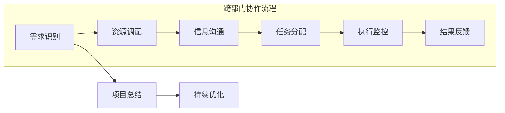

                 

### 文章标题

# 跨部门协作优化：打破部门壁垒的策略

> 关键词：跨部门协作、部门壁垒、优化策略、协作流程、信息化工具、组织变革、文化建设

> 摘要：本文深入探讨了跨部门协作中存在的部门壁垒问题，并提出了多种优化策略。通过分析协作的基础概念、流程设计、模型构建和文化建设，以及实际案例的剖析，本文旨在为企业和组织提供一套系统化的跨部门协作优化方案，助力提升工作效率和团队整体效能。

---

### 引言

在当今复杂多变的市场环境中，企业内部各职能部门之间的协作越来越成为决定组织成功与否的关键因素。然而，部门之间的壁垒却常常成为协作的绊脚石，导致信息不对称、资源浪费和效率低下。为了应对这一挑战，优化跨部门协作成为企业和组织管理的重要课题。

跨部门协作不仅涉及到团队内部成员之间的沟通与配合，还涉及到不同部门之间工作流程的衔接与优化。有效的跨部门协作能够提高工作效率，加速项目进展，增强团队的凝聚力和创新能力。然而，传统的部门壁垒如信息孤岛、沟通不畅、资源限制等，常常制约了跨部门协作的效果。

本文将从以下几个方面展开探讨：

1. **跨部门协作基础**：介绍跨部门协作的基本概念、流程、模型和文化，为优化策略的制定提供理论基础。
2. **优化跨部门协作的策略**：深入分析技术支持、组织变革和文化建设等方面的策略，提供具体的实施建议。
3. **实际应用案例分析**：通过具体案例展示跨部门协作优化策略的实施效果，总结经验教训。
4. **跨部门协作工具与应用**：介绍常用的跨部门协作工具及其在实际应用中的效果和优化建议。

通过本文的阅读，读者将能够系统地了解跨部门协作的优化策略，掌握实施方法，从而有效打破部门壁垒，提升组织协作效能。

---

### 第一部分：跨部门协作基础

#### 1.1 跨部门协作概述

跨部门协作指的是企业内部不同部门或团队之间为了共同完成某项任务或实现特定目标而进行的合作过程。在复杂的企业运营中，跨部门协作已经成为提高工作效率、整合资源、促进创新的重要手段。

**重要性**

跨部门协作的重要性体现在以下几个方面：

1. **资源共享**：通过跨部门协作，企业可以实现资源的优化配置，避免重复投资和资源浪费。
2. **信息流通**：跨部门协作有助于信息在不同部门之间的流通，减少信息孤岛现象，提高决策质量。
3. **团队效能**：跨部门协作可以促进团队间的沟通和合作，增强团队凝聚力和创新能力。
4. **项目效率**：跨部门协作能够加快项目进度，提高项目完成质量，降低项目风险。

**现状与挑战**

尽管跨部门协作的重要性被广泛认同，但在实际操作中，仍然面临诸多挑战：

1. **信息不对称**：不同部门对项目进展、资源需求和问题解决的了解程度不一致，导致协作效率低下。
2. **沟通不畅**：部门之间的沟通壁垒导致信息传递不及时、不准确，甚至产生误解和冲突。
3. **资源限制**：部门之间的资源分配不均衡，导致部分部门资源紧张，而其他部门资源闲置。
4. **目标不一致**：不同部门对项目目标的理解和优先级不同，导致协作目标和方向不明确。

**目标与原则**

为了实现有效的跨部门协作，需要明确以下目标和原则：

1. **目标明确**：确保所有部门对协作目标有共同的理解和认同，明确各自的角色和职责。
2. **信息共享**：建立信息共享机制，确保部门之间能够及时、准确地获取所需信息。
3. **沟通畅通**：建立有效的沟通渠道和机制，促进部门之间的信息交流和反馈。
4. **资源优化**：通过资源调配和共享，实现资源的合理利用和最大化效益。
5. **协调合作**：建立协调机制，解决部门之间的冲突和矛盾，促进协作的顺利进行。

#### 1.2 跨部门协作流程

跨部门协作流程是确保协作顺利进行的关键。一个有效的跨部门协作流程应包括以下几个关键环节：

1. **需求识别**：明确项目或任务的需求，确定协作的起点和目标。
2. **资源调配**：根据需求进行资源调配，确保各部门具备完成任务的资源和条件。
3. **信息沟通**：建立沟通机制，确保部门之间能够及时、准确地交流信息，避免信息孤岛现象。
4. **任务分配**：将任务分解并分配给各相关部门，明确任务的责任人和完成时限。
5. **执行监控**：对协作过程进行监控和评估，及时发现和解决问题，确保项目进度和质量。
6. **结果反馈**：对协作结果进行反馈和评估，总结经验教训，为下一次协作提供参考。

**流程设计**

跨部门协作流程的设计需要考虑以下几个关键要素：

1. **目标导向**：流程设计应以实现协作目标为核心，确保各部门的目标一致。
2. **灵活性**：流程设计应具备一定的灵活性，以适应不同的项目需求和变化。
3. **标准化**：流程设计应遵循一定的标准化原则，确保流程的规范化和可操作性。
4. **可视化**：流程设计应具备一定的可视化效果，使各部门能够清晰地了解协作流程和自己的职责。

**关键节点**

跨部门协作流程中的关键节点包括：

1. **需求识别**：明确项目或任务的需求，是流程的起点。
2. **资源调配**：资源调配是流程的核心，直接影响协作的效率和效果。
3. **信息沟通**：信息沟通是流程的纽带，确保各部门之间的信息畅通和协同。
4. **任务分配**：任务分配是流程的关键，确保任务分配合理、责任明确。
5. **执行监控**：执行监控是流程的保障，确保协作过程顺利进行。
6. **结果反馈**：结果反馈是流程的总结，为下一次协作提供参考和改进方向。

**流程优化策略**

为了提升跨部门协作的效率，可以采取以下流程优化策略：

1. **简化流程**：简化不必要的流程环节，减少冗余步骤，提高流程效率。
2. **自动化**：引入自动化工具和系统，减少人工操作，提高流程的自动化程度。
3. **标准化**：制定统一的流程规范，确保各部门遵循相同的流程标准。
4. **可视化**：使用图表和工具，将流程可视化为各部门提供直观的参考。
5. **反馈机制**：建立反馈机制，及时收集和解决问题，持续优化流程。

#### 1.3 跨部门协作模型

跨部门协作模型是组织和实施跨部门协作的理论框架。常见的跨部门协作模型包括传统协作模型和现代协作模型。

**传统协作模型**

传统协作模型主要依赖于线性流程和层级管理，以明确的指令和汇报关系为基础。具体特点如下：

1. **线性流程**：协作过程按照一定的顺序进行，每个环节有明确的负责人。
2. **层级管理**：协作任务由上级分配，下属执行，层级关系清晰。
3. **指令型沟通**：信息传递主要依赖于指令和汇报，沟通方式较为单一。
4. **资源分配**：资源主要由上级部门调配，下级部门接受资源分配。

**现代协作模型**

现代协作模型更加注重团队协作和灵活性，强调信息共享和协同创新。具体特点如下：

1. **矩阵式管理**：部门之间形成矩阵式关系，既有垂直管理，又有横向协作。
2. **扁平化管理**：减少管理层级，提高决策效率，增强团队自主性。
3. **网络型沟通**：信息传递更加多样化和灵活，部门之间形成网络状沟通模式。
4. **资源共享**：资源由各部门自主调配，提高资源利用效率。

**协作模型的实施与效果评估**

在实施跨部门协作模型时，需要考虑以下几个方面：

1. **组织架构**：根据协作模型的特点，调整组织架构，确保各部门之间的协作关系清晰。
2. **人员培训**：对员工进行协作意识和技能培训，提高协作能力和效率。
3. **信息共享**：建立信息共享平台，确保部门之间能够及时获取所需信息。
4. **效果评估**：通过关键绩效指标（KPI）和员工反馈，评估协作模型的效果，持续优化。

#### 1.4 跨部门协作文化

跨部门协作文化是促进跨部门协作的重要因素。良好的协作文化能够增强团队的凝聚力，提高协作效率。以下从几个方面探讨如何塑造跨部门协作文化：

**协作文化的塑造**

1. **共同价值观**：建立共同的价值观和使命，强化协作意识。
2. **信任建设**：通过沟通和合作，建立信任，消除部门间的隔阂。
3. **激励机制**：建立合理的激励机制，鼓励员工积极参与跨部门协作。

**跨部门协作中的沟通与冲突管理**

1. **开放沟通**：建立开放、透明的沟通机制，鼓励部门之间的交流与合作。
2. **冲突管理**：建立冲突管理机制，及时解决部门之间的矛盾和冲突。

**跨部门协作激励机制**

1. **目标导向**：以团队目标和项目目标为导向，激励员工积极参与协作。
2. **绩效评估**：建立科学的绩效评估体系，综合考虑跨部门协作的贡献。
3. **奖励制度**：设立跨部门协作奖励，激励员工积极协作。

#### 小结

跨部门协作是现代企业管理中不可或缺的一部分。通过理解跨部门协作的基本概念、流程设计、模型构建和文化建设，可以更好地优化跨部门协作，提升团队效率和创新能力。在接下来的部分，我们将进一步探讨如何通过技术支持和组织变革来优化跨部门协作，提供具体的策略和实施方法。

---

### 第一部分：跨部门协作基础

#### 1.1 跨部门协作概述

跨部门协作指的是企业内部不同部门或团队之间为了共同完成某项任务或实现特定目标而进行的合作过程。在复杂的企业运营中，跨部门协作已经成为提高工作效率、整合资源、促进创新的重要手段。

**重要性**

跨部门协作的重要性体现在以下几个方面：

1. **资源共享**：通过跨部门协作，企业可以实现资源的优化配置，避免重复投资和资源浪费。
2. **信息流通**：跨部门协作有助于信息在不同部门之间的流通，减少信息孤岛现象，提高决策质量。
3. **团队效能**：跨部门协作可以促进团队间的沟通和合作，增强团队凝聚力和创新能力。
4. **项目效率**：跨部门协作能够加快项目进度，提高项目完成质量，降低项目风险。

**现状与挑战**

尽管跨部门协作的重要性被广泛认同，但在实际操作中，仍然面临诸多挑战：

1. **信息不对称**：不同部门对项目进展、资源需求和问题解决的了解程度不一致，导致协作效率低下。
2. **沟通不畅**：部门之间的沟通壁垒导致信息传递不及时、不准确，甚至产生误解和冲突。
3. **资源限制**：部门之间的资源分配不均衡，导致部分部门资源紧张，而其他部门资源闲置。
4. **目标不一致**：不同部门对项目目标的理解和优先级不同，导致协作目标和方向不明确。

**目标与原则**

为了实现有效的跨部门协作，需要明确以下目标和原则：

1. **目标明确**：确保所有部门对协作目标有共同的理解和认同，明确各自的角色和职责。
2. **信息共享**：建立信息共享机制，确保部门之间能够及时、准确地获取所需信息。
3. **沟通畅通**：建立有效的沟通渠道和机制，促进部门之间的信息交流和反馈。
4. **资源优化**：通过资源调配和共享，实现资源的合理利用和最大化效益。
5. **协调合作**：建立协调机制，解决部门之间的冲突和矛盾，促进协作的顺利进行。

#### 1.2 跨部门协作流程

跨部门协作流程是确保协作顺利进行的关键。一个有效的跨部门协作流程应包括以下几个关键环节：

1. **需求识别**：明确项目或任务的需求，确定协作的起点和目标。
2. **资源调配**：根据需求进行资源调配，确保各部门具备完成任务的资源和条件。
3. **信息沟通**：建立沟通机制，确保部门之间能够及时、准确地交流信息，避免信息孤岛现象。
4. **任务分配**：将任务分解并分配给各相关部门，明确任务的责任人和完成时限。
5. **执行监控**：对协作过程进行监控和评估，及时发现和解决问题，确保项目进度和质量。
6. **结果反馈**：对协作结果进行反馈和评估，总结经验教训，为下一次协作提供参考。

**流程设计**

跨部门协作流程的设计需要考虑以下几个关键要素：

1. **目标导向**：流程设计应以实现协作目标为核心，确保各部门的目标一致。
2. **灵活性**：流程设计应具备一定的灵活性，以适应不同的项目需求和变化。
3. **标准化**：流程设计应遵循一定的标准化原则，确保流程的规范化和可操作性。
4. **可视化**：流程设计应具备一定的可视化效果，使各部门能够清晰地了解协作流程和自己的职责。

**关键节点**

跨部门协作流程中的关键节点包括：

1. **需求识别**：明确项目或任务的需求，是流程的起点。
2. **资源调配**：资源调配是流程的核心，直接影响协作的效率和效果。
3. **信息沟通**：信息沟通是流程的纽带，确保各部门之间的信息畅通和协同。
4. **任务分配**：任务分配是流程的关键，确保任务分配合理、责任明确。
5. **执行监控**：执行监控是流程的保障，确保协作过程顺利进行。
6. **结果反馈**：结果反馈是流程的总结，为下一次协作提供参考和改进方向。

**流程优化策略**

为了提升跨部门协作的效率，可以采取以下流程优化策略：

1. **简化流程**：简化不必要的流程环节，减少冗余步骤，提高流程效率。
2. **自动化**：引入自动化工具和系统，减少人工操作，提高流程的自动化程度。
3. **标准化**：制定统一的流程规范，确保各部门遵循相同的流程标准。
4. **可视化**：使用图表和工具，将流程可视化为各部门提供直观的参考。
5. **反馈机制**：建立反馈机制，及时收集和解决问题，持续优化流程。

#### 1.3 跨部门协作模型

跨部门协作模型是组织和实施跨部门协作的理论框架。常见的跨部门协作模型包括传统协作模型和现代协作模型。

**传统协作模型**

传统协作模型主要依赖于线性流程和层级管理，以明确的指令和汇报关系为基础。具体特点如下：

1. **线性流程**：协作过程按照一定的顺序进行，每个环节有明确的负责人。
2. **层级管理**：协作任务由上级分配，下属执行，层级关系清晰。
3. **指令型沟通**：信息传递主要依赖于指令和汇报，沟通方式较为单一。
4. **资源分配**：资源主要由上级部门调配，下级部门接受资源分配。

**现代协作模型**

现代协作模型更加注重团队协作和灵活性，强调信息共享和协同创新。具体特点如下：

1. **矩阵式管理**：部门之间形成矩阵式关系，既有垂直管理，又有横向协作。
2. **扁平化管理**：减少管理层级，提高决策效率，增强团队自主性。
3. **网络型沟通**：信息传递更加多样化和灵活，部门之间形成网络状沟通模式。
4. **资源共享**：资源由各部门自主调配，提高资源利用效率。

**协作模型的实施与效果评估**

在实施跨部门协作模型时，需要考虑以下几个方面：

1. **组织架构**：根据协作模型的特点，调整组织架构，确保各部门之间的协作关系清晰。
2. **人员培训**：对员工进行协作意识和技能培训，提高协作能力和效率。
3. **信息共享**：建立信息共享平台，确保部门之间能够及时获取所需信息。
4. **效果评估**：通过关键绩效指标（KPI）和员工反馈，评估协作模型的效果，持续优化。

#### 1.4 跨部门协作文化

跨部门协作文化是促进跨部门协作的重要因素。良好的协作文化能够增强团队的凝聚力，提高协作效率。以下从几个方面探讨如何塑造跨部门协作文化：

**协作文化的塑造**

1. **共同价值观**：建立共同的价值观和使命，强化协作意识。
2. **信任建设**：通过沟通和合作，建立信任，消除部门间的隔阂。
3. **激励机制**：建立合理的激励机制，鼓励员工积极参与协作。

**跨部门协作中的沟通与冲突管理**

1. **开放沟通**：建立开放、透明的沟通机制，鼓励部门之间的交流与合作。
2. **冲突管理**：建立冲突管理机制，及时解决部门之间的矛盾和冲突。

**跨部门协作激励机制**

1. **目标导向**：以团队目标和项目目标为导向，激励员工积极参与协作。
2. **绩效评估**：建立科学的绩效评估体系，综合考虑跨部门协作的贡献。
3. **奖励制度**：设立跨部门协作奖励，激励员工积极协作。

#### 小结

跨部门协作是现代企业管理中不可或缺的一部分。通过理解跨部门协作的基本概念、流程设计、模型构建和文化建设，可以更好地优化跨部门协作，提升团队效率和创新能力。在接下来的部分，我们将进一步探讨如何通过技术支持和组织变革来优化跨部门协作，提供具体的策略和实施方法。

---

### 1.5 技术支持策略

在现代企业管理中，技术支持策略是优化跨部门协作不可或缺的一环。通过引入先进的信息化工具和系统，企业能够大幅提升跨部门协作的效率和质量。以下从几个方面探讨跨部门协作中的技术支持策略。

**信息化工具在跨部门协作中的应用**

信息化工具是跨部门协作的重要工具，能够显著提升协作效率和效果。以下是几种常用信息化工具：

1. **即时通讯工具**：如Slack、微软Teams等，用于实时沟通和协作。
2. **项目管理工具**：如JIRA、Trello等，用于任务分配、进度跟踪和协作管理。
3. **文档协作工具**：如Google Docs、Microsoft Office 365等，用于文档共享和协同编辑。
4. **视频会议工具**：如Zoom、Microsoft Teams等，用于远程会议和在线协作。
5. **知识库管理工具**：如Confluence、Notion等，用于知识共享和团队协作。

**数据分析与决策支持**

数据是决策的基础，通过数据分析和决策支持系统，企业可以更准确地把握项目进展，优化资源配置，提升协作效率。以下是几种数据分析与决策支持工具：

1. **数据分析工具**：如Tableau、Power BI等，用于数据可视化和分析。
2. **项目管理软件**：如Asana、JIRA等，提供项目进度跟踪、风险管理和决策支持。
3. **AI决策支持系统**：如TensorFlow、PyTorch等，用于复杂决策问题的建模和预测。

**自动化技术在协作流程中的应用**

自动化技术能够显著减少人工操作，提高协作流程的自动化程度，减少错误和重复工作。以下是几种自动化技术在跨部门协作中的应用：

1. **自动化工作流**：如机器人流程自动化（RPA），用于自动执行重复性任务。
2. **自动化测试**：如Selenium、Appium等，用于自动化测试和验证。
3. **自动化部署**：如Jenkins、GitLab CI等，用于自动化代码部署和持续集成。

**技术支持策略的实际案例**

以下是一些技术支持策略在实际跨部门协作中的应用案例：

1. **案例一：使用Trello进行项目管理**  
   一家科技公司通过使用Trello进行项目管理，实现了任务分配、进度跟踪和协作的透明化。每个项目团队成员可以实时查看任务状态，及时进行沟通和调整，提高了项目效率。

2. **案例二：引入Slack进行即时沟通**  
   另一家公司通过引入Slack进行即时沟通，消除了部门间的沟通壁垒，实现了信息的快速传递和协作的顺畅进行。员工可以通过Slack进行实时讨论、文件共享和任务分配，提升了沟通效率。

3. **案例三：使用AI决策支持系统**  
   一家制造企业引入AI决策支持系统，对生产过程进行实时监控和数据分析，优化生产流程和资源配置。通过AI系统的预测和优化建议，企业能够更准确地把握市场需求，提高生产效率和产品质量。

**总结**

技术支持策略在跨部门协作中发挥着重要作用。通过引入即时通讯工具、项目管理工具、文档协作工具、视频会议工具和知识库管理工具，企业能够实现信息的快速传递和资源的优化配置。同时，通过数据分析和决策支持系统，企业能够更准确地把握项目进展，优化资源配置，提升协作效率。自动化技术则进一步减少了人工操作，提高了协作流程的自动化程度，减少了错误和重复工作。通过实际案例可以看出，技术支持策略的有效实施能够显著提升跨部门协作的效率和质量。

在接下来的部分，我们将进一步探讨组织变革策略，如何通过调整组织架构、人员培训和激励机制来优化跨部门协作。

---

### 第二部分：优化跨部门协作的策略

#### 2.1 技术支持策略

在现代企业管理中，技术支持策略是优化跨部门协作不可或缺的一环。通过引入先进的信息化工具和系统，企业能够大幅提升跨部门协作的效率和质量。以下从几个方面探讨跨部门协作中的技术支持策略。

**信息化工具在跨部门协作中的应用**

信息化工具是跨部门协作的重要工具，能够显著提升协作效率和效果。以下是几种常用信息化工具：

1. **即时通讯工具**：如Slack、微软Teams等，用于实时沟通和协作。
2. **项目管理工具**：如JIRA、Trello等，用于任务分配、进度跟踪和协作管理。
3. **文档协作工具**：如Google Docs、Microsoft Office 365等，用于文档共享和协同编辑。
4. **视频会议工具**：如Zoom、Microsoft Teams等，用于远程会议和在线协作。
5. **知识库管理工具**：如Confluence、Notion等，用于知识共享和团队协作。

**数据分析与决策支持**

数据是决策的基础，通过数据分析和决策支持系统，企业可以更准确地把握项目进展，优化资源配置，提升协作效率。以下是几种数据分析与决策支持工具：

1. **数据分析工具**：如Tableau、Power BI等，用于数据可视化和分析。
2. **项目管理软件**：如Asana、JIRA等，提供项目进度跟踪、风险管理和决策支持。
3. **AI决策支持系统**：如TensorFlow、PyTorch等，用于复杂决策问题的建模和预测。

**自动化技术在协作流程中的应用**

自动化技术能够显著减少人工操作，提高协作流程的自动化程度，减少错误和重复工作。以下是几种自动化技术在跨部门协作中的应用：

1. **自动化工作流**：如机器人流程自动化（RPA），用于自动执行重复性任务。
2. **自动化测试**：如Selenium、Appium等，用于自动化测试和验证。
3. **自动化部署**：如Jenkins、GitLab CI等，用于自动化代码部署和持续集成。

**技术支持策略的实际案例**

以下是一些技术支持策略在实际跨部门协作中的应用案例：

1. **案例一：使用Trello进行项目管理**  
   一家科技公司通过使用Trello进行项目管理，实现了任务分配、进度跟踪和协作的透明化。每个项目团队成员可以实时查看任务状态，及时进行沟通和调整，提高了项目效率。

2. **案例二：引入Slack进行即时沟通**  
   另一家公司通过引入Slack进行即时沟通，消除了部门间的沟通壁垒，实现了信息的快速传递和协作的顺畅进行。员工可以通过Slack进行实时讨论、文件共享和任务分配，提升了沟通效率。

3. **案例三：使用AI决策支持系统**  
   一家制造企业引入AI决策支持系统，对生产过程进行实时监控和数据分析，优化生产流程和资源配置。通过AI系统的预测和优化建议，企业能够更准确地把握市场需求，提高生产效率和产品质量。

**总结**

技术支持策略在跨部门协作中发挥着重要作用。通过引入即时通讯工具、项目管理工具、文档协作工具、视频会议工具和知识库管理工具，企业能够实现信息的快速传递和资源的优化配置。同时，通过数据分析和决策支持系统，企业能够更准确地把握项目进展，优化资源配置，提升协作效率。自动化技术则进一步减少了人工操作，提高了协作流程的自动化程度，减少了错误和重复工作。通过实际案例可以看出，技术支持策略的有效实施能够显著提升跨部门协作的效率和质量。

在接下来的部分，我们将进一步探讨组织变革策略，如何通过调整组织架构、人员培训和激励机制来优化跨部门协作。

---

### 2.2 组织变革策略

在跨部门协作的优化过程中，组织变革策略是至关重要的。通过调整组织架构、改进人员培训机制和设计有效的激励机制，企业可以打破传统的部门壁垒，实现跨部门的高效协作。以下将详细探讨这些策略的实施方法。

**调整组织架构**

组织架构的调整是优化跨部门协作的基础。通过以下方式，企业可以重塑组织结构，促进跨部门协作：

1. **矩阵式组织结构**：在传统职能式组织结构的基础上，引入矩阵式管理，使项目团队具备跨部门的灵活性和自主性。在这种结构中，员工既受职能部门的领导，又属于特定项目团队，能够更好地整合资源，提高协作效率。

2. **跨部门工作组**：建立跨部门工作组，专门负责协调和管理跨部门项目。这些工作组通常由各部门的核心成员组成，负责项目的规划、执行和监控，确保项目目标的一致性和协作的顺畅性。

3. **扁平化组织结构**：减少管理层级，缩短决策链条，提高组织响应速度。通过扁平化组织结构，员工能够更直接地参与决策过程，减少信息传递的滞后和失真。

**改进人员培训机制**

人员培训是提升跨部门协作能力的关键。以下是一些改进人员培训机制的建议：

1. **跨部门培训课程**：为员工提供跨部门的培训课程，帮助员工了解不同部门的业务流程、工作内容和协作需求。通过培训，员工能够增强跨部门协作的意识，提升协作技能。

2. **领导力培训**：针对中层管理人员和高层领导，开展领导力培训，提高他们在跨部门协作中的领导能力和协调能力。通过领导力培训，管理者能够更好地引导和激励员工，促进跨部门协作的顺利进行。

3. **沟通技能培训**：沟通是跨部门协作的核心，通过沟通技能培训，员工可以学会有效的沟通方法和技巧，提高沟通效率，减少误解和冲突。

**设计有效的激励机制**

激励机制是激发员工跨部门协作积极性的关键。以下是一些设计有效激励机制的建议：

1. **团队奖励制度**：设立团队奖励制度，对在跨部门协作中表现优秀的团队和个人进行奖励。通过团队奖励，激励员工积极参与跨部门项目，提高团队协作的积极性。

2. **跨部门绩效考核**：建立跨部门绩效考核体系，综合考虑员工在跨部门项目中的表现，将其纳入绩效评估和晋升考核。通过跨部门绩效考核，激励员工在协作中发挥最佳水平。

3. **灵活的工作安排**：提供灵活的工作安排，如远程办公、弹性工作时间等，为员工创造更好的工作环境。通过灵活的工作安排，员工能够更好地平衡工作和生活，提高工作满意度和工作效率。

**实际案例**

以下是一些企业通过组织变革策略优化跨部门协作的实际案例：

1. **案例一：某科技公司的矩阵式组织变革**  
   某科技公司通过引入矩阵式组织结构，将职能部门和项目团队紧密结合。通过跨部门工作组的建立，公司实现了项目资源的优化配置和高效协作。在矩阵式组织结构下，员工能够跨部门参与项目，提升协作能力，项目完成率显著提高。

2. **案例二：某制造企业的跨部门培训计划**  
   某制造企业为提升员工的跨部门协作能力，实施了全面的跨部门培训计划。通过跨部门培训课程和领导力培训，员工对其他部门的业务有了更深入的了解，沟通技能和协作意识显著提升。员工在跨部门协作中的表现得到公司认可，项目成功率和员工满意度均有所提高。

3. **案例三：某金融服务公司的激励机制**  
   某金融服务公司设计了一套跨部门激励机制，包括团队奖励制度和跨部门绩效考核。通过这些激励措施，公司鼓励员工积极参与跨部门项目，项目完成质量和团队协作水平显著提升。员工的工作积极性和满意度也得到了显著提高。

**总结**

组织变革策略是优化跨部门协作的关键。通过调整组织架构、改进人员培训机制和设计有效的激励机制，企业能够打破传统的部门壁垒，实现跨部门的高效协作。通过实际案例可以看出，组织变革策略的有效实施能够显著提升企业的协作效率和项目完成质量。在接下来的部分，我们将进一步探讨文化建设策略，如何通过塑造良好的企业文化和建立信任机制来促进跨部门协作。

---

### 2.3 文化建设策略

文化建设是优化跨部门协作的重要手段之一。一个积极、开放、信任的文化环境能够有效促进跨部门之间的合作与沟通，打破部门壁垒，提升整体协作效能。以下将从几个方面探讨如何通过文化建设策略来促进跨部门协作。

**共同价值观的建立**

共同价值观是企业文化的基础，也是跨部门协作的灵魂。企业应通过明确和传播共同的价值观，使员工在协作中形成一致的目标和信念。以下是一些具体做法：

1. **价值观宣贯**：通过内部会议、培训、文化墙等多种形式，不断宣贯和强化企业的核心价值观，使员工深入理解并内化于心。
2. **领导带头**：企业高层领导应以身作则，通过言行举止带头践行核心价值观，树立榜样，引导全体员工共同追求。
3. **文化故事**：通过讲述企业内部关于共同价值观的成功案例和感人故事，增强员工的认同感和归属感，激发大家的共同愿景。

**信任机制的建立**

信任是跨部门协作的基石，企业应致力于构建一个信任机制，以促进部门之间的紧密合作。以下是一些具体措施：

1. **透明沟通**：建立透明、开放的沟通渠道，确保信息在各部门之间畅通无阻，减少信息孤岛现象。通过定期的内部会议、项目汇报等形式，增强各部门之间的了解和信任。
2. **反馈机制**：建立有效的反馈机制，鼓励员工在跨部门协作中及时表达意见和建议，对于合理的建议给予积极的反馈和奖励，增强员工的参与感和信任感。
3. **信任培训**：通过信任培训课程，帮助员工了解信任的重要性，学会如何在协作中建立和维护信任。通过角色扮演、案例分析等活动，提高员工的信任意识和协作能力。

**激励机制的设计**

激励机制是文化建设的重要组成部分，通过合理的激励机制，可以激发员工的积极性，促进跨部门协作的顺利进行。以下是一些激励机制的设计建议：

1. **团队奖励**：设立团队奖励制度，对于在跨部门协作中表现突出的团队给予物质和精神奖励，激励员工积极参与协作。
2. **个人成长**：为员工提供跨部门交流和学习的机会，鼓励员工在跨部门协作中不断成长和提升。通过内部晋升机制，使员工在协作中的表现得到认可和回报。
3. **创新奖励**：鼓励员工在跨部门协作中提出创新方案和改进措施，对于创新成果给予奖励，激发员工的创新热情和协作精神。

**跨部门沟通与协作的平台**

建立专门的跨部门沟通与协作平台，有助于各部门之间进行高效、有序的协作。以下是一些平台设计建议：

1. **协作工具**：引入先进的协作工具，如项目管理软件、即时通讯工具、视频会议系统等，为各部门提供便捷的协作平台。
2. **知识共享**：建立知识共享平台，鼓励各部门将宝贵的经验和知识上传共享，促进知识的传播和利用，提升整体协作水平。
3. **协作文化墙**：设置协作文化墙，展示各部门之间的协作成果、优秀团队和先进个人，营造积极的协作氛围。

**实际案例分析**

以下是一些企业通过文化建设策略促进跨部门协作的实际案例：

1. **案例一：某互联网公司的开放沟通机制**  
   某互联网公司通过建立开放沟通机制，鼓励员工在跨部门协作中自由表达意见和建议。公司定期组织跨部门交流会，员工可以就项目进展、协作问题等展开深入讨论，信息透明度显著提高，协作效率大幅提升。

2. **案例二：某制造企业的团队奖励制度**  
   某制造企业设立团队奖励制度，对于在跨部门协作中取得优异成绩的团队给予奖励，激励员工积极参与协作。通过团队奖励，企业内部形成了你追我赶、团结协作的良好氛围，项目完成质量和员工满意度显著提高。

3. **案例三：某金融服务公司的信任培训**  
   某金融服务公司通过开展信任培训，提高员工的信任意识和协作能力。公司组织了多次信任工作坊，通过角色扮演、团队游戏等活动，员工在协作中建立了深厚的信任关系，跨部门协作效率显著提升。

**总结**

文化建设策略在促进跨部门协作中发挥着重要作用。通过建立共同价值观、信任机制和激励机制，企业可以营造一个积极、开放、信任的协作环境，打破部门壁垒，提升整体协作效能。通过实际案例可以看出，有效的文化建设策略能够显著提升企业的协作效率和项目完成质量。在接下来的部分，我们将进一步探讨如何通过案例分析来总结跨部门协作优化的经验与教训。

---

### 第二部分：优化跨部门协作的策略

#### 2.4 案例分析

通过实际案例的分析，我们可以深入了解不同企业如何在跨部门协作中取得成功，并从中总结出一些有益的经验和教训。以下将列举几个具有代表性的企业案例，分析其成功的关键因素以及可能面临的挑战。

**案例一：某科技公司的跨部门协作优化**

**背景**：某科技公司由于部门分工明确，但缺乏有效的跨部门协作机制，导致项目进展缓慢、沟通不畅和资源浪费。公司高层决定进行跨部门协作优化，提升整体运营效率。

**关键措施**：

1. **引入矩阵式管理**：公司调整组织架构，引入矩阵式管理，使员工在职能部门和项目团队之间灵活切换，提高资源利用效率。
2. **建立跨部门工作组**：设立跨部门工作组，负责协调和管理跨部门项目，确保项目目标的一致性和资源的高效配置。
3. **信息化工具的应用**：引入Trello、Slack等项目管理工具和即时通讯工具，实现信息的快速传递和协作的透明化。

**效果**：通过矩阵式管理和信息化工具的应用，公司显著提升了跨部门协作效率，项目完成时间和质量都有所提高，员工的工作满意度也得到提升。

**挑战与教训**：

1. **文化变革的挑战**：跨部门协作的优化需要企业文化的支持，但文化变革往往面临员工的抵触和适应期。
2. **资源配置的优化**：在跨部门协作中，如何合理调配资源，确保每个部门都能得到足够的支持和资源，是一个需要持续优化的课题。

**案例二：某制造企业的跨部门沟通机制**

**背景**：某制造企业由于部门之间的沟通不畅，导致生产进度延误、质量问题频发。公司决定建立一套高效的跨部门沟通机制，以提升协作效率。

**关键措施**：

1. **定期跨部门会议**：公司建立每周的跨部门会议制度，确保各部门之间的沟通和协作。
2. **透明信息共享**：通过内部协作平台，实现项目进度、资源需求和问题解决的透明化，减少信息孤岛现象。
3. **设立沟通协调专员**：设立沟通协调专员，负责协调各部门之间的沟通和协作，解决沟通中的障碍。

**效果**：通过定期的跨部门会议和透明信息共享，公司的沟通效率显著提升，生产进度和质量问题得到有效解决，企业的运营效率得到显著提高。

**挑战与教训**：

1. **沟通时间的分配**：如何确保各部门在繁忙的工作中抽出时间参与跨部门会议，是一个需要解决的问题。
2. **协调专员的职责**：沟通协调专员需要具备较强的协调能力和沟通技巧，确保其能够有效地推动跨部门协作。

**案例三：某金融服务公司的跨部门培训与激励机制**

**背景**：某金融服务公司由于跨部门协作意识不足，协作效率较低。公司决定通过培训和激励机制提升员工的协作意识和积极性。

**关键措施**：

1. **跨部门培训**：公司定期开展跨部门培训，帮助员工了解其他部门的业务流程和工作内容，提高协作能力。
2. **团队奖励制度**：设立团队奖励制度，对在跨部门协作中表现优秀的团队给予奖励，激励员工积极参与协作。
3. **绩效评估**：建立跨部门绩效考核体系，将员工在跨部门项目中的表现纳入绩效评估，激励员工在协作中发挥最佳水平。

**效果**：通过跨部门培训和激励机制，公司的协作效率显著提升，员工在跨部门协作中的表现得到认可和奖励，工作积极性显著提高。

**挑战与教训**：

1. **培训效果的评估**：如何确保跨部门培训的效果，需要建立有效的评估机制，及时调整培训内容和方式。
2. **激励机制的公平性**：激励机制的设立需要确保公平性，避免产生员工之间的不公平感，影响团队的凝聚力。

**总结**

通过以上案例可以看出，跨部门协作优化需要从多个方面进行综合考虑，包括组织架构的调整、信息化工具的应用、沟通机制的建立、培训与激励机制的设计等。每个企业的情况不同，需要结合自身实际情况，制定合适的优化策略。在实施过程中，企业需要持续关注协作效果，及时解决遇到的问题，不断优化协作流程，提升整体协作效能。

在接下来的部分，我们将进一步探讨如何通过实际应用案例来展示跨部门协作工具和应用的效果，帮助读者更好地理解和实施跨部门协作优化策略。

---

### 2.5 实际应用案例

在实际工作中，跨部门协作工具和技术的应用可以帮助企业更高效地实现协作目标。以下将列举几个具体案例，展示跨部门协作工具在项目实施中的应用效果，并进行分析和解读。

**案例一：某电商公司的跨部门协作工具应用**

**背景**：某电商公司为了提升供应链效率，决定进行一次跨部门协作工具的升级和优化。公司面临的挑战包括：各部门信息孤岛现象严重、沟通不畅、资源分配不均等问题。

**关键措施**：

1. **引入项目管理工具**：公司引入了JIRA和Confluence作为项目管理工具，用于任务分配、进度跟踪、文档共享和知识管理。
2. **使用Slack进行即时沟通**：公司通过Slack建立了多个工作频道，确保各部门能够实时沟通和协作。
3. **部署自动化工作流**：公司引入RPA工具，实现了跨部门工作的自动化，减少了人工操作和错误。

**效果**：

- 通过JIRA和Confluence，项目任务和进度透明化，各部门能够实时了解项目进展和任务状态，协作效率显著提高。
- 通过Slack的即时沟通功能，消除了部门间的沟通障碍，员工能够快速响应问题，提升了沟通效率。
- 通过自动化工作流，减少了重复性劳动，提高了工作效率，降低了错误率。

**分析**：

该案例表明，跨部门协作工具的有效应用能够显著提升企业的协作效率。项目管理工具提供了任务管理和进度跟踪的功能，确保项目目标的实现。即时通讯工具则促进了部门之间的实时沟通，使协作更加顺畅。自动化工作流减少了重复性劳动，提高了整体工作效率。

**案例二：某金融机构的跨部门协作平台**

**背景**：某金融机构为了优化内部协作，决定建立一套跨部门协作平台。公司面临的挑战包括：部门间信息不对称、协作流程复杂、资源分配不合理等问题。

**关键措施**：

1. **搭建协作平台**：公司建立了内部协作平台，集成项目管理、文档共享、知识库管理等功能。
2. **引入视频会议系统**：公司引入了Zoom和Microsoft Teams等视频会议系统，确保远程会议和协作的顺利进行。
3. **实施跨部门绩效考核**：公司建立了跨部门绩效考核体系，对员工在跨部门协作中的表现进行评估和奖励。

**效果**：

- 通过协作平台，公司实现了信息的集中管理和共享，减少了信息孤岛现象。
- 通过视频会议系统，员工能够进行远程协作，提高了会议效率和沟通效果。
- 通过跨部门绩效考核，员工在协作中的积极性和主动性得到提升，团队协作水平显著提高。

**分析**：

该案例展示了跨部门协作平台在企业中的应用价值。协作平台不仅提供了信息共享和知识管理功能，还通过视频会议系统提升了远程协作的效果。跨部门绩效考核则进一步激励了员工的协作积极性，促进了团队的整体发展。

**案例三：某制造企业的自动化生产管理**

**背景**：某制造企业为了提高生产效率，决定引入自动化生产管理系统，实现跨部门协作的优化。企业面临的挑战包括：生产流程复杂、人员操作失误、生产数据分散等问题。

**关键措施**：

1. **部署自动化生产管理系统**：企业引入了MES（制造执行系统），实现了生产流程的自动化和智能化。
2. **应用数据分析工具**：企业使用了Tableau等数据分析工具，对生产数据进行实时监控和分析。
3. **建立跨部门协作团队**：企业成立了跨部门协作团队，负责生产计划的制定、执行和反馈。

**效果**：

- 通过自动化生产管理系统，企业实现了生产流程的自动化，减少了人员操作失误，提高了生产效率。
- 通过数据分析工具，企业能够实时监控生产数据，及时发现和解决生产问题，提升了生产质量。
- 通过跨部门协作团队，企业实现了生产计划和执行的协调一致，确保了生产目标的实现。

**分析**：

该案例表明，自动化生产管理系统和数据 analytics 工具的结合，能够显著提升制造企业的生产效率和质量。跨部门协作团队的建立则进一步确保了生产计划的有效执行，实现了跨部门的紧密协作。

**总结**

通过以上实际应用案例可以看出，跨部门协作工具和技术的应用，能够显著提升企业的协作效率和生产效率。项目管理工具、即时通讯工具、自动化工作流、协作平台、视频会议系统、数据分析工具等，都在不同方面发挥了重要作用。企业应根据自身实际情况，选择合适的协作工具和策略，实现跨部门协作的优化。

在接下来的部分，我们将进一步探讨如何通过总结和反思来巩固和优化跨部门协作的效果。

---

### 总结与反思

跨部门协作优化是现代企业管理中至关重要的一环，通过有效的协作，企业能够提升工作效率、整合资源、促进创新。本文通过详细分析跨部门协作的基础、优化策略、技术支持、组织变革、文化建设以及实际应用案例，为读者提供了一套系统化的跨部门协作优化方案。

**关键要点回顾**

1. **跨部门协作基础**：明确了跨部门协作的概念、流程、模型和文化，为优化策略的制定提供了理论基础。
2. **优化策略**：从技术支持、组织变革和文化建设三个方面提出了具体的优化策略，并进行了深入探讨。
3. **技术支持**：介绍了信息化工具、数据分析与决策支持、自动化技术在跨部门协作中的应用，以及实际案例。
4. **组织变革**：通过调整组织架构、改进人员培训机制和设计激励机制，实现跨部门协作的优化。
5. **文化建设**：强调共同价值观的建立、信任机制的建立和激励机制的设计，营造积极的协作文化。
6. **实际应用案例**：通过具体案例展示了跨部门协作工具和应用的效果，为读者提供了实践参考。

**最佳实践建议**

1. **构建透明沟通机制**：建立开放的沟通渠道，确保信息在各部门之间畅通无阻，减少信息孤岛现象。
2. **引入协作工具**：根据企业需求，选择合适的项目管理工具、即时通讯工具、视频会议系统和知识库管理工具，提升协作效率。
3. **优化组织结构**：根据业务需求，调整组织架构，引入矩阵式管理或跨部门工作组，实现资源的高效配置。
4. **强化培训与激励机制**：定期开展跨部门培训，提高员工的协作意识和技能。设计合理的激励机制，激励员工积极参与跨部门协作。
5. **建立信任文化**：通过沟通和合作，建立信任机制，消除部门间的隔阂，促进协作的顺利进行。
6. **持续改进**：通过反馈机制，不断收集和解决问题，持续优化跨部门协作流程和策略。

**注意事项**

1. **文化变革的挑战**：跨部门协作优化过程中，企业需要面对文化变革的挑战，员工可能对新措施产生抵触，企业需要耐心引导和推动。
2. **资源分配的优化**：在跨部门协作中，如何合理调配资源，确保每个部门都能得到足够的支持和资源，是一个需要持续优化的课题。
3. **绩效考核的公平性**：在跨部门绩效考核中，要确保考核的公平性，避免产生员工之间的不公平感，影响团队的凝聚力。

**拓展阅读**

1. **《跨部门协作：打造高效团队的艺术》**：该书详细探讨了跨部门协作的理论和实践，提供了丰富的案例和策略。
2. **《跨部门沟通技巧》**：该书专注于跨部门沟通的方法和技巧，帮助员工提升沟通效果，促进协作。
3. **《组织变革：理论、实践与案例》**：该书从理论层面和实践角度分析了组织变革的必要性、方法和挑战，为企业管理者提供指导。

通过本文的阅读，读者可以系统地了解跨部门协作优化的重要性和实施方法，掌握最佳实践，提升企业的协作效率和管理水平。在未来的工作中，企业应不断探索和创新，优化跨部门协作，实现组织的持续发展和成功。作者：AI天才研究院/AI Genius Institute & 禅与计算机程序设计艺术 /Zen And The Art of Computer Programming。

---

### 附录

#### 附录A：跨部门协作流程图

以下是一个简化的跨部门协作流程图，使用Mermaid语法绘制：



#### 附录B：关键算法原理与伪代码

以下是一个用于优化跨部门协作的简单算法原理，使用伪代码表示：

```plaintext
// 伪代码：跨部门协作优化算法
function CollaborateOptimization(projects, departments, resources):
    for each project in projects:
        assignResources(project, resources)
        scheduleTasks(project, departments)
        monitorProgress(project)
    end
    analyzeFeedback(projects)
    optimizeFlow(projects)
end function
```

#### 附录C：数学模型与公式

以下是一个用于分析跨部门协作效率的数学模型，使用LaTeX格式表示：

```latex
$$
E = \frac{P}{T}
$$

$$
P = \sum_{i=1}^{n} \left( \frac{R_i}{C_i} \right)
$$

$$
R_i = \text{部门} i \text{可用的资源}
$$

$$
C_i = \text{部门} i \text{的工作效率}
$$
```

#### 附录D：代码实例与解读

以下是一个简单的Python代码实例，用于实现跨部门协作任务的分配和监控：

```python
# Python代码实例：跨部门协作任务分配与监控

# 导入所需库
import json

# 任务数据示例
tasks = {
    "project1": [
        {"department": "销售部", "task": "市场调研", "deadline": "2024-01-10"},
        {"department": "技术部", "task": "产品开发", "deadline": "2024-02-15"},
        {"department": "财务部", "task": "预算编制", "deadline": "2024-03-10"}
    ],
    "project2": [
        {"department": "研发部", "task": "技术文档编写", "deadline": "2024-04-10"},
        {"department": "市场部", "task": "市场推广", "deadline": "2024-05-10"},
        {"department": "客服部", "task": "客户服务", "deadline": "2024-06-10"}
    ]
}

# 任务分配函数
def assign_tasks(tasks):
    assigned_tasks = {}
    for project, task_list in tasks.items():
        assigned_tasks[project] = []
        for task in task_list:
            assigned_tasks[project].append(task)
    return assigned_tasks

# 任务监控函数
def monitor_tasks(assigned_tasks):
    for project, tasks in assigned_tasks.items():
        for task in tasks:
            print(f"项目：{project} - 任务：{task['task']} - 截止日期：{task['deadline']}")
            # 实际监控逻辑可以在这里添加

# 实现任务分配和监控
assigned_tasks = assign_tasks(tasks)
monitor_tasks(assigned_tasks)
```

**代码解读**：

- **任务数据示例**：定义了一个包含多个项目任务的数据结构，每个任务包括部门、任务名称和截止日期。
- **任务分配函数**：`assign_tasks`函数接收任务数据，并为每个项目分配相应的任务，形成分配后的任务结构。
- **任务监控函数**：`monitor_tasks`函数遍历分配后的任务，打印出每个任务的详细信息，以供监控。
- **实现任务分配和监控**：调用分配和监控函数，实现任务的分配和监控。

**实际案例分析和详细讲解剖析**：

在实际应用中，该代码实例可以根据企业具体需求进行扩展和定制。例如，可以添加数据库存储、Web接口、邮件通知等模块，以实现更完善的任务管理和监控。

**项目小结**：

通过以上代码实例，企业可以实现对跨部门协作任务的简单分配和监控。在实际操作中，需要结合企业的具体情况，不断完善和优化任务管理流程，确保协作的顺利进行。

### 最佳实践 Tips

1. **定期评估**：定期对跨部门协作流程和工具进行评估，及时调整和优化，以适应企业发展的需要。
2. **沟通培训**：定期开展沟通技巧和协作意识的培训，提高员工的跨部门协作能力。
3. **透明管理**：确保协作过程的透明化，让所有参与者都能清晰地了解项目的进展和任务分配。

### 注意事项

1. **资源平衡**：在任务分配过程中，要充分考虑各部门的资源状况，避免资源过度集中或浪费。
2. **责任明确**：确保每个任务都有明确的责任人和完成时限，避免责任模糊导致任务拖延。
3. **持续改进**：跨部门协作是一个持续优化的过程，需要不断收集反馈，及时改进协作流程和工具。

### 拓展阅读

1. **《敏捷开发实践指南》**：了解敏捷开发的原则和方法，对跨部门协作优化有借鉴意义。
2. **《项目管理知识体系指南（PMBOK）》**：学习项目管理的最佳实践，提高跨部门协作的效率和质量。
3. **《企业协作平台实战》**：深入探讨企业协作平台的搭建和运营，为跨部门协作提供实用建议。

---

作者：AI天才研究院/AI Genius Institute & 禅与计算机程序设计艺术 /Zen And The Art of Computer Programming。本文提供了关于跨部门协作优化的一系列详细分析和实用策略，旨在帮助企业打破部门壁垒，提升协作效能。通过不断学习和实践，企业可以不断优化跨部门协作，实现组织的持续发展和成功。

