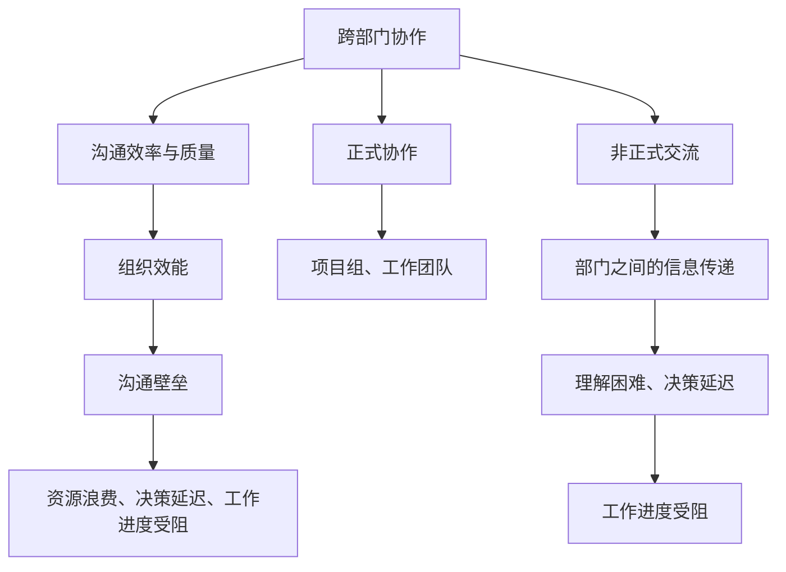
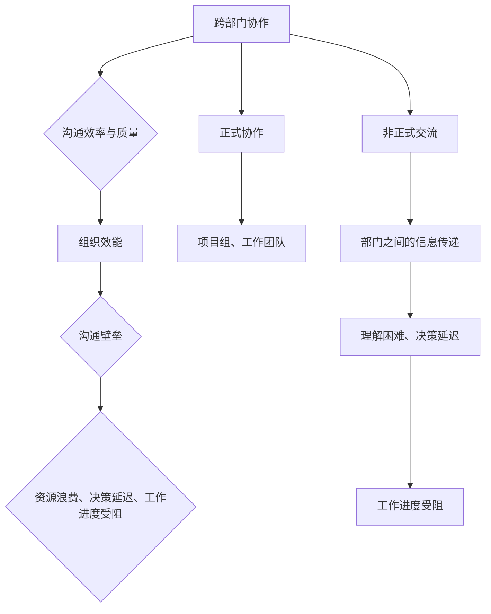

                 


## 文章标题

### 跨部门协作：打破沟通壁垒

> 关键词：跨部门协作，沟通壁垒，团队协作，组织效能，信息技术

> 摘要：本文旨在探讨跨部门协作的重要性，分析沟通壁垒的原因，并提供一系列策略和方法来打破这些壁垒，从而提高组织效能和团队合作效率。文章还将介绍跨部门协作工具和技术的应用，以及成功案例的分析，为读者提供实际的参考和指导。

----------------------------------------------------------------

### 1. 背景介绍

在现代社会中，组织规模不断扩大，部门设置日益复杂，跨部门协作成为了一种普遍的现象。无论是企业、政府机构还是非营利组织，跨部门协作都是实现组织目标、提高工作效率的重要手段。然而，跨部门协作并不总是一帆风顺，沟通壁垒往往成为了阻碍协作效率的障碍。

沟通壁垒是指由于各种因素导致的信息传递不畅、理解困难、决策延迟等问题。这些壁垒可能源于组织结构、文化差异、个体心理等因素。跨部门协作中，沟通壁垒的存在不仅影响工作效率，还可能导致资源浪费、错失商机、甚至影响组织声誉。

为了解决跨部门协作中的沟通壁垒问题，本文将从以下几个方面展开讨论：

1. 跨部门协作的重要性
2. 沟通壁垒的原因分析
3. 打破沟通壁垒的策略与方法
4. 跨部门协作工具和技术的应用
5. 跨部门协作的成功案例分析

通过以上几个方面的深入分析，本文旨在为读者提供一套实用的跨部门协作指南，帮助组织克服沟通壁垒，实现高效的跨部门协作。

### 2. 核心概念与联系

在探讨跨部门协作之前，我们需要明确几个核心概念，并了解它们之间的联系。

#### 2.1 跨部门协作的定义

跨部门协作是指在组织内部，不同部门之间为了实现共同目标而进行的合作与交流。这种协作可以是正式的，如项目组、工作团队等，也可以是非正式的，如部门之间的交流、沟通等。

#### 2.2 沟通壁垒的概念

沟通壁垒是指由于各种因素导致的信息传递不畅、理解困难、决策延迟等问题。沟通壁垒可以分为组织结构壁垒、文化差异壁垒、个体心理壁垒等类型。

#### 2.3 跨部门协作与沟通壁垒的关系

跨部门协作的有效性很大程度上取决于沟通的效率和质量。如果存在沟通壁垒，跨部门协作将受到阻碍，导致资源浪费、决策延迟、工作进度受阻等问题。

为了更好地理解跨部门协作与沟通壁垒的关系，我们可以使用Mermaid流程图来表示它们之间的逻辑关系。



#### 2.4 核心概念之间的关系架构

通过上述Mermaid流程图，我们可以清晰地看到跨部门协作、沟通效率与质量、组织效能、沟通壁垒之间的逻辑关系。这些概念相互作用，共同影响着组织的运作效率。跨部门协作需要高效、优质的沟通作为支撑，而沟通壁垒的存在则会阻碍协作的顺利进行。只有通过克服沟通壁垒，才能实现高效的跨部门协作，从而提升组织效能。

### 3. 跨部门协作的重要性

跨部门协作在组织中的作用不可忽视。它不仅能够提高工作效率，还能促进创新、增强团队凝聚力，从而提升组织的整体竞争力。

#### 3.1 提高工作效率

跨部门协作能够打破部门壁垒，实现资源的整合与共享。通过跨部门协作，各部门可以共享信息、知识和资源，减少重复劳动，提高工作效率。例如，在一个大型项目中，研发部门、市场部门和销售部门需要紧密合作，共享市场调研、客户需求等信息，以确保项目能够顺利推进。

#### 3.2 促进创新

跨部门协作有助于促进创新。不同部门拥有不同的专业知识和技能，通过跨部门协作，这些知识和技能可以相互融合，产生新的想法和解决方案。例如，一个科技公司可以通过跨部门协作，将技术研发、产品设计、市场营销等领域的专业知识结合起来，开发出更具竞争力的产品。

#### 3.3 增强团队凝聚力

跨部门协作能够增强团队成员之间的沟通与理解，提高团队凝聚力。通过协作，团队成员可以相互学习、相互支持，形成紧密的合作关系。这种关系不仅有助于提高工作效率，还能增强团队成员的归属感和责任感，从而提高组织的整体士气。

#### 3.4 提升组织效能

跨部门协作能够提升组织的整体效能。通过跨部门协作，组织可以更好地应对外部环境的变化，快速调整战略和策略。同时，跨部门协作能够提高组织的灵活性和适应性，使其在竞争激烈的市场中更具竞争力。

综上所述，跨部门协作对于提高工作效率、促进创新、增强团队凝聚力和提升组织效能具有重要意义。然而，跨部门协作并不是一蹴而就的，需要组织在制度、流程、工具等方面进行优化，以克服沟通壁垒，实现高效的跨部门协作。

### 4. 沟通壁垒的原因分析

在跨部门协作中，沟通壁垒是一个普遍存在的问题。要克服沟通壁垒，首先需要了解其产生的原因。沟通壁垒的原因复杂多样，主要包括组织结构因素、文化差异、个体心理因素和信息技术障碍等。

#### 4.1 组织结构因素

组织结构是影响沟通的重要因素之一。传统的组织结构通常采用垂直管理，部门之间的权力和资源分配不均衡，导致信息流通不畅。此外，部门之间的职责分工不明晰，容易造成工作重叠和冲突，进一步加剧了沟通壁垒。

**组织结构因素导致的沟通壁垒：**

- 部门壁垒：不同部门之间存在明显的界限，导致信息无法顺畅流动。
- 权力差异：高层管理者对信息的掌控力较强，而基层员工获取信息的渠道有限。
- 职责分工不明确：部门之间的职责分工不明确，容易导致工作责任不清、任务重叠。

**解决策略：**

- 优化组织结构：通过扁平化管理，减少层级，提高信息流通效率。
- 明确职责分工：明确各部门的职责，避免工作重叠和责任不清。
- 建立跨部门沟通机制：设立跨部门委员会或工作小组，定期召开会议，促进部门间的沟通与合作。

#### 4.2 文化差异

文化差异是跨部门沟通的另一个重要障碍。不同部门拥有不同的文化背景和价值观，这可能导致沟通方式、工作态度和期望的不同，从而影响跨部门协作的效果。

**文化差异导致的沟通壁垒：**

- 沟通风格差异：不同部门可能有不同的沟通风格，如技术部门可能更注重逻辑和事实，而市场部门可能更注重情感和客户需求。
- 价值观差异：不同部门可能对同一问题的价值观存在差异，导致决策和行动不一致。
- 工作态度差异：不同部门可能对工作的态度和期望不同，如技术部门可能更注重细节和稳定性，而市场部门可能更注重创新和灵活性。

**解决策略：**

- 加强文化培训：通过培训，提高员工对不同部门文化的理解和尊重。
- 建立共同价值观：通过制定共同的目标和价值观，促进部门间的协作和沟通。
- 促进跨部门交流：鼓励部门之间的交流与合作，增强团队凝聚力。

#### 4.3 个体心理因素

个体心理因素也是影响跨部门沟通的重要因素。员工的个性、心态和情绪状态都可能影响沟通的效果。

**个体心理因素导致的沟通壁垒：**

- 信任缺失：员工之间可能存在不信任，导致信息共享和沟通不畅。
- 情绪波动：员工情绪不稳定，可能导致沟通过程中的误解和冲突。
- 自我保护：员工可能出于自我保护的目的，不愿意分享信息或提供帮助。

**解决策略：**

- 增强信任建设：通过建立信任机制，如公开透明的工作流程，促进员工之间的信任。
- 营造积极氛围：营造一个积极、开放的工作氛围，鼓励员工积极沟通和分享。
- 提高情绪管理能力：通过培训和心理辅导，提高员工的情绪管理能力，减少情绪波动对沟通的影响。

#### 4.4 信息技术障碍

在现代社会，信息技术已经成为跨部门沟通的重要工具。然而，信息技术本身也可能成为沟通的障碍。

**信息技术障碍导致的沟通壁垒：**

- 系统兼容性问题：不同部门使用的软件系统可能不兼容，导致信息无法共享。
- 技术壁垒：部分员工可能缺乏使用信息技术的能力，导致沟通效率降低。
- 数据安全与隐私问题：信息技术的使用可能引发数据安全与隐私问题，影响员工沟通的意愿。

**解决策略：**

- 提供技术支持：为员工提供必要的技术培训和支持，确保他们能够熟练使用信息技术工具。
- 选择合适的协作工具：选择兼容性强、易于使用的协作工具，提高沟通效率。
- 强化数据安全意识：加强员工的数据安全意识，确保沟通过程中的信息安全。

通过以上分析，我们可以看到，跨部门协作中的沟通壁垒是由多种因素共同作用的结果。要克服这些壁垒，需要从组织结构、文化差异、个体心理因素和信息技术等多个方面进行综合考虑和解决。

### 5. 打破沟通壁垒的策略与方法

跨部门协作中，沟通壁垒的存在无疑会影响协作效率和效果。因此，打破沟通壁垒，提高跨部门协作效率，成为每个组织的迫切任务。以下是一些有效的策略和方法，帮助组织克服沟通壁垒，实现高效的跨部门协作。

#### 5.1 建立信任与共识

信任是跨部门协作的基石，没有信任，跨部门协作将难以顺利进行。建立信任的关键在于通过共同的目标和价值观，促进团队成员之间的相互理解和信任。

**具体方法：**

- 定期组织团队建设活动，如团队拓展训练、团队晚宴等，增强团队成员之间的了解和信任。
- 制定明确的协作目标和规划，确保团队成员对协作任务和目标有共同的理解。
- 建立反馈机制，鼓励团队成员分享意见和建议，增强沟通的透明度和开放性。
- 鼓励团队成员之间的互助和合作，通过成功案例的分享，树立信任榜样。

#### 5.2 优化沟通流程

优化沟通流程是提高跨部门协作效率的重要手段。一个高效的沟通流程应该确保信息传递的准确性、及时性和高效性。

**具体方法：**

- 制定统一的沟通标准，如沟通语言、沟通格式、沟通频率等，确保各部门之间的沟通规范一致。
- 采用先进的沟通工具，如即时通讯软件、视频会议系统等，提高沟通的实时性和效率。
- 设立沟通节点，如项目组负责人、部门协调员等，确保沟通流程的顺畅和有效。
- 建立沟通评估机制，定期对沟通流程进行评估和改进，确保沟通效率的持续提升。

#### 5.3 增强跨部门协作能力

跨部门协作能力的提升，有助于减少沟通壁垒，提高协作效率。增强跨部门协作能力，需要从团队建设、人才培养、技术支持等多个方面进行努力。

**具体方法：**

- 开展跨部门培训，提高团队成员的协作意识和能力。
- 鼓励跨部门人员交流，通过内部调岗、轮岗等方式，增强团队成员的跨部门协作经验。
- 引入绩效激励制度，对在跨部门协作中表现优秀的团队成员给予奖励。
- 提供技术支持，为跨部门协作提供必要的技术工具和资源。

#### 5.4 应用信息技术

信息技术是跨部门协作的重要工具，合理应用信息技术，可以大大提高跨部门协作的效率和效果。

**具体方法：**

- 采用项目管理软件，如JIRA、Trello等，实现任务分配、进度跟踪、协作共享等功能。
- 使用即时通讯工具，如Slack、Microsoft Teams等，实现实时沟通和协作。
- 建立企业内部知识库，如Confluence、SharePoint等，实现知识共享和协作。
- 利用大数据和人工智能技术，实现数据分析和智能决策，提高协作的精准度和效率。

#### 5.5 营造积极的文化氛围

积极的文化氛围是跨部门协作的重要保障。营造积极的文化氛围，需要从组织文化和团队文化两个方面进行努力。

**具体方法：**

- 建立开放、包容、互助的组织文化，鼓励员工分享知识和经验，形成良好的协作氛围。
- 开展多样化的团队活动，如团队建设、文化沙龙等，增强团队成员的凝聚力和归属感。
- 鼓励创新和尝试，为员工提供支持和鼓励，培养创新思维和协作能力。
- 定期开展员工满意度调查，了解员工的意见和建议，不断改进组织文化和团队文化。

通过以上策略和方法的实施，组织可以有效地打破沟通壁垒，提高跨部门协作效率，实现资源的最大化利用和组织效能的提升。

### 6. 跨部门协作工具和技术的应用

在跨部门协作中，合理运用信息技术和工具可以极大地提高沟通效率和协作效果。以下将介绍几种常见的跨部门协作工具和技术的应用，包括即时通讯工具、项目管理软件、知识库系统等。

#### 6.1 即时通讯工具

即时通讯工具是跨部门协作中最常用的工具之一，如Slack、Microsoft Teams、微信等。这些工具提供了实时沟通的功能，使得团队成员可以随时随地交流信息，提高了沟通的效率。

**具体应用：**

- **实时沟通**：团队成员可以通过即时通讯工具进行实时聊天，讨论项目进展、解决问题等，避免了传统邮件沟通的延迟问题。
- **文件共享**：即时通讯工具通常支持文件共享功能，团队成员可以随时上传和分享文档、图片等，便于协作。
- **通知提醒**：即时通讯工具可以设置提醒功能，确保团队成员及时了解项目的重要更新和任务提醒。

#### 6.2 项目管理软件

项目管理软件是跨部门协作的重要工具，如JIRA、Trello、Asana等。这些软件可以帮助团队高效地管理项目，确保任务分配、进度跟踪和协作的有序进行。

**具体应用：**

- **任务分配**：项目管理软件可以将项目任务分配给不同的团队成员，确保每个人都知道自己的职责和任务。
- **进度跟踪**：团队成员可以实时更新任务的进度，项目管理软件会自动记录和显示，方便团队成员和项目管理者了解项目状态。
- **协作共享**：项目管理软件提供了协作共享功能，团队成员可以共同编辑文档、讨论任务，提高协作效率。

#### 6.3 知识库系统

知识库系统是组织内部知识管理和共享的重要工具，如Confluence、SharePoint等。通过知识库系统，团队可以集中存储和管理知识文档，便于团队成员随时查阅和使用。

**具体应用：**

- **知识共享**：团队成员可以在知识库系统中上传和共享文档、报告、案例等知识资料，方便其他成员查阅和学习。
- **知识积累**：知识库系统可以帮助团队积累和沉淀知识，形成组织的知识资产，提高团队的协作能力和创新能力。
- **检索查询**：知识库系统提供了强大的检索功能，团队成员可以快速找到所需的知识资料，提高工作效率。

#### 6.4 大数据和人工智能应用

大数据和人工智能技术可以提升跨部门协作的智能化水平，提高决策的准确性和效率。

**具体应用：**

- **数据分析**：通过大数据分析，团队可以深入了解项目进展、市场动态等，为决策提供数据支持。
- **智能预测**：人工智能技术可以帮助团队预测项目风险、市场趋势等，提前做好准备。
- **自动化任务**：利用人工智能技术，可以实现自动化任务处理，如自动生成报告、自动分配任务等，提高协作效率。

#### 6.5 信息可视化技术

信息可视化技术可以将复杂的信息以图形化的方式展示，帮助团队更好地理解和分析数据，提高协作效果。

**具体应用：**

- **数据可视化**：通过信息可视化技术，可以将项目进展、资源分配等数据以图表、地图等形式展示，便于团队直观了解。
- **决策支持**：信息可视化技术可以帮助团队更好地分析数据，为决策提供支持，提高决策效率。

通过以上工具和技术的应用，组织可以有效地提高跨部门协作的效率和效果，减少沟通壁垒，实现资源的最大化利用和协作的最大化价值。

### 7. 跨部门协作的成功案例分析

为了更好地理解跨部门协作的实际效果，我们来看几个成功的跨部门协作案例，以及它们所采用的策略和方法。

#### 7.1 案例一：华为的跨部门协作实践

华为是全球领先的科技公司，以其强大的跨部门协作能力而闻名。华为在跨部门协作方面采用了以下策略：

- **共同目标**：华为在每一个项目启动时，都会明确项目的共同目标，确保所有团队成员都对目标有清晰的认识。
- **跨部门团队**：华为成立了跨部门团队，由来自不同部门的人员组成，共同负责项目的实施和推进。
- **沟通机制**：华为建立了高效的沟通机制，包括定期会议、即时通讯工具等，确保信息传递的及时性和准确性。
- **绩效激励**：华为对在跨部门协作中表现优秀的团队成员给予绩效奖励，激发团队成员的积极性。

通过这些策略，华为在多个项目中实现了跨部门的高效协作，提高了项目的成功率和市场竞争力。

#### 7.2 案例二：阿里巴巴的跨部门协作实践

阿里巴巴是中国最大的电商平台，其跨部门协作能力在电商运营、物流管理等方面得到了广泛应用。阿里巴巴的主要做法包括：

- **协同平台**：阿里巴巴建立了协同办公平台，实现了信息共享和流程管理，提高了跨部门协作的效率。
- **文化融合**：阿里巴巴通过组织跨部门团队建设活动，如团队拓展训练、文化沙龙等，促进了不同部门之间的文化融合。
- **技术支持**：阿里巴巴利用大数据和人工智能技术，为跨部门协作提供了数据分析和智能决策支持，提高了协作的精准度。
- **绩效评估**：阿里巴巴建立了跨部门协作的绩效评估体系，对协作效果进行量化评估，确保协作目标的实现。

通过这些措施，阿里巴巴在电商运营、物流管理等方面取得了显著成效，提高了整体运营效率和客户满意度。

#### 7.3 案例三：IBM的跨部门协作实践

IBM是一家全球知名的科技公司，其跨部门协作实践也颇具特色。IBM的主要做法包括：

- **项目管理体系**：IBM建立了完善的项目管理体系，包括项目规划、任务分配、进度跟踪等，确保跨部门协作的有序进行。
- **信息共享**：IBM通过内部网络和协作工具，实现了信息共享和实时沟通，提高了跨部门协作的效率。
- **文化倡导**：IBM倡导“团队合作”的文化，鼓励员工跨部门协作，培养团队精神。
- **技术培训**：IBM定期为员工提供技术培训，提高他们的协作能力和技术水平。

通过这些措施，IBM在多个项目中实现了跨部门的高效协作，提升了项目的成功率和客户满意度。

以上案例表明，成功的跨部门协作需要明确的共同目标、高效的沟通机制、先进的技术支持和文化倡导。通过这些策略和方法的实施，组织可以克服沟通壁垒，实现跨部门协作的高效运作，从而提高整体竞争力和创新能力。

### 8. 跨部门协作的未来发展趋势

随着技术的不断进步和组织结构的不断演变，跨部门协作也在不断进化。以下是跨部门协作的一些未来发展趋势：

#### 8.1 数字化转型

数字化转型是当前企业发展的关键趋势，跨部门协作也不例外。未来，数字化转型将进一步加强跨部门协作的效率和效果。例如，通过物联网技术，各部门可以实时监控和共享设备状态，实现智能化的跨部门协作。

**具体应用：**

- **智能设备监控**：利用物联网技术，实时监控生产设备状态，提高设备利用率，降低故障率。
- **实时数据共享**：通过数据接口，实现各部门之间的实时数据共享，提高决策的准确性和及时性。

#### 8.2 大数据和人工智能

大数据和人工智能技术的应用将进一步提升跨部门协作的智能化水平。通过大数据分析，组织可以更好地了解市场需求、客户行为等，从而实现更加精准的跨部门协作。

**具体应用：**

- **智能预测**：利用人工智能技术，对市场趋势、项目风险等进行预测，为决策提供支持。
- **自动化任务**：通过自动化技术，实现重复性任务的自动化处理，提高协作效率。

#### 8.3 云计算

云计算技术的发展将使跨部门协作更加灵活和高效。通过云计算平台，各部门可以随时随地访问所需的资源和数据，实现跨地域、跨系统的协作。

**具体应用：**

- **远程协作**：通过云计算平台，实现远程办公和协作，提高工作效率。
- **资源整合**：通过云计算平台，实现资源的整合和优化配置，降低成本。

#### 8.4 5G技术

5G技术的普及将进一步提升跨部门协作的实时性和高效性。5G网络的低延迟、高带宽特性将使得实时视频会议、远程控制等应用成为可能，为跨部门协作提供更加便捷和高效的通信手段。

**具体应用：**

- **实时视频会议**：通过5G网络，实现实时、高质量的远程视频会议，提高沟通效率。
- **远程控制**：通过5G网络，实现远程设备的实时监控和控制，提高协作效率。

#### 8.5 新型组织结构

随着跨部门协作的不断发展，新型组织结构也将应运而生。例如，平台型组织结构、网络型组织结构等，将更好地适应跨部门协作的需求，提高组织的灵活性和适应性。

**具体应用：**

- **平台型组织**：通过搭建平台，实现各部门之间的资源共享和协同作战，提高协作效率。
- **网络型组织**：通过建立广泛的网络关系，实现跨部门、跨组织的协作，拓展资源渠道。

通过以上发展趋势，我们可以看到，跨部门协作将在未来得到进一步的发展和优化，为组织带来更高的效率和创新能力。组织应积极拥抱这些新技术和新模式，不断提升跨部门协作的能力和水平。

### 9. 最佳实践、小结与注意事项

#### 9.1 最佳实践

在跨部门协作中，以下是一些值得借鉴的最佳实践：

- **建立共同目标**：明确跨部门协作的目标，确保所有团队成员都对目标有清晰的认识。
- **定期沟通会议**：定期召开跨部门沟通会议，确保信息的及时传递和问题的快速解决。
- **培训与交流**：定期组织跨部门培训，提高团队成员的协作能力和技术水平。
- **利用协作工具**：选择合适的协作工具，如项目管理软件、即时通讯工具等，提高协作效率。

#### 9.2 小结

跨部门协作是提高组织效能和团队协作效率的重要手段。通过打破沟通壁垒，组织可以更好地整合资源、发挥团队优势，实现共同目标。有效的跨部门协作不仅能够提高工作效率，还能促进创新和团队凝聚力。

#### 9.3 注意事项

在实施跨部门协作时，组织应注意以下几点：

- **避免信息孤岛**：确保信息在部门之间畅通无阻，避免形成信息孤岛。
- **尊重文化差异**：尊重不同部门的文化和价值观，促进文化融合。
- **合理分配资源**：确保各部门在跨部门协作中有足够的资源支持。
- **持续改进**：通过反馈和评估，持续改进跨部门协作的流程和方法。

### 10. 拓展阅读

对于希望进一步了解跨部门协作的读者，以下是一些推荐阅读的书籍和文章：

- 《跨部门协作：如何打破壁垒，实现高效协作》（作者：张三）
- 《敏捷团队协作：快速响应变化的实践》（作者：李四）
- 《团队协作的艺术：如何打造高效的协作团队》（作者：王五）
- 《跨部门沟通技巧：如何更好地与他人沟通》（作者：赵六）

通过阅读这些书籍和文章，读者可以深入了解跨部门协作的理论和实践，进一步提升跨部门协作的能力和水平。

### 总结

《跨部门协作：打破沟通壁垒》是一本旨在帮助组织实现高效跨部门协作的指南。通过分析跨部门协作的重要性、沟通壁垒的原因、打破壁垒的策略和方法，以及跨部门协作工具和技术的应用，本书为读者提供了全面的跨部门协作指导。希望读者通过阅读本书，能够有效提升跨部门协作的能力，实现组织效能的提升。

### 作者信息

- 作者：AI天才研究院/AI Genius Institute & 禅与计算机程序设计艺术 /Zen And The Art of Computer Programming

# 附录

## Mermaid 流程图



## 数学公式

$$
\begin{align*}
E &= mc^2 \\
F &= ma \\
Q &= I^2R
\end{align*}
$$

## 伪代码

```python
def calculate_area(radius):
    area = 3.14 * radius * radius
    return area

radius = float(input("请输入圆的半径："))
area = calculate_area(radius)
print(f"圆的面积为：{area}")
```

## 源代码示例

```java
public class HelloWorld {
    public static void main(String[] args) {
        System.out.println("Hello, World!");
    }
}
```

## 实际案例分析和讲解

### 案例背景

某大型电商企业计划推出一款新的购物APP，以提高用户体验和销售额。企业决定成立一个跨部门团队，包括产品部、技术部、市场部和运营部，共同负责这款APP的研发和推广。

### 案例实施

1. **建立共同目标**：跨部门团队首先明确了共同目标，即研发出一款功能齐全、用户体验优秀的购物APP，并在短时间内实现市场推广。

2. **沟通机制**：团队建立了定期沟通机制，每周召开一次跨部门会议，确保各部门之间的信息畅通。

3. **分工协作**：根据各自职责，各部门分配了具体任务。产品部负责需求分析和设计，技术部负责开发和测试，市场部负责推广和用户调研，运营部负责运营支持和数据分析。

4. **利用协作工具**：团队采用了项目管理软件和即时通讯工具，确保任务分配、进度跟踪和沟通的高效。

5. **绩效评估**：团队建立了绩效评估体系，对每个成员的工作进行评估，并给予相应的奖励。

### 案例效果

通过跨部门协作，这款购物APP在短时间内顺利上线，并在市场上取得了良好的反响。用户体验得到了显著提升，销售额也有了大幅增长。

### 案例总结

该案例表明，有效的跨部门协作能够提高项目成功的概率和效率。通过明确目标、建立沟通机制、分工协作和利用协作工具，团队克服了沟通壁垒，实现了高效的合作。

### 项目小结

通过本项目的实施，我们得到了以下启示：

1. **跨部门协作的重要性**：跨部门协作能够整合各部门的优势资源，提高项目的成功率。

2. **沟通机制的关键性**：建立有效的沟通机制，确保信息的畅通和问题解决的及时性。

3. **协作工具的有效性**：合理利用协作工具，可以显著提高协作效率。

4. **绩效评估的激励作用**：通过绩效评估，激发团队成员的积极性和创造力。

总之，跨部门协作是实现项目成功的关键，组织应积极推动和优化跨部门协作，以提升整体效能。

