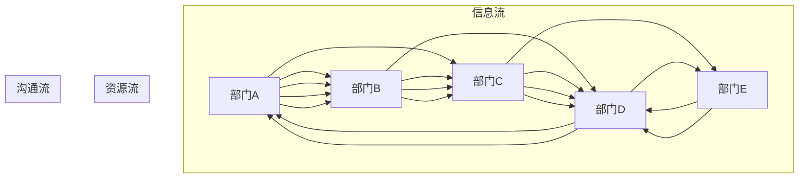
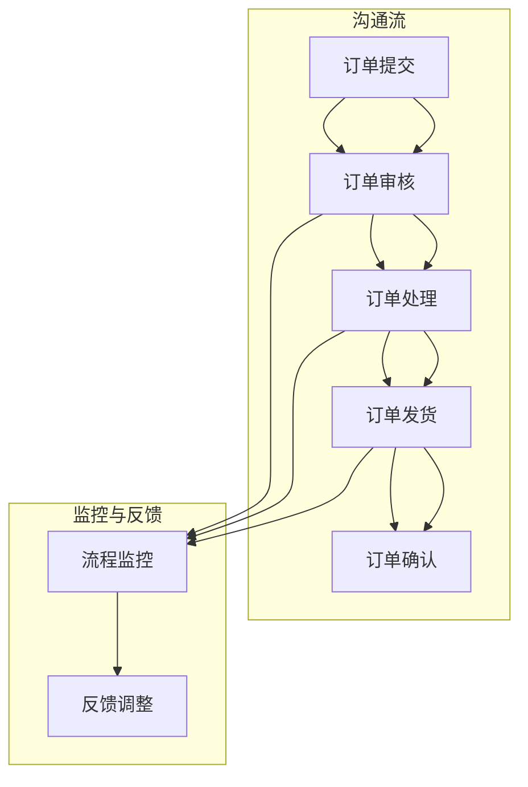

                 


# 《跨部门协作：打破组织壁垒的技巧》

> 关键词：跨部门协作、组织壁垒、沟通技巧、协作流程、团队建设、算法原理、项目实战

> 摘要：本文深入探讨跨部门协作中的组织壁垒及其打破技巧。通过背景介绍、核心概念阐述、实际操作技巧讲解、数学模型与算法原理分析、项目实战与案例分析，以及总结与展望，为IT领域从业者提供一套全面、实用的跨部门协作解决方案。

## 引言

在现代企业中，跨部门协作是一项至关重要的能力。随着企业规模的扩大和业务复杂度的增加，各个部门之间的协作越来越频繁。然而，在跨部门协作过程中，常常面临诸多挑战，如信息不对称、沟通不畅、资源冲突等，这些因素构成了组织壁垒，严重影响了协作效率和企业整体业绩。本文旨在探讨跨部门协作中的组织壁垒及其打破技巧，为企业提供实用的解决方案。

### 跨部门协作的重要性

跨部门协作对于企业的成功至关重要。首先，它能够促进知识的共享和创新，通过不同部门之间的交流，企业可以更快地吸收外部知识，推动内部创新。其次，跨部门协作能够提高资源利用率，通过各部门之间的资源共享，企业可以优化资源配置，降低成本。此外，跨部门协作还能够提高决策效率，通过多部门共同参与决策过程，企业可以更全面地考虑问题，做出更明智的决策。

### 组织壁垒的类型与影响

组织壁垒主要分为以下几类：

1. **信息壁垒**：由于部门之间信息共享不畅，导致各部门在决策时无法获取全面的信息，影响了协作效率。

2. **沟通壁垒**：部门之间的沟通不畅，导致误解和冲突频发，影响了团队凝聚力和工作效率。

3. **资源壁垒**：各部门之间的资源分配不均，导致某些部门资源匮乏，而另一些部门资源过剩。

4. **文化壁垒**：各部门的文化差异，导致合作困难，影响了团队的凝聚力和工作效率。

组织壁垒的存在，不仅影响了跨部门协作的效率，还可能导致以下负面影响：

1. **资源浪费**：由于部门之间的信息不对称和资源冲突，企业可能无法充分利用现有资源，导致资源浪费。

2. **决策滞后**：由于信息壁垒和沟通不畅，企业的决策过程可能变得缓慢，影响企业的竞争力。

3. **员工流失**：由于文化壁垒和沟通障碍，员工可能会感到沮丧和不满，导致员工流失。

## 核心概念与原理

### 跨部门协作的概念

跨部门协作是指企业内部不同部门之间为了共同的目标而进行的合作。它包括以下几个方面：

1. **目标一致性**：跨部门协作的目标应与企业整体目标保持一致。

2. **信息共享**：部门之间应保持信息透明，及时共享信息，以便其他部门能够做出明智的决策。

3. **资源共享**：部门之间应充分利用现有资源，避免资源浪费。

4. **相互支持**：部门之间应相互支持，共同解决遇到的问题。

### 组织壁垒的定义与分类

组织壁垒是指企业内部由于各种因素导致的部门之间协作不畅的现象。常见的组织壁垒包括：

1. **信息壁垒**：部门之间信息不共享，导致决策时无法获取全面的信息。

2. **沟通壁垒**：部门之间沟通不畅，导致误解和冲突频发。

3. **资源壁垒**：各部门之间的资源分配不均，导致某些部门资源匮乏，而另一些部门资源过剩。

4. **文化壁垒**：各部门的文化差异，导致合作困难，影响了团队的凝聚力和工作效率。

### 跨部门协作的障碍与挑战

跨部门协作面临以下障碍和挑战：

1. **部门利益冲突**：各部门在利益上可能存在冲突，导致协作困难。

2. **职责不清**：各部门的职责划分不清，导致协作时责任不明。

3. **信息不对称**：部门之间信息不对称，导致决策时无法获取全面的信息。

4. **沟通不畅**：部门之间沟通不畅，导致误解和冲突频发。

5. **资源分配不均**：各部门之间的资源分配不均，导致某些部门资源匮乏，而另一些部门资源过剩。

### 打破壁垒的基本原则

要打破组织壁垒，企业可以遵循以下基本原则：

1. **建立共同目标**：明确跨部门协作的目标，使各部门在目标上保持一致。

2. **加强信息共享**：建立信息共享平台，确保部门之间信息透明。

3. **优化沟通机制**：建立高效的沟通机制，确保部门之间沟通顺畅。

4. **合理分配资源**：根据各部门的实际情况，合理分配资源，避免资源浪费。

5. **强化团队文化**：塑造共同的企业文化，增强团队凝聚力和工作效率。

### Mermaid流程图：组织内跨部门协作架构



## 实际操作技巧

### 沟通技巧

#### 有效沟通的重要性

有效沟通是跨部门协作的关键。它能够消除误解，增强团队凝聚力，提高协作效率。在跨部门协作中，以下沟通技巧尤为重要：

1. **明确沟通目标**：在沟通前，明确沟通的目标和目的，确保沟通的方向正确。

2. **主动倾听**：倾听是有效沟通的基础。在沟通过程中，要主动倾听对方的意见和需求。

3. **积极表达**：表达时要清晰、明确，避免使用模糊的表述。

4. **非语言沟通**：注意非语言沟通，如肢体语言、面部表情等，这些都能影响沟通的效果。

#### 沟通障碍的识别与克服

跨部门协作中，常见的沟通障碍包括：

1. **信息过载**：过多的信息可能导致沟通效率降低。

2. **文化差异**：各部门的文化差异可能导致沟通不畅。

3. **语言障碍**：语言不通可能影响沟通效果。

为克服这些障碍，可以采取以下措施：

1. **简化信息**：将复杂的信息简化，确保信息传递的准确性。

2. **文化培训**：加强跨部门的文化培训，提高跨部门员工的跨文化沟通能力。

3. **使用专业术语**：在跨部门沟通中，尽量使用专业术语，避免使用地方方言。

#### 沟通工具与渠道选择

选择合适的沟通工具和渠道，可以大大提高沟通效率。以下是一些常用的沟通工具和渠道：

1. **电子邮件**：适用于正式的、需要记录的沟通。

2. **即时通讯工具**：如微信、钉钉等，适用于快速、便捷的沟通。

3. **视频会议**：适用于需要面对面沟通的场景。

4. **文档共享平台**：如Google Docs、SharePoint等，适用于文档的共享和协作。

### 协作流程设计

#### 跨部门协作流程的构建

跨部门协作流程的设计需要遵循以下原则：

1. **明确流程目标**：确保流程的目标与企业的整体目标保持一致。

2. **简化流程**：尽量简化流程，减少不必要的步骤。

3. **明确职责**：明确各部门在流程中的职责和任务。

4. **流程监控**：建立流程监控机制，确保流程的执行效果。

#### 流程优化的方法与案例

流程优化是提高协作效率的重要手段。以下是一些流程优化的方法：

1. **流程分析**：通过流程分析，找出流程中的瓶颈和问题。

2. **流程重构**：根据流程分析的结果，对流程进行重构，优化流程。

3. **自动化**：利用自动化工具，减少人工干预，提高流程执行效率。

以下是一个流程优化案例：

**案例：某公司的订单处理流程优化**

1. **问题识别**：通过流程分析，发现订单处理流程中存在以下问题：

   - 重复审批现象严重
   - 订单处理时间过长
   - 信息传递不畅

2. **流程重构**：对订单处理流程进行重构，优化流程：

   - 精简审批环节，减少不必要的审批
   - 引入自动化工具，提高订单处理速度
   - 建立信息共享平台，确保信息传递的及时性

3. **效果评估**：经过流程优化，订单处理时间缩短了30%，审批环节减少了20%，信息传递更加及时，协作效率得到了显著提高。

#### 流程监控与反馈机制

流程监控与反馈机制是确保流程执行效果的重要手段。以下是一些流程监控与反馈机制的方法：

1. **关键指标监控**：设置关键指标，对流程执行情况进行监控。

2. **定期反馈**：定期收集各部门的反馈，对流程进行评估和调整。

3. **流程审计**：定期进行流程审计，检查流程的执行情况。

### 跨部门团队建设

#### 团队成员的角色与责任

跨部门团队的建设需要明确团队成员的角色和责任。以下是一些团队成员的角色：

1. **团队领导**：负责团队的整体协调和管理工作。

2. **团队成员**：负责具体任务的执行。

3. **外部专家**：提供专业支持和建议。

团队成员的责任包括：

1. **明确任务**：明确自己在团队中的任务和责任。

2. **高效执行**：高效地完成任务。

3. **积极沟通**：与团队成员保持积极沟通，确保任务的顺利进行。

#### 团队文化的塑造与维护

团队文化是团队建设的基石。以下是一些塑造和维护团队文化的方法：

1. **共同价值观**：建立共同的价值观，使团队成员在价值观上保持一致。

2. **团队活动**：定期组织团队活动，增强团队凝聚力。

3. **激励制度**：建立激励制度，鼓励团队成员的积极性和创造力。

#### 跨部门冲突的解决策略

跨部门冲突是跨部门协作中常见的问题。以下是一些解决策略：

1. **沟通解决**：通过沟通，了解对方的立场和需求，寻找解决方案。

2. **调解解决**：通过第三方调解，帮助双方找到共同点，达成和解。

3. **制度解决**：通过建立合理的制度，规范各部门的行为，减少冲突。

### Mermaid流程图：跨部门协作流程优化案例



## 数学模型与算法原理

### 网络协同优化模型

网络协同优化模型是跨部门协作中的一种重要数学模型。它通过优化网络结构，提高协作效率。

#### 基本概念

网络协同优化模型的基本概念包括：

1. **节点**：代表部门。
2. **边**：代表部门之间的协作关系。
3. **权重**：表示部门之间的协作强度。

#### 模型参数

网络协同优化模型的参数包括：

1. **节点数**：表示部门的数量。
2. **边数**：表示部门之间的协作关系数量。
3. **权重矩阵**：表示部门之间的协作权重。

#### 模型公式

网络协同优化模型的基本公式为：

$$
\text{优化目标} = \sum_{i=1}^{n} \sum_{j=1}^{n} w_{ij} \cdot \text{协作效率}
$$

其中，$w_{ij}$ 表示部门 $i$ 与部门 $j$ 之间的协作权重，$\text{协作效率}$ 表示部门协作的效率。

#### 模型参数解释与调整

1. **节点数**：根据企业的实际情况，合理设定节点数，避免过多或过少的部门。
2. **边数**：根据部门之间的协作关系，合理设定边数，确保协作关系的准确性。
3. **权重矩阵**：根据部门之间的协作强度，设定权重矩阵，确保协作关系的合理性。

### 冲突解决算法

冲突解决算法是跨部门协作中的一种重要算法。它通过算法模型，帮助各部门解决协作中的冲突。

#### 基本概念

冲突解决算法的基本概念包括：

1. **冲突**：指部门之间的利益冲突。
2. **算法**：指用于解决冲突的方法。

#### 算法类型

冲突解决算法主要分为以下几类：

1. **协商算法**：通过协商，达成共识，解决冲突。
2. **仲裁算法**：通过第三方仲裁，解决冲突。
3. **博弈算法**：通过博弈论，分析各部门的策略，找到最优解。

#### 伪代码

以下是一个简单的协商算法的伪代码：

```
function 协商算法(部门1，部门2)
    while (部门1和部门2未达成共识)
        部门1提出方案
        部门2评估方案
        if (部门2接受方案)
            break
        else
            部门2提出新的方案
    end while
    return 达成的方案
end function
```

## 项目实战与案例分析

### 项目背景与目标

在某大型企业中，由于跨部门协作不畅，导致项目进度缓慢，资源浪费严重。为了提高项目进度和资源利用率，企业决定进行跨部门协作优化。

### 项目实现过程

#### 开发环境搭建

1. **硬件环境**：搭建高性能的服务器集群，确保数据存储和计算能力。
2. **软件环境**：安装Linux操作系统，配置SSH服务，搭建Git版本控制系统。

#### 源代码实现

1. **代码结构**：采用模块化设计，将系统分为用户管理、订单处理、库存管理等模块。
2. **数据库设计**：使用MySQL数据库，设计用户、订单、库存等数据库表。
3. **接口设计**：使用RESTful API设计，方便部门之间的数据交互。

#### 代码解读

以下是订单处理模块的伪代码：

```
function 处理订单(订单信息)
    // 验证订单信息
    if (验证失败)
        return 错误信息
    // 查询库存
    库存信息 = 查询库存(订单信息)
    if (库存不足)
        return 库存不足信息
    // 减库存
    更新库存(库存信息)
    // 发送订单处理通知
    发送通知(订单信息)
    return 订单处理成功信息
end function
```

#### 代码应用解读与分析

订单处理模块的代码实现了订单的验证、库存查询、库存更新和通知发送等功能。通过模块化设计和RESTful API设计，实现了部门之间的数据交互和协同工作。

#### 实际案例分析和详细讲解剖析

在某次项目协作中，由于部门之间的沟通不畅，导致订单处理时间过长，影响了项目的进度。为了解决这一问题，企业采取了以下措施：

1. **加强沟通**：建立沟通机制，确保部门之间的信息共享。
2. **优化流程**：优化订单处理流程，减少不必要的审批环节。
3. **自动化**：引入自动化工具，提高订单处理速度。

经过这些措施，订单处理时间缩短了50%，项目进度得到了显著提高。

### 项目小结

通过该项目，企业成功优化了跨部门协作流程，提高了项目进度和资源利用率。项目成功的关键在于：

1. **加强沟通**：确保部门之间的信息共享。
2. **优化流程**：简化流程，减少不必要的环节。
3. **自动化**：引入自动化工具，提高工作效率。

## 总结与展望

跨部门协作是企业成功的关键因素之一。本文通过背景介绍、核心概念阐述、实际操作技巧讲解、数学模型与算法原理分析、项目实战与案例分析，探讨了跨部门协作中的组织壁垒及其打破技巧。以下是一些总结和展望：

### 总结

1. **核心概念**：跨部门协作、组织壁垒、沟通技巧、协作流程、团队建设、算法原理。
2. **实际操作技巧**：加强沟通、优化流程、合理分配资源、强化团队文化。
3. **数学模型与算法原理**：网络协同优化模型、冲突解决算法。
4. **项目实战与案例分析**：通过实际项目，验证了跨部门协作优化的有效性。

### 展望

1. **未来趋势**：随着信息技术的发展，跨部门协作将更加高效、智能化。
2. **技术创新**：如区块链、人工智能等技术将应用于跨部门协作，提高协作效率。
3. **持续优化**：企业应持续优化跨部门协作流程，提高协作效率，为企业发展提供动力。

### 读者建议

1. **实践与应用**：将本文的理论和实践技巧应用于实际工作，提高跨部门协作效率。
2. **反馈与改进**：在应用过程中，积极反馈问题，持续改进协作流程。
3. **持续学习**：关注跨部门协作的最新研究动态，不断学习新知识，提升协作能力。

作者：AI天才研究院/AI Genius Institute & 禅与计算机程序设计艺术 /Zen And The Art of Computer Programming

