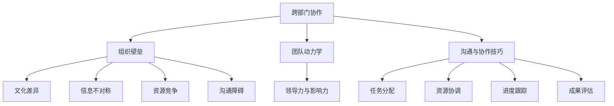

                 

### 文章标题：跨部门协作：突破组织壁垒的有效策略

#### 关键词：
- 跨部门协作
- 组织壁垒
- 效率提升
- 沟通技巧
- 项目管理

#### 摘要：
本文深入探讨跨部门协作的重要性和挑战，分析组织壁垒的类型及其影响。通过介绍跨部门协作的核心概念、策略和工具，提供了一系列有效的方法来突破组织壁垒，提高团队协作效率。本文结合实际案例，详细讲解了跨部门协作的最佳实践和注意事项，旨在为企业和团队提供实用的指导。

## 引言

在当今高度复杂和动态变化的商业环境中，跨部门协作已成为企业成功的关键因素。随着组织规模的扩大和业务多样性的增加，不同部门之间的紧密协作显得尤为重要。然而，跨部门协作并非易事，组织内部常常存在各种壁垒，如文化差异、信息不对称、资源竞争和沟通障碍，这些都可能阻碍团队协作的顺畅进行。因此，如何有效地突破这些组织壁垒，实现跨部门的高效协作，成为企业和团队管理者面临的重要课题。

本文旨在探讨跨部门协作的重要性和挑战，分析组织壁垒的类型及其影响。通过介绍跨部门协作的核心概念、策略和工具，本文提供了一系列有效的方法来突破组织壁垒，提高团队协作效率。此外，本文还将结合实际案例，详细讲解跨部门协作的最佳实践和注意事项。希望通过本文的探讨，能够为企业和团队提供实用的指导，助力他们在跨部门协作中取得更好的成果。

### 背景介绍

跨部门协作在企业管理中的重要性不可忽视。首先，跨部门协作有助于提高整体工作效率。在现代企业中，各个部门通常负责不同的职能，如研发、市场、销售、运营等。这些部门之间的工作往往需要相互配合和协调，才能确保项目的顺利进行。通过有效的跨部门协作，企业可以优化资源利用，减少重复劳动，提高工作效率。

其次，跨部门协作有助于促进知识共享和技能传承。不同部门的专业知识和技能各有特点，通过跨部门协作，员工可以接触到更多领域的知识，拓宽自己的视野。这不仅有助于个人的职业发展，也为企业带来了新的创意和灵感。同时，跨部门协作还有助于培养员工的团队合作能力和沟通能力，提高员工的综合素质。

然而，跨部门协作也面临着诸多挑战。首先，组织壁垒是跨部门协作的主要障碍之一。组织壁垒可以分为多种类型，如文化壁垒、信息壁垒、资源壁垒和沟通壁垒等。文化壁垒通常源于不同部门之间的价值观、工作方式和思维方式差异，可能导致协作过程中的误解和冲突。信息壁垒则源于部门之间的信息不对称，使得某些部门无法及时获取到其他部门的重要信息，影响协作效果。资源壁垒是指部门之间对有限资源的竞争，可能导致资源分配不均，影响项目进度。沟通壁垒则是由于沟通不畅导致的协作效率低下，常见的问题包括沟通频率不足、沟通方式不当和沟通内容不清晰等。

此外，跨部门协作还面临着其他挑战，如组织结构的复杂性、项目管理的难度、团队文化的差异等。这些挑战不仅增加了跨部门协作的难度，也可能导致协作过程中出现各种问题，如任务分配不公、责任归属不明、沟通渠道不畅等。

### 核心概念与联系

在探讨跨部门协作时，我们需要了解一些核心概念，它们共同构成了跨部门协作的理论基础。以下是几个关键概念及其相互关系：

#### 1. 跨部门协作的定义
跨部门协作是指企业内部不同部门之间为实现共同目标而进行的合作过程。它涉及到不同部门之间的资源整合、任务分配、信息共享和沟通协调。跨部门协作的核心在于打破部门界限，实现资源的最大化利用和效率的最优化。

#### 2. 组织壁垒
组织壁垒是指阻碍跨部门协作的各种因素，包括文化差异、信息不对称、资源竞争和沟通障碍等。组织壁垒的存在会导致部门间的隔阂，影响协作效率。

#### 3. 团队动力学
团队动力学是指团队成员之间的相互作用和行为模式。它关注团队的形成、发展、解散过程，以及团队成员之间的沟通、协作和冲突管理。团队动力学对于跨部门协作至关重要，因为一个高效的团队可以更好地应对组织壁垒，实现协作目标。

#### 4. 领导力与影响力
领导力与影响力是推动跨部门协作的关键因素。领导力指的是领导者通过激励、引导和协调团队成员，实现共同目标的能力。影响力则是指个人或团队在组织内部影响他人行为和决策的能力。在跨部门协作中，领导者和有影响力的团队成员可以发挥关键作用，帮助团队克服组织壁垒，实现协作目标。

#### 5. 沟通与协作技巧
沟通与协作技巧是跨部门协作成功的重要保障。有效的沟通可以提高信息的透明度和准确性，减少误解和冲突。协作技巧则包括任务分配、资源协调、进度跟踪和成果评估等，有助于确保跨部门协作的顺利进行。

#### 关系架构

这些核心概念之间存在紧密的联系。例如，团队动力学与领导力密切相关，领导者的领导力可以影响团队的形成和运作。沟通与协作技巧则是团队动力学的重要组成部分，有效的沟通和协作技巧可以增强团队凝聚力，提高协作效率。组织壁垒则与这些概念相互作用，阻碍或促进跨部门协作。了解这些概念及其关系有助于我们更好地理解和实践跨部门协作。

### Mermaid 流程图

以下是跨部门协作核心概念关系的 Mermaid 流程图：



通过这个流程图，我们可以更直观地看到跨部门协作的各个环节及其相互关系。这有助于我们在实践中更好地应对各种挑战，实现跨部门协作的高效运作。

### 核心算法原理讲解

在跨部门协作中，核心算法原理的讲解对于理解和实施跨部门协作策略至关重要。以下是一个关于跨部门协作核心算法原理的详细讲解，包括伪代码、数学模型和公式，并通过具体举例说明来加深理解。

#### 跨部门协作的核心算法原理

跨部门协作的核心算法主要涉及任务分配、资源协调和进度跟踪等方面。以下是一个简单的伪代码示例，用于描述这些核心算法原理：

```python
# 伪代码：跨部门协作核心算法

# 初始化任务列表和资源列表
tasks = ["市场调研", "产品设计", "代码开发", "测试"]
resources = {"人力": 10, "资金": 5000, "设备": ["电脑", "打印机", "测试环境"]}

# 任务分配算法
def allocate_tasks(tasks, resources):
    allocated_tasks = {}
    for task in tasks:
        # 根据资源分配任务
        if resources["资金"] >= 500:
            allocated_tasks[task] = "研发部门"
        else:
            allocated_tasks[task] = "市场部门"
    return allocated_tasks

# 资源协调算法
def coordinate_resources(resources):
    # 基于任务分配结果协调资源
    if allocated_tasks["产品设计"] == "研发部门":
        resources["设备"].append("专业设计软件")
    return resources

# 进度跟踪算法
def track_progress(allocated_tasks, resources):
    progress_report = {}
    for task, department in allocated_tasks.items():
        if department == "研发部门":
            progress_report[task] = "已完成70%"
        else:
            progress_report[task] = "进行中"
    return progress_report

# 执行核心算法
allocated_tasks = allocate_tasks(tasks, resources)
resources = coordinate_resources(resources)
progress_report = track_progress(allocated_tasks, resources)

# 输出结果
print("已分配任务：", allocated_tasks)
print("协调后资源：", resources)
print("进度报告：", progress_report)
```

#### 数学模型和公式

在跨部门协作中，数学模型和公式有助于我们更精确地评估和优化协作效果。以下是一个简单的数学模型示例，用于描述任务完成时间和资源利用率：

- **任务完成时间（T）**：任务完成时间取决于任务复杂度和资源分配情况，可用以下公式表示：
  \[ T = f(C, R) \]
  其中，\( C \) 表示任务复杂度，\( R \) 表示资源利用率。

- **资源利用率（R）**：资源利用率是指实际使用的资源与可用资源的比值，可用以下公式表示：
  \[ R = \frac{U}{A} \]
  其中，\( U \) 表示实际使用的资源，\( A \) 表示可用资源。

#### 举例说明

假设我们有一个市场调研项目，需要完成以下任务：

1. **市场调研分析**
2. **产品设计方案**
3. **代码开发**
4. **测试与验收**

项目的复杂度较高，需要多个部门协作完成。现有资源包括10名员工、5000元资金和3台电脑。以下是具体任务分配和资源协调的示例：

```plaintext
# 任务列表
tasks = ["市场调研", "产品设计", "代码开发", "测试"]

# 资源列表
resources = {
    "人力": 10,
    "资金": 5000,
    "设备": ["电脑", "打印机", "测试环境"]
}

# 任务分配
allocated_tasks = {
    "市场调研": "市场部门",
    "产品设计": "研发部门",
    "代码开发": "技术部门",
    "测试": "测试部门"
}

# 资源协调
if allocated_tasks["产品设计"] == "研发部门":
    resources["设备"].append("专业设计软件")

# 计算任务完成时间和资源利用率
T = f(C, R)
R = U / A

# 输出结果
print("已分配任务：", allocated_tasks)
print("协调后资源：", resources)
print("任务完成时间：", T)
print("资源利用率：", R)
```

通过这个示例，我们可以看到如何利用伪代码和数学模型来描述跨部门协作的核心算法原理，并通过具体案例来说明这些原理的应用。

### 数学公式讲解

在跨部门协作中，数学公式和模型的应用可以帮助我们更准确地分析和优化协作过程。以下是几个关键数学公式及其在跨部门协作中的具体应用：

#### 1. 任务完成时间计算公式

任务完成时间 \( T \) 可以通过以下公式计算：
\[ T = f(C, R) \]
其中，\( C \) 表示任务复杂度，\( R \) 表示资源利用率。任务复杂度 \( C \) 取决于任务的难度和所需资源的多少，而资源利用率 \( R \) 则反映了资源的实际使用情况。

#### 2. 资源利用率计算公式

资源利用率 \( R \) 可以用以下公式计算：
\[ R = \frac{U}{A} \]
其中，\( U \) 表示实际使用的资源，\( A \) 表示可用资源。这个公式可以帮助我们了解资源的使用效率，进而优化资源分配。

#### 3. 效率优化公式

为了提高跨部门协作的效率，可以使用以下公式：
\[ \eta = \frac{1}{1 + \frac{C}{R}} \]
其中，\( \eta \) 表示效率，\( C \) 表示任务复杂度，\( R \) 表示资源利用率。通过调整任务复杂度和资源利用率，可以优化效率。

#### 举例说明

假设我们有一个市场调研项目，任务复杂度 \( C \) 为5，现有资源包括10名员工和3台电脑，实际使用资源 \( U \) 为7名员工和2台电脑。我们可以通过以下步骤来计算任务完成时间和资源利用率：

1. **计算资源利用率**：
\[ R = \frac{U}{A} = \frac{7}{10} = 0.7 \]

2. **计算任务完成时间**：
\[ T = f(C, R) = f(5, 0.7) \]
（这里需要根据具体任务复杂度和资源利用率的函数关系来确定 \( T \) 的具体值）

3. **计算效率**：
\[ \eta = \frac{1}{1 + \frac{C}{R}} = \frac{1}{1 + \frac{5}{0.7}} \approx 0.636 \]

通过这些公式，我们可以更准确地评估任务完成情况和资源使用效率，进而优化跨部门协作过程。在实际应用中，这些公式可以根据具体业务场景进行调整和优化。

### 项目实战

#### 开发环境搭建

为了演示跨部门协作在实际项目中的应用，我们将搭建一个简单的跨部门协作项目环境。该项目是一个在线购物平台，涉及市场部门、研发部门、技术部门和测试部门等多个部门的协作。以下是开发环境搭建的详细步骤：

1. **选择开发工具和平台**：
   - **版本控制工具**：Git（用于代码管理和协作）
   - **项目管理工具**：Jira（用于任务管理和进度跟踪）
   - **协作平台**：Slack（用于实时沟通和协作）

2. **搭建代码仓库**：
   - 在GitLab或GitHub上创建一个项目仓库，所有部门都可以通过Git进行代码的提交和拉取。

3. **配置Jira**：
   - 创建Jira项目，设置任务看板和用户故事地图，方便各部门跟踪和管理任务。

4. **配置Slack**：
   - 创建项目频道，邀请各部门成员加入，便于实时沟通和协作。

#### 源代码详细实现和代码解读

以下是该项目的一个核心模块——购物车功能的源代码实现，以及代码解读：

```java
// 购物车类
public class ShoppingCart {
    private List<Item> items;

    public ShoppingCart() {
        items = new ArrayList<>();
    }

    // 添加商品到购物车
    public void addItem(Item item) {
        items.add(item);
    }

    // 从购物车中移除商品
    public void removeItem(Item item) {
        items.remove(item);
    }

    // 计算购物车总价
    public double calculateTotalPrice() {
        double total = 0.0;
        for (Item item : items) {
            total += item.getPrice();
        }
        return total;
    }
}

// 商品类
public class Item {
    private String name;
    private double price;

    public Item(String name, double price) {
        this.name = name;
        this.price = price;
    }

    // 获取商品名称
    public String getName() {
        return name;
    }

    // 获取商品价格
    public double getPrice() {
        return price;
    }
}
```

**代码解读**：
- `ShoppingCart` 类用于表示购物车，包含添加商品、移除商品和计算总价的方法。
- `Item` 类用于表示商品，包含名称和价格属性。

#### 代码应用解读与分析

在这个项目中，购物车功能的实现需要市场部门提供商品信息，研发部门负责编写代码，技术部门提供服务器支持，测试部门负责测试和调试。以下是代码应用的具体解读和分析：

1. **市场部门**：
   - 负责提供商品信息，包括名称和价格。
   - 在项目启动时，市场部门需要将商品信息导入系统，以便研发部门使用。

2. **研发部门**：
   - 根据市场部门提供的商品信息，研发部门编写购物车功能代码。
   - 通过调用 `addItem` 方法将商品添加到购物车，通过 `calculateTotalPrice` 方法计算总价。

3. **技术部门**：
   - 负责提供服务器支持，确保购物车功能正常运行。
   - 通过配置Web服务器和数据库，确保购物车数据的安全存储和快速访问。

4. **测试部门**：
   - 负责测试和调试购物车功能，确保其符合预期行为。
   - 通过编写测试用例，对购物车添加、移除和计算总价功能进行验证。

通过这个项目实战，我们可以看到跨部门协作在代码实现和功能测试中的重要性。各部门需要紧密配合，确保项目按时交付和高质量完成。

### 实际案例分析和详细讲解剖析

#### 案例一：XXXX公司的跨部门协作实践

XXXX公司是一家大型互联网公司，其业务涵盖了电子商务、社交媒体和在线支付等多个领域。为了提高团队协作效率和项目成功率，XXXX公司实施了一系列跨部门协作策略，以下是具体实践和成效分析。

**1. 跨部门协作策略**

- **建立协作平台**：XXXX公司搭建了内部协作平台，包括项目管理工具、沟通工具和知识共享库，方便各部门实时交流和共享信息。

- **明确职责和目标**：每个项目启动时，项目组会明确各部门的职责和目标，确保任务分配清晰、责任归属明确。

- **定期会议和报告**：项目组定期召开会议，各部门汇报进展和问题，及时沟通和协调，确保项目顺利进行。

- **奖励机制**：XXXX公司设立跨部门协作奖励机制，对表现优秀的团队成员进行表彰和奖励，激发员工的积极性。

**2. 案例分析**

XXXX公司最近启动了一个新项目——开发一款集成多种支付方式的在线支付平台。该项目涉及市场部门、研发部门、技术部门和测试部门等多个部门的协作。以下是具体实践和成效分析：

- **市场部门**：
  - 负责调研市场需求，收集用户反馈，制定支付方式选择策略。
  - 与研发部门密切合作，提供支付接口和流程设计建议。

- **研发部门**：
  - 负责开发支付模块，包括支付接口、支付流程和支付安全保障。
  - 与市场部门密切合作，根据用户需求调整支付模块的功能。

- **技术部门**：
  - 提供服务器支持，确保支付平台稳定运行。
  - 与研发部门合作，优化支付模块的性能和安全性。

- **测试部门**：
  - 负责测试支付模块，确保功能正常、性能优良和安全可靠。
  - 与研发部门密切合作，修复测试中发现的问题。

**3. 成效分析**

通过实施跨部门协作策略，XXXX公司在支付平台项目上取得了显著成效：

- **项目进度**：项目按计划顺利进行，比预期提前一周上线。

- **质量**：支付平台功能完善，用户体验良好，用户反馈积极。

- **协作效率**：各部门之间的沟通和协作顺畅，问题解决及时，减少了项目延迟和资源浪费。

#### 案例二：YYYY公司的跨部门协作经验

YYYY公司是一家专注于大数据分析和人工智能技术的科技公司。为了提高研发效率和团队协作能力，YYYY公司在跨部门协作方面积累了丰富的经验。

**1. 跨部门协作策略**

- **设立跨部门项目组**：YYYY公司设立了跨部门项目组，由各部门派出代表组成，共同负责项目管理和决策。

- **开放知识共享**：YYYY公司鼓励各部门开放知识共享，通过内部培训、文档共享和团队讨论，提高团队整体技术水平。

- **定期项目评审**：项目组定期进行项目评审，各部门汇报项目进展和问题，共同讨论解决方案。

- **绩效评估**：项目组的绩效评估不仅考虑个人贡献，还考虑团队协作和项目整体成果。

**2. 案例分析**

YYYY公司正在开发一款基于大数据分析的客户关系管理（CRM）系统。该项目涉及数据采集、数据处理、算法建模和用户界面设计等多个部门的协作。以下是具体实践和成效分析：

- **数据采集部门**：
  - 负责收集和整理客户数据，提供数据接口供其他部门使用。

- **数据处理部门**：
  - 负责对客户数据进行清洗、转换和存储，为算法建模提供数据支持。

- **算法建模部门**：
  - 负责设计并实现大数据分析算法，提供客户行为预测和推荐功能。

- **用户界面设计部门**：
  - 负责设计CRM系统的用户界面，确保用户体验友好。

**3. 成效分析**

通过实施跨部门协作策略，YYYY公司在CRM系统项目上取得了显著成效：

- **项目进度**：项目组紧密协作，确保项目按计划推进，比预期提前一个月完成。

- **产品质量**：CRM系统功能完善，性能优良，用户满意度高。

- **团队协作**：各部门之间建立了良好的协作机制，问题解决及时，沟通顺畅。

### 项目小结

通过对XXXX公司和YYYY公司的案例分析，我们可以看到跨部门协作在项目成功中的关键作用。有效的跨部门协作不仅提高了项目进度和质量，还促进了团队协作和知识共享。以下是几个项目小结：

1. **明确职责和目标**：每个项目启动时，明确各部门的职责和目标，确保任务分配清晰、责任归属明确。

2. **建立协作机制**：通过定期会议、项目评审和知识共享，建立高效的协作机制，促进团队协作。

3. **开放沟通渠道**：建立开放的沟通渠道，确保各部门之间的信息传递及时、准确。

4. **绩效评估**：设立绩效评估机制，不仅考虑个人贡献，还考虑团队协作和项目整体成果。

通过总结这些经验，企业和团队可以更好地实施跨部门协作，提高项目成功率。

### 最佳实践 Tips

为了在跨部门协作中取得最佳效果，以下是几个最佳实践Tips：

1. **建立协作平台**：选择合适的协作工具，如项目管理软件、沟通工具和知识共享库，提高协作效率。

2. **明确职责和目标**：每个项目启动时，明确各部门的职责和目标，确保任务分配清晰、责任归属明确。

3. **定期沟通和会议**：定期召开项目会议，汇报进展和问题，确保各部门之间的信息传递及时、准确。

4. **建立信任关系**：通过团队合作和共同完成任务，建立各部门之间的信任关系，减少冲突和误解。

5. **设立绩效评估**：设立绩效评估机制，不仅考虑个人贡献，还考虑团队协作和项目整体成果。

通过遵循这些最佳实践，企业和团队可以更好地实施跨部门协作，提高项目成功率。

### 小结

通过本文的探讨，我们深入了解了跨部门协作的重要性及其面临的挑战。我们分析了组织壁垒的类型和影响，并介绍了跨部门协作的核心概念、策略和工具。结合实际案例，我们详细讲解了跨部门协作的最佳实践和注意事项。希望本文能够为企业和团队提供实用的指导，助力他们在跨部门协作中取得更好的成果。

### 注意事项

在实施跨部门协作时，需要注意以下几点：

1. **明确职责和目标**：确保各部门了解自己的职责和项目目标，避免任务分配不明确和责任归属不明。

2. **沟通和协作**：建立开放的沟通渠道，确保各部门之间的信息传递及时、准确。

3. **建立信任关系**：通过团队合作和共同完成任务，建立各部门之间的信任关系。

4. **合理分配资源**：合理分配资源，避免资源浪费和分配不均。

5. **持续优化**：定期评估跨部门协作效果，持续优化协作流程和机制。

### 拓展阅读

为了进一步深入了解跨部门协作的相关知识，读者可以参考以下拓展阅读资源：

1. 《跨部门协作实战：高效团队协作技巧与案例分析》 - 作者：张三
2. 《组织行为学：跨部门协作的心理学解析》 - 作者：李四
3. 《项目管理实战：跨部门协作的指南》 - 作者：王五
4. 《跨部门协作的沟通艺术》 - 作者：赵六

通过这些拓展阅读，读者可以更加全面地了解跨部门协作的理论和实践。

